# RTW88 Hardware Testing

### This repository is aim to provide RTW88 Community Driver Hardware Support Status

Test Version: [58638cb909377bed524ac9aad0ce7cefc1a037da](https://github.com/lwfinger/rtw88/tree/386382ace137f5209e8e83a4cf2e044bf52e8b38)

## iperf3 @ AP/STA test explain

Bluetooth speaker is used to trigger possible warning/error messages.

HOW TO DO: During the iperf3 test disconnect and reconnect the Bluetooth device and play music.

## Known Issue

2.4G WIFI band could be disturbed by nearby Bluetooth Devices and possible ZigBee Devices as well!

https://github.com/lwfinger/rtw88/issues/271#issuecomment-2566392845

## Issue found during testing

> I1: RTL8822BS is connected to merged 2.4G+5G Router.
> 
> Both 2.4G and 5G cannot connect under SDIO High-Speed Profile.

> I2: RTL8822BS is connected to splitted 2.4G+5G Router.
>
> 2.4G is able to connect under SDIO High-Speed Profile.

## SDIO Devices Investigation on RTW88

According to A35 DUT tested result.

DTS/DTSI device tree SDIO profile could introduce unstable issue on RTW88 or possible crashes.

All SDIO should first detected from low clock speed then enter high speed frequency ranges.

Most SDIO explain could be found [here](https://www.prodigytechno.com/sdio-protocol).

The current finding are as follows:

-> Low-Speed / High-Speed profile (4bits) is deployed with RTW88 driver

|Testbench|Device|Speed Profile|Issue|Vendor Driver|
|:---:|:---:|:---:|:---:|:---:|
|A35 ARM|RTL8723DS|Low-Speed|🟢|🟢|
|A35 ARM|RTL8821CS|Low-Speed|🔴 Crash on WIFI connection "Unable to Use"|🟢|
|A35 ARM|RTL8822BS|Low-Speed|⏳|❌ Support upto Kernel 5.4|
|A35 ARM|RTL8822CS|Low-Speed|🔴 Crash Message but no System Hang|🟢|
||||||
|A35 ARM|RTL8723DS|High-Speed|🟢|🟢|
|A35 ARM|RTL8821CS|High-Speed|⏳|🟢|
|A35 ARM|RTL8822BS|High-Speed|🟡 5G STA & AP Not Working|❌ Support upto Kernel 5.4|
|A35 ARM|RTL8822CS|High-Speed|🔴 Possible Network Drop |🟢|

## Fully RTW88 Driver Support Devices Test Report Table

|Phy Interface|
Chip #
HW Type|DUT Kernel #|Driver Tree|HW Image|Status|
|:---:|:---|:---|:---:|:---:|---:|
|
USB 2.0|
RTL8723 [D] U
Dongle|
5.4[ARM-A9/53]
6.1.111-rt42[ARM-A35]|
rtw_core.ko
rtw_usb.ko
rtw_8723x.ko
rtw_8723d.ko
rtw_8723du.ko|
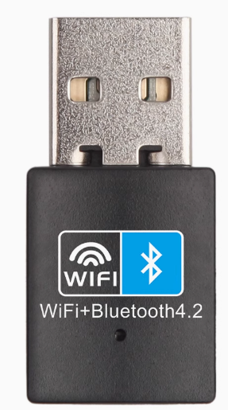
|
[ARM - A9 🟢](./rtl8723du_arm_a9)
[ARM64 - A35 🟡](./rtl8723du_arm_a35)
[ARM64 - A53 🟢](./rtl8723du_arm_a53)
STA 🟢
AP 🟡|
|||||||
|
USB 2.0|
RTL8811 [A] U
Dongle|
5.4[ARM-A9/53]
6.1.111-rt42[ARM-A35]|rtw_core.ko
rtw_usb.ko
rtw_88xxa.ko
rtw_8821a.ko
rtw_8821au.ko|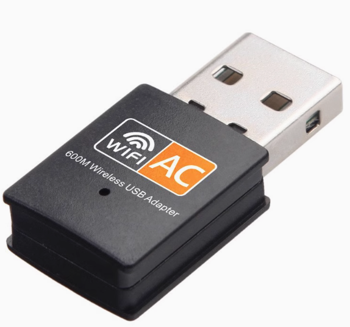|
[ARM - A9 🟡](./rtl8811au_arm_a9)
[ARM64 - A35 🟡](./rtl8811au_arm_a35)
[ARM64 - A53 🟡](./rtl8811au_arm_a53)
STA 🟡
AP 🔴|
|
USB 2.0|RTL8811 [C] U
Module|
5.4[ARM-A9]|
rtw_core.ko
rtw_usb.ko
rtw_8821c.ko
rtw_8821cu.ko||
[ARM - A9 🟡](./rtl8811cu_arm_a9)
STA 🔴
AP 🟢|
|||||||
|
USB 2.0 (Only 2.4G)
USB 3.0 (HW Mod. 2.4G Only)|
RTL8812 [A] U
Dongle|
5.4[ARM-A9/53]
6.1.111-rt42[ARM-A35]|
rtw_core.ko
rtw_usb.ko
rtw_88xxa.ko
rtw_8812a.ko
rtw_8812au.ko|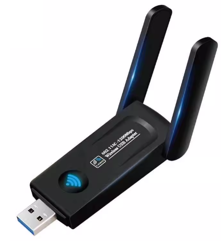|
[ARM - A9 🟢](./rtl8812au_arm_a9)
[ARM64 - A35 🟡](./rtl8812au_arm_a35)
[ARM64 - A53 🟢](./rtl8812au_arm_a53)
[ARM64 - A53 USB 3.0 🟢](./rtl8812au_arm_a53_usb3)
STA 🟢
AP 🟡|
|
USB 2.0
USB 3.0|
RTL8812 [A] U
USB PCBA|
6.1.111-rt42[ARM-A35]
5.4[ARM-A53]|
rtw_core.ko
rtw_usb.ko
rtw_88xxa.ko
rtw_8812a.ko
rtw_8812au.ko|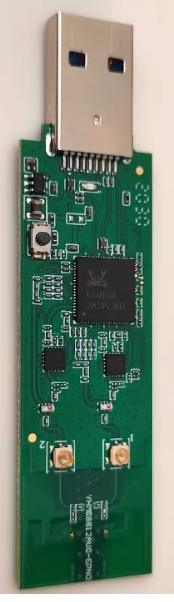|
[ARM64 - A35 USB 2.0 🟢](./rtl8812au_arm_a35_usb2_5g)
[ARM64 - A53 USB 3.0 🟢](./rtl8812au_arm_a53_usb3_5g)
STA 🟢
AP 🟡|
|
USB 2.0|
RTL8812 [B] U
USB PCBA|
5.4[ARM-A9/53]
6.1.111-rt42[ARM-A35]|
rtw_core.ko
rtw_usb.ko
rtw_8822b.ko
rtw_8822bu.ko|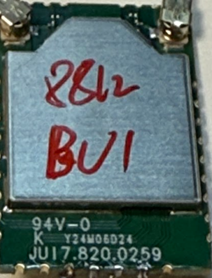|
[ARM - A9 🟢](./rtl8812bu_arm_a9)
[ARM64 - A35 🟡](./rtl8812bu_arm_a35)
[ARM64 - A53 🟢](./rtl8812bu_arm_a53)
STA 🟢
AP 🟡|
|
USB 2.0|RTL8812 [C] U
USB PCBA|
5.4[ARM-A9/53]
6.1.111-rt42[ARM-A35]|
rtw_core.ko
rtw_usb.ko
rtw_8822c.ko
rtw_8822cu.ko|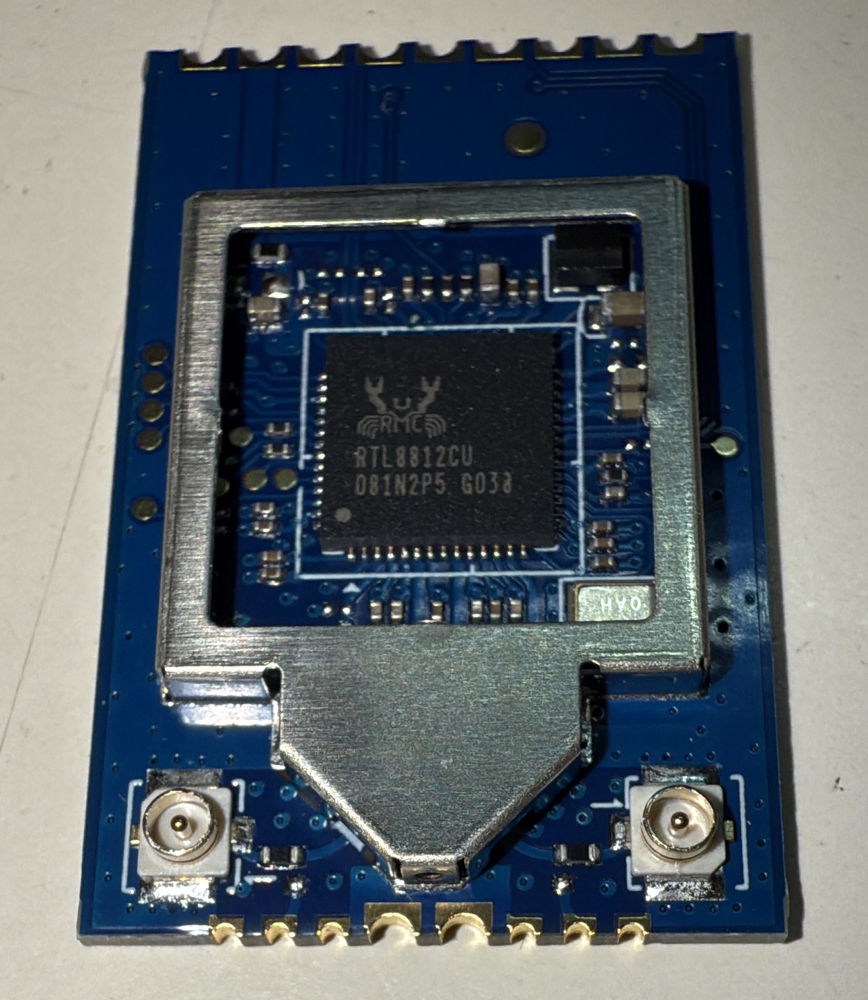|
ARM - A9 ⏳
[ARM64 - A35 🟢](./rtl8812cu_arm_a35)
[ARM64 - A53 🟢](./rtl8812cu_arm_a53)
STA 🟢
AP 🟡|
|||||||
|
USB 2.0|RTL8814 [A] U
USB PCBA|
5.4[ARM-A9/53]
6.1.111-rt42[ARM-A35]|
rtw_core.ko
rtw_usb.ko
rtw_8814a.ko
rtw_8814au.ko|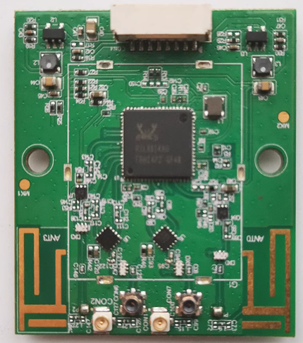|
[ARM - A9 🟡](./rtl8814au_arm_a9)
[ARM64 - A35 🟡](./rtl8814au_arm_a35)
[ARM64 - A53 🟡](./rtl8814au_arm_a53)
STA 🟢
AP 🟡|
|||||||
|
USB 2.0|RTL8821 [A] U
Module|
5.4[ARM-A9]||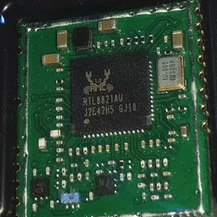|
[ARM - A9 🟢](./rtl8821au_arm_a9)
ARM64 - A35 ⏳
ARM64 - A53 ⏳
STA 🟢
AP 🟡|
|
USB 2.0|RTL8821 [C] U
Dongle|
5.4[ARM-A9]
6.1.111-rt42[ARM-A35]|
rtw_core.ko
rtw_usb.ko
rtw_8821c.ko
rtw_8821cu.ko|
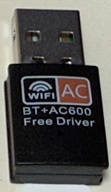|
[ARM - A9 🟡](./rtl8821cu_arm_a9)
ARM64 - A35 ⏳
[ARM64 - A53 🟢](./rtl8821cu_arm_a53)
STA 🟢
AP 🟡|
|
USB 2.0|RTL8821 [C] U
Dongle|
5.4[ARM-A9/53]
6.1.111-rt42[ARM-A35]|
rtw_core.ko
rtw_usb.ko
rtw_8821c.ko
rtw_8821cu.ko|
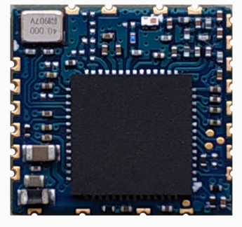|
[ARM - A9 🟡](./rtl8821cu_arm_a9_pcba)
STA 🟡
AP ⏳|
|||||||
|
USB 2.0
USB 3.0|RTL8822 [B] U
Dongle|
5.4[ARM-A9/53]
6.1.111-rt42[ARM-A35]|
rtw_core.ko
rtw_usb.ko
rtw_8822b.ko
rtw_8822bu.ko|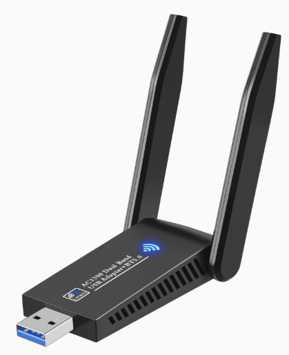|
[ARM - A9 🟢](./rtl8822bu_arm_a9)
ARM64 - A35 🟡
[ARM64 - A53 🟡](./rtl8822bu_arm_a53)
STA 🟢
AP 🟡||
|
USB 2.0|RTL8822 [C] U
Module|
5.4[ARM-A9/53]
6.1.111-rt42[ARM-A35]|
rtw_core.ko
rtw_usb.ko
rtw_8822c.ko
rtw_8822cu.ko|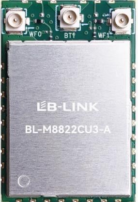|
ARM - A9 ⏳
[ARM - A35 🟢](./rtl8822cu_arm_a35)
ARM - A53 ⏳
STA 🟢
AP 🟢|
|||||||
|SDIO|RTL8723 [D] S
Custom HW|
5.4[ARM-A9/53]|
rtw_core.ko
rtw_sdio.ko
rtw_8723x.ko
rtw_8723d.ko
rtw_8723ds.ko|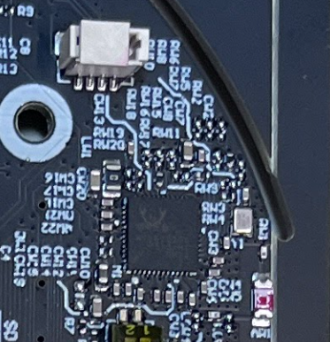|
ARM - A9 🟢
STA ⏳
AP ⏳|
|SDIO|RTL8723 [D] S
Module HW|
6.1.111-rt42[ARM-A35]|
rtw_core.ko
rtw_sdio.ko
rtw_8723x.ko
rtw_8723d.ko
rtw_8723ds.ko|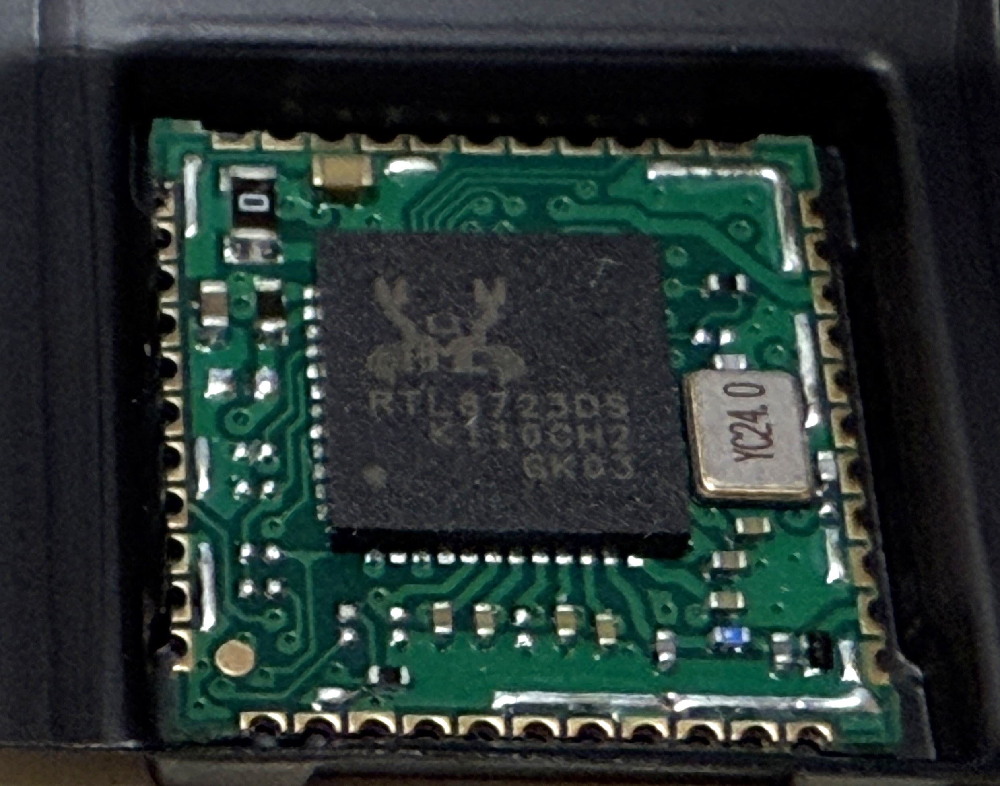|
ARM64 - A35 🟡
STA ⏳
AP ⏳|
|||||||
|SDIO|RTL8821 [C] S
PCBA EVM|
6.1.111-rt42[ARM-A35]|
rtw_core.ko
rtw_sdio.ko
rtw_8821c.ko
rtw_8821cs.ko|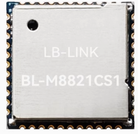|
[ARM - A35 🔴](./rtl8821cs_arm_a35)
STA 🔴
AP 🔴|
|||||||
|SDIO|RTL8822 [B] S
PCBA EVM|
6.1.111-rt42[ARM-A35]|
rtw_core.ko
rtw_sdio.ko
rtw_8822b.ko
rtw_8822bs.ko|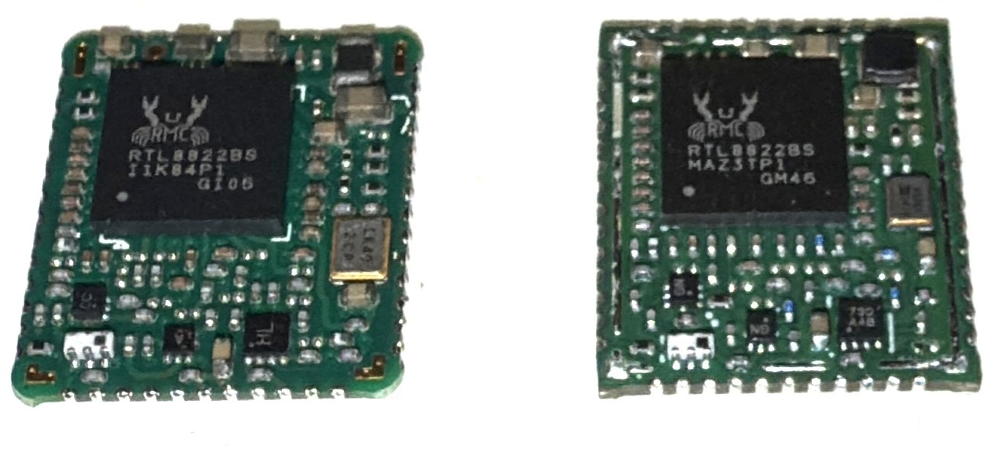|
[ARM - A35 (High-Speed) 🟡](./rtl8822bs_arm_a35)
STA 🟡
AP 🔴|
|SDIO|RTL8822 [C] S
PCBA EVM|
6.1.111-rt42[ARM-A35]|
rtw_core.ko
rtw_sdio.ko
rtw_8822c.ko
rtw_8822cs.ko|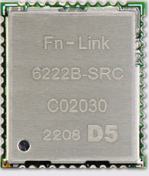|⏳|
|||||||
|PCIe|RTL8723 [D] E
M.2 Card|
5.4[ARM-A53]|
rtw_core.ko|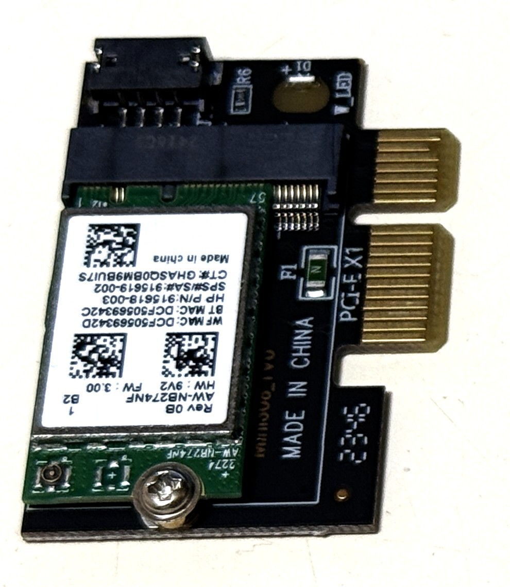|⏳|
|||||||
|PCIe|RTL8821 [C] E
M.2 Card|
5.4[ARM-A53]|
rtw_core.ko|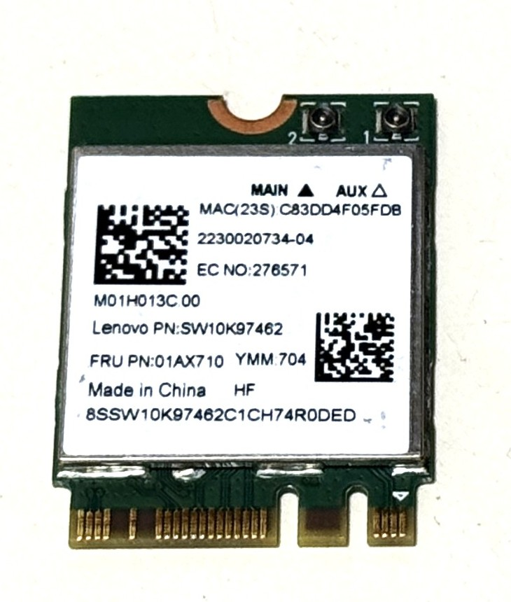|⏳|
|||||||
|PCIe|RTL8822 [B] E
M.2 Card|
5.4[ARM-A53]|
rtw_core.ko|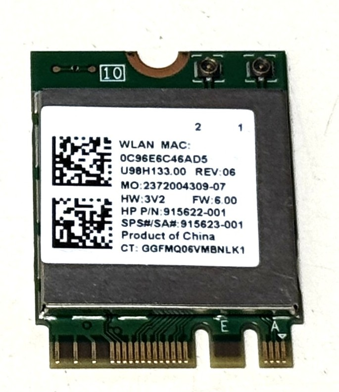|⏳|
|PCIe|RTL8822 [C] E
M.2 Card|
5.4[ARM-A53]|
rtw_core.ko|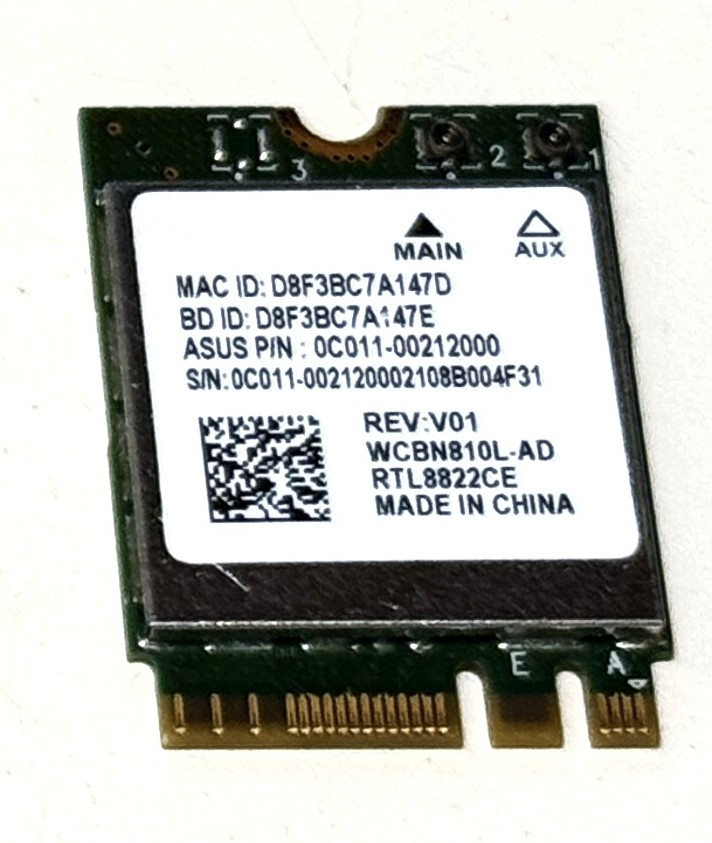|⏳|

