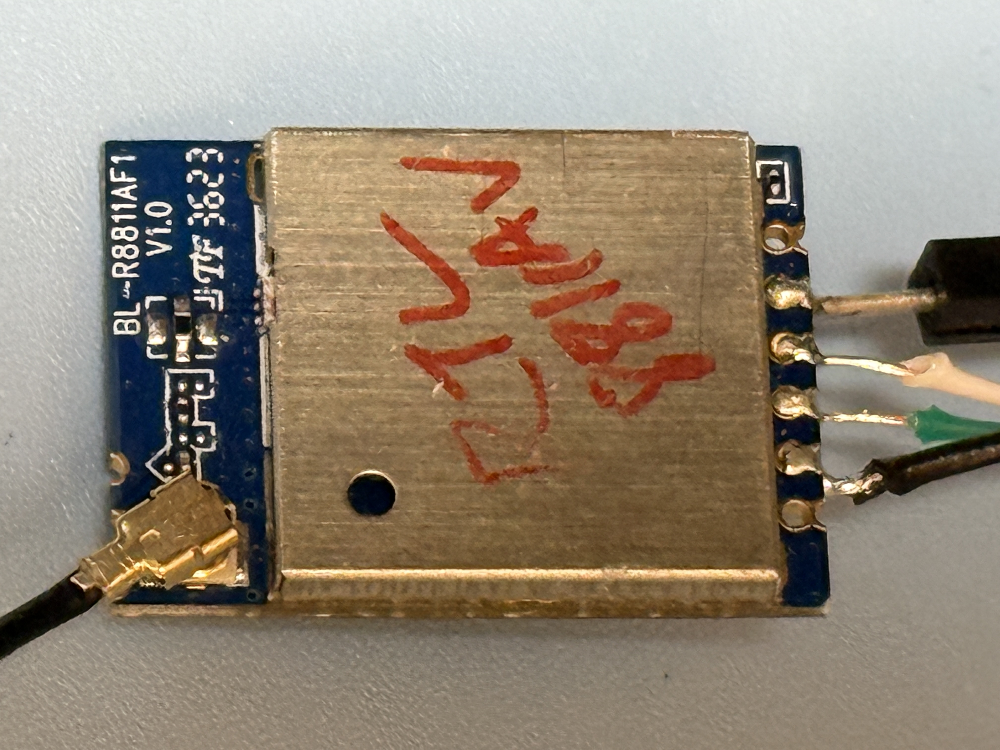
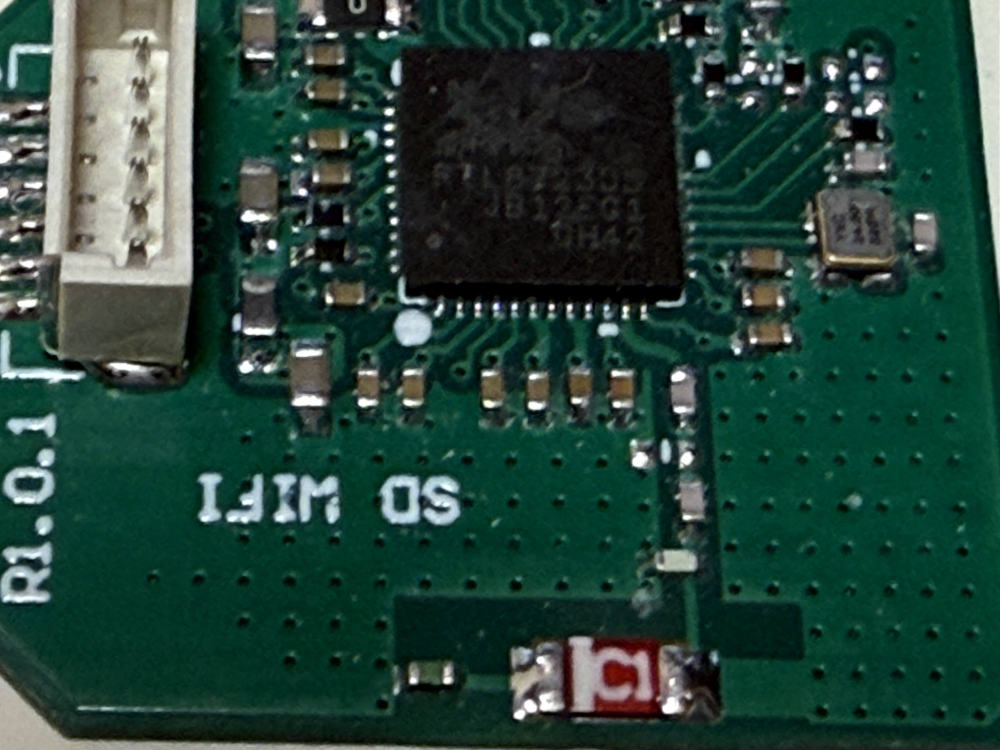

# RTW88 Hardware Testing

### This repository is aim to provide RTW88 Community Driver Hardware Support Status Over ARM-Based Devices (FPSOC)

Test Version: [58638cb909377bed524ac9aad0ce7cefc1a037da](https://github.com/lwfinger/rtw88/tree/386382ace137f5209e8e83a4cf2e044bf52e8b38)

## iperf3 @ AP/STA test explain

Bluetooth speaker is used to trigger possible warning/error messages.

HOW TO DO: During the iperf3 test disconnect and reconnect the Bluetooth device and play music.

## Known Issue

2.4G WIFI band could be disturbed by nearby Bluetooth Devices and possible ZigBee Devices as well!

https://github.com/lwfinger/rtw88/issues/271#issuecomment-2566392845

## Issue found during testing

> I1: RTL8822BS is connected to merged 2.4G+5G Router.
> 
> Both 2.4G and 5G cannot connect under SDIO High-Speed Profile.

> I2: RTW88 supported devices have issue on same 2.4G/5G SSID WIFI
> 
> Defining band=[bg/a] in the  /etc/NetworkManager/system-connections/... to force it enters a 2G/5G
> 
> still introducing hard time to switch channels / frequencies.

> I3: RTL8811AU USB Dongle
>
> This dongle have trouble on connecting 5G/2G STA
>
> According to quick hardware inspection, it is highly due to
>
> poor IFA antenna design, no diplexer is used
>
> When module is used and cross-compare no issue is found.

> I4: RTL8811CU Module
>
> STA 5G is stuck in authenticate time out.
>
> Possible factors are the internal EFUSE is missing and dBm value on 5G are all messed up.
>
> Cross-compared with vendor driver can connect to 5G poorly which indicates 5G channel is problematic.

## SDIO Devices Investigation on RTW88

Both A53 and A35 test gear is used to verify the RTW88 SDIO supported WIFI chips.

> I1: According to A35 DUT tested result.
> 
> DTS/DTSI device tree SDIO profile could introduce unstable issue on RTW88 or possible crashes.
>
> All SDIO should first detected from low clock speed then enter high speed frequency ranges.
> 
> Most SDIO explain could be found [here](https://www.prodigytechno.com/sdio-protocol).

> I2: Test gear limitation: due to most FPSOC board do not introduce two SDIO or solderable PCB slot.
>
> All possible setup/hold time slacks are not tested and cannot sure!
>
> What the follow setup runs are most likely stable enough to use.

Low-Speed / High-Speed profile (4bits) is deployed with RTW88 driver

|Testbench|Device|Speed Profile|Issue|Vendor Driver|
|:---:|:---:|:---:|:---:|:---:|
|A35 ARM|RTL8723DS|Low-Speed|🟡 AP Not Working|🟢|
|A35 ARM|RTL8821CS|Low-Speed|🔴 Crash on WIFI connection "Unable to Use"|🟢|
|A35 ARM|RTL8822BS|Low-Speed|⏳|❌ Support upto Kernel 5.4|
|A35 ARM|RTL8822CS|Low-Speed|🔴 Crash Message but no System Hang|🟢|
||||||
|A35 ARM|RTL8723DS|High-Speed|🟡 AP Not Working|🟢|
|A35 ARM|RTL8821CS|High-Speed|🟡 AP Not Working|🟢|
|A35 ARM|RTL8822BS|High-Speed|🟡 AP Not Working|❌ Support upto Kernel 5.4|
|A35 ARM|RTL8822CS|High-Speed|🟡 AP Not Working|🟢|

## PCIe M.2 A+E aka NGFF

> Issue 1:
>
> All card had been tested under Windows platform before the below claims.
>
> Possible PCIe root complex driver issue.

>  Issue 2:
>
> Crash report:
>
<details>
  
<summary>crash</summary>

```

01:00.0 Network controller: Realtek Semiconductor Co., Ltd. RTL8822BE 802.11a/b/g/n/ac WiFi adapter
        Subsystem: Hewlett-Packard Company Device 831b
        Control: I/O- Mem- BusMaster- SpecCycle- MemWINV- VGASnoop- ParErr- Stepping- SERR- FastB2B- DisINTx-
        Status: Cap+ 66MHz- UDF- FastB2B- ParErr- DEVSEL=fast >TAbort- <TAbort- <MAbort- >SERR- <PERR- INTx-
        Interrupt: pin A routed to IRQ 255
        Region 0: I/O ports at <unassigned> [disabled]
        Region 2: Memory at e0000000 (64-bit, non-prefetchable) [disabled] [size=64K]
        Capabilities: [40] Power Management version 3
                Flags: PMEClk- DSI- D1+ D2+ AuxCurrent=375mA PME(D0+,D1+,D2+,D3hot+,D3cold+)
                Status: D0 NoSoftRst+ PME-Enable- DSel=0 DScale=0 PME-
        Capabilities: [50] MSI: Enable- Count=1/1 Maskable- 64bit+
                Address: 0000000000000000  Data: 0000
        Capabilities: [70] Express (v2) Endpoint, MSI 00
                DevCap: MaxPayload 128 bytes, PhantFunc 0, Latency L0s <4us, L1 <64us
                        ExtTag- AttnBtn- AttnInd- PwrInd- RBE+ FLReset- SlotPowerLimit 0.000W
                DevCtl: Report errors: Correctable- Non-Fatal- Fatal- Unsupported-
                        RlxdOrd+ ExtTag- PhantFunc- AuxPwr- NoSnoop-
                        MaxPayload 128 bytes, MaxReadReq 512 bytes
                DevSta: CorrErr- UncorrErr- FatalErr- UnsuppReq- AuxPwr+ TransPend-
                LnkCap: Port #0, Speed 2.5GT/s, Width x1, ASPM L0s L1, Exit Latency L0s <512ns, L1 <64us
                        ClockPM+ Surprise- LLActRep- BwNot- ASPMOptComp-
                LnkCtl: ASPM Disabled; RCB 64 bytes Disabled- CommClk-
                        ExtSynch- ClockPM- AutWidDis- BWInt- AutBWInt-
                LnkSta: Speed 2.5GT/s, Width x1, TrErr- Train- SlotClk+ DLActive- BWMgmt- ABWMgmt-
                DevCap2: Completion Timeout: Not Supported, TimeoutDis+, LTR+, OBFF Via message/WAKE#
                DevCtl2: Completion Timeout: 50us to 50ms, TimeoutDis-, LTR+, OBFF Disabled
                LnkCtl2: Target Link Speed: 5GT/s, EnterCompliance- SpeedDis-
                         Transmit Margin: Normal Operating Range, EnterModifiedCompliance- ComplianceSOS-
                         Compliance De-emphasis: -6dB
                LnkSta2: Current De-emphasis Level: -3.5dB, EqualizationComplete-, EqualizationPhase1-
                         EqualizationPhase2-, EqualizationPhase3-, LinkEqualizationRequest-
        Capabilities: [100 v2] Advanced Error Reporting
                UESta:  DLP- SDES- TLP- FCP- CmpltTO- CmpltAbrt- UnxCmplt- RxOF- MalfTLP- ECRC- UnsupReq- ACSViol-
                UEMsk:  DLP- SDES- TLP- FCP- CmpltTO- CmpltAbrt- UnxCmplt- RxOF- MalfTLP- ECRC- UnsupReq- ACSViol-
                UESvrt: DLP+ SDES+ TLP- FCP+ CmpltTO- CmpltAbrt- UnxCmplt- RxOF+ MalfTLP+ ECRC- UnsupReq- ACSViol-
                CESta:  RxErr- BadTLP- BadDLLP- Rollover- Timeout- NonFatalErr-
                CEMsk:  RxErr- BadTLP- BadDLLP- Rollover- Timeout- NonFatalErr+
                AERCap: First Error Pointer: 00, GenCap+ CGenEn- ChkCap+ ChkEn-
        Capabilities: [148 v1] Device Serial Number 00-e0-4c-ff-fe-b8-22-01
        Capabilities: [158 v1] Latency Tolerance Reporting
                Max snoop latency: 0ns
                Max no snoop latency: 0ns
        Capabilities: [160 v1] L1 PM Substates
                L1SubCap: PCI-PM_L1.2- PCI-PM_L1.1- ASPM_L1.2- ASPM_L1.1- L1_PM_Substates-
                L1SubCtl1: PCI-PM_L1.2- PCI-PM_L1.1- ASPM_L1.2- ASPM_L1.1-

                L1SubCtl2:


[   40.800373] (null) : failed to allocate tx ring
[   40.804907] (null) : failed to allocate pci resources
[   40.805783] Unable to handle kernel paging request at virtual address 00ffff800010cbab
[   40.809959] (null) : failed to setup pci resources
[   40.822683] Mem abort info:
[   40.825475]   ESR = 0x96000004
[   40.828516]   EC = 0x25: DABT (current EL), IL = 32 bits
[   40.833816]   SET = 0, FnV = 0
[   40.836856]   EA = 0, S1PTW = 0
[   40.839987] Data abort info:
[   40.842860]   ISV = 0, ISS = 0x00000004
[   40.846688]   CM = 0, WnR = 0
[   40.849648] [00ffff800010cbab] address between user and kernel address ranges
[   40.856777] Internal error: Oops: 96000004 [#1] SMP
[   40.861638] Modules linked in: rtw_8822be(O+) rtw_8822b(O) rtw_pci(O) rtw_core(O)
[   40.869115] CPU: 0 PID: 340 Comm: systemd-journal Tainted: G        W  O      5.4.0 #1
[   40.877018] Hardware name: ZYNQ_MP (DT)
[   40.880839] pstate: 40000005 (nZcv daif -PAN -UAO)
[   40.885619] pc : sysfs_kf_seq_show+0x8c/0x138
[   40.889963] lr : sysfs_kf_seq_show+0x8c/0x138
[   40.894300] sp : ffff800011363cc0
[   40.897599] x29: ffff800011363cc0 x28: ffff00005f727f40
[   40.902894] x27: 0000000000400cc0 x26: ffff00005f727f28
[   40.908188] x25: 0000000000001000 x24: 0000aaaae831fd30
[   40.913483] x23: ffff00005c237400 x22: ffff00005cb5d8b0
[   40.918778] x21: 00ffff800010cbab x20: ffff00005f727f00
[   40.924073] x19: 0000000000001000 x18: 0000000000000000
[   40.929368] x17: 0000000000000000 x16: 0000000000000000
[   40.934663] x15: 0000000000000000 x14: 0000000000000000
[   40.939957] x13: 0000000000000000 x12: 0000000000000000
[   40.945252] x11: 0000000000000000 x10: 0000000000000000
[   40.950547] x9 : 0000000000000000 x8 : ffff000059a43000
[   40.955842] x7 : 0000000000000000 x6 : 000000000000003f
[   40.961137] x5 : 0000000000000040 x4 : 0000000000000000
[   40.966432] x3 : 0000000000000004 x2 : 0000000000000000
[   40.971726] x1 : 0000000000000000 x0 : ffff000059a42000
[   40.977022] Call trace:
[   40.979455]  sysfs_kf_seq_show+0x8c/0x138
[   40.983455]  kernfs_seq_show+0x28/0x30
[   40.987189]  seq_read+0x140/0x458
[   40.990486]  kernfs_fop_read+0x24/0x1d8
[   40.994306]  __vfs_read+0x18/0x40
[   40.997603]  vfs_read+0xb8/0x190
[   41.000815]  ksys_read+0x68/0xf0
[   41.004027]  __arm64_sys_read+0x18/0x20
[   41.007849]  el0_svc_common.constprop.0+0x68/0x160
[   41.012630]  el0_svc_handler+0x6c/0x88
[   41.016362]  el0_svc+0x8/0xc
[   41.019230] Code: aa0403e0 d2820002 52800001 942500a4 (f94002a3)
[   41.025311] ---[ end trace 5ec8fb9b0f38104c ]---
[   41.034594] systemd[1]: systemd-journald.service: Service has no hold-off time, scheduling restart.
[   41.043885] systemd[1]: systemd-journald.service: Scheduled restart job, restart counter is at 1.
[   41.043890] Unable to handle kernel NULL pointer dereference at virtual address 0000000000000010
[   41.043894] Mem abort info:
[   41.053160] systemd[1]: Stopped Flush Journal to Persistent Storage.
[   41.061514]   ESR = 0x96000004
[   41.061517]   EC = 0x25: DABT (current EL), IL = 32 bits
[   41.061519]   SET = 0, FnV = 0
[   41.061521]   EA = 0, S1PTW = 0
[   41.061522] Data abort info:
[   41.061525]   ISV = 0, ISS = 0x00000004
[   41.064389] systemd[1]: Stopping Flush Journal to Persistent Storage...
[   41.070636]   CM = 0, WnR = 0
[   41.070640] user pgtable: 4k pages, 48-bit VAs, pgdp=00000000599b7000
[   41.070642] [0000000000000010] pgd=0000000000000000
[   41.070648] Internal error: Oops: 96000004 [#2] SMP
[   41.073718] systemd[1]: Stopped Journal Service.
[   41.078978] Modules linked in: rtw_8822be(O+) rtw_8822b(O) rtw_pci(O) rtw_core(O)
[   41.083805] systemd[1]: Starting Journal Service...
[   41.085155] CPU: 1 PID: 19 Comm: kworker/1:1 Tainted: G      D W  O      5.4.0 #1
[   41.141922] Hardware name: ZYNQ_MP (DT)
[   41.145755] Workqueue: events request_firmware_work_func
[   41.151051] pstate: 00000085 (nzcv daIf -PAN -UAO)
[   41.155826] pc : devres_find+0x6c/0xf8
[   41.159566] lr : fw_add_devm_name+0x34/0xc0
[   41.163730] sp : ffff800011203c00
[   41.167029] x29: ffff800011203c00 x28: ffff00005c3af000
[   41.172323] x27: ffff00005c24f980 x26: ffff800010cbbe88
[   41.177618] x25: 0000000000000000 x24: ffff00005cb5db38
[   41.182913] x23: ffff800010697df0 x22: ffff00005c24f900
[   41.188208] x21: ffff800010697dd8 x20: ffff00005cb5d8a0
[   41.193503] x19: 0000000000000000 x18: 0000000000000000
[   41.198798] x17: 0000000000000000 x16: 0000000000000000
[   41.204092] x15: 0000000000000000 x14: 6d00f7016c14f4a1
[   41.209387] x13: 3faf18006e086c10 x12: f4a19ab4f4416a20
[   41.214682] x11: f0303faf18006e01 x10: 67b167903faf1800
[   41.219977] x9 : 6e006d2067903faf x8 : ffff00005c1af800
[   41.225272] x7 : 000000000000001c x6 : ffff00005c24f998
[   41.230567] x5 : 0000000000000000 x4 : 0000000000000000
[   41.235862] x3 : 0000000000000001 x2 : 0000000000000000
[   41.241156] x1 : 0000000000000000 x0 : ffff00005cb5db30
[   41.246451] Call trace:
[   41.248885]  devres_find+0x6c/0xf8
[   41.252269]  fw_add_devm_name+0x34/0xc0
[   41.256089]  assign_fw+0x104/0x170
[   41.259474]  _request_firmware+0x2dc/0x560
[   41.263554]  request_firmware_work_func+0x38/0x88
[   41.268242]  process_one_work+0x1c4/0x338
[   41.272242]  worker_thread+0x4c/0x488
[   41.275888]  kthread+0x120/0x128
[   41.279100]  ret_from_fork+0x10/0x18
[   41.282662] Code: f9415293 910a6298 eb18027f 54000140 (f9400a63)
[   41.288743] ---[ end trace 5ec8fb9b0f38104d ]---
[   41.323855] systemd-journald[479]: File /var/log/journal/354cb27db06e45ffad2d0d675d5f8401/system.journal corrupted or uncleanly shut down, renaming and replacing.
[   41.370132] Unable to handle kernel paging request at virtual address 00ffff800010cbab
[   41.378052] Mem abort info:
[   41.380828]   ESR = 0x96000004
[   41.383877]   EC = 0x25: DABT (current EL), IL = 32 bits
[   41.389177]   SET = 0, FnV = 0
[   41.392223]   EA = 0, S1PTW = 0
[   41.395356] Data abort info:
[   41.398229]   ISV = 0, ISS = 0x00000004
[   41.402058]   CM = 0, WnR = 0
[   41.405011] [00ffff800010cbab] address between user and kernel address ranges
[   41.412137] Internal error: Oops: 96000004 [#3] SMP
[   41.416998] Modules linked in: rtw_8822be(O+) rtw_8822b(O) rtw_pci(O) rtw_core(O)
[   41.424476] CPU: 0 PID: 479 Comm: systemd-journal Tainted: G      D W  O      5.4.0 #1
[   41.432379] Hardware name: ZYNQ_MP (DT)
[   41.436201] pstate: 40000005 (nZcv daif -PAN -UAO)
[   41.440980] pc : sysfs_kf_seq_show+0x8c/0x138
[   41.445323] lr : sysfs_kf_seq_show+0x8c/0x138
[   41.449661] sp : ffff800011363cc0
[   41.452960] x29: ffff800011363cc0 x28: ffff000056d558c0
[   41.458254] x27: 0000000000400cc0 x26: ffff000056d558a8
[   41.463549] x25: 0000000000001000 x24: 0000aaab00a3cbf0
[   41.468844] x23: ffff000056cb4700 x22: ffff00005cb5d8b0
[   41.474139] x21: 00ffff800010cbab x20: ffff000056d55880
[   41.479433] x19: 0000000000001000 x18: 0000000000000000
[   41.484728] x17: 0000000000000000 x16: 0000000000000000
[   41.490023] x15: 0000000000000000 x14: 0000000000000000
[   41.495318] x13: 0000000000000000 x12: 0000000000000000
[   41.500613] x11: 0000000000000000 x10: 0000000000000000
[   41.505908] x9 : 0000000000000000 x8 : ffff000059a43000
[   41.511203] x7 : 0000000000000000 x6 : 000000000000003f
[   41.516497] x5 : 0000000000000040 x4 : 0000000000000000
[   41.521792] x3 : 0000000000000004 x2 : 0000000000000000
[   41.527087] x1 : 0000000000000000 x0 : ffff000059a42000
[   41.532382] Call trace:
[   41.534816]  sysfs_kf_seq_show+0x8c/0x138
[   41.538816]  kernfs_seq_show+0x28/0x30
[   41.542549]  seq_read+0x140/0x458
[   41.545847]  kernfs_fop_read+0x24/0x1d8
[   41.549667]  __vfs_read+0x18/0x40
[   41.552964]  vfs_read+0xb8/0x190
[   41.556176]  ksys_read+0x68/0xf0
[   41.559388]  __arm64_sys_read+0x18/0x20
[   41.563209]  el0_svc_common.constprop.0+0x68/0x160
[   41.567990]  el0_svc_handler+0x6c/0x88
[   41.571722]  el0_svc+0x8/0xc
[   41.574591] Code: aa0403e0 d2820002 52800001 942500a4 (f94002a3)
[   41.580672] ---[ end trace 5ec8fb9b0f38104e ]---
[   41.587019] systemd[1]: systemd-journald.service: Main process exited, code=killed, status=11/SEGV
[   41.596265] systemd[1]: systemd-journald.service: Failed with result 'signal'.
[   41.604347] systemd[1]: Failed to start Journal Service.
[   41.609985] systemd[1]: Dependency failed for Flush Journal to Persistent Storage.
[   41.964053] systemd-journald[480]: File /var/log/journal/354cb27db06e45ffad2d0d675d5f8401/system.journal corrupted or uncleanly shut down, renaming and replacing.
[   42.005410] Unable to handle kernel paging request at virtual address 00ffff800010cbab
[   42.013323] Mem abort info:
[   42.016116]   ESR = 0x96000004
[   42.019162]   EC = 0x25: DABT (current EL), IL = 32 bits
[   42.024464]   SET = 0, FnV = 0
[   42.027513]   EA = 0, S1PTW = 0
[   42.030644] Data abort info:
[   42.033517]   ISV = 0, ISS = 0x00000004
[   42.037338]   CM = 0, WnR = 0
[   42.040297] [00ffff800010cbab] address between user and kernel address ranges
[   42.047427] Internal error: Oops: 96000004 [#4] SMP
[   42.052294] Modules linked in: rtw_8822be(O+) rtw_8822b(O) rtw_pci(O) rtw_core(O)
[   42.059771] CPU: 1 PID: 480 Comm: systemd-journal Tainted: G      D W  O      5.4.0 #1
[   42.067675] Hardware name: ZYNQ_MP (DT)
[   42.071496] pstate: 40000005 (nZcv daif -PAN -UAO)
[   42.076275] pc : sysfs_kf_seq_show+0x8c/0x138
[   42.080619] lr : sysfs_kf_seq_show+0x8c/0x138
[   42.084956] sp : ffff800011363cc0
[   42.088255] x29: ffff800011363cc0 x28: ffff00005b6e5b40
[   42.093550] x27: 0000000000400cc0 x26: ffff00005b6e5b28
[   42.098845] x25: 0000000000001000 x24: 0000aaaade04abf0
[   42.104140] x23: ffff000056cb4100 x22: ffff00005cb5d8b0
[   42.109434] x21: 00ffff800010cbab x20: ffff00005b6e5b00
[   42.114729] x19: 0000000000001000 x18: 0000000000000000
[   42.120024] x17: 0000000000000000 x16: 0000000000000000
[   42.125319] x15: 0000000000000000 x14: 0000000000000000
[   42.130614] x13: 0000000000000000 x12: 0000000000000000
[   42.135908] x11: 0000000000000000 x10: 0000000000000000
[   42.141203] x9 : 0000000000000000 x8 : ffff000056d6d000
[   42.146498] x7 : 0000000000000000 x6 : 000000000000003f
[   42.151793] x5 : 0000000000000040 x4 : 0000000000000000
[   42.157088] x3 : 0000000000000004 x2 : 0000000000000000
[   42.162383] x1 : 0000000000000000 x0 : ffff000056d6c000
[   42.167678] Call trace:
[   42.170111]  sysfs_kf_seq_show+0x8c/0x138
[   42.174103]  kernfs_seq_show+0x28/0x30
[   42.177836]  seq_read+0x140/0x458
[   42.181134]  kernfs_fop_read+0x24/0x1d8
[   42.184953]  __vfs_read+0x18/0x40
[   42.188251]  vfs_read+0xb8/0x190
[   42.191463]  ksys_read+0x68/0xf0
[   42.194674]  __arm64_sys_read+0x18/0x20
[   42.198496]  el0_svc_common.constprop.0+0x68/0x160
[   42.203277]  el0_svc_handler+0x6c/0x88
[   42.207010]  el0_svc+0x8/0xc
[   42.209878] Code: aa0403e0 d2820002 52800001 942500a4 (f94002a3)
[   42.215958] ---[ end trace 5ec8fb9b0f38104f ]---
[   42.564914] systemd-journald[482]: File /var/log/journal/354cb27db06e45ffad2d0d675d5f8401/system.journal corrupted or uncleanly shut down, renaming and replacing.
```

</details>

|Testbench|Device|Speed Profile|Issue|
|:---:|:---:|:---:|:---:|
|A53 ARM64|RTL8723DE|x1 2.5G 128 Bytes|❓Card Cannot Detect on ARM64 possible PCIe root complex issue.|
|A53 ARM64|RTL8723DE|x1 5.0G 256 Bytes|❓Card Cannot Detect on ARM64 possible PCIe root complex issue.|
|||||
|A53 ARM64|RTL8821CE|x1 2.5G 128 Bytes|❓Card Cannot Detect on ARM64 possible PCIe root complex issue.|
|A53 ARM64|RTL8821CE|x1 5.0G 256 Bytes|❓Card Cannot Detect on ARM64 possible PCIe root complex issue.|
|||||
|A53 ARM64|RTL8822BE|x1 2.5G 128 Bytes|🔴 Card detected, out-off-tree driver load immediately crash.|
|A53 ARM64|RTL8822BE|x1 5.0G 256 Bytes|🔴 Card detected, out-off-tree driver load immediately crash.|
|||||
|A53 ARM64|RTL8822CE|x1 2.5G 128 Bytes|❓Card Cannot Detect on ARM64 possible PCIe root complex issue.|
|A53 ARM64|RTL8822CE|x1 5.0G 256 Bytes|❓Card Cannot Detect on ARM64 possible PCIe root complex issue.|

## Fully RTW88 Driver Support Devices Test Report Table

|Phy Interface|<p>Chip #<p>HW Type|DUT Kernel #|Driver Tree|HW Image|Status|
|:---:|:---|:---|:---:|:---:|---:|
|<p>USB 2.0|<p>RTL8723 [D] U<p>Dongle|<p>5.4[ARM-A9/53]<p>6.1.111-rt42[ARM-A35]|<p>rtw_core.ko<p>rtw_usb.ko<p>rtw_8723x.ko<p>rtw_8723d.ko<p>rtw_8723du.ko|<p><p>|<p>[ARM-A9 🟢](./rtl8723du_arm_a9)<p>[ARM64-A35 🟡](./rtl8723du_arm_a35)<p>[ARM64-A53 🟢](./rtl8723du_arm_a53)<p>STA 🟢<p>AP 🟡|
|||||||
|<p>USB 2.0|<p>RTL8811 [A] U<p>Dongle|<p>5.4[ARM-A9/53]<p>6.1.111-rt42[ARM-A35]|rtw_core.ko<p>rtw_usb.ko<p>rtw_88xxa.ko<p>rtw_8821a.ko<p>rtw_8821au.ko||<p>[ARM-A9 🟡](./rtl8811au_arm_a9)<p>[ARM64-A35 🟡](./rtl8811au_arm_a35)<p>[ARM64-A53 🟡](./rtl8811au_arm_a53)<p>STA 🟡<p>AP 🔴|
|<p>USB 2.0|<p>RTL8811 [A] U<p>Module|<p>5.4[ARM-A9/53]<p>6.1.111-rt42[ARM-A35]|rtw_core.ko<p>rtw_usb.ko<p>rtw_88xxa.ko<p>rtw_8821a.ko<p>rtw_8821au.ko||<p>[ARM-A9 🟢](./rtl8811au_arm_a9_mod)<p>[ARM64-A35 🟢](./rtl8811au_arm_a35_mod)<p>[ARM64-A53 🟢](./rtl8811au_arm_a53_mod)<p>STA 🟢<p>AP 🟡|
|<p>USB 2.0|RTL8811 [C] U<p>Module|<p>5.4[ARM-A9]|<p>rtw_core.ko<p>rtw_usb.ko<p>rtw_8821c.ko<p>rtw_8821cu.ko||<p>[ARM-A9 🟡](./rtl8811cu_arm_a9)<p>STA 🔴<p>AP 🟢|
|||||||
|<p>USB 2.0 (Only 2.4G)<p>USB 3.0 (HW Mod. 2.4G Only)|<p>RTL8812 [A] U<p>Dongle|<p>5.4[ARM-A9/53]<p>6.1.111-rt42[ARM-A35]|<p>rtw_core.ko<p>rtw_usb.ko<p>rtw_88xxa.ko<p>rtw_8812a.ko<p>rtw_8812au.ko||<p>[ARM-A9 🟢](./rtl8812au_arm_a9)<p>[ARM64-A35 🟡](./rtl8812au_arm_a35)<p>[ARM64-A53 🟢](./rtl8812au_arm_a53)<p>[ARM64-A53 USB 3.0 🟢](./rtl8812au_arm_a53_usb3)<p>STA 🟢<p>AP 🟡|
|<p>USB 2.0<p>USB 3.0|<p>RTL8812 [A] U<p>USB PCBA|<p>6.1.111-rt42[ARM-A35]<p>5.4[ARM-A53]|<p>rtw_core.ko<p>rtw_usb.ko<p>rtw_88xxa.ko<p>rtw_8812a.ko<p>rtw_8812au.ko||<p>[ARM64-A35 USB 2.0 🟢](./rtl8812au_arm_a35_usb2_5g)<p>[ARM64-A53 USB 3.0 🟢](./rtl8812au_arm_a53_usb3_5g)<p>STA 🟢<p>AP 🟡|
|<p>USB 2.0|<p>RTL8812 [B] U<p>USB PCBA|<p>5.4[ARM-A9/53]<p>6.1.111-rt42[ARM-A35]|<p>rtw_core.ko<p>rtw_usb.ko<p>rtw_8822b.ko<p>rtw_8822bu.ko||<p>[ARM-A9 🟢](./rtl8812bu_arm_a9)<p>[ARM64-A35 🟡](./rtl8812bu_arm_a35)<p>[ARM64-A53 🟢](./rtl8812bu_arm_a53)<p>STA 🟢<p>AP 🟡|
|<p>USB 2.0|RTL8812 [C] U<p>USB PCBA|<p>5.4[ARM-A9/53]<p>6.1.111-rt42[ARM-A35]|<p>rtw_core.ko<p>rtw_usb.ko<p>rtw_8822c.ko<p>rtw_8822cu.ko||<p>[ARM-A9 🟢](./rtl8812cu_arm_a9)<p>[ARM64-A35 🟢](./rtl8812cu_arm_a35)<p>[ARM64-A53 🟢](./rtl8812cu_arm_a53)<p>STA 🟢<p>AP 🟡|
|||||||
|<p>USB 2.0|RTL8814 [A] U<p>USB PCBA|<p>5.4[ARM-A9/53]<p>6.1.111-rt42[ARM-A35]|<p>rtw_core.ko<p>rtw_usb.ko<p>rtw_8814a.ko<p>rtw_8814au.ko||<p>[ARM-A9 🟡](./rtl8814au_arm_a9)<p>[ARM64-A35 🟡](./rtl8814au_arm_a35)<p>[ARM64-A53 🟡](./rtl8814au_arm_a53)<p>STA 🟢<p>AP 🟡|
|||||||
|<p>USB 2.0|RTL8821 [A] U<p>Module|<p>5.4[ARM-A9]<p>6.1.111-rt42[ARM-A35]|<p>rtw_core.ko<p>rtw_usb.ko<p>rtw_88xxa.ko<p>rtw_8821a.ko<p>rtw_8821au.ko||<p>[ARM-A9 🟢](./rtl8821au_arm_a9)<p>[ARM64-A35 🟢](./rtl8821au_arm_a35)<p>[ARM64-A53 🟢](./rtl8821au_arm_a53)<p>STA 🟢<p>AP 🟡|
|<p>USB 2.0|RTL8821 [C] U<p>Dongle|<p>5.4[ARM-A9]<p>6.1.111-rt42[ARM-A35]|<p>rtw_core.ko<p>rtw_usb.ko<p>rtw_8821c.ko<p>rtw_8821cu.ko|<p>|<p>[ARM-A9 🟡](./rtl8821cu_arm_a9)<p>[ARM64-A35 🟢](./rtl8821cu_arm_a35)<p>[ARM64-A53 🟢](./rtl8821cu_arm_a53)<p>STA 🟢<p>AP 🟡|
|<p>USB 2.0|RTL8821 [C] U<p>Module|<p>5.4[ARM-A9]<p>6.6[ARM-A9]|<p>rtw_core.ko<p>rtw_usb.ko<p>rtw_8821c.ko<p>rtw_8821cu.ko|<p>|<p>[ARM-A9-5.4 🟢](./rtl8821cu_arm_a9_pcba)[ARM-A9-6.6 🟡](./rtl8821cu_arm_a9_pcba_6)<p>STA 🟢<p>AP 🟡|
|||||||
|<p>USB 2.0<p>USB 3.0|RTL8822 [B] U<p>Dongle|<p>5.4[ARM-A9/53]<p>6.1.111-rt42[ARM-A35]|<p>rtw_core.ko<p>rtw_usb.ko<p>rtw_8822b.ko<p>rtw_8822bu.ko||<p>[ARM-A9 🟢](./rtl8822bu_arm_a9)<p>[ARM64-A35 🟡](./rtl8822bu_arm_a35)<p>[ARM64-A53 🟡](./rtl8822bu_arm_a53)<p>STA 🟢<p>AP 🟡||
|<p>USB 2.0|RTL8822 [C] U<p>Module|<p>5.4[ARM-A9/53]<p>6.1.111-rt42[ARM-A35]|<p>rtw_core.ko<p>rtw_usb.ko<p>rtw_8822c.ko<p>rtw_8822cu.ko||<p>[ARM-A9 🟢](./rtl8822cu_arm_a9)<p>[ARM-A35 🟢](./rtl8822cu_arm_a35)<p>[ARM-A53 🟢](./rtl8822cu_arm_a53)<p>STA 🟢<p>AP 🟢|
|||||||
|PCIe|RTL8723 [D] E<p>M.2 Card|<p>5.4[ARM-A53]|<p>rtw_core.ko||❓Card Detect Issue|
|||||||
|PCIe|RTL8821 [C] E<p>M.2 Card|<p>5.4[ARM-A53]|<p>rtw_core.ko||❓Card Detect Issue|
|||||||
|PCIe|RTL8822 [B] E<p>M.2 Card|<p>5.4[ARM-A53]|<p>rtw_core.ko||🔴 Immediate Crash, CPU Stall|
|PCIe|RTL8822 [C] E<p>M.2 Card|<p>5.4[ARM-A53]|<p>rtw_core.ko||❓Card Detect Issue|


### RTW88 Revision - [58638cb909377bed524ac9aad0ce7cefc1a037da](https://github.com/lwfinger/rtw88/tree/386382ace137f5209e8e83a4cf2e044bf52e8b38)

|Phy Interface|<p>Chip #<p>HW Type|DUT Kernel #|Driver Tree|HW Image|Status|
|:---:|:---|:---|:---:|:---:|---:|
|SDIO|RTL8723 [D] S<p>Custom HW|<p>5.4[ARM-A9]|<p>rtw_core.ko<p>rtw_sdio.ko<p>rtw_8723x.ko<p>rtw_8723d.ko<p>rtw_8723ds.ko||<p>ARM-A9 (High-Speed) 🟢<p>STA 🟢<p>AP 🟡|
|SDIO|RTL8723 [D] S<p>Module HW|<p>6.1.111-rt42[ARM-A35]|<p>rtw_core.ko<p>rtw_sdio.ko<p>rtw_8723x.ko<p>rtw_8723d.ko<p>rtw_8723ds.ko||<p>[ARM64-A35 (High-Speed) 🟡](./rtl8723ds_arm_a35_mod)<p>STA 🟢<p>AP 🟡|
|SDIO|RTL8723 [D] S<p>Module HW|<p>6.1.111-rt42[ARM-A35]|<p>rtw_core.ko<p>rtw_sdio.ko<p>rtw_8723x.ko<p>rtw_8723d.ko<p>rtw_8723ds.ko||<p>[ARM64-A35 (High-Speed) 🟡](./rtl8723ds_arm_a35_cus)<p>STA 🟢<p>AP 🟡|
|SDIO|RTL8723 [D] S<p>Custom HW|<p>5.4[ARM-A53]|<p>rtw_core.ko<p>rtw_sdio.ko<p>rtw_8723x.ko<p>rtw_8723d.ko<p>rtw_8723ds.ko||<p>[ARM-A53 (High-Speed) 🟢](./rtl8723ds_arm_a53)<p>STA 🟢<p>AP 🟡|
|||||||
|SDIO|RTL8821 [C] S<p>PCBA EVM|<p>6.1.111-rt42[ARM-A35]|<p>rtw_core.ko<p>rtw_sdio.ko<p>rtw_8821c.ko<p>rtw_8821cs.ko||<p>[ARM-A35 (Low-Speed) 🔴](./rtl8821cs_arm_a35)<p>STA 🔴<p>AP 🔴|
|SDIO|RTL8821 [C] S<p>PCBA EVM|<p>6.1.111-rt42[ARM-A35]|<p>rtw_core.ko<p>rtw_sdio.ko<p>rtw_8821c.ko<p>rtw_8821cs.ko||<p>[ARM-A35 (High-Speed) 🟡](./rtl8821cs_arm_a35_hs)<p>STA 🟢<p>AP 🟡|
|SDIO|RTL8821 [C] S<p>PCBA EVM|<p>6.1.111-rt42[ARM-A35]|<p>rtw_core.ko<p>rtw_sdio.ko<p>rtw_8821c.ko<p>rtw_8821cs.ko||<p>[ARM-A35 (High-Speed) 🟡](./rtl8821cs_arm_a35_hs)<p>STA 🟢<p>AP 🟡|
|SDIO|RTL8821 [C] S<p>PCBA EVM|<p>5.4[ARM-A53]|<p>rtw_core.ko<p>rtw_sdio.ko<p>rtw_8821c.ko<p>rtw_8821cs.ko||<p>[ARM-A53 (High-Speed) 🟡](./rtl8821cs_arm_a53)<p>STA 🟢<p>AP 🟡|
|||||||
|SDIO|RTL8822 [B] S<p>PCBA EVM|<p>6.1.111-rt42[ARM-A35]|<p>rtw_core.ko<p>rtw_sdio.ko<p>rtw_8822b.ko<p>rtw_8822bs.ko||<p>[ARM-A35 (High-Speed) 🟡](./rtl8822bs_arm_a35)<p>STA 🟢<p>AP 🟡|
|SDIO|RTL8822 [B] S<p>PCBA EVM|<p>5.4[ARM-A53]|<p>rtw_core.ko<p>rtw_sdio.ko<p>rtw_8822b.ko<p>rtw_8822bs.ko||<p>[ARM-A53 (High-Speed) 🟡](./rtl8822bs_arm_a53)<p>STA 🟢<p>AP 🟡|
|SDIO|RTL8822 [C] S<p>PCBA EVM|<p>6.1.111-rt42[ARM-A35]|<p>rtw_core.ko<p>rtw_sdio.ko<p>rtw_8822c.ko<p>rtw_8822cs.ko||<p>[ARM-A35 (High-Speed) 🟡](./rtl8822cs_arm_a35)<p>STA 🟢<p>AP 🟡|
|SDIO|RTL8822 [C] S<p>PCBA EVM|<p>5.4[ARM-A53]|<p>rtw_core.ko<p>rtw_sdio.ko<p>rtw_8821c.ko<p>rtw_8821cs.ko||<p>[ARM-A53 (High-Speed) 🟡](./rtl8822cs_arm_a53)<p>STA 🟢<p>AP 🟡|

### RTW88 Revision - [c56536cfa522b42cfa73c2c4332000e6aa5bcf97](https://github.com/lwfinger/rtw88/tree/c56536cfa522b42cfa73c2c4332000e6aa5bcf97)

> I1: No STA 2.4G can be scan during testing.
>
> Unable to connect to 2.4G band due to STA issue.
>
> Hold patching is released.
> 

|Phy Interface|<p>Chip #<p>HW Type|DUT Kernel #|Driver Tree|HW Image|Status|
|:---:|:---|:---|:---:|:---:|---:|
|SDIO|RTL8723 [D] S<p>Custom HW|<p>5.4[ARM-A9]|<p>rtw_core.ko<p>rtw_sdio.ko<p>rtw_8723x.ko<p>rtw_8723d.ko<p>rtw_8723ds.ko||<p>ARM-A9 (High-Speed) 🔴<p>STA 🔴<p>AP 🔴|
|SDIO|RTL8723 [D] S<p>Module HW|<p>6.1.111-rt42[ARM-A35]|<p>rtw_core.ko<p>rtw_sdio.ko<p>rtw_8723x.ko<p>rtw_8723d.ko<p>rtw_8723ds.ko||<p>[ARM64-A35 (High-Speed) 🔴](./)<p>STA 🔴<p>AP 🔴|
|SDIO|RTL8723 [D] S<p>Module HW|<p>6.1.111-rt42[ARM-A35]|<p>rtw_core.ko<p>rtw_sdio.ko<p>rtw_8723x.ko<p>rtw_8723d.ko<p>rtw_8723ds.ko||<p>[ARM64-A35 (High-Speed) 🔴](./)<p>STA 🔴<p>AP 🔴|

