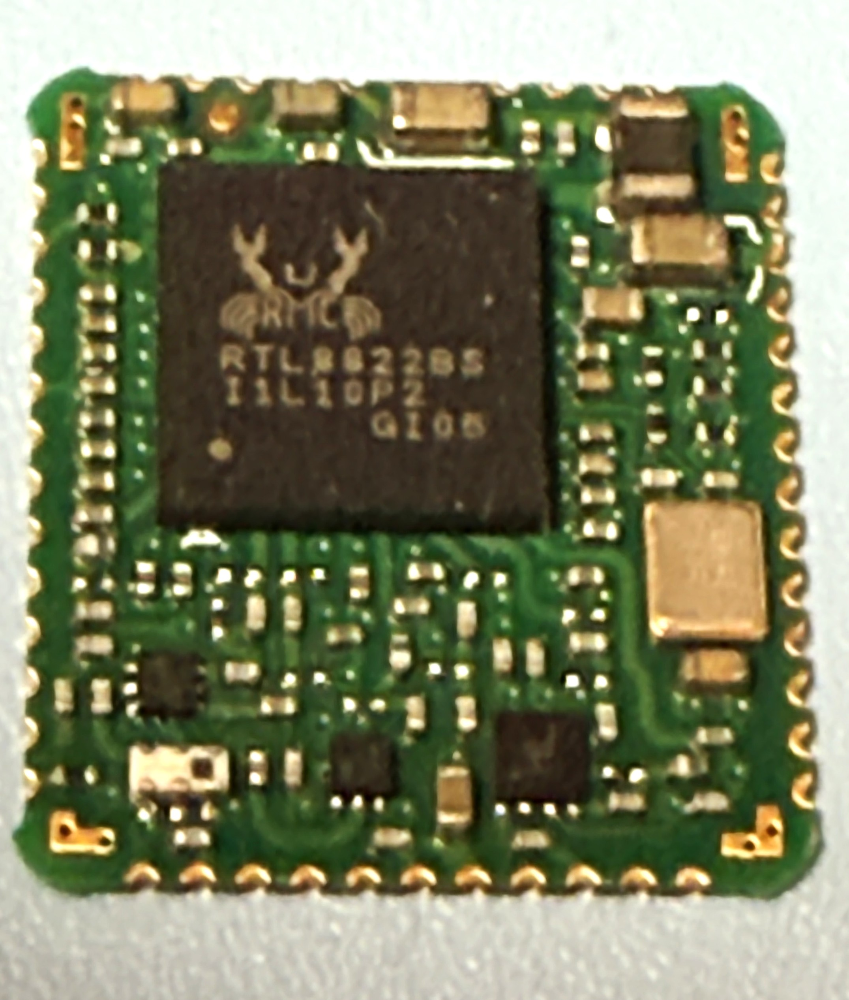

# RTW88 Hardware Testing

### This repository is aim to provide RTW88 Community Driver Hardware Support Status Over ARM-Based Devices (FPSOC)

Tested Version: [58638cb909377bed524ac9aad0ce7cefc1a037da](https://github.com/lwfinger/rtw88/tree/386382ace137f5209e8e83a4cf2e044bf52e8b38)

## The test reports are generated by the auto script:

[HERE](https://github.com/briansune/rtw88-auto-report)

## iperf3 @ AP/STA test explain

Bluetooth speaker is used to trigger possible warning/error messages.

HOW TO DO: During the iperf3 test disconnect and reconnect the Bluetooth device and play music.

## Known Issue

2.4G WIFI band could be disturbed by nearby Bluetooth Devices and possible ZigBee Devices as well!

https://github.com/lwfinger/rtw88/issues/271#issuecomment-2566392845

## Issue found during testing

> I1: RTL8822BS is connected to merged 2.4G+5G Router.
> 
> Both 2.4G and 5G cannot connect under SDIO High-Speed Profile.

> I2: RTW88 supported devices have issue on same 2.4G/5G SSID WIFI
> 
> Defining band=[bg/a] in the  /etc/NetworkManager/system-connections/... to force it enters a 2G/5G
> 
> still introducing hard time to switch channels / frequencies.

> I3: RTL8811AU USB Dongle
>
> This dongle have trouble on connecting 5G/2G STA
>
> According to quick hardware inspection, it is highly due to
>
> poor IFA antenna design, no diplexer is used
>
> When module is used and cross-compare no issue is found.

> I4: RTL8811CU Module
>
> STA 5G is stuck in authenticate time out.
>
> Possible factors are the internal EFUSE is missing and dBm value on 5G are all messed up.
>
> Cross-compared with vendor driver can connect to 5G poorly which indicates 5G channel is problematic.

## SDIO Devices Investigation on RTW88

Both A53 and A35 test gear is used to verify the RTW88 SDIO supported WIFI chips.

> I1: According to A35 DUT tested result.
> 
> DTS/DTSI device tree SDIO profile could introduce unstable issue on RTW88 or possible crashes.
>
> All SDIO should first detected from low clock speed then enter high speed frequency ranges.
> 
> Most SDIO explain could be found [here](https://www.prodigytechno.com/sdio-protocol).

> I2: Test gear limitation: due to most FPSOC board do not introduce two SDIO or solderable PCB slot.
>
> All possible setup/hold time slacks are not tested and cannot sure!
>
> What the follow setup runs are most likely stable enough to use.

Low-Speed / High-Speed profile (4bits) is deployed with RTW88 driver

|Testbench|Device|Speed Profile|Issue|Vendor Driver|
|:---:|:---:|:---:|:---:|:---:|
|A35 ARM|RTL8723DS|Low-Speed|🟡 AP Not Working|🟢|
|A35 ARM|RTL8821CS|Low-Speed|🔴 Crash on WIFI connection "Unable to Use"|🟢|
|A35 ARM|RTL8822BS|Low-Speed|⏳|[6.1 Kernel Modified 🟢](https://github.com/briansune/dr1-rtl8822bs)|
|A35 ARM|RTL8822CS|Low-Speed|🔴 Crash Message but no System Hang|🟢|
||||||
|A35 ARM|RTL8723DS|High-Speed|🟡 AP Not Working|🟢|
|A35 ARM|RTL8821CS|High-Speed|🟡 AP Not Working|🟢|
|A35 ARM|RTL8822BS|High-Speed|🟡 AP Not Working|[6.1 Kernel Modified 🟢](https://github.com/briansune/dr1-rtl8822bs)|
|A35 ARM|RTL8822CS|High-Speed|🟡 AP Not Working|🟢|

## PCIe M.2 A+E aka NGFF

> Issue 1:
>
> Out of tree drive module cross-compile will introduce issue.
>
> Modify the kernel build under yocto flow will be safer.
>
> Issue 2:
>
> On the ARM64 A53 board
>
> Possible clock jitter could introduce PCIe card not detect.
> 
> Issue 3:
>
> RTL8814AE 5G connecting to AP (STA mode) is having difficulties.
> 

|Testbench|Device|Speed Profile|Issue|
|:---:|:---:|:---:|:---:|
|A53 ARM64|RTL8723DE|x1 2.5G 128 Bytes|🟢|
|A53 ARM64|RTL8723DE|x1 5.0G 256 Bytes|🟢|
|||||
|A53 ARM64|RTL8814AE-GRIS|x1 5.0G 256 Bytes|🟢|
|A53 ARM64|RTL8814AE-COMFAST|x1 5.0G 256 Bytes|🟢|
|||||
|A53 ARM64|RTL8821CE|x1 2.5G 128 Bytes|🟢|
|A53 ARM64|RTL8821CE|x1 5.0G 256 Bytes|🟢|
|||||
|A53 ARM64|RTL8822BE|x1 2.5G 128 Bytes|🟢|
|A53 ARM64|RTL8822BE|x1 5.0G 256 Bytes|🟢|
|||||
|A53 ARM64|RTL8822CE|x1 2.5G 128 Bytes|🟢|
|A53 ARM64|RTL8822CE|x1 5.0G 256 Bytes|🟢|

## Fully RTW88 Driver Support Devices Test Report Table

|Phy Interface|
Chip #
HW Type|DUT Kernel #|Driver Tree|HW Image|Status|
|:---:|:---|:---|:---:|:---:|---:|
|
USB 2.0|
RTL8723 [D] U
Dongle|
5.4[ARM-A9/53]
6.1.111-rt42[ARM-A35]|
rtw_core.ko
rtw_usb.ko
rtw_8723x.ko
rtw_8723d.ko
rtw_8723du.ko|

|
[ARM-A9 🟢](./rtl8723du_arm_a9)
[ARM64-A35 🟡](./rtl8723du_arm_a35)
[ARM64-A53 🟢](./rtl8723du_arm_a53)
STA 🟢
AP 🟡|
|||||||
|
USB 2.0|
RTL8811 [A] U
Dongle|
5.4[ARM-A9/53]
6.1.111-rt42[ARM-A35]|rtw_core.ko
rtw_usb.ko
rtw_88xxa.ko
rtw_8821a.ko
rtw_8821au.ko||
[ARM-A9 🟡](./rtl8811au_arm_a9)
[ARM64-A35 🟡](./rtl8811au_arm_a35)
[ARM64-A53 🟡](./rtl8811au_arm_a53)
STA 🟡
AP 🔴|
|
USB 2.0|
RTL8811 [A] U
Module|
5.4[ARM-A9/53]
6.1.111-rt42[ARM-A35]|rtw_core.ko
rtw_usb.ko
rtw_88xxa.ko
rtw_8821a.ko
rtw_8821au.ko||
[ARM-A9 🟢](./rtl8811au_arm_a9_mod)
[ARM64-A35 🟢](./rtl8811au_arm_a35_mod)
[ARM64-A53 🟢](./rtl8811au_arm_a53_mod)
STA 🟢
AP 🟡|
|
USB 2.0|RTL8811 [C] U
Module|
5.4[ARM-A9]|
rtw_core.ko
rtw_usb.ko
rtw_8821c.ko
rtw_8821cu.ko||
[ARM-A9 🟡](./rtl8811cu_arm_a9)
STA 🔴
AP 🟢|
|||||||
|
USB 2.0 (Only 2.4G)
USB 3.0 (HW Mod. 2.4G Only)|
RTL8812 [A] U
Dongle|
5.4[ARM-A9/53]
6.1.111-rt42[ARM-A35]|
rtw_core.ko
rtw_usb.ko
rtw_88xxa.ko
rtw_8812a.ko
rtw_8812au.ko||
[ARM-A9 🟢](./rtl8812au_arm_a9)
[ARM64-A35 🟡](./rtl8812au_arm_a35)
[ARM64-A53 🟢](./rtl8812au_arm_a53)
[ARM64-A53 USB 3.0 🟢](./rtl8812au_arm_a53_usb3)
STA 🟢
AP 🟡|
|
USB 2.0
USB 3.0|
RTL8812 [A] U
USB PCBA|
6.1.111-rt42[ARM-A35]
5.4[ARM-A53]|
rtw_core.ko
rtw_usb.ko
rtw_88xxa.ko
rtw_8812a.ko
rtw_8812au.ko||
[ARM64-A35 USB 2.0 🟢](./rtl8812au_arm_a35_usb2_5g)
[ARM64-A53 USB 3.0 🟢](./rtl8812au_arm_a53_usb3_5g)
STA 🟢
AP 🟡|
|
USB 2.0|
RTL8812 [B] U
USB PCBA|
5.4[ARM-A9/53]
6.1.111-rt42[ARM-A35]|
rtw_core.ko
rtw_usb.ko
rtw_8822b.ko
rtw_8822bu.ko||
[ARM-A9 🟢](./rtl8812bu_arm_a9)
[ARM64-A35 🟡](./rtl8812bu_arm_a35)
[ARM64-A53 🟢](./rtl8812bu_arm_a53)
STA 🟢
AP 🟡|
|
USB 2.0|RTL8812 [C] U
USB PCBA|
5.4[ARM-A9/53]
6.1.111-rt42[ARM-A35]|
rtw_core.ko
rtw_usb.ko
rtw_8822c.ko
rtw_8822cu.ko||
[ARM-A9 🟢](./rtl8812cu_arm_a9)
[ARM64-A35 🟢](./rtl8812cu_arm_a35)
[ARM64-A53 🟢](./rtl8812cu_arm_a53)
STA 🟢
AP 🟡|
|||||||
|
USB 2.0|RTL8814 [A] U
USB PCBA|
5.4[ARM-A9/53]
6.1.111-rt42[ARM-A35]|
rtw_core.ko
rtw_usb.ko
rtw_8814a.ko
rtw_8814au.ko||
[ARM-A9 🟡](./rtl8814au_arm_a9)
[ARM64-A35 🟡](./rtl8814au_arm_a35)
[ARM64-A53 🟡](./rtl8814au_arm_a53)
STA 🟢
AP 🟡|
|||||||
|
USB 2.0|RTL8821 [A] U
Module|
5.4[ARM-A9]
6.1.111-rt42[ARM-A35]|
rtw_core.ko
rtw_usb.ko
rtw_88xxa.ko
rtw_8821a.ko
rtw_8821au.ko||
[ARM-A9 🟢](./rtl8821au_arm_a9)
[ARM64-A35 🟢](./rtl8821au_arm_a35)
[ARM64-A53 🟢](./rtl8821au_arm_a53)
STA 🟢
AP 🟡|
|
USB 2.0|RTL8821 [C] U
Dongle|
5.4[ARM-A9]
6.1.111-rt42[ARM-A35]|
rtw_core.ko
rtw_usb.ko
rtw_8821c.ko
rtw_8821cu.ko|
|
[ARM-A9 🟡](./rtl8821cu_arm_a9)
[ARM64-A35 🟢](./rtl8821cu_arm_a35)
[ARM64-A53 🟢](./rtl8821cu_arm_a53)
STA 🟢
AP 🟡|
|
USB 2.0|RTL8821 [C] U
Module|
5.4[ARM-A9]
6.6[ARM-A9]|
rtw_core.ko
rtw_usb.ko
rtw_8821c.ko
rtw_8821cu.ko|
|
[ARM-A9-5.4 🟢](./rtl8821cu_arm_a9_pcba)[ARM-A9-6.6 🟡](./rtl8821cu_arm_a9_pcba_6)
STA 🟢
AP 🟡|
|||||||
|
USB 2.0
USB 3.0|RTL8822 [B] U
Dongle|
5.4[ARM-A9/53]
6.1.111-rt42[ARM-A35]|
rtw_core.ko
rtw_usb.ko
rtw_8822b.ko
rtw_8822bu.ko||
[ARM-A9 🟢](./rtl8822bu_arm_a9)
[ARM64-A35 🟡](./rtl8822bu_arm_a35)
[ARM64-A53 🟡](./rtl8822bu_arm_a53)
STA 🟢
AP 🟡||
|
USB 2.0|RTL8822 [C] U
Module|
5.4[ARM-A9/53]
6.1.111-rt42[ARM-A35]|
rtw_core.ko
rtw_usb.ko
rtw_8822c.ko
rtw_8822cu.ko||
[ARM-A9 🟢](./rtl8822cu_arm_a9)
[ARM-A35 🟢](./rtl8822cu_arm_a35)
[ARM-A53 🟢](./rtl8822cu_arm_a53)
STA 🟢
AP 🟢|

### RTW Revision - [e32c796572ee22ae172411fe5c1183921eca498e](https://github.com/lwfinger/rtw88/tree/e32c796572ee22ae172411fe5c1183921eca498e)

Remarks ★: Tested Version: [58638cb909377bed524ac9aad0ce7cefc1a037da](https://github.com/lwfinger/rtw88/tree/386382ace137f5209e8e83a4cf2e044bf52e8b38) 

Remarks ✦: Tested Version: [bd8b1668b96a9d7848c0909f017b2e3eb87ad2b3](https://github.com/lwfinger/rtw88/tree/bd8b1668b96a9d7848c0909f017b2e3eb87ad2b3)

Additional Test Report: [RTL8814AE iperf3 tests on ARM-A53](./rtl8814ae_arm_a53_5g_trxmax)

|Phy Interface|
Chip #
HW Type|DUT Kernel #|Driver Tree|HW Image|Status|
|:---:|:---|:---|:---:|:---:|---:|
|PCIe|RTL8723 [D] E
NGFF Card|
5.4[ARM-A53]|
rtw_core.ko
rtw_pci.ko
rtw_8723x.ko
rtw_8723d.ko
rtw_8723de.ko||
[ARM-A53 🟢](./rtl8723de_arm_a53)
STA 🟢
AP 🟢|
|PCIe|RTL8723 [D] E
NGFF Card|
5.4[ARM-A53]|
rtw_core.ko
rtw_pci.ko
rtw_8723x.ko
rtw_8723d.ko
rtw_8723de.ko||
[ARM-A53 🟢](./rtl8723de_arm_a53_2)
STA 🟢
AP 🟢|
|||||||
|PCIe|RTL8814-GRIS [A] E
mini-PCIe Card|
5.4[ARM-A53]|
rtw_core.ko
rtw_pci.ko
rtw_8814a.ko
rtw_8814ae.ko||
✦ [ARM-A53 🟢](./rtl8814ae_arm_a53)
STA 🟡
AP 🟢|
|PCIe|RTL8814-COMFAST [A] E
mini-PCIe Card|
5.4[ARM-A53]|
rtw_core.ko
rtw_pci.ko
rtw_8814a.ko
rtw_8814ae.ko||
✦ [ARM-A53 🟢](./rtl8814ae_arm_a53_comfast)
STA 🟢
AP 🟢|
|||||||
|PCIe|RTL8821 [C] E
NGFF Card|
5.4[ARM-A53]|
rtw_core.ko
rtw_pci.ko
rtw_8821c.ko
rtw_8821ce.ko||
[ARM-A53 🟢](./rtl8821ce_arm_a53)
STA 🟢
AP 🟢|
|PCIe|RTL8821 [C] E
mini-PCIe Card|
5.4[ARM-A53]|
rtw_core.ko
rtw_pci.ko
rtw_8821c.ko
rtw_8821ce.ko||
[ARM-A53 🟢](./rtl8821ce_arm_a53_2)
STA 🟢
AP 🟢|
|||||||
|PCIe|RTL8822 [B] E
NGFF Card|
5.4[ARM-A53]|
rtw_core.ko
rtw_pci.ko
rtw_8822b.ko
rtw_8822be.ko||
★ [ARM-A53 🟢](./rtl8822be_arm_a53)
STA 🟢
AP 🟢|
|||||||
|PCIe|RTL8822 [C] E
NGFF Card|
5.4[ARM-A53]|
rtw_core.ko
rtw_pci.ko
rtw_8822c.ko
rtw_8822ce.ko||[ARM-A53 🟢](./rtl8822ce_arm_a53)
STA 🟢
AP 🟢|
|PCIe|RTL8822 [C] E
mini-PCIe Card|
5.4[ARM-A53]|
rtw_core.ko
rtw_pci.ko
rtw_8822c.ko
rtw_8822ce.ko||[ARM-A53 🟢](./rtl8822ce_arm_a53_2)
STA 🟢
AP 🟢|

### RTW88 Revision - [58638cb909377bed524ac9aad0ce7cefc1a037da](https://github.com/lwfinger/rtw88/tree/386382ace137f5209e8e83a4cf2e044bf52e8b38)

|Phy Interface|
Chip #
HW Type|DUT Kernel #|Driver Tree|HW Image|Status|
|:---:|:---|:---|:---:|:---:|---:|
|SDIO|RTL8723 [D] S
Custom HW|
5.4[ARM-A9]|
rtw_core.ko
rtw_sdio.ko
rtw_8723x.ko
rtw_8723d.ko
rtw_8723ds.ko||
ARM-A9 (High-Speed) 🟢
STA 🟢
AP 🟡|
|SDIO|RTL8723 [D] S
Module HW|
6.1.111-rt42[ARM-A35]|
rtw_core.ko
rtw_sdio.ko
rtw_8723x.ko
rtw_8723d.ko
rtw_8723ds.ko||
[ARM64-A35 (High-Speed) 🟡](./rtl8723ds_arm_a35_mod)
STA 🟢
AP 🟡|
|SDIO|RTL8723 [D] S
Module HW|
6.1.111-rt42[ARM-A35]|
rtw_core.ko
rtw_sdio.ko
rtw_8723x.ko
rtw_8723d.ko
rtw_8723ds.ko||
[ARM64-A35 (High-Speed) 🟡](./rtl8723ds_arm_a35_cus)
STA 🟢
AP 🟡|
|SDIO|RTL8723 [D] S
Custom HW|
5.4[ARM-A53]|
rtw_core.ko
rtw_sdio.ko
rtw_8723x.ko
rtw_8723d.ko
rtw_8723ds.ko||
[ARM-A53 (High-Speed) 🟢](./rtl8723ds_arm_a53)
STA 🟢
AP 🟡|
|||||||
|SDIO|RTL8821 [C] S
PCBA EVM|
6.1.111-rt42[ARM-A35]|
rtw_core.ko
rtw_sdio.ko
rtw_8821c.ko
rtw_8821cs.ko||
[ARM-A35 (Low-Speed) 🔴](./rtl8821cs_arm_a35)
STA 🔴
AP 🔴|
|SDIO|RTL8821 [C] S
PCBA EVM|
6.1.111-rt42[ARM-A35]|
rtw_core.ko
rtw_sdio.ko
rtw_8821c.ko
rtw_8821cs.ko||
[ARM-A35 (High-Speed) 🟡](./rtl8821cs_arm_a35_hs)
STA 🟢
AP 🟡|
|SDIO|RTL8821 [C] S
PCBA EVM|
5.4[ARM-A53]|
rtw_core.ko
rtw_sdio.ko
rtw_8821c.ko
rtw_8821cs.ko||
[ARM-A53 (High-Speed) 🟡](./rtl8821cs_arm_a53)
STA 🟢
AP 🟡|
|||||||
|SDIO|RTL8822 [B] S
PCBA EVM|
6.1.111-rt42[ARM-A35]|
rtw_core.ko
rtw_sdio.ko
rtw_8822b.ko
rtw_8822bs.ko||
[ARM-A35 (High-Speed) 🟡](./rtl8822bs_arm_a35)
STA 🟢
AP 🟡|
|SDIO|RTL8822 [B] S
PCBA EVM|
5.4[ARM-A53]|
rtw_core.ko
rtw_sdio.ko
rtw_8822b.ko
rtw_8822bs.ko||
[ARM-A53 (High-Speed) 🟡](./rtl8822bs_arm_a53)
STA 🟢
AP 🟡|
|SDIO|RTL8822 [C] S
PCBA EVM|
6.1.111-rt42[ARM-A35]|
rtw_core.ko
rtw_sdio.ko
rtw_8822c.ko
rtw_8822cs.ko||
[ARM-A35 (High-Speed) 🟡](./rtl8822cs_arm_a35)
STA 🟢
AP 🟡|
|SDIO|RTL8822 [C] S
PCBA EVM|
5.4[ARM-A53]|
rtw_core.ko
rtw_sdio.ko
rtw_8821c.ko
rtw_8821cs.ko||
[ARM-A53 (High-Speed) 🟡](./rtl8822cs_arm_a53)
STA 🟢
AP 🟡|

### RTW88 Revision - [c56536cfa522b42cfa73c2c4332000e6aa5bcf97](https://github.com/lwfinger/rtw88/tree/c56536cfa522b42cfa73c2c4332000e6aa5bcf97)

> I1: No STA 2.4G can be scan during testing. (Resolved✅)
>
> Unable to connect to 2.4G band due to STA shows no WIFI channel.
>
> This issue is related to EFUSE sanity (confirmed with other 4 boards on RTL8723DS).
>
> Apply patch from [HERE](https://github.com/user-attachments/files/18624613/0001-wifi-rtw88-Handle-RTL8723D-with-blank-efuse.patch.txt) under the RTW88 trunk
>
> patch -i 0001-wifi-rtw88-Handle-RTL8723D-with-blank-efuse.patch.txt
>

|Phy Interface|
Chip #
HW Type|DUT Kernel #|Driver Tree|HW Image|Status|
|:---:|:---|:---|:---:|:---:|---:|
|SDIO|RTL8723 [D] S
Custom HW|
5.4[ARM-A9]|
rtw_core.ko
rtw_sdio.ko
rtw_8723x.ko
rtw_8723d.ko
rtw_8723ds.ko||
ARM-A9 (High-Speed) 🟢
STA 🟢
AP 🔴|
|SDIO|RTL8723 [D] S
Module HW|
6.1.111-rt42[ARM-A35]|
rtw_core.ko
rtw_sdio.ko
rtw_8723x.ko
rtw_8723d.ko
rtw_8723ds.ko||
ARM64-A35 (High-Speed) 🟢
STA 🟢
AP 🔴|
|SDIO|RTL8723 [D] S
Module HW|
6.1.111-rt42[ARM-A35]|
rtw_core.ko
rtw_sdio.ko
rtw_8723x.ko
rtw_8723d.ko
rtw_8723ds.ko||
ARM64-A35 (High-Speed) 🟢
STA 🟢
AP 🔴|

