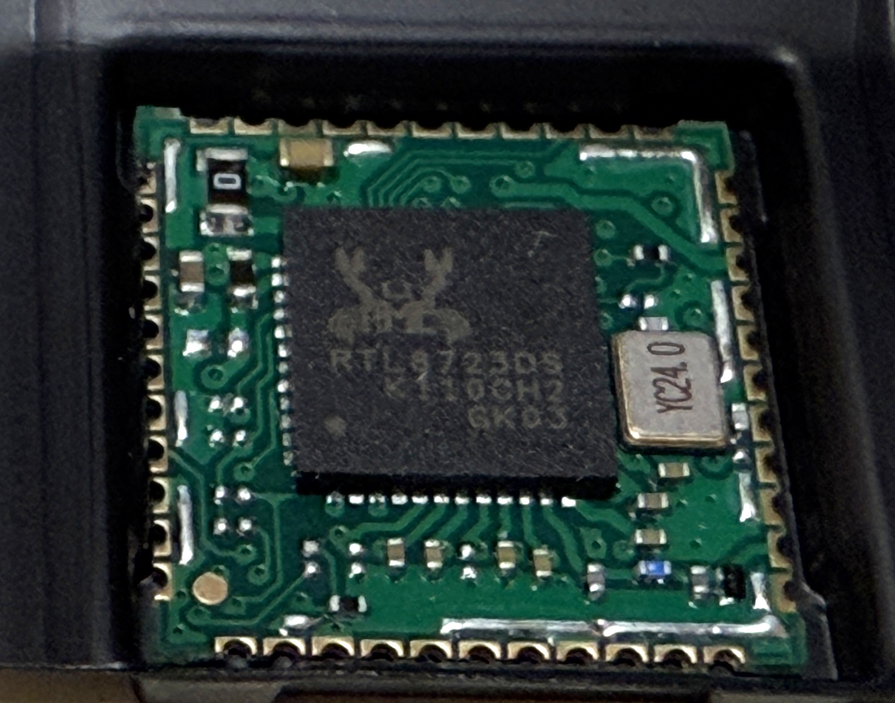

# RTL8723DS SDIO PCBA Testing

### Test SDIO Gear

|Test Board|SDIO Dongle HW|
|-|-|
|||

```
5.4.0

DISTRIB_ID=Ubuntu
DISTRIB_RELEASE=18.04
DISTRIB_CODENAME=bionic
DISTRIB_DESCRIPTION="Ubuntu 18.04.6 LTS"

Architecture:        aarch64
Byte Order:          Little Endian
CPU(s):              2
On-line CPU(s) list: 0,1
Thread(s) per core:  1
Core(s) per socket:  2
Socket(s):           1
Vendor ID:           ARM
Model:               4
Model name:          Cortex-A53
Stepping:            r0p4
CPU max MHz:         1199.9990
CPU min MHz:         299.9990
BogoMIPS:            66.66
Flags:               fp asimd aes pmull sha1 sha2 crc32 cpuid
```

### SDIO Tree

```
SDIO_CLASS=07
SDIO_ID=024C:D723
MODALIAS=sdio:c07v024CdD723
clock:		50000000 Hz
actual clock:	50000000 Hz
vdd:		21 (3.3 ~ 3.4 V)
bus mode:	2 (push-pull)
chip select:	0 (don't care)
power mode:	2 (on)
bus width:	2 (4 bits)
timing spec:	2 (sd high-speed)
signal voltage:	0 (3.30 V)
driver type:	0 (driver type B)
```

### Driver Load

The driver is loaded via "insmod"

```
Module                  Size  Used by
rtw_8723ds             16384  0
rtw_8723d              45056  1 rtw_8723ds
rtw_8723x              20480  1 rtw_8723d
rtw_sdio               20480  1 rtw_8723ds
rtw_core              208896  3 rtw_8723d,rtw_sdio,rtw_8723x
```

### iw list

<details>

<summary>iw list</summary>

```
Wiphy phy0
	max # scan SSIDs: 4
	max scan IEs length: 2257 bytes
	max # sched scan SSIDs: 0
	max # match sets: 0
	max # scan plans: 1
	max scan plan interval: -1
	max scan plan iterations: 0
	Retry short limit: 7
	Retry long limit: 4
	Coverage class: 0 (up to 0m)
	Device supports T-DLS.
	Supported Ciphers:
		* WEP40 (00-0f-ac:1)
		* WEP104 (00-0f-ac:5)
		* TKIP (00-0f-ac:2)
		* CCMP-128 (00-0f-ac:4)
		* CCMP-256 (00-0f-ac:10)
		* GCMP-128 (00-0f-ac:8)
		* GCMP-256 (00-0f-ac:9)
		* CMAC (00-0f-ac:6)
		* CMAC-256 (00-0f-ac:13)
		* GMAC-128 (00-0f-ac:11)
		* GMAC-256 (00-0f-ac:12)
	Available Antennas: TX 0x1 RX 0x1
	Configured Antennas: TX 0x1 RX 0x1
	Supported interface modes:
		 * IBSS
		 * managed
		 * AP
		 * AP/VLAN
		 * monitor
		 * P2P-client
		 * P2P-GO
	Band 1:
		Capabilities: 0x196e
			HT20/HT40
			SM Power Save disabled
			RX HT20 SGI
			RX HT40 SGI
			RX STBC 1-stream
			Max AMSDU length: 7935 bytes
			DSSS/CCK HT40
		Maximum RX AMPDU length 65535 bytes (exponent: 0x003)
		Minimum RX AMPDU time spacing: 16 usec (0x07)
		HT Max RX data rate: 150 Mbps
		HT TX/RX MCS rate indexes supported: 0-7, 32
		Bitrates (non-HT):
			* 1.0 Mbps
			* 2.0 Mbps
			* 5.5 Mbps
			* 11.0 Mbps
			* 6.0 Mbps
			* 9.0 Mbps
			* 12.0 Mbps
			* 18.0 Mbps
			* 24.0 Mbps
			* 36.0 Mbps
			* 48.0 Mbps
			* 54.0 Mbps
		Frequencies:
			* 2412 MHz [1] (20.0 dBm)
			* 2417 MHz [2] (20.0 dBm)
			* 2422 MHz [3] (20.0 dBm)
			* 2427 MHz [4] (20.0 dBm)
			* 2432 MHz [5] (20.0 dBm)
			* 2437 MHz [6] (20.0 dBm)
			* 2442 MHz [7] (20.0 dBm)
			* 2447 MHz [8] (20.0 dBm)
			* 2452 MHz [9] (20.0 dBm)
			* 2457 MHz [10] (20.0 dBm)
			* 2462 MHz [11] (20.0 dBm)
			* 2467 MHz [12] (20.0 dBm) (no IR)
			* 2472 MHz [13] (20.0 dBm) (no IR)
			* 2484 MHz [14] (20.0 dBm) (no IR)
	Supported commands:
		 * new_interface
		 * set_interface
		 * new_key
		 * start_ap
		 * new_station
		 * set_bss
		 * authenticate
		 * associate
		 * deauthenticate
		 * disassociate
		 * join_ibss
		 * set_tx_bitrate_mask
		 * frame
		 * frame_wait_cancel
		 * set_wiphy_netns
		 * set_channel
		 * set_wds_peer
		 * tdls_mgmt
		 * tdls_oper
		 * probe_client
		 * set_noack_map
		 * register_beacons
		 * start_p2p_device
		 * set_mcast_rate
		 * testmode
		 * connect
		 * disconnect
		 * set_qos_map
		 * set_multicast_to_unicast
	Supported TX frame types:
		 * IBSS: 0x00 0x10 0x20 0x30 0x40 0x50 0x60 0x70 0x80 0x90 0xa0 0xb0 0xc0 0xd0 0xe0 0xf0
		 * managed: 0x00 0x10 0x20 0x30 0x40 0x50 0x60 0x70 0x80 0x90 0xa0 0xb0 0xc0 0xd0 0xe0 0xf0
		 * AP: 0x00 0x10 0x20 0x30 0x40 0x50 0x60 0x70 0x80 0x90 0xa0 0xb0 0xc0 0xd0 0xe0 0xf0
		 * AP/VLAN: 0x00 0x10 0x20 0x30 0x40 0x50 0x60 0x70 0x80 0x90 0xa0 0xb0 0xc0 0xd0 0xe0 0xf0
		 * mesh point: 0x00 0x10 0x20 0x30 0x40 0x50 0x60 0x70 0x80 0x90 0xa0 0xb0 0xc0 0xd0 0xe0 0xf0
		 * P2P-client: 0x00 0x10 0x20 0x30 0x40 0x50 0x60 0x70 0x80 0x90 0xa0 0xb0 0xc0 0xd0 0xe0 0xf0
		 * P2P-GO: 0x00 0x10 0x20 0x30 0x40 0x50 0x60 0x70 0x80 0x90 0xa0 0xb0 0xc0 0xd0 0xe0 0xf0
		 * P2P-device: 0x00 0x10 0x20 0x30 0x40 0x50 0x60 0x70 0x80 0x90 0xa0 0xb0 0xc0 0xd0 0xe0 0xf0
	Supported RX frame types:
		 * IBSS: 0x40 0xb0 0xc0 0xd0
		 * managed: 0x40 0xd0
		 * AP: 0x00 0x20 0x40 0xa0 0xb0 0xc0 0xd0
		 * AP/VLAN: 0x00 0x20 0x40 0xa0 0xb0 0xc0 0xd0
		 * mesh point: 0xb0 0xc0 0xd0
		 * P2P-client: 0x40 0xd0
		 * P2P-GO: 0x00 0x20 0x40 0xa0 0xb0 0xc0 0xd0
		 * P2P-device: 0x40 0xd0
	software interface modes (can always be added):
		 * AP/VLAN
		 * monitor
	valid interface combinations:
		 * #{ managed } <= 1, #{ AP, P2P-client, P2P-GO } <= 1,
		   total <= 2, #channels <= 1
	HT Capability overrides:
		 * MCS: ff ff ff ff ff ff ff ff ff ff
		 * maximum A-MSDU length
		 * supported channel width
		 * short GI for 40 MHz
		 * max A-MPDU length exponent
		 * min MPDU start spacing
	Device supports TX status socket option.
	Device supports HT-IBSS.
	Device supports SAE with AUTHENTICATE command
	Device supports scan flush.
	Device supports per-vif TX power setting
	Driver supports full state transitions for AP/GO clients
	Driver supports a userspace MPM
	Device supports configuring vdev MAC-addr on create.
```

</details>

### Network Manager - Band 2.4

```
wlan0: flags=4163<UP,BROADCAST,RUNNING,MULTICAST>  mtu 1500
        inet 192.168.1.35  netmask 255.255.252.0  broadcast 192.168.3.255
        RX packets 13  bytes 2094 (2.0 KB)
        RX errors 0  dropped 0  overruns 0  frame 0
        TX packets 17  bytes 2330 (2.3 KB)
        TX errors 0  dropped 0 overruns 0  carrier 0  collisions 0
```

### iwconfig 2.4

```
wlan0     IEEE 802.11  ESSID:""  
          Mode:Managed  Frequency:2.412 GHz  Access Point: 
          Bit Rate=81 Mb/s   Tx-Power=20 dBm   
          Retry short limit:7   RTS thr:off   Fragment thr:off
          Encryption key:off
          Power Management:on
          Link Quality=61/70  Signal level=-49 dBm  
          Rx invalid nwid:0  Rx invalid crypt:0  Rx invalid frag:0
          Tx excessive retries:0  Invalid misc:0   Missed beacon:0

```

### Network Speed Test via Ookla - Band 2.4

```
Retrieving speedtest.net configuration...
Retrieving speedtest.net server list...
Selecting best server based on ping...
Testing download speed................................................................................
Download: 3.79 Mbit/s
Testing upload speed......................................................................................................
Upload: 0.97 Mbit/s
```

### Network Ping Tests - Band 2.4

#### DNS-Ping

```
PING 8.8.8.8 (8.8.8.8) 56(84) bytes of data.
64 bytes from 8.8.8.8: icmp_seq=1 ttl=118 time=5.19 ms
64 bytes from 8.8.8.8: icmp_seq=2 ttl=118 time=4.84 ms
64 bytes from 8.8.8.8: icmp_seq=3 ttl=118 time=6.54 ms
64 bytes from 8.8.8.8: icmp_seq=4 ttl=118 time=5.44 ms
64 bytes from 8.8.8.8: icmp_seq=5 ttl=118 time=4.38 ms
64 bytes from 8.8.8.8: icmp_seq=6 ttl=118 time=3.91 ms
64 bytes from 8.8.8.8: icmp_seq=7 ttl=118 time=9.74 ms
64 bytes from 8.8.8.8: icmp_seq=8 ttl=118 time=7.83 ms
64 bytes from 8.8.8.8: icmp_seq=9 ttl=118 time=4.29 ms
64 bytes from 8.8.8.8: icmp_seq=10 ttl=118 time=4.02 ms
64 bytes from 8.8.8.8: icmp_seq=11 ttl=118 time=10.4 ms
64 bytes from 8.8.8.8: icmp_seq=12 ttl=118 time=6.81 ms
64 bytes from 8.8.8.8: icmp_seq=13 ttl=118 time=5.24 ms
64 bytes from 8.8.8.8: icmp_seq=14 ttl=118 time=7.28 ms
64 bytes from 8.8.8.8: icmp_seq=15 ttl=118 time=5.16 ms
64 bytes from 8.8.8.8: icmp_seq=16 ttl=118 time=8.53 ms
64 bytes from 8.8.8.8: icmp_seq=17 ttl=118 time=4.46 ms
64 bytes from 8.8.8.8: icmp_seq=18 ttl=118 time=6.03 ms
64 bytes from 8.8.8.8: icmp_seq=19 ttl=118 time=3.96 ms
64 bytes from 8.8.8.8: icmp_seq=20 ttl=118 time=6.11 ms

--- 8.8.8.8 ping statistics ---
20 packets transmitted, 20 received, 0% packet loss, time 19028ms
rtt min/avg/max/mdev = 3.915/6.013/10.443/1.874 ms
```

#### Self-Ping 

```
PING 192.168.1.35 (192.168.1.35) 10000(10028) bytes of data.
10008 bytes from 192.168.1.35: icmp_seq=1 ttl=64 time=0.103 ms
10008 bytes from 192.168.1.35: icmp_seq=2 ttl=64 time=0.072 ms
10008 bytes from 192.168.1.35: icmp_seq=3 ttl=64 time=0.079 ms
10008 bytes from 192.168.1.35: icmp_seq=4 ttl=64 time=0.066 ms
10008 bytes from 192.168.1.35: icmp_seq=5 ttl=64 time=0.061 ms
10008 bytes from 192.168.1.35: icmp_seq=6 ttl=64 time=0.063 ms
10008 bytes from 192.168.1.35: icmp_seq=7 ttl=64 time=0.062 ms
10008 bytes from 192.168.1.35: icmp_seq=8 ttl=64 time=0.088 ms
10008 bytes from 192.168.1.35: icmp_seq=9 ttl=64 time=0.063 ms
10008 bytes from 192.168.1.35: icmp_seq=10 ttl=64 time=0.060 ms
10008 bytes from 192.168.1.35: icmp_seq=11 ttl=64 time=0.068 ms
10008 bytes from 192.168.1.35: icmp_seq=12 ttl=64 time=0.064 ms
10008 bytes from 192.168.1.35: icmp_seq=13 ttl=64 time=0.061 ms
10008 bytes from 192.168.1.35: icmp_seq=14 ttl=64 time=0.079 ms
10008 bytes from 192.168.1.35: icmp_seq=15 ttl=64 time=0.064 ms
10008 bytes from 192.168.1.35: icmp_seq=16 ttl=64 time=0.061 ms
10008 bytes from 192.168.1.35: icmp_seq=17 ttl=64 time=0.060 ms
10008 bytes from 192.168.1.35: icmp_seq=18 ttl=64 time=0.061 ms
10008 bytes from 192.168.1.35: icmp_seq=19 ttl=64 time=0.060 ms
10008 bytes from 192.168.1.35: icmp_seq=20 ttl=64 time=0.077 ms

--- 192.168.1.35 ping statistics ---
20 packets transmitted, 20 received, 0% packet loss, time 19442ms
rtt min/avg/max/mdev = 0.060/0.068/0.103/0.014 ms
```

### Server & Client Test via iperf3 (PC-Router-DUT)

<details>

<summary>iperf3</summary>

```
-----------------------------------------------------------
Server listening on 5201
-----------------------------------------------------------
Accepted connection from 192.168.1.3, port 53170
[  5] local 192.168.1.35 port 5201 connected to 192.168.1.3 port 53171
[ ID] Interval           Transfer     Bandwidth       Retr  Cwnd
[  5]   0.00-1.00   sec  3.57 MBytes  29.9 Mbits/sec    0   68.4 KBytes       
[  5]   1.00-2.00   sec  3.37 MBytes  28.3 Mbits/sec    1   68.4 KBytes       
[  5]   2.00-3.00   sec  3.16 MBytes  26.5 Mbits/sec    1   68.4 KBytes       
[  5]   3.00-4.00   sec  4.14 MBytes  34.7 Mbits/sec    0   68.4 KBytes       
[  5]   4.00-5.00   sec  5.12 MBytes  42.9 Mbits/sec    0   68.4 KBytes       
[  5]   5.00-6.00   sec  5.21 MBytes  43.7 Mbits/sec    0   68.4 KBytes       
[  5]   6.00-7.00   sec  4.59 MBytes  38.5 Mbits/sec    0   68.4 KBytes       
[  5]   7.00-8.00   sec  3.83 MBytes  32.1 Mbits/sec    0   68.4 KBytes       
[  5]   8.00-9.00   sec  3.55 MBytes  29.8 Mbits/sec    0   68.4 KBytes       
[  5]   9.00-10.00  sec  4.59 MBytes  38.5 Mbits/sec    0   68.4 KBytes       
[  5]  10.00-11.00  sec  4.99 MBytes  41.9 Mbits/sec    0   68.4 KBytes       
[  5]  11.00-12.00  sec  5.30 MBytes  44.5 Mbits/sec    0   68.4 KBytes       
[  5]  12.00-13.00  sec   157 KBytes  1.28 Mbits/sec    1   68.4 KBytes       
[  5]  13.00-14.00  sec  2.17 MBytes  18.3 Mbits/sec    1   68.4 KBytes       
[  5]  14.00-15.00  sec   784 KBytes  6.42 Mbits/sec    0   1.43 KBytes       
[  5]  15.00-16.00  sec  0.00 Bytes  0.00 bits/sec    0   1.43 KBytes       
[  5]  16.00-17.00  sec  0.00 Bytes  0.00 bits/sec    0   1.43 KBytes       
[  5]  17.00-18.00  sec  0.00 Bytes  0.00 bits/sec    0   1.43 KBytes       
[  5]  18.00-19.00  sec  0.00 Bytes  0.00 bits/sec    0   1.43 KBytes       
[  5]  19.00-20.00  sec  0.00 Bytes  0.00 bits/sec    0   1.43 KBytes       
[  5]  20.00-21.00  sec  0.00 Bytes  0.00 bits/sec    0   1.43 KBytes       
[  5]  21.00-22.00  sec  0.00 Bytes  0.00 bits/sec    0   1.43 KBytes       
[  5]  22.00-23.00  sec  0.00 Bytes  0.00 bits/sec    0   1.43 KBytes       
[  5]  23.00-24.00  sec  0.00 Bytes  0.00 bits/sec    0   1.43 KBytes       
[  5]  24.00-25.00  sec  0.00 Bytes  0.00 bits/sec    0   1.43 KBytes       
[  5]  25.00-26.00  sec  0.00 Bytes  0.00 bits/sec    0   1.43 KBytes       
[  5]  26.00-27.00  sec  0.00 Bytes  0.00 bits/sec    0   1.43 KBytes       
[  5]  27.00-28.00  sec  0.00 Bytes  0.00 bits/sec    0   1.43 KBytes       
[  5]  28.00-29.00  sec  0.00 Bytes  0.00 bits/sec    0   1.43 KBytes       
[  5]  29.00-30.00  sec  0.00 Bytes  0.00 bits/sec    0   1.43 KBytes       
[  5]  30.00-30.05  sec  0.00 Bytes  0.00 bits/sec    0   1.43 KBytes       
- - - - - - - - - - - - - - - - - - - - - - - - -
[ ID] Interval           Transfer     Bandwidth       Retr
[  5]   0.00-30.05  sec  54.5 MBytes  15.2 Mbits/sec    4             sender
[  5]   0.00-30.05  sec  0.00 Bytes  0.00 bits/sec                  receiver
-----------------------------------------------------------
Server listening on 5201
-----------------------------------------------------------
iperf3: interrupt - the server has terminated
[   60.285121] rtw_core: loading out-of-tree module taints kernel.
[   61.023059] rtw_8723ds mmc0:0001:1: Firmware version 48.0.0, H2C version 0
```

</details>

### AP Test

#### hostapd.conf

Setup the configuration at /etc/hostapd/hostapd.conf

```
interface=wlan0
driver=nl80211
ieee80211n=1
hw_mode=g
channel=6
ssid=AP-TEST
wpa=2
wpa_passphrase=12345678
wpa_key_mgmt=WPA-PSK
rsn_pairwise=CCMP TKIP
wpa_pairwise=TKIP CCMP
```

#### udhcpd.conf

```
start 192.168.175.2
end 192.168.175.254
interface wlan0
max_leases 234
opt router 192.168.175.1
```

#### Start AP Test

```
sudo hostapd /etc/hostapd/hostapd.conf -B
Using interface wlan0 with hwaddr and ssid "AP-NAME"
wlan0: interface state UNINITIALIZED->ENABLED
wlan0: AP-ENABLED
```

#### Server & Client Test via iperf3 (PC-DUT)

<details>

<summary>iperf3</summary>

```
-----------------------------------------------------------
Server listening on 5201
-----------------------------------------------------------
iperf3: interrupt - the server has terminated
[   60.285121] rtw_core: loading out-of-tree module taints kernel.
[   61.023059] rtw_8723ds mmc0:0001:1: Firmware version 48.0.0, H2C version 0
```

</details>

### End of Report
