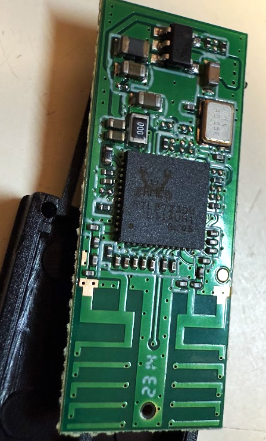

# RTL8723DU USB Dongle Testing

### Test Gear

|Test Board|USB Dongle HW|
|-|-|
|||

```
Architecture:        aarch64
Byte Order:          Little Endian
CPU(s):              2
On-line CPU(s) list: 0,1
Thread(s) per core:  1
Core(s) per socket:  2
Socket(s):           1
Vendor ID:           ARM
Model:               4
Model name:          Cortex-A53
Stepping:            r0p4
CPU max MHz:         1199.9990
CPU min MHz:         299.9990
BogoMIPS:            66.66
Flags:               fp asimd aes pmull sha1 sha2 crc32 cpuid
```

### Driver Load

The driver is loaded via "insmod"

```
[  228.631729] rtw_core: loading out-of-tree module taints kernel.
[  381.992043] usbcore: registered new interface driver rtw_8723du

Module                  Size  Used by
rtw_8723du             16384  0
rtw_8723d              45056  1 rtw_8723du
rtw_8723x              20480  1 rtw_8723d
rtw_usb                24576  1 rtw_8723du
rtw_core              208896  3 rtw_8723d,rtw_usb,rtw_8723x
```
### Network Manager

```
wlan0: flags=4163<UP,BROADCAST,RUNNING,MULTICAST>  mtu 1500
        inet 192.168.1.23  netmask 255.255.252.0  broadcast 192.168.3.255
        inet6   prefixlen 64  scopeid 0x20<link>
        ether   txqueuelen 1000  (Ethernet)
        RX packets 166  bytes 29984 (29.9 KB)
        RX errors 0  dropped 0  overruns 0  frame 0
        TX packets 43  bytes 4332 (4.3 KB)
        TX errors 0  dropped 0 overruns 0  carrier 0  collisions 0
```

### Network Speed Test via Ookla

```
   Speedtest by Ookla

Idle Latency:     4.53 ms   (jitter: 0.63ms, low: 3.44ms, high: 5.22ms)
    Download:    19.89 Mbps (data used: 28.7 MB)
                196.06 ms   (jitter: 56.06ms, low: 12.90ms, high: 1162.73ms)
      Upload:    15.59 Mbps (data used: 25.5 MB)
                120.79 ms   (jitter: 47.87ms, low: 18.07ms, high: 513.25ms)
```
### Network Ping Tests

#### DNS-Ping

```
PING 8.8.8.8 (8.8.8.8) 56(84) bytes of data.
64 bytes from 8.8.8.8: icmp_seq=1 ttl=118 time=4.24 ms
64 bytes from 8.8.8.8: icmp_seq=2 ttl=118 time=4.28 ms
64 bytes from 8.8.8.8: icmp_seq=3 ttl=118 time=3.61 ms
64 bytes from 8.8.8.8: icmp_seq=4 ttl=118 time=3.48 ms
64 bytes from 8.8.8.8: icmp_seq=5 ttl=118 time=3.99 ms
64 bytes from 8.8.8.8: icmp_seq=6 ttl=118 time=15.3 ms
64 bytes from 8.8.8.8: icmp_seq=7 ttl=118 time=8.27 ms
64 bytes from 8.8.8.8: icmp_seq=8 ttl=118 time=3.75 ms
64 bytes from 8.8.8.8: icmp_seq=9 ttl=118 time=3.25 ms
64 bytes from 8.8.8.8: icmp_seq=10 ttl=118 time=5.74 ms
64 bytes from 8.8.8.8: icmp_seq=11 ttl=118 time=3.89 ms
64 bytes from 8.8.8.8: icmp_seq=12 ttl=118 time=3.27 ms
64 bytes from 8.8.8.8: icmp_seq=13 ttl=118 time=4.90 ms
64 bytes from 8.8.8.8: icmp_seq=14 ttl=118 time=5.28 ms
64 bytes from 8.8.8.8: icmp_seq=15 ttl=118 time=16.4 ms
64 bytes from 8.8.8.8: icmp_seq=16 ttl=118 time=24.6 ms
64 bytes from 8.8.8.8: icmp_seq=17 ttl=118 time=6.93 ms
64 bytes from 8.8.8.8: icmp_seq=18 ttl=118 time=4.42 ms
64 bytes from 8.8.8.8: icmp_seq=19 ttl=118 time=3.29 ms
64 bytes from 8.8.8.8: icmp_seq=20 ttl=118 time=20.9 ms
^C
--- 8.8.8.8 ping statistics ---
20 packets transmitted, 20 received, 0% packet loss, time 19028ms
rtt min/avg/max/mdev = 3.252/7.500/24.666/6.270 ms
```

#### Self-Ping 

```
PING 192.168.1.23 (192.168.1.23) 10000(10028) bytes of data.
10008 bytes from 192.168.1.23: icmp_seq=1 ttl=64 time=0.101 ms
10008 bytes from 192.168.1.23: icmp_seq=2 ttl=64 time=0.064 ms
10008 bytes from 192.168.1.23: icmp_seq=3 ttl=64 time=0.060 ms
10008 bytes from 192.168.1.23: icmp_seq=4 ttl=64 time=0.059 ms
10008 bytes from 192.168.1.23: icmp_seq=5 ttl=64 time=0.059 ms
10008 bytes from 192.168.1.23: icmp_seq=6 ttl=64 time=0.075 ms
10008 bytes from 192.168.1.23: icmp_seq=7 ttl=64 time=0.064 ms
10008 bytes from 192.168.1.23: icmp_seq=8 ttl=64 time=0.061 ms
10008 bytes from 192.168.1.23: icmp_seq=9 ttl=64 time=0.059 ms
10008 bytes from 192.168.1.23: icmp_seq=10 ttl=64 time=0.060 ms
10008 bytes from 192.168.1.23: icmp_seq=11 ttl=64 time=0.061 ms
10008 bytes from 192.168.1.23: icmp_seq=12 ttl=64 time=0.071 ms
10008 bytes from 192.168.1.23: icmp_seq=13 ttl=64 time=0.063 ms
10008 bytes from 192.168.1.23: icmp_seq=14 ttl=64 time=0.062 ms
10008 bytes from 192.168.1.23: icmp_seq=15 ttl=64 time=0.059 ms
10008 bytes from 192.168.1.23: icmp_seq=16 ttl=64 time=0.060 ms
10008 bytes from 192.168.1.23: icmp_seq=17 ttl=64 time=0.060 ms
10008 bytes from 192.168.1.23: icmp_seq=18 ttl=64 time=0.063 ms
10008 bytes from 192.168.1.23: icmp_seq=19 ttl=64 time=0.060 ms
10008 bytes from 192.168.1.23: icmp_seq=20 ttl=64 time=0.061 ms
^C
--- 192.168.1.23 ping statistics ---
20 packets transmitted, 20 received, 0% packet loss, time 19441ms
rtt min/avg/max/mdev = 0.059/0.064/0.101/0.010 ms
```
### iw list

<details>

<summary>iw list</summary>

```
Wiphy phy0
        max # scan SSIDs: 9
        max scan IEs length: 2304 bytes
        max # sched scan SSIDs: 0
        max # match sets: 0
        max # scan plans: 1
        max scan plan interval: -1
        max scan plan iterations: 0
        Retry short limit: 7
        Retry long limit: 4
        Coverage class: 0 (up to 0m)
        Supported Ciphers:
                * WEP40 (00-0f-ac:1)
                * WEP104 (00-0f-ac:5)
                * TKIP (00-0f-ac:2)
                * CCMP-128 (00-0f-ac:4)
        Available Antennas: TX 0 RX 0
        Supported interface modes:
                 * IBSS
                 * managed
                 * AP
                 * monitor
                 * P2P-client
                 * P2P-GO
        Band 1:
                Capabilities: 0x1962
                        HT20/HT40
                        Static SM Power Save
                        RX HT20 SGI
                        RX HT40 SGI
                        RX STBC 1-stream
                        Max AMSDU length: 7935 bytes
                        DSSS/CCK HT40
                Maximum RX AMPDU length 65535 bytes (exponent: 0x003)
                Minimum RX AMPDU time spacing: 16 usec (0x07)
                HT Max RX data rate: 150 Mbps
                HT TX/RX MCS rate indexes supported: 0-7
                Bitrates (non-HT):
                        * 1.0 Mbps
                        * 2.0 Mbps
                        * 5.5 Mbps
                        * 11.0 Mbps
                        * 6.0 Mbps
                        * 9.0 Mbps
                        * 12.0 Mbps
                        * 18.0 Mbps
                        * 24.0 Mbps
                        * 36.0 Mbps
                        * 48.0 Mbps
                        * 54.0 Mbps
                Frequencies:
                        * 2412 MHz [1] (20.0 dBm)
                        * 2417 MHz [2] (20.0 dBm)
                        * 2422 MHz [3] (20.0 dBm)
                        * 2427 MHz [4] (20.0 dBm)
                        * 2432 MHz [5] (20.0 dBm)
                        * 2437 MHz [6] (20.0 dBm)
                        * 2442 MHz [7] (20.0 dBm)
                        * 2447 MHz [8] (20.0 dBm)
                        * 2452 MHz [9] (20.0 dBm)
                        * 2457 MHz [10] (20.0 dBm)
                        * 2462 MHz [11] (20.0 dBm)
                        * 2467 MHz [12] (20.0 dBm) (no IR)
                        * 2472 MHz [13] (20.0 dBm) (no IR)
                        * 2484 MHz [14] (disabled)
        Supported commands:
                 * new_interface
                 * set_interface
                 * new_key
                 * start_ap
                 * new_station
                 * set_bss
                 * join_ibss
                 * set_pmksa
                 * del_pmksa
                 * flush_pmksa
                 * remain_on_channel
                 * frame
                 * set_channel
                 * connect
                 * disconnect
        Supported TX frame types:
                 * IBSS: 0x00 0x10 0x20 0x30 0x40 0x50 0x60 0x70 0x80 0x90 0xa0 0xb0 0xc0 0xd0 0xe0 0xf0
                 * managed: 0x00 0x10 0x20 0x30 0x40 0x50 0x60 0x70 0x80 0x90 0xa0 0xb0 0xc0 0xd0 0xe0 0xf0
                 * AP: 0x00 0x10 0x20 0x30 0x40 0x50 0x60 0x70 0x80 0x90 0xa0 0xb0 0xc0 0xd0 0xe0 0xf0
                 * AP/VLAN: 0x00 0x10 0x20 0x30 0x40 0x50 0x60 0x70 0x80 0x90 0xa0 0xb0 0xc0 0xd0 0xe0 0xf0
                 * P2P-client: 0x00 0x10 0x20 0x30 0x40 0x50 0x60 0x70 0x80 0x90 0xa0 0xb0 0xc0 0xd0 0xe0 0xf0
                 * P2P-GO: 0x00 0x10 0x20 0x30 0x40 0x50 0x60 0x70 0x80 0x90 0xa0 0xb0 0xc0 0xd0 0xe0 0xf0
        Supported RX frame types:
                 * IBSS: 0xd0
                 * managed: 0x40 0xd0
                 * AP: 0x00 0x20 0x40 0xa0 0xb0 0xc0 0xd0
                 * AP/VLAN: 0x00 0x20 0x40 0xa0 0xb0 0xc0 0xd0
                 * P2P-client: 0x40 0xd0
                 * P2P-GO: 0x00 0x20 0x40 0xa0 0xb0 0xc0 0xd0
        WoWLAN support:
                 * wake up on anything (device continues operating normally)
        software interface modes (can always be added):
                 * monitor
        interface combinations are not supported
        Device supports scan flush.
```

</details>

### iwconfig

```
wlan0     IEEE 802.11  ESSID:""
          Mode:Managed  Frequency:2.412 GHz  Access Point: F8:6F:B0:0E:AE:E5
          Bit Rate=150 Mb/s   Tx-Power=12 dBm
          Retry short limit:7   RTS thr:off   Fragment thr:off
          Power Management:on
          Link Quality=47/70  Signal level=-63 dBm
          Rx invalid nwid:0  Rx invalid crypt:0  Rx invalid frag:0
          Tx excessive retries:0  Invalid misc:0   Missed beacon:0
```
### Server & Client Test via iperf3 (PC-Router-DUT)

<details>

<summary>iperf3</summary>

```
[  5] local 192.168.1.23 port 5201 connected to 192.168.1.3 port 50756
[ ID] Interval           Transfer     Bandwidth       Retr  Cwnd
[  5]   0.00-1.00   sec  1.48 MBytes  12.4 Mbits/sec    0    160 KBytes
[  5]   1.00-2.00   sec   376 KBytes  3.08 Mbits/sec    0    160 KBytes
[  5]   2.00-3.00   sec   376 KBytes  3.08 Mbits/sec    0    160 KBytes
[  5]   3.00-4.00   sec   753 KBytes  6.17 Mbits/sec    1    160 KBytes
[  5]   4.00-5.00   sec   753 KBytes  6.17 Mbits/sec    0    160 KBytes
[  5]   5.00-6.00   sec   753 KBytes  6.17 Mbits/sec    0    160 KBytes
[  5]   6.00-7.00   sec   376 KBytes  3.08 Mbits/sec    1   64.2 KBytes
[  5]   7.00-8.00   sec   314 KBytes  2.57 Mbits/sec    0   87.0 KBytes
[  5]   8.00-9.00   sec  1004 KBytes  8.23 Mbits/sec    0    123 KBytes
[  5]   9.00-10.00  sec  1.10 MBytes  9.25 Mbits/sec    0    147 KBytes
[  5]  10.00-11.00  sec  1.10 MBytes  9.25 Mbits/sec    0    147 KBytes
[  5]  11.00-12.00  sec  1.10 MBytes  9.25 Mbits/sec    0    147 KBytes
[  5]  12.00-13.00  sec   753 KBytes  6.17 Mbits/sec    0    147 KBytes
[  5]  13.00-14.00  sec  1.41 MBytes  11.8 Mbits/sec    0    147 KBytes
[  5]  14.00-15.00  sec   753 KBytes  6.16 Mbits/sec    0    147 KBytes
[  5]  15.00-16.00  sec  1.10 MBytes  9.25 Mbits/sec    1    104 KBytes
[  5]  16.00-17.00  sec  1.10 MBytes  9.25 Mbits/sec    0    111 KBytes
[  5]  17.00-18.00  sec   753 KBytes  6.17 Mbits/sec    0    120 KBytes
[  5]  18.00-19.00  sec   753 KBytes  6.17 Mbits/sec    1   84.1 KBytes
[  5]  19.00-20.00  sec   753 KBytes  6.17 Mbits/sec    0   95.5 KBytes
[  5]  20.00-21.00  sec  1.10 MBytes  9.25 Mbits/sec    0   99.8 KBytes
[  5]  21.00-22.00  sec  1.04 MBytes  8.74 Mbits/sec    0    101 KBytes
[  5]  22.00-23.00  sec   753 KBytes  6.17 Mbits/sec    0    101 KBytes
[  5]  23.00-24.00  sec   753 KBytes  6.17 Mbits/sec    0    103 KBytes
[  5]  24.00-25.00  sec  1.10 MBytes  9.25 Mbits/sec    0    110 KBytes
[  5]  25.00-26.00  sec  1.47 MBytes  12.3 Mbits/sec    0    125 KBytes
[  5]  26.00-27.00  sec  1.10 MBytes  9.25 Mbits/sec    0    138 KBytes
[  5]  27.00-28.00  sec  1.04 MBytes  8.74 Mbits/sec    0    138 KBytes
[  5]  28.00-29.00  sec  1.16 MBytes  9.76 Mbits/sec    0    138 KBytes
[  5]  29.00-30.00  sec  1.10 MBytes  9.25 Mbits/sec    0    138 KBytes
[  5]  30.00-31.00  sec   753 KBytes  6.16 Mbits/sec    0    138 KBytes
[  5]  31.00-32.00  sec  1.10 MBytes  9.25 Mbits/sec    0    138 KBytes
[  5]  32.00-33.00  sec   816 KBytes  6.68 Mbits/sec    0    138 KBytes
[  5]  33.00-34.00  sec  1.10 MBytes  9.25 Mbits/sec    0    138 KBytes
[  5]  34.00-35.00  sec  1.84 MBytes  15.4 Mbits/sec    0    138 KBytes
[  5]  35.00-36.00  sec  1.10 MBytes  9.25 Mbits/sec    0    138 KBytes
[  5]  36.00-37.00  sec  1.78 MBytes  14.9 Mbits/sec    0    138 KBytes
[  5]  37.00-38.00  sec  1.16 MBytes  9.76 Mbits/sec    0    138 KBytes
[  5]  38.00-39.00  sec  1.84 MBytes  15.4 Mbits/sec    0    138 KBytes
[  5]  39.00-40.00  sec  1.47 MBytes  12.3 Mbits/sec    0    138 KBytes
[  5]  40.00-41.00  sec  1.41 MBytes  11.8 Mbits/sec    0    138 KBytes
[  5]  41.00-42.00  sec  1.90 MBytes  15.9 Mbits/sec    0    138 KBytes
[  5]  42.00-43.00  sec  1.47 MBytes  12.3 Mbits/sec    0    138 KBytes
[  5]  43.00-44.00  sec  1.41 MBytes  11.8 Mbits/sec    0    138 KBytes
[  5]  44.00-45.00  sec  1.53 MBytes  12.8 Mbits/sec    0    138 KBytes
[  5]  45.00-46.00  sec  1.90 MBytes  15.9 Mbits/sec    0    138 KBytes
[  5]  46.00-47.00  sec  1.84 MBytes  15.4 Mbits/sec    0    138 KBytes
[  5]  47.00-48.00  sec  1.53 MBytes  12.8 Mbits/sec    0    138 KBytes
[  5]  48.00-49.00  sec   376 KBytes  3.08 Mbits/sec    0    138 KBytes
[  5]  49.00-50.00  sec   753 KBytes  6.17 Mbits/sec    0    138 KBytes
[  5]  50.00-51.00  sec   753 KBytes  6.17 Mbits/sec    1    106 KBytes
[  5]  51.00-52.00  sec  1.41 MBytes  11.8 Mbits/sec    0    121 KBytes
[  5]  51.00-52.00  sec  1.41 MBytes  11.8 Mbits/sec    0    121 KBytes
- - - - - - - - - - - - - - - - - - - - - - - - -
[ ID] Interval           Transfer     Bandwidth       Retr
[  5]   0.00-52.00  sec  57.9 MBytes  9.34 Mbits/sec    5             sender
[  5]   0.00-52.00  sec  0.00 Bytes  0.00 bits/sec                  receiver
```

</details>

### AP Test

#### hostapd.conf

Setup the configuration at /etc/hostapd/hostapd.conf

```
interface=wlan0
driver=nl80211
ieee80211n=1
hw_mode=g
channel=6
ssid=AP-TEST
wpa=2
wpa_passphrase=12345678
wpa_key_mgmt=WPA-PSK
rsn_pairwise=CCMP TKIP
wpa_pairwise=TKIP CCMP
```

#### udhcpd.conf

```
start 192.168.175.2
end 192.168.175.254
interface wlan0
max_leases 234
opt router 192.168.175.1
```

#### Start AP Test

```
sudo hostapd -dd -e /dev/urandom /etc/hostapd/hostapd.conf -B
Configuration file: /etc/hostapd/hostapd.conf
Using interface wlan0 with hwaddr  and ssid "AP-TEST"
wlan0: interface state UNINITIALIZED->ENABLED
wlan0: AP-ENABLED
```

#### Server & Client Test via iperf3 (PC-DUT)
<details>

<summary>iperf3</summary>

```
-----------------------------------------------------------
Server listening on 5201
-----------------------------------------------------------
Accepted connection from 192.168.175.86, port 51021
[  5] local 192.168.175.1 port 5201 connected to 192.168.175.86 port 51022
[ ID] Interval           Transfer     Bandwidth       Retr  Cwnd
[  5]   0.00-1.00   sec  2.25 MBytes  18.9 Mbits/sec   19   61.3 KBytes
[  5]   1.00-2.00   sec  2.54 MBytes  21.3 Mbits/sec    1   65.6 KBytes
[  5]   2.00-3.00   sec  2.45 MBytes  20.6 Mbits/sec    0   75.6 KBytes
[  5]   3.00-4.00   sec  2.94 MBytes  24.7 Mbits/sec    0   89.8 KBytes
[  5]   4.00-5.00   sec  3.06 MBytes  25.7 Mbits/sec    0   98.4 KBytes
[  5]   5.00-6.00   sec  3.25 MBytes  27.2 Mbits/sec    0    108 KBytes
[  5]   6.00-7.00   sec  2.82 MBytes  23.6 Mbits/sec    0    117 KBytes
[  5]   7.00-8.00   sec  3.06 MBytes  25.7 Mbits/sec    0    123 KBytes
[  5]   8.00-9.00   sec  3.80 MBytes  31.9 Mbits/sec    0    150 KBytes
[  5]   9.00-10.00  sec  4.35 MBytes  36.5 Mbits/sec    0    211 KBytes
[  5]  10.00-11.00  sec  4.23 MBytes  35.5 Mbits/sec    0    284 KBytes
[  5]  11.00-12.00  sec  4.84 MBytes  40.6 Mbits/sec    0    284 KBytes
[  5]  12.00-13.00  sec  4.17 MBytes  34.9 Mbits/sec    0    284 KBytes
[  5]  13.00-14.00  sec  5.15 MBytes  43.2 Mbits/sec    0    435 KBytes
[  5]  14.00-15.00  sec  4.41 MBytes  37.0 Mbits/sec    0    435 KBytes
[  5]  15.00-16.00  sec  4.61 MBytes  38.6 Mbits/sec    0    660 KBytes
[  5]  16.00-17.00  sec  5.00 MBytes  41.9 Mbits/sec    0    660 KBytes
[  5]  17.00-18.00  sec  3.75 MBytes  31.5 Mbits/sec    0    660 KBytes
[  5]  18.00-19.00  sec  3.75 MBytes  31.5 Mbits/sec    0    660 KBytes
[  5]  19.00-20.00  sec  3.75 MBytes  31.5 Mbits/sec    0    660 KBytes
[  5]  20.00-21.00  sec  5.00 MBytes  42.0 Mbits/sec    0    660 KBytes
[  5]  21.00-22.00  sec  5.00 MBytes  41.9 Mbits/sec    0    660 KBytes
[  5]  22.00-23.00  sec  3.75 MBytes  31.5 Mbits/sec    0    660 KBytes
[  5]  23.00-24.00  sec  3.75 MBytes  31.5 Mbits/sec    0    660 KBytes
[  5]  24.00-25.00  sec  5.00 MBytes  41.9 Mbits/sec    0    660 KBytes
[  5]  25.00-26.00  sec  3.75 MBytes  31.5 Mbits/sec    0    660 KBytes
[  5]  26.00-27.00  sec  5.00 MBytes  41.9 Mbits/sec    0    660 KBytes
[  5]  27.00-28.00  sec  3.75 MBytes  31.5 Mbits/sec    0    660 KBytes
[  5]  28.00-29.00  sec  5.00 MBytes  42.0 Mbits/sec    0    660 KBytes
[  5]  29.00-30.00  sec  3.75 MBytes  31.5 Mbits/sec    0    660 KBytes
[  5]  30.00-31.00  sec  5.00 MBytes  42.0 Mbits/sec    0    660 KBytes
[  5]  31.00-32.00  sec  3.75 MBytes  31.5 Mbits/sec    0    660 KBytes
[  5]  32.00-33.00  sec  5.00 MBytes  41.9 Mbits/sec    0    660 KBytes
[  5]  33.00-34.00  sec  5.00 MBytes  41.9 Mbits/sec    0    660 KBytes
[  5]  34.00-35.00  sec  3.75 MBytes  31.5 Mbits/sec    0    660 KBytes
[  5]  35.00-36.00  sec  3.75 MBytes  31.5 Mbits/sec    0    660 KBytes
[  5]  36.00-37.00  sec  3.75 MBytes  31.5 Mbits/sec    0    660 KBytes
[  5]  37.00-38.00  sec  3.75 MBytes  31.5 Mbits/sec    0    660 KBytes
[  5]  38.00-39.00  sec  5.00 MBytes  41.9 Mbits/sec    0    660 KBytes
[  5]  39.00-40.00  sec  3.75 MBytes  31.5 Mbits/sec    0    660 KBytes
[  5]  40.00-41.00  sec  5.00 MBytes  42.0 Mbits/sec    0    660 KBytes
[  5]  41.00-42.00  sec  3.75 MBytes  31.5 Mbits/sec    0    660 KBytes
[  5]  42.00-43.00  sec  3.75 MBytes  31.5 Mbits/sec    0    660 KBytes
[  5]  43.00-44.00  sec  5.00 MBytes  42.0 Mbits/sec    0    660 KBytes
[  5]  44.00-45.00  sec  3.75 MBytes  31.5 Mbits/sec    0    660 KBytes
[  5]  45.00-46.00  sec  5.00 MBytes  42.0 Mbits/sec    0    660 KBytes
[  5]  46.00-47.00  sec  3.75 MBytes  31.5 Mbits/sec    0    660 KBytes
[  5]  47.00-48.00  sec  5.00 MBytes  41.9 Mbits/sec    0    660 KBytes
[  5]  48.00-49.00  sec  5.00 MBytes  41.9 Mbits/sec    0    660 KBytes
[  5]  49.00-50.00  sec  5.00 MBytes  41.9 Mbits/sec    0    660 KBytes
[  5]  50.00-51.00  sec  5.00 MBytes  41.9 Mbits/sec    0    660 KBytes
[  5]  51.00-52.00  sec  3.75 MBytes  31.5 Mbits/sec    0    660 KBytes
[  5]  52.00-53.00  sec  5.00 MBytes  41.9 Mbits/sec    0    660 KBytes
[  5]  53.00-54.00  sec  5.00 MBytes  41.9 Mbits/sec    0    660 KBytes
[  5]  54.00-55.00  sec  5.00 MBytes  41.9 Mbits/sec    0    660 KBytes
[  5]  55.00-56.00  sec  3.75 MBytes  31.5 Mbits/sec    0    660 KBytes
[  5]  56.00-57.00  sec  5.00 MBytes  41.9 Mbits/sec    0    660 KBytes
[  5]  57.00-58.00  sec  5.00 MBytes  41.9 Mbits/sec    0    660 KBytes
[  5]  58.00-59.00  sec  3.75 MBytes  31.5 Mbits/sec    0    660 KBytes
[  5]  59.00-60.00  sec  5.00 MBytes  41.9 Mbits/sec    0    660 KBytes
[  5]  60.00-61.00  sec  5.00 MBytes  41.9 Mbits/sec    0    660 KBytes
[  5]  61.00-62.00  sec  3.75 MBytes  31.5 Mbits/sec    0    660 KBytes
[  5]  62.00-63.00  sec  5.00 MBytes  42.0 Mbits/sec    0    660 KBytes
[  5]  63.00-64.00  sec  3.75 MBytes  31.5 Mbits/sec    0    660 KBytes
[  5]  64.00-65.00  sec  5.00 MBytes  42.0 Mbits/sec    0    660 KBytes
[  5]  65.00-66.00  sec  3.75 MBytes  31.5 Mbits/sec    0    660 KBytes
[  5]  66.00-67.00  sec  5.00 MBytes  42.0 Mbits/sec    0    660 KBytes
[  5]  67.00-68.00  sec  3.75 MBytes  31.4 Mbits/sec    0    660 KBytes
[  5]  68.00-69.00  sec  5.00 MBytes  42.0 Mbits/sec    0    660 KBytes
[  5]  69.00-70.00  sec  3.75 MBytes  31.5 Mbits/sec    0    660 KBytes
[  5]  70.00-71.00  sec  3.75 MBytes  31.5 Mbits/sec    0    660 KBytes
[  5]  70.00-71.00  sec  3.75 MBytes  31.5 Mbits/sec    0    660 KBytes
- - - - - - - - - - - - - - - - - - - - - - - - -
[ ID] Interval           Transfer     Bandwidth       Retr
[  5]   0.00-71.00  sec   299 MBytes  35.3 Mbits/sec   20             sender
[  5]   0.00-71.00  sec  0.00 Bytes  0.00 bits/sec                  receiver
```

</details>
