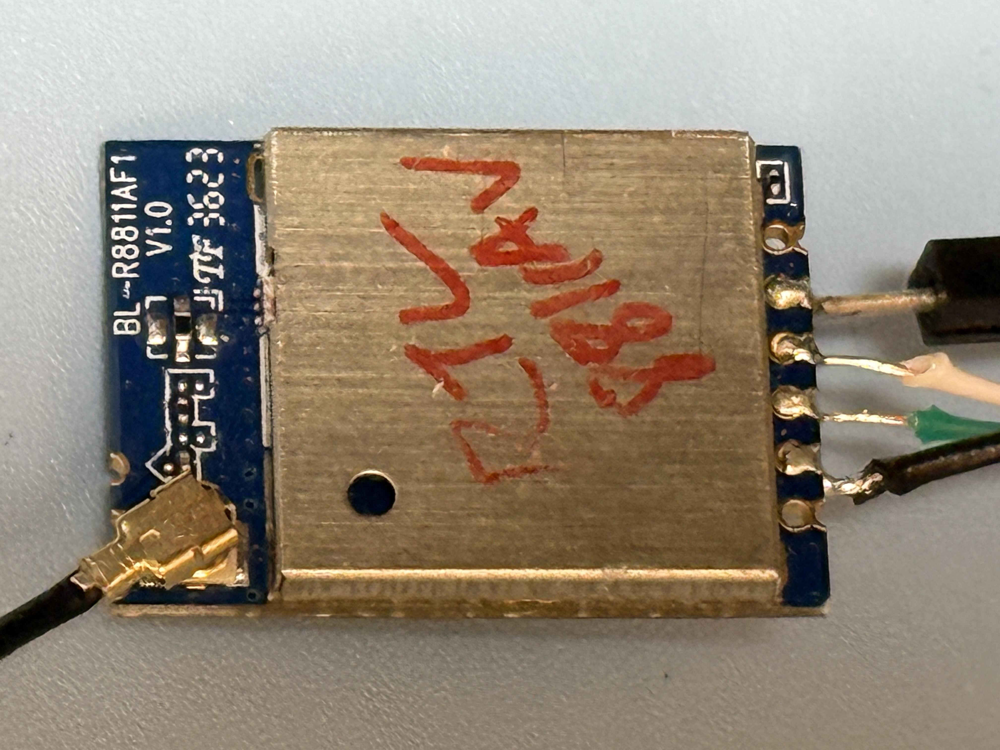

# RTL8811AU USB Dongle Testing

### Test USB Gear

|Test Board|USB Dongle HW|
|-|-|
|||

```
6.1.111-rt42

DISTRIB_ID=Ubuntu
DISTRIB_RELEASE=20.04
DISTRIB_CODENAME=focal
DISTRIB_DESCRIPTION="Ubuntu 20.04.2 LTS"

Architecture:                         aarch64
CPU op-mode(s):                       32-bit, 64-bit
Byte Order:                           Little Endian
CPU(s):                               2
On-line CPU(s) list:                  0,1
Thread(s) per core:                   1
Core(s) per socket:                   2
Socket(s):                            1
Vendor ID:                            ARM
Model:                                0
Model name:                           Cortex-A35
Stepping:                             r1p0
BogoMIPS:                             66.66
Vulnerability Gather data sampling:   Not affected
Vulnerability Itlb multihit:          Not affected
Vulnerability L1tf:                   Not affected
Vulnerability Mds:                    Not affected
Vulnerability Meltdown:               Not affected
Vulnerability Mmio stale data:        Not affected
Vulnerability Reg file data sampling: Not affected
Vulnerability Retbleed:               Not affected
Vulnerability Spec rstack overflow:   Not affected
Vulnerability Spec store bypass:      Not affected
Vulnerability Spectre v1:             Mitigation; __user pointer sanitization
Vulnerability Spectre v2:             Not affected
Vulnerability Srbds:                  Not affected
Vulnerability Tsx async abort:        Not affected
Flags:                                fp asimd evtstrm aes pmull sha1 sha2 crc32 cpuid
```

### USB Tree

```
Before driver is inserted.
/:  Bus 01.Port 1: Dev 1, Class=root_hub, Driver=dwc2/1p, 480M
    |__ Port 1: Dev 2, If 0, Class=Vendor Specific Class, Driver=, 480M

After driver is inserted.
/:  Bus 01.Port 1: Dev 1, Class=root_hub, Driver=dwc2/1p, 480M
    |__ Port 1: Dev 2, If 0, Class=Vendor Specific Class, Driver=rtw_8821au, 480M
```

<details>

<summary>USB Details</summary>

```

Bus 001 Device 002: ID 0bda:0811 Realtek Semiconductor Corp. 802.11ac WLAN Adapter 
Device Descriptor:
  bLength                18
  bDescriptorType         1
  bcdUSB               2.10
  bDeviceClass            0 
  bDeviceSubClass         0 
  bDeviceProtocol         0 
  bMaxPacketSize0        64
  idVendor           0x0bda Realtek Semiconductor Corp.
  idProduct          0x0811 
  bcdDevice            2.00
  iManufacturer           1 Realtek 
  iProduct                2 802.11ac WLAN Adapter 
  iSerial                 3 00e04c000001
  bNumConfigurations      1
  Configuration Descriptor:
    bLength                 9
    bDescriptorType         2
    wTotalLength       0x003c
    bNumInterfaces          1
    bConfigurationValue     1
    iConfiguration          0 
    bmAttributes         0xe0
      Self Powered
      Remote Wakeup
    MaxPower              500mA
    Interface Descriptor:
      bLength                 9
      bDescriptorType         4
      bInterfaceNumber        0
      bAlternateSetting       0
      bNumEndpoints           6
      bInterfaceClass       255 Vendor Specific Class
      bInterfaceSubClass    255 Vendor Specific Subclass
      bInterfaceProtocol    255 Vendor Specific Protocol
      iInterface              2 802.11ac WLAN Adapter 
      Endpoint Descriptor:
        bLength                 7
        bDescriptorType         5
        bEndpointAddress     0x84  EP 4 IN
        bmAttributes            2
          Transfer Type            Bulk
          Synch Type               None
          Usage Type               Data
        wMaxPacketSize     0x0200  1x 512 bytes
        bInterval               0
      Endpoint Descriptor:
        bLength                 7
        bDescriptorType         5
        bEndpointAddress     0x05  EP 5 OUT
        bmAttributes            2
          Transfer Type            Bulk
          Synch Type               None
          Usage Type               Data
        wMaxPacketSize     0x0200  1x 512 bytes
        bInterval               0
      Endpoint Descriptor:
        bLength                 7
        bDescriptorType         5
        bEndpointAddress     0x06  EP 6 OUT
        bmAttributes            2
          Transfer Type            Bulk
          Synch Type               None
          Usage Type               Data
        wMaxPacketSize     0x0200  1x 512 bytes
        bInterval               0
      Endpoint Descriptor:
        bLength                 7
        bDescriptorType         5
        bEndpointAddress     0x87  EP 7 IN
        bmAttributes            3
          Transfer Type            Interrupt
          Synch Type               None
          Usage Type               Data
        wMaxPacketSize     0x0040  1x 64 bytes
        bInterval               3
      Endpoint Descriptor:
        bLength                 7
        bDescriptorType         5
        bEndpointAddress     0x08  EP 8 OUT
        bmAttributes            2
          Transfer Type            Bulk
          Synch Type               None
          Usage Type               Data
        wMaxPacketSize     0x0200  1x 512 bytes
        bInterval               0
      Endpoint Descriptor:
        bLength                 7
        bDescriptorType         5
        bEndpointAddress     0x09  EP 9 OUT
        bmAttributes            2
          Transfer Type            Bulk
          Synch Type               None
          Usage Type               Data
        wMaxPacketSize     0x0200  1x 512 bytes
        bInterval               0
Binary Object Store Descriptor:
  bLength                 5
  bDescriptorType        15
  wTotalLength       0x000c
  bNumDeviceCaps          1
  USB 2.0 Extension Device Capability:
    bLength                 7
    bDescriptorType        16
    bDevCapabilityType      2
    bmAttributes   0x00000002
      HIRD Link Power Management (LPM) Supported
Device Status:     0x0001
  Self Powered
```

</details>

### Driver Load

The driver is loaded via "insmod"

```
Module                  Size  Used by
rtw_8821au             16384  0
rtw_8821a              36864  1 rtw_8821au
rtw_88xxa              36864  1 rtw_8821a
rtw_usb                24576  1 rtw_8821au
rtw_core              217088  3 rtw_88xxa,rtw_usb,rtw_8821a
```

### iw list

<details>

<summary>iw list</summary>

```
Wiphy phy1
	max # scan SSIDs: 4
	max scan IEs length: 2243 bytes
	max # sched scan SSIDs: 0
	max # match sets: 0
	Retry short limit: 7
	Retry long limit: 4
	Coverage class: 0 (up to 0m)
	Device supports T-DLS.
	Supported Ciphers:
		* WEP40 (00-0f-ac:1)
		* WEP104 (00-0f-ac:5)
		* TKIP (00-0f-ac:2)
		* CCMP-128 (00-0f-ac:4)
		* CCMP-256 (00-0f-ac:10)
		* GCMP-128 (00-0f-ac:8)
		* GCMP-256 (00-0f-ac:9)
		* CMAC (00-0f-ac:6)
		* CMAC-256 (00-0f-ac:13)
		* GMAC-128 (00-0f-ac:11)
		* GMAC-256 (00-0f-ac:12)
	Available Antennas: TX 0x1 RX 0x1
	Configured Antennas: TX 0x1 RX 0x1
	Supported interface modes:
		 * IBSS
		 * managed
		 * AP
		 * AP/VLAN
		 * monitor
		 * P2P-client
		 * P2P-GO
	Band 1:
		Capabilities: 0x196e
			HT20/HT40
			SM Power Save disabled
			RX HT20 SGI
			RX HT40 SGI
			RX STBC 1-stream
			Max AMSDU length: 7935 bytes
			DSSS/CCK HT40
		Maximum RX AMPDU length 65535 bytes (exponent: 0x003)
		Minimum RX AMPDU time spacing: 16 usec (0x07)
		HT Max RX data rate: 150 Mbps
		HT TX/RX MCS rate indexes supported: 0-7, 32
		Bitrates (non-HT):
			* 1.0 Mbps
			* 2.0 Mbps
			* 5.5 Mbps
			* 11.0 Mbps
			* 6.0 Mbps
			* 9.0 Mbps
			* 12.0 Mbps
			* 18.0 Mbps
			* 24.0 Mbps
			* 36.0 Mbps
			* 48.0 Mbps
			* 54.0 Mbps
		Frequencies:
			* 2412 MHz [1] (20.0 dBm)
			* 2417 MHz [2] (20.0 dBm)
			* 2422 MHz [3] (20.0 dBm)
			* 2427 MHz [4] (20.0 dBm)
			* 2432 MHz [5] (20.0 dBm)
			* 2437 MHz [6] (20.0 dBm)
			* 2442 MHz [7] (20.0 dBm)
			* 2447 MHz [8] (20.0 dBm)
			* 2452 MHz [9] (20.0 dBm)
			* 2457 MHz [10] (20.0 dBm)
			* 2462 MHz [11] (20.0 dBm)
			* 2467 MHz [12] (20.0 dBm)
			* 2472 MHz [13] (20.0 dBm)
			* 2484 MHz [14] (disabled)
	Band 2:
		Capabilities: 0x196e
			HT20/HT40
			SM Power Save disabled
			RX HT20 SGI
			RX HT40 SGI
			RX STBC 1-stream
			Max AMSDU length: 7935 bytes
			DSSS/CCK HT40
		Maximum RX AMPDU length 65535 bytes (exponent: 0x003)
		Minimum RX AMPDU time spacing: 16 usec (0x07)
		HT Max RX data rate: 150 Mbps
		HT TX/RX MCS rate indexes supported: 0-7, 32
		VHT Capabilities (0x03d07122):
			Max MPDU length: 11454
			Supported Channel Width: neither 160 nor 80+80
			short GI (80 MHz)
			SU Beamformee
			MU Beamformee
			+HTC-VHT
		VHT RX MCS set:
			1 streams: MCS 0-9
			2 streams: not supported
			3 streams: not supported
			4 streams: not supported
			5 streams: not supported
			6 streams: not supported
			7 streams: not supported
			8 streams: not supported
		VHT RX highest supported: 390 Mbps
		VHT TX MCS set:
			1 streams: MCS 0-9
			2 streams: not supported
			3 streams: not supported
			4 streams: not supported
			5 streams: not supported
			6 streams: not supported
			7 streams: not supported
			8 streams: not supported
		VHT TX highest supported: 390 Mbps
		Bitrates (non-HT):
			* 6.0 Mbps
			* 9.0 Mbps
			* 12.0 Mbps
			* 18.0 Mbps
			* 24.0 Mbps
			* 36.0 Mbps
			* 48.0 Mbps
			* 54.0 Mbps
		Frequencies:
			* 5180 MHz [36] (23.0 dBm)
			* 5200 MHz [40] (23.0 dBm)
			* 5220 MHz [44] (23.0 dBm)
			* 5240 MHz [48] (23.0 dBm)
			* 5260 MHz [52] (20.0 dBm) (radar detection)
			* 5280 MHz [56] (20.0 dBm) (radar detection)
			* 5300 MHz [60] (20.0 dBm) (radar detection)
			* 5320 MHz [64] (20.0 dBm) (radar detection)
			* 5500 MHz [100] (26.0 dBm) (radar detection)
			* 5520 MHz [104] (26.0 dBm) (radar detection)
			* 5540 MHz [108] (26.0 dBm) (radar detection)
			* 5560 MHz [112] (26.0 dBm) (radar detection)
			* 5580 MHz [116] (26.0 dBm) (radar detection)
			* 5600 MHz [120] (26.0 dBm) (radar detection)
			* 5620 MHz [124] (26.0 dBm) (radar detection)
			* 5640 MHz [128] (26.0 dBm) (radar detection)
			* 5660 MHz [132] (26.0 dBm) (radar detection)
			* 5680 MHz [136] (26.0 dBm) (radar detection)
			* 5700 MHz [140] (26.0 dBm) (radar detection)
			* 5720 MHz [144] (13.0 dBm) (radar detection)
			* 5745 MHz [149] (13.0 dBm)
			* 5765 MHz [153] (13.0 dBm)
			* 5785 MHz [157] (13.0 dBm)
			* 5805 MHz [161] (13.0 dBm)
			* 5825 MHz [165] (13.0 dBm)
	Supported commands:
		 * new_interface
		 * set_interface
		 * new_key
		 * start_ap
		 * new_station
		 * set_bss
		 * authenticate
		 * associate
		 * deauthenticate
		 * disassociate
		 * join_ibss
		 * remain_on_channel
		 * set_tx_bitrate_mask
		 * frame
		 * frame_wait_cancel
		 * set_wiphy_netns
		 * set_channel
		 * tdls_mgmt
		 * tdls_oper
		 * probe_client
		 * set_noack_map
		 * register_beacons
		 * start_p2p_device
		 * set_mcast_rate
		 * connect
		 * disconnect
		 * set_qos_map
		 * set_multicast_to_unicast
		 * Unknown command (140)
	software interface modes (can always be added):
		 * AP/VLAN
		 * monitor
	valid interface combinations:
		 * #{ managed } <= 1, #{ AP, P2P-client, P2P-GO } <= 1,
		   total <= 2, #channels <= 1
	HT Capability overrides:
		 * MCS: ff ff ff ff ff ff ff ff ff ff
		 * maximum A-MSDU length
		 * supported channel width
		 * short GI for 40 MHz
		 * max A-MPDU length exponent
		 * min MPDU start spacing
	Device supports TX status socket option.
	Device supports HT-IBSS.
	Device supports SAE with AUTHENTICATE command
	Device supports scan flush.
	Device supports per-vif TX power setting
	Driver supports full state transitions for AP/GO clients
	Driver supports a userspace MPM
	Device supports configuring vdev MAC-addr on create.
	Device supports randomizing MAC-addr in scans.
	max # scan plans: 1
	max scan plan interval: -1
	max scan plan iterations: 0
	Supported TX frame types:
		 * IBSS: 0x00 0x10 0x20 0x30 0x40 0x50 0x60 0x70 0x80 0x90 0xa0 0xb0 0xc0 0xd0 0xe0 0xf0
		 * managed: 0x00 0x10 0x20 0x30 0x40 0x50 0x60 0x70 0x80 0x90 0xa0 0xb0 0xc0 0xd0 0xe0 0xf0
		 * AP: 0x00 0x10 0x20 0x30 0x40 0x50 0x60 0x70 0x80 0x90 0xa0 0xb0 0xc0 0xd0 0xe0 0xf0
		 * AP/VLAN: 0x00 0x10 0x20 0x30 0x40 0x50 0x60 0x70 0x80 0x90 0xa0 0xb0 0xc0 0xd0 0xe0 0xf0
		 * mesh point: 0x00 0x10 0x20 0x30 0x40 0x50 0x60 0x70 0x80 0x90 0xa0 0xb0 0xc0 0xd0 0xe0 0xf0
		 * P2P-client: 0x00 0x10 0x20 0x30 0x40 0x50 0x60 0x70 0x80 0x90 0xa0 0xb0 0xc0 0xd0 0xe0 0xf0
		 * P2P-GO: 0x00 0x10 0x20 0x30 0x40 0x50 0x60 0x70 0x80 0x90 0xa0 0xb0 0xc0 0xd0 0xe0 0xf0
		 * P2P-device: 0x00 0x10 0x20 0x30 0x40 0x50 0x60 0x70 0x80 0x90 0xa0 0xb0 0xc0 0xd0 0xe0 0xf0
	Supported RX frame types:
		 * IBSS: 0x40 0xb0 0xc0 0xd0
		 * managed: 0x40 0xb0 0xd0
		 * AP: 0x00 0x20 0x40 0xa0 0xb0 0xc0 0xd0
		 * AP/VLAN: 0x00 0x20 0x40 0xa0 0xb0 0xc0 0xd0
		 * mesh point: 0xb0 0xc0 0xd0
		 * P2P-client: 0x40 0xd0
		 * P2P-GO: 0x00 0x20 0x40 0xa0 0xb0 0xc0 0xd0
		 * P2P-device: 0x40 0xd0
	Supported extended features:
		* [ RRM ]: RRM
		* [ SET_SCAN_DWELL ]: scan dwell setting
		* [ FILS_STA ]: STA FILS (Fast Initial Link Setup)
		* [ CONTROL_PORT_OVER_NL80211 ]: control port over nl80211
		* [ TXQS ]: FQ-CoDel-enabled intermediate TXQs
```

</details>

### Network Manager - Band 2.4

```
wlan0: flags=4163<UP,BROADCAST,RUNNING,MULTICAST>  mtu 1500
        inet 192.168.1.20  netmask 255.255.252.0  broadcast 192.168.3.255
        RX packets 18  bytes 2554 (2.5 KB)
        RX errors 0  dropped 0  overruns 0  frame 0
        TX packets 43  bytes 7549 (7.5 KB)
        TX errors 0  dropped 0 overruns 0  carrier 0  collisions 0
```

### iwconfig 2.4

```
wlan0     IEEE 802.11  ESSID:""  
          Mode:Managed  Frequency:2.412 GHz  Access Point: 
          Bit Rate=54 Mb/s   Tx-Power=20 dBm   
          Retry short limit:7   RTS thr:off   Fragment thr:off
          Encryption key:off
          Power Management:on
          Link Quality=54/70  Signal level=-56 dBm  
          Rx invalid nwid:0  Rx invalid crypt:0  Rx invalid frag:0
          Tx excessive retries:0  Invalid misc:1   Missed beacon:0

```

### Network Speed Test via Ookla - Band 2.4

```
Retrieving speedtest.net configuration...
Retrieving speedtest.net server list...
Selecting best server based on ping...
Testing download speed................................................................................
Download: 25.02 Mbit/s
Testing upload speed......................................................................................................
Upload: 10.93 Mbit/s
```

### Network Ping Tests - Band 2.4

#### DNS-Ping

```
PING 8.8.8.8 (8.8.8.8) 56(84) bytes of data.
64 bytes from 8.8.8.8: icmp_seq=1 ttl=118 time=4.40 ms
64 bytes from 8.8.8.8: icmp_seq=2 ttl=118 time=3.77 ms
64 bytes from 8.8.8.8: icmp_seq=3 ttl=118 time=4.03 ms
64 bytes from 8.8.8.8: icmp_seq=4 ttl=118 time=6.47 ms
64 bytes from 8.8.8.8: icmp_seq=5 ttl=118 time=6.04 ms
64 bytes from 8.8.8.8: icmp_seq=6 ttl=118 time=5.17 ms
64 bytes from 8.8.8.8: icmp_seq=7 ttl=118 time=4.35 ms
64 bytes from 8.8.8.8: icmp_seq=8 ttl=118 time=4.06 ms
64 bytes from 8.8.8.8: icmp_seq=9 ttl=118 time=4.63 ms
64 bytes from 8.8.8.8: icmp_seq=10 ttl=118 time=4.80 ms
64 bytes from 8.8.8.8: icmp_seq=11 ttl=118 time=5.48 ms
64 bytes from 8.8.8.8: icmp_seq=12 ttl=118 time=10.1 ms
64 bytes from 8.8.8.8: icmp_seq=13 ttl=118 time=5.90 ms
64 bytes from 8.8.8.8: icmp_seq=14 ttl=118 time=4.89 ms
64 bytes from 8.8.8.8: icmp_seq=15 ttl=118 time=4.42 ms
64 bytes from 8.8.8.8: icmp_seq=16 ttl=118 time=4.52 ms
64 bytes from 8.8.8.8: icmp_seq=17 ttl=118 time=4.40 ms
64 bytes from 8.8.8.8: icmp_seq=18 ttl=118 time=5.81 ms
64 bytes from 8.8.8.8: icmp_seq=19 ttl=118 time=5.56 ms
64 bytes from 8.8.8.8: icmp_seq=20 ttl=118 time=4.66 ms

--- 8.8.8.8 ping statistics ---
20 packets transmitted, 20 received, 0% packet loss, time 19029ms
rtt min/avg/max/mdev = 3.769/5.171/10.084/1.339 ms
```

#### Self-Ping 

```
PING 192.168.1.20 (192.168.1.20) 10000(10028) bytes of data.
10008 bytes from 192.168.1.20: icmp_seq=1 ttl=64 time=0.126 ms
10008 bytes from 192.168.1.20: icmp_seq=2 ttl=64 time=0.127 ms
10008 bytes from 192.168.1.20: icmp_seq=3 ttl=64 time=0.147 ms
10008 bytes from 192.168.1.20: icmp_seq=4 ttl=64 time=0.141 ms
10008 bytes from 192.168.1.20: icmp_seq=5 ttl=64 time=0.120 ms
10008 bytes from 192.168.1.20: icmp_seq=6 ttl=64 time=0.114 ms
10008 bytes from 192.168.1.20: icmp_seq=7 ttl=64 time=0.099 ms
10008 bytes from 192.168.1.20: icmp_seq=8 ttl=64 time=0.149 ms
10008 bytes from 192.168.1.20: icmp_seq=9 ttl=64 time=0.143 ms
10008 bytes from 192.168.1.20: icmp_seq=10 ttl=64 time=0.143 ms
10008 bytes from 192.168.1.20: icmp_seq=11 ttl=64 time=0.136 ms
10008 bytes from 192.168.1.20: icmp_seq=12 ttl=64 time=0.092 ms
10008 bytes from 192.168.1.20: icmp_seq=13 ttl=64 time=0.091 ms
10008 bytes from 192.168.1.20: icmp_seq=14 ttl=64 time=0.124 ms
10008 bytes from 192.168.1.20: icmp_seq=15 ttl=64 time=0.146 ms
10008 bytes from 192.168.1.20: icmp_seq=16 ttl=64 time=0.142 ms
10008 bytes from 192.168.1.20: icmp_seq=17 ttl=64 time=0.095 ms
10008 bytes from 192.168.1.20: icmp_seq=18 ttl=64 time=0.094 ms
10008 bytes from 192.168.1.20: icmp_seq=19 ttl=64 time=0.109 ms
10008 bytes from 192.168.1.20: icmp_seq=20 ttl=64 time=0.140 ms

--- 192.168.1.20 ping statistics ---
20 packets transmitted, 20 received, 0% packet loss, time 19457ms
rtt min/avg/max/mdev = 0.091/0.123/0.149/0.020 ms
```

### Server & Client Test via iperf3 (PC-Router-DUT)

<details>

<summary>iperf3</summary>

```
-----------------------------------------------------------
Server listening on 5201
-----------------------------------------------------------
Accepted connection from 192.168.1.3, port 62142
[  5] local 192.168.1.20 port 5201 connected to 192.168.1.3 port 62143
[ ID] Interval           Transfer     Bitrate         Retr  Cwnd
[  5]   0.00-1.00   sec  5.65 MBytes  47.4 Mbits/sec    0    135 KBytes       
[  5]   1.00-2.00   sec  5.88 MBytes  49.3 Mbits/sec    0    269 KBytes       
[  5]   2.00-3.00   sec  3.31 MBytes  27.7 Mbits/sec    0    269 KBytes       
[  5]   3.00-4.00   sec  4.04 MBytes  33.9 Mbits/sec    0    269 KBytes       
[  5]   4.00-5.00   sec  4.04 MBytes  33.9 Mbits/sec    0    269 KBytes       
[  5]   5.00-6.00   sec  4.72 MBytes  39.6 Mbits/sec    0    269 KBytes       
[  5]   6.00-7.00   sec  5.02 MBytes  42.1 Mbits/sec    0    269 KBytes       
[  5]   7.00-8.00   sec  3.31 MBytes  27.7 Mbits/sec    0   65.6 KBytes       
[  5]   8.00-9.00   sec  0.00 Bytes  0.00 bits/sec    1    188 KBytes       
[  5]   9.00-10.00  sec  0.00 Bytes  0.00 bits/sec    3   85.5 KBytes       
[  5]  10.00-11.00  sec   565 KBytes  4.63 Mbits/sec    1   94.1 KBytes       
[  5]  11.00-12.00  sec  0.00 Bytes  0.00 bits/sec    0    101 KBytes       
[  5]  12.00-13.00  sec  0.00 Bytes  0.00 bits/sec    0    106 KBytes       
[  5]  13.00-14.00  sec  0.00 Bytes  0.00 bits/sec    0    111 KBytes       
[  5]  14.00-15.00  sec  2.21 MBytes  18.5 Mbits/sec    1   97.0 KBytes       
[  5]  15.00-16.00  sec  4.04 MBytes  33.9 Mbits/sec    0    121 KBytes       
[  5]  16.00-17.00  sec  1.65 MBytes  13.9 Mbits/sec    0    133 KBytes       
[  5]  17.00-18.00  sec  1.65 MBytes  13.9 Mbits/sec    0    143 KBytes       
[  5]  18.00-19.00  sec  5.02 MBytes  42.2 Mbits/sec    0    167 KBytes       
[  5]  19.00-20.00  sec  5.08 MBytes  42.7 Mbits/sec    0    190 KBytes       
[  5]  20.00-21.00  sec  5.39 MBytes  45.2 Mbits/sec    0    210 KBytes       
[  5]  21.00-22.00  sec  4.10 MBytes  34.4 Mbits/sec    0    222 KBytes       
[  5]  22.00-23.00  sec  3.68 MBytes  30.8 Mbits/sec    0    235 KBytes       
[  5]  23.00-24.00  sec  5.21 MBytes  43.7 Mbits/sec    0    250 KBytes       
[  5]  24.00-25.00  sec  4.04 MBytes  33.9 Mbits/sec    0    259 KBytes       
[  5]  25.00-26.00  sec  4.10 MBytes  34.4 Mbits/sec    0    259 KBytes       
[  5]  26.00-27.00  sec  4.04 MBytes  33.9 Mbits/sec    0    259 KBytes       
[  5]  27.00-28.00  sec  3.43 MBytes  28.8 Mbits/sec    0    259 KBytes       
[  5]  28.00-29.00  sec  5.15 MBytes  43.2 Mbits/sec    0    259 KBytes       
[  5]  29.00-30.00  sec  4.59 MBytes  38.5 Mbits/sec    0    259 KBytes       
- - - - - - - - - - - - - - - - - - - - - - - - -
[ ID] Interval           Transfer     Bitrate         Retr
[  5]   0.00-30.03  sec  99.9 MBytes  27.9 Mbits/sec    6             sender
-----------------------------------------------------------
Server listening on 5201
-----------------------------------------------------------
[  161.779676] rtw_core: loading out-of-tree module taints kernel.
[  162.154080] rtw_8821au 1-1:1.0: Firmware version 42.4.0, H2C version 0
[  162.689205] usbcore: registered new interface driver rtw_8821au
[  195.871876] usbcore: deregistering interface driver rtw_8821au
[  219.700510] rtw_8821au 1-1:1.0: Firmware version 42.4.0, H2C version 0
[  220.242299] usbcore: registered new interface driver rtw_8821au
```

</details>

### Network Manager - Band 5G

```
wlan0: flags=4163<UP,BROADCAST,RUNNING,MULTICAST>  mtu 1500
        inet 192.168.1.20  netmask 255.255.252.0  broadcast 192.168.3.255
        RX packets 52775  bytes 40346556 (40.3 MB)
        RX errors 0  dropped 18  overruns 0  frame 0
        TX packets 98244  bytes 126604686 (126.6 MB)
        TX errors 0  dropped 0 overruns 0  carrier 0  collisions 0
```

### iwconfig 5G

```
wlan0     IEEE 802.11  ESSID:""  
          Mode:Managed  Frequency:5.745 GHz  Access Point: 
          Bit Rate=292.6 Mb/s   Tx-Power=13 dBm   
          Retry short limit:7   RTS thr:off   Fragment thr:off
          Encryption key:off
          Power Management:on
          Link Quality=44/70  Signal level=-66 dBm  
          Rx invalid nwid:0  Rx invalid crypt:0  Rx invalid frag:0
          Tx excessive retries:0  Invalid misc:0   Missed beacon:0

```

### Network Speed Test via Ookla - Band 5G

```
Retrieving speedtest.net configuration...
Retrieving speedtest.net server list...
Selecting best server based on ping...
Testing download speed................................................................................
Download: 86.82 Mbit/s
Testing upload speed......................................................................................................
Upload: 15.46 Mbit/s
```

### Network Ping Tests - Band 5G

#### DNS-Ping

```
PING 8.8.8.8 (8.8.8.8) 56(84) bytes of data.
64 bytes from 8.8.8.8: icmp_seq=1 ttl=118 time=4.01 ms
64 bytes from 8.8.8.8: icmp_seq=2 ttl=118 time=4.84 ms
64 bytes from 8.8.8.8: icmp_seq=3 ttl=118 time=3.80 ms
64 bytes from 8.8.8.8: icmp_seq=4 ttl=118 time=3.99 ms
64 bytes from 8.8.8.8: icmp_seq=5 ttl=118 time=5.97 ms
64 bytes from 8.8.8.8: icmp_seq=6 ttl=118 time=4.42 ms
64 bytes from 8.8.8.8: icmp_seq=7 ttl=118 time=4.18 ms
64 bytes from 8.8.8.8: icmp_seq=8 ttl=118 time=4.44 ms
64 bytes from 8.8.8.8: icmp_seq=9 ttl=118 time=3.86 ms
64 bytes from 8.8.8.8: icmp_seq=10 ttl=118 time=3.73 ms
64 bytes from 8.8.8.8: icmp_seq=11 ttl=118 time=7.74 ms
64 bytes from 8.8.8.8: icmp_seq=12 ttl=118 time=4.45 ms
64 bytes from 8.8.8.8: icmp_seq=13 ttl=118 time=8.77 ms
64 bytes from 8.8.8.8: icmp_seq=14 ttl=118 time=4.36 ms
64 bytes from 8.8.8.8: icmp_seq=15 ttl=118 time=4.30 ms
64 bytes from 8.8.8.8: icmp_seq=16 ttl=118 time=4.43 ms
64 bytes from 8.8.8.8: icmp_seq=17 ttl=118 time=5.87 ms
64 bytes from 8.8.8.8: icmp_seq=18 ttl=118 time=4.01 ms
64 bytes from 8.8.8.8: icmp_seq=19 ttl=118 time=4.13 ms
64 bytes from 8.8.8.8: icmp_seq=20 ttl=118 time=5.08 ms

--- 8.8.8.8 ping statistics ---
20 packets transmitted, 20 received, 0% packet loss, time 19028ms
rtt min/avg/max/mdev = 3.727/4.818/8.774/1.299 ms
```

#### Self-Ping 

```
PING 192.168.1.20 (192.168.1.20) 10000(10028) bytes of data.
10008 bytes from 192.168.1.20: icmp_seq=1 ttl=64 time=0.136 ms
10008 bytes from 192.168.1.20: icmp_seq=2 ttl=64 time=0.105 ms
10008 bytes from 192.168.1.20: icmp_seq=3 ttl=64 time=0.100 ms
10008 bytes from 192.168.1.20: icmp_seq=4 ttl=64 time=0.146 ms
10008 bytes from 192.168.1.20: icmp_seq=5 ttl=64 time=0.139 ms
10008 bytes from 192.168.1.20: icmp_seq=6 ttl=64 time=0.144 ms
10008 bytes from 192.168.1.20: icmp_seq=7 ttl=64 time=0.131 ms
10008 bytes from 192.168.1.20: icmp_seq=8 ttl=64 time=0.107 ms
10008 bytes from 192.168.1.20: icmp_seq=9 ttl=64 time=0.092 ms
10008 bytes from 192.168.1.20: icmp_seq=10 ttl=64 time=0.143 ms
10008 bytes from 192.168.1.20: icmp_seq=11 ttl=64 time=0.138 ms
10008 bytes from 192.168.1.20: icmp_seq=12 ttl=64 time=0.139 ms
10008 bytes from 192.168.1.20: icmp_seq=13 ttl=64 time=0.093 ms
10008 bytes from 192.168.1.20: icmp_seq=14 ttl=64 time=0.098 ms
10008 bytes from 192.168.1.20: icmp_seq=15 ttl=64 time=0.120 ms
10008 bytes from 192.168.1.20: icmp_seq=16 ttl=64 time=0.138 ms
10008 bytes from 192.168.1.20: icmp_seq=17 ttl=64 time=0.146 ms
10008 bytes from 192.168.1.20: icmp_seq=18 ttl=64 time=0.144 ms
10008 bytes from 192.168.1.20: icmp_seq=19 ttl=64 time=0.131 ms
10008 bytes from 192.168.1.20: icmp_seq=20 ttl=64 time=0.116 ms

--- 192.168.1.20 ping statistics ---
20 packets transmitted, 20 received, 0% packet loss, time 19462ms
rtt min/avg/max/mdev = 0.092/0.125/0.146/0.018 ms
```

### Server & Client Test via iperf3 (PC-Router-DUT)

<details>

<summary>iperf3</summary>

```
-----------------------------------------------------------
Server listening on 5201
-----------------------------------------------------------
Accepted connection from 192.168.1.3, port 62245
[  5] local 192.168.1.20 port 5201 connected to 192.168.1.3 port 62246
[ ID] Interval           Transfer     Bitrate         Retr  Cwnd
[  5]   0.00-1.00   sec  4.39 MBytes  36.9 Mbits/sec    0    143 KBytes       
[  5]   1.00-2.00   sec  3.65 MBytes  30.6 Mbits/sec    0    143 KBytes       
[  5]   2.00-3.00   sec  2.91 MBytes  24.4 Mbits/sec    0    143 KBytes       
[  5]   3.00-4.00   sec  8.09 MBytes  67.8 Mbits/sec    0    267 KBytes       
[  5]   4.00-5.00   sec  10.6 MBytes  88.9 Mbits/sec    0    267 KBytes       
[  5]   5.00-6.00   sec  10.4 MBytes  87.4 Mbits/sec    0    443 KBytes       
[  5]   6.00-7.00   sec  11.3 MBytes  94.6 Mbits/sec    0    529 KBytes       
[  5]   7.00-8.00   sec  9.74 MBytes  81.7 Mbits/sec    0    529 KBytes       
[  5]   8.00-9.00   sec  9.62 MBytes  80.7 Mbits/sec    0    529 KBytes       
[  5]   9.00-10.00  sec  9.50 MBytes  79.7 Mbits/sec    0    529 KBytes       
[  5]  10.00-11.00  sec  10.8 MBytes  91.0 Mbits/sec    0    529 KBytes       
[  5]  11.00-12.00  sec  13.0 MBytes   109 Mbits/sec    0    529 KBytes       
[  5]  12.00-13.00  sec  12.1 MBytes   102 Mbits/sec    0    529 KBytes       
[  5]  13.00-14.00  sec  12.8 MBytes   107 Mbits/sec    0    529 KBytes       
[  5]  14.00-15.00  sec  11.0 MBytes  92.5 Mbits/sec    0    529 KBytes       
[  5]  15.00-16.00  sec  13.0 MBytes   109 Mbits/sec    0    529 KBytes       
[  5]  16.00-17.00  sec  13.0 MBytes   109 Mbits/sec    0    529 KBytes       
[  5]  17.00-18.00  sec  10.7 MBytes  89.9 Mbits/sec    0    529 KBytes       
[  5]  18.00-19.00  sec  11.0 MBytes  92.0 Mbits/sec    0    529 KBytes       
[  5]  19.00-20.00  sec  11.1 MBytes  93.2 Mbits/sec    0    529 KBytes       
[  5]  20.00-21.00  sec  11.9 MBytes  99.5 Mbits/sec    0    529 KBytes       
[  5]  21.00-22.00  sec  12.7 MBytes   107 Mbits/sec    0    529 KBytes       
[  5]  22.00-23.00  sec  11.8 MBytes  98.7 Mbits/sec    0    529 KBytes       
[  5]  23.00-24.00  sec  13.2 MBytes   110 Mbits/sec    0    529 KBytes       
[  5]  24.00-25.00  sec  12.8 MBytes   107 Mbits/sec    0    529 KBytes       
[  5]  25.00-26.00  sec  11.8 MBytes  98.7 Mbits/sec    0    529 KBytes       
[  5]  26.00-27.00  sec  11.9 MBytes   100 Mbits/sec    1    529 KBytes       
[  5]  27.00-28.00  sec  12.1 MBytes   101 Mbits/sec    0    529 KBytes       
[  5]  28.00-29.00  sec  12.6 MBytes   106 Mbits/sec    0    529 KBytes       
[  5]  29.00-30.00  sec  12.1 MBytes   101 Mbits/sec    0    529 KBytes       
- - - - - - - - - - - - - - - - - - - - - - - - -
[ ID] Interval           Transfer     Bitrate         Retr
[  5]   0.00-30.06  sec   322 MBytes  89.7 Mbits/sec    1             sender
-----------------------------------------------------------
Server listening on 5201
-----------------------------------------------------------
[  161.779676] rtw_core: loading out-of-tree module taints kernel.
[  162.154080] rtw_8821au 1-1:1.0: Firmware version 42.4.0, H2C version 0
[  162.689205] usbcore: registered new interface driver rtw_8821au
[  195.871876] usbcore: deregistering interface driver rtw_8821au
[  219.700510] rtw_8821au 1-1:1.0: Firmware version 42.4.0, H2C version 0
[  220.242299] usbcore: registered new interface driver rtw_8821au
[  545.158880] rtw_8821au 1-1:1.0: firmware failed to leave lps state
```

</details>

### AP Test

#### hostapd.conf

Setup the configuration at /etc/hostapd/hostapd.conf

```
interface=wlan0
driver=nl80211
ieee80211n=1
hw_mode=g
channel=6
ssid=AP-TEST
wpa=2
wpa_passphrase=12345678
wpa_key_mgmt=WPA-PSK
rsn_pairwise=CCMP TKIP
wpa_pairwise=TKIP CCMP
```

#### udhcpd.conf

```
start 192.168.175.2
end 192.168.175.254
interface wlan0
max_leases 234
opt router 192.168.175.1
```

#### Start AP Test

```
sudo hostapd /etc/hostapd/hostapd.conf -B
Using interface wlan0 with hwaddr and ssid "AP-NAME"
wlan0: interface state UNINITIALIZED->ENABLED
wlan0: AP-ENABLED
```

#### Server & Client Test via iperf3 (PC-DUT)

<details>

<summary>iperf3</summary>

```
Wlan0 Not Ready.
Start AP @ WLAN0
Configuration file: /etc/hostapd/hostapd.conf
Using interface wlan0 with hwaddr 98:03:cf:2c:d4:4a and ssid "AP-TEST"
wlan0: interface state UNINITIALIZED->ENABLED
wlan0: AP-ENABLED 
-----------------------------------------------------------
Server listening on 5201
-----------------------------------------------------------
Accepted connection from 192.168.175.86, port 62272
[  5] local 192.168.175.1 port 5201 connected to 192.168.175.86 port 62273
[ ID] Interval           Transfer     Bitrate         Retr  Cwnd
[  5]   0.00-1.00   sec  3.81 MBytes  32.0 Mbits/sec    2    143 KBytes       
[  5]   1.00-2.00   sec  2.24 MBytes  18.8 Mbits/sec   25   59.9 KBytes       
[  5]   2.00-3.00   sec  2.94 MBytes  24.7 Mbits/sec    0   91.2 KBytes       
[  5]   3.00-4.00   sec  2.76 MBytes  23.1 Mbits/sec    5    104 KBytes       
[  5]   4.00-5.00   sec  2.39 MBytes  20.0 Mbits/sec   44    104 KBytes       
[  5]   5.00-6.00   sec  2.70 MBytes  22.6 Mbits/sec  101   49.9 KBytes       
[  5]   6.00-7.00   sec  3.61 MBytes  30.3 Mbits/sec   24   82.7 KBytes       
[  5]   7.00-8.00   sec  3.86 MBytes  32.4 Mbits/sec    0    114 KBytes       
[  5]   8.00-9.00   sec  4.17 MBytes  34.9 Mbits/sec    0    130 KBytes       
[  5]   9.00-10.00  sec  4.29 MBytes  36.0 Mbits/sec    0    130 KBytes       
[  5]  10.00-11.00  sec  4.04 MBytes  33.9 Mbits/sec    0    130 KBytes       
[  5]  11.00-12.00  sec  3.86 MBytes  32.4 Mbits/sec    0    130 KBytes       
[  5]  12.00-13.00  sec  3.74 MBytes  31.3 Mbits/sec    0    130 KBytes       
[  5]  13.00-14.00  sec  3.19 MBytes  26.7 Mbits/sec    0    130 KBytes       
[  5]  14.00-15.00  sec  2.51 MBytes  21.1 Mbits/sec    1    130 KBytes       
[  5]  15.00-16.00  sec  1.59 MBytes  13.4 Mbits/sec    2    101 KBytes       
[  5]  16.00-17.00  sec  3.37 MBytes  28.3 Mbits/sec    0    124 KBytes       
[  5]  17.00-18.00  sec  3.43 MBytes  28.8 Mbits/sec    0    130 KBytes       
[  5]  18.00-19.00  sec  2.57 MBytes  21.6 Mbits/sec    0    131 KBytes       
[  5]  19.00-20.00  sec  3.19 MBytes  26.7 Mbits/sec   11    131 KBytes       
[  5]  20.00-21.00  sec  1.59 MBytes  13.4 Mbits/sec   65   1.43 KBytes       
[  5]  21.00-22.00  sec  1004 KBytes  8.23 Mbits/sec    0    131 KBytes       
[  5]  22.00-23.00  sec   627 KBytes  5.14 Mbits/sec    0    131 KBytes       
[  5]  23.00-24.00  sec  1.65 MBytes  13.9 Mbits/sec   59    131 KBytes       
[  5]  24.00-25.00  sec  1.65 MBytes  13.9 Mbits/sec   43    131 KBytes       
[  5]  25.00-26.00  sec  1.96 MBytes  16.4 Mbits/sec    1   97.0 KBytes       
[  5]  26.00-27.00  sec  2.63 MBytes  22.1 Mbits/sec    0    118 KBytes       
[  5]  27.00-28.00  sec  3.37 MBytes  28.3 Mbits/sec    4    123 KBytes       
[  5]  28.00-29.00  sec  3.12 MBytes  26.2 Mbits/sec    0    123 KBytes       
[  5]  29.00-30.00  sec  3.06 MBytes  25.7 Mbits/sec    0    130 KBytes       
- - - - - - - - - - - - - - - - - - - - - - - - -
[ ID] Interval           Transfer     Bitrate         Retr
[  5]   0.00-30.08  sec  84.9 MBytes  23.7 Mbits/sec  387             sender
-----------------------------------------------------------
Server listening on 5201
-----------------------------------------------------------
[  161.779676] rtw_core: loading out-of-tree module taints kernel.
[  162.154080] rtw_8821au 1-1:1.0: Firmware version 42.4.0, H2C version 0
[  162.689205] usbcore: registered new interface driver rtw_8821au
[  195.871876] usbcore: deregistering interface driver rtw_8821au
[  219.700510] rtw_8821au 1-1:1.0: Firmware version 42.4.0, H2C version 0
[  220.242299] usbcore: registered new interface driver rtw_8821au
[  545.158880] rtw_8821au 1-1:1.0: firmware failed to leave lps state
[  640.426200] rtw_8821au 1-1:1.0: error beacon valid
[  640.426396] rtw_8821au 1-1:1.0: failed to download drv rsvd page
[  678.011368] rtw_8821au 1-1:1.0: error beacon valid
[  678.011564] rtw_8821au 1-1:1.0: failed to download drv rsvd page
[  678.114918] rtw_8821au 1-1:1.0: error beacon valid
[  678.115101] rtw_8821au 1-1:1.0: failed to download drv rsvd page
[  682.116133] rtw_8821au 1-1:1.0: error beacon valid
[  682.116442] rtw_8821au 1-1:1.0: failed to download drv rsvd page
```

</details>

### End of Report
