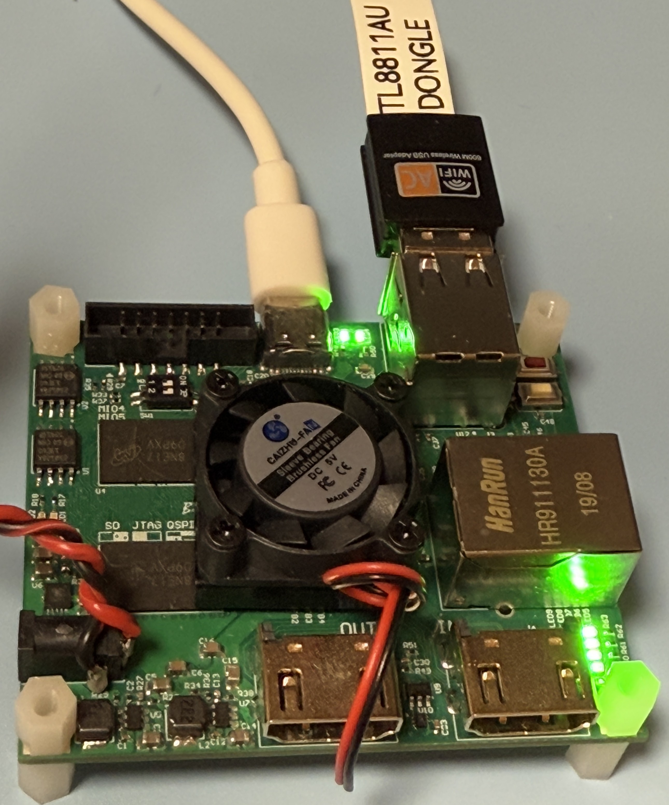

# RTL8811AU USB Dongle Testing

### Test Gear

|Test Board|USB Dongle HW|
|-|-|
|||

```
uname -r
5.4.0

lsb_release -a
No LSB modules are available.
Distributor ID: Ubuntu
Description:    Ubuntu 18.04.5 LTS
Release:        18.04
Codename:       bionic

lscpu
Architecture:        armv7l
Byte Order:          Little Endian
CPU(s):              2
On-line CPU(s) list: 0,1
Thread(s) per core:  1
Core(s) per socket:  2
Socket(s):           1
Vendor ID:           ARM
Model:               0
Model name:          Cortex-A9
Stepping:            r3p0
BogoMIPS:            666.66
Flags:               half thumb fastmult vfp edsp neon vfpv3 tls vfpd32
```

### USB Tree

```
/:  Bus 01.Port 1: Dev 1, Class=root_hub, Driver=ci_hdrc/1p, 480M
    |__ Port 1: Dev 2, If 0, Class=Hub, Driver=hub/2p, 480M
        |__ Port 1: Dev 3, If 0, Class=Vendor Specific Class, Driver=rtw_8821au, 480M
```

<details>

<summary>USB Details</summary>

```
Bus 001 Device 003: ID 0bda:0811 Realtek Semiconductor Corp.
Couldn't open device, some information will be missing
Device Descriptor:
  bLength                18
  bDescriptorType         1
  bcdUSB               2.00
  bDeviceClass            0 (Defined at Interface level)
  bDeviceSubClass         0
  bDeviceProtocol         0
  bMaxPacketSize0        64
  idVendor           0x0bda Realtek Semiconductor Corp.
  idProduct          0x0811
  bcdDevice            2.00
  iManufacturer           1
  iProduct                2
  iSerial                 3
  bNumConfigurations      1
  Configuration Descriptor:
    bLength                 9
    bDescriptorType         2
    wTotalLength           60
    bNumInterfaces          1
    bConfigurationValue     1
    iConfiguration          0
    bmAttributes         0x80
      (Bus Powered)
    MaxPower              500mA
    Interface Descriptor:
      bLength                 9
      bDescriptorType         4
      bInterfaceNumber        0
      bAlternateSetting       0
      bNumEndpoints           6
      bInterfaceClass       255 Vendor Specific Class
      bInterfaceSubClass    255 Vendor Specific Subclass
      bInterfaceProtocol    255 Vendor Specific Protocol
      iInterface              2
      Endpoint Descriptor:
        bLength                 7
        bDescriptorType         5
        bEndpointAddress     0x84  EP 4 IN
        bmAttributes            2
          Transfer Type            Bulk
          Synch Type               None
          Usage Type               Data
        wMaxPacketSize     0x0200  1x 512 bytes
        bInterval               0
      Endpoint Descriptor:
        bLength                 7
        bDescriptorType         5
        bEndpointAddress     0x05  EP 5 OUT
        bmAttributes            2
          Transfer Type            Bulk
          Synch Type               None
          Usage Type               Data
        wMaxPacketSize     0x0200  1x 512 bytes
        bInterval               0
      Endpoint Descriptor:
        bLength                 7
        bDescriptorType         5
        bEndpointAddress     0x06  EP 6 OUT
        bmAttributes            2
          Transfer Type            Bulk
          Synch Type               None
          Usage Type               Data
        wMaxPacketSize     0x0200  1x 512 bytes
        bInterval               0
      Endpoint Descriptor:
        bLength                 7
        bDescriptorType         5
        bEndpointAddress     0x87  EP 7 IN
        bmAttributes            3
          Transfer Type            Interrupt
          Synch Type               None
          Usage Type               Data
        wMaxPacketSize     0x0040  1x 64 bytes
        bInterval               3
      Endpoint Descriptor:
        bLength                 7
        bDescriptorType         5
        bEndpointAddress     0x08  EP 8 OUT
        bmAttributes            2
          Transfer Type            Bulk
          Synch Type               None
          Usage Type               Data
        wMaxPacketSize     0x0200  1x 512 bytes
        bInterval               0
      Endpoint Descriptor:
        bLength                 7
        bDescriptorType         5
        bEndpointAddress     0x09  EP 9 OUT
        bmAttributes            2
          Transfer Type            Bulk
          Synch Type               None
          Usage Type               Data
        wMaxPacketSize     0x0200  1x 512 bytes
        bInterval               0
```

</details>

### Driver Load

The driver is loaded via "insmod"

```
[  111.326470] rtw_core: loading out-of-tree module taints kernel.
[  111.739538] rtw_8821au 1-1.1:1.0: Firmware version 42.4.0, H2C version 0
[  112.933623] rtw_8821au 1-1.1:1.0: efuse MAC invalid, using random
[  112.964931] usbcore: registered new interface driver rtw_8821au

Module                  Size  Used by
rtw_8821au             16384  0
rtw_8821a              36864  1 rtw_8821au
rtw_88xxa              32768  1 rtw_8821a
rtw_usb                24576  1 rtw_8821au
rtw_core              172032  3 rtw_usb,rtw_88xxa,rtw_8821a
```

### Network Manager

```
wlan0: flags=4163<UP,BROADCAST,RUNNING,MULTICAST>  mtu 1500
        inet 192.168.1.28  netmask 255.255.252.0  broadcast 192.168.3.255
        RX packets 84876  bytes 42955532 (42.9 MB)
        RX errors 0  dropped 0  overruns 0  frame 0
        TX packets 140598  bytes 180923751 (180.9 MB)
        TX errors 0  dropped 0 overruns 0  carrier 0  collisions 0
```

### Network Speed Test via Ookla

```
   Speedtest by Ookla

Idle Latency:     3.42 ms   (jitter: 0.30ms, low: 3.37ms, high: 3.91ms)
    Download:    17.37 Mbps (data used: 32.9 MB)
                 69.01 ms   (jitter: 29.45ms, low: 4.49ms, high: 362.02ms)
      Upload:    32.29 Mbps (data used: 40.6 MB)
                280.58 ms   (jitter: 69.34ms, low: 8.73ms, high: 1090.10ms)
```
### Network Ping Tests

#### DNS-Ping

```
PING 8.8.8.8 (8.8.8.8) 56(84) bytes of data.
64 bytes from 8.8.8.8: icmp_seq=1 ttl=118 time=7.95 ms
64 bytes from 8.8.8.8: icmp_seq=2 ttl=118 time=23.6 ms
64 bytes from 8.8.8.8: icmp_seq=3 ttl=118 time=11.3 ms
64 bytes from 8.8.8.8: icmp_seq=4 ttl=118 time=14.4 ms
64 bytes from 8.8.8.8: icmp_seq=5 ttl=118 time=8.14 ms
64 bytes from 8.8.8.8: icmp_seq=6 ttl=118 time=11.3 ms
64 bytes from 8.8.8.8: icmp_seq=7 ttl=118 time=15.1 ms
64 bytes from 8.8.8.8: icmp_seq=8 ttl=118 time=13.5 ms
64 bytes from 8.8.8.8: icmp_seq=9 ttl=118 time=4.26 ms
64 bytes from 8.8.8.8: icmp_seq=10 ttl=118 time=16.6 ms
64 bytes from 8.8.8.8: icmp_seq=11 ttl=118 time=17.5 ms
64 bytes from 8.8.8.8: icmp_seq=12 ttl=118 time=5.14 ms
64 bytes from 8.8.8.8: icmp_seq=13 ttl=118 time=4.23 ms
64 bytes from 8.8.8.8: icmp_seq=14 ttl=118 time=6.63 ms
64 bytes from 8.8.8.8: icmp_seq=15 ttl=118 time=3.74 ms
64 bytes from 8.8.8.8: icmp_seq=16 ttl=118 time=3.75 ms
64 bytes from 8.8.8.8: icmp_seq=17 ttl=118 time=16.2 ms
64 bytes from 8.8.8.8: icmp_seq=18 ttl=118 time=3.77 ms
64 bytes from 8.8.8.8: icmp_seq=19 ttl=118 time=3.59 ms
64 bytes from 8.8.8.8: icmp_seq=20 ttl=118 time=3.99 ms

--- 8.8.8.8 ping statistics ---
20 packets transmitted, 20 received, 0% packet loss, time 19030ms
rtt min/avg/max/mdev = 3.597/9.760/23.694/5.877 ms
```

#### Self-Ping 

```
PING 192.168.1.28 (192.168.1.28) 10000(10028) bytes of data.
10008 bytes from 192.168.1.28: icmp_seq=1 ttl=64 time=0.145 ms
10008 bytes from 192.168.1.28: icmp_seq=2 ttl=64 time=0.128 ms
10008 bytes from 192.168.1.28: icmp_seq=3 ttl=64 time=0.115 ms
10008 bytes from 192.168.1.28: icmp_seq=4 ttl=64 time=0.108 ms
10008 bytes from 192.168.1.28: icmp_seq=5 ttl=64 time=0.111 ms
10008 bytes from 192.168.1.28: icmp_seq=6 ttl=64 time=0.137 ms
10008 bytes from 192.168.1.28: icmp_seq=7 ttl=64 time=0.120 ms
10008 bytes from 192.168.1.28: icmp_seq=8 ttl=64 time=0.110 ms
10008 bytes from 192.168.1.28: icmp_seq=9 ttl=64 time=0.111 ms
10008 bytes from 192.168.1.28: icmp_seq=10 ttl=64 time=0.124 ms
10008 bytes from 192.168.1.28: icmp_seq=11 ttl=64 time=0.116 ms
10008 bytes from 192.168.1.28: icmp_seq=12 ttl=64 time=0.132 ms
10008 bytes from 192.168.1.28: icmp_seq=13 ttl=64 time=0.118 ms
10008 bytes from 192.168.1.28: icmp_seq=14 ttl=64 time=0.119 ms
10008 bytes from 192.168.1.28: icmp_seq=15 ttl=64 time=0.115 ms
10008 bytes from 192.168.1.28: icmp_seq=16 ttl=64 time=0.117 ms
10008 bytes from 192.168.1.28: icmp_seq=17 ttl=64 time=0.119 ms
10008 bytes from 192.168.1.28: icmp_seq=18 ttl=64 time=0.135 ms
10008 bytes from 192.168.1.28: icmp_seq=19 ttl=64 time=0.120 ms
10008 bytes from 192.168.1.28: icmp_seq=20 ttl=64 time=0.111 ms

--- 192.168.1.28 ping statistics ---
20 packets transmitted, 20 received, 0% packet loss, time 19771ms
rtt min/avg/max/mdev = 0.108/0.120/0.145/0.015 ms
```

### iw list

<details>

<summary>iw list</summary>

```
Wiphy phy0
        max # scan SSIDs: 4
        max scan IEs length: 2243 bytes
        max # sched scan SSIDs: 0
        max # match sets: 0
        max # scan plans: 1
        max scan plan interval: -1
        max scan plan iterations: 0
        Retry short limit: 7
        Retry long limit: 4
        Coverage class: 0 (up to 0m)
        Device supports T-DLS.
        Supported Ciphers:
                * WEP40 (00-0f-ac:1)
                * WEP104 (00-0f-ac:5)
                * TKIP (00-0f-ac:2)
                * CCMP-128 (00-0f-ac:4)
                * CCMP-256 (00-0f-ac:10)
                * GCMP-128 (00-0f-ac:8)
                * GCMP-256 (00-0f-ac:9)
                * CMAC (00-0f-ac:6)
                * CMAC-256 (00-0f-ac:13)
                * GMAC-128 (00-0f-ac:11)
                * GMAC-256 (00-0f-ac:12)
        Available Antennas: TX 0x1 RX 0x1
        Configured Antennas: TX 0x1 RX 0x1
        Supported interface modes:
                 * IBSS
                 * managed
                 * AP
                 * AP/VLAN
                 * monitor
                 * P2P-client
                 * P2P-GO
        Band 1:
                Capabilities: 0x196e
                        HT20/HT40
                        SM Power Save disabled
                        RX HT20 SGI
                        RX HT40 SGI
                        RX STBC 1-stream
                        Max AMSDU length: 7935 bytes
                        DSSS/CCK HT40
                Maximum RX AMPDU length 65535 bytes (exponent: 0x003)
                Minimum RX AMPDU time spacing: 16 usec (0x07)
                HT Max RX data rate: 150 Mbps
                HT TX/RX MCS rate indexes supported: 0-7, 32
                Bitrates (non-HT):
                        * 1.0 Mbps
                        * 2.0 Mbps
                        * 5.5 Mbps
                        * 11.0 Mbps
                        * 6.0 Mbps
                        * 9.0 Mbps
                        * 12.0 Mbps
                        * 18.0 Mbps
                        * 24.0 Mbps
                        * 36.0 Mbps
                        * 48.0 Mbps
                        * 54.0 Mbps
                Frequencies:
                        * 2412 MHz [1] (20.0 dBm)
                        * 2417 MHz [2] (20.0 dBm)
                        * 2422 MHz [3] (20.0 dBm)
                        * 2427 MHz [4] (20.0 dBm)
                        * 2432 MHz [5] (20.0 dBm)
                        * 2437 MHz [6] (20.0 dBm)
                        * 2442 MHz [7] (20.0 dBm)
                        * 2447 MHz [8] (20.0 dBm)
                        * 2452 MHz [9] (20.0 dBm)
                        * 2457 MHz [10] (20.0 dBm)
                        * 2462 MHz [11] (20.0 dBm)
                        * 2467 MHz [12] (20.0 dBm)
                        * 2472 MHz [13] (20.0 dBm)
                        * 2484 MHz [14] (disabled)
        Band 2:
                Capabilities: 0x196e
                        HT20/HT40
                        SM Power Save disabled
                        RX HT20 SGI
                        RX HT40 SGI
                        RX STBC 1-stream
                        Max AMSDU length: 7935 bytes
                        DSSS/CCK HT40
                Maximum RX AMPDU length 65535 bytes (exponent: 0x003)
                Minimum RX AMPDU time spacing: 16 usec (0x07)
                HT Max RX data rate: 150 Mbps
                HT TX/RX MCS rate indexes supported: 0-7, 32
                VHT Capabilities (0x03d07122):
                        Max MPDU length: 11454
                        Supported Channel Width: neither 160 nor 80+80
                        short GI (80 MHz)
                        SU Beamformee
                        MU Beamformee
                        +HTC-VHT
                VHT RX MCS set:
                        1 streams: MCS 0-9
                        2 streams: not supported
                        3 streams: not supported
                        4 streams: not supported
                        5 streams: not supported
                        6 streams: not supported
                        7 streams: not supported
                        8 streams: not supported
                VHT RX highest supported: 390 Mbps
                VHT TX MCS set:
                        1 streams: MCS 0-9
                        2 streams: not supported
                        3 streams: not supported
                        4 streams: not supported
                        5 streams: not supported
                        6 streams: not supported
                        7 streams: not supported
                        8 streams: not supported
                VHT TX highest supported: 390 Mbps
                Bitrates (non-HT):
                        * 6.0 Mbps
                        * 9.0 Mbps
                        * 12.0 Mbps
                        * 18.0 Mbps
                        * 24.0 Mbps
                        * 36.0 Mbps
                        * 48.0 Mbps
                        * 54.0 Mbps
                Frequencies:
                        * 5180 MHz [36] (23.0 dBm)
                        * 5200 MHz [40] (23.0 dBm)
                        * 5220 MHz [44] (23.0 dBm)
                        * 5240 MHz [48] (23.0 dBm)
                        * 5260 MHz [52] (23.0 dBm) (radar detection)
                        * 5280 MHz [56] (23.0 dBm) (radar detection)
                        * 5300 MHz [60] (23.0 dBm) (radar detection)
                        * 5320 MHz [64] (23.0 dBm) (radar detection)
                        * 5500 MHz [100] (disabled)
                        * 5520 MHz [104] (disabled)
                        * 5540 MHz [108] (disabled)
                        * 5560 MHz [112] (disabled)
                        * 5580 MHz [116] (disabled)
                        * 5600 MHz [120] (disabled)
                        * 5620 MHz [124] (disabled)
                        * 5640 MHz [128] (disabled)
                        * 5660 MHz [132] (disabled)
                        * 5680 MHz [136] (disabled)
                        * 5700 MHz [140] (disabled)
                        * 5720 MHz [144] (disabled)
                        * 5745 MHz [149] (30.0 dBm)
                        * 5765 MHz [153] (30.0 dBm)
                        * 5785 MHz [157] (30.0 dBm)
                        * 5805 MHz [161] (30.0 dBm)
                        * 5825 MHz [165] (30.0 dBm)
        Supported commands:
                 * new_interface
                 * set_interface
                 * new_key
                 * start_ap
                 * new_station
                 * set_bss
                 * authenticate
                 * associate
                 * deauthenticate
                 * disassociate
                 * join_ibss
                 * set_tx_bitrate_mask
                 * frame
                 * frame_wait_cancel
                 * set_wiphy_netns
                 * set_channel
                 * set_wds_peer
                 * tdls_mgmt
                 * tdls_oper
                 * probe_client
                 * set_noack_map
                 * register_beacons
                 * start_p2p_device
                 * set_mcast_rate
                 * connect
                 * disconnect
                 * set_qos_map
                 * set_multicast_to_unicast
        Supported TX frame types:
                 * IBSS: 0x00 0x10 0x20 0x30 0x40 0x50 0x60 0x70 0x80 0x90 0xa0 0xb0 0xc0 0xd0 0xe0 0xf0
                 * managed: 0x00 0x10 0x20 0x30 0x40 0x50 0x60 0x70 0x80 0x90 0xa0 0xb0 0xc0 0xd0 0xe0 0xf0
                 * AP: 0x00 0x10 0x20 0x30 0x40 0x50 0x60 0x70 0x80 0x90 0xa0 0xb0 0xc0 0xd0 0xe0 0xf0
                 * AP/VLAN: 0x00 0x10 0x20 0x30 0x40 0x50 0x60 0x70 0x80 0x90 0xa0 0xb0 0xc0 0xd0 0xe0 0xf0
                 * mesh point: 0x00 0x10 0x20 0x30 0x40 0x50 0x60 0x70 0x80 0x90 0xa0 0xb0 0xc0 0xd0 0xe0 0xf0
                 * P2P-client: 0x00 0x10 0x20 0x30 0x40 0x50 0x60 0x70 0x80 0x90 0xa0 0xb0 0xc0 0xd0 0xe0 0xf0
                 * P2P-GO: 0x00 0x10 0x20 0x30 0x40 0x50 0x60 0x70 0x80 0x90 0xa0 0xb0 0xc0 0xd0 0xe0 0xf0
                 * P2P-device: 0x00 0x10 0x20 0x30 0x40 0x50 0x60 0x70 0x80 0x90 0xa0 0xb0 0xc0 0xd0 0xe0 0xf0
        Supported RX frame types:
                 * IBSS: 0x40 0xb0 0xc0 0xd0
                 * managed: 0x40 0xd0
                 * AP: 0x00 0x20 0x40 0xa0 0xb0 0xc0 0xd0
                 * AP/VLAN: 0x00 0x20 0x40 0xa0 0xb0 0xc0 0xd0
                 * mesh point: 0xb0 0xc0 0xd0
                 * P2P-client: 0x40 0xd0
                 * P2P-GO: 0x00 0x20 0x40 0xa0 0xb0 0xc0 0xd0
                 * P2P-device: 0x40 0xd0
        software interface modes (can always be added):
                 * AP/VLAN
                 * monitor
        valid interface combinations:
                 * #{ managed } <= 1, #{ AP, P2P-client, P2P-GO } <= 1,
                   total <= 2, #channels <= 1
        HT Capability overrides:
                 * MCS: ff ff ff ff ff ff ff ff ff ff
                 * maximum A-MSDU length
                 * supported channel width
                 * short GI for 40 MHz
                 * max A-MPDU length exponent
                 * min MPDU start spacing
        Device supports TX status socket option.
        Device supports HT-IBSS.
        Device supports SAE with AUTHENTICATE command
        Device supports scan flush.
        Device supports per-vif TX power setting
        Driver supports full state transitions for AP/GO clients
        Driver supports a userspace MPM
        Device supports configuring vdev MAC-addr on create.
```

</details>

### iwconfig

```
wlan0     IEEE 802.11  ESSID:""
          Mode:Managed  Frequency:5.745 GHz  Access Point: 
          Bit Rate=29.3 Mb/s   Tx-Power=20 dBm
          Retry short limit:7   RTS thr:off   Fragment thr:off
          Power Management:off
          Link Quality=32/70  Signal level=-78 dBm
          Rx invalid nwid:0  Rx invalid crypt:0  Rx invalid frag:0
          Tx excessive retries:0  Invalid misc:0   Missed beacon:0
```

### Server & Client Test via iperf3 (PC-Router-DUT)

<details>

<summary>iperf3</summary>

```
-----------------------------------------------------------
Server listening on 5201
-----------------------------------------------------------
Accepted connection from 192.168.1.3, port 53109
[  5] local 192.168.1.29 port 5201 connected to 192.168.1.3 port 53110
[ ID] Interval           Transfer     Bandwidth       Retr  Cwnd
[  5]   0.00-1.00   sec  5.91 MBytes  49.5 Mbits/sec    0    261 KBytes
[  5]   1.00-2.00   sec  3.80 MBytes  31.9 Mbits/sec    0    261 KBytes
[  5]   2.00-3.00   sec  2.39 MBytes  20.0 Mbits/sec    1    261 KBytes
[  5]   3.00-4.00   sec  2.94 MBytes  24.7 Mbits/sec    0    261 KBytes
[  5]   4.00-5.00   sec  2.88 MBytes  24.2 Mbits/sec    0    261 KBytes
[  5]   5.00-6.00   sec  5.76 MBytes  48.3 Mbits/sec   83    148 KBytes
[  5]   6.00-7.00   sec  5.70 MBytes  47.8 Mbits/sec    0    174 KBytes
[  5]   7.00-8.00   sec  6.74 MBytes  56.5 Mbits/sec    0    201 KBytes
[  5]   8.00-9.00   sec  7.11 MBytes  59.6 Mbits/sec    0    225 KBytes
[  5]   9.00-10.00  sec  6.31 MBytes  52.9 Mbits/sec    0    241 KBytes
[  5]  10.00-11.00  sec  3.61 MBytes  30.3 Mbits/sec    0    252 KBytes
[  5]  11.00-12.00  sec  3.68 MBytes  30.8 Mbits/sec    0    258 KBytes
[  5]  12.00-13.00  sec  4.53 MBytes  38.0 Mbits/sec    1    258 KBytes
[  5]  13.00-14.00  sec  4.90 MBytes  41.1 Mbits/sec    1    258 KBytes
[  5]  14.00-15.00  sec  2.94 MBytes  24.7 Mbits/sec    1    277 KBytes
[  5]  15.00-16.00  sec  2.88 MBytes  24.2 Mbits/sec    2    277 KBytes
[  5]  16.00-17.00  sec  3.12 MBytes  26.2 Mbits/sec    2    277 KBytes
[  5]  17.00-18.00  sec   816 KBytes  6.68 Mbits/sec    1    277 KBytes
[  5]  18.00-19.00  sec  3.61 MBytes  30.3 Mbits/sec    0    277 KBytes
[  5]  19.00-20.00  sec  3.31 MBytes  27.7 Mbits/sec    0    670 KBytes
[  5]  20.00-21.00  sec  4.04 MBytes  33.9 Mbits/sec    0    670 KBytes
[  5]  21.00-22.00  sec  3.37 MBytes  28.3 Mbits/sec    0    670 KBytes
[  5]  22.00-23.00  sec  3.00 MBytes  25.2 Mbits/sec    0    670 KBytes
[  5]  23.00-24.00  sec  3.19 MBytes  26.7 Mbits/sec    0    670 KBytes
[  5]  24.00-25.00  sec  2.94 MBytes  24.7 Mbits/sec    0    670 KBytes
[  5]  25.00-26.00  sec  2.88 MBytes  24.2 Mbits/sec    0    670 KBytes
[  5]  26.00-27.00  sec  3.19 MBytes  26.7 Mbits/sec    0    670 KBytes
[  5]  27.00-28.00  sec  2.88 MBytes  24.2 Mbits/sec    0    670 KBytes
[  5]  28.00-29.00  sec  3.00 MBytes  25.2 Mbits/sec    0    670 KBytes
[  5]  29.00-30.00  sec  3.19 MBytes  26.7 Mbits/sec    0    670 KBytes
[  5]  30.00-31.00  sec  2.39 MBytes  20.0 Mbits/sec    0    670 KBytes
[  5]  31.00-32.00  sec  3.49 MBytes  29.3 Mbits/sec    0    670 KBytes
[  5]  32.00-33.00  sec  4.35 MBytes  36.5 Mbits/sec    0    670 KBytes
[  5]  33.00-34.00  sec  3.74 MBytes  31.3 Mbits/sec    0    670 KBytes
[  5]  34.00-35.00  sec  3.49 MBytes  29.3 Mbits/sec    0    670 KBytes
[  5]  35.00-36.00  sec  5.27 MBytes  44.2 Mbits/sec    0    670 KBytes
[  5]  36.00-37.00  sec  3.92 MBytes  32.9 Mbits/sec    0    670 KBytes
[  5]  37.00-38.00  sec  3.74 MBytes  31.4 Mbits/sec    1    486 KBytes
[  5]  38.00-39.00  sec  5.58 MBytes  46.8 Mbits/sec    0    519 KBytes
[  5]  39.00-40.00  sec  3.19 MBytes  26.7 Mbits/sec    0    519 KBytes
[  5]  40.00-41.00  sec  4.17 MBytes  35.0 Mbits/sec    0    519 KBytes
[  5]  41.00-42.00  sec  2.39 MBytes  20.0 Mbits/sec    0    519 KBytes
[  5]  42.00-43.00  sec  3.37 MBytes  28.3 Mbits/sec    0    519 KBytes
[  5]  43.00-44.00  sec  1004 KBytes  8.22 Mbits/sec    1    519 KBytes
[  5]  44.00-45.00  sec  4.41 MBytes  37.0 Mbits/sec    0    670 KBytes
[  5]  45.00-46.00  sec  1.65 MBytes  13.9 Mbits/sec    1    670 KBytes
[  5]  46.00-47.00  sec  4.17 MBytes  35.0 Mbits/sec    0    670 KBytes
[  5]  47.00-48.00  sec  3.37 MBytes  28.3 Mbits/sec    0    670 KBytes
[  5]  48.00-49.00  sec  2.76 MBytes  23.1 Mbits/sec    0    670 KBytes
[  5]  49.00-50.00  sec  3.12 MBytes  26.2 Mbits/sec    0    670 KBytes
[  5]  50.00-51.00  sec  2.45 MBytes  20.6 Mbits/sec    0    670 KBytes
[  5]  51.00-52.00  sec  3.92 MBytes  32.9 Mbits/sec    0    670 KBytes
[  5]  52.00-53.00  sec  3.37 MBytes  28.3 Mbits/sec    0    670 KBytes
[  5]  53.00-54.00  sec  2.88 MBytes  24.2 Mbits/sec    0    670 KBytes
[  5]  54.00-55.00  sec  1.84 MBytes  15.4 Mbits/sec    0    670 KBytes
[  5]  55.00-56.00  sec  1.96 MBytes  16.4 Mbits/sec    0    670 KBytes
[  5]  56.00-57.00  sec  4.23 MBytes  35.5 Mbits/sec    0    670 KBytes
[  5]  57.00-58.00  sec  1004 KBytes  8.22 Mbits/sec    1    670 KBytes
[  5]  58.00-59.00  sec  1.35 MBytes  11.3 Mbits/sec    1    670 KBytes
[  5]  59.00-60.00  sec  1.84 MBytes  15.4 Mbits/sec    0    670 KBytes
[  5]  60.00-61.00  sec  2.57 MBytes  21.6 Mbits/sec    0    670 KBytes
[  5]  61.00-62.00  sec  2.21 MBytes  18.5 Mbits/sec    0    670 KBytes
[  5]  62.00-63.00  sec  1.96 MBytes  16.4 Mbits/sec    0    670 KBytes
[  5]  63.00-64.00  sec   753 KBytes  6.17 Mbits/sec    1    670 KBytes
[  5]  64.00-65.00  sec  0.00 Bytes  0.00 bits/sec    0    670 KBytes
[  5]  65.00-66.00  sec  0.00 Bytes  0.00 bits/sec    0    670 KBytes
[  5]  66.00-67.00  sec  0.00 Bytes  0.00 bits/sec    1   1.43 KBytes
[  5]  67.00-68.00  sec  0.00 Bytes  0.00 bits/sec    0   1.43 KBytes
[  5]  68.00-69.00  sec  0.00 Bytes  0.00 bits/sec    0   1.43 KBytes
[  5]  69.00-70.00  sec  0.00 Bytes  0.00 bits/sec    0   1.43 KBytes
[  5]  70.00-71.00  sec  0.00 Bytes  0.00 bits/sec    1   1.43 KBytes
[  5]  71.00-72.00  sec  0.00 Bytes  0.00 bits/sec    0   1.43 KBytes
[  5]  72.00-73.00  sec  1.35 MBytes  11.3 Mbits/sec    0    670 KBytes
[  5]  73.00-74.00  sec  2.82 MBytes  23.6 Mbits/sec    0    670 KBytes
[  5]  74.00-75.00  sec  4.90 MBytes  41.1 Mbits/sec    0    670 KBytes
[  5]  75.00-76.00  sec  3.37 MBytes  28.3 Mbits/sec    0    670 KBytes
[  5]  76.00-77.00  sec  5.27 MBytes  44.2 Mbits/sec    0    670 KBytes
[  5]  77.00-78.00  sec  3.74 MBytes  31.3 Mbits/sec    0    670 KBytes
[  5]  78.00-79.00  sec  2.94 MBytes  24.7 Mbits/sec    0    670 KBytes
[  5]  79.00-80.00  sec  2.21 MBytes  18.5 Mbits/sec    0    670 KBytes
[  5]  80.00-81.00  sec  2.08 MBytes  17.5 Mbits/sec  282    218 KBytes
[  5]  81.00-82.00  sec  1.65 MBytes  13.9 Mbits/sec    0    331 KBytes
[  5]  82.00-83.00  sec  1.72 MBytes  14.4 Mbits/sec    0    429 KBytes
[  5]  83.00-84.00  sec  2.02 MBytes  17.0 Mbits/sec    0    519 KBytes
[  5]  84.00-85.00  sec  2.94 MBytes  24.7 Mbits/sec    0    519 KBytes
[  5]  85.00-86.00  sec  1.84 MBytes  15.4 Mbits/sec    0    519 KBytes
[  5]  86.00-87.00  sec  1.90 MBytes  15.9 Mbits/sec    1    519 KBytes
[  5]  87.00-88.00  sec  2.76 MBytes  23.1 Mbits/sec    0    519 KBytes
[  5]  87.00-88.00  sec  2.76 MBytes  23.1 Mbits/sec    0    519 KBytes
- - - - - - - - - - - - - - - - - - - - - - - - -
[ ID] Interval           Transfer     Bandwidth       Retr
[  5]   0.00-88.00  sec   262 MBytes  24.9 Mbits/sec  383             sender
[  5]   0.00-88.00  sec  0.00 Bytes  0.00 bits/sec                  receiver
```

</details>

### AP Test

#### hostapd.conf

Setup the configuration at /etc/hostapd/hostapd.conf

```
interface=wlan0
driver=nl80211
ieee80211n=1
hw_mode=g
channel=6
ssid=AP-TEST
wpa=2
wpa_passphrase=12345678
wpa_key_mgmt=WPA-PSK
rsn_pairwise=CCMP TKIP
wpa_pairwise=TKIP CCMP
```
#### udhcpd.conf

```
start 192.168.175.2
end 192.168.175.254
interface wlan0
max_leases 234
opt router 192.168.175.1
```

#### Start AP Test
```
sudo hostapd -dd -e /dev/urandom /etc/hostapd/hostapd.conf -B
Configuration file: /etc/hostapd/hostapd.conf
Using interface wlan0 with hwaddr  and ssid "AP-TEST"
wlan0: interface state UNINITIALIZED->ENABLED
wlan0: AP-ENABLED
```

#### Server & Client Test via iperf3 (PC-DUT)

Both ping and iperf3 cannot work stably.

<details>

<summary>dmesg</summary>

```
[  111.326470] rtw_core: loading out-of-tree module taints kernel.
[  111.739538] rtw_8821au 1-1.1:1.0: Firmware version 42.4.0, H2C version 0
[  112.933623] rtw_8821au 1-1.1:1.0: efuse MAC invalid, using random
[  112.964931] usbcore: registered new interface driver rtw_8821au
[  120.697809] wlan0: authenticate with 
[  122.280230] wlan0: send auth to  (try 1/3)
[  122.282916] wlan0: authenticated
[  122.294230] wlan0: associate with  (try 1/3)
[  122.377546] wlan0: RX AssocResp from  (capab=0x1011 status=0 aid=6)
[  122.392928] wlan0: associated
[  122.449474] wlan0: Limiting TX power to 35 (35 - 0) dBm as advertised by 
[  122.566111] IPv6: ADDRCONF(NETDEV_CHANGE): wlan0: link becomes ready
[  126.087767] efuse thermal meter is 0xff
[  239.862206] wlan0: disconnect from AP  for new auth to 
[  239.890374] wlan0: authenticate with 
[  240.369551] rtw_8821au 1-1.1:1.0: failed to get tx report from firmware
[  241.507652] wlan0: send auth to  (try 1/3)
[  241.659224] wlan0: send auth to  (try 2/3)
[  241.697461] wlan0: send auth to  (try 3/3)
[  241.731186] wlan0: authentication with  timed out
[  243.421572] wlan0: authenticate with 
[  245.014473] wlan0: send auth to  (try 1/3)
[  245.020327] wlan0: authenticated
[  245.028410] wlan0: associate with  (try 1/3)
[  245.064666] wlan0: RX AssocResp from  (capab=0x1011 status=0 aid=6)
[  245.080508] wlan0: associated
[  245.419416] wlan0: Limiting TX power to 35 (35 - 0) dBm as advertised by 
[  282.913589] wlan0: disconnect from AP  for new auth to 
[  282.941581] wlan0: authenticate with 
[  283.422344] rtw_8821au 1-1.1:1.0: failed to get tx report from firmware
[  284.460316] wlan0: send auth to  (try 1/3)
[  284.602235] wlan0: send auth to  (try 2/3)
[  284.637249] wlan0: send auth to  (try 3/3)
[  284.673222] wlan0: authentication with  timed out
[  286.376248] wlan0: authenticate with 
[  287.989016] wlan0: send auth to  (try 1/3)
[  287.990725] wlan0: authenticated
[  288.001941] wlan0: associate with  (try 1/3)
[  288.061328] wlan0: RX AssocResp from  (capab=0x1011 status=0 aid=6)
[  288.077177] wlan0: associated
[  288.320701] wlan0: Limiting TX power to 35 (35 - 0) dBm as advertised by 
[  302.766568] wlan0: deauthenticating from  by local choice (Reason: 3=DEAUTH_LEAVING)
[  313.123147] netlink: 'hostapd': attribute type 213 has an invalid length.
[  443.757116] netlink: 'hostapd': attribute type 213 has an invalid length.
[  443.766012] netlink: 'hostapd': attribute type 213 has an invalid length.
[  452.404476] netlink: 'hostapd': attribute type 213 has an invalid length.
[  471.228843] netlink: 'hostapd': attribute type 213 has an invalid length.
[  471.236668] netlink: 'hostapd': attribute type 213 has an invalid length.
[  502.324965] netlink: 'hostapd': attribute type 213 has an invalid length.
[  510.758813] netlink: 'hostapd': attribute type 213 has an invalid length.
[  543.490415] netlink: 'hostapd': attribute type 213 has an invalid length.
[  543.497512] netlink: 'hostapd': attribute type 213 has an invalid length.
[  620.240058] netlink: 'hostapd': attribute type 213 has an invalid length.
[  623.049585] netlink: 'hostapd': attribute type 213 has an invalid length.
[  623.057156] netlink: 'hostapd': attribute type 213 has an invalid length.
[  623.856058] rtw_8821au 1-1.1:1.0: failed to get tx report from firmware
[  630.381755] rtw_8821au 1-1.1:1.0: error beacon valid
[  630.385608] rtw_8821au 1-1.1:1.0: failed to download drv rsvd page
```

</details>


<details>

<summary>iperf3</summary>

```
-----------------------------------------------------------
Server listening on 5201
-----------------------------------------------------------
Accepted connection from 192.168.175.86, port 60908
[  5] local 192.168.175.1 port 5201 connected to 192.168.175.86 port 60909
rtw_8821au 1-1.1:1.0: error beacon valid
rtw_8821au 1-1.1:1.0: failed to download drv rsvd page
[ ID] Interval           Transfer     Bandwidth       Retr  Cwnd
[  5]   0.00-1.00   sec  45.6 KBytes   373 Kbits/sec    2   2.85 KBytes
[  5]   1.00-2.00   sec  0.00 Bytes  0.00 bits/sec    1   1.43 KBytes
[  5]   2.00-3.00   sec  0.00 Bytes  0.00 bits/sec    0   1.43 KBytes
[  5]   3.00-4.00   sec  0.00 Bytes  0.00 bits/sec    0   1.43 KBytes
[  5]   4.00-5.00   sec  0.00 Bytes  0.00 bits/sec    0   1.43 KBytes
[  5]   5.00-6.00   sec  42.8 KBytes   351 Kbits/sec    1   4.28 KBytes
[  5]   6.00-7.00   sec  0.00 Bytes  0.00 bits/sec    1   2.85 KBytes
[  5]   7.00-8.00   sec  0.00 Bytes  0.00 bits/sec    1   2.85 KBytes
[  5]   8.00-9.00   sec  0.00 Bytes  0.00 bits/sec    0   2.85 KBytes
[  5]   9.00-10.00  sec  0.00 Bytes  0.00 bits/sec    0   2.85 KBytes
[  5]   9.00-10.00  sec  0.00 Bytes  0.00 bits/sec    0   2.85 KBytes
- - - - - - - - - - - - - - - - - - - - - - - - -
[ ID] Interval           Transfer     Bandwidth       Retr
[  5]   0.00-10.00  sec  88.4 KBytes  72.4 Kbits/sec    6             sender
[  5]   0.00-10.00  sec  0.00 Bytes  0.00 bits/sec                  receiver
```

</details>
