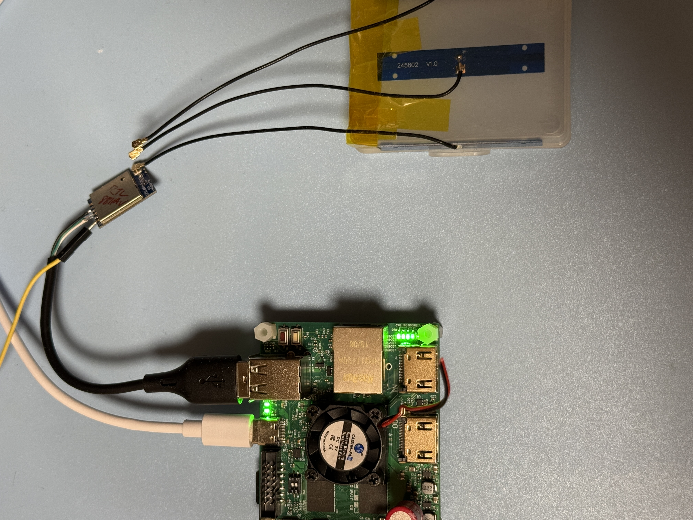

# RTL8811AU USB Dongle Testing

### Test USB Gear

|Test Board|USB Dongle HW|
|-|-|
|||

```
5.4.0-xilinx

DISTRIB_ID=Ubuntu
DISTRIB_RELEASE=18.04
DISTRIB_CODENAME=bionic
DISTRIB_DESCRIPTION="Ubuntu 18.04.5 LTS"

Architecture:        armv7l
Byte Order:          Little Endian
CPU(s):              2
On-line CPU(s) list: 0,1
Thread(s) per core:  1
Core(s) per socket:  2
Socket(s):           1
Vendor ID:           ARM
Model:               0
Model name:          Cortex-A9
Stepping:            r3p0
BogoMIPS:            666.66
Flags:               half thumb fastmult vfp edsp neon vfpv3 tls vfpd32
```

### USB Tree

```
Before driver is inserted.
/:  Bus 01.Port 1: Dev 1, Class=root_hub, Driver=ci_hdrc/1p, 480M
    |__ Port 1: Dev 2, If 0, Class=Hub, Driver=hub/2p, 480M
        |__ Port 1: Dev 3, If 0, Class=Vendor Specific Class, Driver=, 480M

After driver is inserted.
/:  Bus 01.Port 1: Dev 1, Class=root_hub, Driver=ci_hdrc/1p, 480M
    |__ Port 1: Dev 2, If 0, Class=Hub, Driver=hub/2p, 480M
        |__ Port 1: Dev 3, If 0, Class=Vendor Specific Class, Driver=rtw_8821au, 480M
```

<details>

<summary>USB Details</summary>

```
Bus 001 Device 003: ID 0bda:0811 Realtek Semiconductor Corp. 
Bus 001 Device 002: ID 0424:2512 Standard Microsystems Corp. USB 2.0 Hub
Bus 001 Device 001: ID 1d6b:0002 Linux Foundation 2.0 root hub

Bus 001 Device 003: ID 0bda:0811 Realtek Semiconductor Corp. 
Device Descriptor:
  bLength                18
  bDescriptorType         1
  bcdUSB               2.10
  bDeviceClass            0 (Defined at Interface level)
  bDeviceSubClass         0 
  bDeviceProtocol         0 
  bMaxPacketSize0        64
  idVendor           0x0bda Realtek Semiconductor Corp.
  idProduct          0x0811 
  bcdDevice            2.00
  iManufacturer           1 Realtek 
  iProduct                2 802.11ac WLAN Adapter 
  iSerial                 3 00e04c000001
  bNumConfigurations      1
  Configuration Descriptor:
    bLength                 9
    bDescriptorType         2
    wTotalLength           60
    bNumInterfaces          1
    bConfigurationValue     1
    iConfiguration          0 
    bmAttributes         0xe0
      Self Powered
      Remote Wakeup
    MaxPower              500mA
    Interface Descriptor:
      bLength                 9
      bDescriptorType         4
      bInterfaceNumber        0
      bAlternateSetting       0
      bNumEndpoints           6
      bInterfaceClass       255 Vendor Specific Class
      bInterfaceSubClass    255 Vendor Specific Subclass
      bInterfaceProtocol    255 Vendor Specific Protocol
      iInterface              2 802.11ac WLAN Adapter 
      Endpoint Descriptor:
        bLength                 7
        bDescriptorType         5
        bEndpointAddress     0x84  EP 4 IN
        bmAttributes            2
          Transfer Type            Bulk
          Synch Type               None
          Usage Type               Data
        wMaxPacketSize     0x0200  1x 512 bytes
        bInterval               0
      Endpoint Descriptor:
        bLength                 7
        bDescriptorType         5
        bEndpointAddress     0x05  EP 5 OUT
        bmAttributes            2
          Transfer Type            Bulk
          Synch Type               None
          Usage Type               Data
        wMaxPacketSize     0x0200  1x 512 bytes
        bInterval               0
      Endpoint Descriptor:
        bLength                 7
        bDescriptorType         5
        bEndpointAddress     0x06  EP 6 OUT
        bmAttributes            2
          Transfer Type            Bulk
          Synch Type               None
          Usage Type               Data
        wMaxPacketSize     0x0200  1x 512 bytes
        bInterval               0
      Endpoint Descriptor:
        bLength                 7
        bDescriptorType         5
        bEndpointAddress     0x87  EP 7 IN
        bmAttributes            3
          Transfer Type            Interrupt
          Synch Type               None
          Usage Type               Data
        wMaxPacketSize     0x0040  1x 64 bytes
        bInterval               3
      Endpoint Descriptor:
        bLength                 7
        bDescriptorType         5
        bEndpointAddress     0x08  EP 8 OUT
        bmAttributes            2
          Transfer Type            Bulk
          Synch Type               None
          Usage Type               Data
        wMaxPacketSize     0x0200  1x 512 bytes
        bInterval               0
      Endpoint Descriptor:
        bLength                 7
        bDescriptorType         5
        bEndpointAddress     0x09  EP 9 OUT
        bmAttributes            2
          Transfer Type            Bulk
          Synch Type               None
          Usage Type               Data
        wMaxPacketSize     0x0200  1x 512 bytes
        bInterval               0
Binary Object Store Descriptor:
  bLength                 5
  bDescriptorType        15
  wTotalLength           12
  bNumDeviceCaps          1
  USB 2.0 Extension Device Capability:
    bLength                 7
    bDescriptorType        16
    bDevCapabilityType      2
    bmAttributes   0x00000002
      Link Power Management (LPM) Supported
Device Status:     0x0001
  Self Powered
```

</details>

### Driver Load

The driver is loaded via "insmod"

```
Module                  Size  Used by
rtw_8821au             16384  0
rtw_8821a              36864  1 rtw_8821au
rtw_88xxa              32768  1 rtw_8821a
rtw_usb                24576  1 rtw_8821au
rtw_core              172032  3 rtw_usb,rtw_88xxa,rtw_8821a
```

### iw list

<details>

<summary>iw list</summary>

```
Wiphy phy0
	max # scan SSIDs: 4
	max scan IEs length: 2243 bytes
	max # sched scan SSIDs: 0
	max # match sets: 0
	max # scan plans: 1
	max scan plan interval: -1
	max scan plan iterations: 0
	Retry short limit: 7
	Retry long limit: 4
	Coverage class: 0 (up to 0m)
	Device supports T-DLS.
	Supported Ciphers:
		* WEP40 (00-0f-ac:1)
		* WEP104 (00-0f-ac:5)
		* TKIP (00-0f-ac:2)
		* CCMP-128 (00-0f-ac:4)
		* CCMP-256 (00-0f-ac:10)
		* GCMP-128 (00-0f-ac:8)
		* GCMP-256 (00-0f-ac:9)
		* CMAC (00-0f-ac:6)
		* CMAC-256 (00-0f-ac:13)
		* GMAC-128 (00-0f-ac:11)
		* GMAC-256 (00-0f-ac:12)
	Available Antennas: TX 0x1 RX 0x1
	Configured Antennas: TX 0x1 RX 0x1
	Supported interface modes:
		 * IBSS
		 * managed
		 * AP
		 * AP/VLAN
		 * monitor
		 * P2P-client
		 * P2P-GO
	Band 1:
		Capabilities: 0x196e
			HT20/HT40
			SM Power Save disabled
			RX HT20 SGI
			RX HT40 SGI
			RX STBC 1-stream
			Max AMSDU length: 7935 bytes
			DSSS/CCK HT40
		Maximum RX AMPDU length 65535 bytes (exponent: 0x003)
		Minimum RX AMPDU time spacing: 16 usec (0x07)
		HT Max RX data rate: 150 Mbps
		HT TX/RX MCS rate indexes supported: 0-7, 32
		Bitrates (non-HT):
			* 1.0 Mbps
			* 2.0 Mbps
			* 5.5 Mbps
			* 11.0 Mbps
			* 6.0 Mbps
			* 9.0 Mbps
			* 12.0 Mbps
			* 18.0 Mbps
			* 24.0 Mbps
			* 36.0 Mbps
			* 48.0 Mbps
			* 54.0 Mbps
		Frequencies:
			* 2412 MHz [1] (20.0 dBm)
			* 2417 MHz [2] (20.0 dBm)
			* 2422 MHz [3] (20.0 dBm)
			* 2427 MHz [4] (20.0 dBm)
			* 2432 MHz [5] (20.0 dBm)
			* 2437 MHz [6] (20.0 dBm)
			* 2442 MHz [7] (20.0 dBm)
			* 2447 MHz [8] (20.0 dBm)
			* 2452 MHz [9] (20.0 dBm)
			* 2457 MHz [10] (20.0 dBm)
			* 2462 MHz [11] (20.0 dBm)
			* 2467 MHz [12] (20.0 dBm) (no IR)
			* 2472 MHz [13] (20.0 dBm) (no IR)
			* 2484 MHz [14] (20.0 dBm) (no IR)
	Band 2:
		Capabilities: 0x196e
			HT20/HT40
			SM Power Save disabled
			RX HT20 SGI
			RX HT40 SGI
			RX STBC 1-stream
			Max AMSDU length: 7935 bytes
			DSSS/CCK HT40
		Maximum RX AMPDU length 65535 bytes (exponent: 0x003)
		Minimum RX AMPDU time spacing: 16 usec (0x07)
		HT Max RX data rate: 150 Mbps
		HT TX/RX MCS rate indexes supported: 0-7, 32
		VHT Capabilities (0x03d07122):
			Max MPDU length: 11454
			Supported Channel Width: neither 160 nor 80+80
			short GI (80 MHz)
			SU Beamformee
			MU Beamformee
			+HTC-VHT
		VHT RX MCS set:
			1 streams: MCS 0-9
			2 streams: not supported
			3 streams: not supported
			4 streams: not supported
			5 streams: not supported
			6 streams: not supported
			7 streams: not supported
			8 streams: not supported
		VHT RX highest supported: 390 Mbps
		VHT TX MCS set:
			1 streams: MCS 0-9
			2 streams: not supported
			3 streams: not supported
			4 streams: not supported
			5 streams: not supported
			6 streams: not supported
			7 streams: not supported
			8 streams: not supported
		VHT TX highest supported: 390 Mbps
		Bitrates (non-HT):
			* 6.0 Mbps
			* 9.0 Mbps
			* 12.0 Mbps
			* 18.0 Mbps
			* 24.0 Mbps
			* 36.0 Mbps
			* 48.0 Mbps
			* 54.0 Mbps
		Frequencies:
			* 5180 MHz [36] (20.0 dBm) (no IR)
			* 5200 MHz [40] (20.0 dBm) (no IR)
			* 5220 MHz [44] (20.0 dBm) (no IR)
			* 5240 MHz [48] (20.0 dBm) (no IR)
			* 5260 MHz [52] (20.0 dBm) (no IR, radar detection)
			* 5280 MHz [56] (20.0 dBm) (no IR, radar detection)
			* 5300 MHz [60] (20.0 dBm) (no IR, radar detection)
			* 5320 MHz [64] (20.0 dBm) (no IR, radar detection)
			* 5500 MHz [100] (20.0 dBm) (no IR, radar detection)
			* 5520 MHz [104] (20.0 dBm) (no IR, radar detection)
			* 5540 MHz [108] (20.0 dBm) (no IR, radar detection)
			* 5560 MHz [112] (20.0 dBm) (no IR, radar detection)
			* 5580 MHz [116] (20.0 dBm) (no IR, radar detection)
			* 5600 MHz [120] (20.0 dBm) (no IR, radar detection)
			* 5620 MHz [124] (20.0 dBm) (no IR, radar detection)
			* 5640 MHz [128] (20.0 dBm) (no IR, radar detection)
			* 5660 MHz [132] (20.0 dBm) (no IR, radar detection)
			* 5680 MHz [136] (20.0 dBm) (no IR, radar detection)
			* 5700 MHz [140] (20.0 dBm) (no IR, radar detection)
			* 5720 MHz [144] (20.0 dBm) (no IR, radar detection)
			* 5745 MHz [149] (20.0 dBm) (no IR)
			* 5765 MHz [153] (20.0 dBm) (no IR)
			* 5785 MHz [157] (20.0 dBm) (no IR)
			* 5805 MHz [161] (20.0 dBm) (no IR)
			* 5825 MHz [165] (20.0 dBm) (no IR)
	Supported commands:
		 * new_interface
		 * set_interface
		 * new_key
		 * start_ap
		 * new_station
		 * set_bss
		 * authenticate
		 * associate
		 * deauthenticate
		 * disassociate
		 * join_ibss
		 * set_tx_bitrate_mask
		 * frame
		 * frame_wait_cancel
		 * set_wiphy_netns
		 * set_channel
		 * set_wds_peer
		 * tdls_mgmt
		 * tdls_oper
		 * probe_client
		 * set_noack_map
		 * register_beacons
		 * start_p2p_device
		 * set_mcast_rate
		 * connect
		 * disconnect
		 * set_qos_map
		 * set_multicast_to_unicast
	Supported TX frame types:
		 * IBSS: 0x00 0x10 0x20 0x30 0x40 0x50 0x60 0x70 0x80 0x90 0xa0 0xb0 0xc0 0xd0 0xe0 0xf0
		 * managed: 0x00 0x10 0x20 0x30 0x40 0x50 0x60 0x70 0x80 0x90 0xa0 0xb0 0xc0 0xd0 0xe0 0xf0
		 * AP: 0x00 0x10 0x20 0x30 0x40 0x50 0x60 0x70 0x80 0x90 0xa0 0xb0 0xc0 0xd0 0xe0 0xf0
		 * AP/VLAN: 0x00 0x10 0x20 0x30 0x40 0x50 0x60 0x70 0x80 0x90 0xa0 0xb0 0xc0 0xd0 0xe0 0xf0
		 * mesh point: 0x00 0x10 0x20 0x30 0x40 0x50 0x60 0x70 0x80 0x90 0xa0 0xb0 0xc0 0xd0 0xe0 0xf0
		 * P2P-client: 0x00 0x10 0x20 0x30 0x40 0x50 0x60 0x70 0x80 0x90 0xa0 0xb0 0xc0 0xd0 0xe0 0xf0
		 * P2P-GO: 0x00 0x10 0x20 0x30 0x40 0x50 0x60 0x70 0x80 0x90 0xa0 0xb0 0xc0 0xd0 0xe0 0xf0
		 * P2P-device: 0x00 0x10 0x20 0x30 0x40 0x50 0x60 0x70 0x80 0x90 0xa0 0xb0 0xc0 0xd0 0xe0 0xf0
	Supported RX frame types:
		 * IBSS: 0x40 0xb0 0xc0 0xd0
		 * managed: 0x40 0xd0
		 * AP: 0x00 0x20 0x40 0xa0 0xb0 0xc0 0xd0
		 * AP/VLAN: 0x00 0x20 0x40 0xa0 0xb0 0xc0 0xd0
		 * mesh point: 0xb0 0xc0 0xd0
		 * P2P-client: 0x40 0xd0
		 * P2P-GO: 0x00 0x20 0x40 0xa0 0xb0 0xc0 0xd0
		 * P2P-device: 0x40 0xd0
	software interface modes (can always be added):
		 * AP/VLAN
		 * monitor
	valid interface combinations:
		 * #{ managed } <= 1, #{ AP, P2P-client, P2P-GO } <= 1,
		   total <= 2, #channels <= 1
	HT Capability overrides:
		 * MCS: ff ff ff ff ff ff ff ff ff ff
		 * maximum A-MSDU length
		 * supported channel width
		 * short GI for 40 MHz
		 * max A-MPDU length exponent
		 * min MPDU start spacing
	Device supports TX status socket option.
	Device supports HT-IBSS.
	Device supports SAE with AUTHENTICATE command
	Device supports scan flush.
	Device supports per-vif TX power setting
	Driver supports full state transitions for AP/GO clients
	Driver supports a userspace MPM
	Device supports configuring vdev MAC-addr on create.
```

</details>

### Network Manager - Band 2.4

```
wlan0: flags=4163<UP,BROADCAST,RUNNING,MULTICAST>  mtu 1500
        inet 192.168.1.38  netmask 255.255.252.0  broadcast 192.168.3.255
        RX packets 22  bytes 2961 (2.9 KB)
        RX errors 0  dropped 0  overruns 0  frame 0
        TX packets 32  bytes 5349 (5.3 KB)
        TX errors 0  dropped 0 overruns 0  carrier 0  collisions 0
```

### iwconfig 2.4

```
wlan0     IEEE 802.11  ESSID:""  
          Mode:Managed  Frequency:2.412 GHz  Access Point: 
          Bit Rate=121.5 Mb/s   Tx-Power=20 dBm   
          Retry short limit:7   RTS thr:off   Fragment thr:off
          Encryption key:off
          Power Management:off
          Link Quality=60/70  Signal level=-50 dBm  
          Rx invalid nwid:0  Rx invalid crypt:0  Rx invalid frag:0
          Tx excessive retries:0  Invalid misc:0   Missed beacon:0

```

### Network Speed Test via Ookla - Band 2.4

```
Retrieving speedtest.net configuration...
Retrieving speedtest.net server list...
Selecting best server based on ping...
Testing download speed................................................................................
Download: 8.70 Mbit/s
Testing upload speed......................................................................................................
Upload: 3.37 Mbit/s
```

### Network Ping Tests - Band 2.4

#### DNS-Ping

```
PING 8.8.8.8 (8.8.8.8) 56(84) bytes of data.
64 bytes from 8.8.8.8: icmp_seq=1 ttl=59 time=5.89 ms
64 bytes from 8.8.8.8: icmp_seq=2 ttl=59 time=6.99 ms
64 bytes from 8.8.8.8: icmp_seq=3 ttl=59 time=22.1 ms
64 bytes from 8.8.8.8: icmp_seq=4 ttl=59 time=10.0 ms
64 bytes from 8.8.8.8: icmp_seq=5 ttl=59 time=21.3 ms
64 bytes from 8.8.8.8: icmp_seq=6 ttl=59 time=8.40 ms
64 bytes from 8.8.8.8: icmp_seq=7 ttl=59 time=5.16 ms
64 bytes from 8.8.8.8: icmp_seq=8 ttl=59 time=7.33 ms
64 bytes from 8.8.8.8: icmp_seq=9 ttl=59 time=9.58 ms
64 bytes from 8.8.8.8: icmp_seq=10 ttl=59 time=10.1 ms
64 bytes from 8.8.8.8: icmp_seq=11 ttl=59 time=5.30 ms
64 bytes from 8.8.8.8: icmp_seq=12 ttl=59 time=7.39 ms
64 bytes from 8.8.8.8: icmp_seq=13 ttl=59 time=15.4 ms
64 bytes from 8.8.8.8: icmp_seq=14 ttl=59 time=5.99 ms
64 bytes from 8.8.8.8: icmp_seq=15 ttl=59 time=4.61 ms
64 bytes from 8.8.8.8: icmp_seq=16 ttl=59 time=4.45 ms
64 bytes from 8.8.8.8: icmp_seq=17 ttl=59 time=4.59 ms
64 bytes from 8.8.8.8: icmp_seq=18 ttl=59 time=8.05 ms
64 bytes from 8.8.8.8: icmp_seq=19 ttl=59 time=4.82 ms
64 bytes from 8.8.8.8: icmp_seq=20 ttl=59 time=5.01 ms

--- 8.8.8.8 ping statistics ---
20 packets transmitted, 20 received, 0% packet loss, time 19036ms
rtt min/avg/max/mdev = 4.457/8.640/22.168/5.093 ms
```

#### Self-Ping 

```
PING 192.168.1.38 (192.168.1.38) 10000(10028) bytes of data.
10008 bytes from 192.168.1.38: icmp_seq=1 ttl=64 time=0.147 ms
10008 bytes from 192.168.1.38: icmp_seq=2 ttl=64 time=0.121 ms
10008 bytes from 192.168.1.38: icmp_seq=3 ttl=64 time=0.113 ms
10008 bytes from 192.168.1.38: icmp_seq=4 ttl=64 time=0.115 ms
10008 bytes from 192.168.1.38: icmp_seq=5 ttl=64 time=0.113 ms
10008 bytes from 192.168.1.38: icmp_seq=6 ttl=64 time=0.122 ms
10008 bytes from 192.168.1.38: icmp_seq=7 ttl=64 time=0.139 ms
10008 bytes from 192.168.1.38: icmp_seq=8 ttl=64 time=0.113 ms
10008 bytes from 192.168.1.38: icmp_seq=9 ttl=64 time=0.111 ms
10008 bytes from 192.168.1.38: icmp_seq=10 ttl=64 time=0.115 ms
10008 bytes from 192.168.1.38: icmp_seq=11 ttl=64 time=0.119 ms
10008 bytes from 192.168.1.38: icmp_seq=12 ttl=64 time=0.121 ms
10008 bytes from 192.168.1.38: icmp_seq=13 ttl=64 time=0.115 ms
10008 bytes from 192.168.1.38: icmp_seq=14 ttl=64 time=0.106 ms
10008 bytes from 192.168.1.38: icmp_seq=15 ttl=64 time=0.113 ms
10008 bytes from 192.168.1.38: icmp_seq=16 ttl=64 time=0.122 ms
10008 bytes from 192.168.1.38: icmp_seq=17 ttl=64 time=0.111 ms
10008 bytes from 192.168.1.38: icmp_seq=18 ttl=64 time=0.124 ms
10008 bytes from 192.168.1.38: icmp_seq=19 ttl=64 time=0.118 ms
10008 bytes from 192.168.1.38: icmp_seq=20 ttl=64 time=0.112 ms

--- 192.168.1.38 ping statistics ---
20 packets transmitted, 20 received, 0% packet loss, time 19751ms
rtt min/avg/max/mdev = 0.106/0.118/0.147/0.014 ms
```

### Server & Client Test via iperf3 (PC-Router-DUT)

<details>

<summary>iperf3</summary>

```
-----------------------------------------------------------
Server listening on 5201
-----------------------------------------------------------
Accepted connection from 192.168.1.3, port 60782
[  5] local 192.168.1.38 port 5201 connected to 192.168.1.3 port 60783
[ ID] Interval           Transfer     Bandwidth       Retr  Cwnd
[  5]   0.00-1.00   sec  4.01 MBytes  33.6 Mbits/sec    0   82.7 KBytes       
[  5]   1.00-2.00   sec  3.03 MBytes  25.4 Mbits/sec    0   82.7 KBytes       
[  5]   2.00-3.00   sec  2.63 MBytes  22.1 Mbits/sec    0   82.7 KBytes       
[  5]   3.00-4.00   sec  2.05 MBytes  17.2 Mbits/sec    0   82.7 KBytes       
[  5]   4.00-5.00   sec  2.45 MBytes  20.5 Mbits/sec    0   98.4 KBytes       
[  5]   5.00-6.00   sec  2.63 MBytes  22.1 Mbits/sec    0    135 KBytes       
[  5]   6.00-7.00   sec  1.84 MBytes  15.4 Mbits/sec    0    135 KBytes       
[  5]   7.00-8.00   sec  2.14 MBytes  18.0 Mbits/sec    0    135 KBytes       
[  5]   8.00-9.00   sec  2.27 MBytes  19.0 Mbits/sec    0    135 KBytes       
[  5]   9.00-10.00  sec   753 KBytes  6.16 Mbits/sec    1   1.43 KBytes       
[  5]  10.00-11.00  sec  0.00 Bytes  0.00 bits/sec    5   32.8 KBytes       
[  5]  11.00-12.00  sec   376 KBytes  3.09 Mbits/sec    1   27.1 KBytes       
[  5]  12.00-13.00  sec  0.00 Bytes  0.00 bits/sec    0   29.9 KBytes       
[  5]  13.00-14.00  sec   376 KBytes  3.09 Mbits/sec    0   34.2 KBytes       
[  5]  14.00-15.00  sec  2.45 MBytes  20.6 Mbits/sec    0   72.7 KBytes       
[  5]  15.00-16.00  sec  4.35 MBytes  36.5 Mbits/sec    0    107 KBytes       
[  5]  16.00-17.00  sec  4.23 MBytes  35.5 Mbits/sec    0    135 KBytes       
[  5]  17.00-18.00  sec  5.64 MBytes  47.3 Mbits/sec    0    163 KBytes       
[  5]  18.00-19.00  sec  3.80 MBytes  31.9 Mbits/sec    0    180 KBytes       
[  5]  19.00-20.00  sec  2.08 MBytes  17.5 Mbits/sec    0    185 KBytes       
[  5]  20.00-21.00  sec  2.70 MBytes  22.6 Mbits/sec    0    217 KBytes       
[  5]  21.00-22.00  sec  3.74 MBytes  31.3 Mbits/sec    0    272 KBytes       
[  5]  22.00-23.00  sec  3.19 MBytes  26.7 Mbits/sec    0    272 KBytes       
[  5]  23.00-24.00  sec  4.17 MBytes  34.9 Mbits/sec    0    272 KBytes       
[  5]  24.00-25.00  sec  3.12 MBytes  26.2 Mbits/sec    0    272 KBytes       
[  5]  25.00-26.00  sec  4.90 MBytes  41.1 Mbits/sec    0    272 KBytes       
[  5]  26.00-27.00  sec  3.55 MBytes  29.8 Mbits/sec    0    272 KBytes       
[  5]  27.00-28.00  sec  6.07 MBytes  50.9 Mbits/sec    0    272 KBytes       
[  5]  28.00-29.00  sec  4.84 MBytes  40.6 Mbits/sec   33    210 KBytes       
[  5]  29.00-30.00  sec  5.70 MBytes  47.8 Mbits/sec    0    244 KBytes       
[  5]  30.00-30.05  sec   314 KBytes  54.5 Mbits/sec    0    244 KBytes       
- - - - - - - - - - - - - - - - - - - - - - - - -
[ ID] Interval           Transfer     Bandwidth       Retr
[  5]   0.00-30.05  sec  89.3 MBytes  24.9 Mbits/sec   40             sender
[  5]   0.00-30.05  sec  0.00 Bytes  0.00 bits/sec                  receiver
-----------------------------------------------------------
Server listening on 5201
-----------------------------------------------------------
iperf3: interrupt - the server has terminated
[   36.433314] rtw_core: loading out-of-tree module taints kernel.
[   36.831788] rtw_8821au 1-1.1:1.0: Firmware version 42.4.0, H2C version 0
[   38.061945] usbcore: registered new interface driver rtw_8821au
```

</details>

### Network Manager - Band 5G

```
wlan0: flags=4163<UP,BROADCAST,RUNNING,MULTICAST>  mtu 1500
        inet 192.168.1.38  netmask 255.255.252.0  broadcast 192.168.3.255
        RX packets 29168  bytes 15085982 (15.0 MB)
        RX errors 0  dropped 0  overruns 0  frame 0
        TX packets 74997  bytes 104864435 (104.8 MB)
        TX errors 0  dropped 0 overruns 0  carrier 0  collisions 0
```

### iwconfig 5G

```
wlan0     IEEE 802.11  ESSID:""  
          Mode:Managed  Frequency:5.805 GHz  Access Point: 
          Bit Rate=292.5 Mb/s   Tx-Power=20 dBm   
          Retry short limit:7   RTS thr:off   Fragment thr:off
          Encryption key:off
          Power Management:off
          Link Quality=54/70  Signal level=-56 dBm  
          Rx invalid nwid:0  Rx invalid crypt:0  Rx invalid frag:0
          Tx excessive retries:0  Invalid misc:0   Missed beacon:0

```

### Network Speed Test via Ookla - Band 5G

```
Retrieving speedtest.net configuration...
Retrieving speedtest.net server list...
Selecting best server based on ping...
Testing download speed................................................................................
Download: 114.68 Mbit/s
Testing upload speed......................................................................................................
Upload: 3.90 Mbit/s
```

### Network Ping Tests - Band 5G

#### DNS-Ping

```
PING 8.8.8.8 (8.8.8.8) 56(84) bytes of data.
64 bytes from 8.8.8.8: icmp_seq=1 ttl=59 time=4.13 ms
64 bytes from 8.8.8.8: icmp_seq=2 ttl=59 time=3.94 ms
64 bytes from 8.8.8.8: icmp_seq=3 ttl=59 time=4.14 ms
64 bytes from 8.8.8.8: icmp_seq=4 ttl=59 time=4.09 ms
64 bytes from 8.8.8.8: icmp_seq=5 ttl=59 time=6.66 ms
64 bytes from 8.8.8.8: icmp_seq=6 ttl=59 time=6.81 ms
64 bytes from 8.8.8.8: icmp_seq=7 ttl=59 time=9.12 ms
64 bytes from 8.8.8.8: icmp_seq=8 ttl=59 time=4.69 ms
64 bytes from 8.8.8.8: icmp_seq=9 ttl=59 time=4.01 ms
64 bytes from 8.8.8.8: icmp_seq=10 ttl=59 time=4.54 ms
64 bytes from 8.8.8.8: icmp_seq=11 ttl=59 time=5.43 ms
64 bytes from 8.8.8.8: icmp_seq=12 ttl=59 time=4.08 ms
64 bytes from 8.8.8.8: icmp_seq=13 ttl=59 time=13.8 ms
64 bytes from 8.8.8.8: icmp_seq=14 ttl=59 time=4.36 ms
64 bytes from 8.8.8.8: icmp_seq=15 ttl=59 time=4.63 ms
64 bytes from 8.8.8.8: icmp_seq=16 ttl=59 time=4.17 ms
64 bytes from 8.8.8.8: icmp_seq=17 ttl=59 time=11.3 ms
64 bytes from 8.8.8.8: icmp_seq=18 ttl=59 time=4.33 ms
64 bytes from 8.8.8.8: icmp_seq=19 ttl=59 time=8.96 ms
64 bytes from 8.8.8.8: icmp_seq=20 ttl=59 time=4.21 ms

--- 8.8.8.8 ping statistics ---
20 packets transmitted, 20 received, 0% packet loss, time 19028ms
rtt min/avg/max/mdev = 3.941/5.877/13.862/2.738 ms
```

#### Self-Ping 

```
PING 192.168.1.38 (192.168.1.38) 10000(10028) bytes of data.
10008 bytes from 192.168.1.38: icmp_seq=1 ttl=64 time=0.149 ms
10008 bytes from 192.168.1.38: icmp_seq=2 ttl=64 time=0.124 ms
10008 bytes from 192.168.1.38: icmp_seq=3 ttl=64 time=0.126 ms
10008 bytes from 192.168.1.38: icmp_seq=4 ttl=64 time=0.119 ms
10008 bytes from 192.168.1.38: icmp_seq=5 ttl=64 time=0.121 ms
10008 bytes from 192.168.1.38: icmp_seq=6 ttl=64 time=0.126 ms
10008 bytes from 192.168.1.38: icmp_seq=7 ttl=64 time=0.146 ms
10008 bytes from 192.168.1.38: icmp_seq=8 ttl=64 time=0.116 ms
10008 bytes from 192.168.1.38: icmp_seq=9 ttl=64 time=0.111 ms
10008 bytes from 192.168.1.38: icmp_seq=10 ttl=64 time=0.104 ms
10008 bytes from 192.168.1.38: icmp_seq=11 ttl=64 time=0.115 ms
10008 bytes from 192.168.1.38: icmp_seq=12 ttl=64 time=0.120 ms
10008 bytes from 192.168.1.38: icmp_seq=13 ttl=64 time=0.127 ms
10008 bytes from 192.168.1.38: icmp_seq=14 ttl=64 time=0.117 ms
10008 bytes from 192.168.1.38: icmp_seq=15 ttl=64 time=0.121 ms
10008 bytes from 192.168.1.38: icmp_seq=16 ttl=64 time=0.113 ms
10008 bytes from 192.168.1.38: icmp_seq=17 ttl=64 time=0.121 ms
10008 bytes from 192.168.1.38: icmp_seq=18 ttl=64 time=0.128 ms
10008 bytes from 192.168.1.38: icmp_seq=19 ttl=64 time=0.113 ms
10008 bytes from 192.168.1.38: icmp_seq=20 ttl=64 time=0.109 ms

--- 192.168.1.38 ping statistics ---
20 packets transmitted, 20 received, 0% packet loss, time 19756ms
rtt min/avg/max/mdev = 0.104/0.121/0.149/0.013 ms
```

### Server & Client Test via iperf3 (PC-Router-DUT)

<details>

<summary>iperf3</summary>

```
-----------------------------------------------------------
Server listening on 5201
-----------------------------------------------------------
Accepted connection from 192.168.1.3, port 53238
[  5] local 192.168.1.38 port 5201 connected to 192.168.1.3 port 53239
[ ID] Interval           Transfer     Bandwidth       Retr  Cwnd
[  5]   0.00-1.00   sec  9.96 MBytes  83.5 Mbits/sec    0    523 KBytes       
[  5]   1.00-2.00   sec  6.98 MBytes  58.6 Mbits/sec    0    523 KBytes       
[  5]   2.00-3.00   sec  10.4 MBytes  87.3 Mbits/sec  197    419 KBytes       
[  5]   3.00-4.00   sec  13.5 MBytes   113 Mbits/sec    0    462 KBytes       
[  5]   4.00-5.00   sec  13.4 MBytes   112 Mbits/sec    0    496 KBytes       
[  5]   5.00-6.00   sec  11.0 MBytes  92.0 Mbits/sec    0    512 KBytes       
[  5]   6.00-7.00   sec  11.2 MBytes  94.0 Mbits/sec    0    522 KBytes       
[  5]   7.00-8.00   sec  12.2 MBytes   102 Mbits/sec    0    523 KBytes       
[  5]   8.00-9.00   sec  11.6 MBytes  97.6 Mbits/sec    0    523 KBytes       
[  5]   9.00-10.00  sec  9.80 MBytes  82.2 Mbits/sec    0    523 KBytes       
[  5]  10.00-11.00  sec  11.3 MBytes  94.6 Mbits/sec    0    530 KBytes       
[  5]  11.00-12.00  sec  8.64 MBytes  72.5 Mbits/sec    0    545 KBytes       
[  5]  12.00-13.00  sec  13.4 MBytes   113 Mbits/sec    0    567 KBytes       
[  5]  13.00-14.00  sec  10.5 MBytes  87.9 Mbits/sec    0    607 KBytes       
[  5]  14.00-15.00  sec  9.99 MBytes  83.8 Mbits/sec    0    649 KBytes       
[  5]  15.00-16.00  sec  11.7 MBytes  98.2 Mbits/sec    0    741 KBytes       
[  5]  16.00-17.00  sec  9.83 MBytes  82.4 Mbits/sec    0    854 KBytes       
[  5]  17.00-18.00  sec  13.0 MBytes   109 Mbits/sec    0    931 KBytes       
[  5]  18.00-19.00  sec  11.1 MBytes  93.0 Mbits/sec    0   1.03 MBytes       
[  5]  19.00-20.00  sec  11.6 MBytes  97.6 Mbits/sec    0   1.03 MBytes       
[  5]  20.00-21.00  sec  12.7 MBytes   107 Mbits/sec    0   1.03 MBytes       
[  5]  21.00-22.00  sec  12.8 MBytes   107 Mbits/sec    0   1.03 MBytes       
[  5]  22.00-23.00  sec  13.9 MBytes   117 Mbits/sec    0   1.03 MBytes       
[  5]  23.00-24.00  sec  8.33 MBytes  69.9 Mbits/sec    0   1.03 MBytes       
[  5]  24.00-25.00  sec  11.8 MBytes  98.7 Mbits/sec    0   1.03 MBytes       
[  5]  25.00-26.00  sec  12.7 MBytes   107 Mbits/sec    0   1.03 MBytes       
[  5]  26.00-27.00  sec  13.9 MBytes   117 Mbits/sec    0   1.03 MBytes       
[  5]  27.00-28.00  sec  11.5 MBytes  96.6 Mbits/sec    0   1.03 MBytes       
[  5]  28.00-29.00  sec  10.3 MBytes  86.4 Mbits/sec    0   1.03 MBytes       
[  5]  29.00-30.00  sec  9.31 MBytes  78.1 Mbits/sec    0   1.03 MBytes       
[  5]  30.00-30.13  sec  0.00 Bytes  0.00 bits/sec    0   1.03 MBytes       
- - - - - - - - - - - - - - - - - - - - - - - - -
[ ID] Interval           Transfer     Bandwidth       Retr
[  5]   0.00-30.13  sec   338 MBytes  94.2 Mbits/sec  197             sender
[  5]   0.00-30.13  sec  0.00 Bytes  0.00 bits/sec                  receiver
-----------------------------------------------------------
Server listening on 5201
-----------------------------------------------------------
iperf3: interrupt - the server has terminated
[   36.433314] rtw_core: loading out-of-tree module taints kernel.
[   36.831788] rtw_8821au 1-1.1:1.0: Firmware version 42.4.0, H2C version 0
[   38.061945] usbcore: registered new interface driver rtw_8821au
```

</details>

### AP Test

#### hostapd.conf

Setup the configuration at /etc/hostapd/hostapd.conf

```
interface=wlan0
driver=nl80211
ieee80211n=1
hw_mode=g
channel=6
ssid=AP-TEST
wpa=2
wpa_passphrase=12345678
wpa_key_mgmt=WPA-PSK
rsn_pairwise=CCMP TKIP
wpa_pairwise=TKIP CCMP
```

#### udhcp.conf

```
start 192.168.175.2
end 192.168.175.254
interface wlan0
max_leases 234
opt router 192.168.175.1
```

#### Start AP Test

```
sudo hostapd /etc/hostapd/hostapd.conf -B
Using interface wlan0 with hwaddr and ssid "AP-NAME"
wlan0: interface state UNINITIALIZED->ENABLED
wlan0: AP-ENABLED
```

#### Server & Client Test via iperf3 (PC-DUT)

<details>

<summary>iperf3</summary>

```
-----------------------------------------------------------
Server listening on 5201
-----------------------------------------------------------
Accepted connection from 192.168.175.86, port 53281
[  5] local 192.168.175.1 port 5201 connected to 192.168.175.86 port 53282
[ ID] Interval           Transfer     Bandwidth       Retr  Cwnd
[  5]   0.00-1.00   sec  2.54 MBytes  21.3 Mbits/sec    1    143 KBytes       
[  5]   1.00-2.00   sec  2.57 MBytes  21.6 Mbits/sec    1    143 KBytes       
[  5]   2.00-3.00   sec  2.36 MBytes  19.8 Mbits/sec    0    143 KBytes       
[  5]   3.00-4.00   sec  2.08 MBytes  17.5 Mbits/sec    0    143 KBytes       
[  5]   4.00-5.00   sec  2.79 MBytes  23.4 Mbits/sec    0    143 KBytes       
[  5]   5.00-6.00   sec  3.06 MBytes  25.7 Mbits/sec    0    143 KBytes       
[  5]   6.00-7.00   sec  2.94 MBytes  24.7 Mbits/sec    0    143 KBytes       
[  5]   7.00-8.00   sec  3.09 MBytes  26.0 Mbits/sec    0    143 KBytes       
[  5]   8.00-9.00   sec  1.81 MBytes  15.2 Mbits/sec    0    143 KBytes       
[  5]   9.00-10.00  sec  2.11 MBytes  17.7 Mbits/sec    1    143 KBytes       
[  5]  10.00-11.00  sec  3.22 MBytes  27.0 Mbits/sec    0    143 KBytes       
[  5]  11.00-12.00  sec  3.55 MBytes  29.8 Mbits/sec    0    143 KBytes       
[  5]  12.00-13.00  sec  3.49 MBytes  29.3 Mbits/sec    0    143 KBytes       
[  5]  13.00-14.00  sec  1.38 MBytes  11.6 Mbits/sec   25   69.9 KBytes       
[  5]  14.00-15.00  sec   878 KBytes  7.19 Mbits/sec    0   69.9 KBytes       
[  5]  15.00-16.00  sec   565 KBytes  4.62 Mbits/sec    3   69.9 KBytes       
[  5]  16.00-17.00  sec   972 KBytes  7.97 Mbits/sec    1   69.9 KBytes       
[  5]  17.00-18.00  sec   910 KBytes  7.45 Mbits/sec    0   69.9 KBytes       
[  5]  18.00-19.00  sec  2.76 MBytes  23.1 Mbits/sec    0   69.9 KBytes       
[  5]  19.00-20.00  sec  3.61 MBytes  30.3 Mbits/sec    0   69.9 KBytes       
[  5]  20.00-21.00  sec  3.37 MBytes  28.3 Mbits/sec    0   69.9 KBytes       
[  5]  21.00-22.00  sec  3.58 MBytes  30.1 Mbits/sec    0   69.9 KBytes       
[  5]  22.00-23.00  sec  3.40 MBytes  28.5 Mbits/sec   23   48.5 KBytes       
[  5]  23.00-24.00  sec  3.43 MBytes  28.8 Mbits/sec    0   65.6 KBytes       
[  5]  24.00-25.00  sec  3.49 MBytes  29.3 Mbits/sec    7   65.6 KBytes       
[  5]  25.00-26.00  sec  3.03 MBytes  25.4 Mbits/sec    0   65.6 KBytes       
[  5]  26.00-27.00  sec  3.31 MBytes  27.8 Mbits/sec    0   65.6 KBytes       
[  5]  27.00-28.00  sec  3.58 MBytes  30.1 Mbits/sec    0   65.6 KBytes       
[  5]  28.00-29.00  sec  3.34 MBytes  28.0 Mbits/sec    0   65.6 KBytes       
[  5]  29.00-30.00  sec  3.03 MBytes  25.4 Mbits/sec    0   65.6 KBytes       
[  5]  30.00-30.04  sec   188 KBytes  43.7 Mbits/sec    0   65.6 KBytes       
- - - - - - - - - - - - - - - - - - - - - - - - -
[ ID] Interval           Transfer     Bandwidth       Retr
[  5]   0.00-30.04  sec  80.4 MBytes  22.4 Mbits/sec   62             sender
[  5]   0.00-30.04  sec  0.00 Bytes  0.00 bits/sec                  receiver
-----------------------------------------------------------
Server listening on 5201
-----------------------------------------------------------
iperf3: interrupt - the server has terminated
[   36.433314] rtw_core: loading out-of-tree module taints kernel.
[   36.831788] rtw_8821au 1-1.1:1.0: Firmware version 42.4.0, H2C version 0
[   38.061945] usbcore: registered new interface driver rtw_8821au
```

</details>

### End of Report
