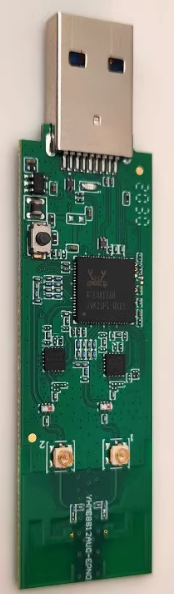

# RTL8812AU USB Dongle Testing

### Test Gear

|Test Board|USB Dongle HW|
|-|-|
|||

```
uname -r
5.4.0

cat /etc/os-release
NAME="Ubuntu"
VERSION="18.04.5 LTS (Bionic Beaver)"
ID=ubuntu
ID_LIKE=debian
PRETTY_NAME="Ubuntu 18.04.5 LTS"
VERSION_ID="18.04"

Architecture:        aarch64
Byte Order:          Little Endian
CPU(s):              2
On-line CPU(s) list: 0,1
Thread(s) per core:  1
Core(s) per socket:  2
Socket(s):           1
Vendor ID:           ARM
Model:               4
Model name:          Cortex-A53
Stepping:            r0p4
CPU max MHz:         1199.9990
CPU min MHz:         299.9990
BogoMIPS:            66.66
Flags:               fp asimd aes pmull sha1 sha2 crc32 cpuid
```

### USB Tree

```
Before driver is loaded

/:  Bus 02.Port 1: Dev 1, Class=root_hub, Driver=xhci-hcd/1p, 5000M
    |__ Port 1: Dev 2, If 0, Class=Hub, Driver=hub/4p, 5000M
/:  Bus 01.Port 1: Dev 1, Class=root_hub, Driver=xhci-hcd/1p, 480M
    |__ Port 1: Dev 2, If 0, Class=Hub, Driver=hub/4p, 480M
        |__ Port 1: Dev 3, If 0, Class=Vendor Specific Class, Driver=, 480M

After driver is loaded.
/:  Bus 02.Port 1: Dev 1, Class=root_hub, Driver=xhci-hcd/1p, 5000M
    |__ Port 1: Dev 2, If 0, Class=Hub, Driver=hub/4p, 5000M
        |__ Port 1: Dev 3, If 0, Class=Vendor Specific Class, Driver=rtw_8812au, 5000M
/:  Bus 01.Port 1: Dev 1, Class=root_hub, Driver=xhci-hcd/1p, 480M
    |__ Port 1: Dev 2, If 0, Class=Hub, Driver=hub/4p, 480M
```

<details>

<summary>USB Details</summary>

```
Bus 002 Device 003: ID 0bda:8812 Realtek Semiconductor Corp. RTL8812AU 802.11a/b/g/n/ac WLAN Adapter
Couldn't open device, some information will be missing
Device Descriptor:
  bLength                18
  bDescriptorType         1
  bcdUSB               3.00
  bDeviceClass            0 (Defined at Interface level)
  bDeviceSubClass         0
  bDeviceProtocol         0
  bMaxPacketSize0         9
  idVendor           0x0bda Realtek Semiconductor Corp.
  idProduct          0x8812 RTL8812AU 802.11a/b/g/n/ac WLAN Adapter
  bcdDevice            0.00
  iManufacturer           1
  iProduct                2
  iSerial                 3
  bNumConfigurations      1
  Configuration Descriptor:
    bLength                 9
    bDescriptorType         2
    wTotalLength           83
    bNumInterfaces          1
    bConfigurationValue     1
    iConfiguration          0
    bmAttributes         0x80
      (Bus Powered)
    MaxPower              200mA
    Interface Descriptor:
      bLength                 9
      bDescriptorType         4
      bInterfaceNumber        0
      bAlternateSetting       0
      bNumEndpoints           5
      bInterfaceClass       255 Vendor Specific Class
      bInterfaceSubClass    255 Vendor Specific Subclass
      bInterfaceProtocol    255 Vendor Specific Protocol
      iInterface              0
      Endpoint Descriptor:
        bLength                 7
        bDescriptorType         5
        bEndpointAddress     0x81  EP 1 IN
        bmAttributes            2
          Transfer Type            Bulk
          Synch Type               None
          Usage Type               Data
        wMaxPacketSize     0x0400  1x 1024 bytes
        bInterval               0
        bMaxBurst               4
      Endpoint Descriptor:
        bLength                 7
        bDescriptorType         5
        bEndpointAddress     0x02  EP 2 OUT
        bmAttributes            2
          Transfer Type            Bulk
          Synch Type               None
          Usage Type               Data
        wMaxPacketSize     0x0400  1x 1024 bytes
        bInterval               0
        bMaxBurst               4
      Endpoint Descriptor:
        bLength                 7
        bDescriptorType         5
        bEndpointAddress     0x03  EP 3 OUT
        bmAttributes            2
          Transfer Type            Bulk
          Synch Type               None
          Usage Type               Data
        wMaxPacketSize     0x0400  1x 1024 bytes
        bInterval               0
        bMaxBurst               4
      Endpoint Descriptor:
        bLength                 7
        bDescriptorType         5
        bEndpointAddress     0x04  EP 4 OUT
        bmAttributes            2
          Transfer Type            Bulk
          Synch Type               None
          Usage Type               Data
        wMaxPacketSize     0x0400  1x 1024 bytes
        bInterval               0
        bMaxBurst               4
      Endpoint Descriptor:
        bLength                 7
        bDescriptorType         5
        bEndpointAddress     0x85  EP 5 IN
        bmAttributes           19
          Transfer Type            Interrupt
          Synch Type               None
          Usage Type               Feedback
        wMaxPacketSize     0x0040  1x 64 bytes
        bInterval               1
        bMaxBurst               0
```

</details>

### Driver Load

The driver is loaded via "insmod"

```
[  137.156867] usbcore: registered new interface driver rtw_8812au
[  137.398137] usb 1-1.1: USB disconnect, device number 3
[  137.429765] usb 2-1.1: new SuperSpeed Gen 1 USB device number 3 using xhci-hcd
[  137.446527] usb 2-1.1: Int endpoint with wBytesPerInterval of 512 in config 1 interface 0 altsetting 0 ep 133: setting to 64
[  137.446734] usb 2-1.1: New USB device found, idVendor=0bda, idProduct=8812, bcdDevice= 0.00
[  137.446739] usb 2-1.1: New USB device strings: Mfr=1, Product=2, SerialNumber=3
[  137.446744] usb 2-1.1: Product: 802.11n NIC
[  137.446748] usb 2-1.1: Manufacturer: Realtek
[  137.446753] usb 2-1.1: SerialNumber: 123456
[  137.478021] rtw_8812au 2-1.1:1.0: Firmware version 52.14.0, H2C version 0

Module                  Size  Used by
rtw_8812au             16384  0
rtw_8812a              45056  1 rtw_8812au
rtw_88xxa              32768  1 rtw_8812a
rtw_usb                24576  1 rtw_8812au
rtw_core              208896  3 rtw_88xxa,rtw_usb,rtw_8812a
```
### Network Manager

```
wlan0: flags=4163<UP,BROADCAST,RUNNING,MULTICAST>  mtu 1500
        inet 192.168.1.34  netmask 255.255.252.0  broadcast 192.168.3.255
        inet6 fe80::xxxx:xxxx:xxxx:xxxx  prefixlen 64  scopeid 0x20<link>
        ether e8:4e:xx:xx:xx:xx  txqueuelen 1000  (Ethernet)
        RX packets 31  bytes 4563 (4.5 KB)
        RX errors 0  dropped 0  overruns 0  frame 0
        TX packets 50  bytes 7251 (7.2 KB)
        TX errors 0  dropped 0 overruns 0  carrier 0  collisions 0
```

### Network Speed Test via Ookla

```
   Speedtest by Ookla

Idle Latency:     3.66 ms   (jitter: 0.49ms, low: 3.33ms, high: 4.09ms)
    Download:   136.49 Mbps (data used: 187.3 MB)
                 18.17 ms   (jitter: 15.23ms, low: 6.78ms, high: 287.62ms)
      Upload:   192.79 Mbps (data used: 288.4 MB)
                 48.02 ms   (jitter: 17.50ms, low: 4.15ms, high: 168.47ms)
```

### Network Ping Tests

#### DNS-Ping

```
PING 8.8.8.8 (8.8.8.8) 56(84) bytes of data.
64 bytes from 8.8.8.8: icmp_seq=1 ttl=59 time=6.92 ms
64 bytes from 8.8.8.8: icmp_seq=2 ttl=59 time=3.70 ms
64 bytes from 8.8.8.8: icmp_seq=3 ttl=59 time=3.42 ms
64 bytes from 8.8.8.8: icmp_seq=4 ttl=59 time=7.56 ms
64 bytes from 8.8.8.8: icmp_seq=5 ttl=59 time=3.69 ms
64 bytes from 8.8.8.8: icmp_seq=6 ttl=59 time=3.77 ms
64 bytes from 8.8.8.8: icmp_seq=7 ttl=59 time=10.6 ms
64 bytes from 8.8.8.8: icmp_seq=8 ttl=59 time=3.96 ms
64 bytes from 8.8.8.8: icmp_seq=9 ttl=59 time=4.95 ms
64 bytes from 8.8.8.8: icmp_seq=10 ttl=59 time=6.80 ms
64 bytes from 8.8.8.8: icmp_seq=11 ttl=59 time=3.51 ms
64 bytes from 8.8.8.8: icmp_seq=12 ttl=59 time=3.46 ms
64 bytes from 8.8.8.8: icmp_seq=13 ttl=59 time=6.86 ms
64 bytes from 8.8.8.8: icmp_seq=14 ttl=59 time=3.81 ms
64 bytes from 8.8.8.8: icmp_seq=15 ttl=59 time=6.46 ms
64 bytes from 8.8.8.8: icmp_seq=16 ttl=59 time=3.58 ms
64 bytes from 8.8.8.8: icmp_seq=17 ttl=59 time=3.83 ms
64 bytes from 8.8.8.8: icmp_seq=18 ttl=59 time=6.95 ms
64 bytes from 8.8.8.8: icmp_seq=19 ttl=59 time=3.81 ms
64 bytes from 8.8.8.8: icmp_seq=20 ttl=59 time=3.65 ms

--- 8.8.8.8 ping statistics ---
20 packets transmitted, 20 received, 0% packet loss, time 19030ms
rtt min/avg/max/mdev = 3.428/5.073/10.685/1.952 ms
```

#### Self-Ping 

```
PING 192.168.1.1 (192.168.1.1) 10000(10028) bytes of data.
10008 bytes from 192.168.1.1: icmp_seq=1 ttl=64 time=4.23 ms
10008 bytes from 192.168.1.1: icmp_seq=2 ttl=64 time=4.84 ms
10008 bytes from 192.168.1.1: icmp_seq=3 ttl=64 time=4.47 ms
10008 bytes from 192.168.1.1: icmp_seq=4 ttl=64 time=3.44 ms
10008 bytes from 192.168.1.1: icmp_seq=5 ttl=64 time=4.02 ms
10008 bytes from 192.168.1.1: icmp_seq=6 ttl=64 time=3.17 ms
10008 bytes from 192.168.1.1: icmp_seq=7 ttl=64 time=2.83 ms
10008 bytes from 192.168.1.1: icmp_seq=8 ttl=64 time=3.20 ms
10008 bytes from 192.168.1.1: icmp_seq=9 ttl=64 time=2.59 ms
10008 bytes from 192.168.1.1: icmp_seq=10 ttl=64 time=2.29 ms
10008 bytes from 192.168.1.1: icmp_seq=11 ttl=64 time=4.81 ms
10008 bytes from 192.168.1.1: icmp_seq=12 ttl=64 time=2.99 ms
10008 bytes from 192.168.1.1: icmp_seq=13 ttl=64 time=3.74 ms
10008 bytes from 192.168.1.1: icmp_seq=14 ttl=64 time=3.64 ms
10008 bytes from 192.168.1.1: icmp_seq=15 ttl=64 time=2.88 ms
10008 bytes from 192.168.1.1: icmp_seq=16 ttl=64 time=2.50 ms
10008 bytes from 192.168.1.1: icmp_seq=17 ttl=64 time=2.70 ms
10008 bytes from 192.168.1.1: icmp_seq=18 ttl=64 time=2.65 ms
10008 bytes from 192.168.1.1: icmp_seq=19 ttl=64 time=3.85 ms
10008 bytes from 192.168.1.1: icmp_seq=20 ttl=64 time=3.82 ms

--- 192.168.1.1 ping statistics ---
20 packets transmitted, 20 received, 0% packet loss, time 19028ms
rtt min/avg/max/mdev = 2.294/3.436/4.842/0.758 ms
```

### iw list

<details>

<summary>iw list</summary>

```
Wiphy phy1
        max # scan SSIDs: 4
        max scan IEs length: 2243 bytes
        max # sched scan SSIDs: 0
        max # match sets: 0
        max # scan plans: 1
        max scan plan interval: -1
        max scan plan iterations: 0
        Retry short limit: 7
        Retry long limit: 4
        Coverage class: 0 (up to 0m)
        Device supports T-DLS.
        Supported Ciphers:
                * WEP40 (00-0f-ac:1)
                * WEP104 (00-0f-ac:5)
                * TKIP (00-0f-ac:2)
                * CCMP-128 (00-0f-ac:4)
                * CCMP-256 (00-0f-ac:10)
                * GCMP-128 (00-0f-ac:8)
                * GCMP-256 (00-0f-ac:9)
                * CMAC (00-0f-ac:6)
                * CMAC-256 (00-0f-ac:13)
                * GMAC-128 (00-0f-ac:11)
                * GMAC-256 (00-0f-ac:12)
        Available Antennas: TX 0x3 RX 0x3
        Configured Antennas: TX 0x3 RX 0x3
        Supported interface modes:
                 * IBSS
                 * managed
                 * AP
                 * AP/VLAN
                 * monitor
                 * P2P-client
                 * P2P-GO
        Band 1:
                Capabilities: 0x196e
                        HT20/HT40
                        SM Power Save disabled
                        RX HT20 SGI
                        RX HT40 SGI
                        RX STBC 1-stream
                        Max AMSDU length: 7935 bytes
                        DSSS/CCK HT40
                Maximum RX AMPDU length 65535 bytes (exponent: 0x003)
                Minimum RX AMPDU time spacing: 16 usec (0x07)
                HT Max RX data rate: 300 Mbps
                HT TX/RX MCS rate indexes supported: 0-15, 32
                Bitrates (non-HT):
                        * 1.0 Mbps
                        * 2.0 Mbps
                        * 5.5 Mbps
                        * 11.0 Mbps
                        * 6.0 Mbps
                        * 9.0 Mbps
                        * 12.0 Mbps
                        * 18.0 Mbps
                        * 24.0 Mbps
                        * 36.0 Mbps
                        * 48.0 Mbps
                        * 54.0 Mbps
                Frequencies:
                        * 2412 MHz [1] (20.0 dBm)
                        * 2417 MHz [2] (20.0 dBm)
                        * 2422 MHz [3] (20.0 dBm)
                        * 2427 MHz [4] (20.0 dBm)
                        * 2432 MHz [5] (20.0 dBm)
                        * 2437 MHz [6] (20.0 dBm)
                        * 2442 MHz [7] (20.0 dBm)
                        * 2447 MHz [8] (20.0 dBm)
                        * 2452 MHz [9] (20.0 dBm)
                        * 2457 MHz [10] (20.0 dBm)
                        * 2462 MHz [11] (20.0 dBm)
                        * 2467 MHz [12] (20.0 dBm)
                        * 2472 MHz [13] (20.0 dBm)
                        * 2484 MHz [14] (disabled)
        Band 2:
                Capabilities: 0x196e
                        HT20/HT40
                        SM Power Save disabled
                        RX HT20 SGI
                        RX HT40 SGI
                        RX STBC 1-stream
                        Max AMSDU length: 7935 bytes
                        DSSS/CCK HT40
                Maximum RX AMPDU length 65535 bytes (exponent: 0x003)
                Minimum RX AMPDU time spacing: 16 usec (0x07)
                HT Max RX data rate: 300 Mbps
                HT TX/RX MCS rate indexes supported: 0-15, 32
                VHT Capabilities (0x03d071a2):
                        Max MPDU length: 11454
                        Supported Channel Width: neither 160 nor 80+80
                        short GI (80 MHz)
                        TX STBC
                        SU Beamformee
                        MU Beamformee
                        +HTC-VHT
                VHT RX MCS set:
                        1 streams: MCS 0-9
                        2 streams: MCS 0-9
                        3 streams: not supported
                        4 streams: not supported
                        5 streams: not supported
                        6 streams: not supported
                        7 streams: not supported
                        8 streams: not supported
                VHT RX highest supported: 780 Mbps
                VHT TX MCS set:
                        1 streams: MCS 0-9
                        2 streams: MCS 0-9
                        3 streams: not supported
                        4 streams: not supported
                        5 streams: not supported
                        6 streams: not supported
                        7 streams: not supported
                        8 streams: not supported
                VHT TX highest supported: 780 Mbps
                Bitrates (non-HT):
                        * 6.0 Mbps
                        * 9.0 Mbps
                        * 12.0 Mbps
                        * 18.0 Mbps
                        * 24.0 Mbps
                        * 36.0 Mbps
                        * 48.0 Mbps
                        * 54.0 Mbps
                Frequencies:
                        * 5180 MHz [36] (20.0 dBm) (radar detection)
                        * 5200 MHz [40] (20.0 dBm) (radar detection)
                        * 5220 MHz [44] (20.0 dBm) (radar detection)
                        * 5240 MHz [48] (20.0 dBm) (radar detection)
                        * 5260 MHz [52] (20.0 dBm) (radar detection)
                        * 5280 MHz [56] (20.0 dBm) (radar detection)
                        * 5300 MHz [60] (20.0 dBm) (radar detection)
                        * 5320 MHz [64] (20.0 dBm) (radar detection)
                        * 5500 MHz [100] (disabled)
                        * 5520 MHz [104] (disabled)
                        * 5540 MHz [108] (disabled)
                        * 5560 MHz [112] (disabled)
                        * 5580 MHz [116] (disabled)
                        * 5600 MHz [120] (disabled)
                        * 5620 MHz [124] (disabled)
                        * 5640 MHz [128] (disabled)
                        * 5660 MHz [132] (disabled)
                        * 5680 MHz [136] (disabled)
                        * 5700 MHz [140] (disabled)
                        * 5720 MHz [144] (disabled)
                        * 5745 MHz [149] (33.0 dBm)
                        * 5765 MHz [153] (33.0 dBm)
                        * 5785 MHz [157] (33.0 dBm)
                        * 5805 MHz [161] (33.0 dBm)
                        * 5825 MHz [165] (33.0 dBm)
        Supported commands:
                 * new_interface
                 * set_interface
                 * new_key
                 * start_ap
                 * new_station
                 * set_bss
                 * authenticate
                 * associate
                 * deauthenticate
                 * disassociate
                 * join_ibss
                 * set_tx_bitrate_mask
                 * frame
                 * frame_wait_cancel
                 * set_wiphy_netns
                 * set_channel
                 * set_wds_peer
                 * tdls_mgmt
                 * tdls_oper
                 * probe_client
                 * set_noack_map
                 * register_beacons
                 * start_p2p_device
                 * set_mcast_rate
                 * testmode
                 * connect
                 * disconnect
                 * set_qos_map
                 * set_multicast_to_unicast
        Supported TX frame types:
                 * IBSS: 0x00 0x10 0x20 0x30 0x40 0x50 0x60 0x70 0x80 0x90 0xa0 0xb0 0xc0 0xd0 0xe0 0xf0
                 * managed: 0x00 0x10 0x20 0x30 0x40 0x50 0x60 0x70 0x80 0x90 0xa0 0xb0 0xc0 0xd0 0xe0 0xf0
                 * AP: 0x00 0x10 0x20 0x30 0x40 0x50 0x60 0x70 0x80 0x90 0xa0 0xb0 0xc0 0xd0 0xe0 0xf0
                 * AP/VLAN: 0x00 0x10 0x20 0x30 0x40 0x50 0x60 0x70 0x80 0x90 0xa0 0xb0 0xc0 0xd0 0xe0 0xf0
                 * mesh point: 0x00 0x10 0x20 0x30 0x40 0x50 0x60 0x70 0x80 0x90 0xa0 0xb0 0xc0 0xd0 0xe0 0xf0
                 * P2P-client: 0x00 0x10 0x20 0x30 0x40 0x50 0x60 0x70 0x80 0x90 0xa0 0xb0 0xc0 0xd0 0xe0 0xf0
                 * P2P-GO: 0x00 0x10 0x20 0x30 0x40 0x50 0x60 0x70 0x80 0x90 0xa0 0xb0 0xc0 0xd0 0xe0 0xf0
                 * P2P-device: 0x00 0x10 0x20 0x30 0x40 0x50 0x60 0x70 0x80 0x90 0xa0 0xb0 0xc0 0xd0 0xe0 0xf0
        Supported RX frame types:
                 * IBSS: 0x40 0xb0 0xc0 0xd0
                 * managed: 0x40 0xd0
                 * AP: 0x00 0x20 0x40 0xa0 0xb0 0xc0 0xd0
                 * AP/VLAN: 0x00 0x20 0x40 0xa0 0xb0 0xc0 0xd0
                 * mesh point: 0xb0 0xc0 0xd0
                 * P2P-client: 0x40 0xd0
                 * P2P-GO: 0x00 0x20 0x40 0xa0 0xb0 0xc0 0xd0
                 * P2P-device: 0x40 0xd0
        software interface modes (can always be added):
                 * AP/VLAN
                 * monitor
        valid interface combinations:
                 * #{ managed } <= 1, #{ AP, P2P-client, P2P-GO } <= 1,
                   total <= 2, #channels <= 1
        HT Capability overrides:
                 * MCS: ff ff ff ff ff ff ff ff ff ff
                 * maximum A-MSDU length
                 * supported channel width
                 * short GI for 40 MHz
                 * max A-MPDU length exponent
                 * min MPDU start spacing
        Device supports TX status socket option.
        Device supports HT-IBSS.
        Device supports SAE with AUTHENTICATE command
        Device supports scan flush.
        Device supports per-vif TX power setting
        Driver supports full state transitions for AP/GO clients
        Driver supports a userspace MPM
        Device supports configuring vdev MAC-addr on create.

```

</details>

### iwconfig

```
wlan0     IEEE 802.11  ESSID:""
          Mode:Managed  Frequency:5.805 GHz  Access Point: F8:xx:xx:xx:xx:xx
          Bit Rate=468 Mb/s   Tx-Power=33 dBm
          Retry short limit:7   RTS thr:off   Fragment thr:off
          Power Management:on
          Link Quality=46/70  Signal level=-64 dBm
          Rx invalid nwid:0  Rx invalid crypt:0  Rx invalid frag:0
          Tx excessive retries:0  Invalid misc:24   Missed beacon:0
```

### Server & Client Test via iperf3 (PC-Router-DUT)

<details>

<summary>iperf3</summary>

```
-----------------------------------------------------------
Server listening on 5201
-----------------------------------------------------------
Accepted connection from 192.168.1.10, port 56006
[  5] local 192.168.1.34 port 5201 connected to 192.168.1.10 port 56007
[ ID] Interval           Transfer     Bandwidth       Retr  Cwnd
[  5]   0.00-1.00   sec  7.67 MBytes  64.3 Mbits/sec    0   67.0 KBytes
[  5]   1.00-2.00   sec  7.44 MBytes  62.4 Mbits/sec    0   67.0 KBytes
[  5]   2.00-3.00   sec  11.1 MBytes  92.8 Mbits/sec    0    269 KBytes
[  5]   3.00-4.00   sec  10.8 MBytes  91.0 Mbits/sec    0    269 KBytes
[  5]   4.00-5.00   sec  16.3 MBytes   137 Mbits/sec    0    515 KBytes
[  5]   5.00-6.00   sec  13.1 MBytes   110 Mbits/sec    0    515 KBytes
[  5]   6.00-7.00   sec  14.8 MBytes   124 Mbits/sec    0    515 KBytes
[  5]   7.00-8.00   sec  14.0 MBytes   118 Mbits/sec    0    515 KBytes
[  5]   8.00-9.00   sec  14.2 MBytes   119 Mbits/sec    0    515 KBytes
[  5]   9.00-10.00  sec  14.3 MBytes   120 Mbits/sec    0    515 KBytes
[  5]  10.00-11.00  sec  15.3 MBytes   128 Mbits/sec    0    515 KBytes
[  5]  11.00-12.00  sec  14.6 MBytes   122 Mbits/sec    0    515 KBytes
[  5]  12.00-13.00  sec  13.2 MBytes   110 Mbits/sec    0    515 KBytes
[  5]  13.00-14.00  sec  14.9 MBytes   125 Mbits/sec    0    515 KBytes
[  5]  14.00-15.00  sec  14.0 MBytes   117 Mbits/sec    0    515 KBytes
[  5]  15.00-16.00  sec  14.1 MBytes   118 Mbits/sec    0    515 KBytes
[  5]  16.00-17.00  sec  15.6 MBytes   131 Mbits/sec    0    515 KBytes
[  5]  17.00-18.00  sec  13.9 MBytes   117 Mbits/sec    0    515 KBytes
[  5]  18.00-19.00  sec  13.3 MBytes   112 Mbits/sec    0    515 KBytes
[  5]  19.00-20.00  sec  15.1 MBytes   127 Mbits/sec    0    515 KBytes
[  5]  20.00-21.00  sec  13.2 MBytes   110 Mbits/sec    0    515 KBytes
[  5]  21.00-22.00  sec  14.0 MBytes   117 Mbits/sec    0    515 KBytes
[  5]  22.00-23.00  sec  14.9 MBytes   125 Mbits/sec    0    515 KBytes
[  5]  23.00-24.00  sec  13.4 MBytes   112 Mbits/sec    0    515 KBytes
[  5]  24.00-25.00  sec  14.0 MBytes   118 Mbits/sec    0    515 KBytes
[  5]  25.00-26.00  sec  14.0 MBytes   117 Mbits/sec    0    515 KBytes
[  5]  26.00-27.00  sec  13.9 MBytes   117 Mbits/sec    0    515 KBytes
[  5]  27.00-28.00  sec  14.4 MBytes   121 Mbits/sec    0    515 KBytes
[  5]  28.00-29.00  sec  13.8 MBytes   116 Mbits/sec    0    515 KBytes
[  5]  29.00-30.00  sec  14.2 MBytes   119 Mbits/sec    0    515 KBytes
[  5]  30.00-31.00  sec  14.1 MBytes   118 Mbits/sec    0    515 KBytes
[  5]  31.00-32.00  sec  14.1 MBytes   118 Mbits/sec    0    515 KBytes
[  5]  32.00-33.00  sec  13.5 MBytes   114 Mbits/sec    0    515 KBytes
[  5]  33.00-34.00  sec  14.0 MBytes   117 Mbits/sec    0    515 KBytes
[  5]  34.00-35.00  sec  14.3 MBytes   120 Mbits/sec    0    515 KBytes
[  5]  35.00-36.00  sec  12.1 MBytes   101 Mbits/sec    0    515 KBytes
[  5]  36.00-37.00  sec  13.8 MBytes   116 Mbits/sec    0    515 KBytes
[  5]  37.00-38.00  sec  14.2 MBytes   119 Mbits/sec    0    515 KBytes
[  5]  38.00-39.00  sec  14.0 MBytes   117 Mbits/sec    0    515 KBytes
[  5]  39.00-40.00  sec  10.7 MBytes  89.4 Mbits/sec    0    515 KBytes
[  5]  40.00-41.00  sec  10.5 MBytes  87.9 Mbits/sec    0    515 KBytes
[  5]  41.00-42.00  sec  10.8 MBytes  90.5 Mbits/sec    0    515 KBytes
[  5]  42.00-43.00  sec  9.56 MBytes  80.2 Mbits/sec    0    515 KBytes
[  5]  43.00-44.00  sec  14.2 MBytes   119 Mbits/sec    0    515 KBytes
[  5]  44.00-45.00  sec  13.8 MBytes   116 Mbits/sec    0    515 KBytes
[  5]  45.00-46.00  sec  13.2 MBytes   111 Mbits/sec    0    515 KBytes
[  5]  46.00-47.00  sec  13.9 MBytes   117 Mbits/sec    0    515 KBytes
[  5]  47.00-48.00  sec  14.5 MBytes   122 Mbits/sec    0    515 KBytes
[  5]  48.00-49.00  sec  12.9 MBytes   108 Mbits/sec    0    515 KBytes
[  5]  49.00-50.00  sec  11.8 MBytes  98.7 Mbits/sec    0    515 KBytes
[  5]  50.00-51.00  sec  11.0 MBytes  92.0 Mbits/sec    0    515 KBytes
[  5]  51.00-52.00  sec  11.8 MBytes  99.2 Mbits/sec    0    515 KBytes
[  5]  52.00-53.00  sec  11.7 MBytes  98.2 Mbits/sec    0    515 KBytes
[  5]  53.00-54.00  sec  13.2 MBytes   111 Mbits/sec    0    515 KBytes
[  5]  54.00-55.00  sec  13.2 MBytes   111 Mbits/sec    0    515 KBytes
[  5]  55.00-56.00  sec  9.86 MBytes  82.7 Mbits/sec    1    550 KBytes
[  5]  56.00-57.00  sec  14.8 MBytes   124 Mbits/sec    0    740 KBytes
[  5]  57.00-58.00  sec  13.8 MBytes   115 Mbits/sec    0    837 KBytes
[  5]  58.00-59.00  sec  13.8 MBytes   115 Mbits/sec    0    837 KBytes
[  5]  59.00-60.00  sec  15.0 MBytes   126 Mbits/sec    0    932 KBytes
[  5]  60.00-61.00  sec  13.8 MBytes   115 Mbits/sec    0    987 KBytes
[  5]  61.00-62.00  sec  13.8 MBytes   115 Mbits/sec  602    639 KBytes
[  5]  62.00-63.00  sec  12.5 MBytes   105 Mbits/sec    0    727 KBytes
[  5]  63.00-64.00  sec  13.8 MBytes   115 Mbits/sec    0    808 KBytes
[  5]  64.00-65.00  sec  13.8 MBytes   115 Mbits/sec    0    808 KBytes
[  5]  65.00-66.00  sec  15.0 MBytes   126 Mbits/sec    0    931 KBytes
[  5]  66.00-67.00  sec  12.5 MBytes   105 Mbits/sec    0    931 KBytes
[  5]  67.00-68.00  sec  15.0 MBytes   126 Mbits/sec    0    931 KBytes
[  5]  68.00-69.00  sec  13.8 MBytes   115 Mbits/sec    0    931 KBytes
[  5]  69.00-70.00  sec  13.8 MBytes   115 Mbits/sec    0    971 KBytes
[  5]  70.00-71.00  sec  10.0 MBytes  83.9 Mbits/sec    0    971 KBytes
[  5]  71.00-72.00  sec  11.2 MBytes  94.4 Mbits/sec    0    971 KBytes
[  5]  72.00-73.00  sec  12.5 MBytes   105 Mbits/sec    0    971 KBytes
[  5]  73.00-74.00  sec  11.2 MBytes  94.3 Mbits/sec    0    971 KBytes
[  5]  74.00-75.00  sec  11.2 MBytes  94.4 Mbits/sec    0    971 KBytes
[  5]  75.00-76.00  sec  10.0 MBytes  83.9 Mbits/sec    0    971 KBytes
[  5]  76.00-77.00  sec  11.2 MBytes  94.4 Mbits/sec    0    971 KBytes
[  5]  77.00-78.00  sec  10.0 MBytes  83.9 Mbits/sec    0    971 KBytes
[  5]  78.00-79.00  sec  13.8 MBytes   115 Mbits/sec    0    971 KBytes
[  5]  79.00-80.00  sec  13.8 MBytes   115 Mbits/sec    0    971 KBytes
[  5]  80.00-81.00  sec  13.8 MBytes   115 Mbits/sec    0    971 KBytes
[  5]  81.00-82.00  sec  13.8 MBytes   115 Mbits/sec    0    971 KBytes
[  5]  82.00-83.00  sec  15.0 MBytes   126 Mbits/sec    0   1.48 MBytes
[  5]  83.00-84.00  sec  13.8 MBytes   115 Mbits/sec    0   1.48 MBytes
[  5]  84.00-85.00  sec  12.5 MBytes   105 Mbits/sec    0   1.48 MBytes
[  5]  85.00-86.00  sec  13.8 MBytes   115 Mbits/sec    0   1.48 MBytes
[  5]  86.00-87.00  sec  15.0 MBytes   126 Mbits/sec    0   1.48 MBytes
[  5]  87.00-88.00  sec  13.8 MBytes   115 Mbits/sec    0   1.48 MBytes
[  5]  88.00-89.00  sec  15.0 MBytes   126 Mbits/sec    0   1.48 MBytes
[  5]  89.00-90.00  sec  13.8 MBytes   115 Mbits/sec    0   1.48 MBytes
[  5]  90.00-91.00  sec  13.8 MBytes   115 Mbits/sec    0   1.48 MBytes
[  5]  91.00-92.00  sec  13.8 MBytes   115 Mbits/sec    0   1.48 MBytes
[  5]  92.00-93.00  sec  13.8 MBytes   115 Mbits/sec    0   1.48 MBytes
[  5]  93.00-94.00  sec  15.0 MBytes   126 Mbits/sec    0   1.48 MBytes
[  5]  94.00-95.00  sec  15.0 MBytes   126 Mbits/sec    0   1.48 MBytes
[  5]  95.00-96.00  sec  13.8 MBytes   115 Mbits/sec    0   1.48 MBytes
[  5]  96.00-97.00  sec  13.8 MBytes   115 Mbits/sec   14   1.04 MBytes
[  5]  97.00-98.00  sec  15.0 MBytes   126 Mbits/sec    0   1.04 MBytes
[  5]  98.00-99.00  sec  15.0 MBytes   126 Mbits/sec    0   1.04 MBytes
[  5]  99.00-100.00 sec  10.0 MBytes  83.9 Mbits/sec    0   1.04 MBytes
```

</details>

### AP Test

#### hostapd.conf

Setup the configuration at /etc/hostapd/hostapd.conf

```
interface=wlan0
driver=nl80211
ieee80211n=1
hw_mode=g
channel=6
ssid=AP-TEST
wpa=2
wpa_passphrase=12345678
wpa_key_mgmt=WPA-PSK
rsn_pairwise=CCMP TKIP
wpa_pairwise=TKIP CCMP
```
#### udhcpd.conf

```
start 192.168.175.2
end 192.168.175.254
interface wlan0
max_leases 234
opt router 192.168.175.1
```

#### Start AP Test
```
sudo hostapd -dd -e /dev/urandom /etc/hostapd/hostapd.conf -B
Configuration file: /etc/hostapd/hostapd.conf
Using interface wlan0 with hwaddr  and ssid "AP-TEST"
wlan0: interface state UNINITIALIZED->ENABLED
wlan0: AP-ENABLED
```

#### Server & Client Test via iperf3 (PC-DUT)

At the middle of the TRX BT is connected to the same PC.

The "failed to download drv rsvd page" messages appeared.


<details>

<summary>iperf3</summary>

```
-----------------------------------------------------------
Server listening on 5201
-----------------------------------------------------------
Accepted connection from 192.168.175.86, port 56051
[  5] local 192.168.175.1 port 5201 connected to 192.168.175.86 port 56052
[ ID] Interval           Transfer     Bandwidth       Retr  Cwnd
[  5]   0.00-1.00   sec  2.65 MBytes  22.2 Mbits/sec    0   95.5 KBytes
[  5]   1.00-2.00   sec  2.30 MBytes  19.3 Mbits/sec    0   95.5 KBytes
[  5]   2.00-3.00   sec  2.02 MBytes  17.0 Mbits/sec    0   95.5 KBytes
[  5]   3.00-4.00   sec  1.81 MBytes  15.2 Mbits/sec   29   95.5 KBytes
[  5]   4.00-5.00   sec  2.17 MBytes  18.2 Mbits/sec    0   95.5 KBytes
[  5]   5.00-6.00   sec  1.93 MBytes  16.2 Mbits/sec    0   95.5 KBytes
[  5]   6.00-7.00   sec  1.87 MBytes  15.7 Mbits/sec    1   95.5 KBytes
[  5]   7.00-8.00   sec  1.62 MBytes  13.6 Mbits/sec    1   95.5 KBytes
[  5]   8.00-9.00   sec  1.93 MBytes  16.2 Mbits/sec    0   95.5 KBytes
[  5]   9.00-10.00  sec  1.90 MBytes  15.9 Mbits/sec    0   95.5 KBytes
[  5]  10.00-11.00  sec  1.56 MBytes  13.1 Mbits/sec    0   95.5 KBytes
[  5]  11.00-12.00  sec  1.84 MBytes  15.4 Mbits/sec    0   95.5 KBytes
[  5]  12.00-13.00  sec  1.78 MBytes  14.9 Mbits/sec    0   95.5 KBytes
[  5]  13.00-14.00  sec  1.96 MBytes  16.4 Mbits/sec    0   95.5 KBytes
[  5]  14.00-15.00  sec  2.02 MBytes  17.0 Mbits/sec    0   95.5 KBytes
[  5]  15.00-16.00  sec  2.36 MBytes  19.8 Mbits/sec    0   95.5 KBytes
[  5]  16.00-17.00  sec  2.24 MBytes  18.8 Mbits/sec    0   95.5 KBytes
[  5]  17.00-18.00  sec  2.33 MBytes  19.5 Mbits/sec    0   95.5 KBytes
[  5]  18.00-19.00  sec  2.36 MBytes  19.8 Mbits/sec    0   95.5 KBytes
[  5]  19.00-20.00  sec  1.96 MBytes  16.4 Mbits/sec    0   95.5 KBytes
[  5]  20.00-21.00  sec  2.39 MBytes  20.0 Mbits/sec    0   95.5 KBytes
[  5]  21.00-22.00  sec  2.94 MBytes  24.7 Mbits/sec    0   95.5 KBytes
[  5]  22.00-23.00  sec  3.46 MBytes  29.0 Mbits/sec    0   95.5 KBytes
[  5]  23.00-24.00  sec  3.16 MBytes  26.5 Mbits/sec    0   95.5 KBytes
[  5]  24.00-25.00  sec  4.63 MBytes  38.8 Mbits/sec    0   95.5 KBytes
[  5]  25.00-26.00  sec  5.15 MBytes  43.2 Mbits/sec    0    147 KBytes
[  5]  26.00-27.00  sec  4.96 MBytes  41.6 Mbits/sec    0    147 KBytes
[  5]  27.00-28.00  sec  4.90 MBytes  41.1 Mbits/sec    0    147 KBytes
[  5]  28.00-29.00  sec  4.66 MBytes  39.1 Mbits/sec    0    147 KBytes
[  5]  29.00-30.00  sec  4.78 MBytes  40.1 Mbits/sec    0    147 KBytes
[  5]  30.00-31.00  sec  4.66 MBytes  39.1 Mbits/sec    0    147 KBytes
[  5]  31.00-32.00  sec  3.43 MBytes  28.8 Mbits/sec    0    147 KBytes
[  5]  32.00-33.00  sec  1.84 MBytes  15.4 Mbits/sec    0    147 KBytes
[  5]  33.00-34.00  sec   753 KBytes  6.17 Mbits/sec    0    147 KBytes
[  5]  34.00-35.00  sec  1004 KBytes  8.22 Mbits/sec    0    147 KBytes
[  930.538347] rtw_8812au 2-1.1:1.0: error beacon valid
[  930.543384] rtw_8812au 2-1.1:1.0: failed to download drv rsvd page
[  5]  35.00-36.00  sec   376 KBytes  3.08 Mbits/sec    0    147 KBytes
[  5]  36.00-37.00  sec   690 KBytes  5.65 Mbits/sec    2    147 KBytes
[  5]  37.00-38.00  sec  1.04 MBytes  8.74 Mbits/sec    0    147 KBytes
[  933.610939] rtw_8812au 2-1.1:1.0: error beacon valid
[  933.615977] rtw_8812au 2-1.1:1.0: failed to download drv rsvd page
[  5]  38.00-39.00  sec  1.04 MBytes  8.74 Mbits/sec    1    115 KBytes
[  5]  39.00-40.00  sec   941 KBytes  7.71 Mbits/sec    0    130 KBytes
[  934.941626] rtw_8812au 2-1.1:1.0: error beacon valid
[  934.946759] rtw_8812au 2-1.1:1.0: failed to download drv rsvd page
[  5]  40.00-41.00  sec  1.35 MBytes  11.3 Mbits/sec    0    130 KBytes
[  5]  41.00-42.00  sec  2.14 MBytes  18.0 Mbits/sec   62   92.7 KBytes
[  5]  42.00-43.00  sec  1.65 MBytes  13.9 Mbits/sec    0    108 KBytes
[  5]  43.00-44.00  sec  2.27 MBytes  19.0 Mbits/sec   34   69.9 KBytes
[  5]  44.00-45.00  sec  2.08 MBytes  17.5 Mbits/sec    0   89.8 KBytes
[  5]  45.00-46.00  sec  1.96 MBytes  16.4 Mbits/sec    0    107 KBytes
[  941.393410] rtw_8812au 2-1.1:1.0: error beacon valid
[  941.398516] rtw_8812au 2-1.1:1.0: failed to download drv rsvd page
[  5]  46.00-47.00  sec  2.27 MBytes  19.0 Mbits/sec    0    121 KBytes
[  5]  47.00-48.00  sec  2.27 MBytes  19.0 Mbits/sec    6    130 KBytes
[  5]  48.00-49.00  sec  1.90 MBytes  15.9 Mbits/sec   52   99.8 KBytes
[  944.365098] rtw_8812au 2-1.1:1.0: error beacon valid
[  944.370136] rtw_8812au 2-1.1:1.0: failed to download drv rsvd page
[  5]  49.00-50.00  sec  1.90 MBytes  15.9 Mbits/sec    0    113 KBytes
[  945.079264] rtw_8812au 2-1.1:1.0: error beacon valid
[  945.085588] rtw_8812au 2-1.1:1.0: failed to download drv rsvd page
[  945.091801] rtw_8812au 2-1.1:1.0: failed to download beacon
[  5]  50.00-51.00  sec  1.72 MBytes  14.4 Mbits/sec    0    124 KBytes
[  946.616621] rtw_8812au 2-1.1:1.0: error beacon valid
[  946.621710] rtw_8812au 2-1.1:1.0: failed to download drv rsvd page
[  5]  51.00-52.00  sec  1.41 MBytes  11.8 Mbits/sec    0    130 KBytes
[  5]  52.00-53.00  sec  2.21 MBytes  18.5 Mbits/sec    0    130 KBytes
[  5]  53.00-54.00  sec  1.90 MBytes  15.9 Mbits/sec  123   92.7 KBytes
[  5]  54.00-55.00  sec  1.96 MBytes  16.4 Mbits/sec    0    108 KBytes
[  5]  55.00-56.00  sec  1.96 MBytes  16.4 Mbits/sec   35    118 KBytes
[  5]  56.00-57.00  sec  2.02 MBytes  17.0 Mbits/sec   61   82.7 KBytes
[  5]  57.00-58.00  sec  1.96 MBytes  16.4 Mbits/sec    0   88.4 KBytes
[  5]  58.00-59.00  sec  2.02 MBytes  17.0 Mbits/sec    0    104 KBytes
[  5]  59.00-60.00  sec  1.90 MBytes  15.9 Mbits/sec    4    110 KBytes
[  5]  60.00-61.00  sec  2.02 MBytes  17.0 Mbits/sec   40    110 KBytes
[  5]  61.00-62.00  sec  1.84 MBytes  15.4 Mbits/sec   22    110 KBytes
[  957.576785] rtw_8812au 2-1.1:1.0: error beacon valid
[  957.581833] rtw_8812au 2-1.1:1.0: failed to download drv rsvd page
[  5]  62.00-63.00  sec  2.21 MBytes  18.5 Mbits/sec   63   57.0 KBytes
[  5]  63.00-64.00  sec  1.96 MBytes  16.4 Mbits/sec    0   99.8 KBytes
[  959.109086] rtw_8812au 2-1.1:1.0: error beacon valid
[  959.114142] rtw_8812au 2-1.1:1.0: failed to download drv rsvd page
[  959.120326] rtw_8812au 2-1.1:1.0: failed to download beacon
[  5]  64.00-65.00  sec  2.14 MBytes  18.0 Mbits/sec    0    114 KBytes
[  5]  65.00-66.00  sec  2.14 MBytes  18.0 Mbits/sec    0    127 KBytes
[  5]  65.00-66.00  sec  2.14 MBytes  18.0 Mbits/sec    0    127 KBytes
- - - - - - - - - - - - - - - - - - - - - - - - -
[ ID] Interval           Transfer     Bandwidth       Retr
[  5]   0.00-66.00  sec   149 MBytes  19.0 Mbits/sec  536             sender
[  5]   0.00-66.00  sec  0.00 Bytes  0.00 bits/sec                  receiver
```

</details>
