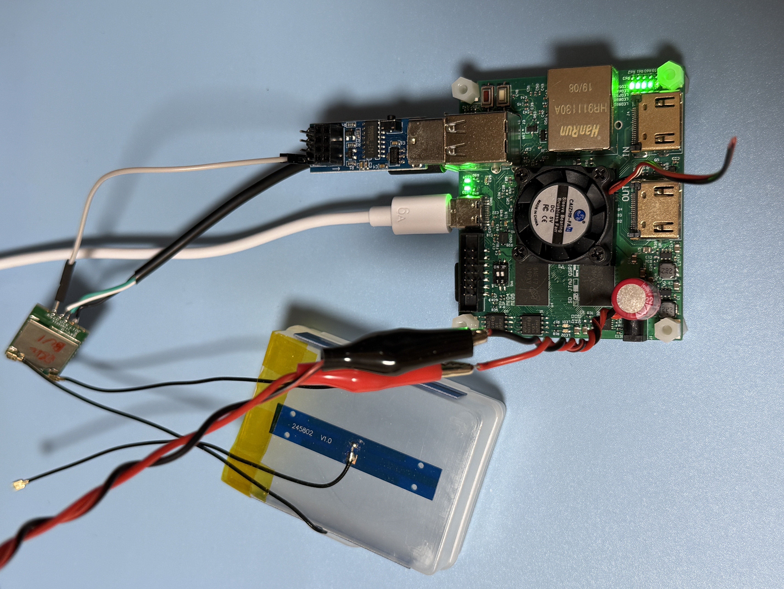

# RTL8812BU USB Dongle Testing

### Test USB Gear

|Test Board|USB Dongle HW|
|-|-|
|||

```
5.4.0-xilinx

DISTRIB_ID=Ubuntu
DISTRIB_RELEASE=18.04
DISTRIB_CODENAME=bionic
DISTRIB_DESCRIPTION="Ubuntu 18.04.5 LTS"

Architecture:        armv7l
Byte Order:          Little Endian
CPU(s):              2
On-line CPU(s) list: 0,1
Thread(s) per core:  1
Core(s) per socket:  2
Socket(s):           1
Vendor ID:           ARM
Model:               0
Model name:          Cortex-A9
Stepping:            r3p0
BogoMIPS:            666.66
Flags:               half thumb fastmult vfp edsp neon vfpv3 tls vfpd32
```

### USB Tree

```
Before driver is inserted.
/:  Bus 01.Port 1: Dev 1, Class=root_hub, Driver=ci_hdrc/1p, 480M
    |__ Port 1: Dev 2, If 0, Class=Hub, Driver=hub/2p, 480M
        |__ Port 2: Dev 3, If 0, Class=Vendor Specific Class, Driver=, 480M

After driver is inserted.
/:  Bus 01.Port 1: Dev 1, Class=root_hub, Driver=ci_hdrc/1p, 480M
    |__ Port 1: Dev 2, If 0, Class=Hub, Driver=hub/2p, 480M
        |__ Port 2: Dev 3, If 0, Class=Vendor Specific Class, Driver=rtw_8822bu, 480M
```

<details>

<summary>USB Details</summary>

```
Bus 001 Device 003: ID 0bda:b812 Realtek Semiconductor Corp. 
Bus 001 Device 002: ID 0424:2512 Standard Microsystems Corp. USB 2.0 Hub
Bus 001 Device 001: ID 1d6b:0002 Linux Foundation 2.0 root hub

Bus 001 Device 003: ID 0bda:b812 Realtek Semiconductor Corp. 
Device Descriptor:
  bLength                18
  bDescriptorType         1
  bcdUSB               2.10
  bDeviceClass            0 (Defined at Interface level)
  bDeviceSubClass         0 
  bDeviceProtocol         0 
  bMaxPacketSize0        64
  idVendor           0x0bda Realtek Semiconductor Corp.
  idProduct          0xb812 
  bcdDevice            2.10
  iManufacturer           1 Realtek
  iProduct                2 802.11ac NIC
  iSerial                 3 123456
  bNumConfigurations      1
  Configuration Descriptor:
    bLength                 9
    bDescriptorType         2
    wTotalLength           53
    bNumInterfaces          1
    bConfigurationValue     1
    iConfiguration          0 
    bmAttributes         0x80
      (Bus Powered)
    MaxPower              500mA
    Interface Descriptor:
      bLength                 9
      bDescriptorType         4
      bInterfaceNumber        0
      bAlternateSetting       0
      bNumEndpoints           5
      bInterfaceClass       255 Vendor Specific Class
      bInterfaceSubClass    255 Vendor Specific Subclass
      bInterfaceProtocol    255 Vendor Specific Protocol
      iInterface              2 802.11ac NIC
      Endpoint Descriptor:
        bLength                 7
        bDescriptorType         5
        bEndpointAddress     0x84  EP 4 IN
        bmAttributes            2
          Transfer Type            Bulk
          Synch Type               None
          Usage Type               Data
        wMaxPacketSize     0x0200  1x 512 bytes
        bInterval               0
      Endpoint Descriptor:
        bLength                 7
        bDescriptorType         5
        bEndpointAddress     0x05  EP 5 OUT
        bmAttributes            2
          Transfer Type            Bulk
          Synch Type               None
          Usage Type               Data
        wMaxPacketSize     0x0200  1x 512 bytes
        bInterval               0
      Endpoint Descriptor:
        bLength                 7
        bDescriptorType         5
        bEndpointAddress     0x06  EP 6 OUT
        bmAttributes            2
          Transfer Type            Bulk
          Synch Type               None
          Usage Type               Data
        wMaxPacketSize     0x0200  1x 512 bytes
        bInterval               0
      Endpoint Descriptor:
        bLength                 7
        bDescriptorType         5
        bEndpointAddress     0x87  EP 7 IN
        bmAttributes            3
          Transfer Type            Interrupt
          Synch Type               None
          Usage Type               Data
        wMaxPacketSize     0x0040  1x 64 bytes
        bInterval               3
      Endpoint Descriptor:
        bLength                 7
        bDescriptorType         5
        bEndpointAddress     0x08  EP 8 OUT
        bmAttributes            2
          Transfer Type            Bulk
          Synch Type               None
          Usage Type               Data
        wMaxPacketSize     0x0200  1x 512 bytes
        bInterval               0
Binary Object Store Descriptor:
  bLength                 5
  bDescriptorType        15
  wTotalLength           22
  bNumDeviceCaps          2
  USB 2.0 Extension Device Capability:
    bLength                 7
    bDescriptorType        16
    bDevCapabilityType      2
    bmAttributes   0x00000002
      Link Power Management (LPM) Supported
  SuperSpeed USB Device Capability:
    bLength                10
    bDescriptorType        16
    bDevCapabilityType      3
    bmAttributes         0x00
    wSpeedsSupported   0x0006
      Device can operate at Full Speed (12Mbps)
      Device can operate at High Speed (480Mbps)
    bFunctionalitySupport   1
      Lowest fully-functional device speed is Full Speed (12Mbps)
    bU1DevExitLat          10 micro seconds
    bU2DevExitLat        1023 micro seconds
Device Status:     0x0000
  (Bus Powered)
```

</details>

### Driver Load

The driver is loaded via "insmod"

```
Module                  Size  Used by
rtw_8822bu             16384  0
rtw_8822b             217088  1 rtw_8822bu
rtw_usb                24576  1 rtw_8822bu
rtw_core              172032  2 rtw_8822b,rtw_usb
```

### iw list

<details>

<summary>iw list</summary>

```
Wiphy phy1
	max # scan SSIDs: 4
	max scan IEs length: 2243 bytes
	max # sched scan SSIDs: 0
	max # match sets: 0
	max # scan plans: 1
	max scan plan interval: -1
	max scan plan iterations: 0
	Retry short limit: 7
	Retry long limit: 4
	Coverage class: 0 (up to 0m)
	Device supports T-DLS.
	Supported Ciphers:
		* WEP40 (00-0f-ac:1)
		* WEP104 (00-0f-ac:5)
		* TKIP (00-0f-ac:2)
		* CCMP-128 (00-0f-ac:4)
		* CCMP-256 (00-0f-ac:10)
		* GCMP-128 (00-0f-ac:8)
		* GCMP-256 (00-0f-ac:9)
		* CMAC (00-0f-ac:6)
		* CMAC-256 (00-0f-ac:13)
		* GMAC-128 (00-0f-ac:11)
		* GMAC-256 (00-0f-ac:12)
	Available Antennas: TX 0x3 RX 0x3
	Configured Antennas: TX 0x3 RX 0x3
	Supported interface modes:
		 * IBSS
		 * managed
		 * AP
		 * AP/VLAN
		 * monitor
		 * P2P-client
		 * P2P-GO
	Band 1:
		Capabilities: 0x196f
			RX LDPC
			HT20/HT40
			SM Power Save disabled
			RX HT20 SGI
			RX HT40 SGI
			RX STBC 1-stream
			Max AMSDU length: 7935 bytes
			DSSS/CCK HT40
		Maximum RX AMPDU length 65535 bytes (exponent: 0x003)
		Minimum RX AMPDU time spacing: 2 usec (0x04)
		HT Max RX data rate: 300 Mbps
		HT TX/RX MCS rate indexes supported: 0-15, 32
		Bitrates (non-HT):
			* 1.0 Mbps
			* 2.0 Mbps
			* 5.5 Mbps
			* 11.0 Mbps
			* 6.0 Mbps
			* 9.0 Mbps
			* 12.0 Mbps
			* 18.0 Mbps
			* 24.0 Mbps
			* 36.0 Mbps
			* 48.0 Mbps
			* 54.0 Mbps
		Frequencies:
			* 2412 MHz [1] (20.0 dBm)
			* 2417 MHz [2] (20.0 dBm)
			* 2422 MHz [3] (20.0 dBm)
			* 2427 MHz [4] (20.0 dBm)
			* 2432 MHz [5] (20.0 dBm)
			* 2437 MHz [6] (20.0 dBm)
			* 2442 MHz [7] (20.0 dBm)
			* 2447 MHz [8] (20.0 dBm)
			* 2452 MHz [9] (20.0 dBm)
			* 2457 MHz [10] (20.0 dBm)
			* 2462 MHz [11] (20.0 dBm)
			* 2467 MHz [12] (20.0 dBm) (no IR)
			* 2472 MHz [13] (20.0 dBm)
			* 2484 MHz [14] (20.0 dBm) (no IR)
	Band 2:
		Capabilities: 0x196f
			RX LDPC
			HT20/HT40
			SM Power Save disabled
			RX HT20 SGI
			RX HT40 SGI
			RX STBC 1-stream
			Max AMSDU length: 7935 bytes
			DSSS/CCK HT40
		Maximum RX AMPDU length 65535 bytes (exponent: 0x003)
		Minimum RX AMPDU time spacing: 2 usec (0x04)
		HT Max RX data rate: 300 Mbps
		HT TX/RX MCS rate indexes supported: 0-15, 32
		VHT Capabilities (0x03d071b2):
			Max MPDU length: 11454
			Supported Channel Width: neither 160 nor 80+80
			RX LDPC
			short GI (80 MHz)
			TX STBC
			SU Beamformee
			MU Beamformee
			+HTC-VHT
		VHT RX MCS set:
			1 streams: MCS 0-9
			2 streams: MCS 0-9
			3 streams: not supported
			4 streams: not supported
			5 streams: not supported
			6 streams: not supported
			7 streams: not supported
			8 streams: not supported
		VHT RX highest supported: 780 Mbps
		VHT TX MCS set:
			1 streams: MCS 0-9
			2 streams: MCS 0-9
			3 streams: not supported
			4 streams: not supported
			5 streams: not supported
			6 streams: not supported
			7 streams: not supported
			8 streams: not supported
		VHT TX highest supported: 780 Mbps
		Bitrates (non-HT):
			* 6.0 Mbps
			* 9.0 Mbps
			* 12.0 Mbps
			* 18.0 Mbps
			* 24.0 Mbps
			* 36.0 Mbps
			* 48.0 Mbps
			* 54.0 Mbps
		Frequencies:
			* 5180 MHz [36] (20.0 dBm)
			* 5200 MHz [40] (20.0 dBm)
			* 5220 MHz [44] (20.0 dBm)
			* 5240 MHz [48] (20.0 dBm)
			* 5260 MHz [52] (20.0 dBm) (no IR, radar detection)
			* 5280 MHz [56] (20.0 dBm) (no IR, radar detection)
			* 5300 MHz [60] (20.0 dBm) (no IR, radar detection)
			* 5320 MHz [64] (20.0 dBm) (no IR, radar detection)
			* 5500 MHz [100] (20.0 dBm) (no IR, radar detection)
			* 5520 MHz [104] (20.0 dBm) (no IR, radar detection)
			* 5540 MHz [108] (20.0 dBm) (no IR, radar detection)
			* 5560 MHz [112] (20.0 dBm) (no IR, radar detection)
			* 5580 MHz [116] (20.0 dBm) (no IR, radar detection)
			* 5600 MHz [120] (20.0 dBm) (no IR, radar detection)
			* 5620 MHz [124] (20.0 dBm) (no IR, radar detection)
			* 5640 MHz [128] (20.0 dBm) (no IR, radar detection)
			* 5660 MHz [132] (20.0 dBm) (no IR, radar detection)
			* 5680 MHz [136] (20.0 dBm) (no IR, radar detection)
			* 5700 MHz [140] (20.0 dBm) (no IR, radar detection)
			* 5720 MHz [144] (20.0 dBm) (no IR, radar detection)
			* 5745 MHz [149] (20.0 dBm) (no IR)
			* 5765 MHz [153] (20.0 dBm) (no IR)
			* 5785 MHz [157] (20.0 dBm) (no IR)
			* 5805 MHz [161] (20.0 dBm) (no IR)
			* 5825 MHz [165] (20.0 dBm) (no IR)
	Supported commands:
		 * new_interface
		 * set_interface
		 * new_key
		 * start_ap
		 * new_station
		 * set_bss
		 * authenticate
		 * associate
		 * deauthenticate
		 * disassociate
		 * join_ibss
		 * set_tx_bitrate_mask
		 * frame
		 * frame_wait_cancel
		 * set_wiphy_netns
		 * set_channel
		 * set_wds_peer
		 * tdls_mgmt
		 * tdls_oper
		 * probe_client
		 * set_noack_map
		 * register_beacons
		 * start_p2p_device
		 * set_mcast_rate
		 * connect
		 * disconnect
		 * set_qos_map
		 * set_multicast_to_unicast
	Supported TX frame types:
		 * IBSS: 0x00 0x10 0x20 0x30 0x40 0x50 0x60 0x70 0x80 0x90 0xa0 0xb0 0xc0 0xd0 0xe0 0xf0
		 * managed: 0x00 0x10 0x20 0x30 0x40 0x50 0x60 0x70 0x80 0x90 0xa0 0xb0 0xc0 0xd0 0xe0 0xf0
		 * AP: 0x00 0x10 0x20 0x30 0x40 0x50 0x60 0x70 0x80 0x90 0xa0 0xb0 0xc0 0xd0 0xe0 0xf0
		 * AP/VLAN: 0x00 0x10 0x20 0x30 0x40 0x50 0x60 0x70 0x80 0x90 0xa0 0xb0 0xc0 0xd0 0xe0 0xf0
		 * mesh point: 0x00 0x10 0x20 0x30 0x40 0x50 0x60 0x70 0x80 0x90 0xa0 0xb0 0xc0 0xd0 0xe0 0xf0
		 * P2P-client: 0x00 0x10 0x20 0x30 0x40 0x50 0x60 0x70 0x80 0x90 0xa0 0xb0 0xc0 0xd0 0xe0 0xf0
		 * P2P-GO: 0x00 0x10 0x20 0x30 0x40 0x50 0x60 0x70 0x80 0x90 0xa0 0xb0 0xc0 0xd0 0xe0 0xf0
		 * P2P-device: 0x00 0x10 0x20 0x30 0x40 0x50 0x60 0x70 0x80 0x90 0xa0 0xb0 0xc0 0xd0 0xe0 0xf0
	Supported RX frame types:
		 * IBSS: 0x40 0xb0 0xc0 0xd0
		 * managed: 0x40 0xd0
		 * AP: 0x00 0x20 0x40 0xa0 0xb0 0xc0 0xd0
		 * AP/VLAN: 0x00 0x20 0x40 0xa0 0xb0 0xc0 0xd0
		 * mesh point: 0xb0 0xc0 0xd0
		 * P2P-client: 0x40 0xd0
		 * P2P-GO: 0x00 0x20 0x40 0xa0 0xb0 0xc0 0xd0
		 * P2P-device: 0x40 0xd0
	software interface modes (can always be added):
		 * AP/VLAN
		 * monitor
	valid interface combinations:
		 * #{ managed } <= 1, #{ AP, P2P-client, P2P-GO } <= 1,
		   total <= 2, #channels <= 1
	HT Capability overrides:
		 * MCS: ff ff ff ff ff ff ff ff ff ff
		 * maximum A-MSDU length
		 * supported channel width
		 * short GI for 40 MHz
		 * max A-MPDU length exponent
		 * min MPDU start spacing
	Device supports TX status socket option.
	Device supports HT-IBSS.
	Device supports SAE with AUTHENTICATE command
	Device supports scan flush.
	Device supports per-vif TX power setting
	Driver supports full state transitions for AP/GO clients
	Driver supports a userspace MPM
	Device supports configuring vdev MAC-addr on create.
```

</details>

### Network Manager - Band 2.4

```
wlan0: flags=4163<UP,BROADCAST,RUNNING,MULTICAST>  mtu 1500
        inet 192.168.1.13  netmask 255.255.252.0  broadcast 192.168.3.255
        RX packets 74  bytes 11462 (11.4 KB)
        RX errors 0  dropped 0  overruns 0  frame 0
        TX packets 78  bytes 13683 (13.6 KB)
        TX errors 0  dropped 0 overruns 0  carrier 0  collisions 0
```

### iwconfig 2.4

```
wlan0     IEEE 802.11  ESSID:""  
          Mode:Managed  Frequency:2.412 GHz  Access Point:    
          Bit Rate=108 Mb/s   Tx-Power=20 dBm   
          Retry short limit:7   RTS thr:off   Fragment thr:off
          Encryption key:off
          Power Management:off
          Link Quality=57/70  Signal level=-53 dBm  
          Rx invalid nwid:0  Rx invalid crypt:0  Rx invalid frag:0
          Tx excessive retries:0  Invalid misc:0   Missed beacon:0

```

### Network Speed Test via Ookla - Band 2.4

```
Retrieving speedtest.net configuration...
Retrieving speedtest.net server list...
Selecting best server based on ping...
Testing download speed................................................................................
Download: 72.32 Mbit/s
Testing upload speed......................................................................................................
Upload: 3.81 Mbit/s
```

### Network Ping Tests - Band 2.4

#### DNS-Ping

```
PING 8.8.8.8 (8.8.8.8) 56(84) bytes of data.
64 bytes from 8.8.8.8: icmp_seq=1 ttl=118 time=4.06 ms
64 bytes from 8.8.8.8: icmp_seq=2 ttl=118 time=4.10 ms
64 bytes from 8.8.8.8: icmp_seq=3 ttl=118 time=6.26 ms
64 bytes from 8.8.8.8: icmp_seq=4 ttl=118 time=6.28 ms
64 bytes from 8.8.8.8: icmp_seq=5 ttl=118 time=6.56 ms
64 bytes from 8.8.8.8: icmp_seq=6 ttl=118 time=8.78 ms
64 bytes from 8.8.8.8: icmp_seq=7 ttl=118 time=5.27 ms
64 bytes from 8.8.8.8: icmp_seq=8 ttl=118 time=5.40 ms
64 bytes from 8.8.8.8: icmp_seq=9 ttl=118 time=5.44 ms
64 bytes from 8.8.8.8: icmp_seq=10 ttl=118 time=7.42 ms
64 bytes from 8.8.8.8: icmp_seq=11 ttl=118 time=8.39 ms
64 bytes from 8.8.8.8: icmp_seq=12 ttl=118 time=6.02 ms
64 bytes from 8.8.8.8: icmp_seq=13 ttl=118 time=4.37 ms
64 bytes from 8.8.8.8: icmp_seq=14 ttl=118 time=4.16 ms
64 bytes from 8.8.8.8: icmp_seq=15 ttl=118 time=4.98 ms
64 bytes from 8.8.8.8: icmp_seq=16 ttl=118 time=3.96 ms
64 bytes from 8.8.8.8: icmp_seq=17 ttl=118 time=4.85 ms
64 bytes from 8.8.8.8: icmp_seq=18 ttl=118 time=4.32 ms
64 bytes from 8.8.8.8: icmp_seq=19 ttl=118 time=4.10 ms
64 bytes from 8.8.8.8: icmp_seq=20 ttl=118 time=3.96 ms

--- 8.8.8.8 ping statistics ---
20 packets transmitted, 20 received, 0% packet loss, time 19030ms
rtt min/avg/max/mdev = 3.960/5.437/8.780/1.436 ms
```

#### Self-Ping 

```
PING 192.168.1.13 (192.168.1.13) 10000(10028) bytes of data.
10008 bytes from 192.168.1.13: icmp_seq=1 ttl=64 time=0.141 ms
10008 bytes from 192.168.1.13: icmp_seq=2 ttl=64 time=0.120 ms
10008 bytes from 192.168.1.13: icmp_seq=3 ttl=64 time=0.116 ms
10008 bytes from 192.168.1.13: icmp_seq=4 ttl=64 time=0.130 ms
10008 bytes from 192.168.1.13: icmp_seq=5 ttl=64 time=0.115 ms
10008 bytes from 192.168.1.13: icmp_seq=6 ttl=64 time=0.119 ms
10008 bytes from 192.168.1.13: icmp_seq=7 ttl=64 time=0.111 ms
10008 bytes from 192.168.1.13: icmp_seq=8 ttl=64 time=0.110 ms
10008 bytes from 192.168.1.13: icmp_seq=9 ttl=64 time=0.106 ms
10008 bytes from 192.168.1.13: icmp_seq=10 ttl=64 time=0.127 ms
10008 bytes from 192.168.1.13: icmp_seq=11 ttl=64 time=0.112 ms
10008 bytes from 192.168.1.13: icmp_seq=12 ttl=64 time=0.119 ms
10008 bytes from 192.168.1.13: icmp_seq=13 ttl=64 time=0.110 ms
10008 bytes from 192.168.1.13: icmp_seq=14 ttl=64 time=0.110 ms
10008 bytes from 192.168.1.13: icmp_seq=15 ttl=64 time=0.118 ms
10008 bytes from 192.168.1.13: icmp_seq=16 ttl=64 time=0.128 ms
10008 bytes from 192.168.1.13: icmp_seq=17 ttl=64 time=0.112 ms
10008 bytes from 192.168.1.13: icmp_seq=18 ttl=64 time=0.120 ms
10008 bytes from 192.168.1.13: icmp_seq=19 ttl=64 time=0.116 ms
10008 bytes from 192.168.1.13: icmp_seq=20 ttl=64 time=0.108 ms

--- 192.168.1.13 ping statistics ---
20 packets transmitted, 20 received, 0% packet loss, time 19768ms
rtt min/avg/max/mdev = 0.106/0.117/0.141/0.012 ms
```

### Server & Client Test via iperf3 (PC-Router-DUT)

<details>

<summary>iperf3</summary>

```
-----------------------------------------------------------
Server listening on 5201
-----------------------------------------------------------
Accepted connection from 192.168.1.3, port 51563
[  5] local 192.168.1.13 port 5201 connected to 192.168.1.3 port 51564
[ ID] Interval           Transfer     Bandwidth       Retr  Cwnd
[  5]   0.00-1.00   sec  4.11 MBytes  34.5 Mbits/sec    0    131 KBytes       
[  5]   1.00-2.00   sec  4.96 MBytes  41.6 Mbits/sec    0    131 KBytes       
[  5]   2.00-3.00   sec  6.62 MBytes  55.5 Mbits/sec    0    268 KBytes       
[  5]   3.00-4.00   sec  6.62 MBytes  55.5 Mbits/sec    0    268 KBytes       
[  5]   4.00-5.00   sec  7.05 MBytes  59.1 Mbits/sec   63    191 KBytes       
[  5]   5.00-6.00   sec  5.64 MBytes  47.3 Mbits/sec    0    230 KBytes       
[  5]   6.00-7.00   sec  4.96 MBytes  41.6 Mbits/sec    0    251 KBytes       
[  5]   7.00-8.00   sec  6.43 MBytes  54.0 Mbits/sec    0    261 KBytes       
[  5]   8.00-9.00   sec  6.62 MBytes  55.5 Mbits/sec    0    261 KBytes       
[  5]   9.00-10.00  sec  5.82 MBytes  48.8 Mbits/sec    0    261 KBytes       
[  5]  10.00-11.00  sec  3.31 MBytes  27.8 Mbits/sec    0    261 KBytes       
[  5]  11.00-12.00  sec  2.39 MBytes  20.0 Mbits/sec    0    261 KBytes       
[  5]  12.00-13.00  sec  1.29 MBytes  10.8 Mbits/sec    0    261 KBytes       
[  5]  13.00-14.00  sec  3.12 MBytes  26.2 Mbits/sec    0    261 KBytes       
[  5]  14.00-15.00  sec  1.53 MBytes  12.8 Mbits/sec    0    261 KBytes       
[  5]  15.00-16.00  sec  3.25 MBytes  27.2 Mbits/sec    0    261 KBytes       
[  5]  16.00-17.00  sec  4.17 MBytes  34.9 Mbits/sec    0    261 KBytes       
[  5]  17.00-18.00  sec  5.33 MBytes  44.7 Mbits/sec    0    261 KBytes       
[  5]  18.00-19.00  sec  4.72 MBytes  39.6 Mbits/sec    0    261 KBytes       
[  5]  19.00-20.00  sec  2.70 MBytes  22.6 Mbits/sec    0    261 KBytes       
[  5]  20.00-21.00  sec  3.55 MBytes  29.8 Mbits/sec    0    261 KBytes       
[  5]  21.00-22.00  sec  5.82 MBytes  48.8 Mbits/sec    0    261 KBytes       
[  5]  22.00-23.00  sec  5.82 MBytes  48.8 Mbits/sec    0    261 KBytes       
[  5]  23.00-24.00  sec  5.33 MBytes  44.8 Mbits/sec    0    261 KBytes       
[  5]  24.00-25.00  sec  3.86 MBytes  32.4 Mbits/sec    0    261 KBytes       
[  5]  25.00-26.00  sec  5.82 MBytes  48.8 Mbits/sec    0    261 KBytes       
[  5]  26.00-27.00  sec  6.25 MBytes  52.4 Mbits/sec    0    261 KBytes       
[  5]  27.00-28.00  sec  6.68 MBytes  56.0 Mbits/sec    0    261 KBytes       
[  5]  28.00-29.00  sec  5.21 MBytes  43.7 Mbits/sec    0    261 KBytes       
[  5]  29.00-30.00  sec  6.25 MBytes  52.4 Mbits/sec    0    261 KBytes       
[  5]  30.00-30.02  sec  0.00 Bytes  0.00 bits/sec    0    261 KBytes       
- - - - - - - - - - - - - - - - - - - - - - - - -
[ ID] Interval           Transfer     Bandwidth       Retr
[  5]   0.00-30.02  sec   145 MBytes  40.6 Mbits/sec   63             sender
[  5]   0.00-30.02  sec  0.00 Bytes  0.00 bits/sec                  receiver
-----------------------------------------------------------
Server listening on 5201
-----------------------------------------------------------
iperf3: interrupt - the server has terminated
[  177.004844] rtw_core: loading out-of-tree module taints kernel.
[  177.313794] rtw_8822bu 1-1.2:1.0: Firmware version 30.20.0, H2C version 14
[  177.957812] usbcore: registered new interface driver rtw_8822bu
[  743.653259] usbcore: deregistering interface driver rtw_8822bu
[  750.853696] rtw_8822bu 1-1.2:1.0: Firmware version 30.20.0, H2C version 14
[  751.525658] usbcore: registered new interface driver rtw_8822bu
```

</details>

### Network Manager - Band 5G

```
wlan0: flags=4163<UP,BROADCAST,RUNNING,MULTICAST>  mtu 1500
        inet 192.168.1.13  netmask 255.255.252.0  broadcast 192.168.3.255
        RX packets 85091  bytes 96655347 (96.6 MB)
        RX errors 0  dropped 0  overruns 0  frame 0
        TX packets 129750  bytes 168305152 (168.3 MB)
        TX errors 0  dropped 0 overruns 0  carrier 0  collisions 0
```

### iwconfig 5G

```
wlan0     IEEE 802.11  ESSID:""  
          Mode:Managed  Frequency:5.805 GHz  Access Point:    
          Bit Rate=351 Mb/s   Tx-Power=20 dBm   
          Retry short limit:7   RTS thr:off   Fragment thr:off
          Encryption key:off
          Power Management:off
          Link Quality=52/70  Signal level=-58 dBm  
          Rx invalid nwid:0  Rx invalid crypt:0  Rx invalid frag:0
          Tx excessive retries:0  Invalid misc:0   Missed beacon:0

```

### Network Speed Test via Ookla - Band 5G

```
Retrieving speedtest.net configuration...
Retrieving speedtest.net server list...
Selecting best server based on ping...
Testing download speed................................................................................
Download: 87.30 Mbit/s
Testing upload speed......................................................................................................
Upload: 3.90 Mbit/s
```

### Network Ping Tests - Band 5G

#### DNS-Ping

```
PING 8.8.8.8 (8.8.8.8) 56(84) bytes of data.
64 bytes from 8.8.8.8: icmp_seq=1 ttl=118 time=4.16 ms
64 bytes from 8.8.8.8: icmp_seq=2 ttl=118 time=4.14 ms
64 bytes from 8.8.8.8: icmp_seq=3 ttl=118 time=3.99 ms
64 bytes from 8.8.8.8: icmp_seq=4 ttl=118 time=4.02 ms
64 bytes from 8.8.8.8: icmp_seq=5 ttl=118 time=4.52 ms
64 bytes from 8.8.8.8: icmp_seq=6 ttl=118 time=4.90 ms
64 bytes from 8.8.8.8: icmp_seq=7 ttl=118 time=3.91 ms
64 bytes from 8.8.8.8: icmp_seq=8 ttl=118 time=8.95 ms
64 bytes from 8.8.8.8: icmp_seq=9 ttl=118 time=5.80 ms
64 bytes from 8.8.8.8: icmp_seq=10 ttl=118 time=4.02 ms
64 bytes from 8.8.8.8: icmp_seq=11 ttl=118 time=5.90 ms
64 bytes from 8.8.8.8: icmp_seq=12 ttl=118 time=5.04 ms
64 bytes from 8.8.8.8: icmp_seq=13 ttl=118 time=4.98 ms
64 bytes from 8.8.8.8: icmp_seq=14 ttl=118 time=4.61 ms
64 bytes from 8.8.8.8: icmp_seq=15 ttl=118 time=4.90 ms
64 bytes from 8.8.8.8: icmp_seq=16 ttl=118 time=5.24 ms
64 bytes from 8.8.8.8: icmp_seq=17 ttl=118 time=4.13 ms
64 bytes from 8.8.8.8: icmp_seq=18 ttl=118 time=4.76 ms
64 bytes from 8.8.8.8: icmp_seq=19 ttl=118 time=4.65 ms
64 bytes from 8.8.8.8: icmp_seq=20 ttl=118 time=3.88 ms

--- 8.8.8.8 ping statistics ---
20 packets transmitted, 20 received, 0% packet loss, time 19027ms
rtt min/avg/max/mdev = 3.885/4.829/8.959/1.112 ms
```

#### Self-Ping 

```
PING 192.168.1.13 (192.168.1.13) 10000(10028) bytes of data.
10008 bytes from 192.168.1.13: icmp_seq=1 ttl=64 time=0.148 ms
10008 bytes from 192.168.1.13: icmp_seq=2 ttl=64 time=0.141 ms
10008 bytes from 192.168.1.13: icmp_seq=3 ttl=64 time=0.138 ms
10008 bytes from 192.168.1.13: icmp_seq=4 ttl=64 time=0.119 ms
10008 bytes from 192.168.1.13: icmp_seq=5 ttl=64 time=0.126 ms
10008 bytes from 192.168.1.13: icmp_seq=6 ttl=64 time=0.125 ms
10008 bytes from 192.168.1.13: icmp_seq=7 ttl=64 time=0.124 ms
10008 bytes from 192.168.1.13: icmp_seq=8 ttl=64 time=0.140 ms
10008 bytes from 192.168.1.13: icmp_seq=9 ttl=64 time=0.132 ms
10008 bytes from 192.168.1.13: icmp_seq=10 ttl=64 time=0.125 ms
10008 bytes from 192.168.1.13: icmp_seq=11 ttl=64 time=0.129 ms
10008 bytes from 192.168.1.13: icmp_seq=12 ttl=64 time=0.126 ms
10008 bytes from 192.168.1.13: icmp_seq=13 ttl=64 time=0.121 ms
10008 bytes from 192.168.1.13: icmp_seq=14 ttl=64 time=0.141 ms
10008 bytes from 192.168.1.13: icmp_seq=15 ttl=64 time=0.133 ms
10008 bytes from 192.168.1.13: icmp_seq=16 ttl=64 time=0.127 ms
10008 bytes from 192.168.1.13: icmp_seq=17 ttl=64 time=0.122 ms
10008 bytes from 192.168.1.13: icmp_seq=18 ttl=64 time=0.125 ms
10008 bytes from 192.168.1.13: icmp_seq=19 ttl=64 time=0.135 ms
10008 bytes from 192.168.1.13: icmp_seq=20 ttl=64 time=0.126 ms

--- 192.168.1.13 ping statistics ---
20 packets transmitted, 20 received, 0% packet loss, time 19751ms
rtt min/avg/max/mdev = 0.119/0.130/0.148/0.010 ms
```

### Server & Client Test via iperf3 (PC-Router-DUT)

<details>

<summary>iperf3</summary>

```
-----------------------------------------------------------
Server listening on 5201
-----------------------------------------------------------
Accepted connection from 192.168.1.3, port 54275
[  5] local 192.168.1.13 port 5201 connected to 192.168.1.3 port 54276
[ ID] Interval           Transfer     Bandwidth       Retr  Cwnd
[  5]   0.00-1.00   sec  11.0 MBytes  92.5 Mbits/sec    0    520 KBytes       
[  5]   1.00-2.00   sec  11.0 MBytes  92.7 Mbits/sec  259    392 KBytes       
[  5]   2.00-3.00   sec  11.9 MBytes  99.8 Mbits/sec    0    448 KBytes       
[  5]   3.00-4.00   sec  12.0 MBytes   101 Mbits/sec    0    482 KBytes       
[  5]   4.00-5.00   sec  13.7 MBytes   115 Mbits/sec    0    505 KBytes       
[  5]   5.00-6.00   sec  13.4 MBytes   112 Mbits/sec    0    516 KBytes       
[  5]   6.00-7.00   sec  14.0 MBytes   118 Mbits/sec    0    520 KBytes       
[  5]   7.00-8.00   sec  13.8 MBytes   116 Mbits/sec    0    520 KBytes       
[  5]   8.00-9.00   sec  13.5 MBytes   113 Mbits/sec    0    520 KBytes       
[  5]   9.00-10.00  sec  13.5 MBytes   114 Mbits/sec    0    535 KBytes       
[  5]  10.00-11.00  sec  14.9 MBytes   125 Mbits/sec    0    553 KBytes       
[  5]  11.00-12.00  sec  13.2 MBytes   111 Mbits/sec    0    572 KBytes       
[  5]  12.00-13.00  sec  13.8 MBytes   116 Mbits/sec    0    589 KBytes       
[  5]  13.00-14.00  sec  12.6 MBytes   106 Mbits/sec    0    637 KBytes       
[  5]  14.00-15.00  sec  14.0 MBytes   117 Mbits/sec    0    707 KBytes       
[  5]  15.00-16.00  sec  13.8 MBytes   116 Mbits/sec    0    798 KBytes       
[  5]  16.00-17.00  sec  15.5 MBytes   130 Mbits/sec    0    920 KBytes       
[  5]  17.00-18.00  sec  15.9 MBytes   133 Mbits/sec    0   1.01 MBytes       
[  5]  18.00-19.00  sec  11.3 MBytes  94.6 Mbits/sec    0   1.01 MBytes       
[  5]  19.00-20.00  sec  13.3 MBytes   111 Mbits/sec    0   1.01 MBytes       
[  5]  20.00-21.01  sec  16.1 MBytes   134 Mbits/sec    0   1.01 MBytes       
[  5]  21.01-22.00  sec  16.0 MBytes   135 Mbits/sec    0   1.01 MBytes       
[  5]  22.00-23.00  sec  15.1 MBytes   127 Mbits/sec    0   1.01 MBytes       
[  5]  23.00-24.00  sec  11.6 MBytes  97.1 Mbits/sec    0   1.01 MBytes       
[  5]  24.00-25.00  sec  10.4 MBytes  86.8 Mbits/sec    0   1.01 MBytes       
[  5]  25.00-26.00  sec  11.5 MBytes  96.6 Mbits/sec    0   1.01 MBytes       
[  5]  26.00-27.00  sec  11.0 MBytes  92.5 Mbits/sec    0   1.01 MBytes       
[  5]  27.00-28.00  sec  9.92 MBytes  83.3 Mbits/sec    0   1.01 MBytes       
[  5]  28.00-29.00  sec  11.5 MBytes  96.1 Mbits/sec    0   1.01 MBytes       
[  5]  29.00-30.00  sec  12.7 MBytes   107 Mbits/sec    0   1.01 MBytes       
[  5]  30.00-30.07  sec  0.00 Bytes  0.00 bits/sec    0   1.01 MBytes       
- - - - - - - - - - - - - - - - - - - - - - - - -
[ ID] Interval           Transfer     Bandwidth       Retr
[  5]   0.00-30.07  sec   392 MBytes   109 Mbits/sec  259             sender
[  5]   0.00-30.07  sec  0.00 Bytes  0.00 bits/sec                  receiver
-----------------------------------------------------------
Server listening on 5201
-----------------------------------------------------------
iperf3: interrupt - the server has terminated
[  177.004844] rtw_core: loading out-of-tree module taints kernel.
[  177.313794] rtw_8822bu 1-1.2:1.0: Firmware version 30.20.0, H2C version 14
[  177.957812] usbcore: registered new interface driver rtw_8822bu
[  743.653259] usbcore: deregistering interface driver rtw_8822bu
[  750.853696] rtw_8822bu 1-1.2:1.0: Firmware version 30.20.0, H2C version 14
[  751.525658] usbcore: registered new interface driver rtw_8822bu
```

</details>

### AP Test

#### hostapd.conf

Setup the configuration at /etc/hostapd/hostapd.conf

```
interface=wlan0
driver=nl80211
ieee80211n=1
hw_mode=g
channel=6
ssid=AP-TEST
wpa=2
wpa_passphrase=12345678
wpa_key_mgmt=WPA-PSK
rsn_pairwise=CCMP TKIP
wpa_pairwise=TKIP CCMP
```

#### udhcpd.conf

```
start 192.168.175.2
end 192.168.175.254
interface wlan0
max_leases 234
opt router 192.168.175.1
```

#### Start AP Test

```
sudo hostapd /etc/hostapd/hostapd.conf -B
Using interface wlan0 with hwaddr and ssid "AP-NAME"
wlan0: interface state UNINITIALIZED->ENABLED
wlan0: AP-ENABLED
```

#### Server & Client Test via iperf3 (PC-DUT)

<details>

<summary>iperf3</summary>

```
-----------------------------------------------------------
Server listening on 5201
-----------------------------------------------------------
Accepted connection from 192.168.175.86, port 53766
[  5] local 192.168.175.1 port 5201 connected to 192.168.175.86 port 53767
[ ID] Interval           Transfer     Bandwidth       Retr  Cwnd
[  5]   0.00-1.00   sec  1.59 MBytes  13.3 Mbits/sec    1    130 KBytes       
[  5]   1.00-2.00   sec  1.78 MBytes  14.9 Mbits/sec    0    137 KBytes       
[  5]   2.00-3.00   sec  1.65 MBytes  13.9 Mbits/sec    0    137 KBytes       
[  5]   3.00-4.00   sec  1.78 MBytes  14.9 Mbits/sec    0    137 KBytes       
[  5]   4.00-5.00   sec  1.53 MBytes  12.8 Mbits/sec    0    137 KBytes       
[  5]   5.00-6.00   sec  2.27 MBytes  19.0 Mbits/sec    0    137 KBytes       
[  5]   6.00-7.00   sec  2.39 MBytes  20.0 Mbits/sec    0    137 KBytes       
[  5]   7.00-8.00   sec  3.74 MBytes  31.3 Mbits/sec    0    137 KBytes       
[  5]   8.00-9.00   sec  3.55 MBytes  29.8 Mbits/sec    0    137 KBytes       
[  5]   9.00-10.00  sec  3.55 MBytes  29.8 Mbits/sec    0    137 KBytes       
[  5]  10.00-11.00  sec  3.49 MBytes  29.3 Mbits/sec    0    137 KBytes       
[  5]  11.00-12.00  sec  3.68 MBytes  30.8 Mbits/sec    0    137 KBytes       
[  5]  12.00-13.00  sec  3.00 MBytes  25.2 Mbits/sec    0    137 KBytes       
[  5]  13.00-14.00  sec   690 KBytes  5.65 Mbits/sec    0    137 KBytes       
[  5]  14.00-15.00  sec  0.00 Bytes  0.00 bits/sec    1   8.55 KBytes       
[  5]  15.00-16.00  sec  2.21 MBytes  18.5 Mbits/sec    0    118 KBytes       
[  5]  16.00-17.00  sec  2.51 MBytes  21.1 Mbits/sec    0    130 KBytes       
[  5]  17.00-18.00  sec  1.35 MBytes  11.3 Mbits/sec    1    137 KBytes       
[  5]  18.00-19.00  sec  1.96 MBytes  16.4 Mbits/sec    0    137 KBytes       
[  5]  19.00-20.00  sec  3.74 MBytes  31.3 Mbits/sec   33    137 KBytes       
[  5]  20.00-21.00  sec  1.41 MBytes  11.8 Mbits/sec    0    137 KBytes       
[  5]  21.00-22.00  sec   251 KBytes  2.06 Mbits/sec    0    137 KBytes       
[  5]  22.00-23.00  sec  1.72 MBytes  14.4 Mbits/sec    0    137 KBytes       
[  5]  23.00-24.00  sec  2.08 MBytes  17.5 Mbits/sec    0    140 KBytes       
[  5]  24.00-25.00  sec  2.33 MBytes  19.5 Mbits/sec    0    151 KBytes       
[  5]  25.00-26.00  sec  2.27 MBytes  19.0 Mbits/sec    0    163 KBytes       
[  5]  26.00-27.00  sec  1.90 MBytes  15.9 Mbits/sec    0    171 KBytes       
[  5]  27.00-28.00  sec  2.70 MBytes  22.6 Mbits/sec    0    190 KBytes       
[  5]  28.00-29.00  sec  2.27 MBytes  19.0 Mbits/sec    0    222 KBytes       
[  5]  29.00-30.00  sec  3.25 MBytes  27.2 Mbits/sec   20    230 KBytes       
[  5]  30.00-30.10  sec  0.00 Bytes  0.00 bits/sec    0    230 KBytes       
- - - - - - - - - - - - - - - - - - - - - - - - -
[ ID] Interval           Transfer     Bandwidth       Retr
[  5]   0.00-30.10  sec  66.6 MBytes  18.6 Mbits/sec   56             sender
[  5]   0.00-30.10  sec  0.00 Bytes  0.00 bits/sec                  receiver
-----------------------------------------------------------
Server listening on 5201
-----------------------------------------------------------
iperf3: interrupt - the server has terminated
[  177.004844] rtw_core: loading out-of-tree module taints kernel.
[  177.313794] rtw_8822bu 1-1.2:1.0: Firmware version 30.20.0, H2C version 14
[  177.957812] usbcore: registered new interface driver rtw_8822bu
[  743.653259] usbcore: deregistering interface driver rtw_8822bu
[  750.853696] rtw_8822bu 1-1.2:1.0: Firmware version 30.20.0, H2C version 14
[  751.525658] usbcore: registered new interface driver rtw_8822bu
```

</details>

### End of Report
