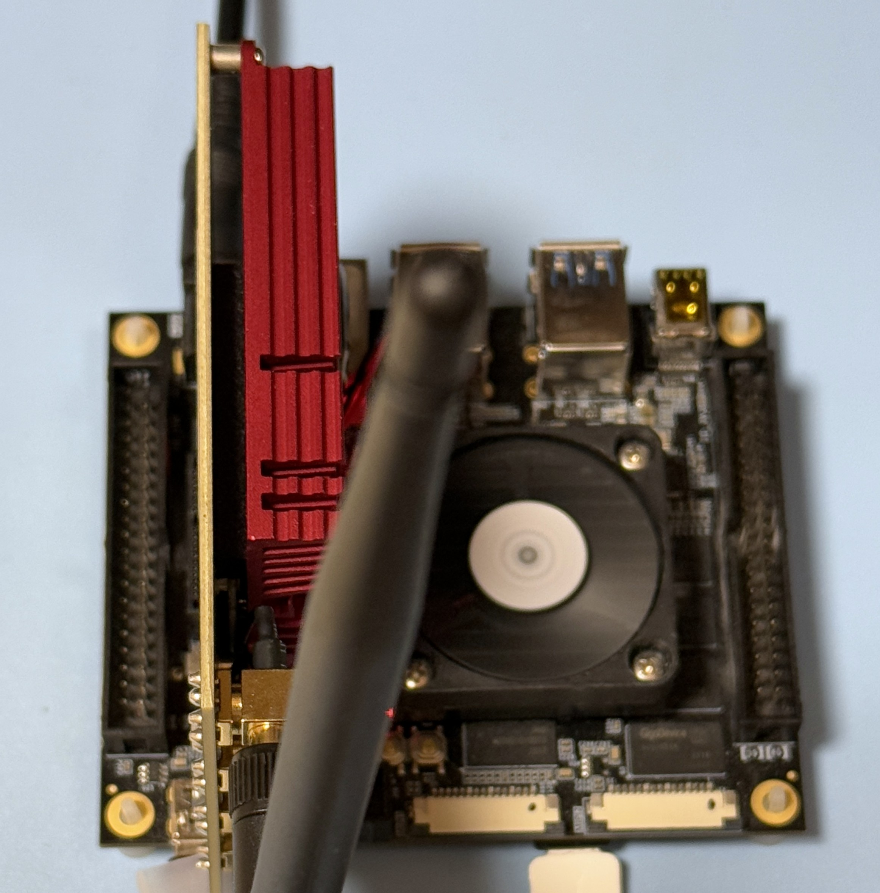
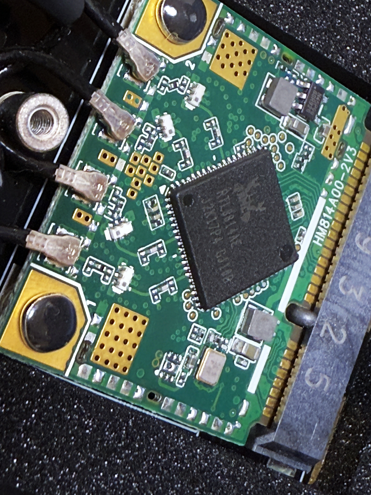
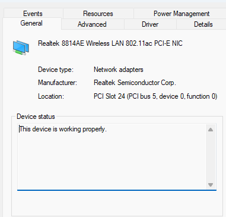
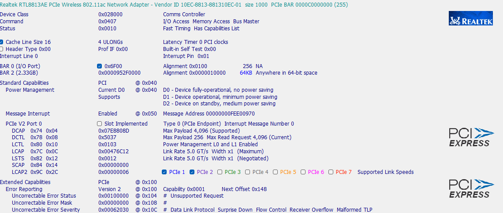
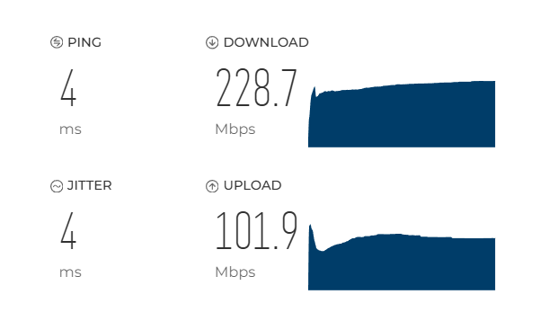

# RTL8814AE PCIe Card Testing

### Test PCIe Gear

|Test Board|PCIe Card HW|
|-|-|
|||

```
5.4.0

DISTRIB_ID=Ubuntu
DISTRIB_RELEASE=18.04
DISTRIB_CODENAME=bionic
DISTRIB_DESCRIPTION="Ubuntu 18.04.6 LTS"

Architecture:        aarch64
Byte Order:          Little Endian
CPU(s):              2
On-line CPU(s) list: 0,1
Thread(s) per core:  1
Core(s) per socket:  2
Socket(s):           1
Vendor ID:           ARM
Model:               4
Model name:          Cortex-A53
Stepping:            r0p4
CPU max MHz:         1199.9990
CPU min MHz:         299.9990
BogoMIPS:            66.66
Flags:               fp asimd aes pmull sha1 sha2 crc32 cpuid
```

### PCIe Tree

```
01:00.0 Network controller: Realtek Semiconductor Co., Ltd. RTL8813AE 802.11ac PCIe Wireless Network Adapter (rev 01)
	Subsystem: Realtek Semiconductor Co., Ltd. RTL8813AE 802.11ac PCIe Wireless Network Adapter
	Control: I/O- Mem+ BusMaster+ SpecCycle- MemWINV- VGASnoop- ParErr- Stepping- SERR- FastB2B- DisINTx+
	Status: Cap+ 66MHz- UDF- FastB2B- ParErr- DEVSEL=fast >TAbort- <TAbort- <MAbort- >SERR- <PERR- INTx-
	Latency: 0
	Interrupt: pin A routed to IRQ 50
	Region 0: I/O ports at <unassigned> [disabled]
	Region 2: Memory at e0000000 (64-bit, non-prefetchable) [size=64K]
	Capabilities: [40] Power Management version 3
		Flags: PMEClk- DSI- D1+ D2+ AuxCurrent=375mA PME(D0+,D1+,D2+,D3hot+,D3cold+)
		Status: D0 NoSoftRst+ PME-Enable- DSel=0 DScale=0 PME-
	Capabilities: [50] MSI: Enable+ Count=1/1 Maskable- 64bit+
		Address: 00000000fd480000  Data: 0000
	Capabilities: [70] Express (v2) Endpoint, MSI 00
		DevCap:	MaxPayload 4096 bytes, PhantFunc 1, Latency L0s <256ns, L1 <1us
			ExtTag- AttnBtn- AttnInd- PwrInd- RBE+ FLReset- SlotPowerLimit 0.000W
		DevCtl:	Report errors: Correctable- Non-Fatal- Fatal- Unsupported-
			RlxdOrd+ ExtTag- PhantFunc- AuxPwr- NoSnoop-
			MaxPayload 128 bytes, MaxReadReq 512 bytes
		DevSta:	CorrErr+ UncorrErr- FatalErr+ UnsuppReq- AuxPwr+ TransPend-
		LnkCap:	Port #0, Speed 5GT/s, Width x1, ASPM L0s L1, Exit Latency L0s <4us, L1 <64us
			ClockPM+ Surprise- LLActRep- BwNot- ASPMOptComp+
		LnkCtl:	ASPM Disabled; RCB 64 bytes Disabled- CommClk-
			ExtSynch- ClockPM- AutWidDis- BWInt- AutBWInt-
		LnkSta:	Speed 5GT/s, Width x1, TrErr- Train- SlotClk- DLActive- BWMgmt- ABWMgmt-
		DevCap2: Completion Timeout: Not Supported, TimeoutDis+, LTR+, OBFF Via message/WAKE#
		DevCtl2: Completion Timeout: 50us to 50ms, TimeoutDis-, LTR-, OBFF Disabled
		LnkCtl2: Target Link Speed: 5GT/s, EnterCompliance- SpeedDis-
			 Transmit Margin: Normal Operating Range, EnterModifiedCompliance- ComplianceSOS-
			 Compliance De-emphasis: -6dB
		LnkSta2: Current De-emphasis Level: -6dB, EqualizationComplete-, EqualizationPhase1-
			 EqualizationPhase2-, EqualizationPhase3-, LinkEqualizationRequest-
	Capabilities: [100 v2] Advanced Error Reporting
		UESta:	DLP- SDES- TLP- FCP- CmpltTO- CmpltAbrt- UnxCmplt- RxOF- MalfTLP- ECRC- UnsupReq- ACSViol-
		UEMsk:	DLP- SDES- TLP- FCP- CmpltTO- CmpltAbrt- UnxCmplt- RxOF- MalfTLP- ECRC- UnsupReq- ACSViol-
		UESvrt:	DLP+ SDES+ TLP- FCP+ CmpltTO- CmpltAbrt- UnxCmplt- RxOF+ MalfTLP+ ECRC- UnsupReq- ACSViol-
		CESta:	RxErr+ BadTLP- BadDLLP- Rollover- Timeout- NonFatalErr-
		CEMsk:	RxErr- BadTLP- BadDLLP- Rollover- Timeout- NonFatalErr+
		AERCap:	First Error Pointer: 00, GenCap+ CGenEn- ChkCap+ ChkEn-
	Capabilities: [148 v1] Device Serial Number 00-e0-4c-ff-fe-88-13-01
	Capabilities: [158 v1] Latency Tolerance Reporting
		Max snoop latency: 0ns
		Max no snoop latency: 0ns
	Capabilities: [160 v1] L1 PM Substates
		L1SubCap: PCI-PM_L1.2+ PCI-PM_L1.1+ ASPM_L1.2+ ASPM_L1.1+ L1_PM_Substates+
			  PortCommonModeRestoreTime=150us PortTPowerOnTime=150us
		L1SubCtl1: PCI-PM_L1.2- PCI-PM_L1.1- ASPM_L1.2- ASPM_L1.1-
			   T_CommonMode=0us LTR1.2_Threshold=0ns
		L1SubCtl2: T_PwrOn=10us
	Kernel driver in use: rtw_8814ae

[  107.585072] rtw_core: loading out-of-tree module taints kernel.
[  107.776671] rtw_8814ae 0000:01:00.0: enabling device (0000 -> 0002)
[  107.795589] rtw_8814ae 0000:01:00.0: Firmware version 33.6.0, H2C version 6
[  107.804839] rtw_8814ae 0000:01:00.0: hw cap: hci=0x00, bw=0x07, ptcl=0x03, ant_num=0, nss=3
```

### Driver Load

The driver is loaded via "insmod"

```
Module                  Size  Used by
rtw_8814ae             16384  0
rtw_8814a             233472  1 rtw_8814ae
rtw_pci                32768  1 rtw_8814ae
rtw_core              208896  2 rtw_8814a,rtw_pci

01:00.0 Network controller: Realtek Semiconductor Co., Ltd. RTL8813AE 802.11ac PCIe Wireless Network Adapter (rev 01)
	Subsystem: Realtek Semiconductor Co., Ltd. RTL8813AE 802.11ac PCIe Wireless Network Adapter
	Control: I/O- Mem+ BusMaster+ SpecCycle- MemWINV- VGASnoop- ParErr- Stepping- SERR- FastB2B- DisINTx+
	Status: Cap+ 66MHz- UDF- FastB2B- ParErr- DEVSEL=fast >TAbort- <TAbort- <MAbort- >SERR- <PERR- INTx-
	Latency: 0
	Interrupt: pin A routed to IRQ 50
	Region 0: I/O ports at <unassigned> [disabled]
	Region 2: Memory at e0000000 (64-bit, non-prefetchable) [size=64K]
	Capabilities: [40] Power Management version 3
		Flags: PMEClk- DSI- D1+ D2+ AuxCurrent=375mA PME(D0+,D1+,D2+,D3hot+,D3cold+)
		Status: D0 NoSoftRst+ PME-Enable- DSel=0 DScale=0 PME-
	Capabilities: [50] MSI: Enable+ Count=1/1 Maskable- 64bit+
		Address: 00000000fd480000  Data: 0000
	Capabilities: [70] Express (v2) Endpoint, MSI 00
		DevCap:	MaxPayload 4096 bytes, PhantFunc 1, Latency L0s <256ns, L1 <1us
			ExtTag- AttnBtn- AttnInd- PwrInd- RBE+ FLReset- SlotPowerLimit 0.000W
		DevCtl:	Report errors: Correctable- Non-Fatal- Fatal- Unsupported-
			RlxdOrd+ ExtTag- PhantFunc- AuxPwr- NoSnoop-
			MaxPayload 128 bytes, MaxReadReq 512 bytes
		DevSta:	CorrErr+ UncorrErr- FatalErr+ UnsuppReq- AuxPwr+ TransPend-
		LnkCap:	Port #0, Speed 5GT/s, Width x1, ASPM L0s L1, Exit Latency L0s <4us, L1 <64us
			ClockPM+ Surprise- LLActRep- BwNot- ASPMOptComp+
		LnkCtl:	ASPM Disabled; RCB 64 bytes Disabled- CommClk-
			ExtSynch- ClockPM- AutWidDis- BWInt- AutBWInt-
		LnkSta:	Speed 5GT/s, Width x1, TrErr- Train- SlotClk- DLActive- BWMgmt- ABWMgmt-
		DevCap2: Completion Timeout: Not Supported, TimeoutDis+, LTR+, OBFF Via message/WAKE#
		DevCtl2: Completion Timeout: 50us to 50ms, TimeoutDis-, LTR-, OBFF Disabled
		LnkCtl2: Target Link Speed: 5GT/s, EnterCompliance- SpeedDis-
			 Transmit Margin: Normal Operating Range, EnterModifiedCompliance- ComplianceSOS-
			 Compliance De-emphasis: -6dB
		LnkSta2: Current De-emphasis Level: -6dB, EqualizationComplete-, EqualizationPhase1-
			 EqualizationPhase2-, EqualizationPhase3-, LinkEqualizationRequest-
	Capabilities: [100 v2] Advanced Error Reporting
		UESta:	DLP- SDES- TLP- FCP- CmpltTO- CmpltAbrt- UnxCmplt- RxOF- MalfTLP- ECRC- UnsupReq- ACSViol-
		UEMsk:	DLP- SDES- TLP- FCP- CmpltTO- CmpltAbrt- UnxCmplt- RxOF- MalfTLP- ECRC- UnsupReq- ACSViol-
		UESvrt:	DLP+ SDES+ TLP- FCP+ CmpltTO- CmpltAbrt- UnxCmplt- RxOF+ MalfTLP+ ECRC- UnsupReq- ACSViol-
		CESta:	RxErr+ BadTLP- BadDLLP- Rollover- Timeout- NonFatalErr-
		CEMsk:	RxErr- BadTLP- BadDLLP- Rollover- Timeout- NonFatalErr+
		AERCap:	First Error Pointer: 00, GenCap+ CGenEn- ChkCap+ ChkEn-
	Capabilities: [148 v1] Device Serial Number 00-e0-4c-ff-fe-88-13-01
	Capabilities: [158 v1] Latency Tolerance Reporting
		Max snoop latency: 0ns
		Max no snoop latency: 0ns
	Capabilities: [160 v1] L1 PM Substates
		L1SubCap: PCI-PM_L1.2+ PCI-PM_L1.1+ ASPM_L1.2+ ASPM_L1.1+ L1_PM_Substates+
			  PortCommonModeRestoreTime=150us PortTPowerOnTime=150us
		L1SubCtl1: PCI-PM_L1.2- PCI-PM_L1.1- ASPM_L1.2- ASPM_L1.1-
			   T_CommonMode=0us LTR1.2_Threshold=0ns
		L1SubCtl2: T_PwrOn=10us
	Kernel driver in use: rtw_8814ae

[  107.585072] rtw_core: loading out-of-tree module taints kernel.
[  107.776671] rtw_8814ae 0000:01:00.0: enabling device (0000 -> 0002)
[  107.795589] rtw_8814ae 0000:01:00.0: Firmware version 33.6.0, H2C version 6
[  107.804839] rtw_8814ae 0000:01:00.0: hw cap: hci=0x00, bw=0x07, ptcl=0x03, ant_num=0, nss=3
```

### iw list

<details>

<summary>iw list</summary>

```
Wiphy phy0
	max # scan SSIDs: 4
	max scan IEs length: 2243 bytes
	max # sched scan SSIDs: 0
	max # match sets: 0
	max # scan plans: 1
	max scan plan interval: -1
	max scan plan iterations: 0
	Retry short limit: 7
	Retry long limit: 4
	Coverage class: 0 (up to 0m)
	Device supports T-DLS.
	Supported Ciphers:
		* WEP40 (00-0f-ac:1)
		* WEP104 (00-0f-ac:5)
		* TKIP (00-0f-ac:2)
		* CCMP-128 (00-0f-ac:4)
		* CCMP-256 (00-0f-ac:10)
		* GCMP-128 (00-0f-ac:8)
		* GCMP-256 (00-0f-ac:9)
		* CMAC (00-0f-ac:6)
		* CMAC-256 (00-0f-ac:13)
		* GMAC-128 (00-0f-ac:11)
		* GMAC-256 (00-0f-ac:12)
	Available Antennas: TX 0x7 RX 0x7
	Configured Antennas: TX 0x7 RX 0x7
	Supported interface modes:
		 * IBSS
		 * managed
		 * AP
		 * AP/VLAN
		 * monitor
		 * P2P-client
		 * P2P-GO
	Band 1:
		Capabilities: 0x196f
			RX LDPC
			HT20/HT40
			SM Power Save disabled
			RX HT20 SGI
			RX HT40 SGI
			RX STBC 1-stream
			Max AMSDU length: 7935 bytes
			DSSS/CCK HT40
		Maximum RX AMPDU length 65535 bytes (exponent: 0x003)
		Minimum RX AMPDU time spacing: 2 usec (0x04)
		HT Max RX data rate: 450 Mbps
		HT TX/RX MCS rate indexes supported: 0-23, 32
		Bitrates (non-HT):
			* 1.0 Mbps
			* 2.0 Mbps
			* 5.5 Mbps
			* 11.0 Mbps
			* 6.0 Mbps
			* 9.0 Mbps
			* 12.0 Mbps
			* 18.0 Mbps
			* 24.0 Mbps
			* 36.0 Mbps
			* 48.0 Mbps
			* 54.0 Mbps
		Frequencies:
			* 2412 MHz [1] (20.0 dBm)
			* 2417 MHz [2] (20.0 dBm)
			* 2422 MHz [3] (20.0 dBm)
			* 2427 MHz [4] (20.0 dBm)
			* 2432 MHz [5] (20.0 dBm)
			* 2437 MHz [6] (20.0 dBm)
			* 2442 MHz [7] (20.0 dBm)
			* 2447 MHz [8] (20.0 dBm)
			* 2452 MHz [9] (20.0 dBm)
			* 2457 MHz [10] (20.0 dBm)
			* 2462 MHz [11] (20.0 dBm)
			* 2467 MHz [12] (20.0 dBm) (no IR)
			* 2472 MHz [13] (20.0 dBm) (no IR)
			* 2484 MHz [14] (20.0 dBm) (no IR)
	Band 2:
		Capabilities: 0x196f
			RX LDPC
			HT20/HT40
			SM Power Save disabled
			RX HT20 SGI
			RX HT40 SGI
			RX STBC 1-stream
			Max AMSDU length: 7935 bytes
			DSSS/CCK HT40
		Maximum RX AMPDU length 65535 bytes (exponent: 0x003)
		Minimum RX AMPDU time spacing: 2 usec (0x04)
		HT Max RX data rate: 450 Mbps
		HT TX/RX MCS rate indexes supported: 0-23, 32
		VHT Capabilities (0x03d071b2):
			Max MPDU length: 11454
			Supported Channel Width: neither 160 nor 80+80
			RX LDPC
			short GI (80 MHz)
			TX STBC
			SU Beamformee
			MU Beamformee
			+HTC-VHT
		VHT RX MCS set:
			1 streams: MCS 0-9
			2 streams: MCS 0-9
			3 streams: MCS 0-9
			4 streams: not supported
			5 streams: not supported
			6 streams: not supported
			7 streams: not supported
			8 streams: not supported
		VHT RX highest supported: 1170 Mbps
		VHT TX MCS set:
			1 streams: MCS 0-9
			2 streams: MCS 0-9
			3 streams: MCS 0-9
			4 streams: not supported
			5 streams: not supported
			6 streams: not supported
			7 streams: not supported
			8 streams: not supported
		VHT TX highest supported: 1170 Mbps
		Bitrates (non-HT):
			* 6.0 Mbps
			* 9.0 Mbps
			* 12.0 Mbps
			* 18.0 Mbps
			* 24.0 Mbps
			* 36.0 Mbps
			* 48.0 Mbps
			* 54.0 Mbps
		Frequencies:
			* 5180 MHz [36] (20.0 dBm) (no IR)
			* 5200 MHz [40] (20.0 dBm) (no IR)
			* 5220 MHz [44] (20.0 dBm) (no IR)
			* 5240 MHz [48] (20.0 dBm) (no IR)
			* 5260 MHz [52] (20.0 dBm) (no IR, radar detection)
			* 5280 MHz [56] (20.0 dBm) (no IR, radar detection)
			* 5300 MHz [60] (20.0 dBm) (no IR, radar detection)
			* 5320 MHz [64] (20.0 dBm) (no IR, radar detection)
			* 5500 MHz [100] (20.0 dBm) (no IR, radar detection)
			* 5520 MHz [104] (20.0 dBm) (no IR, radar detection)
			* 5540 MHz [108] (20.0 dBm) (no IR, radar detection)
			* 5560 MHz [112] (20.0 dBm) (no IR, radar detection)
			* 5580 MHz [116] (20.0 dBm) (no IR, radar detection)
			* 5600 MHz [120] (20.0 dBm) (no IR, radar detection)
			* 5620 MHz [124] (20.0 dBm) (no IR, radar detection)
			* 5640 MHz [128] (20.0 dBm) (no IR, radar detection)
			* 5660 MHz [132] (20.0 dBm) (no IR, radar detection)
			* 5680 MHz [136] (20.0 dBm) (no IR, radar detection)
			* 5700 MHz [140] (20.0 dBm) (no IR, radar detection)
			* 5720 MHz [144] (20.0 dBm) (no IR, radar detection)
			* 5745 MHz [149] (20.0 dBm) (no IR)
			* 5765 MHz [153] (20.0 dBm) (no IR)
			* 5785 MHz [157] (20.0 dBm) (no IR)
			* 5805 MHz [161] (20.0 dBm) (no IR)
			* 5825 MHz [165] (20.0 dBm) (no IR)
	Supported commands:
		 * new_interface
		 * set_interface
		 * new_key
		 * start_ap
		 * new_station
		 * set_bss
		 * authenticate
		 * associate
		 * deauthenticate
		 * disassociate
		 * join_ibss
		 * set_tx_bitrate_mask
		 * frame
		 * frame_wait_cancel
		 * set_wiphy_netns
		 * set_channel
		 * set_wds_peer
		 * tdls_mgmt
		 * tdls_oper
		 * probe_client
		 * set_noack_map
		 * register_beacons
		 * start_p2p_device
		 * set_mcast_rate
		 * testmode
		 * connect
		 * disconnect
		 * set_qos_map
		 * set_multicast_to_unicast
	Supported TX frame types:
		 * IBSS: 0x00 0x10 0x20 0x30 0x40 0x50 0x60 0x70 0x80 0x90 0xa0 0xb0 0xc0 0xd0 0xe0 0xf0
		 * managed: 0x00 0x10 0x20 0x30 0x40 0x50 0x60 0x70 0x80 0x90 0xa0 0xb0 0xc0 0xd0 0xe0 0xf0
		 * AP: 0x00 0x10 0x20 0x30 0x40 0x50 0x60 0x70 0x80 0x90 0xa0 0xb0 0xc0 0xd0 0xe0 0xf0
		 * AP/VLAN: 0x00 0x10 0x20 0x30 0x40 0x50 0x60 0x70 0x80 0x90 0xa0 0xb0 0xc0 0xd0 0xe0 0xf0
		 * mesh point: 0x00 0x10 0x20 0x30 0x40 0x50 0x60 0x70 0x80 0x90 0xa0 0xb0 0xc0 0xd0 0xe0 0xf0
		 * P2P-client: 0x00 0x10 0x20 0x30 0x40 0x50 0x60 0x70 0x80 0x90 0xa0 0xb0 0xc0 0xd0 0xe0 0xf0
		 * P2P-GO: 0x00 0x10 0x20 0x30 0x40 0x50 0x60 0x70 0x80 0x90 0xa0 0xb0 0xc0 0xd0 0xe0 0xf0
		 * P2P-device: 0x00 0x10 0x20 0x30 0x40 0x50 0x60 0x70 0x80 0x90 0xa0 0xb0 0xc0 0xd0 0xe0 0xf0
	Supported RX frame types:
		 * IBSS: 0x40 0xb0 0xc0 0xd0
		 * managed: 0x40 0xd0
		 * AP: 0x00 0x20 0x40 0xa0 0xb0 0xc0 0xd0
		 * AP/VLAN: 0x00 0x20 0x40 0xa0 0xb0 0xc0 0xd0
		 * mesh point: 0xb0 0xc0 0xd0
		 * P2P-client: 0x40 0xd0
		 * P2P-GO: 0x00 0x20 0x40 0xa0 0xb0 0xc0 0xd0
		 * P2P-device: 0x40 0xd0
	software interface modes (can always be added):
		 * AP/VLAN
		 * monitor
	valid interface combinations:
		 * #{ managed } <= 1, #{ AP, P2P-client, P2P-GO } <= 1,
		   total <= 2, #channels <= 1
	HT Capability overrides:
		 * MCS: ff ff ff ff ff ff ff ff ff ff
		 * maximum A-MSDU length
		 * supported channel width
		 * short GI for 40 MHz
		 * max A-MPDU length exponent
		 * min MPDU start spacing
	Device supports TX status socket option.
	Device supports HT-IBSS.
	Device supports SAE with AUTHENTICATE command
	Device supports scan flush.
	Device supports per-vif TX power setting
	Driver supports full state transitions for AP/GO clients
	Driver supports a userspace MPM
	Device supports configuring vdev MAC-addr on create.
```

</details>

### Additional Windows 11 OS debug

On Windows 11 with v2023.79.0619.2018 for RTL8814AE and Windows 10 64bit

||||
|-|-|-|
|X64|||
|Net|||

### Network Manager - Band 2.4

```
wlan0: flags=4099<UP,BROADCAST,MULTICAST>  mtu 1500
        ether e8:4e:06:78:86:6b  txqueuelen 1000  (Ethernet)
        TX packets 0  bytes 0 (0.0 B)
        TX errors 0  dropped 0 overruns 0  carrier 0  collisions 0
```

### iwconfig 2.4

```
wlan0     IEEE 802.11  ESSID:off/any  
          Mode:Managed  Access Point: Not-Associated   Tx-Power=20 dBm   
          Retry short limit:7   RTS thr:off   Fragment thr:off
          Encryption key:off
          Power Management:on
          
```

### Network Speed Test via Ookla - Band 2.4

```
```
