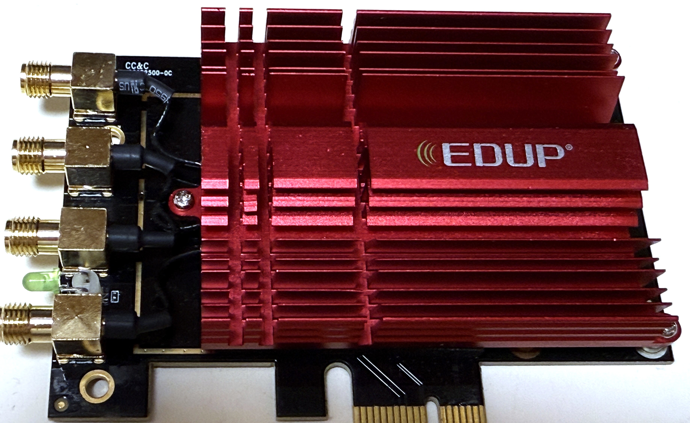
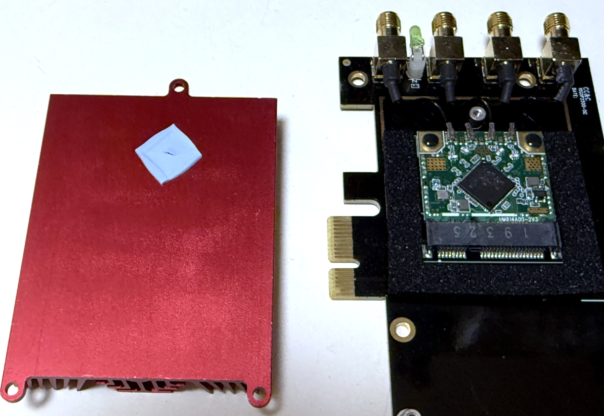
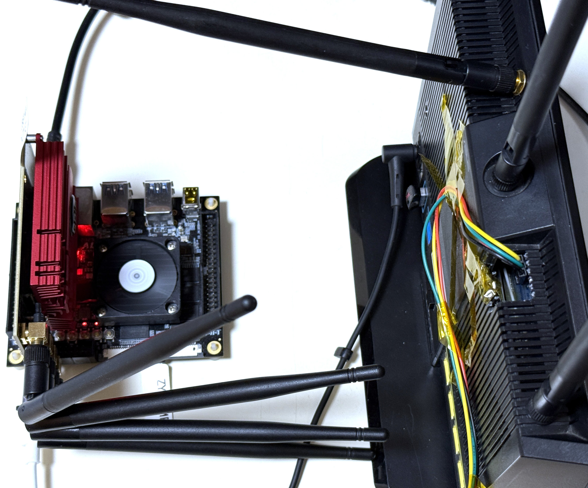
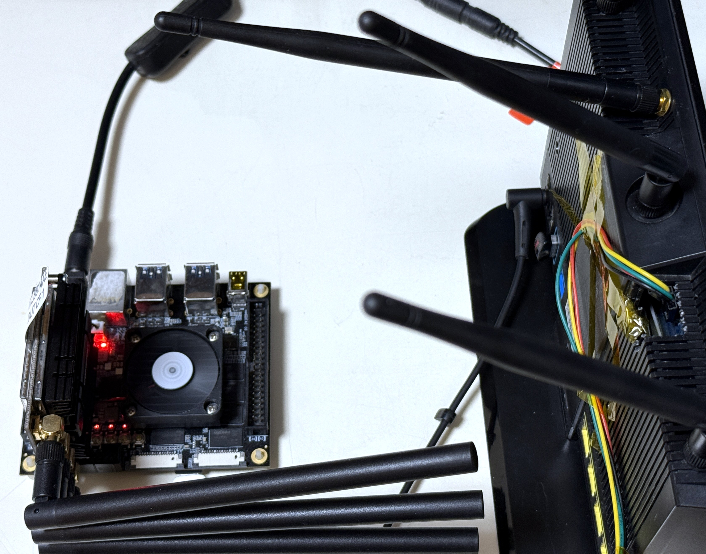

# RTL8814AE PCIe Card Testing

### Test Index

Remarks: The GRIS card and EDUP actually just a branding which uses the same card BOM.

!! Inside the GRIS and EDUP is a mini-PCIe card !!

1. [Hardware Setups](#0)
2. [DUT Testbed Hardware Infos](#1)
3. [Router Hardware Infos](#2)
4. [Router <-> GRIS PCIe Card Test](#3)
5. [Router <-> COMFAST-DUT1 PCIe Card Test](#4)
6. [Router <-> EDUP PCIe Card Test](#5)

#### Some EDUP HW Images

| IMG 1 | IMG 2 |
|-|-|
|||

### Setup <a name="0"></a>

|Group #|Setup|
|-|-|
| ASUS RT-AC86U + GRIS ||
| ASUS RT-AC86U + COMFAST-DUT1 ||
| ASUS RT-AC86U + EDUP ||

### DUT <a name="1"></a>

```
5.4.0

DISTRIB_ID=Ubuntu
DISTRIB_RELEASE=18.04
DISTRIB_CODENAME=bionic
DISTRIB_DESCRIPTION="Ubuntu 18.04.6 LTS"

Architecture:        aarch64
Byte Order:          Little Endian
CPU(s):              2
On-line CPU(s) list: 0,1
Thread(s) per core:  1
Core(s) per socket:  2
Socket(s):           1
Vendor ID:           ARM
Model:               4
Model name:          Cortex-A53
Stepping:            r0p4
CPU max MHz:         1199.9990
CPU min MHz:         299.9990
BogoMIPS:            66.66
Flags:               fp asimd aes pmull sha1 sha2 crc32 cpuid
```

### Router - RT-AC86U-9C98 <a name="2"></a>

```
Linux RT-AC86U-9C98 4.1.27 #2 SMP PREEMPT aarch64 ASUSWRT-Merlin


processor       : 0
BogoMIPS        : 100.00
Features        : fp asimd evtstrm aes pmull sha1 sha2 crc32
CPU implementer : 0x42
CPU architecture: 8
CPU variant     : 0x0
CPU part        : 0x100
CPU revision    : 0

processor       : 1
BogoMIPS        : 100.00
Features        : fp asimd evtstrm aes pmull sha1 sha2 crc32
CPU implementer : 0x42
CPU architecture: 8
CPU variant     : 0x0
CPU part        : 0x100
CPU revision    : 0


Linux version 4.1.27 (merlin@ubuntu-dev) (gcc version 5.3.0 (Buildroot 2016.02) )
```

### PCIe Card eFUSE <a name="3"></a>

#### GRIS eFUSE

```
[   24.570935] 00000000: 29 81 01 94 0d 0c 18 00 00 00 00 08 08 01 02 00  )...............
[   24.570940] 00000010: 1f 1f 1f 20 20 20 20 20 20 21 21 f3 ee ee ee ee  ...      !!.....
[   24.570944] 00000020: ee ee 24 24 24 24 24 24 24 24 24 23 23 23 23 23  ..$$$$$$$$$#####
[   24.570947] 00000030: f1 ee ee ee ee ee 20 ee ee ee 20 20 20 20 20 20  ...... ...
[   24.570951] 00000040: 21 21 21 21 21 f2 ee ee ee ee ee ee 23 23 23 23  !!!!!.......####
[   24.570954] 00000050: 24 24 24 24 24 23 23 23 23 23 f1 ee ee ee ee ff  $$$$$#####......
[   24.570958] 00000060: 20 ee ee ee 1f 1f 1f 1e 1e 1e 20 20 1f 1e 1e f3   .........  ....
[   24.570961] 00000070: ee ee ee ee ee ee 22 22 22 22 23 23 23 23 23 23  ......""""######
[   24.570965] 00000080: 23 23 23 23 f1 ee ee ee ee ee 20 ee ee ee 1f 1f  ####...... .....
[   24.570968] 00000090: 1f 1f 1f 1f 20 20 1f 1f 1f f4 ee ee ee ee ee ee  ....  ..........
[   24.570972] 000000a0: 23 23 23 23 24 24 24 24 24 22 22 22 22 22 f1 ee  ####$$$$$"""""..
[   24.570975] 000000b0: ee ee ee ee 20 ee ee ee 7f 1f ff 00 ff ff ff ff  .... ...........
[   24.570979] 000000c0: ff 01 00 00 00 00 00 00 00 ff 00 ff ff ff ff ff  ................
[   24.570982] 000000d0: e8 4e 06 78 86 6b ec 10 13 88 ec 10 13 88 c3 ff  .N.x.k..........
[   24.570985] 000000e0: 8d 80 ff ff ff ff ff ff ff ff ff ff ff ff ff ff  ................
[   24.570989] 000000f0: ff ff ff ff ff ff ff ff ff ff ff ff ff ff ff ff  ................
[   24.570992] 00000100: ff ff ff ff ff ff ff ff ff ff ff ff ff ff ff ff  ................
[   24.570996] 00000110: ff ff ff ff ff ff ff ff ff ff ff ff ff ff ff ff  ................
[   24.570999] 00000120: ff ff ff ff ff ff ff ff ff ff ff ff ff ff ff ff  ................
[   24.571002] 00000130: ff ff ff ff ff ff ff ff ff ff ff ff ff ff ff ff  ................
[   24.571006] 00000140: 67 4f ff ff ff ff ff ff ff ff ff ff ff ff ff ff  gO..............
[   24.571009] 00000150: ff ff ff ff ff ff ff ff ff ff ff ff ff ff ff ff  ................
[   24.571012] 00000160: ff ff ff ff ff ff ff ff ff ff ff ff ff ff ff ff  ................
[   24.571016] 00000170: ff ff ff ff ff ff ff ff ff 88 f5 30 ff ff ff ff  ...........0....
[   24.571019] 00000180: ff ff 4f 16 ff ff ff ff ff ff ff ff ff ff ff ff  ..O.............
[   24.571022] 00000190: ff ff ff ff ff ff ff ff ff ff ff ff ff ff ff ff  ................
[   24.571026] 000001a0: ff ff ff ff ff ff ff ff ff ff ff ff ff ff ff ff  ................
[   24.571029] 000001b0: ff ff ff ff ff ff ff ff ff ff ff ff ff ff ff ff  ................
[   24.571033] 000001c0: ff ff ff ff ff ff ff ff ff ff ff ff ff ff ff ff  ................
[   24.571036] 000001d0: ff ff ff ff ff ff ff ff ff ff ff ff ff ff ff ff  ................
[   24.571039] 000001e0: ff ff ff ff ff ff ff ff ff ff ff ff ff ff ff ff  ................
[   24.571043] 000001f0: ff ff ff ff ff ff ff ff ff ff ff ff ff ff ff ff  ................
```

#### COMFAST eFUSE - DUT 1

```
[   45.895111] 00000000: 29 81 01 94 0d 0c 18 00 00 00 00 08 08 01 02 00  )...............
[   45.895115] 00000010: 28 28 28 28 28 28 28 28 28 28 28 00 ee ee ee ee  (((((((((((.....
[   45.895119] 00000020: ee ee 28 28 28 28 28 28 28 28 28 28 28 28 28 28  ..((((((((((((((
[   45.895123] 00000030: 00 ee ee ee ee ee 00 ee ee ee 28 29 29 2a 2a 2a  ..........())***
[   45.895126] 00000040: 27 27 27 28 28 f0 ee ee ee ee ee ee 28 28 28 27  '''((.......((('
[   45.895130] 00000050: 2b 2a 29 29 2b 28 26 26 26 26 11 ee ee ee ee ff  +*))+(&&&&......
[   45.895133] 00000060: c0 ee ee ee 27 26 26 26 26 26 25 25 25 25 25 f0  ....'&&&&&%%%%%.
[   45.895137] 00000070: ee ee ee ee ee ee 28 28 29 29 2c 2a 2a 2b 2c 29  ......(()),**+,)
[   45.895140] 00000080: 29 2a 29 28 01 ee ee ee ee ee c0 ee ee ee 2d 2d  )*)(..........--
[   45.895144] 00000090: 2d 2e 2e 2e 2a 2a 2b 2c 2c f1 ee ee ee ee ee ee  -...**+,,.......
[   45.895147] 000000a0: 2a 2b 2c 2c 2e 2c 2d 2e 2f 2d 2c 2e 2d 2a 11 ee  *+,,.,-./-,.-*..
[   45.895150] 000000b0: ee ee ee ee d0 ee ee ee 26 1f 1f 00 00 00 00 00  ........&.......
[   45.895154] 000000c0: 00 01 00 00 00 00 00 00 00 ff 00 ff ff ff ff ff  ................
[   45.895157] 000000d0: 34 21 09 4e 06 5a ec 10 13 88 ec 10 13 88 c3 ff  4!.N.Z..........
[   45.895161] 000000e0: 8d 80 ff ff ff ff ff ff ff ff ff ff ff ff ff ff  ................
[   45.895164] 000000f0: ff ff ff ff ff ff ff ff ff ff ff ff ff ff ff ff  ................
[   45.895168] 00000100: ff ff ff ff ff ff ff ff ff ff ff ff ff ff ff ff  ................
[   45.895171] 00000110: ff ff ff ff ff ff ff ff ff ff ff ff ff ff ff ff  ................
[   45.895174] 00000120: ff ff ff ff ff ff ff ff ff ff ff ff ff ff ff ff  ................
[   45.895178] 00000130: ff ff ff ff ff ff ff ff ff ff ff ff ff ff ff ff  ................
[   45.895181] 00000140: 67 4f ff ff ff ff ff ff ff ff ff ff ff ff ff ff  gO..............
[   45.895184] 00000150: ff ff ff ff ff ff ff ff ff ff ff ff ff ff ff ff  ................
[   45.895188] 00000160: ff ff ff ff ff ff ff ff ff ff ff ff ff ff ff ff  ................
[   45.895191] 00000170: ff ff ff ff ff ff ff ff ff 88 f5 30 ff ff ff ff  ...........0....
[   45.895194] 00000180: ff ff 4f 16 ff ff ff ff ff ff ff ff ff ff ff ff  ..O.............
[   45.895198] 00000190: ff ff ff ff ff ff ff ff ff ff ff ff ff ff ff ff  ................
[   45.895201] 000001a0: ff ff ff ff ff ff ff ff ff ff ff ff ff ff ff ff  ................
[   45.895205] 000001b0: ff ff ff ff ff ff ff ff ff ff ff ff ff ff ff ff  ................
[   45.895208] 000001c0: ff ff ff ff ff ff ff ff ff ff ff ff ff ff ff ff  ................
[   45.895211] 000001d0: ff ff ff ff ff ff ff ff ff ff ff ff ff ff ff ff  ................
[   45.895215] 000001e0: ff ff ff ff ff ff ff ff ff ff ff ff ff ff ff ff  ................
[   45.895218] 000001f0: ff ff ff ff ff ff ff ff ff ff ff ff ff ff ff ff  ................
```

#### EDUP eFUSE

```
[   21.398551] 00000000: 29 81 01 94 0d 0c 18 00 00 00 00 08 08 01 02 00  )...............
[   21.398556] 00000010: 1f 1f 1f 20 20 20 20 20 20 21 21 f3 ee ee ee ee  ...      !!.....
[   21.398560] 00000020: ee ee 24 24 24 24 23 23 23 23 23 22 22 22 22 22  ..$$$$#####"""""
[   21.398564] 00000030: f1 ee ee ee ee ee 20 ee ee ee 1e 1e 1e 1e 1e 1e  ...... .........
[   21.398567] 00000040: 1f 1f 1f 1f 1f f3 ee ee ee ee ee ee 24 24 24 24  ............$$$$
[   21.398570] 00000050: 23 23 23 23 23 22 22 22 22 22 f1 ee ee ee ee ff  #####"""""......
[   21.398574] 00000060: 20 ee ee ee 1f 1f 1f 1e 1e 1e 20 20 1f 1f 1f 04   .........  ....
[   21.398577] 00000070: ee ee ee ee ee ee 23 23 23 23 22 22 22 22 22 22  ......####""""""
[   21.398581] 00000080: 22 22 22 22 02 ee ee ee ee ee 30 ee ee ee 1e 1e  """"......0.....
[   21.398584] 00000090: 1e 1e 1e 1e 1f 1f 1e 1e 1e 04 ee ee ee ee ee ee  ................
[   21.398588] 000000a0: 23 23 23 23 22 22 22 22 22 21 21 21 21 21 02 ee  ####"""""!!!!!..
[   21.398591] 000000b0: ee ee ee ee 30 ee ee ee 7f 20 ff 00 ff ff ff ff  ....0.... ......
[   21.398595] 000000c0: ff 01 00 00 00 00 00 00 00 ff 00 ff ff ff ff ff  ................
[   21.398598] 000000d0: e8 4e 06 78 86 78 ec 10 13 88 ec 10 13 88 c3 ff  .N.x.x..........
[   21.398602] 000000e0: 8d 80 ff ff ff ff ff ff ff ff ff ff ff ff ff ff  ................
[   21.398605] 000000f0: ff ff ff ff ff ff ff ff ff ff ff ff ff ff ff ff  ................
[   21.398608] 00000100: ff ff ff ff ff ff ff ff ff ff ff ff ff ff ff ff  ................
[   21.398612] 00000110: ff ff ff ff ff ff ff ff ff ff ff ff ff ff ff ff  ................
[   21.398615] 00000120: ff ff ff ff ff ff ff ff ff ff ff ff ff ff ff ff  ................
[   21.398619] 00000130: ff ff ff ff ff ff ff ff ff ff ff ff ff ff ff ff  ................
[   21.398622] 00000140: 67 4f ff ff ff ff ff ff ff ff ff ff ff ff ff ff  gO..............
[   21.398625] 00000150: ff ff ff ff ff ff ff ff ff ff ff ff ff ff ff ff  ................
[   21.398629] 00000160: ff ff ff ff ff ff ff ff ff ff ff ff ff ff ff ff  ................
[   21.398632] 00000170: ff ff ff ff ff ff ff ff ff 88 f5 30 ff ff ff ff  ...........0....
[   21.398636] 00000180: ff ff 4f 16 ff ff ff ff ff ff ff ff ff ff ff ff  ..O.............
[   21.398639] 00000190: ff ff ff ff ff ff ff ff ff ff ff ff ff ff ff ff  ................
[   21.398642] 000001a0: ff ff ff ff ff ff ff ff ff ff ff ff ff ff ff ff  ................
[   21.398646] 000001b0: ff ff ff ff ff ff ff ff ff ff ff ff ff ff ff ff  ................
[   21.398649] 000001c0: ff ff ff ff ff ff ff ff ff ff ff ff ff ff ff ff  ................
[   21.398652] 000001d0: ff ff ff ff ff ff ff ff ff ff ff ff ff ff ff ff  ................
[   21.398656] 000001e0: ff ff ff ff ff ff ff ff ff ff ff ff ff ff ff ff  ................
[   21.398659] 000001f0: ff ff ff ff ff ff ff ff ff ff ff ff ff ff ff ff  ................
```

### iperf3 @ GRIS <=> ASUS <a name="4"></a>

#### connection info on DUT side

```
> iw dev wlan0 station dump

Station  (on wlan0)
        inactive time:  28408 ms
        rx bytes:       17136904088
        rx packets:     5728526
        tx bytes:       8219345342
        tx packets:     3754231
        tx retries:     0
        tx failed:      0
        beacon loss:    0
        beacon rx:      17162
        rx drop misc:   0
        signal:         -12 [-12, -20, -12, -12] dBm
        signal avg:     -12 [-12, -19, -12, -12] dBm
        beacon signal avg:      244 dBm
        tx bitrate:     1300.0 MBit/s VHT-MCS 9 80MHz short GI VHT-NSS 3
        rx bitrate:     6.0 MBit/s
        rx duration:    0 us
        authorized:     yes
        authenticated:  yes
        associated:     yes
        preamble:       long
        WMM/WME:        yes
        MFP:            no
        TDLS peer:      no
        DTIM period:    3
        beacon interval:100
        short slot time:yes
        connected time: 1768 seconds
```

<details>

<summary>Router Connect DUT (Test 1)</summary>

```
##### Router

> iperf3 -c 192.168.2.15 -t 30

Connecting to host 192.168.2.15, port 5201
[  5] local 192.168.2.1 port 49076 connected to 192.168.2.15 port 5201
[ ID] Interval           Transfer     Bitrate         Retr  Cwnd
[  5]   0.00-1.02   sec  71.1 MBytes   585 Mbits/sec    0   1.96 MBytes
[  5]   1.02-2.01   sec  81.5 MBytes   690 Mbits/sec    2   1.58 MBytes
[  5]   2.01-3.01   sec  86.6 MBytes   727 Mbits/sec    0   1.72 MBytes
[  5]   3.01-4.01   sec  85.2 MBytes   715 Mbits/sec    0   1.82 MBytes
[  5]   4.01-5.01   sec  86.1 MBytes   723 Mbits/sec    0   1.92 MBytes
[  5]   5.01-6.01   sec  84.5 MBytes   709 Mbits/sec    0   1.98 MBytes
[  5]   6.01-7.02   sec  85.0 MBytes   706 Mbits/sec    2   1.47 MBytes
[  5]   7.02-8.01   sec  87.2 MBytes   739 Mbits/sec    0   1.55 MBytes
[  5]   8.01-9.01   sec  86.2 MBytes   723 Mbits/sec    0   1.61 MBytes
[  5]   9.01-10.02  sec  90.0 MBytes   748 Mbits/sec    0   1.64 MBytes
[  5]  10.02-11.02  sec  84.1 MBytes   706 Mbits/sec    2   1.23 MBytes
[  5]  11.02-12.01  sec  82.0 MBytes   695 Mbits/sec    0   1.30 MBytes
[  5]  12.01-13.01  sec  87.4 MBytes   733 Mbits/sec    0   1.35 MBytes
[  5]  13.01-14.01  sec  83.6 MBytes   701 Mbits/sec    0   1.37 MBytes
[  5]  14.01-15.02  sec  88.5 MBytes   735 Mbits/sec    0   1.39 MBytes
[  5]  15.02-16.02  sec  86.1 MBytes   722 Mbits/sec    0   1.40 MBytes
[  5]  16.02-17.01  sec  85.6 MBytes   725 Mbits/sec    0   1.43 MBytes
[  5]  17.01-18.02  sec  88.9 MBytes   738 Mbits/sec    0   1.46 MBytes
[  5]  18.02-19.02  sec  84.9 MBytes   711 Mbits/sec    0   1.49 MBytes
[  5]  19.02-20.02  sec  89.4 MBytes   751 Mbits/sec    0   1.52 MBytes
[  5]  20.02-21.02  sec  89.6 MBytes   752 Mbits/sec    0   1.56 MBytes
[  5]  21.02-22.02  sec  88.6 MBytes   744 Mbits/sec    0   1.58 MBytes
[  5]  22.02-23.02  sec  89.2 MBytes   749 Mbits/sec    0   1.61 MBytes
[  5]  23.02-24.02  sec  86.8 MBytes   728 Mbits/sec    0   1.63 MBytes
[  5]  24.02-25.01  sec  85.8 MBytes   726 Mbits/sec    0   1.65 MBytes
[  5]  25.01-26.02  sec  90.2 MBytes   749 Mbits/sec    0   1.71 MBytes
[  5]  26.02-27.01  sec  86.8 MBytes   736 Mbits/sec    0   1.83 MBytes
[  5]  27.01-28.02  sec  90.5 MBytes   752 Mbits/sec    0   1.98 MBytes
[  5]  28.02-29.01  sec  90.6 MBytes   768 Mbits/sec    0   2.17 MBytes
[  5]  29.01-30.01  sec  88.5 MBytes   740 Mbits/sec    0   2.39 MBytes
- - - - - - - - - - - - - - - - - - - - - - - - -
[ ID] Interval           Transfer     Bitrate         Retr
[  5]   0.00-30.01  sec  2.53 GBytes   724 Mbits/sec    6             sender
[  5]   0.00-30.01  sec  2.53 GBytes   724 Mbits/sec                  receive

##### GRIS RTL8814AE

> iperf3 -s

-----------------------------------------------------------
Server listening on 5201
-----------------------------------------------------------
Accepted connection from 192.168.2.1, port 49075
[  5] local 192.168.2.15 port 5201 connected to 192.168.2.1 port 49076
[ ID] Interval           Transfer     Bandwidth
[  5]   0.00-1.00   sec  66.7 MBytes   560 Mbits/sec
[  5]   1.00-2.00   sec  82.5 MBytes   692 Mbits/sec
[  5]   2.00-3.00   sec  86.2 MBytes   723 Mbits/sec
[  5]   3.00-4.00   sec  84.6 MBytes   710 Mbits/sec
[  5]   4.00-5.00   sec  87.1 MBytes   731 Mbits/sec
[  5]   5.00-6.00   sec  84.0 MBytes   703 Mbits/sec
[  5]   6.00-7.00   sec  83.8 MBytes   704 Mbits/sec
[  5]   7.00-8.00   sec  88.8 MBytes   745 Mbits/sec
[  5]   8.00-9.00   sec  85.5 MBytes   715 Mbits/sec
[  5]   9.00-10.00  sec  88.8 MBytes   747 Mbits/sec
[  5]  10.00-11.00  sec  84.2 MBytes   706 Mbits/sec
[  5]  11.00-12.00  sec  83.9 MBytes   705 Mbits/sec
[  5]  12.00-13.00  sec  87.0 MBytes   730 Mbits/sec
[  5]  13.00-14.00  sec  83.6 MBytes   701 Mbits/sec
[  5]  14.00-15.00  sec  87.8 MBytes   736 Mbits/sec
[  5]  15.00-16.00  sec  86.2 MBytes   723 Mbits/sec
[  5]  16.00-17.00  sec  86.0 MBytes   721 Mbits/sec
[  5]  17.00-18.00  sec  89.0 MBytes   747 Mbits/sec
[  5]  18.00-19.00  sec  84.6 MBytes   710 Mbits/sec
[  5]  19.00-20.00  sec  89.1 MBytes   747 Mbits/sec
[  5]  20.00-21.00  sec  89.5 MBytes   751 Mbits/sec
[  5]  21.00-22.00  sec  88.9 MBytes   746 Mbits/sec
[  5]  22.00-23.00  sec  88.7 MBytes   744 Mbits/sec
[  5]  23.00-24.00  sec  87.1 MBytes   731 Mbits/sec
[  5]  24.00-25.00  sec  86.9 MBytes   728 Mbits/sec
[  5]  25.00-26.00  sec  88.9 MBytes   746 Mbits/sec
[  5]  26.00-27.00  sec  87.7 MBytes   736 Mbits/sec
[  5]  27.00-28.00  sec  88.9 MBytes   745 Mbits/sec
[  5]  28.00-29.00  sec  91.7 MBytes   769 Mbits/sec
[  5]  29.00-30.00  sec  88.8 MBytes   746 Mbits/sec
[  5]  30.00-30.05  sec  4.26 MBytes   767 Mbits/sec
- - - - - - - - - - - - - - - - - - - - - - - - -
[ ID] Interval           Transfer     Bandwidth
[  5]   0.00-30.05  sec  0.00 Bytes  0.00 bits/sec                  sender
[  5]   0.00-30.05  sec  2.53 GBytes   723 Mbits/sec                  receiver
-----------------------------------------------------------
Server listening on 5201
-----------------------------------------------------------
```

</details>

<details>

<summary>Router Connect DUT /w -R (Test 2)</summary>

```
##### Router

> iperf3 -c 192.168.2.15 -R  -t 30

Connecting to host 192.168.2.15, port 5201
Reverse mode, remote host 192.168.2.15 is sending
[  5] local 192.168.2.1 port 49078 connected to 192.168.2.15 port 5201
[ ID] Interval           Transfer     Bitrate
[  5]   0.00-1.02   sec  71.5 MBytes   588 Mbits/sec
[  5]   1.02-2.02   sec  81.2 MBytes   681 Mbits/sec
[  5]   2.02-3.01   sec  79.1 MBytes   671 Mbits/sec
[  5]   3.01-4.01   sec  80.6 MBytes   676 Mbits/sec
[  5]   4.01-5.01   sec  82.4 MBytes   691 Mbits/sec
[  5]   5.01-6.01   sec  81.1 MBytes   680 Mbits/sec
[  5]   6.01-7.01   sec  81.4 MBytes   683 Mbits/sec
[  5]   7.01-8.01   sec  80.0 MBytes   671 Mbits/sec
[  5]   8.01-9.01   sec  83.2 MBytes   698 Mbits/sec
[  5]   9.01-10.01  sec  80.5 MBytes   675 Mbits/sec
[  5]  10.01-11.01  sec  80.8 MBytes   677 Mbits/sec
[  5]  11.01-12.01  sec  79.4 MBytes   666 Mbits/sec
[  5]  12.01-13.01  sec  82.5 MBytes   692 Mbits/sec
[  5]  13.01-14.01  sec  81.2 MBytes   682 Mbits/sec
[  5]  14.01-15.01  sec  82.1 MBytes   689 Mbits/sec
[  5]  15.01-16.01  sec  82.2 MBytes   690 Mbits/sec
[  5]  16.01-17.01  sec  80.5 MBytes   675 Mbits/sec
[  5]  17.01-18.01  sec  79.8 MBytes   669 Mbits/sec
[  5]  18.01-19.01  sec  76.6 MBytes   643 Mbits/sec
[  5]  19.01-20.01  sec  82.9 MBytes   695 Mbits/sec
[  5]  20.01-21.01  sec  79.8 MBytes   669 Mbits/sec
[  5]  21.01-22.01  sec  78.5 MBytes   659 Mbits/sec
[  5]  22.01-23.01  sec  78.4 MBytes   657 Mbits/sec
[  5]  23.01-24.02  sec  80.8 MBytes   671 Mbits/sec
[  5]  24.02-25.01  sec  79.6 MBytes   675 Mbits/sec
[  5]  25.01-26.01  sec  80.6 MBytes   676 Mbits/sec
[  5]  26.01-27.01  sec  79.6 MBytes   668 Mbits/sec
[  5]  27.01-28.01  sec  80.2 MBytes   673 Mbits/sec
[  5]  28.01-29.01  sec  84.1 MBytes   706 Mbits/sec
[  5]  29.01-30.01  sec  81.1 MBytes   681 Mbits/sec
- - - - - - - - - - - - - - - - - - - - - - - - -
[ ID] Interval           Transfer     Bitrate         Retr
[  5]   0.00-30.01  sec  2.36 GBytes   675 Mbits/sec  1202             sender
[  5]   0.00-30.01  sec  2.36 GBytes   674 Mbits/sec                  receiver

##### GRIS RTL8814AE

> iperf3 -s

Accepted connection from 192.168.2.1, port 49077
[  5] local 192.168.2.15 port 5201 connected to 192.168.2.1 port 49078
[ ID] Interval           Transfer     Bandwidth       Retr  Cwnd
[  5]   0.00-1.00   sec  72.4 MBytes   607 Mbits/sec    0   1.69 MBytes
[  5]   1.00-2.02   sec  80.0 MBytes   660 Mbits/sec  415    887 KBytes
[  5]   2.02-3.01   sec  81.2 MBytes   689 Mbits/sec    0   1.30 MBytes
[  5]   3.01-4.00   sec  80.0 MBytes   675 Mbits/sec    0   1.42 MBytes
[  5]   4.00-5.01   sec  81.2 MBytes   673 Mbits/sec    0   1.51 MBytes
[  5]   5.01-6.02   sec  81.2 MBytes   674 Mbits/sec  278   1.13 MBytes
[  5]   6.02-7.01   sec  82.5 MBytes   706 Mbits/sec    0   1.19 MBytes
[  5]   7.01-8.00   sec  81.2 MBytes   682 Mbits/sec    0   1.24 MBytes
[  5]   8.00-9.00   sec  81.2 MBytes   685 Mbits/sec   12    949 KBytes
[  5]   9.00-10.01  sec  81.2 MBytes   677 Mbits/sec    0   1001 KBytes
[  5]  10.01-11.00  sec  80.0 MBytes   674 Mbits/sec    0   1.01 MBytes
[  5]  11.00-12.00  sec  81.2 MBytes   681 Mbits/sec    0   1.04 MBytes
[  5]  12.00-13.00  sec  81.2 MBytes   684 Mbits/sec    0   1.05 MBytes
[  5]  13.00-14.00  sec  82.5 MBytes   691 Mbits/sec    0   1.08 MBytes
[  5]  14.00-15.00  sec  81.2 MBytes   683 Mbits/sec    0   1.10 MBytes
[  5]  15.00-16.00  sec  81.2 MBytes   680 Mbits/sec    0   1.12 MBytes
[  5]  16.00-17.00  sec  81.2 MBytes   683 Mbits/sec    0   1.14 MBytes
[  5]  17.00-18.01  sec  80.0 MBytes   668 Mbits/sec  183    863 KBytes
[  5]  18.01-19.00  sec  77.5 MBytes   652 Mbits/sec    0    960 KBytes
[  5]  19.00-20.00  sec  81.2 MBytes   681 Mbits/sec    0   1.01 MBytes
[  5]  20.00-21.00  sec  80.0 MBytes   673 Mbits/sec  298    795 KBytes
[  5]  21.00-22.01  sec  78.8 MBytes   654 Mbits/sec   16    609 KBytes
[  5]  22.01-23.00  sec  78.8 MBytes   667 Mbits/sec    0    700 KBytes
[  5]  23.00-24.00  sec  80.0 MBytes   669 Mbits/sec    0    781 KBytes
[  5]  24.00-25.00  sec  80.0 MBytes   672 Mbits/sec    0    850 KBytes
[  5]  25.00-26.00  sec  80.0 MBytes   672 Mbits/sec    0    919 KBytes
[  5]  26.00-27.00  sec  80.0 MBytes   671 Mbits/sec    0    967 KBytes
[  5]  27.00-28.00  sec  82.5 MBytes   691 Mbits/sec    0   1005 KBytes
[  5]  28.00-29.00  sec  81.2 MBytes   683 Mbits/sec    0   1.01 MBytes
[  5]  29.00-30.01  sec  82.5 MBytes   683 Mbits/sec    0   1.04 MBytes
[  5]  30.01-30.03  sec  1.25 MBytes   564 Mbits/sec    0   1.04 MBytes
- - - - - - - - - - - - - - - - - - - - - - - - -
[ ID] Interval           Transfer     Bandwidth       Retr
[  5]   0.00-30.03  sec  2.36 GBytes   675 Mbits/sec  1202             sender
[  5]   0.00-30.03  sec  0.00 Bytes  0.00 bits/sec                  receiver
-----------------------------------------------------------
Server listening on 5201
-----------------------------------------------------------
```

</details>

<details>

<summary>DUT Connect Router (Test 3)</summary>

```
##### Router

> iperf3 -s

-----------------------------------------------------------
Server listening on 5201 (test #1)
-----------------------------------------------------------
Accepted connection from 192.168.2.15, port 49334
[  5] local 192.168.2.1 port 5201 connected to 192.168.2.15 port 49336
[ ID] Interval           Transfer     Bitrate
[  5]   0.00-1.02   sec  70.9 MBytes   582 Mbits/sec
[  5]   1.02-2.01   sec  81.0 MBytes   686 Mbits/sec
[  5]   2.01-3.01   sec  81.5 MBytes   684 Mbits/sec
[  5]   3.01-4.01   sec  82.0 MBytes   688 Mbits/sec
[  5]   4.01-5.01   sec  82.1 MBytes   689 Mbits/sec
[  5]   5.01-6.01   sec  80.6 MBytes   676 Mbits/sec
[  5]   6.01-7.01   sec  82.5 MBytes   692 Mbits/sec
[  5]   7.01-8.01   sec  82.6 MBytes   693 Mbits/sec
[  5]   8.01-9.01   sec  83.2 MBytes   698 Mbits/sec
[  5]   9.01-10.01  sec  81.8 MBytes   686 Mbits/sec
[  5]  10.01-11.01  sec  83.1 MBytes   697 Mbits/sec
[  5]  11.01-12.01  sec  82.2 MBytes   690 Mbits/sec
[  5]  12.01-13.01  sec  83.1 MBytes   697 Mbits/sec
[  5]  13.01-14.01  sec  81.6 MBytes   685 Mbits/sec
[  5]  14.01-15.01  sec  82.2 MBytes   690 Mbits/sec
[  5]  15.01-16.01  sec  82.6 MBytes   693 Mbits/sec
[  5]  16.01-17.01  sec  81.0 MBytes   679 Mbits/sec
[  5]  17.01-18.01  sec  82.5 MBytes   692 Mbits/sec
[  5]  18.01-19.01  sec  81.5 MBytes   684 Mbits/sec
[  5]  19.01-20.01  sec  70.0 MBytes   587 Mbits/sec
[  5]  20.01-21.01  sec  77.4 MBytes   649 Mbits/sec
[  5]  21.01-22.01  sec  80.0 MBytes   671 Mbits/sec
[  5]  22.01-23.01  sec  80.6 MBytes   676 Mbits/sec
[  5]  23.01-24.01  sec  81.1 MBytes   681 Mbits/sec
[  5]  24.01-25.01  sec  82.0 MBytes   688 Mbits/sec
[  5]  25.01-26.01  sec  79.5 MBytes   667 Mbits/sec
[  5]  26.01-27.01  sec  82.6 MBytes   693 Mbits/sec
[  5]  27.01-28.01  sec  84.8 MBytes   711 Mbits/sec
[  5]  28.01-29.01  sec  82.4 MBytes   691 Mbits/sec
[  5]  29.01-30.01  sec  81.6 MBytes   688 Mbits/sec
- - - - - - - - - - - - - - - - - - - - - - - - -
[ ID] Interval           Transfer     Bitrate
[  5]   0.00-30.01  sec  2.37 GBytes   679 Mbits/sec                  receiver
-----------------------------------------------------------
Server listening on 5201 (test #2)
-----------------------------------------------------------

##### GRIS RTL8814AE

> iperf3 -c 192.168.2.1 -t 30

Connecting to host 192.168.2.1, port 5201
[  4] local 192.168.2.15 port 49336 connected to 192.168.2.1 port 5201
[ ID] Interval           Transfer     Bandwidth       Retr  Cwnd
[  4]   0.00-1.00   sec  74.3 MBytes   622 Mbits/sec    0   1.65 MBytes
[  4]   1.00-2.01   sec  78.8 MBytes   658 Mbits/sec    0   1.65 MBytes
[  4]   2.01-3.00   sec  83.8 MBytes   705 Mbits/sec    0   1.65 MBytes
[  4]   3.00-4.00   sec  83.0 MBytes   698 Mbits/sec    0   1.65 MBytes
[  4]   4.00-5.00   sec  81.0 MBytes   679 Mbits/sec    0   1.65 MBytes
[  4]   5.00-6.00   sec  81.3 MBytes   683 Mbits/sec   20   1.22 MBytes
[  4]   6.00-7.01   sec  82.5 MBytes   688 Mbits/sec    0   1.36 MBytes
[  4]   7.01-8.00   sec  82.5 MBytes   695 Mbits/sec    0   1.45 MBytes
[  4]   8.00-9.00   sec  81.2 MBytes   680 Mbits/sec    0   1.52 MBytes
[  4]   9.00-10.00  sec  84.6 MBytes   709 Mbits/sec    0   1.57 MBytes
[  4]  10.00-11.00  sec  81.2 MBytes   684 Mbits/sec    0   1.61 MBytes
[  4]  11.00-12.01  sec  83.8 MBytes   699 Mbits/sec    2   1.17 MBytes
[  4]  12.01-13.01  sec  82.5 MBytes   690 Mbits/sec    0   1.25 MBytes
[  4]  13.01-14.00  sec  82.5 MBytes   697 Mbits/sec   33    933 KBytes
[  4]  14.00-15.00  sec  82.3 MBytes   689 Mbits/sec    0   1003 KBytes
[  4]  15.00-16.00  sec  82.0 MBytes   689 Mbits/sec    0   1.03 MBytes
[  4]  16.00-17.00  sec  81.2 MBytes   680 Mbits/sec    0   1.06 MBytes
[  4]  17.00-18.00  sec  82.5 MBytes   691 Mbits/sec    0   1.08 MBytes
[  4]  18.00-19.01  sec  81.2 MBytes   680 Mbits/sec    0   1.09 MBytes
[  4]  19.01-20.00  sec  69.5 MBytes   586 Mbits/sec  251    475 KBytes
[  4]  20.00-21.01  sec  76.2 MBytes   634 Mbits/sec    0    587 KBytes
[  4]  21.01-22.00  sec  80.0 MBytes   676 Mbits/sec    0    682 KBytes
[  4]  22.00-23.00  sec  81.2 MBytes   683 Mbits/sec    0    768 KBytes
[  4]  23.00-24.00  sec  81.2 MBytes   682 Mbits/sec    0    843 KBytes
[  4]  24.00-25.01  sec  81.2 MBytes   673 Mbits/sec    0    895 KBytes
[  4]  25.01-26.00  sec  81.9 MBytes   694 Mbits/sec    0    930 KBytes
[  4]  26.00-27.01  sec  82.5 MBytes   689 Mbits/sec    0    970 KBytes
[  4]  27.01-28.00  sec  82.5 MBytes   696 Mbits/sec    0   1003 KBytes
[  4]  28.00-29.02  sec  82.5 MBytes   679 Mbits/sec    0   1.01 MBytes
[  4]  29.02-30.00  sec  83.6 MBytes   714 Mbits/sec    0   1.04 MBytes
- - - - - - - - - - - - - - - - - - - - - - - - -
[ ID] Interval           Transfer     Bandwidth       Retr
[  4]   0.00-30.00  sec  2.38 GBytes   681 Mbits/sec  306             sender
[  4]   0.00-30.00  sec  2.37 GBytes   680 Mbits/sec                  receiver
```

</details>

<details>

<summary>DUT Connect Router /w -R (Test 3)</summary>

```
##### Router

> iperf3 -s

-----------------------------------------------------------
Server listening on 5201 (test #1)
-----------------------------------------------------------
Accepted connection from 192.168.2.15, port 49338
[  5] local 192.168.2.1 port 5201 connected to 192.168.2.15 port 49340
[ ID] Interval           Transfer     Bitrate         Retr  Cwnd
[  5]   0.00-1.02   sec  78.2 MBytes   642 Mbits/sec    0   1.73 MBytes
[  5]   1.02-2.01   sec  84.5 MBytes   716 Mbits/sec    0   1.73 MBytes
[  5]   2.01-3.01   sec  84.8 MBytes   711 Mbits/sec    0   1.80 MBytes
[  5]   3.01-4.01   sec  85.9 MBytes   720 Mbits/sec    0   1.80 MBytes
[  5]   4.01-5.02   sec  85.4 MBytes   709 Mbits/sec    0   1.81 MBytes
[  5]   5.02-6.01   sec  86.5 MBytes   732 Mbits/sec    0   1.83 MBytes
[  5]   6.01-7.01   sec  84.9 MBytes   713 Mbits/sec    0   1.94 MBytes
[  5]   7.01-8.02   sec  85.2 MBytes   708 Mbits/sec    0   1.94 MBytes
[  5]   8.02-9.01   sec  84.8 MBytes   718 Mbits/sec    0   1.94 MBytes
[  5]   9.01-10.02  sec  86.8 MBytes   721 Mbits/sec    0   1.97 MBytes
[  5]  10.02-11.01  sec  81.9 MBytes   694 Mbits/sec    0   1.97 MBytes
[  5]  11.01-12.02  sec  87.4 MBytes   726 Mbits/sec    0   1.97 MBytes
[  5]  12.02-13.01  sec  89.1 MBytes   756 Mbits/sec    0   1.99 MBytes
[  5]  13.01-14.03  sec  87.6 MBytes   726 Mbits/sec    0   2.02 MBytes
[  5]  14.03-15.02  sec  86.6 MBytes   728 Mbits/sec    0   2.08 MBytes
[  5]  15.02-16.01  sec  82.8 MBytes   701 Mbits/sec    0   2.08 MBytes
[  5]  16.01-17.02  sec  89.0 MBytes   739 Mbits/sec    0   2.08 MBytes
[  5]  17.02-18.02  sec  84.4 MBytes   708 Mbits/sec    0   2.08 MBytes
[  5]  18.02-19.02  sec  81.1 MBytes   681 Mbits/sec    0   2.08 MBytes
[  5]  19.02-20.02  sec  85.6 MBytes   718 Mbits/sec    0   2.11 MBytes
[  5]  20.02-21.01  sec  82.8 MBytes   701 Mbits/sec    0   2.16 MBytes
[  5]  21.01-22.02  sec  87.8 MBytes   729 Mbits/sec    0   2.42 MBytes
[  5]  22.02-23.01  sec  82.8 MBytes   701 Mbits/sec    0   2.42 MBytes
[  5]  23.01-24.01  sec  85.8 MBytes   720 Mbits/sec    0   2.42 MBytes
[  5]  24.01-25.02  sec  84.5 MBytes   705 Mbits/sec    0   2.42 MBytes
[  5]  25.02-26.02  sec  83.1 MBytes   693 Mbits/sec    0   2.42 MBytes
[  5]  26.02-27.01  sec  87.4 MBytes   741 Mbits/sec    0   2.42 MBytes
[  5]  27.01-28.02  sec  85.2 MBytes   707 Mbits/sec    0   2.42 MBytes
[  5]  28.02-29.02  sec  85.8 MBytes   721 Mbits/sec    0   2.42 MBytes
[  5]  29.02-30.01  sec  85.2 MBytes   726 Mbits/sec    0   2.42 MBytes
- - - - - - - - - - - - - - - - - - - - - - - - -
[ ID] Interval           Transfer     Bitrate         Retr
[  5]   0.00-30.01  sec  2.49 GBytes   714 Mbits/sec    0             sender
-----------------------------------------------------------
Server listening on 5201 (test #2)
-----------------------------------------------------------

##### GRIS RTL8814AE

> iperf3 -c 192.168.2.1 -R -t 30

Connecting to host 192.168.2.1, port 5201
Reverse mode, remote host 192.168.2.1 is sending
[  4] local 192.168.2.15 port 49340 connected to 192.168.2.1 port 5201
[ ID] Interval           Transfer     Bandwidth
[  4]   0.00-1.00   sec  73.9 MBytes   620 Mbits/sec
[  4]   1.00-2.00   sec  86.6 MBytes   724 Mbits/sec
[  4]   2.00-3.00   sec  84.7 MBytes   712 Mbits/sec
[  4]   3.00-4.00   sec  85.4 MBytes   715 Mbits/sec
[  4]   4.00-5.00   sec  84.8 MBytes   713 Mbits/sec
[  4]   5.00-6.00   sec  86.7 MBytes   727 Mbits/sec
[  4]   6.00-7.00   sec  85.2 MBytes   715 Mbits/sec
[  4]   7.00-8.00   sec  84.1 MBytes   704 Mbits/sec
[  4]   8.00-9.00   sec  85.9 MBytes   722 Mbits/sec
[  4]   9.00-10.00  sec  85.2 MBytes   715 Mbits/sec
[  4]  10.00-11.00  sec  83.5 MBytes   700 Mbits/sec
[  4]  11.00-12.00  sec  87.1 MBytes   731 Mbits/sec
[  4]  12.00-13.00  sec  89.6 MBytes   752 Mbits/sec
[  4]  13.00-14.00  sec  86.4 MBytes   725 Mbits/sec
[  4]  14.00-15.00  sec  86.3 MBytes   723 Mbits/sec
[  4]  15.00-16.00  sec  84.6 MBytes   710 Mbits/sec
[  4]  16.00-17.00  sec  87.1 MBytes   731 Mbits/sec
[  4]  17.00-18.00  sec  84.5 MBytes   709 Mbits/sec
[  4]  18.00-19.00  sec  81.5 MBytes   683 Mbits/sec
[  4]  19.00-20.00  sec  85.7 MBytes   718 Mbits/sec
[  4]  20.00-21.00  sec  84.2 MBytes   707 Mbits/sec
[  4]  21.00-22.00  sec  85.6 MBytes   718 Mbits/sec
[  4]  22.00-23.00  sec  84.5 MBytes   709 Mbits/sec
[  4]  23.00-24.00  sec  85.6 MBytes   718 Mbits/sec
[  4]  24.00-25.00  sec  84.9 MBytes   713 Mbits/sec
[  4]  25.00-26.00  sec  82.5 MBytes   690 Mbits/sec
[  4]  26.00-27.00  sec  87.2 MBytes   733 Mbits/sec
[  4]  27.00-28.00  sec  84.6 MBytes   710 Mbits/sec
[  4]  28.00-29.00  sec  86.7 MBytes   727 Mbits/sec
[  4]  29.00-30.00  sec  85.5 MBytes   717 Mbits/sec
- - - - - - - - - - - - - - - - - - - - - - - - -
[ ID] Interval           Transfer     Bandwidth       Retr
[  4]   0.00-30.00  sec  2.49 GBytes   714 Mbits/sec    0             sender
[  4]   0.00-30.00  sec  2.49 GBytes   714 Mbits/sec                  receiver
```

</details>

### iperf3 @ COMFAST-DUT1 <=> ASUS <a name="4"></a>

#### connection info on DUT side

```
> iw dev wlan0 station dump

Station  (on wlan0)
        inactive time:  812 ms
        rx bytes:       174597
        rx packets:     1155
        tx bytes:       3403
        tx packets:     29
        tx retries:     0
        tx failed:      0
        beacon loss:    0
        beacon rx:      554
        rx drop misc:   0
        signal:         -18 [-14, -24, -18, -16] dBm
        signal avg:     -16 [-14, -24, -16, -16] dBm
        beacon signal avg:      240 dBm
        tx bitrate:     1300.0 MBit/s VHT-MCS 9 80MHz short GI VHT-NSS 3
        rx bitrate:     1170.0 MBit/s VHT-MCS 9 80MHz VHT-NSS 3
        rx duration:    0 us
        authorized:     yes
        authenticated:  yes
        associated:     yes
        preamble:       long
        WMM/WME:        yes
        MFP:            no
        TDLS peer:      no
        DTIM period:    3
        beacon interval:100
        short slot time:yes
        connected time: 57 seconds
```

<details>

<summary>Router Connect DUT (Test 1)</summary>

```
##### Router

> iperf3 -c 192.168.2.36 -t 30

Connecting to host 192.168.2.36, port 5201
[  5] local 192.168.2.1 port 41282 connected to 192.168.2.36 port 5201
[ ID] Interval           Transfer     Bitrate         Retr  Cwnd
[  5]   0.00-1.02   sec  75.4 MBytes   620 Mbits/sec    0   2.05 MBytes
[  5]   1.02-2.01   sec  80.5 MBytes   682 Mbits/sec    2   1.54 MBytes
[  5]   2.01-3.02   sec  82.9 MBytes   688 Mbits/sec    0   1.68 MBytes
[  5]   3.02-4.02   sec  81.2 MBytes   682 Mbits/sec    2   1.26 MBytes
[  5]   4.02-5.01   sec  80.8 MBytes   684 Mbits/sec    0   1.33 MBytes
[  5]   5.01-6.02   sec  86.0 MBytes   714 Mbits/sec    0   1.38 MBytes
[  5]   6.02-7.02   sec  83.8 MBytes   703 Mbits/sec    0   1.41 MBytes
[  5]   7.02-8.02   sec  85.2 MBytes   715 Mbits/sec    0   1.43 MBytes
[  5]   8.02-9.01   sec  83.0 MBytes   703 Mbits/sec    0   1.44 MBytes
[  5]   9.01-10.01  sec  86.4 MBytes   725 Mbits/sec    0   1.44 MBytes
[  5]  10.01-11.02  sec  85.9 MBytes   713 Mbits/sec    0   1.47 MBytes
[  5]  11.02-12.01  sec  85.5 MBytes   724 Mbits/sec    0   1.51 MBytes
[  5]  12.01-13.01  sec  85.9 MBytes   720 Mbits/sec    0   1.53 MBytes
[  5]  13.01-14.02  sec  86.6 MBytes   719 Mbits/sec    0   1.56 MBytes
[  5]  14.02-15.02  sec  86.1 MBytes   723 Mbits/sec    0   1.59 MBytes
[  5]  15.02-16.01  sec  83.5 MBytes   707 Mbits/sec    0   1.62 MBytes
[  5]  16.01-17.01  sec  86.9 MBytes   729 Mbits/sec    0   1.64 MBytes
[  5]  17.01-18.01  sec  86.1 MBytes   723 Mbits/sec    0   1.65 MBytes
[  5]  18.01-19.02  sec  89.2 MBytes   741 Mbits/sec    0   1.73 MBytes
[  5]  19.02-20.01  sec  84.4 MBytes   715 Mbits/sec    0   1.85 MBytes
[  5]  20.01-21.02  sec  86.6 MBytes   719 Mbits/sec    0   1.99 MBytes
[  5]  21.02-22.02  sec  81.0 MBytes   680 Mbits/sec    0   2.16 MBytes
[  5]  22.02-23.01  sec  77.6 MBytes   658 Mbits/sec    0   2.41 MBytes
[  5]  23.01-24.02  sec  86.1 MBytes   715 Mbits/sec    0   2.63 MBytes
[  5]  24.02-25.01  sec  84.9 MBytes   719 Mbits/sec    0   2.80 MBytes
[  5]  25.01-26.01  sec  84.9 MBytes   712 Mbits/sec    0   3.23 MBytes
[  5]  26.01-27.01  sec  84.6 MBytes   710 Mbits/sec   16   2.41 MBytes
[  5]  27.01-28.01  sec  85.0 MBytes   713 Mbits/sec    0   2.57 MBytes
[  5]  28.01-29.01  sec  86.2 MBytes   723 Mbits/sec    0   2.70 MBytes
[  5]  29.01-30.02  sec  84.1 MBytes   699 Mbits/sec    2   1.97 MBytes
- - - - - - - - - - - - - - - - - - - - - - - - -
[ ID] Interval           Transfer     Bitrate         Retr
[  5]   0.00-30.02  sec  2.47 GBytes   706 Mbits/sec   22             sender
[  5]   0.00-30.02  sec  2.47 GBytes   706 Mbits/sec                  receiver

##### COMFAST-DUT1 RTL8814AE

> iperf3 -s

-----------------------------------------------------------
Server listening on 5201
-----------------------------------------------------------
Accepted connection from 192.168.2.1, port 41281
[  5] local 192.168.2.36 port 5201 connected to 192.168.2.1 port 41282
[ ID] Interval           Transfer     Bandwidth
[  5]   0.00-1.00   sec  69.9 MBytes   586 Mbits/sec
[  5]   1.00-2.00   sec  81.8 MBytes   687 Mbits/sec
[  5]   2.00-3.00   sec  81.4 MBytes   683 Mbits/sec
[  5]   3.00-4.00   sec  81.2 MBytes   679 Mbits/sec
[  5]   4.00-5.00   sec  82.4 MBytes   692 Mbits/sec
[  5]   5.00-6.00   sec  84.9 MBytes   711 Mbits/sec
[  5]   6.00-7.00   sec  83.9 MBytes   706 Mbits/sec
[  5]   7.00-8.00   sec  85.3 MBytes   716 Mbits/sec
[  5]   8.00-9.00   sec  83.6 MBytes   701 Mbits/sec
[  5]   9.00-10.00  sec  85.7 MBytes   719 Mbits/sec
[  5]  10.00-11.00  sec  85.3 MBytes   716 Mbits/sec
[  5]  11.00-12.00  sec  86.7 MBytes   727 Mbits/sec
[  5]  12.00-13.00  sec  84.9 MBytes   713 Mbits/sec
[  5]  13.00-14.00  sec  86.3 MBytes   723 Mbits/sec
[  5]  14.00-15.00  sec  86.1 MBytes   722 Mbits/sec
[  5]  15.00-16.00  sec  85.5 MBytes   717 Mbits/sec
[  5]  16.00-17.00  sec  86.4 MBytes   725 Mbits/sec
[  5]  17.00-18.00  sec  86.1 MBytes   723 Mbits/sec
[  5]  18.00-19.00  sec  87.2 MBytes   731 Mbits/sec
[  5]  19.00-20.00  sec  85.9 MBytes   720 Mbits/sec
[  5]  20.00-21.00  sec  86.6 MBytes   727 Mbits/sec
[  5]  21.00-22.00  sec  80.4 MBytes   675 Mbits/sec
[  5]  22.00-23.00  sec  78.8 MBytes   661 Mbits/sec
[  5]  23.00-24.00  sec  84.9 MBytes   712 Mbits/sec
[  5]  24.00-25.00  sec  85.6 MBytes   718 Mbits/sec
[  5]  25.00-26.00  sec  84.7 MBytes   711 Mbits/sec
[  5]  26.00-27.00  sec  84.4 MBytes   708 Mbits/sec
[  5]  27.00-28.00  sec  84.9 MBytes   712 Mbits/sec
[  5]  28.00-29.00  sec  86.8 MBytes   728 Mbits/sec
[  5]  29.00-30.00  sec  82.9 MBytes   696 Mbits/sec
[  5]  30.00-30.06  sec  4.45 MBytes   671 Mbits/sec
- - - - - - - - - - - - - - - - - - - - - - - - -
[ ID] Interval           Transfer     Bandwidth
[  5]   0.00-30.06  sec  0.00 Bytes  0.00 bits/sec                  sender
[  5]   0.00-30.06  sec  2.47 GBytes   705 Mbits/sec                  receiver
-----------------------------------------------------------
Server listening on 5201
-----------------------------------------------------------
```

</details>

<details>

<summary>Router Connect DUT /w -R (Test 2)</summary>

```
##### Router

> iperf3 -c 192.168.2.36 -R -t 30

Connecting to host 192.168.2.36, port 5201
Reverse mode, remote host 192.168.2.36 is sending
[  5] local 192.168.2.1 port 41284 connected to 192.168.2.36 port 5201
[ ID] Interval           Transfer     Bitrate
[  5]   0.00-1.01   sec  72.9 MBytes   606 Mbits/sec
[  5]   1.01-2.01   sec  80.4 MBytes   674 Mbits/sec
[  5]   2.01-3.01   sec  83.0 MBytes   696 Mbits/sec
[  5]   3.01-4.01   sec  79.8 MBytes   669 Mbits/sec
[  5]   4.01-5.01   sec  80.6 MBytes   677 Mbits/sec
[  5]   5.01-6.01   sec  82.8 MBytes   694 Mbits/sec
[  5]   6.01-7.01   sec  82.1 MBytes   689 Mbits/sec
[  5]   7.01-8.01   sec  80.8 MBytes   677 Mbits/sec
[  5]   8.01-9.02   sec  81.5 MBytes   677 Mbits/sec
[  5]   9.02-10.01  sec  80.5 MBytes   682 Mbits/sec
[  5]  10.01-11.01  sec  83.4 MBytes   699 Mbits/sec
[  5]  11.01-12.01  sec  81.2 MBytes   682 Mbits/sec
[  5]  12.01-13.01  sec  83.2 MBytes   698 Mbits/sec
[  5]  13.01-14.01  sec  79.6 MBytes   668 Mbits/sec
[  5]  14.01-15.01  sec  82.0 MBytes   688 Mbits/sec
[  5]  15.01-16.01  sec  82.2 MBytes   690 Mbits/sec
[  5]  16.01-17.01  sec  82.0 MBytes   688 Mbits/sec
[  5]  17.01-18.01  sec  80.1 MBytes   672 Mbits/sec
[  5]  18.01-19.01  sec  81.6 MBytes   685 Mbits/sec
[  5]  19.01-20.01  sec  82.1 MBytes   689 Mbits/sec
[  5]  20.01-21.01  sec  82.0 MBytes   688 Mbits/sec
[  5]  21.01-22.01  sec  78.9 MBytes   662 Mbits/sec
[  5]  22.01-23.01  sec  81.8 MBytes   686 Mbits/sec
[  5]  23.01-24.01  sec  82.6 MBytes   693 Mbits/sec
[  5]  24.01-25.01  sec  83.9 MBytes   704 Mbits/sec
[  5]  25.01-26.01  sec  80.4 MBytes   674 Mbits/sec
[  5]  26.01-27.01  sec  83.0 MBytes   696 Mbits/sec
[  5]  27.01-28.01  sec  82.9 MBytes   695 Mbits/sec
[  5]  28.01-29.01  sec  81.6 MBytes   685 Mbits/sec
[  5]  29.01-30.01  sec  83.1 MBytes   697 Mbits/sec
- - - - - - - - - - - - - - - - - - - - - - - - -
[ ID] Interval           Transfer     Bitrate         Retr
[  5]   0.00-30.01  sec  2.39 GBytes   684 Mbits/sec  902             sender
[  5]   0.00-30.01  sec  2.38 GBytes   683 Mbits/sec                  receiver


##### COMFAST-DUT1 RTL8814AE

> iperf3 -s

-----------------------------------------------------------
Server listening on 5201
-----------------------------------------------------------
Accepted connection from 192.168.2.1, port 41283
[  5] local 192.168.2.36 port 5201 connected to 192.168.2.1 port 41284
[ ID] Interval           Transfer     Bandwidth       Retr  Cwnd
[  5]   0.00-1.02   sec  74.5 MBytes   615 Mbits/sec    0   1.24 MBytes
[  5]   1.02-2.01   sec  81.2 MBytes   687 Mbits/sec    0   1.64 MBytes
[  5]   2.01-3.01   sec  83.8 MBytes   703 Mbits/sec    0   1.64 MBytes
[  5]   3.01-4.00   sec  78.8 MBytes   663 Mbits/sec  106   1.17 MBytes
[  5]   4.00-5.00   sec  80.0 MBytes   674 Mbits/sec    0   1.29 MBytes
[  5]   5.00-6.01   sec  83.8 MBytes   699 Mbits/sec    0   1.40 MBytes
[  5]   6.01-7.00   sec  81.2 MBytes   685 Mbits/sec    0   1.49 MBytes
[  5]   7.00-8.01   sec  81.2 MBytes   675 Mbits/sec  118   1.09 MBytes
[  5]   8.01-9.00   sec  80.0 MBytes   678 Mbits/sec    0   1.12 MBytes
[  5]   9.00-10.00  sec  82.5 MBytes   692 Mbits/sec    0   1.22 MBytes
[  5]  10.00-11.00  sec  81.2 MBytes   681 Mbits/sec    0   1.26 MBytes
[  5]  11.00-12.00  sec  82.5 MBytes   692 Mbits/sec    0   1.28 MBytes
[  5]  12.00-13.00  sec  83.8 MBytes   704 Mbits/sec    0   1.30 MBytes
[  5]  13.00-14.00  sec  80.0 MBytes   671 Mbits/sec  613    942 KBytes
[  5]  14.00-15.00  sec  81.2 MBytes   682 Mbits/sec    0   1012 KBytes
[  5]  15.00-16.00  sec  82.5 MBytes   690 Mbits/sec    0   1.04 MBytes
[  5]  16.00-17.01  sec  82.5 MBytes   689 Mbits/sec   65    806 KBytes
[  5]  17.01-18.00  sec  78.8 MBytes   665 Mbits/sec    0    861 KBytes
[  5]  18.00-19.00  sec  82.5 MBytes   690 Mbits/sec    0    902 KBytes
[  5]  19.00-20.00  sec  81.2 MBytes   683 Mbits/sec    0    946 KBytes
[  5]  20.00-21.00  sec  81.2 MBytes   682 Mbits/sec    0    987 KBytes
[  5]  21.00-22.00  sec  81.2 MBytes   679 Mbits/sec    0   1.00 MBytes
[  5]  22.00-23.00  sec  81.2 MBytes   683 Mbits/sec    0   1.04 MBytes
[  5]  23.00-24.00  sec  82.5 MBytes   693 Mbits/sec    0   1.06 MBytes
[  5]  24.00-25.00  sec  82.5 MBytes   692 Mbits/sec    0   1.09 MBytes
[  5]  25.00-26.00  sec  81.2 MBytes   682 Mbits/sec    0   1.11 MBytes
[  5]  26.00-27.00  sec  83.8 MBytes   701 Mbits/sec    0   1.14 MBytes
[  5]  27.00-28.01  sec  83.8 MBytes   700 Mbits/sec    0   1.16 MBytes
[  5]  28.01-29.00  sec  81.2 MBytes   684 Mbits/sec    0   1.18 MBytes
[  5]  29.00-30.00  sec  82.5 MBytes   694 Mbits/sec    0   1.19 MBytes
[  5]  30.00-30.03  sec  1.25 MBytes   355 Mbits/sec    0   1.20 MBytes
- - - - - - - - - - - - - - - - - - - - - - - - -
[ ID] Interval           Transfer     Bandwidth       Retr
[  5]   0.00-30.03  sec  2.39 GBytes   683 Mbits/sec  902             sender
[  5]   0.00-30.03  sec  0.00 Bytes  0.00 bits/sec                  receiver
-----------------------------------------------------------
Server listening on 5201
-----------------------------------------------------------
```

</details>

<details>

<summary>DUT Connect Router (Test 3)</summary>

```
##### Router

> iperf3 -s

-----------------------------------------------------------
Server listening on 5201 (test #1)
-----------------------------------------------------------
Accepted connection from 192.168.2.36, port 45100
[  5] local 192.168.2.1 port 5201 connected to 192.168.2.36 port 45102
[ ID] Interval           Transfer     Bitrate
[  5]   0.00-1.02   sec  72.6 MBytes   595 Mbits/sec
[  5]   1.02-2.01   sec  80.4 MBytes   681 Mbits/sec
[  5]   2.01-3.01   sec  79.2 MBytes   665 Mbits/sec
[  5]   3.01-4.01   sec  79.6 MBytes   668 Mbits/sec
[  5]   4.01-5.01   sec  80.9 MBytes   678 Mbits/sec
[  5]   5.01-6.01   sec  80.5 MBytes   675 Mbits/sec
[  5]   6.01-7.01   sec  80.6 MBytes   676 Mbits/sec
[  5]   7.01-8.01   sec  80.4 MBytes   674 Mbits/sec
[  5]   8.01-9.01   sec  80.4 MBytes   674 Mbits/sec
[  5]   9.01-10.01  sec  82.5 MBytes   692 Mbits/sec
[  5]  10.01-11.01  sec  82.9 MBytes   695 Mbits/sec
[  5]  11.01-12.01  sec  79.1 MBytes   664 Mbits/sec
[  5]  12.01-13.01  sec  79.0 MBytes   663 Mbits/sec
[  5]  13.01-14.01  sec  80.0 MBytes   671 Mbits/sec
[  5]  14.01-15.01  sec  77.8 MBytes   652 Mbits/sec
[  5]  15.01-16.01  sec  79.6 MBytes   668 Mbits/sec
[  5]  16.01-17.01  sec  77.4 MBytes   649 Mbits/sec
[  5]  17.01-18.01  sec  80.1 MBytes   672 Mbits/sec
[  5]  18.01-19.01  sec  78.9 MBytes   662 Mbits/sec
[  5]  19.01-20.01  sec  81.4 MBytes   683 Mbits/sec
[  5]  20.01-21.01  sec  82.0 MBytes   688 Mbits/sec
[  5]  21.01-22.01  sec  72.9 MBytes   611 Mbits/sec
[  5]  22.01-23.01  sec  72.2 MBytes   606 Mbits/sec
[  5]  23.01-24.01  sec  76.5 MBytes   642 Mbits/sec
[  5]  24.01-25.01  sec  78.0 MBytes   654 Mbits/sec
[  5]  25.01-26.01  sec  78.6 MBytes   660 Mbits/sec
[  5]  26.01-27.01  sec  77.8 MBytes   652 Mbits/sec
[  5]  27.01-28.01  sec  80.4 MBytes   674 Mbits/sec
[  5]  28.01-29.01  sec  80.0 MBytes   671 Mbits/sec
[  5]  29.01-30.01  sec  82.4 MBytes   690 Mbits/sec
- - - - - - - - - - - - - - - - - - - - - - - - -
[ ID] Interval           Transfer     Bitrate
[  5]   0.00-30.01  sec  2.32 GBytes   663 Mbits/sec                  receiver
-----------------------------------------------------------
Server listening on 5201 (test #2)
-----------------------------------------------------------

##### COMFAST-DUT1 RTL8814AE

> iperf3 -c 192.168.2.1 -t 30

Connecting to host 192.168.2.1, port 5201
[  4] local 192.168.2.36 port 45102 connected to 192.168.2.1 port 5201
[ ID] Interval           Transfer     Bandwidth       Retr  Cwnd
[  4]   0.00-1.00   sec  75.5 MBytes   633 Mbits/sec    0   1.70 MBytes
[  4]   1.00-2.00   sec  81.6 MBytes   684 Mbits/sec    0   1.70 MBytes
[  4]   2.00-3.00   sec  77.7 MBytes   652 Mbits/sec    8   1.28 MBytes
[  4]   3.00-4.01   sec  80.8 MBytes   674 Mbits/sec    0   1.40 MBytes
[  4]   4.01-5.00   sec  80.0 MBytes   674 Mbits/sec    0   1.47 MBytes
[  4]   5.00-6.00   sec  81.5 MBytes   685 Mbits/sec    0   1.57 MBytes
[  4]   6.00-7.00   sec  79.6 MBytes   668 Mbits/sec   14   1.17 MBytes
[  4]   7.00-8.00   sec  80.4 MBytes   675 Mbits/sec    0   1.22 MBytes
[  4]   8.00-9.00   sec  81.2 MBytes   680 Mbits/sec    0   1.27 MBytes
[  4]   9.00-10.00  sec  83.6 MBytes   701 Mbits/sec    0   1.31 MBytes
[  4]  10.00-11.00  sec  81.2 MBytes   683 Mbits/sec    0   1.33 MBytes
[  4]  11.00-12.00  sec  79.9 MBytes   671 Mbits/sec    4   1001 KBytes
[  4]  12.00-13.01  sec  77.5 MBytes   647 Mbits/sec   60    757 KBytes
[  4]  13.01-14.01  sec  80.0 MBytes   667 Mbits/sec    0    830 KBytes
[  4]  14.01-15.00  sec  78.3 MBytes   663 Mbits/sec    3    667 KBytes
[  4]  15.00-16.01  sec  79.9 MBytes   666 Mbits/sec    0    755 KBytes
[  4]  16.01-17.00  sec  76.2 MBytes   641 Mbits/sec    0    830 KBytes
[  4]  17.00-18.00  sec  80.8 MBytes   680 Mbits/sec    0    898 KBytes
[  4]  18.00-19.00  sec  80.0 MBytes   671 Mbits/sec    0    950 KBytes
[  4]  19.00-20.01  sec  82.4 MBytes   685 Mbits/sec    0    994 KBytes
[  4]  20.01-21.00  sec  81.2 MBytes   687 Mbits/sec    0   1.01 MBytes
[  4]  21.00-22.00  sec  72.0 MBytes   604 Mbits/sec  241    419 KBytes
[  4]  22.00-23.00  sec  72.2 MBytes   606 Mbits/sec    0    536 KBytes
[  4]  23.00-24.00  sec  76.2 MBytes   640 Mbits/sec    0    635 KBytes
[  4]  24.00-25.00  sec  77.5 MBytes   650 Mbits/sec    0    725 KBytes
[  4]  25.00-26.00  sec  78.8 MBytes   661 Mbits/sec  147    567 KBytes
[  4]  26.00-27.01  sec  78.5 MBytes   655 Mbits/sec    0    666 KBytes
[  4]  27.01-28.00  sec  80.0 MBytes   674 Mbits/sec    0    752 KBytes
[  4]  28.00-29.00  sec  81.2 MBytes   681 Mbits/sec    0    822 KBytes
[  4]  29.00-30.00  sec  81.2 MBytes   680 Mbits/sec    0    887 KBytes
- - - - - - - - - - - - - - - - - - - - - - - - -
[ ID] Interval           Transfer     Bandwidth       Retr
[  4]   0.00-30.00  sec  2.32 GBytes   665 Mbits/sec  477             sender
[  4]   0.00-30.00  sec  2.32 GBytes   664 Mbits/sec                  receiver
```

</details>

<details>

<summary>DUT Connect Router /w -R (Test 3)</summary>

```
##### Router

> iperf3 -s

-----------------------------------------------------------
Server listening on 5201 (test #2)
-----------------------------------------------------------
Accepted connection from 192.168.2.36, port 45104
[  5] local 192.168.2.1 port 5201 connected to 192.168.2.36 port 45106
[ ID] Interval           Transfer     Bitrate         Retr  Cwnd
[  5]   0.00-1.02   sec  74.1 MBytes   609 Mbits/sec    0   1.68 MBytes
[  5]   1.02-2.02   sec  80.1 MBytes   672 Mbits/sec    2   1.24 MBytes
[  5]   2.02-3.02   sec  78.6 MBytes   660 Mbits/sec    0   1.39 MBytes
[  5]   3.02-4.02   sec  82.1 MBytes   689 Mbits/sec    0   1.50 MBytes
[  5]   4.02-5.02   sec  77.1 MBytes   646 Mbits/sec    0   1.59 MBytes
[  5]   5.02-6.01   sec  80.4 MBytes   682 Mbits/sec    0   1.66 MBytes
[  5]   6.01-7.01   sec  83.2 MBytes   698 Mbits/sec    0   1.71 MBytes
[  5]   7.01-8.01   sec  81.9 MBytes   687 Mbits/sec    0   1.74 MBytes
[  5]   8.01-9.01   sec  82.4 MBytes   690 Mbits/sec    0   1.76 MBytes
[  5]   9.01-10.01  sec  83.9 MBytes   702 Mbits/sec    0   1.77 MBytes
[  5]  10.01-11.02  sec  84.2 MBytes   703 Mbits/sec    0   1.77 MBytes
[  5]  11.02-12.01  sec  82.1 MBytes   696 Mbits/sec    2   1.31 MBytes
[  5]  12.01-13.02  sec  83.6 MBytes   694 Mbits/sec    0   1.44 MBytes
[  5]  13.02-14.02  sec  85.9 MBytes   721 Mbits/sec    0   1.55 MBytes
[  5]  14.02-15.01  sec  84.0 MBytes   712 Mbits/sec    0   1.63 MBytes
[  5]  15.01-16.02  sec  86.4 MBytes   717 Mbits/sec    0   1.68 MBytes
[  5]  16.02-17.02  sec  84.1 MBytes   706 Mbits/sec    0   1.72 MBytes
[  5]  17.02-18.02  sec  86.0 MBytes   720 Mbits/sec    0   1.75 MBytes
[  5]  18.02-19.02  sec  85.5 MBytes   719 Mbits/sec    0   1.76 MBytes
[  5]  19.02-20.01  sec  80.8 MBytes   684 Mbits/sec    0   1.77 MBytes
[  5]  20.01-21.02  sec  84.2 MBytes   700 Mbits/sec    0   1.77 MBytes
[  5]  21.02-22.02  sec  83.8 MBytes   703 Mbits/sec    0   1.77 MBytes
[  5]  22.02-23.02  sec  82.1 MBytes   689 Mbits/sec    0   1.77 MBytes
[  5]  23.02-24.03  sec  83.5 MBytes   696 Mbits/sec    0   1.78 MBytes
[  5]  24.03-25.02  sec  81.0 MBytes   684 Mbits/sec    0   1.80 MBytes
[  5]  25.02-26.02  sec  81.0 MBytes   679 Mbits/sec    0   1.82 MBytes
[  5]  26.02-27.01  sec  80.5 MBytes   682 Mbits/sec    0   1.87 MBytes
[  5]  27.01-28.01  sec  83.8 MBytes   703 Mbits/sec    0   1.93 MBytes
[  5]  28.01-29.02  sec  86.1 MBytes   715 Mbits/sec    0   2.01 MBytes
[  5]  29.02-30.02  sec  85.1 MBytes   717 Mbits/sec    0   2.12 MBytes
- - - - - - - - - - - - - - - - - - - - - - - - -
[ ID] Interval           Transfer     Bitrate         Retr
[  5]   0.00-30.02  sec  2.42 GBytes   692 Mbits/sec    4             sender
-----------------------------------------------------------
Server listening on 5201 (test #3)
-----------------------------------------------------------

##### COMFAST-DUT1 RTL8814AE

> iperf3 -c 192.168.2.1 -R -t 30

Connecting to host 192.168.2.1, port 5201
Reverse mode, remote host 192.168.2.1 is sending
[  4] local 192.168.2.36 port 45106 connected to 192.168.2.1 port 5201
[ ID] Interval           Transfer     Bandwidth
[  4]   0.00-1.00   sec  70.0 MBytes   588 Mbits/sec
[  4]   1.00-2.00   sec  81.7 MBytes   685 Mbits/sec
[  4]   2.00-3.00   sec  78.5 MBytes   658 Mbits/sec
[  4]   3.00-4.00   sec  81.1 MBytes   680 Mbits/sec
[  4]   4.00-5.00   sec  77.8 MBytes   653 Mbits/sec
[  4]   5.00-6.00   sec  81.3 MBytes   682 Mbits/sec
[  4]   6.00-7.00   sec  82.2 MBytes   690 Mbits/sec
[  4]   7.00-8.00   sec  83.2 MBytes   697 Mbits/sec
[  4]   8.00-9.00   sec  82.2 MBytes   689 Mbits/sec
[  4]   9.00-10.00  sec  84.0 MBytes   705 Mbits/sec
[  4]  10.00-11.00  sec  82.9 MBytes   695 Mbits/sec
[  4]  11.00-12.00  sec  83.6 MBytes   700 Mbits/sec
[  4]  12.00-13.00  sec  82.6 MBytes   695 Mbits/sec
[  4]  13.00-14.00  sec  84.9 MBytes   712 Mbits/sec
[  4]  14.00-15.00  sec  85.6 MBytes   717 Mbits/sec
[  4]  15.00-16.00  sec  84.7 MBytes   710 Mbits/sec
[  4]  16.00-17.00  sec  85.1 MBytes   715 Mbits/sec
[  4]  17.00-18.00  sec  84.9 MBytes   712 Mbits/sec
[  4]  18.00-19.00  sec  85.3 MBytes   716 Mbits/sec
[  4]  19.00-20.00  sec  81.7 MBytes   685 Mbits/sec
[  4]  20.00-21.00  sec  83.3 MBytes   699 Mbits/sec
[  4]  21.00-22.00  sec  84.3 MBytes   706 Mbits/sec
[  4]  22.00-23.00  sec  81.7 MBytes   685 Mbits/sec
[  4]  23.00-24.00  sec  83.1 MBytes   697 Mbits/sec
[  4]  24.00-25.00  sec  83.3 MBytes   699 Mbits/sec
[  4]  25.00-26.00  sec  80.2 MBytes   672 Mbits/sec
[  4]  26.00-27.00  sec  81.2 MBytes   681 Mbits/sec
[  4]  27.00-28.00  sec  84.3 MBytes   707 Mbits/sec
[  4]  28.00-29.00  sec  84.0 MBytes   705 Mbits/sec
[  4]  29.00-30.00  sec  86.3 MBytes   723 Mbits/sec
- - - - - - - - - - - - - - - - - - - - - - - - -
[ ID] Interval           Transfer     Bandwidth       Retr
[  4]   0.00-30.00  sec  2.42 GBytes   693 Mbits/sec    4             sender
[  4]   0.00-30.00  sec  2.42 GBytes   693 Mbits/sec                  receiver
```

</details>

### iperf3 @ EDUP <=> ASUS <a name="5"></a>

#### connection info on DUT side

```
> iw dev wlan0 station dump

Station  (on wlan0)
        inactive time:  2432 ms
        rx bytes:       119503
        rx packets:     832
        tx bytes:       3451
        tx packets:     27
        tx retries:     0
        tx failed:      0
        beacon loss:    0
        beacon rx:      400
        rx drop misc:   0
        signal:         -16 [-14, -16, -14, -16] dBm
        signal avg:     -14 [-13, -14, -13, -15] dBm
        beacon signal avg:      242 dBm
        tx bitrate:     1300.0 MBit/s VHT-MCS 9 80MHz short GI VHT-NSS 3
        rx bitrate:     6.0 MBit/s
        rx duration:    0 us
        authorized:     yes
        authenticated:  yes
        associated:     yes
        preamble:       long
        WMM/WME:        yes
        MFP:            no
        TDLS peer:      no
        DTIM period:    3
        beacon interval:100
        short slot time:yes
        connected time: 42 seconds
```

<details>

<summary>Router Connect DUT (Test 1)</summary>

```
##### Router

> iperf3 -c 192.168.2.28 -t 30

Connecting to host 192.168.2.28, port 5201
[  5] local 192.168.2.1 port 58917 connected to 192.168.2.28 port 5201
[ ID] Interval           Transfer     Bitrate         Retr  Cwnd
[  5]   0.00-1.02   sec  74.5 MBytes   612 Mbits/sec    0   2.04 MBytes
[  5]   1.02-2.01   sec  83.6 MBytes   710 Mbits/sec    0   2.31 MBytes
[  5]   2.01-3.02   sec  88.0 MBytes   731 Mbits/sec    0   2.31 MBytes
[  5]   3.02-4.02   sec  86.2 MBytes   723 Mbits/sec    0   2.31 MBytes
[  5]   4.02-5.01   sec  83.2 MBytes   706 Mbits/sec    0   2.31 MBytes
[  5]   5.01-6.01   sec  86.6 MBytes   727 Mbits/sec    0   2.33 MBytes
[  5]   6.01-7.01   sec  91.4 MBytes   767 Mbits/sec    0   2.33 MBytes
[  5]   7.01-8.01   sec  93.6 MBytes   785 Mbits/sec    0   2.33 MBytes
[  5]   8.01-9.01   sec  95.6 MBytes   802 Mbits/sec    0   2.34 MBytes
[  5]   9.01-10.02  sec  91.8 MBytes   762 Mbits/sec    0   2.38 MBytes
[  5]  10.02-11.01  sec  90.6 MBytes   768 Mbits/sec    0   2.38 MBytes
[  5]  11.01-12.02  sec  87.6 MBytes   728 Mbits/sec    0   2.41 MBytes
[  5]  12.02-13.02  sec  90.2 MBytes   757 Mbits/sec    0   2.41 MBytes
[  5]  13.02-14.02  sec  94.9 MBytes   796 Mbits/sec    0   2.41 MBytes
[  5]  14.02-15.01  sec  93.5 MBytes   792 Mbits/sec    0   2.54 MBytes
[  5]  15.01-16.01  sec  90.4 MBytes   758 Mbits/sec    4   1.34 MBytes
[  5]  16.01-17.01  sec  84.6 MBytes   710 Mbits/sec    0   1.43 MBytes
[  5]  17.01-18.01  sec  87.8 MBytes   736 Mbits/sec    0   1.50 MBytes
[  5]  18.01-19.01  sec  92.4 MBytes   775 Mbits/sec    0   1.55 MBytes
[  5]  19.01-20.01  sec  91.5 MBytes   768 Mbits/sec    0   1.58 MBytes
[  5]  20.01-21.02  sec  86.6 MBytes   719 Mbits/sec    2   1.18 MBytes
[  5]  21.02-22.01  sec  82.8 MBytes   701 Mbits/sec    0   1.24 MBytes
[  5]  22.01-23.01  sec  89.2 MBytes   749 Mbits/sec    0   1.29 MBytes
[  5]  23.01-24.02  sec  88.8 MBytes   737 Mbits/sec    0   1.32 MBytes
[  5]  24.02-25.01  sec  87.1 MBytes   738 Mbits/sec    2    973 KBytes
[  5]  25.01-26.01  sec  83.4 MBytes   699 Mbits/sec    0   1.02 MBytes
[  5]  26.01-27.02  sec  82.0 MBytes   681 Mbits/sec    0   1.07 MBytes
[  5]  27.02-28.01  sec  80.5 MBytes   682 Mbits/sec    0   1.12 MBytes
[  5]  28.01-29.01  sec  86.5 MBytes   726 Mbits/sec    0   1.17 MBytes
[  5]  29.01-30.01  sec  85.1 MBytes   714 Mbits/sec    0   1.23 MBytes
- - - - - - - - - - - - - - - - - - - - - - - - -
[ ID] Interval           Transfer     Bitrate         Retr
[  5]   0.00-30.01  sec  2.57 GBytes   735 Mbits/sec    8             sender
[  5]   0.00-30.01  sec  2.57 GBytes   735 Mbits/sec                  receiver

##### EDUP RTL8814AE

> iperf3 -s

-----------------------------------------------------------
Server listening on 5201
-----------------------------------------------------------
Accepted connection from 192.168.2.1, port 58916
[  5] local 192.168.2.28 port 5201 connected to 192.168.2.1 port 58917
[ ID] Interval           Transfer     Bandwidth
[  5]   0.00-1.00   sec  69.2 MBytes   580 Mbits/sec
[  5]   1.00-2.00   sec  84.6 MBytes   709 Mbits/sec
[  5]   2.00-3.00   sec  87.1 MBytes   731 Mbits/sec
[  5]   3.00-4.00   sec  85.8 MBytes   720 Mbits/sec
[  5]   4.00-5.00   sec  84.6 MBytes   709 Mbits/sec
[  5]   5.00-6.00   sec  86.6 MBytes   727 Mbits/sec
[  5]   6.00-7.00   sec  91.1 MBytes   764 Mbits/sec
[  5]   7.00-8.00   sec  93.4 MBytes   783 Mbits/sec
[  5]   8.00-9.00   sec  94.9 MBytes   797 Mbits/sec
[  5]   9.00-10.00  sec  91.2 MBytes   765 Mbits/sec
[  5]  10.00-11.00  sec  92.3 MBytes   774 Mbits/sec
[  5]  11.00-12.00  sec  86.0 MBytes   720 Mbits/sec
[  5]  12.00-13.00  sec  89.9 MBytes   756 Mbits/sec
[  5]  13.00-14.00  sec  96.1 MBytes   807 Mbits/sec
[  5]  14.00-15.00  sec  93.6 MBytes   784 Mbits/sec
[  5]  15.00-16.00  sec  90.6 MBytes   760 Mbits/sec
[  5]  16.00-17.00  sec  85.7 MBytes   718 Mbits/sec
[  5]  17.00-18.00  sec  86.7 MBytes   729 Mbits/sec
[  5]  18.00-19.00  sec  92.5 MBytes   776 Mbits/sec
[  5]  19.00-20.00  sec  91.3 MBytes   767 Mbits/sec
[  5]  20.00-21.00  sec  85.3 MBytes   715 Mbits/sec
[  5]  21.00-22.00  sec  84.8 MBytes   712 Mbits/sec
[  5]  22.00-23.00  sec  89.1 MBytes   747 Mbits/sec
[  5]  23.00-24.00  sec  87.9 MBytes   737 Mbits/sec
[  5]  24.00-25.00  sec  87.6 MBytes   735 Mbits/sec
[  5]  25.00-26.00  sec  82.8 MBytes   693 Mbits/sec
[  5]  26.00-27.00  sec  82.1 MBytes   689 Mbits/sec
[  5]  27.00-28.00  sec  80.8 MBytes   676 Mbits/sec
[  5]  28.00-29.00  sec  87.1 MBytes   731 Mbits/sec
[  5]  29.00-30.00  sec  85.1 MBytes   714 Mbits/sec
[  5]  30.00-30.04  sec  2.84 MBytes   610 Mbits/sec
- - - - - - - - - - - - - - - - - - - - - - - - -
[ ID] Interval           Transfer     Bandwidth
[  5]   0.00-30.04  sec  0.00 Bytes  0.00 bits/sec                  sender
[  5]   0.00-30.04  sec  2.57 GBytes   734 Mbits/sec                  receiver
-----------------------------------------------------------
Server listening on 5201
-----------------------------------------------------------
```

</details>

<details>

<summary>Router Connect DUT /w -R (Test 2)</summary>

```
##### Router

> iperf3 -c 192.168.2.28 -R -t 30

Connecting to host 192.168.2.28, port 5201
Reverse mode, remote host 192.168.2.28 is sending
[  5] local 192.168.2.1 port 58919 connected to 192.168.2.28 port 5201
[ ID] Interval           Transfer     Bitrate
[  5]   0.00-1.02   sec  73.9 MBytes   608 Mbits/sec
[  5]   1.02-2.02   sec  81.8 MBytes   686 Mbits/sec
[  5]   2.02-3.01   sec  80.0 MBytes   678 Mbits/sec
[  5]   3.01-4.01   sec  81.4 MBytes   683 Mbits/sec
[  5]   4.01-5.01   sec  80.2 MBytes   673 Mbits/sec
[  5]   5.01-6.01   sec  79.4 MBytes   666 Mbits/sec
[  5]   6.01-7.01   sec  79.4 MBytes   666 Mbits/sec
[  5]   7.01-8.01   sec  81.8 MBytes   686 Mbits/sec
[  5]   8.01-9.02   sec  79.1 MBytes   657 Mbits/sec
[  5]   9.02-10.01  sec  79.5 MBytes   674 Mbits/sec
[  5]  10.01-11.01  sec  83.0 MBytes   696 Mbits/sec
[  5]  11.01-12.01  sec  76.0 MBytes   638 Mbits/sec
[  5]  12.01-13.01  sec  77.2 MBytes   648 Mbits/sec
[  5]  13.01-14.01  sec  80.0 MBytes   671 Mbits/sec
[  5]  14.01-15.01  sec  80.9 MBytes   678 Mbits/sec
[  5]  15.01-16.01  sec  82.9 MBytes   695 Mbits/sec
[  5]  16.01-17.01  sec  81.2 MBytes   682 Mbits/sec
[  5]  17.01-18.01  sec  82.0 MBytes   688 Mbits/sec
[  5]  18.01-19.01  sec  82.1 MBytes   689 Mbits/sec
[  5]  19.01-20.01  sec  83.8 MBytes   703 Mbits/sec
[  5]  20.01-21.01  sec  83.0 MBytes   696 Mbits/sec
[  5]  21.01-22.01  sec  84.4 MBytes   708 Mbits/sec
[  5]  22.01-23.01  sec  83.6 MBytes   701 Mbits/sec
[  5]  23.01-24.01  sec  81.2 MBytes   682 Mbits/sec
[  5]  24.01-25.01  sec  82.5 MBytes   692 Mbits/sec
[  5]  25.01-26.01  sec  82.1 MBytes   689 Mbits/sec
[  5]  26.01-27.01  sec  85.0 MBytes   713 Mbits/sec
[  5]  27.01-28.01  sec  82.4 MBytes   691 Mbits/sec
[  5]  28.01-29.01  sec  81.4 MBytes   683 Mbits/sec
[  5]  29.01-30.01  sec  83.6 MBytes   701 Mbits/sec
- - - - - - - - - - - - - - - - - - - - - - - - -
[ ID] Interval           Transfer     Bitrate         Retr
[  5]   0.00-30.01  sec  2.38 GBytes   681 Mbits/sec  695             sender
[  5]   0.00-30.01  sec  2.38 GBytes   681 Mbits/sec                  receiver

##### EDUP RTL8814AE

> iperf3 -s

```

</details>

<details>

<summary>DUT Connect Router (Test 3)</summary>

```
##### Router

> iperf3 -s

-----------------------------------------------------------
Server listening on 5201 (test #1)
-----------------------------------------------------------
Accepted connection from 192.168.2.28, port 51886
[  5] local 192.168.2.1 port 5201 connected to 192.168.2.28 port 51888
[ ID] Interval           Transfer     Bitrate
[  5]   0.00-1.02   sec  67.1 MBytes   550 Mbits/sec
[  5]   1.02-2.02   sec  73.8 MBytes   619 Mbits/sec
[  5]   2.02-3.02   sec  76.2 MBytes   640 Mbits/sec
[  5]   3.02-4.02   sec  80.8 MBytes   677 Mbits/sec
[  5]   4.02-5.02   sec  79.2 MBytes   665 Mbits/sec
[  5]   5.02-6.02   sec  81.2 MBytes   682 Mbits/sec
[  5]   6.02-7.02   sec  82.6 MBytes   693 Mbits/sec
[  5]   7.02-8.01   sec  83.4 MBytes   707 Mbits/sec
[  5]   8.01-9.01   sec  82.2 MBytes   690 Mbits/sec
[  5]   9.01-10.01  sec  81.4 MBytes   683 Mbits/sec
[  5]  10.01-11.01  sec  84.5 MBytes   709 Mbits/sec
[  5]  11.01-12.01  sec  81.4 MBytes   683 Mbits/sec
[  5]  12.01-13.02  sec  80.8 MBytes   671 Mbits/sec
[  5]  13.02-14.01  sec  80.1 MBytes   679 Mbits/sec
[  5]  14.01-15.01  sec  83.6 MBytes   701 Mbits/sec
[  5]  15.01-16.01  sec  81.6 MBytes   685 Mbits/sec
[  5]  16.01-17.01  sec  81.6 MBytes   685 Mbits/sec
[  5]  17.01-18.01  sec  83.1 MBytes   697 Mbits/sec
[  5]  18.01-19.01  sec  84.4 MBytes   708 Mbits/sec
[  5]  19.01-20.01  sec  81.8 MBytes   686 Mbits/sec
[  5]  20.01-21.01  sec  84.6 MBytes   710 Mbits/sec
[  5]  21.01-22.01  sec  82.5 MBytes   692 Mbits/sec
[  5]  22.01-23.01  sec  81.8 MBytes   686 Mbits/sec
[  5]  23.01-24.01  sec  81.9 MBytes   687 Mbits/sec
[  5]  24.01-25.01  sec  81.6 MBytes   685 Mbits/sec
[  5]  25.01-26.01  sec  79.9 MBytes   670 Mbits/sec
[  5]  26.01-27.01  sec  84.4 MBytes   708 Mbits/sec
[  5]  27.01-28.01  sec  82.2 MBytes   690 Mbits/sec
[  5]  28.01-29.01  sec  83.0 MBytes   696 Mbits/sec
[  5]  29.01-30.01  sec  80.5 MBytes   679 Mbits/sec
- - - - - - - - - - - - - - - - - - - - - - - - -
[ ID] Interval           Transfer     Bitrate
[  5]   0.00-30.01  sec  2.38 GBytes   680 Mbits/sec                  receiver
-----------------------------------------------------------
Server listening on 5201 (test #2)
-----------------------------------------------------------

##### EDUP RTL8814AE

> iperf3 -c 192.168.2.1 -t 30

Connecting to host 192.168.2.1, port 5201
[  4] local 192.168.2.28 port 51888 connected to 192.168.2.1 port 5201
[ ID] Interval           Transfer     Bandwidth       Retr  Cwnd
[  4]   0.00-1.00   sec  69.1 MBytes   579 Mbits/sec    1    556 KBytes
[  4]   1.00-2.00   sec  74.0 MBytes   622 Mbits/sec    5    489 KBytes
[  4]   2.00-3.01   sec  76.2 MBytes   632 Mbits/sec    0    600 KBytes
[  4]   3.01-4.00   sec  81.2 MBytes   687 Mbits/sec    0    694 KBytes
[  4]   4.00-5.00   sec  80.0 MBytes   673 Mbits/sec    0    773 KBytes
[  4]   5.00-6.00   sec  81.2 MBytes   679 Mbits/sec    0    834 KBytes
[  4]   6.00-7.00   sec  82.5 MBytes   694 Mbits/sec    0    888 KBytes
[  4]   7.00-8.00   sec  82.9 MBytes   696 Mbits/sec    0    919 KBytes
[  4]   8.00-9.01   sec  82.5 MBytes   683 Mbits/sec    0    954 KBytes
[  4]   9.01-10.00  sec  82.6 MBytes   703 Mbits/sec    0    979 KBytes
[  4]  10.00-11.00  sec  82.5 MBytes   692 Mbits/sec    0   1011 KBytes
[  4]  11.00-12.00  sec  82.4 MBytes   690 Mbits/sec   77    769 KBytes
[  4]  12.00-13.00  sec  81.1 MBytes   681 Mbits/sec    0    854 KBytes
[  4]  13.00-14.00  sec  80.8 MBytes   679 Mbits/sec    0    922 KBytes
[  4]  14.00-15.00  sec  82.5 MBytes   692 Mbits/sec    0    964 KBytes
[  4]  15.00-16.00  sec  82.5 MBytes   689 Mbits/sec    0    994 KBytes
[  4]  16.00-17.00  sec  81.2 MBytes   682 Mbits/sec    0   1012 KBytes
[  4]  17.00-18.00  sec  83.4 MBytes   701 Mbits/sec    0   1021 KBytes
[  4]  18.00-19.00  sec  83.4 MBytes   700 Mbits/sec    0   1.00 MBytes
[  4]  19.00-20.00  sec  83.3 MBytes   697 Mbits/sec    0   1.03 MBytes
[  4]  20.00-21.00  sec  82.5 MBytes   693 Mbits/sec    0   1.06 MBytes
[  4]  21.00-22.00  sec  83.8 MBytes   701 Mbits/sec    0   1.09 MBytes
[  4]  22.00-23.00  sec  81.2 MBytes   681 Mbits/sec    0   1.11 MBytes
[  4]  23.00-24.00  sec  82.4 MBytes   693 Mbits/sec    0   1.13 MBytes
[  4]  24.00-25.01  sec  81.2 MBytes   674 Mbits/sec    0   1.15 MBytes
[  4]  25.01-26.01  sec  81.2 MBytes   685 Mbits/sec    0   1.16 MBytes
[  4]  26.01-27.00  sec  82.5 MBytes   696 Mbits/sec    0   1.19 MBytes
[  4]  27.00-28.00  sec  83.4 MBytes   700 Mbits/sec    0   1.28 MBytes
[  4]  28.00-29.00  sec  82.4 MBytes   690 Mbits/sec    0   1.39 MBytes
[  4]  29.00-30.00  sec  80.0 MBytes   671 Mbits/sec    0   1.52 MBytes
- - - - - - - - - - - - - - - - - - - - - - - - -
[ ID] Interval           Transfer     Bandwidth       Retr
[  4]   0.00-30.00  sec  2.38 GBytes   681 Mbits/sec   83             sender
[  4]   0.00-30.00  sec  2.38 GBytes   680 Mbits/sec                  receiver
```

</details>

<details>

<summary>DUT Connect Router /w -R (Test 3)</summary>

```
##### Router

> iperf3 -s

Accepted connection from 192.168.2.28, port 51890
[  5] local 192.168.2.1 port 5201 connected to 192.168.2.28 port 51892
[ ID] Interval           Transfer     Bitrate         Retr  Cwnd
[  5]   0.00-1.02   sec  76.9 MBytes   635 Mbits/sec    0   1.73 MBytes
[  5]   1.02-2.02   sec  86.8 MBytes   722 Mbits/sec    0   1.77 MBytes
[  5]   2.02-3.02   sec  88.4 MBytes   741 Mbits/sec    0   1.86 MBytes
[  5]   3.02-4.02   sec  91.9 MBytes   771 Mbits/sec    0   1.86 MBytes
[  5]   4.02-5.02   sec  91.5 MBytes   767 Mbits/sec    0   1.86 MBytes
[  5]   5.02-6.02   sec  92.1 MBytes   773 Mbits/sec    0   1.86 MBytes
[  5]   6.02-7.01   sec  93.5 MBytes   792 Mbits/sec    0   1.86 MBytes
[  5]   7.01-8.02   sec  93.5 MBytes   776 Mbits/sec    0   1.99 MBytes
[  5]   8.02-9.02   sec  91.2 MBytes   771 Mbits/sec    0   1.99 MBytes
[  5]   9.02-10.02  sec  95.4 MBytes   794 Mbits/sec    2   1.50 MBytes
[  5]  10.02-11.02  sec  92.8 MBytes   778 Mbits/sec    0   1.64 MBytes
[  5]  11.02-12.02  sec  92.0 MBytes   772 Mbits/sec    0   1.75 MBytes
[  5]  12.02-13.02  sec  92.5 MBytes   780 Mbits/sec    0   1.83 MBytes
[  5]  13.02-14.03  sec  95.4 MBytes   794 Mbits/sec    0   1.89 MBytes
[  5]  14.03-15.03  sec  95.2 MBytes   800 Mbits/sec    0   1.93 MBytes
[  5]  15.03-16.02  sec  94.1 MBytes   796 Mbits/sec    2   1.39 MBytes
[  5]  16.02-17.01  sec  90.9 MBytes   765 Mbits/sec    0   1.48 MBytes
[  5]  17.01-18.01  sec  89.2 MBytes   749 Mbits/sec    4    790 KBytes
[  5]  18.01-19.01  sec  77.8 MBytes   652 Mbits/sec    0    860 KBytes
[  5]  19.01-20.02  sec  81.1 MBytes   674 Mbits/sec    0    930 KBytes
[  5]  20.02-21.01  sec  79.1 MBytes   671 Mbits/sec    0    993 KBytes
[  5]  21.01-22.02  sec  80.9 MBytes   672 Mbits/sec    2    769 KBytes
[  5]  22.02-23.02  sec  72.8 MBytes   610 Mbits/sec    2    622 KBytes
[  5]  23.02-24.01  sec  71.8 MBytes   608 Mbits/sec    2    509 KBytes
[  5]  24.01-25.02  sec  73.8 MBytes   613 Mbits/sec    0    611 KBytes
[  5]  25.02-26.02  sec  75.6 MBytes   634 Mbits/sec    0    700 KBytes
[  5]  26.02-27.02  sec  75.4 MBytes   632 Mbits/sec    2    561 KBytes
[  5]  27.02-28.01  sec  73.8 MBytes   625 Mbits/sec    0    653 KBytes
[  5]  28.01-29.02  sec  77.0 MBytes   640 Mbits/sec    0    737 KBytes
[  5]  29.02-30.01  sec  76.2 MBytes   648 Mbits/sec    0    816 KBytes
- - - - - - - - - - - - - - - - - - - - - - - - -
[ ID] Interval           Transfer     Bitrate         Retr
[  5]   0.00-30.01  sec  2.50 GBytes   715 Mbits/sec   16             sender
-----------------------------------------------------------
Server listening on 5201 (test #3)
-----------------------------------------------------------

##### EDUP RTL8814AE

> iperf3 -c 192.168.2.1 -R -t 30

Connecting to host 192.168.2.1, port 5201
Reverse mode, remote host 192.168.2.1 is sending
[  4] local 192.168.2.28 port 51892 connected to 192.168.2.1 port 5201
[ ID] Interval           Transfer     Bandwidth
[  4]   0.00-1.00   sec  73.9 MBytes   620 Mbits/sec
[  4]   1.00-2.00   sec  86.0 MBytes   721 Mbits/sec
[  4]   2.00-3.00   sec  88.9 MBytes   746 Mbits/sec
[  4]   3.00-4.00   sec  91.4 MBytes   766 Mbits/sec
[  4]   4.00-5.00   sec  90.8 MBytes   761 Mbits/sec
[  4]   5.00-6.00   sec  93.5 MBytes   784 Mbits/sec
[  4]   6.00-7.00   sec  93.1 MBytes   782 Mbits/sec
[  4]   7.00-8.00   sec  93.7 MBytes   786 Mbits/sec
[  4]   8.00-9.00   sec  92.2 MBytes   774 Mbits/sec
[  4]   9.00-10.00  sec  94.0 MBytes   788 Mbits/sec
[  4]  10.00-11.00  sec  92.8 MBytes   778 Mbits/sec
[  4]  11.00-12.00  sec  91.1 MBytes   764 Mbits/sec
[  4]  12.00-13.00  sec  93.7 MBytes   786 Mbits/sec
[  4]  13.00-14.00  sec  94.7 MBytes   794 Mbits/sec
[  4]  14.00-15.00  sec  95.0 MBytes   797 Mbits/sec
[  4]  15.00-16.00  sec  94.9 MBytes   796 Mbits/sec
[  4]  16.00-17.00  sec  90.7 MBytes   760 Mbits/sec
[  4]  17.00-18.00  sec  90.5 MBytes   760 Mbits/sec
[  4]  18.00-19.00  sec  77.5 MBytes   649 Mbits/sec
[  4]  19.00-20.00  sec  80.1 MBytes   672 Mbits/sec
[  4]  20.00-21.00  sec  79.8 MBytes   670 Mbits/sec
[  4]  21.00-22.00  sec  79.8 MBytes   669 Mbits/sec
[  4]  22.00-23.00  sec  72.4 MBytes   608 Mbits/sec
[  4]  23.00-24.00  sec  73.2 MBytes   614 Mbits/sec
[  4]  24.00-25.00  sec  73.3 MBytes   615 Mbits/sec
[  4]  25.00-26.00  sec  74.9 MBytes   629 Mbits/sec
[  4]  26.00-27.00  sec  76.1 MBytes   639 Mbits/sec
[  4]  27.00-28.00  sec  74.1 MBytes   621 Mbits/sec
[  4]  28.00-29.00  sec  75.6 MBytes   635 Mbits/sec
[  4]  29.00-30.00  sec  77.8 MBytes   652 Mbits/sec
- - - - - - - - - - - - - - - - - - - - - - - - -
[ ID] Interval           Transfer     Bandwidth       Retr
[  4]   0.00-30.00  sec  2.50 GBytes   715 Mbits/sec   16             sender
[  4]   0.00-30.00  sec  2.50 GBytes   715 Mbits/sec                  receiver
```

</details>

### End of Report
