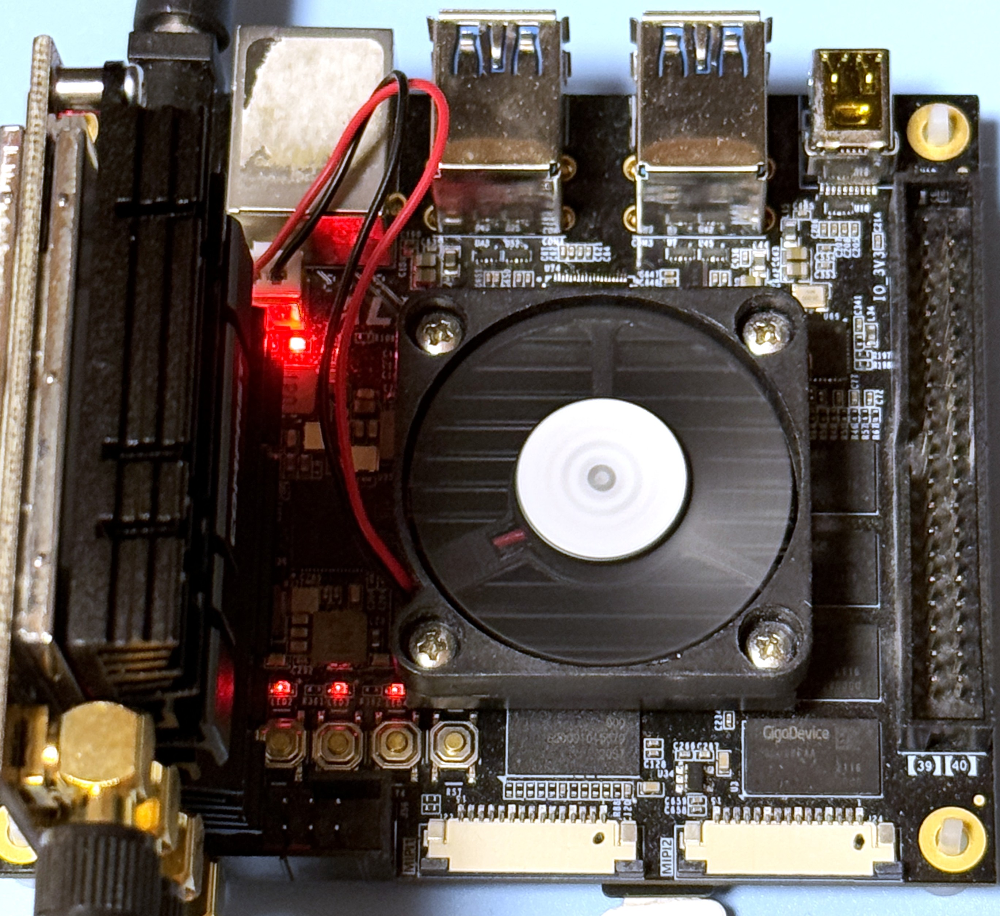
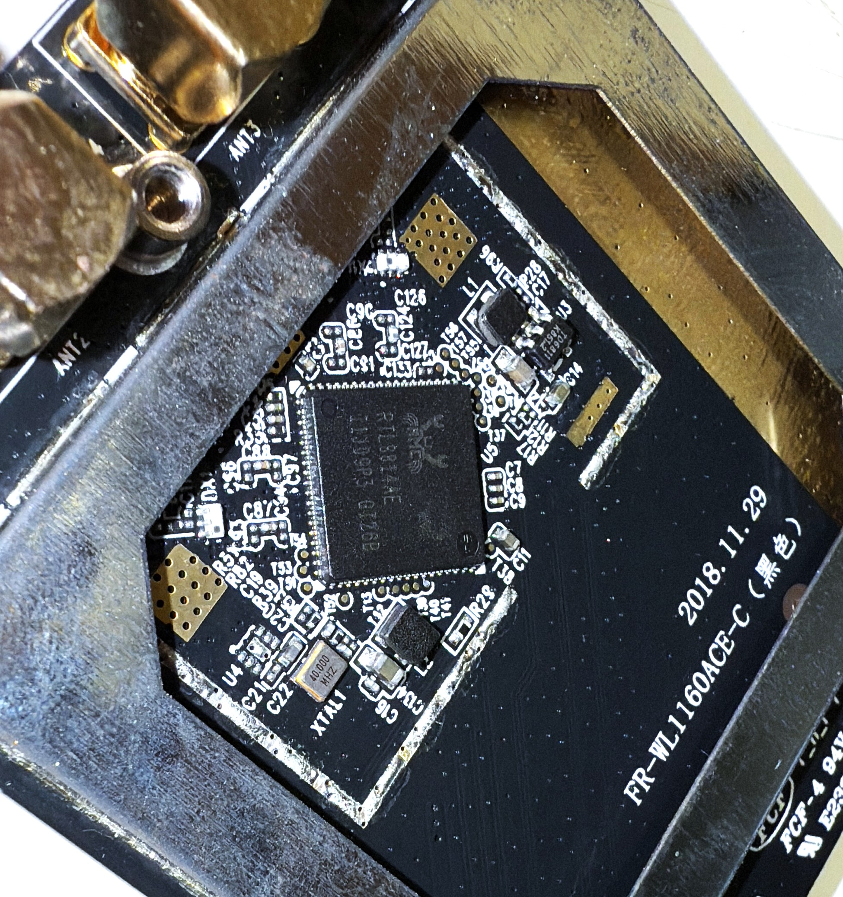

# RTL8814AE PCIe Card Testing

### Test PCIe Gear

|Test Board|PCIe Card HW|
|-|-|
|||

```
5.4.0

DISTRIB_ID=Ubuntu
DISTRIB_RELEASE=18.04
DISTRIB_CODENAME=bionic
DISTRIB_DESCRIPTION="Ubuntu 18.04.6 LTS"

Architecture:        aarch64
Byte Order:          Little Endian
CPU(s):              2
On-line CPU(s) list: 0,1
Thread(s) per core:  1
Core(s) per socket:  2
Socket(s):           1
Vendor ID:           ARM
Model:               4
Model name:          Cortex-A53
Stepping:            r0p4
CPU max MHz:         1199.9990
CPU min MHz:         299.9990
BogoMIPS:            66.66
Flags:               fp asimd aes pmull sha1 sha2 crc32 cpuid
```

### PCIe Tree

```
01:00.0 Network controller: Realtek Semiconductor Co., Ltd. RTL8813AE 802.11ac PCIe Wireless Network Adapter (rev 01)
	Subsystem: Realtek Semiconductor Co., Ltd. RTL8813AE 802.11ac PCIe Wireless Network Adapter
	Control: I/O- Mem- BusMaster- SpecCycle- MemWINV- VGASnoop- ParErr- Stepping- SERR- FastB2B- DisINTx-
	Status: Cap+ 66MHz- UDF- FastB2B- ParErr- DEVSEL=fast >TAbort- <TAbort- <MAbort- >SERR- <PERR- INTx-
	Interrupt: pin A routed to IRQ 255
	Region 0: I/O ports at <unassigned> [disabled]
	Region 2: Memory at e0000000 (64-bit, non-prefetchable) [disabled] [size=64K]
	Capabilities: [40] Power Management version 3
		Flags: PMEClk- DSI- D1+ D2+ AuxCurrent=375mA PME(D0+,D1+,D2+,D3hot+,D3cold+)
		Status: D0 NoSoftRst+ PME-Enable- DSel=0 DScale=0 PME-
	Capabilities: [50] MSI: Enable- Count=1/1 Maskable- 64bit+
		Address: 0000000000000000  Data: 0000
	Capabilities: [70] Express (v2) Endpoint, MSI 00
		DevCap:	MaxPayload 4096 bytes, PhantFunc 1, Latency L0s <256ns, L1 <1us
			ExtTag- AttnBtn- AttnInd- PwrInd- RBE+ FLReset- SlotPowerLimit 0.000W
		DevCtl:	Report errors: Correctable- Non-Fatal- Fatal- Unsupported-
			RlxdOrd+ ExtTag- PhantFunc- AuxPwr- NoSnoop-
			MaxPayload 128 bytes, MaxReadReq 512 bytes
		DevSta:	CorrErr+ UncorrErr- FatalErr+ UnsuppReq- AuxPwr+ TransPend-
		LnkCap:	Port #0, Speed 5GT/s, Width x1, ASPM L0s L1, Exit Latency L0s <4us, L1 <64us
			ClockPM+ Surprise- LLActRep- BwNot- ASPMOptComp+
		LnkCtl:	ASPM Disabled; RCB 64 bytes Disabled- CommClk-
			ExtSynch- ClockPM- AutWidDis- BWInt- AutBWInt-
		LnkSta:	Speed 5GT/s, Width x1, TrErr- Train- SlotClk- DLActive- BWMgmt- ABWMgmt-
		DevCap2: Completion Timeout: Not Supported, TimeoutDis+, LTR+, OBFF Via message/WAKE#
		DevCtl2: Completion Timeout: 50us to 50ms, TimeoutDis-, LTR-, OBFF Disabled
		LnkCtl2: Target Link Speed: 5GT/s, EnterCompliance- SpeedDis-
			 Transmit Margin: Normal Operating Range, EnterModifiedCompliance- ComplianceSOS-
			 Compliance De-emphasis: -6dB
		LnkSta2: Current De-emphasis Level: -6dB, EqualizationComplete-, EqualizationPhase1-
			 EqualizationPhase2-, EqualizationPhase3-, LinkEqualizationRequest-
	Capabilities: [100 v2] Advanced Error Reporting
		UESta:	DLP- SDES- TLP- FCP- CmpltTO- CmpltAbrt- UnxCmplt- RxOF- MalfTLP- ECRC- UnsupReq- ACSViol-
		UEMsk:	DLP- SDES- TLP- FCP- CmpltTO- CmpltAbrt- UnxCmplt- RxOF- MalfTLP- ECRC- UnsupReq- ACSViol-
		UESvrt:	DLP+ SDES+ TLP- FCP+ CmpltTO- CmpltAbrt- UnxCmplt- RxOF+ MalfTLP+ ECRC- UnsupReq- ACSViol-
		CESta:	RxErr- BadTLP- BadDLLP- Rollover- Timeout- NonFatalErr-
		CEMsk:	RxErr- BadTLP- BadDLLP- Rollover- Timeout- NonFatalErr+
		AERCap:	First Error Pointer: 00, GenCap+ CGenEn- ChkCap+ ChkEn-
	Capabilities: [148 v1] Device Serial Number 00-e0-4c-ff-fe-88-13-01
	Capabilities: [158 v1] Latency Tolerance Reporting
		Max snoop latency: 0ns
		Max no snoop latency: 0ns
	Capabilities: [160 v1] L1 PM Substates
		L1SubCap: PCI-PM_L1.2+ PCI-PM_L1.1+ ASPM_L1.2+ ASPM_L1.1+ L1_PM_Substates+
			  PortCommonModeRestoreTime=150us PortTPowerOnTime=150us
		L1SubCtl1: PCI-PM_L1.2- PCI-PM_L1.1- ASPM_L1.2- ASPM_L1.1-
			   T_CommonMode=0us LTR1.2_Threshold=0ns
		L1SubCtl2: T_PwrOn=10us
	Kernel modules: 8814ae

```

### Driver Load

The driver is loaded via "insmod"

```
Module                  Size  Used by
rtw_8814ae             16384  0
rtw_8814a             233472  1 rtw_8814ae
rtw_pci                32768  1 rtw_8814ae
rtw_core              208896  2 rtw_8814a,rtw_pci

01:00.0 Network controller: Realtek Semiconductor Co., Ltd. RTL8813AE 802.11ac PCIe Wireless Network Adapter (rev 01)
	Subsystem: Realtek Semiconductor Co., Ltd. RTL8813AE 802.11ac PCIe Wireless Network Adapter
	Control: I/O- Mem+ BusMaster+ SpecCycle- MemWINV- VGASnoop- ParErr- Stepping- SERR- FastB2B- DisINTx+
	Status: Cap+ 66MHz- UDF- FastB2B- ParErr- DEVSEL=fast >TAbort- <TAbort- <MAbort- >SERR- <PERR- INTx-
	Latency: 0
	Interrupt: pin A routed to IRQ 50
	Region 0: I/O ports at <unassigned> [disabled]
	Region 2: Memory at e0000000 (64-bit, non-prefetchable) [size=64K]
	Capabilities: [40] Power Management version 3
		Flags: PMEClk- DSI- D1+ D2+ AuxCurrent=375mA PME(D0+,D1+,D2+,D3hot+,D3cold+)
		Status: D0 NoSoftRst+ PME-Enable- DSel=0 DScale=0 PME-
	Capabilities: [50] MSI: Enable+ Count=1/1 Maskable- 64bit+
		Address: 00000000fd480000  Data: 0000
	Capabilities: [70] Express (v2) Endpoint, MSI 00
		DevCap:	MaxPayload 4096 bytes, PhantFunc 1, Latency L0s <256ns, L1 <1us
			ExtTag- AttnBtn- AttnInd- PwrInd- RBE+ FLReset- SlotPowerLimit 0.000W
		DevCtl:	Report errors: Correctable- Non-Fatal- Fatal- Unsupported-
			RlxdOrd+ ExtTag- PhantFunc- AuxPwr- NoSnoop-
			MaxPayload 128 bytes, MaxReadReq 512 bytes
		DevSta:	CorrErr+ UncorrErr- FatalErr+ UnsuppReq- AuxPwr+ TransPend-
		LnkCap:	Port #0, Speed 5GT/s, Width x1, ASPM L0s L1, Exit Latency L0s <4us, L1 <64us
			ClockPM+ Surprise- LLActRep- BwNot- ASPMOptComp+
		LnkCtl:	ASPM Disabled; RCB 64 bytes Disabled- CommClk-
			ExtSynch- ClockPM- AutWidDis- BWInt- AutBWInt-
		LnkSta:	Speed 5GT/s, Width x1, TrErr- Train- SlotClk- DLActive- BWMgmt- ABWMgmt-
		DevCap2: Completion Timeout: Not Supported, TimeoutDis+, LTR+, OBFF Via message/WAKE#
		DevCtl2: Completion Timeout: 50us to 50ms, TimeoutDis-, LTR-, OBFF Disabled
		LnkCtl2: Target Link Speed: 5GT/s, EnterCompliance- SpeedDis-
			 Transmit Margin: Normal Operating Range, EnterModifiedCompliance- ComplianceSOS-
			 Compliance De-emphasis: -6dB
		LnkSta2: Current De-emphasis Level: -6dB, EqualizationComplete-, EqualizationPhase1-
			 EqualizationPhase2-, EqualizationPhase3-, LinkEqualizationRequest-
	Capabilities: [100 v2] Advanced Error Reporting
		UESta:	DLP- SDES- TLP- FCP- CmpltTO- CmpltAbrt- UnxCmplt- RxOF- MalfTLP- ECRC- UnsupReq- ACSViol-
		UEMsk:	DLP- SDES- TLP- FCP- CmpltTO- CmpltAbrt- UnxCmplt- RxOF- MalfTLP- ECRC- UnsupReq- ACSViol-
		UESvrt:	DLP+ SDES+ TLP- FCP+ CmpltTO- CmpltAbrt- UnxCmplt- RxOF+ MalfTLP+ ECRC- UnsupReq- ACSViol-
		CESta:	RxErr+ BadTLP- BadDLLP- Rollover- Timeout- NonFatalErr-
		CEMsk:	RxErr- BadTLP- BadDLLP- Rollover- Timeout- NonFatalErr+
		AERCap:	First Error Pointer: 00, GenCap+ CGenEn- ChkCap+ ChkEn-
	Capabilities: [148 v1] Device Serial Number 00-e0-4c-ff-fe-88-13-01
	Capabilities: [158 v1] Latency Tolerance Reporting
		Max snoop latency: 0ns
		Max no snoop latency: 0ns
	Capabilities: [160 v1] L1 PM Substates
		L1SubCap: PCI-PM_L1.2+ PCI-PM_L1.1+ ASPM_L1.2+ ASPM_L1.1+ L1_PM_Substates+
			  PortCommonModeRestoreTime=150us PortTPowerOnTime=150us
		L1SubCtl1: PCI-PM_L1.2- PCI-PM_L1.1- ASPM_L1.2- ASPM_L1.1-
			   T_CommonMode=0us LTR1.2_Threshold=0ns
		L1SubCtl2: T_PwrOn=10us
	Kernel driver in use: rtw_8814ae
	Kernel modules: 8814ae

[   50.911235] rtw_core: loading out-of-tree module taints kernel.
[   51.104361] rtw_8814ae 0000:01:00.0: enabling device (0000 -> 0002)
[   51.117874] rtw_8814ae 0000:01:00.0: Firmware version 33.6.0, H2C version 6
[   51.127145] rtw_8814ae 0000:01:00.0: hw cap: hci=0x00, bw=0x07, ptcl=0x03, ant_num=0, nss=3
```

### EFUSE Dump

```
[   50.911235] rtw_core: loading out-of-tree module taints kernel.
[   51.104361] rtw_8814ae 0000:01:00.0: enabling device (0000 -> 0002)
[   51.117874] rtw_8814ae 0000:01:00.0: Firmware version 33.6.0, H2C version 6
[   51.127029] 00000000: 29 81 01 94 0d 0c 18 00 00 00 00 08 08 01 02 00  )...............
[   51.127034] 00000010: 28 28 28 28 28 28 28 28 28 28 28 00 ee ee ee ee  (((((((((((.....
[   51.127037] 00000020: ee ee 28 28 28 28 28 28 28 28 28 28 28 28 28 28  ..((((((((((((((
[   51.127041] 00000030: 00 ee ee ee ee ee 00 ee ee ee 28 29 29 2a 2a 2a  ..........())***
[   51.127044] 00000040: 27 27 27 28 28 f0 ee ee ee ee ee ee 28 28 28 27  '''((.......((('
[   51.127048] 00000050: 2b 2a 29 29 2b 28 26 26 26 26 11 ee ee ee ee ff  +*))+(&&&&......
[   51.127051] 00000060: c0 ee ee ee 27 26 26 26 26 26 25 25 25 25 25 f0  ....'&&&&&%%%%%.
[   51.127055] 00000070: ee ee ee ee ee ee 28 28 29 29 2c 2a 2a 2b 2c 29  ......(()),**+,)
[   51.127058] 00000080: 29 2a 29 28 01 ee ee ee ee ee c0 ee ee ee 2d 2d  )*)(..........--
[   51.127062] 00000090: 2d 2e 2e 2e 2a 2a 2b 2c 2c f1 ee ee ee ee ee ee  -...**+,,.......
[   51.127065] 000000a0: 2a 2b 2c 2c 2e 2c 2d 2e 2f 2d 2c 2e 2d 2a 11 ee  *+,,.,-./-,.-*..
[   51.127069] 000000b0: ee ee ee ee d0 ee ee ee 26 1f 1f 00 00 00 00 00  ........&.......
[   51.127072] 000000c0: 00 01 00 00 00 00 00 00 00 ff 00 ff ff ff ff ff  ................
[   51.127076] 000000d0: 34 21 09 4e 06 5a ec 10 13 88 ec 10 13 88 c3 ff  4!.N.Z..........
[   51.127079] 000000e0: 8d 80 ff ff ff ff ff ff ff ff ff ff ff ff ff ff  ................
[   51.127082] 000000f0: ff ff ff ff ff ff ff ff ff ff ff ff ff ff ff ff  ................
[   51.127086] 00000100: ff ff ff ff ff ff ff ff ff ff ff ff ff ff ff ff  ................
[   51.127089] 00000110: ff ff ff ff ff ff ff ff ff ff ff ff ff ff ff ff  ................
[   51.127093] 00000120: ff ff ff ff ff ff ff ff ff ff ff ff ff ff ff ff  ................
[   51.127096] 00000130: ff ff ff ff ff ff ff ff ff ff ff ff ff ff ff ff  ................
[   51.127099] 00000140: 67 4f ff ff ff ff ff ff ff ff ff ff ff ff ff ff  gO..............
[   51.127103] 00000150: ff ff ff ff ff ff ff ff ff ff ff ff ff ff ff ff  ................
[   51.127106] 00000160: ff ff ff ff ff ff ff ff ff ff ff ff ff ff ff ff  ................
[   51.127110] 00000170: ff ff ff ff ff ff ff ff ff 88 f5 30 ff ff ff ff  ...........0....
[   51.127113] 00000180: ff ff 4f 16 ff ff ff ff ff ff ff ff ff ff ff ff  ..O.............
[   51.127117] 00000190: ff ff ff ff ff ff ff ff ff ff ff ff ff ff ff ff  ................
[   51.127120] 000001a0: ff ff ff ff ff ff ff ff ff ff ff ff ff ff ff ff  ................
[   51.127123] 000001b0: ff ff ff ff ff ff ff ff ff ff ff ff ff ff ff ff  ................
[   51.127127] 000001c0: ff ff ff ff ff ff ff ff ff ff ff ff ff ff ff ff  ................
[   51.127130] 000001d0: ff ff ff ff ff ff ff ff ff ff ff ff ff ff ff ff  ................
[   51.127134] 000001e0: ff ff ff ff ff ff ff ff ff ff ff ff ff ff ff ff  ................
[   51.127137] 000001f0: ff ff ff ff ff ff ff ff ff ff ff ff ff ff ff ff  ................
[   51.127145] rtw_8814ae 0000:01:00.0: hw cap: hci=0x00, bw=0x07, ptcl=0x03, ant_num=0, nss=3
```

### iw list

<details>

<summary>iw list</summary>

```
Wiphy phy0
	max # scan SSIDs: 4
	max scan IEs length: 2243 bytes
	max # sched scan SSIDs: 0
	max # match sets: 0
	max # scan plans: 1
	max scan plan interval: -1
	max scan plan iterations: 0
	Retry short limit: 7
	Retry long limit: 4
	Coverage class: 0 (up to 0m)
	Device supports T-DLS.
	Supported Ciphers:
		* WEP40 (00-0f-ac:1)
		* WEP104 (00-0f-ac:5)
		* TKIP (00-0f-ac:2)
		* CCMP-128 (00-0f-ac:4)
		* CCMP-256 (00-0f-ac:10)
		* GCMP-128 (00-0f-ac:8)
		* GCMP-256 (00-0f-ac:9)
		* CMAC (00-0f-ac:6)
		* CMAC-256 (00-0f-ac:13)
		* GMAC-128 (00-0f-ac:11)
		* GMAC-256 (00-0f-ac:12)
	Available Antennas: TX 0x7 RX 0x7
	Configured Antennas: TX 0x7 RX 0x7
	Supported interface modes:
		 * IBSS
		 * managed
		 * AP
		 * AP/VLAN
		 * monitor
		 * P2P-client
		 * P2P-GO
	Band 1:
		Capabilities: 0x196f
			RX LDPC
			HT20/HT40
			SM Power Save disabled
			RX HT20 SGI
			RX HT40 SGI
			RX STBC 1-stream
			Max AMSDU length: 7935 bytes
			DSSS/CCK HT40
		Maximum RX AMPDU length 65535 bytes (exponent: 0x003)
		Minimum RX AMPDU time spacing: 2 usec (0x04)
		HT Max RX data rate: 450 Mbps
		HT TX/RX MCS rate indexes supported: 0-23, 32
		Bitrates (non-HT):
			* 1.0 Mbps
			* 2.0 Mbps
			* 5.5 Mbps
			* 11.0 Mbps
			* 6.0 Mbps
			* 9.0 Mbps
			* 12.0 Mbps
			* 18.0 Mbps
			* 24.0 Mbps
			* 36.0 Mbps
			* 48.0 Mbps
			* 54.0 Mbps
		Frequencies:
			* 2412 MHz [1] (20.0 dBm)
			* 2417 MHz [2] (20.0 dBm)
			* 2422 MHz [3] (20.0 dBm)
			* 2427 MHz [4] (20.0 dBm)
			* 2432 MHz [5] (20.0 dBm)
			* 2437 MHz [6] (20.0 dBm)
			* 2442 MHz [7] (20.0 dBm)
			* 2447 MHz [8] (20.0 dBm)
			* 2452 MHz [9] (20.0 dBm)
			* 2457 MHz [10] (20.0 dBm)
			* 2462 MHz [11] (20.0 dBm)
			* 2467 MHz [12] (20.0 dBm) (no IR)
			* 2472 MHz [13] (20.0 dBm) (no IR)
			* 2484 MHz [14] (20.0 dBm) (no IR)
	Band 2:
		Capabilities: 0x196f
			RX LDPC
			HT20/HT40
			SM Power Save disabled
			RX HT20 SGI
			RX HT40 SGI
			RX STBC 1-stream
			Max AMSDU length: 7935 bytes
			DSSS/CCK HT40
		Maximum RX AMPDU length 65535 bytes (exponent: 0x003)
		Minimum RX AMPDU time spacing: 2 usec (0x04)
		HT Max RX data rate: 450 Mbps
		HT TX/RX MCS rate indexes supported: 0-23, 32
		VHT Capabilities (0x03d071b2):
			Max MPDU length: 11454
			Supported Channel Width: neither 160 nor 80+80
			RX LDPC
			short GI (80 MHz)
			TX STBC
			SU Beamformee
			MU Beamformee
			+HTC-VHT
		VHT RX MCS set:
			1 streams: MCS 0-9
			2 streams: MCS 0-9
			3 streams: MCS 0-9
			4 streams: not supported
			5 streams: not supported
			6 streams: not supported
			7 streams: not supported
			8 streams: not supported
		VHT RX highest supported: 1170 Mbps
		VHT TX MCS set:
			1 streams: MCS 0-9
			2 streams: MCS 0-9
			3 streams: MCS 0-9
			4 streams: not supported
			5 streams: not supported
			6 streams: not supported
			7 streams: not supported
			8 streams: not supported
		VHT TX highest supported: 1170 Mbps
		Bitrates (non-HT):
			* 6.0 Mbps
			* 9.0 Mbps
			* 12.0 Mbps
			* 18.0 Mbps
			* 24.0 Mbps
			* 36.0 Mbps
			* 48.0 Mbps
			* 54.0 Mbps
		Frequencies:
			* 5180 MHz [36] (20.0 dBm) (no IR)
			* 5200 MHz [40] (20.0 dBm) (no IR)
			* 5220 MHz [44] (20.0 dBm) (no IR)
			* 5240 MHz [48] (20.0 dBm) (no IR)
			* 5260 MHz [52] (20.0 dBm) (no IR, radar detection)
			* 5280 MHz [56] (20.0 dBm) (no IR, radar detection)
			* 5300 MHz [60] (20.0 dBm) (no IR, radar detection)
			* 5320 MHz [64] (20.0 dBm) (no IR, radar detection)
			* 5500 MHz [100] (20.0 dBm) (no IR, radar detection)
			* 5520 MHz [104] (20.0 dBm) (no IR, radar detection)
			* 5540 MHz [108] (20.0 dBm) (no IR, radar detection)
			* 5560 MHz [112] (20.0 dBm) (no IR, radar detection)
			* 5580 MHz [116] (20.0 dBm) (no IR, radar detection)
			* 5600 MHz [120] (20.0 dBm) (no IR, radar detection)
			* 5620 MHz [124] (20.0 dBm) (no IR, radar detection)
			* 5640 MHz [128] (20.0 dBm) (no IR, radar detection)
			* 5660 MHz [132] (20.0 dBm) (no IR, radar detection)
			* 5680 MHz [136] (20.0 dBm) (no IR, radar detection)
			* 5700 MHz [140] (20.0 dBm) (no IR, radar detection)
			* 5720 MHz [144] (20.0 dBm) (no IR, radar detection)
			* 5745 MHz [149] (20.0 dBm) (no IR)
			* 5765 MHz [153] (20.0 dBm) (no IR)
			* 5785 MHz [157] (20.0 dBm) (no IR)
			* 5805 MHz [161] (20.0 dBm) (no IR)
			* 5825 MHz [165] (20.0 dBm) (no IR)
	Supported commands:
		 * new_interface
		 * set_interface
		 * new_key
		 * start_ap
		 * new_station
		 * set_bss
		 * authenticate
		 * associate
		 * deauthenticate
		 * disassociate
		 * join_ibss
		 * set_tx_bitrate_mask
		 * frame
		 * frame_wait_cancel
		 * set_wiphy_netns
		 * set_channel
		 * set_wds_peer
		 * tdls_mgmt
		 * tdls_oper
		 * probe_client
		 * set_noack_map
		 * register_beacons
		 * start_p2p_device
		 * set_mcast_rate
		 * testmode
		 * connect
		 * disconnect
		 * set_qos_map
		 * set_multicast_to_unicast
	Supported TX frame types:
		 * IBSS: 0x00 0x10 0x20 0x30 0x40 0x50 0x60 0x70 0x80 0x90 0xa0 0xb0 0xc0 0xd0 0xe0 0xf0
		 * managed: 0x00 0x10 0x20 0x30 0x40 0x50 0x60 0x70 0x80 0x90 0xa0 0xb0 0xc0 0xd0 0xe0 0xf0
		 * AP: 0x00 0x10 0x20 0x30 0x40 0x50 0x60 0x70 0x80 0x90 0xa0 0xb0 0xc0 0xd0 0xe0 0xf0
		 * AP/VLAN: 0x00 0x10 0x20 0x30 0x40 0x50 0x60 0x70 0x80 0x90 0xa0 0xb0 0xc0 0xd0 0xe0 0xf0
		 * mesh point: 0x00 0x10 0x20 0x30 0x40 0x50 0x60 0x70 0x80 0x90 0xa0 0xb0 0xc0 0xd0 0xe0 0xf0
		 * P2P-client: 0x00 0x10 0x20 0x30 0x40 0x50 0x60 0x70 0x80 0x90 0xa0 0xb0 0xc0 0xd0 0xe0 0xf0
		 * P2P-GO: 0x00 0x10 0x20 0x30 0x40 0x50 0x60 0x70 0x80 0x90 0xa0 0xb0 0xc0 0xd0 0xe0 0xf0
		 * P2P-device: 0x00 0x10 0x20 0x30 0x40 0x50 0x60 0x70 0x80 0x90 0xa0 0xb0 0xc0 0xd0 0xe0 0xf0
	Supported RX frame types:
		 * IBSS: 0x40 0xb0 0xc0 0xd0
		 * managed: 0x40 0xd0
		 * AP: 0x00 0x20 0x40 0xa0 0xb0 0xc0 0xd0
		 * AP/VLAN: 0x00 0x20 0x40 0xa0 0xb0 0xc0 0xd0
		 * mesh point: 0xb0 0xc0 0xd0
		 * P2P-client: 0x40 0xd0
		 * P2P-GO: 0x00 0x20 0x40 0xa0 0xb0 0xc0 0xd0
		 * P2P-device: 0x40 0xd0
	software interface modes (can always be added):
		 * AP/VLAN
		 * monitor
	valid interface combinations:
		 * #{ managed } <= 1, #{ AP, P2P-client, P2P-GO } <= 1,
		   total <= 2, #channels <= 1
	HT Capability overrides:
		 * MCS: ff ff ff ff ff ff ff ff ff ff
		 * maximum A-MSDU length
		 * supported channel width
		 * short GI for 40 MHz
		 * max A-MPDU length exponent
		 * min MPDU start spacing
	Device supports TX status socket option.
	Device supports HT-IBSS.
	Device supports SAE with AUTHENTICATE command
	Device supports scan flush.
	Device supports per-vif TX power setting
	Driver supports full state transitions for AP/GO clients
	Driver supports a userspace MPM
	Device supports configuring vdev MAC-addr on create.
```

</details>

### Network Manager - Band 2.4

```
wlan0: flags=4163<UP,BROADCAST,RUNNING,MULTICAST>  mtu 1500
        inet 192.168.1.132  netmask 255.255.255.0  broadcast 192.168.1.255
        RX packets 9  bytes 1898 (1.8 KB)
        RX errors 0  dropped 0  overruns 0  frame 0
        TX packets 16  bytes 2560 (2.5 KB)
        TX errors 0  dropped 0 overruns 0  carrier 0  collisions 0
```

### iwconfig 2.4

```
wlan0     IEEE 802.11  ESSID:""  
          Mode:Managed  Frequency:2.427 GHz  Access Point: 
          Bit Rate=39 Mb/s   Tx-Power=30 dBm   
          Retry short limit:7   RTS thr:off   Fragment thr:off
          Encryption key:off
          Power Management:on
          Link Quality=58/70  Signal level=-52 dBm  
          Rx invalid nwid:0  Rx invalid crypt:0  Rx invalid frag:0
          Tx excessive retries:1  Invalid misc:4   Missed beacon:0

```

### Network Speed Test via Ookla - Band 2.4

```
Retrieving speedtest.net configuration...
Retrieving speedtest.net server list...
Selecting best server based on ping...
Testing download speed................................................................................
Download: 41.15 Mbit/s
Testing upload speed......................................................................................................
Upload: 2.82 Mbit/s
```

### Network Ping Tests - Band 2.4

#### DNS-Ping

```
PING 8.8.8.8 (8.8.8.8) 56(84) bytes of data.
64 bytes from 8.8.8.8: icmp_seq=1 ttl=59 time=5.72 ms
64 bytes from 8.8.8.8: icmp_seq=2 ttl=59 time=5.49 ms
64 bytes from 8.8.8.8: icmp_seq=3 ttl=59 time=18.1 ms
64 bytes from 8.8.8.8: icmp_seq=4 ttl=59 time=5.71 ms
64 bytes from 8.8.8.8: icmp_seq=5 ttl=59 time=5.56 ms
64 bytes from 8.8.8.8: icmp_seq=6 ttl=59 time=5.41 ms
64 bytes from 8.8.8.8: icmp_seq=7 ttl=59 time=5.54 ms
64 bytes from 8.8.8.8: icmp_seq=8 ttl=59 time=5.38 ms
64 bytes from 8.8.8.8: icmp_seq=9 ttl=59 time=5.69 ms
64 bytes from 8.8.8.8: icmp_seq=10 ttl=59 time=9.03 ms
64 bytes from 8.8.8.8: icmp_seq=11 ttl=59 time=5.43 ms
64 bytes from 8.8.8.8: icmp_seq=12 ttl=59 time=14.9 ms
64 bytes from 8.8.8.8: icmp_seq=13 ttl=59 time=6.28 ms
64 bytes from 8.8.8.8: icmp_seq=14 ttl=59 time=5.38 ms
64 bytes from 8.8.8.8: icmp_seq=15 ttl=59 time=5.43 ms
64 bytes from 8.8.8.8: icmp_seq=16 ttl=59 time=6.01 ms
64 bytes from 8.8.8.8: icmp_seq=17 ttl=59 time=9.42 ms
64 bytes from 8.8.8.8: icmp_seq=18 ttl=59 time=6.48 ms
64 bytes from 8.8.8.8: icmp_seq=19 ttl=59 time=5.52 ms
64 bytes from 8.8.8.8: icmp_seq=20 ttl=59 time=6.37 ms

--- 8.8.8.8 ping statistics ---
20 packets transmitted, 20 received, 0% packet loss, time 19028ms
rtt min/avg/max/mdev = 5.383/7.147/18.104/3.347 ms
```

#### Self-Ping 

```
PING 192.168.1.132 (192.168.1.132) 10000(10028) bytes of data.
10008 bytes from 192.168.1.132: icmp_seq=1 ttl=64 time=0.103 ms
10008 bytes from 192.168.1.132: icmp_seq=2 ttl=64 time=0.070 ms
10008 bytes from 192.168.1.132: icmp_seq=3 ttl=64 time=0.061 ms
10008 bytes from 192.168.1.132: icmp_seq=4 ttl=64 time=0.059 ms
10008 bytes from 192.168.1.132: icmp_seq=5 ttl=64 time=0.059 ms
10008 bytes from 192.168.1.132: icmp_seq=6 ttl=64 time=0.060 ms
10008 bytes from 192.168.1.132: icmp_seq=7 ttl=64 time=0.060 ms
10008 bytes from 192.168.1.132: icmp_seq=8 ttl=64 time=0.075 ms
10008 bytes from 192.168.1.132: icmp_seq=9 ttl=64 time=0.062 ms
10008 bytes from 192.168.1.132: icmp_seq=10 ttl=64 time=0.062 ms
10008 bytes from 192.168.1.132: icmp_seq=11 ttl=64 time=0.061 ms
10008 bytes from 192.168.1.132: icmp_seq=12 ttl=64 time=0.107 ms
10008 bytes from 192.168.1.132: icmp_seq=13 ttl=64 time=0.091 ms
10008 bytes from 192.168.1.132: icmp_seq=14 ttl=64 time=0.075 ms
10008 bytes from 192.168.1.132: icmp_seq=15 ttl=64 time=0.082 ms
10008 bytes from 192.168.1.132: icmp_seq=16 ttl=64 time=0.110 ms
10008 bytes from 192.168.1.132: icmp_seq=17 ttl=64 time=0.094 ms
10008 bytes from 192.168.1.132: icmp_seq=18 ttl=64 time=0.076 ms
10008 bytes from 192.168.1.132: icmp_seq=19 ttl=64 time=0.084 ms
10008 bytes from 192.168.1.132: icmp_seq=20 ttl=64 time=0.065 ms

--- 192.168.1.132 ping statistics ---
20 packets transmitted, 20 received, 0% packet loss, time 19435ms
rtt min/avg/max/mdev = 0.059/0.075/0.110/0.020 ms
```

### Server & Client Test via iperf3 (PC-Router-DUT)

<details>

<summary>iperf3</summary>

```
-----------------------------------------------------------
Server listening on 5201
-----------------------------------------------------------
Accepted connection from 192.168.1.252, port 51980
[  5] local 192.168.1.132 port 5201 connected to 192.168.1.252 port 51981
[ ID] Interval           Transfer     Bandwidth       Retr  Cwnd
[  5]   0.00-1.00   sec   767 KBytes  6.28 Mbits/sec    2    131 KBytes       
[  5]   1.00-2.00   sec   878 KBytes  7.19 Mbits/sec    1    131 KBytes       
[  5]   2.00-3.00   sec   627 KBytes  5.14 Mbits/sec    0    131 KBytes       
[  5]   3.00-4.00   sec   941 KBytes  7.71 Mbits/sec    0    131 KBytes       
[  5]   4.00-5.00   sec   314 KBytes  2.57 Mbits/sec    0    131 KBytes       
[  5]   5.00-6.00   sec   314 KBytes  2.57 Mbits/sec    0    131 KBytes       
[  5]   6.00-7.00   sec   627 KBytes  5.14 Mbits/sec    0    131 KBytes       
[  5]   7.00-8.00   sec   314 KBytes  2.57 Mbits/sec    0    131 KBytes       
[  5]   8.00-9.00   sec   314 KBytes  2.57 Mbits/sec    0    131 KBytes       
[  5]   9.00-10.00  sec   627 KBytes  5.14 Mbits/sec    0    131 KBytes       
[  5]  10.00-11.00  sec   314 KBytes  2.57 Mbits/sec    0    131 KBytes       
[  5]  11.00-12.00  sec  0.00 Bytes  0.00 bits/sec    2    123 KBytes       
[  5]  12.00-13.00  sec  0.00 Bytes  0.00 bits/sec    0    121 KBytes       
[  5]  13.00-14.00  sec  0.00 Bytes  0.00 bits/sec    0    121 KBytes       
[  5]  14.00-15.00  sec  0.00 Bytes  0.00 bits/sec    0   61.3 KBytes       
[  5]  15.00-16.00  sec  0.00 Bytes  0.00 bits/sec    0   61.3 KBytes       
[  5]  16.00-17.00  sec  0.00 Bytes  0.00 bits/sec    0   61.3 KBytes       
[  5]  17.00-18.00  sec  0.00 Bytes  0.00 bits/sec    0   61.3 KBytes       
[  5]  18.00-19.00  sec  0.00 Bytes  0.00 bits/sec    0   61.3 KBytes       
[  5]  19.00-20.00  sec  0.00 Bytes  0.00 bits/sec    0   61.3 KBytes       
[  5]  20.00-21.00  sec  0.00 Bytes  0.00 bits/sec    0   61.3 KBytes       
[  5]  21.00-22.00  sec  0.00 Bytes  0.00 bits/sec    0   61.3 KBytes       
[  5]  22.00-23.00  sec  0.00 Bytes  0.00 bits/sec    0   61.3 KBytes       
[  5]  23.00-24.00  sec  0.00 Bytes  0.00 bits/sec    0   61.3 KBytes       
[  5]  24.00-25.00  sec  0.00 Bytes  0.00 bits/sec    0   61.3 KBytes       
[  5]  25.00-26.00  sec   627 KBytes  5.14 Mbits/sec    1    121 KBytes       
[  5]  26.00-27.00  sec  1.29 MBytes  10.8 Mbits/sec    5    103 KBytes       
[  5]  27.00-28.00  sec  1.23 MBytes  10.3 Mbits/sec    0    118 KBytes       
[  5]  28.00-29.00  sec  1.23 MBytes  10.3 Mbits/sec    0    124 KBytes       
[  5]  29.00-30.00  sec  1.90 MBytes  15.9 Mbits/sec    0    124 KBytes       
[  5]  30.00-30.25  sec   314 KBytes  10.4 Mbits/sec    0    124 KBytes       
- - - - - - - - - - - - - - - - - - - - - - - - -
[ ID] Interval           Transfer     Bandwidth       Retr
[  5]   0.00-30.25  sec  12.5 MBytes  3.45 Mbits/sec   11             sender
[  5]   0.00-30.25  sec  0.00 Bytes  0.00 bits/sec                  receiver
-----------------------------------------------------------
Server listening on 5201
-----------------------------------------------------------
iperf3: interrupt - the server has terminated
[   50.911235] rtw_core: loading out-of-tree module taints kernel.
[   51.104361] rtw_8814ae 0000:01:00.0: enabling device (0000 -> 0002)
[   51.117874] rtw_8814ae 0000:01:00.0: Firmware version 33.6.0, H2C version 6
[   51.127145] rtw_8814ae 0000:01:00.0: hw cap: hci=0x00, bw=0x07, ptcl=0x03, ant_num=0, nss=3
```

</details>

### Network Manager - Band 5G

```
wlan0: flags=4163<UP,BROADCAST,RUNNING,MULTICAST>  mtu 1500
        inet 192.168.1.132  netmask 255.255.255.0  broadcast 192.168.1.255
        RX packets 42630  bytes 55778663 (55.7 MB)
        RX errors 0  dropped 0  overruns 0  frame 0
        TX packets 34555  bytes 21166569 (21.1 MB)
        TX errors 0  dropped 0 overruns 0  carrier 0  collisions 0
```

### iwconfig 5G

```
wlan0     IEEE 802.11  ESSID:""  
          Mode:Managed  Frequency:5.2 GHz  Access Point: 
          Bit Rate=351 Mb/s   Tx-Power=23 dBm   
          Retry short limit:7   RTS thr:off   Fragment thr:off
          Encryption key:off
          Power Management:on
          Link Quality=46/70  Signal level=-64 dBm  
          Rx invalid nwid:0  Rx invalid crypt:0  Rx invalid frag:0
          Tx excessive retries:0  Invalid misc:1   Missed beacon:0

```

### Network Speed Test via Ookla - Band 5G

```
Retrieving speedtest.net configuration...
Retrieving speedtest.net server list...
Selecting best server based on ping...
Testing download speed................................................................................
Download: 190.26 Mbit/s
Testing upload speed......................................................................................................
Upload: 4.06 Mbit/s
```

### Network Ping Tests - Band 5G

#### DNS-Ping

```
PING 8.8.8.8 (8.8.8.8) 56(84) bytes of data.
64 bytes from 8.8.8.8: icmp_seq=1 ttl=59 time=6.22 ms
64 bytes from 8.8.8.8: icmp_seq=2 ttl=59 time=21.8 ms
64 bytes from 8.8.8.8: icmp_seq=3 ttl=59 time=31.7 ms
64 bytes from 8.8.8.8: icmp_seq=4 ttl=59 time=16.7 ms
64 bytes from 8.8.8.8: icmp_seq=5 ttl=59 time=23.0 ms
64 bytes from 8.8.8.8: icmp_seq=6 ttl=59 time=26.4 ms
64 bytes from 8.8.8.8: icmp_seq=7 ttl=59 time=34.7 ms
64 bytes from 8.8.8.8: icmp_seq=8 ttl=59 time=26.2 ms
64 bytes from 8.8.8.8: icmp_seq=9 ttl=59 time=28.8 ms
64 bytes from 8.8.8.8: icmp_seq=10 ttl=59 time=22.1 ms
64 bytes from 8.8.8.8: icmp_seq=11 ttl=59 time=15.8 ms
64 bytes from 8.8.8.8: icmp_seq=12 ttl=59 time=31.6 ms
64 bytes from 8.8.8.8: icmp_seq=13 ttl=59 time=36.4 ms
64 bytes from 8.8.8.8: icmp_seq=14 ttl=59 time=24.9 ms
64 bytes from 8.8.8.8: icmp_seq=15 ttl=59 time=26.2 ms
64 bytes from 8.8.8.8: icmp_seq=16 ttl=59 time=15.3 ms
64 bytes from 8.8.8.8: icmp_seq=17 ttl=59 time=23.6 ms
64 bytes from 8.8.8.8: icmp_seq=18 ttl=59 time=33.2 ms
64 bytes from 8.8.8.8: icmp_seq=19 ttl=59 time=22.7 ms
64 bytes from 8.8.8.8: icmp_seq=20 ttl=59 time=57.0 ms

--- 8.8.8.8 ping statistics ---
20 packets transmitted, 20 received, 0% packet loss, time 19026ms
rtt min/avg/max/mdev = 6.226/26.267/57.009/10.051 ms
```

#### Self-Ping 

```
PING 192.168.1.132 (192.168.1.132) 10000(10028) bytes of data.
10008 bytes from 192.168.1.132: icmp_seq=1 ttl=64 time=0.102 ms
10008 bytes from 192.168.1.132: icmp_seq=2 ttl=64 time=0.064 ms
10008 bytes from 192.168.1.132: icmp_seq=3 ttl=64 time=0.060 ms
10008 bytes from 192.168.1.132: icmp_seq=4 ttl=64 time=0.070 ms
10008 bytes from 192.168.1.132: icmp_seq=5 ttl=64 time=0.062 ms
10008 bytes from 192.168.1.132: icmp_seq=6 ttl=64 time=0.062 ms
10008 bytes from 192.168.1.132: icmp_seq=7 ttl=64 time=0.061 ms
10008 bytes from 192.168.1.132: icmp_seq=8 ttl=64 time=0.061 ms
10008 bytes from 192.168.1.132: icmp_seq=9 ttl=64 time=0.062 ms
10008 bytes from 192.168.1.132: icmp_seq=10 ttl=64 time=0.081 ms
10008 bytes from 192.168.1.132: icmp_seq=11 ttl=64 time=0.066 ms
10008 bytes from 192.168.1.132: icmp_seq=12 ttl=64 time=0.061 ms
10008 bytes from 192.168.1.132: icmp_seq=13 ttl=64 time=0.062 ms
10008 bytes from 192.168.1.132: icmp_seq=14 ttl=64 time=0.059 ms
10008 bytes from 192.168.1.132: icmp_seq=15 ttl=64 time=0.060 ms
10008 bytes from 192.168.1.132: icmp_seq=16 ttl=64 time=0.073 ms
10008 bytes from 192.168.1.132: icmp_seq=17 ttl=64 time=0.065 ms
10008 bytes from 192.168.1.132: icmp_seq=18 ttl=64 time=0.061 ms
10008 bytes from 192.168.1.132: icmp_seq=19 ttl=64 time=0.062 ms
10008 bytes from 192.168.1.132: icmp_seq=20 ttl=64 time=0.061 ms

--- 192.168.1.132 ping statistics ---
20 packets transmitted, 20 received, 0% packet loss, time 19462ms
rtt min/avg/max/mdev = 0.059/0.065/0.102/0.013 ms
```

### Server & Client Test via iperf3 (PC-Router-DUT)

<details>

<summary>iperf3</summary>

```
-----------------------------------------------------------
Server listening on 5201
-----------------------------------------------------------
Accepted connection from 192.168.1.252, port 50702
[  5] local 192.168.1.132 port 5201 connected to 192.168.1.252 port 50703
[ ID] Interval           Transfer     Bandwidth       Retr  Cwnd
[  5]   0.00-1.00   sec  6.05 MBytes  50.7 Mbits/sec    0    259 KBytes       
[  5]   1.00-2.00   sec  5.76 MBytes  48.3 Mbits/sec    0    259 KBytes       
[  5]   2.00-3.00   sec  13.5 MBytes   114 Mbits/sec    0    518 KBytes       
[  5]   3.00-4.00   sec  15.9 MBytes   134 Mbits/sec    0    518 KBytes       
[  5]   4.00-5.00   sec  15.6 MBytes   131 Mbits/sec    0    518 KBytes       
[  5]   5.00-6.00   sec  14.0 MBytes   117 Mbits/sec    0    518 KBytes       
[  5]   6.00-7.00   sec  15.3 MBytes   128 Mbits/sec    0    518 KBytes       
[  5]   7.00-8.00   sec  18.2 MBytes   153 Mbits/sec    0    518 KBytes       
[  5]   8.00-9.00   sec  16.0 MBytes   134 Mbits/sec    0    518 KBytes       
[  5]   9.00-10.00  sec  12.7 MBytes   106 Mbits/sec    0    518 KBytes       
[  5]  10.00-11.00  sec  12.2 MBytes   102 Mbits/sec    0    518 KBytes       
[  5]  11.00-12.00  sec  16.1 MBytes   135 Mbits/sec    0    518 KBytes       
[  5]  12.00-13.00  sec  17.8 MBytes   149 Mbits/sec    0    518 KBytes       
[  5]  13.00-14.00  sec  18.9 MBytes   159 Mbits/sec    0    518 KBytes       
[  5]  14.00-15.00  sec  15.0 MBytes   126 Mbits/sec    0    518 KBytes       
[  5]  15.00-16.00  sec  17.6 MBytes   147 Mbits/sec    0    642 KBytes       
[  5]  16.00-17.00  sec  17.5 MBytes   147 Mbits/sec    0    984 KBytes       
[  5]  17.00-18.00  sec  16.2 MBytes   136 Mbits/sec    0   1.49 MBytes       
[  5]  18.00-19.00  sec  17.5 MBytes   147 Mbits/sec    0   1.49 MBytes       
[  5]  19.00-20.00  sec  13.8 MBytes   115 Mbits/sec    0   1.49 MBytes       
[  5]  20.00-21.00  sec  12.5 MBytes   105 Mbits/sec    0   1.49 MBytes       
[  5]  21.00-22.00  sec  11.2 MBytes  94.4 Mbits/sec    0   1.49 MBytes       
[  5]  22.00-23.00  sec  12.5 MBytes   105 Mbits/sec    0   1.49 MBytes       
[  5]  23.00-24.00  sec  13.8 MBytes   115 Mbits/sec    0   1.49 MBytes       
[  5]  24.00-25.00  sec  13.8 MBytes   115 Mbits/sec    0   1.49 MBytes       
[  5]  25.00-26.00  sec  13.8 MBytes   115 Mbits/sec    0   1.49 MBytes       
[  5]  26.00-27.00  sec  12.5 MBytes   105 Mbits/sec    0   1.49 MBytes       
[  5]  27.00-28.00  sec  13.8 MBytes   115 Mbits/sec    0   1.49 MBytes       
[  5]  28.00-29.00  sec  11.2 MBytes  94.4 Mbits/sec    0   1.49 MBytes       
[  5]  29.00-30.00  sec  12.5 MBytes   105 Mbits/sec    0   1.49 MBytes       
[  5]  30.00-30.05  sec  0.00 Bytes  0.00 bits/sec    0   1.49 MBytes       
- - - - - - - - - - - - - - - - - - - - - - - - -
[ ID] Interval           Transfer     Bandwidth       Retr
[  5]   0.00-30.05  sec   423 MBytes   118 Mbits/sec    0             sender
[  5]   0.00-30.05  sec  0.00 Bytes  0.00 bits/sec                  receiver
-----------------------------------------------------------
Server listening on 5201
-----------------------------------------------------------
iperf3: interrupt - the server has terminated
[   50.911235] rtw_core: loading out-of-tree module taints kernel.
[   51.104361] rtw_8814ae 0000:01:00.0: enabling device (0000 -> 0002)
[   51.117874] rtw_8814ae 0000:01:00.0: Firmware version 33.6.0, H2C version 6
[   51.127145] rtw_8814ae 0000:01:00.0: hw cap: hci=0x00, bw=0x07, ptcl=0x03, ant_num=0, nss=3
```

</details>

### AP 2.4G Test

#### hostapd.conf

Setup the configuration at /etc/hostapd/hostapd.conf

```
interface=wlan0
driver=nl80211
ieee80211n=1
hw_mode=g
channel=6
ssid=AP-TEST
wpa=2
wpa_passphrase=12345678
wpa_key_mgmt=WPA-PSK
rsn_pairwise=CCMP TKIP
wpa_pairwise=TKIP CCMP
```

#### udhcpd.conf

```
start 192.168.175.2
end 192.168.175.254
interface wlan0
max_leases 234
opt router 192.168.175.1
```

#### Start AP Test

```
sudo hostapd /etc/hostapd/hostapd.conf -B
Using interface wlan0 with hwaddr and ssid "AP-NAME"
wlan0: interface state UNINITIALIZED->ENABLED
wlan0: AP-ENABLED
```

#### Server & Client Test via iperf3 (PC-DUT)

<details>

<summary>iperf3</summary>

```
-----------------------------------------------------------
Server listening on 5201
-----------------------------------------------------------
Accepted connection from 192.168.175.217, port 50734
[  5] local 192.168.175.1 port 5201 connected to 192.168.175.217 port 50735
[ ID] Interval           Transfer     Bandwidth       Retr  Cwnd
[  5]   0.00-1.00   sec  4.15 MBytes  34.8 Mbits/sec    0    134 KBytes       
[  5]   1.00-2.00   sec  6.07 MBytes  50.9 Mbits/sec    0    269 KBytes       
[  5]   2.00-3.00   sec  5.58 MBytes  46.8 Mbits/sec    0    269 KBytes       
[  5]   3.00-4.00   sec  2.76 MBytes  23.1 Mbits/sec    3    221 KBytes       
[  5]   4.00-5.00   sec  4.96 MBytes  41.6 Mbits/sec    0    248 KBytes       
[  5]   5.00-6.00   sec  6.98 MBytes  58.6 Mbits/sec    0    258 KBytes       
[  5]   6.00-7.00   sec  7.90 MBytes  66.3 Mbits/sec    0    258 KBytes       
[  5]   7.00-8.00   sec  8.45 MBytes  70.9 Mbits/sec    0    258 KBytes       
[  5]   8.00-9.00   sec  6.31 MBytes  52.9 Mbits/sec    0    258 KBytes       
[  5]   9.00-10.00  sec  7.41 MBytes  62.2 Mbits/sec    0    258 KBytes       
[  5]  10.00-11.00  sec  8.03 MBytes  67.3 Mbits/sec    0    258 KBytes       
[  5]  11.00-12.00  sec  7.84 MBytes  65.8 Mbits/sec    0    258 KBytes       
[  5]  12.00-13.00  sec  5.88 MBytes  49.3 Mbits/sec    0    258 KBytes       
[  5]  13.00-14.00  sec  7.17 MBytes  60.1 Mbits/sec    0    258 KBytes       
[  5]  14.00-15.00  sec  7.66 MBytes  64.2 Mbits/sec    0    258 KBytes       
[  5]  15.00-16.00  sec  7.72 MBytes  64.8 Mbits/sec    0    388 KBytes       
[  5]  16.00-17.00  sec  7.47 MBytes  62.7 Mbits/sec    0    388 KBytes       
[  5]  17.00-18.00  sec  6.86 MBytes  57.6 Mbits/sec    0    518 KBytes       
[  5]  18.00-19.00  sec  7.78 MBytes  65.3 Mbits/sec    0    518 KBytes       
[  5]  19.00-20.00  sec  7.90 MBytes  66.3 Mbits/sec    0    518 KBytes       
[  5]  20.00-21.00  sec  8.94 MBytes  75.0 Mbits/sec    0    518 KBytes       
[  5]  21.00-22.00  sec  5.64 MBytes  47.3 Mbits/sec    0    518 KBytes       
[  5]  22.00-23.00  sec  7.84 MBytes  65.8 Mbits/sec    0    518 KBytes       
[  5]  23.00-24.00  sec  9.09 MBytes  76.3 Mbits/sec    0    518 KBytes       
[  5]  24.00-25.00  sec  6.90 MBytes  57.9 Mbits/sec    0    518 KBytes       
[  5]  25.00-26.00  sec  8.88 MBytes  74.5 Mbits/sec    0    518 KBytes       
[  5]  26.00-27.00  sec  7.54 MBytes  63.2 Mbits/sec    0    518 KBytes       
[  5]  27.00-28.00  sec  9.92 MBytes  83.3 Mbits/sec    0    518 KBytes       
[  5]  28.00-29.00  sec  6.73 MBytes  56.4 Mbits/sec    0    518 KBytes       
[  5]  29.00-30.00  sec  3.69 MBytes  30.9 Mbits/sec    0    518 KBytes       
[  5]  30.00-31.00  sec  4.86 MBytes  40.8 Mbits/sec    0    518 KBytes       
[  5]  31.00-32.00  sec  8.94 MBytes  75.0 Mbits/sec    0    518 KBytes       
[  5]  32.00-33.00  sec  8.74 MBytes  73.3 Mbits/sec    0    518 KBytes       
[  5]  33.00-34.00  sec  7.96 MBytes  66.8 Mbits/sec    0    518 KBytes       
[  5]  34.00-35.00  sec  8.88 MBytes  74.5 Mbits/sec    0    518 KBytes       
[  5]  35.00-36.00  sec  4.35 MBytes  36.5 Mbits/sec    0    518 KBytes       
[  5]  36.00-37.00  sec  3.55 MBytes  29.8 Mbits/sec    0    518 KBytes       
[  5]  37.00-38.00  sec  6.74 MBytes  56.5 Mbits/sec    0    518 KBytes       
[  5]  38.00-39.00  sec  8.82 MBytes  74.0 Mbits/sec    0    518 KBytes       
[  5]  39.00-40.00  sec  9.40 MBytes  78.8 Mbits/sec    0    518 KBytes       
[  5]  40.00-41.00  sec  9.10 MBytes  76.4 Mbits/sec    0    518 KBytes       
[  5]  40.00-41.00  sec  9.10 MBytes  76.4 Mbits/sec    0    518 KBytes       
- - - - - - - - - - - - - - - - - - - - - - - - -
[ ID] Interval           Transfer     Bandwidth       Retr
[  5]   0.00-41.00  sec   294 MBytes  60.1 Mbits/sec    3             sender
[  5]   0.00-41.00  sec  0.00 Bytes  0.00 bits/sec                  receiver
iperf3: the client has terminated
-----------------------------------------------------------
Server listening on 5201
-----------------------------------------------------------
iperf3: interrupt - the server has terminated
[   50.911235] rtw_core: loading out-of-tree module taints kernel.
[   51.104361] rtw_8814ae 0000:01:00.0: enabling device (0000 -> 0002)
[   51.117874] rtw_8814ae 0000:01:00.0: Firmware version 33.6.0, H2C version 6
[   51.127145] rtw_8814ae 0000:01:00.0: hw cap: hci=0x00, bw=0x07, ptcl=0x03, ant_num=0, nss=3
```

</details>

### AP 5G Test

#### hostapd.conf

Setup the configuration at /etc/hostapd/hostapd.conf

```
interface=wlan0
driver=nl80211
ctrl_interface=/var/run/hostapd

ssid=AP-TEST
hw_mode=a
channel=149

wpa=2
wpa_key_mgmt=WPA-PSK
wpa_passphrase=12345678

ieee80211n=1
ht_capab=[SHORT-GI-20][HT40+][SHORT-GI-40]

ieee80211ac=1
vht_oper_chwidth=1
vht_oper_centr_freq_seg0_idx=155
vht_capab=[SHORT-GI-20][SHORT-GI-40][VHT40+][SHORT-GI-80][MAX-A-MPDU-LEN-EXP7]

wpa_pairwise=CCMP
rsn_pairwise=CCMP
```

#### udhcpd.conf

```
start 192.168.175.2
end 192.168.175.254
interface wlan0
max_leases 234
opt router 192.168.175.1
```

#### Start AP Test

```
sudo hostapd /etc/hostapd/hostapd.conf -B
Using interface wlan0 with hwaddr and ssid "AP-NAME"
wlan0: interface state UNINITIALIZED->ENABLED
wlan0: AP-ENABLED
```

#### Server & Client Test via iperf3 (PC-DUT)

<details>

<summary>iperf3</summary>

```
-----------------------------------------------------------
Server listening on 5201
-----------------------------------------------------------
Accepted connection from 192.168.175.217, port 57523
[  5] local 192.168.175.1 port 5201 connected to 192.168.175.217 port 57524
[ ID] Interval           Transfer     Bandwidth       Retr  Cwnd
[  5]   0.00-1.00   sec  45.5 MBytes   382 Mbits/sec    0    259 KBytes
[  5]   1.00-2.00   sec  51.8 MBytes   435 Mbits/sec    0    259 KBytes
[  5]   2.00-3.00   sec  55.4 MBytes   465 Mbits/sec    0    302 KBytes
[  5]   3.00-4.00   sec  52.6 MBytes   441 Mbits/sec    0    542 KBytes
[  5]   4.00-5.00   sec  44.7 MBytes   375 Mbits/sec    0    542 KBytes
[  5]   5.00-6.00   sec  51.8 MBytes   435 Mbits/sec    0    542 KBytes
[  5]   6.00-7.00   sec  51.1 MBytes   429 Mbits/sec    0    542 KBytes
[  5]   7.00-8.00   sec  54.0 MBytes   453 Mbits/sec    0    542 KBytes
[  5]   8.00-9.00   sec  48.5 MBytes   407 Mbits/sec    0    542 KBytes
[  5]   9.00-10.00  sec  51.8 MBytes   435 Mbits/sec    0    542 KBytes
[  5]  10.00-11.00  sec  50.3 MBytes   422 Mbits/sec    0    542 KBytes
[  5]  11.00-12.00  sec  49.4 MBytes   414 Mbits/sec    0    542 KBytes
[  5]  12.00-13.00  sec  55.9 MBytes   469 Mbits/sec    0    542 KBytes
[  5]  13.00-14.00  sec  49.1 MBytes   412 Mbits/sec    0    542 KBytes
[  5]  14.00-15.00  sec  51.3 MBytes   430 Mbits/sec    0    542 KBytes
[  5]  15.00-16.00  sec  66.7 MBytes   559 Mbits/sec    0    542 KBytes
[  5]  16.00-17.00  sec  53.2 MBytes   446 Mbits/sec    0    542 KBytes
[  5]  17.00-18.00  sec  53.9 MBytes   452 Mbits/sec    0    542 KBytes
[  5]  18.00-19.00  sec  49.3 MBytes   414 Mbits/sec    0    542 KBytes
[  5]  19.00-20.00  sec  60.0 MBytes   503 Mbits/sec    0    542 KBytes
[  5]  20.00-21.00  sec  48.8 MBytes   409 Mbits/sec    0    542 KBytes
[  5]  21.00-22.00  sec  44.2 MBytes   371 Mbits/sec    0    542 KBytes
[  5]  22.00-23.00  sec  44.7 MBytes   375 Mbits/sec    0    542 KBytes
[  5]  23.00-24.00  sec  48.1 MBytes   403 Mbits/sec    0    542 KBytes
[  5]  24.00-25.00  sec  52.0 MBytes   436 Mbits/sec    0    542 KBytes
[  5]  25.00-26.00  sec  55.4 MBytes   465 Mbits/sec    0    542 KBytes
[  5]  26.00-27.00  sec  55.0 MBytes   461 Mbits/sec    0    542 KBytes
[  5]  27.00-28.00  sec  52.4 MBytes   440 Mbits/sec    0    542 KBytes
[  5]  28.00-29.00  sec  53.9 MBytes   452 Mbits/sec    0    542 KBytes
[  5]  29.00-30.00  sec  51.6 MBytes   432 Mbits/sec    0    542 KBytes
```

</details>

### End of Report
