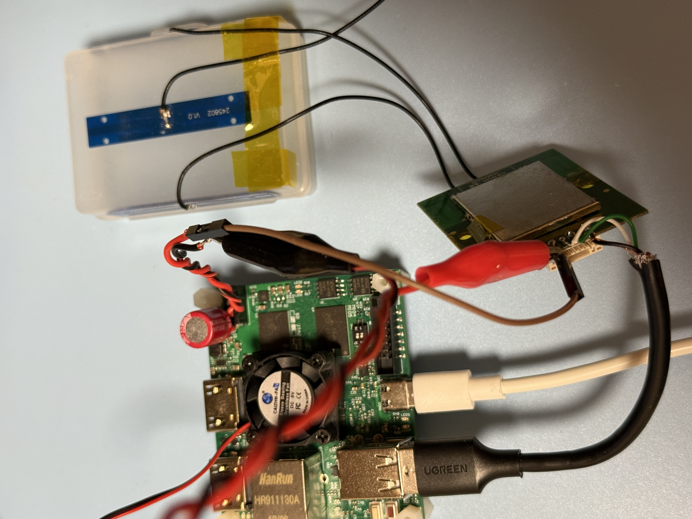
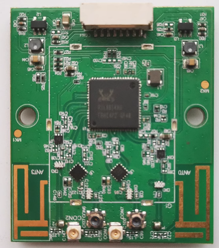

# RTL8814AU USB Dongle Testing

### Test USB Gear

|Test Board|USB Dongle HW|
|-|-|
|||

```
5.4.0-xilinx

DISTRIB_ID=Ubuntu
DISTRIB_RELEASE=18.04
DISTRIB_CODENAME=bionic
DISTRIB_DESCRIPTION="Ubuntu 18.04.5 LTS"

Architecture:        armv7l
Byte Order:          Little Endian
CPU(s):              2
On-line CPU(s) list: 0,1
Thread(s) per core:  1
Core(s) per socket:  2
Socket(s):           1
Vendor ID:           ARM
Model:               0
Model name:          Cortex-A9
Stepping:            r3p0
BogoMIPS:            666.66
Flags:               half thumb fastmult vfp edsp neon vfpv3 tls vfpd32
```

### USB Tree

```
Before driver is inserted.
/:  Bus 01.Port 1: Dev 1, Class=root_hub, Driver=ci_hdrc/1p, 480M
    |__ Port 1: Dev 2, If 0, Class=Hub, Driver=hub/2p, 480M
        |__ Port 1: Dev 3, If 0, Class=Vendor Specific Class, Driver=, 480M

After driver is inserted.
/:  Bus 01.Port 1: Dev 1, Class=root_hub, Driver=ci_hdrc/1p, 480M
    |__ Port 1: Dev 2, If 0, Class=Hub, Driver=hub/2p, 480M
```

<details>

<summary>USB Details</summary>

```

Bus 001 Device 002: ID 0424:2512 Standard Microsystems Corp. USB 2.0 Hub
Device Descriptor:
  bLength                18
  bDescriptorType         1
  bcdUSB               2.00
  bDeviceClass            9 Hub
  bDeviceSubClass         0 Unused
  bDeviceProtocol         2 TT per port
  bMaxPacketSize0        64
  idVendor           0x0424 Standard Microsystems Corp.
  idProduct          0x2512 USB 2.0 Hub
  bcdDevice            b.b3
  iManufacturer           0 
  iProduct                0 
  iSerial                 0 
  bNumConfigurations      1
  Configuration Descriptor:
    bLength                 9
    bDescriptorType         2
    wTotalLength           41
    bNumInterfaces          1
    bConfigurationValue     1
    iConfiguration          0 
    bmAttributes         0xe0
      Self Powered
      Remote Wakeup
    MaxPower                2mA
    Interface Descriptor:
      bLength                 9
      bDescriptorType         4
      bInterfaceNumber        0
      bAlternateSetting       0
      bNumEndpoints           1
      bInterfaceClass         9 Hub
      bInterfaceSubClass      0 Unused
      bInterfaceProtocol      1 Single TT
      iInterface              0 
      Endpoint Descriptor:
        bLength                 7
        bDescriptorType         5
        bEndpointAddress     0x81  EP 1 IN
        bmAttributes            3
          Transfer Type            Interrupt
          Synch Type               None
          Usage Type               Data
        wMaxPacketSize     0x0001  1x 1 bytes
        bInterval              12
    Interface Descriptor:
      bLength                 9
      bDescriptorType         4
      bInterfaceNumber        0
      bAlternateSetting       1
      bNumEndpoints           1
      bInterfaceClass         9 Hub
      bInterfaceSubClass      0 Unused
      bInterfaceProtocol      2 TT per port
      iInterface              0 
      Endpoint Descriptor:
        bLength                 7
        bDescriptorType         5
        bEndpointAddress     0x81  EP 1 IN
        bmAttributes            3
          Transfer Type            Interrupt
          Synch Type               None
          Usage Type               Data
        wMaxPacketSize     0x0001  1x 1 bytes
        bInterval              12
Hub Descriptor:
  bLength               9
  bDescriptorType      41
  nNbrPorts             2
  wHubCharacteristic 0x0009
    Per-port power switching
    Per-port overcurrent protection
    TT think time 8 FS bits
  bPwrOn2PwrGood       50 * 2 milli seconds
  bHubContrCurrent      1 milli Ampere
  DeviceRemovable    0x00
  PortPwrCtrlMask    0xff
 Hub Port Status:
   Port 1: 0000.0503 highspeed power enable connect
   Port 2: 0000.0100 power
Device Qualifier (for other device speed):
  bLength                10
  bDescriptorType         6
  bcdUSB               2.00
  bDeviceClass            9 Hub
  bDeviceSubClass         0 Unused
  bDeviceProtocol         0 Full speed (or root) hub
  bMaxPacketSize0        64
  bNumConfigurations      1
Device Status:     0x0001
  Self Powered

Bus 001 Device 004: ID 0bda:8813 Realtek Semiconductor Corp. 
Device Descriptor:
  bLength                18
  bDescriptorType         1
  bcdUSB               2.10
  bDeviceClass            0 (Defined at Interface level)
  bDeviceSubClass         0 
  bDeviceProtocol         0 
  bMaxPacketSize0        64
  idVendor           0x0bda Realtek Semiconductor Corp.
  idProduct          0x8813 
  bcdDevice            0.00
  iManufacturer           1 Realtek
  iProduct                2 802.11ac NIC
  iSerial                 3 123456
  bNumConfigurations      1
  Configuration Descriptor:
    bLength                 9
    bDescriptorType         2
    wTotalLength           53
    bNumInterfaces          1
    bConfigurationValue     1
    iConfiguration          0 
    bmAttributes         0xa0
      (Bus Powered)
      Remote Wakeup
    MaxPower              500mA
    Interface Descriptor:
      bLength                 9
      bDescriptorType         4
      bInterfaceNumber        0
      bAlternateSetting       0
      bNumEndpoints           5
      bInterfaceClass       255 Vendor Specific Class
      bInterfaceSubClass    255 Vendor Specific Subclass
      bInterfaceProtocol    255 Vendor Specific Protocol
      iInterface              0 
      Endpoint Descriptor:
        bLength                 7
        bDescriptorType         5
        bEndpointAddress     0x81  EP 1 IN
        bmAttributes            2
          Transfer Type            Bulk
          Synch Type               None
          Usage Type               Data
        wMaxPacketSize     0x0200  1x 512 bytes
        bInterval               0
      Endpoint Descriptor:
        bLength                 7
        bDescriptorType         5
        bEndpointAddress     0x02  EP 2 OUT
        bmAttributes            2
          Transfer Type            Bulk
          Synch Type               None
          Usage Type               Data
        wMaxPacketSize     0x0200  1x 512 bytes
        bInterval               0
      Endpoint Descriptor:
        bLength                 7
        bDescriptorType         5
        bEndpointAddress     0x03  EP 3 OUT
        bmAttributes            2
          Transfer Type            Bulk
          Synch Type               None
          Usage Type               Data
        wMaxPacketSize     0x0200  1x 512 bytes
        bInterval               0
      Endpoint Descriptor:
        bLength                 7
        bDescriptorType         5
        bEndpointAddress     0x04  EP 4 OUT
        bmAttributes            2
          Transfer Type            Bulk
          Synch Type               None
          Usage Type               Data
        wMaxPacketSize     0x0200  1x 512 bytes
        bInterval               0
      Endpoint Descriptor:
        bLength                 7
        bDescriptorType         5
        bEndpointAddress     0x85  EP 5 IN
        bmAttributes            3
          Transfer Type            Interrupt
          Synch Type               None
          Usage Type               Data
        wMaxPacketSize     0x0040  1x 64 bytes
        bInterval               1
Binary Object Store Descriptor:
  bLength                 5
  bDescriptorType        15
  wTotalLength           22
  bNumDeviceCaps          2
  USB 2.0 Extension Device Capability:
    bLength                 7
    bDescriptorType        16
    bDevCapabilityType      2
    bmAttributes   0x00000002
      Link Power Management (LPM) Supported
  SuperSpeed USB Device Capability:
    bLength                10
    bDescriptorType        16
    bDevCapabilityType      3
    bmAttributes         0x00
    wSpeedsSupported   0x000e
      Device can operate at Full Speed (12Mbps)
      Device can operate at High Speed (480Mbps)
      Device can operate at SuperSpeed (5Gbps)
    bFunctionalitySupport   1
      Lowest fully-functional device speed is Full Speed (12Mbps)
    bU1DevExitLat          10 micro seconds
    bU2DevExitLat        1023 micro seconds
Device Status:     0x0002
  (Bus Powered)
  Remote Wakeup Enabled
```

</details>

### Driver Load

The driver is loaded via "insmod"

```
Module                  Size  Used by
rtw_8814au             16384  0
rtw_8814a             233472  1 rtw_8814au
rtw_usb                24576  1 rtw_8814au
rtw_core              172032  2 rtw_8814a,rtw_usb
```

### iw list

<details>

<summary>iw list</summary>

```
Wiphy phy1
	max # scan SSIDs: 4
	max scan IEs length: 2243 bytes
	max # sched scan SSIDs: 0
	max # match sets: 0
	max # scan plans: 1
	max scan plan interval: -1
	max scan plan iterations: 0
	Retry short limit: 7
	Retry long limit: 4
	Coverage class: 0 (up to 0m)
	Device supports T-DLS.
	Supported Ciphers:
		* WEP40 (00-0f-ac:1)
		* WEP104 (00-0f-ac:5)
		* TKIP (00-0f-ac:2)
		* CCMP-128 (00-0f-ac:4)
		* CCMP-256 (00-0f-ac:10)
		* GCMP-128 (00-0f-ac:8)
		* GCMP-256 (00-0f-ac:9)
		* CMAC (00-0f-ac:6)
		* CMAC-256 (00-0f-ac:13)
		* GMAC-128 (00-0f-ac:11)
		* GMAC-256 (00-0f-ac:12)
	Available Antennas: TX 0x3 RX 0x3
	Configured Antennas: TX 0x3 RX 0x3
	Supported interface modes:
		 * IBSS
		 * managed
		 * AP
		 * AP/VLAN
		 * monitor
		 * P2P-client
		 * P2P-GO
	Band 1:
		Capabilities: 0x196f
			RX LDPC
			HT20/HT40
			SM Power Save disabled
			RX HT20 SGI
			RX HT40 SGI
			RX STBC 1-stream
			Max AMSDU length: 7935 bytes
			DSSS/CCK HT40
		Maximum RX AMPDU length 65535 bytes (exponent: 0x003)
		Minimum RX AMPDU time spacing: 2 usec (0x04)
		HT Max RX data rate: 300 Mbps
		HT TX/RX MCS rate indexes supported: 0-15, 32
		Bitrates (non-HT):
			* 1.0 Mbps
			* 2.0 Mbps
			* 5.5 Mbps
			* 11.0 Mbps
			* 6.0 Mbps
			* 9.0 Mbps
			* 12.0 Mbps
			* 18.0 Mbps
			* 24.0 Mbps
			* 36.0 Mbps
			* 48.0 Mbps
			* 54.0 Mbps
		Frequencies:
			* 2412 MHz [1] (20.0 dBm)
			* 2417 MHz [2] (20.0 dBm)
			* 2422 MHz [3] (20.0 dBm)
			* 2427 MHz [4] (20.0 dBm)
			* 2432 MHz [5] (20.0 dBm)
			* 2437 MHz [6] (20.0 dBm)
			* 2442 MHz [7] (20.0 dBm)
			* 2447 MHz [8] (20.0 dBm)
			* 2452 MHz [9] (20.0 dBm)
			* 2457 MHz [10] (20.0 dBm)
			* 2462 MHz [11] (20.0 dBm)
			* 2467 MHz [12] (20.0 dBm) (no IR)
			* 2472 MHz [13] (20.0 dBm) (no IR)
			* 2484 MHz [14] (20.0 dBm) (no IR)
	Band 2:
		Capabilities: 0x196f
			RX LDPC
			HT20/HT40
			SM Power Save disabled
			RX HT20 SGI
			RX HT40 SGI
			RX STBC 1-stream
			Max AMSDU length: 7935 bytes
			DSSS/CCK HT40
		Maximum RX AMPDU length 65535 bytes (exponent: 0x003)
		Minimum RX AMPDU time spacing: 2 usec (0x04)
		HT Max RX data rate: 300 Mbps
		HT TX/RX MCS rate indexes supported: 0-15, 32
		VHT Capabilities (0x03d071b2):
			Max MPDU length: 11454
			Supported Channel Width: neither 160 nor 80+80
			RX LDPC
			short GI (80 MHz)
			TX STBC
			SU Beamformee
			MU Beamformee
			+HTC-VHT
		VHT RX MCS set:
			1 streams: MCS 0-9
			2 streams: MCS 0-9
			3 streams: not supported
			4 streams: not supported
			5 streams: not supported
			6 streams: not supported
			7 streams: not supported
			8 streams: not supported
		VHT RX highest supported: 780 Mbps
		VHT TX MCS set:
			1 streams: MCS 0-9
			2 streams: MCS 0-9
			3 streams: not supported
			4 streams: not supported
			5 streams: not supported
			6 streams: not supported
			7 streams: not supported
			8 streams: not supported
		VHT TX highest supported: 780 Mbps
		Bitrates (non-HT):
			* 6.0 Mbps
			* 9.0 Mbps
			* 12.0 Mbps
			* 18.0 Mbps
			* 24.0 Mbps
			* 36.0 Mbps
			* 48.0 Mbps
			* 54.0 Mbps
		Frequencies:
			* 5180 MHz [36] (20.0 dBm) (no IR)
			* 5200 MHz [40] (20.0 dBm) (no IR)
			* 5220 MHz [44] (20.0 dBm) (no IR)
			* 5240 MHz [48] (20.0 dBm) (no IR)
			* 5260 MHz [52] (20.0 dBm) (no IR, radar detection)
			* 5280 MHz [56] (20.0 dBm) (no IR, radar detection)
			* 5300 MHz [60] (20.0 dBm) (no IR, radar detection)
			* 5320 MHz [64] (20.0 dBm) (no IR, radar detection)
			* 5500 MHz [100] (20.0 dBm) (no IR, radar detection)
			* 5520 MHz [104] (20.0 dBm) (no IR, radar detection)
			* 5540 MHz [108] (20.0 dBm) (no IR, radar detection)
			* 5560 MHz [112] (20.0 dBm) (no IR, radar detection)
			* 5580 MHz [116] (20.0 dBm) (no IR, radar detection)
			* 5600 MHz [120] (20.0 dBm) (no IR, radar detection)
			* 5620 MHz [124] (20.0 dBm) (no IR, radar detection)
			* 5640 MHz [128] (20.0 dBm) (no IR, radar detection)
			* 5660 MHz [132] (20.0 dBm) (no IR, radar detection)
			* 5680 MHz [136] (20.0 dBm) (no IR, radar detection)
			* 5700 MHz [140] (20.0 dBm) (no IR, radar detection)
			* 5720 MHz [144] (20.0 dBm) (no IR, radar detection)
			* 5745 MHz [149] (20.0 dBm) (no IR)
			* 5765 MHz [153] (20.0 dBm) (no IR)
			* 5785 MHz [157] (20.0 dBm) (no IR)
			* 5805 MHz [161] (20.0 dBm) (no IR)
			* 5825 MHz [165] (20.0 dBm) (no IR)
	Supported commands:
		 * new_interface
		 * set_interface
		 * new_key
		 * start_ap
		 * new_station
		 * set_bss
		 * authenticate
		 * associate
		 * deauthenticate
		 * disassociate
		 * join_ibss
		 * set_tx_bitrate_mask
		 * frame
		 * frame_wait_cancel
		 * set_wiphy_netns
		 * set_channel
		 * set_wds_peer
		 * tdls_mgmt
		 * tdls_oper
		 * probe_client
		 * set_noack_map
		 * register_beacons
		 * start_p2p_device
		 * set_mcast_rate
		 * connect
		 * disconnect
		 * set_qos_map
		 * set_multicast_to_unicast
	Supported TX frame types:
		 * IBSS: 0x00 0x10 0x20 0x30 0x40 0x50 0x60 0x70 0x80 0x90 0xa0 0xb0 0xc0 0xd0 0xe0 0xf0
		 * managed: 0x00 0x10 0x20 0x30 0x40 0x50 0x60 0x70 0x80 0x90 0xa0 0xb0 0xc0 0xd0 0xe0 0xf0
		 * AP: 0x00 0x10 0x20 0x30 0x40 0x50 0x60 0x70 0x80 0x90 0xa0 0xb0 0xc0 0xd0 0xe0 0xf0
		 * AP/VLAN: 0x00 0x10 0x20 0x30 0x40 0x50 0x60 0x70 0x80 0x90 0xa0 0xb0 0xc0 0xd0 0xe0 0xf0
		 * mesh point: 0x00 0x10 0x20 0x30 0x40 0x50 0x60 0x70 0x80 0x90 0xa0 0xb0 0xc0 0xd0 0xe0 0xf0
		 * P2P-client: 0x00 0x10 0x20 0x30 0x40 0x50 0x60 0x70 0x80 0x90 0xa0 0xb0 0xc0 0xd0 0xe0 0xf0
		 * P2P-GO: 0x00 0x10 0x20 0x30 0x40 0x50 0x60 0x70 0x80 0x90 0xa0 0xb0 0xc0 0xd0 0xe0 0xf0
		 * P2P-device: 0x00 0x10 0x20 0x30 0x40 0x50 0x60 0x70 0x80 0x90 0xa0 0xb0 0xc0 0xd0 0xe0 0xf0
	Supported RX frame types:
		 * IBSS: 0x40 0xb0 0xc0 0xd0
		 * managed: 0x40 0xd0
		 * AP: 0x00 0x20 0x40 0xa0 0xb0 0xc0 0xd0
		 * AP/VLAN: 0x00 0x20 0x40 0xa0 0xb0 0xc0 0xd0
		 * mesh point: 0xb0 0xc0 0xd0
		 * P2P-client: 0x40 0xd0
		 * P2P-GO: 0x00 0x20 0x40 0xa0 0xb0 0xc0 0xd0
		 * P2P-device: 0x40 0xd0
	software interface modes (can always be added):
		 * AP/VLAN
		 * monitor
	valid interface combinations:
		 * #{ managed } <= 1, #{ AP, P2P-client, P2P-GO } <= 1,
		   total <= 2, #channels <= 1
	HT Capability overrides:
		 * MCS: ff ff ff ff ff ff ff ff ff ff
		 * maximum A-MSDU length
		 * supported channel width
		 * short GI for 40 MHz
		 * max A-MPDU length exponent
		 * min MPDU start spacing
	Device supports TX status socket option.
	Device supports HT-IBSS.
	Device supports SAE with AUTHENTICATE command
	Device supports scan flush.
	Device supports per-vif TX power setting
	Driver supports full state transitions for AP/GO clients
	Driver supports a userspace MPM
	Device supports configuring vdev MAC-addr on create.
```

</details>

### Network Manager - Band 2.4

```
wlan0: flags=4163<UP,BROADCAST,RUNNING,MULTICAST>  mtu 1500
        inet 192.168.1.11  netmask 255.255.252.0  broadcast 192.168.3.255
        RX packets 120  bytes 17673 (17.6 KB)
        RX errors 0  dropped 0  overruns 0  frame 0
        TX packets 110  bytes 18263 (18.2 KB)
        TX errors 0  dropped 0 overruns 0  carrier 0  collisions 0
```

### iwconfig 2.4

```
wlan0     IEEE 802.11  ESSID:""  
          Mode:Managed  Frequency:2.462 GHz  
          Bit Rate=243 Mb/s   Tx-Power=20 dBm   
          Retry short limit:7   RTS thr:off   Fragment thr:off
          Encryption key:off
          Power Management:off
          Link Quality=50/70  Signal level=-60 dBm  
          Rx invalid nwid:0  Rx invalid crypt:0  Rx invalid frag:0
          Tx excessive retries:0  Invalid misc:1   Missed beacon:0

```

### Network Speed Test via Ookla - Band 2.4

```
Retrieving speedtest.net configuration...
Retrieving speedtest.net server list...
Selecting best server based on ping...
Testing download speed................................................................................
Download: 40.92 Mbit/s
Testing upload speed......................................................................................................
Upload: 3.89 Mbit/s
```

### Network Ping Tests - Band 2.4

#### DNS-Ping

```
PING 8.8.8.8 (8.8.8.8) 56(84) bytes of data.
64 bytes from 8.8.8.8: icmp_seq=1 ttl=118 time=19.9 ms
64 bytes from 8.8.8.8: icmp_seq=2 ttl=118 time=10.1 ms
64 bytes from 8.8.8.8: icmp_seq=3 ttl=118 time=18.9 ms
64 bytes from 8.8.8.8: icmp_seq=4 ttl=118 time=4.48 ms
64 bytes from 8.8.8.8: icmp_seq=5 ttl=118 time=3.94 ms
64 bytes from 8.8.8.8: icmp_seq=6 ttl=118 time=4.22 ms
64 bytes from 8.8.8.8: icmp_seq=7 ttl=118 time=7.36 ms
64 bytes from 8.8.8.8: icmp_seq=8 ttl=118 time=5.97 ms
64 bytes from 8.8.8.8: icmp_seq=9 ttl=118 time=4.20 ms
64 bytes from 8.8.8.8: icmp_seq=10 ttl=118 time=4.38 ms
64 bytes from 8.8.8.8: icmp_seq=11 ttl=118 time=6.19 ms
64 bytes from 8.8.8.8: icmp_seq=12 ttl=118 time=5.93 ms
64 bytes from 8.8.8.8: icmp_seq=13 ttl=118 time=5.46 ms
64 bytes from 8.8.8.8: icmp_seq=14 ttl=118 time=4.09 ms
64 bytes from 8.8.8.8: icmp_seq=15 ttl=118 time=3.97 ms
64 bytes from 8.8.8.8: icmp_seq=16 ttl=118 time=4.88 ms
64 bytes from 8.8.8.8: icmp_seq=17 ttl=118 time=4.70 ms
64 bytes from 8.8.8.8: icmp_seq=18 ttl=118 time=7.25 ms
64 bytes from 8.8.8.8: icmp_seq=19 ttl=118 time=7.61 ms
64 bytes from 8.8.8.8: icmp_seq=20 ttl=118 time=3.88 ms

--- 8.8.8.8 ping statistics ---
20 packets transmitted, 20 received, 0% packet loss, time 19029ms
rtt min/avg/max/mdev = 3.880/6.882/19.916/4.474 ms
```

#### Self-Ping 

```
PING 192.168.1.11 (192.168.1.11) 10000(10028) bytes of data.
10008 bytes from 192.168.1.11: icmp_seq=1 ttl=64 time=0.138 ms
10008 bytes from 192.168.1.11: icmp_seq=2 ttl=64 time=0.119 ms
10008 bytes from 192.168.1.11: icmp_seq=3 ttl=64 time=0.123 ms
10008 bytes from 192.168.1.11: icmp_seq=4 ttl=64 time=0.116 ms
10008 bytes from 192.168.1.11: icmp_seq=5 ttl=64 time=0.119 ms
10008 bytes from 192.168.1.11: icmp_seq=6 ttl=64 time=0.113 ms
10008 bytes from 192.168.1.11: icmp_seq=7 ttl=64 time=0.119 ms
10008 bytes from 192.168.1.11: icmp_seq=8 ttl=64 time=0.124 ms
10008 bytes from 192.168.1.11: icmp_seq=9 ttl=64 time=0.115 ms
10008 bytes from 192.168.1.11: icmp_seq=10 ttl=64 time=0.110 ms
10008 bytes from 192.168.1.11: icmp_seq=11 ttl=64 time=0.109 ms
10008 bytes from 192.168.1.11: icmp_seq=12 ttl=64 time=0.109 ms
10008 bytes from 192.168.1.11: icmp_seq=13 ttl=64 time=0.125 ms
10008 bytes from 192.168.1.11: icmp_seq=14 ttl=64 time=0.122 ms
10008 bytes from 192.168.1.11: icmp_seq=15 ttl=64 time=0.115 ms
10008 bytes from 192.168.1.11: icmp_seq=16 ttl=64 time=0.113 ms
10008 bytes from 192.168.1.11: icmp_seq=17 ttl=64 time=0.109 ms
10008 bytes from 192.168.1.11: icmp_seq=18 ttl=64 time=0.121 ms
10008 bytes from 192.168.1.11: icmp_seq=19 ttl=64 time=0.113 ms
10008 bytes from 192.168.1.11: icmp_seq=20 ttl=64 time=0.120 ms

--- 192.168.1.11 ping statistics ---
20 packets transmitted, 20 received, 0% packet loss, time 19735ms
rtt min/avg/max/mdev = 0.109/0.117/0.138/0.013 ms
```

### Server & Client Test via iperf3 (PC-Router-DUT)

<details>

<summary>iperf3</summary>

```
-----------------------------------------------------------
Server listening on 5201
-----------------------------------------------------------
Accepted connection from 192.168.1.4, port 56077
[  5] local 192.168.1.11 port 5201 connected to 192.168.1.4 port 56078
[ ID] Interval           Transfer     Bandwidth       Retr  Cwnd
[  5]   0.00-1.00   sec  6.82 MBytes  57.1 Mbits/sec    0    259 KBytes       
[  5]   1.00-2.00   sec  7.29 MBytes  61.3 Mbits/sec    0    398 KBytes       
[  5]   2.00-3.00   sec  7.72 MBytes  64.8 Mbits/sec    0    518 KBytes       
[  5]   3.00-4.00   sec  6.37 MBytes  53.4 Mbits/sec    0    518 KBytes       
[  5]   4.00-5.00   sec  5.39 MBytes  45.2 Mbits/sec    0    518 KBytes       
[  5]   5.00-6.00   sec  5.39 MBytes  45.2 Mbits/sec    0    518 KBytes       
[  5]   6.00-7.00   sec  7.29 MBytes  61.2 Mbits/sec    0    518 KBytes       
[  5]   7.00-8.00   sec  6.25 MBytes  52.4 Mbits/sec    0    518 KBytes       
[  5]   8.00-9.00   sec  2.39 MBytes  20.0 Mbits/sec    1    392 KBytes       
[  5]   9.00-10.00  sec  4.66 MBytes  39.1 Mbits/sec    1    304 KBytes       
[  5]  10.00-11.00  sec  5.27 MBytes  44.1 Mbits/sec    1    227 KBytes       
[  5]  11.00-12.00  sec  5.58 MBytes  46.9 Mbits/sec    1    181 KBytes       
[  5]  12.00-13.00  sec  6.98 MBytes  58.6 Mbits/sec    0    210 KBytes       
[  5]  13.00-14.00  sec  7.35 MBytes  61.7 Mbits/sec    0    232 KBytes       
[  5]  14.00-15.00  sec  4.78 MBytes  40.1 Mbits/sec    0    250 KBytes       
[  5]  15.00-16.00  sec  5.51 MBytes  46.3 Mbits/sec    0    264 KBytes       
[  5]  16.00-17.00  sec  6.86 MBytes  57.6 Mbits/sec    0    284 KBytes       
[  5]  17.00-18.00  sec  7.11 MBytes  59.6 Mbits/sec    0    302 KBytes       
[  5]  18.00-19.00  sec  5.08 MBytes  42.7 Mbits/sec    0    314 KBytes       
[  5]  19.00-20.00  sec  3.68 MBytes  30.8 Mbits/sec    0    324 KBytes       
[  5]  20.00-21.00  sec  5.70 MBytes  47.8 Mbits/sec    0    335 KBytes       
[  5]  21.00-22.00  sec  5.15 MBytes  43.2 Mbits/sec    0    368 KBytes       
[  5]  22.00-23.00  sec  5.02 MBytes  42.1 Mbits/sec    0    456 KBytes       
[  5]  23.00-24.00  sec  1.16 MBytes  9.76 Mbits/sec    0    479 KBytes       
[  5]  24.00-25.00  sec  0.00 Bytes  0.00 bits/sec    1    479 KBytes       
[  5]  25.00-26.00  sec  1.16 MBytes  9.77 Mbits/sec    0    479 KBytes       
[  5]  26.00-27.00  sec  0.00 Bytes  0.00 bits/sec    0    479 KBytes       
[  5]  27.00-28.00  sec   565 KBytes  4.63 Mbits/sec    0    479 KBytes       
[  5]  28.00-29.00  sec  1.10 MBytes  9.25 Mbits/sec    0    479 KBytes       
[  5]  29.00-30.00  sec   565 KBytes  4.62 Mbits/sec    0    479 KBytes       
[  5]  30.00-30.05  sec  0.00 Bytes  0.00 bits/sec    0    479 KBytes       
- - - - - - - - - - - - - - - - - - - - - - - - -
[ ID] Interval           Transfer     Bandwidth       Retr
[  5]   0.00-30.05  sec   138 MBytes  38.6 Mbits/sec    5             sender
[  5]   0.00-30.05  sec  0.00 Bytes  0.00 bits/sec                  receiver
-----------------------------------------------------------
Server listening on 5201
-----------------------------------------------------------
iperf3: interrupt - the server has terminated
[  169.744731] rtw_core: loading out-of-tree module taints kernel.
[  170.049452] rtw_8814au 1-1.1:1.0: Firmware version 33.6.0, H2C version 6
[  170.367303] usbcore: registered new interface driver rtw_8814au
[  171.026841] rtw_8814au 1-1.1:1.0: Firmware version 33.6.0, H2C version 6
```

</details>

### Network Manager - Band 5G

```
wlan0: flags=4163<UP,BROADCAST,RUNNING,MULTICAST>  mtu 1500
        inet 192.168.1.11  netmask 255.255.252.0  broadcast 192.168.3.255
        RX packets 50785  bytes 55119911 (55.1 MB)
        RX errors 0  dropped 0  overruns 0  frame 0
        TX packets 116950  bytes 159351528 (159.3 MB)
        TX errors 0  dropped 0 overruns 0  carrier 0  collisions 0
```

### iwconfig 5G

```
wlan0     IEEE 802.11  ESSID:""  
          Mode:Managed  Frequency:5.805 GHz  
          Bit Rate=390 Mb/s   Tx-Power=30 dBm   
          Retry short limit:7   RTS thr:off   Fragment thr:off
          Encryption key:off
          Power Management:off
          Link Quality=40/70  Signal level=-70 dBm  
          Rx invalid nwid:0  Rx invalid crypt:0  Rx invalid frag:0
          Tx excessive retries:0  Invalid misc:0   Missed beacon:0

```

### Network Speed Test via Ookla - Band 5G

```
Retrieving speedtest.net configuration...
Retrieving speedtest.net server list...
Selecting best server based on ping...
Testing download speed................................................................................
Download: 167.65 Mbit/s
Testing upload speed......................................................................................................
Upload: 3.93 Mbit/s
```

### Network Ping Tests - Band 5G

#### DNS-Ping

```
PING 8.8.8.8 (8.8.8.8) 56(84) bytes of data.
64 bytes from 8.8.8.8: icmp_seq=1 ttl=118 time=4.59 ms
64 bytes from 8.8.8.8: icmp_seq=2 ttl=118 time=3.78 ms
64 bytes from 8.8.8.8: icmp_seq=3 ttl=118 time=3.85 ms
64 bytes from 8.8.8.8: icmp_seq=4 ttl=118 time=3.99 ms
64 bytes from 8.8.8.8: icmp_seq=5 ttl=118 time=3.88 ms
64 bytes from 8.8.8.8: icmp_seq=6 ttl=118 time=4.38 ms
64 bytes from 8.8.8.8: icmp_seq=7 ttl=118 time=4.99 ms
64 bytes from 8.8.8.8: icmp_seq=8 ttl=118 time=4.20 ms
64 bytes from 8.8.8.8: icmp_seq=9 ttl=118 time=3.83 ms
64 bytes from 8.8.8.8: icmp_seq=10 ttl=118 time=5.13 ms
64 bytes from 8.8.8.8: icmp_seq=11 ttl=118 time=5.01 ms
64 bytes from 8.8.8.8: icmp_seq=12 ttl=118 time=5.38 ms
64 bytes from 8.8.8.8: icmp_seq=13 ttl=118 time=4.06 ms
64 bytes from 8.8.8.8: icmp_seq=14 ttl=118 time=5.35 ms
64 bytes from 8.8.8.8: icmp_seq=15 ttl=118 time=4.98 ms
64 bytes from 8.8.8.8: icmp_seq=16 ttl=118 time=3.87 ms
64 bytes from 8.8.8.8: icmp_seq=17 ttl=118 time=5.78 ms
64 bytes from 8.8.8.8: icmp_seq=18 ttl=118 time=7.42 ms
64 bytes from 8.8.8.8: icmp_seq=19 ttl=118 time=4.31 ms
64 bytes from 8.8.8.8: icmp_seq=20 ttl=118 time=4.03 ms

--- 8.8.8.8 ping statistics ---
20 packets transmitted, 20 received, 0% packet loss, time 19026ms
rtt min/avg/max/mdev = 3.780/4.644/7.429/0.880 ms
```

#### Self-Ping 

```
PING 192.168.1.11 (192.168.1.11) 10000(10028) bytes of data.
10008 bytes from 192.168.1.11: icmp_seq=1 ttl=64 time=0.148 ms
10008 bytes from 192.168.1.11: icmp_seq=2 ttl=64 time=0.125 ms
10008 bytes from 192.168.1.11: icmp_seq=3 ttl=64 time=0.120 ms
10008 bytes from 192.168.1.11: icmp_seq=4 ttl=64 time=0.126 ms
10008 bytes from 192.168.1.11: icmp_seq=5 ttl=64 time=0.122 ms
10008 bytes from 192.168.1.11: icmp_seq=6 ttl=64 time=0.129 ms
10008 bytes from 192.168.1.11: icmp_seq=7 ttl=64 time=0.138 ms
10008 bytes from 192.168.1.11: icmp_seq=8 ttl=64 time=0.122 ms
10008 bytes from 192.168.1.11: icmp_seq=9 ttl=64 time=0.135 ms
10008 bytes from 192.168.1.11: icmp_seq=10 ttl=64 time=0.117 ms
10008 bytes from 192.168.1.11: icmp_seq=11 ttl=64 time=0.118 ms
10008 bytes from 192.168.1.11: icmp_seq=12 ttl=64 time=0.124 ms
10008 bytes from 192.168.1.11: icmp_seq=13 ttl=64 time=0.132 ms
10008 bytes from 192.168.1.11: icmp_seq=14 ttl=64 time=0.124 ms
10008 bytes from 192.168.1.11: icmp_seq=15 ttl=64 time=0.121 ms
10008 bytes from 192.168.1.11: icmp_seq=16 ttl=64 time=0.123 ms
10008 bytes from 192.168.1.11: icmp_seq=17 ttl=64 time=0.132 ms
10008 bytes from 192.168.1.11: icmp_seq=18 ttl=64 time=0.139 ms
10008 bytes from 192.168.1.11: icmp_seq=19 ttl=64 time=0.120 ms
10008 bytes from 192.168.1.11: icmp_seq=20 ttl=64 time=0.125 ms

--- 192.168.1.11 ping statistics ---
20 packets transmitted, 20 received, 0% packet loss, time 19752ms
rtt min/avg/max/mdev = 0.117/0.127/0.148/0.007 ms
```

### Server & Client Test via iperf3 (PC-Router-DUT)

<details>

<summary>iperf3</summary>

```
-----------------------------------------------------------
Server listening on 5201
-----------------------------------------------------------
Accepted connection from 192.168.1.4, port 56215
[  5] local 192.168.1.11 port 5201 connected to 192.168.1.4 port 56216
[ ID] Interval           Transfer     Bandwidth       Retr  Cwnd
[  5]   0.00-1.00   sec  13.9 MBytes   117 Mbits/sec    0    741 KBytes       
[  5]   1.00-2.00   sec  17.0 MBytes   143 Mbits/sec    0   1.01 MBytes       
[  5]   2.00-3.01   sec  17.3 MBytes   145 Mbits/sec    0   1.01 MBytes       
[  5]   3.01-4.00   sec  16.1 MBytes   136 Mbits/sec    0   1.01 MBytes       
[  5]   4.00-5.00   sec  15.6 MBytes   131 Mbits/sec    0   1.01 MBytes       
[  5]   5.00-6.00   sec  17.7 MBytes   148 Mbits/sec    0   1.01 MBytes       
[  5]   6.00-7.00   sec  15.1 MBytes   127 Mbits/sec    0   1.01 MBytes       
[  5]   7.00-8.00   sec  15.3 MBytes   128 Mbits/sec    0   1.01 MBytes       
[  5]   8.00-9.00   sec  16.5 MBytes   139 Mbits/sec    0   1.01 MBytes       
[  5]   9.00-10.00  sec  14.9 MBytes   125 Mbits/sec  468    807 KBytes       
[  5]  10.00-11.00  sec  15.4 MBytes   129 Mbits/sec    0    884 KBytes       
[  5]  11.00-12.00  sec  16.4 MBytes   138 Mbits/sec    0    942 KBytes       
[  5]  12.00-13.00  sec  15.3 MBytes   129 Mbits/sec    0    984 KBytes       
[  5]  13.00-14.00  sec  17.1 MBytes   144 Mbits/sec    0   1009 KBytes       
[  5]  14.00-15.00  sec  17.8 MBytes   149 Mbits/sec    0   1024 KBytes       
[  5]  15.00-16.00  sec  16.6 MBytes   139 Mbits/sec    0   1.00 MBytes       
[  5]  16.00-17.00  sec  18.9 MBytes   158 Mbits/sec    0   1.00 MBytes       
[  5]  17.00-18.00  sec  17.3 MBytes   146 Mbits/sec    0   1.00 MBytes       
[  5]  18.00-19.00  sec  17.7 MBytes   148 Mbits/sec    0   1.00 MBytes       
[  5]  19.00-20.00  sec  16.9 MBytes   142 Mbits/sec    0   1.00 MBytes       
[  5]  20.00-21.00  sec  18.1 MBytes   152 Mbits/sec    0   1.00 MBytes       
[  5]  21.00-22.00  sec  17.4 MBytes   146 Mbits/sec    0   1.00 MBytes       
[  5]  22.00-23.00  sec  17.0 MBytes   143 Mbits/sec    0   1.00 MBytes       
[  5]  23.00-24.00  sec  18.5 MBytes   155 Mbits/sec    0   1.00 MBytes       
[  5]  24.00-25.00  sec  16.1 MBytes   135 Mbits/sec    0   1.00 MBytes       
[  5]  25.00-26.00  sec  16.5 MBytes   138 Mbits/sec    0   1.00 MBytes       
[  5]  26.00-27.00  sec  17.4 MBytes   146 Mbits/sec    0   1.00 MBytes       
[  5]  27.00-28.00  sec  17.1 MBytes   143 Mbits/sec    0   1.00 MBytes       
[  5]  28.00-29.00  sec  16.1 MBytes   135 Mbits/sec    0   1.00 MBytes       
[  5]  29.00-30.00  sec  17.7 MBytes   148 Mbits/sec    0   1.00 MBytes       
[  5]  30.00-30.05  sec  0.00 Bytes  0.00 bits/sec    0   1.00 MBytes       
- - - - - - - - - - - - - - - - - - - - - - - - -
[ ID] Interval           Transfer     Bandwidth       Retr
[  5]   0.00-30.05  sec   501 MBytes   140 Mbits/sec  468             sender
[  5]   0.00-30.05  sec  0.00 Bytes  0.00 bits/sec                  receiver
-----------------------------------------------------------
Server listening on 5201
-----------------------------------------------------------
iperf3: interrupt - the server has terminated
[  169.744731] rtw_core: loading out-of-tree module taints kernel.
[  170.049452] rtw_8814au 1-1.1:1.0: Firmware version 33.6.0, H2C version 6
[  170.367303] usbcore: registered new interface driver rtw_8814au
[  171.026841] rtw_8814au 1-1.1:1.0: Firmware version 33.6.0, H2C version 6
```

</details>

### AP Test

#### hostapd.conf

Setup the configuration at /etc/hostapd/hostapd.conf

```
interface=wlan0
driver=nl80211
ieee80211n=1
hw_mode=g
channel=6
ssid=AP-TEST
wpa=2
wpa_passphrase=12345678
wpa_key_mgmt=WPA-PSK
rsn_pairwise=CCMP TKIP
wpa_pairwise=TKIP CCMP
```

#### udhcpd.conf

```
start 192.168.175.2
end 192.168.175.254
interface wlan0
max_leases 234
opt router 192.168.175.1
```

#### Start AP Test

```
sudo hostapd /etc/hostapd/hostapd.conf -B
Using interface wlan0 with hwaddr and ssid "AP-NAME"
wlan0: interface state UNINITIALIZED->ENABLED
wlan0: AP-ENABLED
```

#### Server & Client Test via iperf3 (PC-DUT)

<details>

<summary>iperf3</summary>

```
-----------------------------------------------------------
Server listening on 5201
-----------------------------------------------------------
Accepted connection from 192.168.175.86, port 56258
[  5] local 192.168.175.1 port 5201 connected to 192.168.175.86 port 56259
[ ID] Interval           Transfer     Bandwidth       Retr  Cwnd
[  5]   0.00-1.00   sec  2.05 MBytes  17.2 Mbits/sec    0    128 KBytes       
[  5]   1.00-2.00   sec  3.09 MBytes  26.0 Mbits/sec    0    135 KBytes       
[  5]   2.00-3.00   sec  3.19 MBytes  26.7 Mbits/sec    0    135 KBytes       
[  5]   3.00-4.00   sec  2.08 MBytes  17.5 Mbits/sec    0    135 KBytes       
[  5]   4.00-5.00   sec  2.88 MBytes  24.2 Mbits/sec    0    135 KBytes       
[  5]   5.00-6.00   sec  2.94 MBytes  24.7 Mbits/sec    0    135 KBytes       
[  5]   6.00-7.00   sec  2.76 MBytes  23.1 Mbits/sec    0    135 KBytes       
[  5]   7.00-8.00   sec  2.76 MBytes  23.1 Mbits/sec    0    135 KBytes       
[  5]   8.00-9.00   sec  2.88 MBytes  24.1 Mbits/sec    0    318 KBytes       
[  5]   9.00-10.00  sec  4.10 MBytes  34.4 Mbits/sec    0    318 KBytes       
[  5]  10.00-11.00  sec  5.76 MBytes  48.3 Mbits/sec    0    318 KBytes       
[  5]  11.00-12.00  sec  6.80 MBytes  57.0 Mbits/sec    0    318 KBytes       
[  5]  12.00-13.00  sec  6.19 MBytes  51.9 Mbits/sec    0    318 KBytes       
[  5]  13.00-14.00  sec  5.82 MBytes  48.8 Mbits/sec    0    318 KBytes       
[  5]  14.00-15.00  sec  7.41 MBytes  62.2 Mbits/sec    0    318 KBytes       
[  5]  15.00-16.00  sec  7.23 MBytes  60.6 Mbits/sec    0    318 KBytes       
[  5]  16.00-17.00  sec  7.96 MBytes  66.8 Mbits/sec    0    318 KBytes       
[  5]  17.00-18.00  sec  3.61 MBytes  30.3 Mbits/sec    2    318 KBytes       
[  5]  18.00-19.00  sec   753 KBytes  6.16 Mbits/sec    0    318 KBytes       
[  5]  19.00-20.00  sec  0.00 Bytes  0.00 bits/sec    0    318 KBytes       
[  5]  20.00-21.00  sec  0.00 Bytes  0.00 bits/sec    0    318 KBytes       
[  5]  21.00-22.00  sec  1.10 MBytes  9.26 Mbits/sec    0    318 KBytes       
[  5]  22.00-23.00  sec  1.35 MBytes  11.3 Mbits/sec    0    238 KBytes       
[  5]  23.00-24.00  sec   878 KBytes  7.20 Mbits/sec    1   12.8 KBytes       
[  5]  24.00-25.00  sec  3.06 MBytes  25.7 Mbits/sec    4    262 KBytes       
[  5]  25.00-26.00  sec  4.29 MBytes  36.0 Mbits/sec    0    262 KBytes       
[  5]  26.00-27.00  sec   502 KBytes  4.11 Mbits/sec    5   1.43 KBytes       
[  5]  27.00-28.00  sec   376 KBytes  3.08 Mbits/sec    0    262 KBytes       
[  5]  28.00-29.00  sec   376 KBytes  3.08 Mbits/sec  103    262 KBytes       
[  5]  29.00-30.00  sec  1.59 MBytes  13.4 Mbits/sec    0    262 KBytes       
[  5]  30.00-30.07  sec  0.00 Bytes  0.00 bits/sec    0    262 KBytes       
- - - - - - - - - - - - - - - - - - - - - - - - -
[ ID] Interval           Transfer     Bandwidth       Retr
[  5]   0.00-30.07  sec  93.7 MBytes  26.1 Mbits/sec  115             sender
[  5]   0.00-30.07  sec  0.00 Bytes  0.00 bits/sec                  receiver
-----------------------------------------------------------
Server listening on 5201
-----------------------------------------------------------
iperf3: interrupt - the server has terminated
[  169.744731] rtw_core: loading out-of-tree module taints kernel.
[  170.049452] rtw_8814au 1-1.1:1.0: Firmware version 33.6.0, H2C version 6
[  170.367303] usbcore: registered new interface driver rtw_8814au
[  171.026841] rtw_8814au 1-1.1:1.0: Firmware version 33.6.0, H2C version 6
[ 1023.246057] rtw_8814au 1-1.1:1.0: error beacon valid
[ 1023.250038] rtw_8814au 1-1.1:1.0: failed to download drv rsvd page
[ 1023.258102] rtw_8814au 1-1.1:1.0: failed to download beacon
```

</details>

### End of Report
