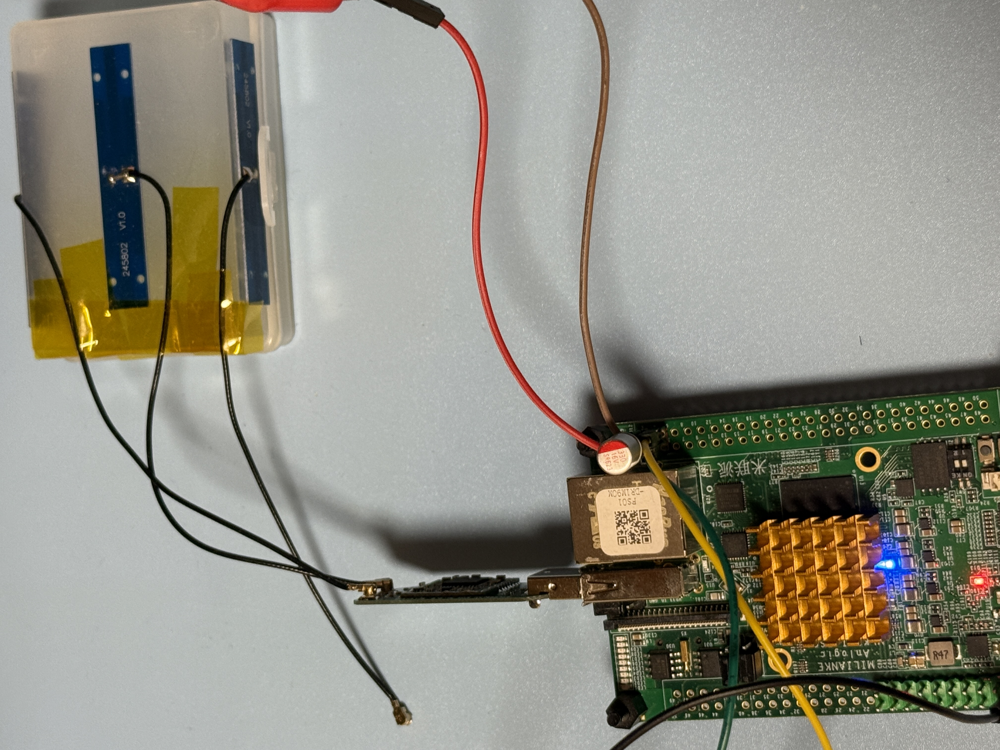
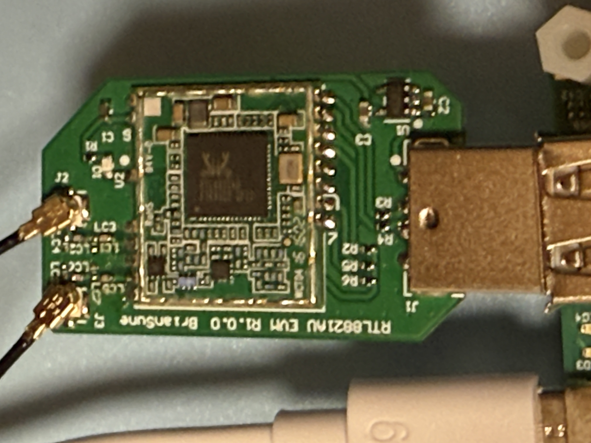

# RTL8821AU USB Dongle Testing

### Test USB Gear

|Test Board|USB Dongle HW|
|-|-|
|||

```
6.1.111-rt42

DISTRIB_ID=Ubuntu
DISTRIB_RELEASE=20.04
DISTRIB_CODENAME=focal
DISTRIB_DESCRIPTION="Ubuntu 20.04.2 LTS"

Architecture:                         aarch64
CPU op-mode(s):                       32-bit, 64-bit
Byte Order:                           Little Endian
CPU(s):                               2
On-line CPU(s) list:                  0,1
Thread(s) per core:                   1
Core(s) per socket:                   2
Socket(s):                            1
Vendor ID:                            ARM
Model:                                0
Model name:                           Cortex-A35
Stepping:                             r1p0
BogoMIPS:                             66.66
Vulnerability Gather data sampling:   Not affected
Vulnerability Itlb multihit:          Not affected
Vulnerability L1tf:                   Not affected
Vulnerability Mds:                    Not affected
Vulnerability Meltdown:               Not affected
Vulnerability Mmio stale data:        Not affected
Vulnerability Reg file data sampling: Not affected
Vulnerability Retbleed:               Not affected
Vulnerability Spec rstack overflow:   Not affected
Vulnerability Spec store bypass:      Not affected
Vulnerability Spectre v1:             Mitigation; __user pointer sanitization
Vulnerability Spectre v2:             Not affected
Vulnerability Srbds:                  Not affected
Vulnerability Tsx async abort:        Not affected
Flags:                                fp asimd evtstrm aes pmull sha1 sha2 crc32 cpuid
```

### USB Tree

```
Before driver is inserted.
/:  Bus 01.Port 1: Dev 1, Class=root_hub, Driver=dwc2/1p, 480M
    |__ Port 1: Dev 2, If 0, Class=Wireless, Driver=btusb, 480M
    |__ Port 1: Dev 2, If 1, Class=Wireless, Driver=btusb, 480M
    |__ Port 1: Dev 2, If 2, Class=Vendor Specific Class, Driver=, 480M

After driver is inserted.
/:  Bus 01.Port 1: Dev 1, Class=root_hub, Driver=dwc2/1p, 480M
    |__ Port 1: Dev 2, If 0, Class=Wireless, Driver=btusb, 480M
    |__ Port 1: Dev 2, If 1, Class=Wireless, Driver=btusb, 480M
    |__ Port 1: Dev 2, If 2, Class=Vendor Specific Class, Driver=rtw_8821au, 480M
```

<details>

<summary>USB Details</summary>

```
Bus 001 Device 002: ID 0bda:0823 Realtek Semiconductor Corp. 802.11ac WLAN Adapter 
Bus 001 Device 001: ID 1d6b:0002 Linux Foundation 2.0 root hub
```

</details>

### Driver Load

The driver is loaded via "insmod"

```
Module                  Size  Used by
rtw_8821au             16384  0
rtw_8821a              36864  1 rtw_8821au
rtw_88xxa              36864  1 rtw_8821a
rtw_usb                24576  1 rtw_8821au
rtw_core              217088  3 rtw_88xxa,rtw_usb,rtw_8821a
```

### iw list

<details>

<summary>iw list</summary>

```
Wiphy phy0
	max # scan SSIDs: 4
	max scan IEs length: 2243 bytes
	max # sched scan SSIDs: 0
	max # match sets: 0
	Retry short limit: 7
	Retry long limit: 4
	Coverage class: 0 (up to 0m)
	Device supports T-DLS.
	Supported Ciphers:
		* WEP40 (00-0f-ac:1)
		* WEP104 (00-0f-ac:5)
		* TKIP (00-0f-ac:2)
		* CCMP-128 (00-0f-ac:4)
		* CCMP-256 (00-0f-ac:10)
		* GCMP-128 (00-0f-ac:8)
		* GCMP-256 (00-0f-ac:9)
		* CMAC (00-0f-ac:6)
		* CMAC-256 (00-0f-ac:13)
		* GMAC-128 (00-0f-ac:11)
		* GMAC-256 (00-0f-ac:12)
	Available Antennas: TX 0x1 RX 0x1
	Configured Antennas: TX 0x1 RX 0x1
	Supported interface modes:
		 * IBSS
		 * managed
		 * AP
		 * AP/VLAN
		 * monitor
		 * P2P-client
		 * P2P-GO
	Band 1:
		Capabilities: 0x196e
			HT20/HT40
			SM Power Save disabled
			RX HT20 SGI
			RX HT40 SGI
			RX STBC 1-stream
			Max AMSDU length: 7935 bytes
			DSSS/CCK HT40
		Maximum RX AMPDU length 65535 bytes (exponent: 0x003)
		Minimum RX AMPDU time spacing: 16 usec (0x07)
		HT Max RX data rate: 150 Mbps
		HT TX/RX MCS rate indexes supported: 0-7, 32
		Bitrates (non-HT):
			* 1.0 Mbps
			* 2.0 Mbps
			* 5.5 Mbps
			* 11.0 Mbps
			* 6.0 Mbps
			* 9.0 Mbps
			* 12.0 Mbps
			* 18.0 Mbps
			* 24.0 Mbps
			* 36.0 Mbps
			* 48.0 Mbps
			* 54.0 Mbps
		Frequencies:
			* 2412 MHz [1] (20.0 dBm)
			* 2417 MHz [2] (20.0 dBm)
			* 2422 MHz [3] (20.0 dBm)
			* 2427 MHz [4] (20.0 dBm)
			* 2432 MHz [5] (20.0 dBm)
			* 2437 MHz [6] (20.0 dBm)
			* 2442 MHz [7] (20.0 dBm)
			* 2447 MHz [8] (20.0 dBm)
			* 2452 MHz [9] (20.0 dBm)
			* 2457 MHz [10] (20.0 dBm)
			* 2462 MHz [11] (20.0 dBm)
			* 2467 MHz [12] (20.0 dBm)
			* 2472 MHz [13] (20.0 dBm)
			* 2484 MHz [14] (disabled)
	Band 2:
		Capabilities: 0x196e
			HT20/HT40
			SM Power Save disabled
			RX HT20 SGI
			RX HT40 SGI
			RX STBC 1-stream
			Max AMSDU length: 7935 bytes
			DSSS/CCK HT40
		Maximum RX AMPDU length 65535 bytes (exponent: 0x003)
		Minimum RX AMPDU time spacing: 16 usec (0x07)
		HT Max RX data rate: 150 Mbps
		HT TX/RX MCS rate indexes supported: 0-7, 32
		VHT Capabilities (0x03d07122):
			Max MPDU length: 11454
			Supported Channel Width: neither 160 nor 80+80
			short GI (80 MHz)
			SU Beamformee
			MU Beamformee
			+HTC-VHT
		VHT RX MCS set:
			1 streams: MCS 0-9
			2 streams: not supported
			3 streams: not supported
			4 streams: not supported
			5 streams: not supported
			6 streams: not supported
			7 streams: not supported
			8 streams: not supported
		VHT RX highest supported: 390 Mbps
		VHT TX MCS set:
			1 streams: MCS 0-9
			2 streams: not supported
			3 streams: not supported
			4 streams: not supported
			5 streams: not supported
			6 streams: not supported
			7 streams: not supported
			8 streams: not supported
		VHT TX highest supported: 390 Mbps
		Bitrates (non-HT):
			* 6.0 Mbps
			* 9.0 Mbps
			* 12.0 Mbps
			* 18.0 Mbps
			* 24.0 Mbps
			* 36.0 Mbps
			* 48.0 Mbps
			* 54.0 Mbps
		Frequencies:
			* 5180 MHz [36] (23.0 dBm)
			* 5200 MHz [40] (23.0 dBm)
			* 5220 MHz [44] (23.0 dBm)
			* 5240 MHz [48] (23.0 dBm)
			* 5260 MHz [52] (20.0 dBm) (radar detection)
			* 5280 MHz [56] (20.0 dBm) (radar detection)
			* 5300 MHz [60] (20.0 dBm) (radar detection)
			* 5320 MHz [64] (20.0 dBm) (radar detection)
			* 5500 MHz [100] (26.0 dBm) (radar detection)
			* 5520 MHz [104] (26.0 dBm) (radar detection)
			* 5540 MHz [108] (26.0 dBm) (radar detection)
			* 5560 MHz [112] (26.0 dBm) (radar detection)
			* 5580 MHz [116] (26.0 dBm) (radar detection)
			* 5600 MHz [120] (26.0 dBm) (radar detection)
			* 5620 MHz [124] (26.0 dBm) (radar detection)
			* 5640 MHz [128] (26.0 dBm) (radar detection)
			* 5660 MHz [132] (26.0 dBm) (radar detection)
			* 5680 MHz [136] (26.0 dBm) (radar detection)
			* 5700 MHz [140] (26.0 dBm) (radar detection)
			* 5720 MHz [144] (13.0 dBm) (radar detection)
			* 5745 MHz [149] (13.0 dBm)
			* 5765 MHz [153] (13.0 dBm)
			* 5785 MHz [157] (13.0 dBm)
			* 5805 MHz [161] (13.0 dBm)
			* 5825 MHz [165] (13.0 dBm)
	Supported commands:
		 * new_interface
		 * set_interface
		 * new_key
		 * start_ap
		 * new_station
		 * set_bss
		 * authenticate
		 * associate
		 * deauthenticate
		 * disassociate
		 * join_ibss
		 * remain_on_channel
		 * set_tx_bitrate_mask
		 * frame
		 * frame_wait_cancel
		 * set_wiphy_netns
		 * set_channel
		 * tdls_mgmt
		 * tdls_oper
		 * probe_client
		 * set_noack_map
		 * register_beacons
		 * start_p2p_device
		 * set_mcast_rate
		 * connect
		 * disconnect
		 * set_qos_map
		 * set_multicast_to_unicast
		 * Unknown command (140)
	software interface modes (can always be added):
		 * AP/VLAN
		 * monitor
	valid interface combinations:
		 * #{ managed } <= 1, #{ AP, P2P-client, P2P-GO } <= 1,
		   total <= 2, #channels <= 1
	HT Capability overrides:
		 * MCS: ff ff ff ff ff ff ff ff ff ff
		 * maximum A-MSDU length
		 * supported channel width
		 * short GI for 40 MHz
		 * max A-MPDU length exponent
		 * min MPDU start spacing
	Device supports TX status socket option.
	Device supports HT-IBSS.
	Device supports SAE with AUTHENTICATE command
	Device supports scan flush.
	Device supports per-vif TX power setting
	Driver supports full state transitions for AP/GO clients
	Driver supports a userspace MPM
	Device supports configuring vdev MAC-addr on create.
	Device supports randomizing MAC-addr in scans.
	max # scan plans: 1
	max scan plan interval: -1
	max scan plan iterations: 0
	Supported TX frame types:
		 * IBSS: 0x00 0x10 0x20 0x30 0x40 0x50 0x60 0x70 0x80 0x90 0xa0 0xb0 0xc0 0xd0 0xe0 0xf0
		 * managed: 0x00 0x10 0x20 0x30 0x40 0x50 0x60 0x70 0x80 0x90 0xa0 0xb0 0xc0 0xd0 0xe0 0xf0
		 * AP: 0x00 0x10 0x20 0x30 0x40 0x50 0x60 0x70 0x80 0x90 0xa0 0xb0 0xc0 0xd0 0xe0 0xf0
		 * AP/VLAN: 0x00 0x10 0x20 0x30 0x40 0x50 0x60 0x70 0x80 0x90 0xa0 0xb0 0xc0 0xd0 0xe0 0xf0
		 * mesh point: 0x00 0x10 0x20 0x30 0x40 0x50 0x60 0x70 0x80 0x90 0xa0 0xb0 0xc0 0xd0 0xe0 0xf0
		 * P2P-client: 0x00 0x10 0x20 0x30 0x40 0x50 0x60 0x70 0x80 0x90 0xa0 0xb0 0xc0 0xd0 0xe0 0xf0
		 * P2P-GO: 0x00 0x10 0x20 0x30 0x40 0x50 0x60 0x70 0x80 0x90 0xa0 0xb0 0xc0 0xd0 0xe0 0xf0
		 * P2P-device: 0x00 0x10 0x20 0x30 0x40 0x50 0x60 0x70 0x80 0x90 0xa0 0xb0 0xc0 0xd0 0xe0 0xf0
	Supported RX frame types:
		 * IBSS: 0x40 0xb0 0xc0 0xd0
		 * managed: 0x40 0xb0 0xd0
		 * AP: 0x00 0x20 0x40 0xa0 0xb0 0xc0 0xd0
		 * AP/VLAN: 0x00 0x20 0x40 0xa0 0xb0 0xc0 0xd0
		 * mesh point: 0xb0 0xc0 0xd0
		 * P2P-client: 0x40 0xd0
		 * P2P-GO: 0x00 0x20 0x40 0xa0 0xb0 0xc0 0xd0
		 * P2P-device: 0x40 0xd0
	Supported extended features:
		* [ RRM ]: RRM
		* [ SET_SCAN_DWELL ]: scan dwell setting
		* [ FILS_STA ]: STA FILS (Fast Initial Link Setup)
		* [ CONTROL_PORT_OVER_NL80211 ]: control port over nl80211
		* [ TXQS ]: FQ-CoDel-enabled intermediate TXQs
```

</details>

### Network Manager - Band 2.4

```
wlan0: flags=4163<UP,BROADCAST,RUNNING,MULTICAST>  mtu 1500
        inet 192.168.1.29  netmask 255.255.252.0  broadcast 192.168.3.255
        RX packets 20  bytes 3207 (3.2 KB)
        RX errors 0  dropped 0  overruns 0  frame 0
        TX packets 54  bytes 9675 (9.6 KB)
        TX errors 0  dropped 0 overruns 0  carrier 0  collisions 0
```

### iwconfig 2.4

```
wlan0     IEEE 802.11  ESSID:""  
          Mode:Managed  Frequency:2.412 GHz  Access Point: 
          Bit Rate=121.5 Mb/s   Tx-Power=20 dBm   
          Retry short limit:7   RTS thr:off   Fragment thr:off
          Encryption key:off
          Power Management:on
          Link Quality=62/70  Signal level=-48 dBm  
          Rx invalid nwid:0  Rx invalid crypt:0  Rx invalid frag:0
          Tx excessive retries:0  Invalid misc:2   Missed beacon:0

```

### Network Speed Test via Ookla - Band 2.4

```
Retrieving speedtest.net configuration...
Retrieving speedtest.net server list...
Selecting best server based on ping...
Testing download speed................................................................................
Download: 36.63 Mbit/s
Testing upload speed......................................................................................................
Upload: 50.52 Mbit/s
```

### Network Ping Tests - Band 2.4

#### DNS-Ping

```
PING 8.8.8.8 (8.8.8.8) 56(84) bytes of data.
64 bytes from 8.8.8.8: icmp_seq=1 ttl=118 time=7.59 ms
64 bytes from 8.8.8.8: icmp_seq=2 ttl=118 time=5.06 ms
64 bytes from 8.8.8.8: icmp_seq=3 ttl=118 time=5.42 ms
64 bytes from 8.8.8.8: icmp_seq=4 ttl=118 time=4.75 ms
64 bytes from 8.8.8.8: icmp_seq=5 ttl=118 time=4.15 ms
64 bytes from 8.8.8.8: icmp_seq=6 ttl=118 time=5.47 ms
64 bytes from 8.8.8.8: icmp_seq=7 ttl=118 time=4.33 ms
64 bytes from 8.8.8.8: icmp_seq=8 ttl=118 time=4.22 ms
64 bytes from 8.8.8.8: icmp_seq=9 ttl=118 time=4.00 ms
64 bytes from 8.8.8.8: icmp_seq=10 ttl=118 time=6.06 ms
64 bytes from 8.8.8.8: icmp_seq=11 ttl=118 time=4.20 ms
64 bytes from 8.8.8.8: icmp_seq=12 ttl=118 time=9.59 ms
64 bytes from 8.8.8.8: icmp_seq=13 ttl=118 time=8.85 ms
64 bytes from 8.8.8.8: icmp_seq=14 ttl=118 time=4.32 ms
64 bytes from 8.8.8.8: icmp_seq=15 ttl=118 time=4.57 ms
64 bytes from 8.8.8.8: icmp_seq=16 ttl=118 time=5.95 ms
64 bytes from 8.8.8.8: icmp_seq=17 ttl=118 time=4.82 ms
64 bytes from 8.8.8.8: icmp_seq=18 ttl=118 time=4.73 ms
64 bytes from 8.8.8.8: icmp_seq=19 ttl=118 time=4.10 ms
64 bytes from 8.8.8.8: icmp_seq=20 ttl=118 time=4.37 ms

--- 8.8.8.8 ping statistics ---
20 packets transmitted, 20 received, 0% packet loss, time 19029ms
rtt min/avg/max/mdev = 4.001/5.327/9.586/1.554 ms
```

#### Self-Ping 

```
PING 192.168.1.29 (192.168.1.29) 10000(10028) bytes of data.
10008 bytes from 192.168.1.29: icmp_seq=1 ttl=64 time=0.127 ms
10008 bytes from 192.168.1.29: icmp_seq=2 ttl=64 time=0.130 ms
10008 bytes from 192.168.1.29: icmp_seq=3 ttl=64 time=0.118 ms
10008 bytes from 192.168.1.29: icmp_seq=4 ttl=64 time=0.134 ms
10008 bytes from 192.168.1.29: icmp_seq=5 ttl=64 time=0.152 ms
10008 bytes from 192.168.1.29: icmp_seq=6 ttl=64 time=0.141 ms
10008 bytes from 192.168.1.29: icmp_seq=7 ttl=64 time=0.100 ms
10008 bytes from 192.168.1.29: icmp_seq=8 ttl=64 time=0.110 ms
10008 bytes from 192.168.1.29: icmp_seq=9 ttl=64 time=0.114 ms
10008 bytes from 192.168.1.29: icmp_seq=10 ttl=64 time=0.098 ms
10008 bytes from 192.168.1.29: icmp_seq=11 ttl=64 time=0.144 ms
10008 bytes from 192.168.1.29: icmp_seq=12 ttl=64 time=0.142 ms
10008 bytes from 192.168.1.29: icmp_seq=13 ttl=64 time=0.105 ms
10008 bytes from 192.168.1.29: icmp_seq=14 ttl=64 time=0.144 ms
10008 bytes from 192.168.1.29: icmp_seq=15 ttl=64 time=0.099 ms
10008 bytes from 192.168.1.29: icmp_seq=16 ttl=64 time=0.102 ms
10008 bytes from 192.168.1.29: icmp_seq=17 ttl=64 time=0.123 ms
10008 bytes from 192.168.1.29: icmp_seq=18 ttl=64 time=0.150 ms
10008 bytes from 192.168.1.29: icmp_seq=19 ttl=64 time=0.144 ms
10008 bytes from 192.168.1.29: icmp_seq=20 ttl=64 time=0.093 ms

--- 192.168.1.29 ping statistics ---
20 packets transmitted, 20 received, 0% packet loss, time 19449ms
rtt min/avg/max/mdev = 0.093/0.123/0.152/0.019 ms
```

### Server & Client Test via iperf3 (PC-Router-DUT)

<details>

<summary>iperf3</summary>

```
-----------------------------------------------------------
Server listening on 5201
-----------------------------------------------------------
Accepted connection from 192.168.1.3, port 54503
[  5] local 192.168.1.29 port 5201 connected to 192.168.1.3 port 54504
[ ID] Interval           Transfer     Bitrate         Retr  Cwnd
[  5]   0.00-1.00   sec  6.32 MBytes  53.0 Mbits/sec    0    134 KBytes       
[  5]   1.00-2.00   sec  5.64 MBytes  47.3 Mbits/sec    1    134 KBytes       
[  5]   2.00-3.00   sec  4.96 MBytes  41.6 Mbits/sec    0    134 KBytes       
[  5]   3.00-4.00   sec  5.70 MBytes  47.8 Mbits/sec    0    134 KBytes       
[  5]   4.00-5.00   sec  4.96 MBytes  41.6 Mbits/sec    0    134 KBytes       
[  5]   5.00-6.00   sec  5.45 MBytes  45.7 Mbits/sec    0    134 KBytes       
[  5]   6.00-7.00   sec  5.51 MBytes  46.3 Mbits/sec    1    134 KBytes       
[  5]   7.00-8.00   sec  5.94 MBytes  49.9 Mbits/sec    0    134 KBytes       
[  5]   8.00-9.00   sec  6.25 MBytes  52.4 Mbits/sec    0    134 KBytes       
[  5]   9.00-10.00  sec  5.64 MBytes  47.3 Mbits/sec    0    134 KBytes       
[  5]  10.00-11.00  sec  5.64 MBytes  47.3 Mbits/sec    0    134 KBytes       
[  5]  11.00-12.00  sec  4.72 MBytes  39.6 Mbits/sec    0    134 KBytes       
[  5]  12.00-13.00  sec   314 KBytes  2.57 Mbits/sec   64   94.1 KBytes       
[  5]  13.00-14.00  sec  0.00 Bytes  0.00 bits/sec    0   67.0 KBytes       
[  5]  14.00-15.00  sec  0.00 Bytes  0.00 bits/sec    2   65.6 KBytes       
[  5]  15.00-16.00  sec  0.00 Bytes  0.00 bits/sec    0   65.6 KBytes       
[  5]  16.00-17.00  sec  0.00 Bytes  0.00 bits/sec    0   74.1 KBytes       
[  5]  17.00-18.00  sec  2.14 MBytes  18.0 Mbits/sec    0    121 KBytes       
[  5]  18.00-19.00  sec  4.53 MBytes  38.0 Mbits/sec    0    130 KBytes       
[  5]  19.00-20.00  sec  3.12 MBytes  26.2 Mbits/sec    1    138 KBytes       
[  5]  20.00-21.00  sec  1.59 MBytes  13.4 Mbits/sec    0    138 KBytes       
[  5]  21.00-22.00  sec  4.47 MBytes  37.5 Mbits/sec    0    138 KBytes       
[  5]  22.00-23.00  sec  6.25 MBytes  52.4 Mbits/sec    0    138 KBytes       
[  5]  23.00-24.00  sec  6.19 MBytes  51.9 Mbits/sec    0    138 KBytes       
[  5]  24.00-25.00  sec  6.68 MBytes  56.0 Mbits/sec    0    138 KBytes       
[  5]  25.00-26.00  sec  6.07 MBytes  50.9 Mbits/sec    0    138 KBytes       
[  5]  26.00-27.00  sec  5.76 MBytes  48.3 Mbits/sec    0    138 KBytes       
[  5]  27.00-28.00  sec  5.58 MBytes  46.8 Mbits/sec    0    138 KBytes       
[  5]  28.00-29.00  sec  5.51 MBytes  46.3 Mbits/sec    0    138 KBytes       
[  5]  29.00-30.00  sec  5.45 MBytes  45.7 Mbits/sec    0    138 KBytes       
- - - - - - - - - - - - - - - - - - - - - - - - -
[ ID] Interval           Transfer     Bitrate         Retr
[  5]   0.00-30.04  sec   130 MBytes  36.4 Mbits/sec   69             sender
-----------------------------------------------------------
Server listening on 5201
-----------------------------------------------------------
[   63.328307] rtw_core: loading out-of-tree module taints kernel.
[   63.810124] rtw_8821au 1-1:1.2: Firmware version 42.4.0, H2C version 0
[   65.034078] usbcore: registered new interface driver rtw_8821au
```

</details>

### Network Manager - Band 5G

```
wlan0: flags=4163<UP,BROADCAST,RUNNING,MULTICAST>  mtu 1500
        inet 192.168.1.29  netmask 255.255.252.0  broadcast 192.168.3.255
        RX packets 75435  bytes 51103210 (51.1 MB)
        RX errors 0  dropped 13  overruns 0  frame 0
        TX packets 156278  bytes 216203287 (216.2 MB)
        TX errors 0  dropped 0 overruns 0  carrier 0  collisions 0
```

### iwconfig 5G

```
wlan0     IEEE 802.11  ESSID:""  
          Mode:Managed  Frequency:5.805 GHz  Access Point: 
          Bit Rate=117 Mb/s   Tx-Power=13 dBm   
          Retry short limit:7   RTS thr:off   Fragment thr:off
          Encryption key:off
          Power Management:on
          Link Quality=48/70  Signal level=-62 dBm  
          Rx invalid nwid:0  Rx invalid crypt:0  Rx invalid frag:0
          Tx excessive retries:0  Invalid misc:0   Missed beacon:0

```

### Network Speed Test via Ookla - Band 5G

```
Retrieving speedtest.net configuration...
Retrieving speedtest.net server list...
Selecting best server based on ping...
Testing download speed................................................................................
Download: 114.22 Mbit/s
Testing upload speed......................................................................................................
Upload: 57.96 Mbit/s
```

### Network Ping Tests - Band 5G

#### DNS-Ping

```
PING 8.8.8.8 (8.8.8.8) 56(84) bytes of data.
64 bytes from 8.8.8.8: icmp_seq=1 ttl=118 time=5.35 ms
64 bytes from 8.8.8.8: icmp_seq=2 ttl=118 time=5.11 ms
64 bytes from 8.8.8.8: icmp_seq=3 ttl=118 time=10.2 ms
64 bytes from 8.8.8.8: icmp_seq=4 ttl=118 time=4.67 ms
64 bytes from 8.8.8.8: icmp_seq=5 ttl=118 time=4.21 ms
64 bytes from 8.8.8.8: icmp_seq=6 ttl=118 time=4.52 ms
64 bytes from 8.8.8.8: icmp_seq=7 ttl=118 time=4.89 ms
64 bytes from 8.8.8.8: icmp_seq=8 ttl=118 time=3.83 ms
64 bytes from 8.8.8.8: icmp_seq=9 ttl=118 time=4.15 ms
64 bytes from 8.8.8.8: icmp_seq=10 ttl=118 time=4.45 ms
64 bytes from 8.8.8.8: icmp_seq=11 ttl=118 time=4.36 ms
64 bytes from 8.8.8.8: icmp_seq=12 ttl=118 time=4.64 ms
64 bytes from 8.8.8.8: icmp_seq=13 ttl=118 time=4.79 ms
64 bytes from 8.8.8.8: icmp_seq=14 ttl=118 time=4.61 ms
64 bytes from 8.8.8.8: icmp_seq=15 ttl=118 time=4.71 ms
64 bytes from 8.8.8.8: icmp_seq=16 ttl=118 time=4.29 ms
64 bytes from 8.8.8.8: icmp_seq=17 ttl=118 time=4.05 ms
64 bytes from 8.8.8.8: icmp_seq=18 ttl=118 time=4.72 ms
64 bytes from 8.8.8.8: icmp_seq=19 ttl=118 time=4.51 ms
64 bytes from 8.8.8.8: icmp_seq=20 ttl=118 time=4.67 ms

--- 8.8.8.8 ping statistics ---
20 packets transmitted, 20 received, 0% packet loss, time 19030ms
rtt min/avg/max/mdev = 3.832/4.836/10.195/1.276 ms
```

#### Self-Ping 

```
PING 192.168.1.29 (192.168.1.29) 10000(10028) bytes of data.
10008 bytes from 192.168.1.29: icmp_seq=1 ttl=64 time=0.126 ms
10008 bytes from 192.168.1.29: icmp_seq=2 ttl=64 time=0.141 ms
10008 bytes from 192.168.1.29: icmp_seq=3 ttl=64 time=0.136 ms
10008 bytes from 192.168.1.29: icmp_seq=4 ttl=64 time=0.117 ms
10008 bytes from 192.168.1.29: icmp_seq=5 ttl=64 time=0.100 ms
10008 bytes from 192.168.1.29: icmp_seq=6 ttl=64 time=0.109 ms
10008 bytes from 192.168.1.29: icmp_seq=7 ttl=64 time=0.138 ms
10008 bytes from 192.168.1.29: icmp_seq=8 ttl=64 time=0.140 ms
10008 bytes from 192.168.1.29: icmp_seq=9 ttl=64 time=0.141 ms
10008 bytes from 192.168.1.29: icmp_seq=10 ttl=64 time=0.121 ms
10008 bytes from 192.168.1.29: icmp_seq=11 ttl=64 time=0.107 ms
10008 bytes from 192.168.1.29: icmp_seq=12 ttl=64 time=0.097 ms
10008 bytes from 192.168.1.29: icmp_seq=13 ttl=64 time=0.120 ms
10008 bytes from 192.168.1.29: icmp_seq=14 ttl=64 time=0.141 ms
10008 bytes from 192.168.1.29: icmp_seq=15 ttl=64 time=0.141 ms
10008 bytes from 192.168.1.29: icmp_seq=16 ttl=64 time=0.092 ms
10008 bytes from 192.168.1.29: icmp_seq=17 ttl=64 time=0.097 ms
10008 bytes from 192.168.1.29: icmp_seq=18 ttl=64 time=0.131 ms
10008 bytes from 192.168.1.29: icmp_seq=19 ttl=64 time=0.140 ms
10008 bytes from 192.168.1.29: icmp_seq=20 ttl=64 time=0.145 ms

--- 192.168.1.29 ping statistics ---
20 packets transmitted, 20 received, 0% packet loss, time 19453ms
rtt min/avg/max/mdev = 0.092/0.124/0.145/0.017 ms
```

### Server & Client Test via iperf3 (PC-Router-DUT)

<details>

<summary>iperf3</summary>

```
-----------------------------------------------------------
Server listening on 5201
-----------------------------------------------------------
Accepted connection from 192.168.1.3, port 59302
[  5] local 192.168.1.29 port 5201 connected to 192.168.1.3 port 59303
[ ID] Interval           Transfer     Bitrate         Retr  Cwnd
[  5]   0.00-1.00   sec  5.74 MBytes  48.2 Mbits/sec    0    147 KBytes       
[  5]   1.00-2.00   sec  5.91 MBytes  49.6 Mbits/sec    0    147 KBytes       
[  5]   2.00-3.00   sec  4.35 MBytes  36.5 Mbits/sec    0    147 KBytes       
[  5]   3.00-4.00   sec  5.27 MBytes  44.2 Mbits/sec    0    147 KBytes       
[  5]   4.00-5.00   sec  5.51 MBytes  46.3 Mbits/sec    0    147 KBytes       
[  5]   5.00-6.00   sec  6.03 MBytes  50.6 Mbits/sec    0    147 KBytes       
[  5]   6.00-7.00   sec  7.17 MBytes  60.1 Mbits/sec    0    147 KBytes       
[  5]   7.00-8.00   sec  6.98 MBytes  58.6 Mbits/sec    0    147 KBytes       
[  5]   8.00-9.00   sec  6.68 MBytes  56.0 Mbits/sec    0    147 KBytes       
[  5]   9.00-10.00  sec  6.86 MBytes  57.6 Mbits/sec    0    147 KBytes       
[  5]  10.00-11.00  sec  6.40 MBytes  53.7 Mbits/sec    0    147 KBytes       
[  5]  11.00-12.00  sec  5.21 MBytes  43.7 Mbits/sec    0    147 KBytes       
[  5]  12.00-13.00  sec  4.63 MBytes  38.8 Mbits/sec    0    147 KBytes       
[  5]  13.00-14.00  sec  3.74 MBytes  31.4 Mbits/sec    0    147 KBytes       
[  5]  14.00-15.00  sec  3.77 MBytes  31.6 Mbits/sec    0    147 KBytes       
[  5]  15.00-16.00  sec  3.71 MBytes  31.1 Mbits/sec    1    147 KBytes       
[  5]  16.00-17.00  sec  3.74 MBytes  31.3 Mbits/sec    0    147 KBytes       
[  5]  17.00-18.00  sec  4.96 MBytes  41.6 Mbits/sec    0    147 KBytes       
[  5]  18.00-19.00  sec  5.85 MBytes  49.1 Mbits/sec    0    147 KBytes       
[  5]  19.00-20.00  sec  6.92 MBytes  58.1 Mbits/sec    0    147 KBytes       
[  5]  20.00-21.00  sec  6.62 MBytes  55.5 Mbits/sec    0    147 KBytes       
[  5]  21.00-22.00  sec  7.17 MBytes  60.1 Mbits/sec    0    147 KBytes       
[  5]  22.00-23.00  sec  7.17 MBytes  60.1 Mbits/sec    0    267 KBytes       
[  5]  23.00-24.00  sec  7.41 MBytes  62.2 Mbits/sec    0    267 KBytes       
[  5]  24.00-25.00  sec  7.41 MBytes  62.2 Mbits/sec    0    267 KBytes       
[  5]  25.00-26.00  sec  7.29 MBytes  61.2 Mbits/sec    0    267 KBytes       
[  5]  26.00-27.00  sec  8.09 MBytes  67.8 Mbits/sec    0    267 KBytes       
[  5]  27.00-28.00  sec  7.35 MBytes  61.7 Mbits/sec    0    267 KBytes       
[  5]  28.00-29.00  sec  7.78 MBytes  65.3 Mbits/sec    0    267 KBytes       
[  5]  29.00-30.00  sec  9.56 MBytes  80.2 Mbits/sec    0    267 KBytes       
- - - - - - - - - - - - - - - - - - - - - - - - -
[ ID] Interval           Transfer     Bitrate         Retr
[  5]   0.00-30.04  sec   185 MBytes  51.7 Mbits/sec    1             sender
-----------------------------------------------------------
Server listening on 5201
-----------------------------------------------------------
[   63.328307] rtw_core: loading out-of-tree module taints kernel.
[   63.810124] rtw_8821au 1-1:1.2: Firmware version 42.4.0, H2C version 0
[   65.034078] usbcore: registered new interface driver rtw_8821au
```

</details>

### AP Test

#### hostapd.conf

Setup the configuration at /etc/hostapd/hostapd.conf

```
interface=wlan0
driver=nl80211
ieee80211n=1
hw_mode=g
channel=6
ssid=AP-TEST
wpa=2
wpa_passphrase=12345678
wpa_key_mgmt=WPA-PSK
rsn_pairwise=CCMP TKIP
wpa_pairwise=TKIP CCMP
```

#### udhcpd.conf

```
start 192.168.175.2
end 192.168.175.254
interface wlan0
max_leases 234
opt router 192.168.175.1
```

#### Start AP Test

```
sudo hostapd /etc/hostapd/hostapd.conf -B
Using interface wlan0 with hwaddr and ssid "AP-NAME"
wlan0: interface state UNINITIALIZED->ENABLED
wlan0: AP-ENABLED
```

#### Server & Client Test via iperf3 (PC-DUT)

<details>

<summary>iperf3</summary>

```
Wlan0 Not Ready.
Start AP @ WLAN0
Configuration file: /etc/hostapd/hostapd.conf
Using interface wlan0 with hwaddr  and ssid "AP-TEST"
wlan0: interface state UNINITIALIZED->ENABLED
wlan0: AP-ENABLED 
-----------------------------------------------------------
Server listening on 5201
-----------------------------------------------------------
Accepted connection from 192.168.175.86, port 59334
[  5] local 192.168.175.1 port 5201 connected to 192.168.175.86 port 59335
[ ID] Interval           Transfer     Bitrate         Retr  Cwnd
[  5]   0.00-1.00   sec  2.43 MBytes  20.4 Mbits/sec    2    141 KBytes       
[  5]   1.00-2.00   sec  1.78 MBytes  14.9 Mbits/sec    1    141 KBytes       
[  5]   2.00-3.00   sec  1.72 MBytes  14.4 Mbits/sec   37   98.4 KBytes       
[  5]   3.00-4.00   sec  2.08 MBytes  17.5 Mbits/sec   38   98.4 KBytes       
[  5]   4.00-5.00   sec  1.78 MBytes  14.9 Mbits/sec    2   98.4 KBytes       
[  5]   5.00-6.00   sec  1.78 MBytes  14.9 Mbits/sec    0   68.4 KBytes       
[  5]   6.00-7.00   sec  2.05 MBytes  17.2 Mbits/sec    1   67.0 KBytes       
[  5]   7.00-8.00   sec  2.70 MBytes  22.6 Mbits/sec    1   67.0 KBytes       
[  5]   8.00-9.00   sec  2.66 MBytes  22.4 Mbits/sec    3   59.9 KBytes       
[  5]   9.00-10.00  sec  1.23 MBytes  10.3 Mbits/sec    2   55.6 KBytes       
[  5]  10.00-11.00  sec  1.75 MBytes  14.6 Mbits/sec   35   48.5 KBytes       
[  5]  11.00-12.00  sec  1.47 MBytes  12.3 Mbits/sec    0   65.6 KBytes       
[  5]  12.00-13.00  sec  2.05 MBytes  17.2 Mbits/sec    1   65.6 KBytes       
[  5]  13.00-14.00  sec  2.42 MBytes  20.3 Mbits/sec   19   64.2 KBytes       
[  5]  14.00-15.00  sec  2.36 MBytes  19.8 Mbits/sec   19   64.2 KBytes       
[  5]  15.00-16.00  sec  2.24 MBytes  18.8 Mbits/sec    1   65.6 KBytes       
[  5]  16.00-17.00  sec  3.46 MBytes  29.0 Mbits/sec    0   65.6 KBytes       
[  5]  17.00-18.00  sec  3.83 MBytes  32.1 Mbits/sec    0   65.6 KBytes       
[  5]  18.00-19.00  sec  3.83 MBytes  32.1 Mbits/sec    0   65.6 KBytes       
[  5]  19.00-20.00  sec  3.83 MBytes  32.1 Mbits/sec    0   65.6 KBytes       
[  5]  20.00-21.00  sec  1.99 MBytes  16.7 Mbits/sec    1   65.6 KBytes       
[  5]  21.00-22.00  sec  1.56 MBytes  13.1 Mbits/sec    1   65.6 KBytes       
[  5]  22.00-23.00  sec  2.39 MBytes  20.0 Mbits/sec    1   68.4 KBytes       
[  5]  23.00-24.00  sec   847 KBytes  6.94 Mbits/sec    1   1.43 KBytes       
[  5]  24.00-25.00  sec  1.99 MBytes  16.7 Mbits/sec    0   71.3 KBytes       
[  5]  25.00-26.00  sec   910 KBytes  7.42 Mbits/sec   28   49.9 KBytes       
[  5]  26.00-27.00  sec  2.30 MBytes  19.4 Mbits/sec    0   71.3 KBytes       
[  5]  27.00-28.00  sec  2.66 MBytes  22.4 Mbits/sec    0   71.3 KBytes       
[  5]  28.00-29.00  sec  2.57 MBytes  21.6 Mbits/sec    0   71.3 KBytes       
[  5]  29.00-30.00  sec  1.84 MBytes  15.4 Mbits/sec    1   75.6 KBytes       
- - - - - - - - - - - - - - - - - - - - - - - - -
[ ID] Interval           Transfer     Bitrate         Retr
[  5]   0.00-30.04  sec  66.5 MBytes  18.6 Mbits/sec  195             sender
-----------------------------------------------------------
Server listening on 5201
-----------------------------------------------------------
[   63.328307] rtw_core: loading out-of-tree module taints kernel.
[   63.810124] rtw_8821au 1-1:1.2: Firmware version 42.4.0, H2C version 0
[   65.034078] usbcore: registered new interface driver rtw_8821au
[  416.159215] rtw_8821au 1-1:1.2: error beacon valid
[  416.159444] rtw_8821au 1-1:1.2: failed to download drv rsvd page
[  431.919956] rtw_8821au 1-1:1.2: error beacon valid
[  431.920185] rtw_8821au 1-1:1.2: failed to download drv rsvd page
[  431.920195] rtw_8821au 1-1:1.2: failed to download beacon
[  436.320010] rtw_8821au 1-1:1.2: error beacon valid
[  436.320239] rtw_8821au 1-1:1.2: failed to download drv rsvd page
```

</details>

### End of Report
