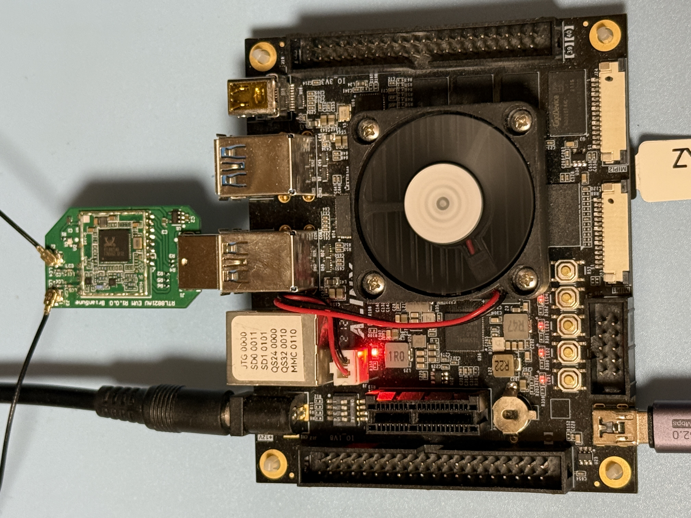

# RTL8821AU USB Dongle Testing

### Test USB Gear

|Test Board|USB Dongle HW|
|-|-|
|||

```
5.4.0

DISTRIB_ID=Ubuntu
DISTRIB_RELEASE=18.04
DISTRIB_CODENAME=bionic
DISTRIB_DESCRIPTION="Ubuntu 18.04.6 LTS"

Architecture:        aarch64
Byte Order:          Little Endian
CPU(s):              2
On-line CPU(s) list: 0,1
Thread(s) per core:  1
Core(s) per socket:  2
Socket(s):           1
Vendor ID:           ARM
Model:               4
Model name:          Cortex-A53
Stepping:            r0p4
CPU max MHz:         1199.9990
CPU min MHz:         299.9990
BogoMIPS:            66.66
Flags:               fp asimd aes pmull sha1 sha2 crc32 cpuid
```

### USB Tree

```
Before driver is inserted.
/:  Bus 02.Port 1: Dev 1, Class=root_hub, Driver=xhci-hcd/1p, 5000M
    |__ Port 1: Dev 2, If 0, Class=Hub, Driver=hub/4p, 5000M
/:  Bus 01.Port 1: Dev 1, Class=root_hub, Driver=xhci-hcd/1p, 480M
    |__ Port 1: Dev 2, If 0, Class=Hub, Driver=hub/4p, 480M
        |__ Port 4: Dev 11, If 0, Class=Wireless, Driver=btusb, 480M
        |__ Port 4: Dev 11, If 1, Class=Wireless, Driver=btusb, 480M
        |__ Port 4: Dev 11, If 2, Class=Vendor Specific Class, Driver=, 480M

After driver is inserted.
/:  Bus 02.Port 1: Dev 1, Class=root_hub, Driver=xhci-hcd/1p, 5000M
    |__ Port 1: Dev 2, If 0, Class=Hub, Driver=hub/4p, 5000M
/:  Bus 01.Port 1: Dev 1, Class=root_hub, Driver=xhci-hcd/1p, 480M
    |__ Port 1: Dev 2, If 0, Class=Hub, Driver=hub/4p, 480M
        |__ Port 4: Dev 11, If 0, Class=Wireless, Driver=btusb, 480M
        |__ Port 4: Dev 11, If 1, Class=Wireless, Driver=btusb, 480M
        |__ Port 4: Dev 11, If 2, Class=Vendor Specific Class, Driver=rtw_8821au, 480M
```

<details>

<summary>USB Details</summary>

```
Bus 002 Device 002: ID 05e3:0620 Genesys Logic, Inc. 
Bus 002 Device 001: ID 1d6b:0003 Linux Foundation 3.0 root hub
Bus 001 Device 011: ID 0bda:0823 Realtek Semiconductor Corp. 
Bus 001 Device 002: ID 05e3:0610 Genesys Logic, Inc. 4-port hub
Bus 001 Device 001: ID 1d6b:0002 Linux Foundation 2.0 root hub

Bus 001 Device 011: ID 0bda:0823 Realtek Semiconductor Corp. 
Device Descriptor:
  bLength                18
  bDescriptorType         1
  bcdUSB               2.10
  bDeviceClass          239 Miscellaneous Device
  bDeviceSubClass         2 ?
  bDeviceProtocol         1 Interface Association
  bMaxPacketSize0        64
  idVendor           0x0bda Realtek Semiconductor Corp.
  idProduct          0x0823 
  bcdDevice            2.00
  iManufacturer           1 Realtek 
  iProduct                2 802.11ac WLAN Adapter 
  iSerial                 3 00e04c000001
  bNumConfigurations      1
  Configuration Descriptor:
    bLength                 9
    bDescriptorType         2
    wTotalLength          236
    bNumInterfaces          3
    bConfigurationValue     1
    iConfiguration          0 
    bmAttributes         0xe0
      Self Powered
      Remote Wakeup
    MaxPower              500mA
    Interface Association:
      bLength                 8
      bDescriptorType        11
      bFirstInterface         0
      bInterfaceCount         2
      bFunctionClass        224 Wireless
      bFunctionSubClass       1 Radio Frequency
      bFunctionProtocol       1 Bluetooth
      iFunction               4 Bluetooth Radio
    Interface Descriptor:
      bLength                 9
      bDescriptorType         4
      bInterfaceNumber        0
      bAlternateSetting       0
      bNumEndpoints           3
      bInterfaceClass       224 Wireless
      bInterfaceSubClass      1 Radio Frequency
      bInterfaceProtocol      1 Bluetooth
      iInterface              4 Bluetooth Radio
      Endpoint Descriptor:
        bLength                 7
        bDescriptorType         5
        bEndpointAddress     0x81  EP 1 IN
        bmAttributes            3
          Transfer Type            Interrupt
          Synch Type               None
          Usage Type               Data
        wMaxPacketSize     0x0010  1x 16 bytes
        bInterval               4
      Endpoint Descriptor:
        bLength                 7
        bDescriptorType         5
        bEndpointAddress     0x02  EP 2 OUT
        bmAttributes            2
          Transfer Type            Bulk
          Synch Type               None
          Usage Type               Data
        wMaxPacketSize     0x0200  1x 512 bytes
        bInterval               0
      Endpoint Descriptor:
        bLength                 7
        bDescriptorType         5
        bEndpointAddress     0x82  EP 2 IN
        bmAttributes            2
          Transfer Type            Bulk
          Synch Type               None
          Usage Type               Data
        wMaxPacketSize     0x0200  1x 512 bytes
        bInterval               0
    Interface Descriptor:
      bLength                 9
      bDescriptorType         4
      bInterfaceNumber        1
      bAlternateSetting       0
      bNumEndpoints           2
      bInterfaceClass       224 Wireless
      bInterfaceSubClass      1 Radio Frequency
      bInterfaceProtocol      1 Bluetooth
      iInterface              4 Bluetooth Radio
      Endpoint Descriptor:
        bLength                 7
        bDescriptorType         5
        bEndpointAddress     0x03  EP 3 OUT
        bmAttributes            1
          Transfer Type            Isochronous
          Synch Type               None
          Usage Type               Data
        wMaxPacketSize     0x0000  1x 0 bytes
        bInterval               4
      Endpoint Descriptor:
        bLength                 7
        bDescriptorType         5
        bEndpointAddress     0x83  EP 3 IN
        bmAttributes            1
          Transfer Type            Isochronous
          Synch Type               None
          Usage Type               Data
        wMaxPacketSize     0x0000  1x 0 bytes
        bInterval               4
    Interface Descriptor:
      bLength                 9
      bDescriptorType         4
      bInterfaceNumber        1
      bAlternateSetting       1
      bNumEndpoints           2
      bInterfaceClass       224 Wireless
      bInterfaceSubClass      1 Radio Frequency
      bInterfaceProtocol      1 Bluetooth
      iInterface              4 Bluetooth Radio
      Endpoint Descriptor:
        bLength                 7
        bDescriptorType         5
        bEndpointAddress     0x03  EP 3 OUT
        bmAttributes            1
          Transfer Type            Isochronous
          Synch Type               None
          Usage Type               Data
        wMaxPacketSize     0x0009  1x 9 bytes
        bInterval               4
      Endpoint Descriptor:
        bLength                 7
        bDescriptorType         5
        bEndpointAddress     0x83  EP 3 IN
        bmAttributes            1
          Transfer Type            Isochronous
          Synch Type               None
          Usage Type               Data
        wMaxPacketSize     0x0009  1x 9 bytes
        bInterval               4
    Interface Descriptor:
      bLength                 9
      bDescriptorType         4
      bInterfaceNumber        1
      bAlternateSetting       2
      bNumEndpoints           2
      bInterfaceClass       224 Wireless
      bInterfaceSubClass      1 Radio Frequency
      bInterfaceProtocol      1 Bluetooth
      iInterface              4 Bluetooth Radio
      Endpoint Descriptor:
        bLength                 7
        bDescriptorType         5
        bEndpointAddress     0x03  EP 3 OUT
        bmAttributes            1
          Transfer Type            Isochronous
          Synch Type               None
          Usage Type               Data
        wMaxPacketSize     0x0011  1x 17 bytes
        bInterval               4
      Endpoint Descriptor:
        bLength                 7
        bDescriptorType         5
        bEndpointAddress     0x83  EP 3 IN
        bmAttributes            1
          Transfer Type            Isochronous
          Synch Type               None
          Usage Type               Data
        wMaxPacketSize     0x0011  1x 17 bytes
        bInterval               4
    Interface Descriptor:
      bLength                 9
      bDescriptorType         4
      bInterfaceNumber        1
      bAlternateSetting       3
      bNumEndpoints           2
      bInterfaceClass       224 Wireless
      bInterfaceSubClass      1 Radio Frequency
      bInterfaceProtocol      1 Bluetooth
      iInterface              4 Bluetooth Radio
      Endpoint Descriptor:
        bLength                 7
        bDescriptorType         5
        bEndpointAddress     0x03  EP 3 OUT
        bmAttributes            1
          Transfer Type            Isochronous
          Synch Type               None
          Usage Type               Data
        wMaxPacketSize     0x0019  1x 25 bytes
        bInterval               4
      Endpoint Descriptor:
        bLength                 7
        bDescriptorType         5
        bEndpointAddress     0x83  EP 3 IN
        bmAttributes            1
          Transfer Type            Isochronous
          Synch Type               None
          Usage Type               Data
        wMaxPacketSize     0x0019  1x 25 bytes
        bInterval               4
    Interface Descriptor:
      bLength                 9
      bDescriptorType         4
      bInterfaceNumber        1
      bAlternateSetting       4
      bNumEndpoints           2
      bInterfaceClass       224 Wireless
      bInterfaceSubClass      1 Radio Frequency
      bInterfaceProtocol      1 Bluetooth
      iInterface              4 Bluetooth Radio
      Endpoint Descriptor:
        bLength                 7
        bDescriptorType         5
        bEndpointAddress     0x03  EP 3 OUT
        bmAttributes            1
          Transfer Type            Isochronous
          Synch Type               None
          Usage Type               Data
        wMaxPacketSize     0x0021  1x 33 bytes
        bInterval               4
      Endpoint Descriptor:
        bLength                 7
        bDescriptorType         5
        bEndpointAddress     0x83  EP 3 IN
        bmAttributes            1
          Transfer Type            Isochronous
          Synch Type               None
          Usage Type               Data
        wMaxPacketSize     0x0021  1x 33 bytes
        bInterval               4
    Interface Descriptor:
      bLength                 9
      bDescriptorType         4
      bInterfaceNumber        1
      bAlternateSetting       5
      bNumEndpoints           2
      bInterfaceClass       224 Wireless
      bInterfaceSubClass      1 Radio Frequency
      bInterfaceProtocol      1 Bluetooth
      iInterface              4 Bluetooth Radio
      Endpoint Descriptor:
        bLength                 7
        bDescriptorType         5
        bEndpointAddress     0x03  EP 3 OUT
        bmAttributes            1
          Transfer Type            Isochronous
          Synch Type               None
          Usage Type               Data
        wMaxPacketSize     0x0031  1x 49 bytes
        bInterval               4
      Endpoint Descriptor:
        bLength                 7
        bDescriptorType         5
        bEndpointAddress     0x83  EP 3 IN
        bmAttributes            1
          Transfer Type            Isochronous
          Synch Type               None
          Usage Type               Data
        wMaxPacketSize     0x0031  1x 49 bytes
        bInterval               4
    Interface Descriptor:
      bLength                 9
      bDescriptorType         4
      bInterfaceNumber        2
      bAlternateSetting       0
      bNumEndpoints           6
      bInterfaceClass       255 Vendor Specific Class
      bInterfaceSubClass    255 Vendor Specific Subclass
      bInterfaceProtocol    255 Vendor Specific Protocol
      iInterface              2 802.11ac WLAN Adapter 
      Endpoint Descriptor:
        bLength                 7
        bDescriptorType         5
        bEndpointAddress     0x84  EP 4 IN
        bmAttributes            2
          Transfer Type            Bulk
          Synch Type               None
          Usage Type               Data
        wMaxPacketSize     0x0200  1x 512 bytes
        bInterval               0
      Endpoint Descriptor:
        bLength                 7
        bDescriptorType         5
        bEndpointAddress     0x05  EP 5 OUT
        bmAttributes            2
          Transfer Type            Bulk
          Synch Type               None
          Usage Type               Data
        wMaxPacketSize     0x0200  1x 512 bytes
        bInterval               0
      Endpoint Descriptor:
        bLength                 7
        bDescriptorType         5
        bEndpointAddress     0x06  EP 6 OUT
        bmAttributes            2
          Transfer Type            Bulk
          Synch Type               None
          Usage Type               Data
        wMaxPacketSize     0x0200  1x 512 bytes
        bInterval               0
      Endpoint Descriptor:
        bLength                 7
        bDescriptorType         5
        bEndpointAddress     0x87  EP 7 IN
        bmAttributes            3
          Transfer Type            Interrupt
          Synch Type               None
          Usage Type               Data
        wMaxPacketSize     0x0040  1x 64 bytes
        bInterval               3
      Endpoint Descriptor:
        bLength                 7
        bDescriptorType         5
        bEndpointAddress     0x08  EP 8 OUT
        bmAttributes            2
          Transfer Type            Bulk
          Synch Type               None
          Usage Type               Data
        wMaxPacketSize     0x0200  1x 512 bytes
        bInterval               0
      Endpoint Descriptor:
        bLength                 7
        bDescriptorType         5
        bEndpointAddress     0x09  EP 9 OUT
        bmAttributes            2
          Transfer Type            Bulk
          Synch Type               None
          Usage Type               Data
        wMaxPacketSize     0x0200  1x 512 bytes
        bInterval               0
Binary Object Store Descriptor:
  bLength                 5
  bDescriptorType        15
  wTotalLength           12
  bNumDeviceCaps          1
  USB 2.0 Extension Device Capability:
    bLength                 7
    bDescriptorType        16
    bDevCapabilityType      2
    bmAttributes   0x00000002
      Link Power Management (LPM) Supported
Device Status:     0x0001
  Self Powered
```

</details>

### Driver Load

The driver is loaded via "insmod"

```
Module                  Size  Used by
rtw_8821au             16384  0
rtw_8821a              36864  1 rtw_8821au
rtw_88xxa              32768  1 rtw_8821a
rtw_usb                24576  1 rtw_8821au
rtw_core              208896  3 rtw_88xxa,rtw_usb,rtw_8821a
```

### iw list

<details>

<summary>iw list</summary>

```
Wiphy phy1
	max # scan SSIDs: 4
	max scan IEs length: 2243 bytes
	max # sched scan SSIDs: 0
	max # match sets: 0
	max # scan plans: 1
	max scan plan interval: -1
	max scan plan iterations: 0
	Retry short limit: 7
	Retry long limit: 4
	Coverage class: 0 (up to 0m)
	Device supports T-DLS.
	Supported Ciphers:
		* WEP40 (00-0f-ac:1)
		* WEP104 (00-0f-ac:5)
		* TKIP (00-0f-ac:2)
		* CCMP-128 (00-0f-ac:4)
		* CCMP-256 (00-0f-ac:10)
		* GCMP-128 (00-0f-ac:8)
		* GCMP-256 (00-0f-ac:9)
		* CMAC (00-0f-ac:6)
		* CMAC-256 (00-0f-ac:13)
		* GMAC-128 (00-0f-ac:11)
		* GMAC-256 (00-0f-ac:12)
	Available Antennas: TX 0x1 RX 0x1
	Configured Antennas: TX 0x1 RX 0x1
	Supported interface modes:
		 * IBSS
		 * managed
		 * AP
		 * AP/VLAN
		 * monitor
		 * P2P-client
		 * P2P-GO
	Band 1:
		Capabilities: 0x196e
			HT20/HT40
			SM Power Save disabled
			RX HT20 SGI
			RX HT40 SGI
			RX STBC 1-stream
			Max AMSDU length: 7935 bytes
			DSSS/CCK HT40
		Maximum RX AMPDU length 65535 bytes (exponent: 0x003)
		Minimum RX AMPDU time spacing: 16 usec (0x07)
		HT Max RX data rate: 150 Mbps
		HT TX/RX MCS rate indexes supported: 0-7, 32
		Bitrates (non-HT):
			* 1.0 Mbps
			* 2.0 Mbps
			* 5.5 Mbps
			* 11.0 Mbps
			* 6.0 Mbps
			* 9.0 Mbps
			* 12.0 Mbps
			* 18.0 Mbps
			* 24.0 Mbps
			* 36.0 Mbps
			* 48.0 Mbps
			* 54.0 Mbps
		Frequencies:
			* 2412 MHz [1] (20.0 dBm)
			* 2417 MHz [2] (20.0 dBm)
			* 2422 MHz [3] (20.0 dBm)
			* 2427 MHz [4] (20.0 dBm)
			* 2432 MHz [5] (20.0 dBm)
			* 2437 MHz [6] (20.0 dBm)
			* 2442 MHz [7] (20.0 dBm)
			* 2447 MHz [8] (20.0 dBm)
			* 2452 MHz [9] (20.0 dBm)
			* 2457 MHz [10] (20.0 dBm)
			* 2462 MHz [11] (20.0 dBm)
			* 2467 MHz [12] (20.0 dBm)
			* 2472 MHz [13] (20.0 dBm) (no IR)
			* 2484 MHz [14] (20.0 dBm) (no IR)
	Band 2:
		Capabilities: 0x196e
			HT20/HT40
			SM Power Save disabled
			RX HT20 SGI
			RX HT40 SGI
			RX STBC 1-stream
			Max AMSDU length: 7935 bytes
			DSSS/CCK HT40
		Maximum RX AMPDU length 65535 bytes (exponent: 0x003)
		Minimum RX AMPDU time spacing: 16 usec (0x07)
		HT Max RX data rate: 150 Mbps
		HT TX/RX MCS rate indexes supported: 0-7, 32
		VHT Capabilities (0x03d07122):
			Max MPDU length: 11454
			Supported Channel Width: neither 160 nor 80+80
			short GI (80 MHz)
			SU Beamformee
			MU Beamformee
			+HTC-VHT
		VHT RX MCS set:
			1 streams: MCS 0-9
			2 streams: not supported
			3 streams: not supported
			4 streams: not supported
			5 streams: not supported
			6 streams: not supported
			7 streams: not supported
			8 streams: not supported
		VHT RX highest supported: 390 Mbps
		VHT TX MCS set:
			1 streams: MCS 0-9
			2 streams: not supported
			3 streams: not supported
			4 streams: not supported
			5 streams: not supported
			6 streams: not supported
			7 streams: not supported
			8 streams: not supported
		VHT TX highest supported: 390 Mbps
		Bitrates (non-HT):
			* 6.0 Mbps
			* 9.0 Mbps
			* 12.0 Mbps
			* 18.0 Mbps
			* 24.0 Mbps
			* 36.0 Mbps
			* 48.0 Mbps
			* 54.0 Mbps
		Frequencies:
			* 5180 MHz [36] (20.0 dBm) (no IR)
			* 5200 MHz [40] (20.0 dBm)
			* 5220 MHz [44] (20.0 dBm)
			* 5240 MHz [48] (20.0 dBm)
			* 5260 MHz [52] (20.0 dBm) (no IR, radar detection)
			* 5280 MHz [56] (20.0 dBm) (no IR, radar detection)
			* 5300 MHz [60] (20.0 dBm) (no IR, radar detection)
			* 5320 MHz [64] (20.0 dBm) (no IR, radar detection)
			* 5500 MHz [100] (20.0 dBm) (no IR, radar detection)
			* 5520 MHz [104] (20.0 dBm) (no IR, radar detection)
			* 5540 MHz [108] (20.0 dBm) (no IR, radar detection)
			* 5560 MHz [112] (20.0 dBm) (no IR, radar detection)
			* 5580 MHz [116] (20.0 dBm) (no IR, radar detection)
			* 5600 MHz [120] (20.0 dBm) (no IR, radar detection)
			* 5620 MHz [124] (20.0 dBm) (no IR, radar detection)
			* 5640 MHz [128] (20.0 dBm) (no IR, radar detection)
			* 5660 MHz [132] (20.0 dBm) (no IR, radar detection)
			* 5680 MHz [136] (20.0 dBm) (no IR, radar detection)
			* 5700 MHz [140] (20.0 dBm) (no IR, radar detection)
			* 5720 MHz [144] (20.0 dBm) (no IR, radar detection)
			* 5745 MHz [149] (20.0 dBm) (no IR)
			* 5765 MHz [153] (20.0 dBm)
			* 5785 MHz [157] (20.0 dBm)
			* 5805 MHz [161] (20.0 dBm)
			* 5825 MHz [165] (20.0 dBm) (no IR)
	Supported commands:
		 * new_interface
		 * set_interface
		 * new_key
		 * start_ap
		 * new_station
		 * set_bss
		 * authenticate
		 * associate
		 * deauthenticate
		 * disassociate
		 * join_ibss
		 * set_tx_bitrate_mask
		 * frame
		 * frame_wait_cancel
		 * set_wiphy_netns
		 * set_channel
		 * set_wds_peer
		 * tdls_mgmt
		 * tdls_oper
		 * probe_client
		 * set_noack_map
		 * register_beacons
		 * start_p2p_device
		 * set_mcast_rate
		 * testmode
		 * connect
		 * disconnect
		 * set_qos_map
		 * set_multicast_to_unicast
	Supported TX frame types:
		 * IBSS: 0x00 0x10 0x20 0x30 0x40 0x50 0x60 0x70 0x80 0x90 0xa0 0xb0 0xc0 0xd0 0xe0 0xf0
		 * managed: 0x00 0x10 0x20 0x30 0x40 0x50 0x60 0x70 0x80 0x90 0xa0 0xb0 0xc0 0xd0 0xe0 0xf0
		 * AP: 0x00 0x10 0x20 0x30 0x40 0x50 0x60 0x70 0x80 0x90 0xa0 0xb0 0xc0 0xd0 0xe0 0xf0
		 * AP/VLAN: 0x00 0x10 0x20 0x30 0x40 0x50 0x60 0x70 0x80 0x90 0xa0 0xb0 0xc0 0xd0 0xe0 0xf0
		 * mesh point: 0x00 0x10 0x20 0x30 0x40 0x50 0x60 0x70 0x80 0x90 0xa0 0xb0 0xc0 0xd0 0xe0 0xf0
		 * P2P-client: 0x00 0x10 0x20 0x30 0x40 0x50 0x60 0x70 0x80 0x90 0xa0 0xb0 0xc0 0xd0 0xe0 0xf0
		 * P2P-GO: 0x00 0x10 0x20 0x30 0x40 0x50 0x60 0x70 0x80 0x90 0xa0 0xb0 0xc0 0xd0 0xe0 0xf0
		 * P2P-device: 0x00 0x10 0x20 0x30 0x40 0x50 0x60 0x70 0x80 0x90 0xa0 0xb0 0xc0 0xd0 0xe0 0xf0
	Supported RX frame types:
		 * IBSS: 0x40 0xb0 0xc0 0xd0
		 * managed: 0x40 0xd0
		 * AP: 0x00 0x20 0x40 0xa0 0xb0 0xc0 0xd0
		 * AP/VLAN: 0x00 0x20 0x40 0xa0 0xb0 0xc0 0xd0
		 * mesh point: 0xb0 0xc0 0xd0
		 * P2P-client: 0x40 0xd0
		 * P2P-GO: 0x00 0x20 0x40 0xa0 0xb0 0xc0 0xd0
		 * P2P-device: 0x40 0xd0
	software interface modes (can always be added):
		 * AP/VLAN
		 * monitor
	valid interface combinations:
		 * #{ managed } <= 1, #{ AP, P2P-client, P2P-GO } <= 1,
		   total <= 2, #channels <= 1
	HT Capability overrides:
		 * MCS: ff ff ff ff ff ff ff ff ff ff
		 * maximum A-MSDU length
		 * supported channel width
		 * short GI for 40 MHz
		 * max A-MPDU length exponent
		 * min MPDU start spacing
	Device supports TX status socket option.
	Device supports HT-IBSS.
	Device supports SAE with AUTHENTICATE command
	Device supports scan flush.
	Device supports per-vif TX power setting
	Driver supports full state transitions for AP/GO clients
	Driver supports a userspace MPM
	Device supports configuring vdev MAC-addr on create.
```

</details>

### Network Manager - Band 2.4

```
wlan0: flags=4163<UP,BROADCAST,RUNNING,MULTICAST>  mtu 1500
        inet 192.168.1.42  netmask 255.255.252.0  broadcast 192.168.3.255
        RX packets 14  bytes 1836 (1.8 KB)
        RX errors 0  dropped 1  overruns 0  frame 0
        TX packets 20  bytes 2674 (2.6 KB)
        TX errors 0  dropped 0 overruns 0  carrier 0  collisions 0
```

### iwconfig 2.4

```
wlan0     IEEE 802.11  ESSID:""  
          Mode:Managed  Frequency:2.412 GHz  Access Point: 
          Bit Rate=108 Mb/s   Tx-Power=20 dBm   
          Retry short limit:7   RTS thr:off   Fragment thr:off
          Encryption key:off
          Power Management:on
          Link Quality=58/70  Signal level=-52 dBm  
          Rx invalid nwid:0  Rx invalid crypt:0  Rx invalid frag:0
          Tx excessive retries:0  Invalid misc:0   Missed beacon:0

```

### Network Speed Test via Ookla - Band 2.4

```
Retrieving speedtest.net configuration...
Retrieving speedtest.net server list...
Selecting best server based on ping...
Testing download speed................................................................................
Download: 29.39 Mbit/s
Testing upload speed......................................................................................................
Upload: 3.61 Mbit/s
```

### Network Ping Tests - Band 2.4

#### DNS-Ping

```
PING 8.8.8.8 (8.8.8.8) 56(84) bytes of data.
64 bytes from 8.8.8.8: icmp_seq=1 ttl=59 time=13.5 ms
64 bytes from 8.8.8.8: icmp_seq=2 ttl=59 time=8.31 ms
64 bytes from 8.8.8.8: icmp_seq=3 ttl=59 time=5.27 ms
64 bytes from 8.8.8.8: icmp_seq=4 ttl=59 time=4.33 ms
64 bytes from 8.8.8.8: icmp_seq=5 ttl=59 time=3.59 ms
64 bytes from 8.8.8.8: icmp_seq=6 ttl=59 time=8.87 ms
64 bytes from 8.8.8.8: icmp_seq=7 ttl=59 time=6.14 ms
64 bytes from 8.8.8.8: icmp_seq=8 ttl=59 time=6.02 ms
64 bytes from 8.8.8.8: icmp_seq=9 ttl=59 time=5.76 ms
64 bytes from 8.8.8.8: icmp_seq=10 ttl=59 time=4.18 ms
64 bytes from 8.8.8.8: icmp_seq=11 ttl=59 time=3.82 ms
64 bytes from 8.8.8.8: icmp_seq=12 ttl=59 time=7.09 ms
64 bytes from 8.8.8.8: icmp_seq=13 ttl=59 time=4.33 ms
64 bytes from 8.8.8.8: icmp_seq=14 ttl=59 time=6.47 ms
64 bytes from 8.8.8.8: icmp_seq=15 ttl=59 time=4.58 ms
64 bytes from 8.8.8.8: icmp_seq=16 ttl=59 time=4.75 ms
64 bytes from 8.8.8.8: icmp_seq=17 ttl=59 time=8.52 ms
64 bytes from 8.8.8.8: icmp_seq=18 ttl=59 time=4.15 ms
64 bytes from 8.8.8.8: icmp_seq=19 ttl=59 time=3.78 ms
64 bytes from 8.8.8.8: icmp_seq=20 ttl=59 time=3.91 ms

--- 8.8.8.8 ping statistics ---
20 packets transmitted, 20 received, 0% packet loss, time 19029ms
rtt min/avg/max/mdev = 3.599/5.873/13.504/2.383 ms
```

#### Self-Ping 

```
PING 192.168.1.42 (192.168.1.42) 10000(10028) bytes of data.
10008 bytes from 192.168.1.42: icmp_seq=1 ttl=64 time=0.104 ms
10008 bytes from 192.168.1.42: icmp_seq=2 ttl=64 time=0.065 ms
10008 bytes from 192.168.1.42: icmp_seq=3 ttl=64 time=0.061 ms
10008 bytes from 192.168.1.42: icmp_seq=4 ttl=64 time=0.060 ms
10008 bytes from 192.168.1.42: icmp_seq=5 ttl=64 time=0.061 ms
10008 bytes from 192.168.1.42: icmp_seq=6 ttl=64 time=0.075 ms
10008 bytes from 192.168.1.42: icmp_seq=7 ttl=64 time=0.084 ms
10008 bytes from 192.168.1.42: icmp_seq=8 ttl=64 time=0.066 ms
10008 bytes from 192.168.1.42: icmp_seq=9 ttl=64 time=0.061 ms
10008 bytes from 192.168.1.42: icmp_seq=10 ttl=64 time=0.061 ms
10008 bytes from 192.168.1.42: icmp_seq=11 ttl=64 time=0.061 ms
10008 bytes from 192.168.1.42: icmp_seq=12 ttl=64 time=0.064 ms
10008 bytes from 192.168.1.42: icmp_seq=13 ttl=64 time=0.082 ms
10008 bytes from 192.168.1.42: icmp_seq=14 ttl=64 time=0.064 ms
10008 bytes from 192.168.1.42: icmp_seq=15 ttl=64 time=0.060 ms
10008 bytes from 192.168.1.42: icmp_seq=16 ttl=64 time=0.061 ms
10008 bytes from 192.168.1.42: icmp_seq=17 ttl=64 time=0.062 ms
10008 bytes from 192.168.1.42: icmp_seq=18 ttl=64 time=0.086 ms
10008 bytes from 192.168.1.42: icmp_seq=19 ttl=64 time=0.067 ms
10008 bytes from 192.168.1.42: icmp_seq=20 ttl=64 time=0.068 ms

--- 192.168.1.42 ping statistics ---
20 packets transmitted, 20 received, 0% packet loss, time 19433ms
rtt min/avg/max/mdev = 0.060/0.068/0.104/0.014 ms
```

### Server & Client Test via iperf3 (PC-Router-DUT)

<details>

<summary>iperf3</summary>

```
-----------------------------------------------------------
Server listening on 5201
-----------------------------------------------------------
Accepted connection from 192.168.1.3, port 58518
[  5] local 192.168.1.42 port 5201 connected to 192.168.1.3 port 58519
[ ID] Interval           Transfer     Bandwidth       Retr  Cwnd
[  5]   0.00-1.00   sec  4.09 MBytes  34.3 Mbits/sec    0    265 KBytes       
[  5]   1.00-2.00   sec  2.76 MBytes  23.1 Mbits/sec    0    265 KBytes       
[  5]   2.00-3.00   sec  3.92 MBytes  32.9 Mbits/sec    0    265 KBytes       
[  5]   3.00-4.00   sec  3.92 MBytes  32.9 Mbits/sec    0    265 KBytes       
[  5]   4.00-5.00   sec  4.04 MBytes  33.9 Mbits/sec    0    265 KBytes       
[  5]   5.00-6.00   sec  4.53 MBytes  38.0 Mbits/sec    0    265 KBytes       
[  5]   6.00-7.00   sec  3.98 MBytes  33.4 Mbits/sec    0    265 KBytes       
[  5]   7.00-8.00   sec  4.59 MBytes  38.5 Mbits/sec    0    265 KBytes       
[  5]   8.00-9.00   sec  1.16 MBytes  9.76 Mbits/sec    3   17.1 KBytes       
[  5]   9.00-10.00  sec  0.00 Bytes  0.00 bits/sec    2   1.43 KBytes       
[  5]  10.00-11.00  sec  0.00 Bytes  0.00 bits/sec    1   18.5 KBytes       
[  5]  11.00-12.00  sec   565 KBytes  4.63 Mbits/sec    2   1.43 KBytes       
[  5]  12.00-13.00  sec  0.00 Bytes  0.00 bits/sec    0   22.8 KBytes       
[  5]  13.00-14.00  sec  0.00 Bytes  0.00 bits/sec    0   24.2 KBytes       
[  5]  14.00-15.00  sec  0.00 Bytes  0.00 bits/sec    0   32.8 KBytes       
[  5]  15.00-16.00  sec   565 KBytes  4.63 Mbits/sec    0   45.6 KBytes       
[  5]  16.00-17.00  sec  1.10 MBytes  9.26 Mbits/sec    3   38.5 KBytes       
[  5]  17.00-18.00  sec  3.37 MBytes  28.1 Mbits/sec    0   79.8 KBytes       
[  5]  18.00-19.00  sec  1.65 MBytes  13.9 Mbits/sec    0   97.0 KBytes       
[  5]  19.00-20.00  sec   565 KBytes  4.63 Mbits/sec    1    113 KBytes       
[  5]  20.00-21.00  sec  1.10 MBytes  9.25 Mbits/sec    0    130 KBytes       
[  5]  21.00-22.00  sec  2.76 MBytes  23.1 Mbits/sec    0    130 KBytes       
[  5]  22.00-23.00  sec  3.37 MBytes  28.3 Mbits/sec    0    130 KBytes       
[  5]  23.00-24.00  sec  2.76 MBytes  23.1 Mbits/sec    0    130 KBytes       
[  5]  24.00-25.00  sec  3.37 MBytes  28.3 Mbits/sec    0    130 KBytes       
[  5]  25.00-26.00  sec  3.31 MBytes  27.8 Mbits/sec    0    130 KBytes       
[  5]  26.00-27.00  sec  2.88 MBytes  24.2 Mbits/sec    0    130 KBytes       
[  5]  27.00-28.00  sec  2.82 MBytes  23.6 Mbits/sec    0    130 KBytes       
[  5]  28.00-29.00  sec  3.31 MBytes  27.8 Mbits/sec    0    130 KBytes       
[  5]  29.00-30.00  sec  2.21 MBytes  18.5 Mbits/sec    0    130 KBytes       
[  5]  30.00-30.07  sec  0.00 Bytes  0.00 bits/sec    0    130 KBytes       
- - - - - - - - - - - - - - - - - - - - - - - - -
[ ID] Interval           Transfer     Bandwidth       Retr
[  5]   0.00-30.07  sec  68.7 MBytes  19.2 Mbits/sec   12             sender
[  5]   0.00-30.07  sec  0.00 Bytes  0.00 bits/sec                  receiver
-----------------------------------------------------------
Server listening on 5201
-----------------------------------------------------------
iperf3: interrupt - the server has terminated
[   50.235545] rtw_core: loading out-of-tree module taints kernel.
[   50.462322] usbcore: registered new interface driver rtw_8821au
[   80.205436] rtw_8821au 1-1.4:1.2: Firmware version 42.4.0, H2C version 0
[  102.139713] usbcore: deregistering interface driver rtw_8821au
[  113.994544] rtw_8821au 1-1.4:1.2: Firmware version 42.4.0, H2C version 0
[  114.442782] usbcore: registered new interface driver rtw_8821au
```

</details>

### Network Manager - Band 5G

```
wlan0: flags=4163<UP,BROADCAST,RUNNING,MULTICAST>  mtu 1500
        inet 192.168.1.42  netmask 255.255.252.0  broadcast 192.168.3.255
        RX packets 41157  bytes 40276435 (40.2 MB)
        RX errors 0  dropped 12  overruns 0  frame 0
        TX packets 66723  bytes 81959504 (81.9 MB)
        TX errors 0  dropped 0 overruns 0  carrier 0  collisions 0
```

### iwconfig 5G

```
wlan0     IEEE 802.11  ESSID:""  
          Mode:Managed  Frequency:5.805 GHz  Access Point: 
          Bit Rate=234 Mb/s   Tx-Power=20 dBm   
          Retry short limit:7   RTS thr:off   Fragment thr:off
          Encryption key:off
          Power Management:on
          Link Quality=40/70  Signal level=-70 dBm  
          Rx invalid nwid:0  Rx invalid crypt:0  Rx invalid frag:0
          Tx excessive retries:0  Invalid misc:1   Missed beacon:0

```

### Network Speed Test via Ookla - Band 5G

```
Retrieving speedtest.net configuration...
Retrieving speedtest.net server list...
Selecting best server based on ping...
Testing download speed................................................................................
Download: 82.00 Mbit/s
Testing upload speed......................................................................................................
Upload: 3.74 Mbit/s
```

### Network Ping Tests - Band 5G

#### DNS-Ping

```
PING 8.8.8.8 (8.8.8.8) 56(84) bytes of data.
64 bytes from 8.8.8.8: icmp_seq=1 ttl=59 time=4.26 ms
64 bytes from 8.8.8.8: icmp_seq=2 ttl=59 time=4.13 ms
64 bytes from 8.8.8.8: icmp_seq=3 ttl=59 time=3.91 ms
64 bytes from 8.8.8.8: icmp_seq=4 ttl=59 time=6.71 ms
64 bytes from 8.8.8.8: icmp_seq=5 ttl=59 time=3.96 ms
64 bytes from 8.8.8.8: icmp_seq=6 ttl=59 time=4.44 ms
64 bytes from 8.8.8.8: icmp_seq=7 ttl=59 time=6.44 ms
64 bytes from 8.8.8.8: icmp_seq=8 ttl=59 time=4.71 ms
64 bytes from 8.8.8.8: icmp_seq=9 ttl=59 time=4.93 ms
64 bytes from 8.8.8.8: icmp_seq=10 ttl=59 time=11.4 ms
64 bytes from 8.8.8.8: icmp_seq=11 ttl=59 time=3.72 ms
64 bytes from 8.8.8.8: icmp_seq=12 ttl=59 time=3.74 ms
64 bytes from 8.8.8.8: icmp_seq=13 ttl=59 time=4.24 ms
64 bytes from 8.8.8.8: icmp_seq=14 ttl=59 time=6.24 ms
64 bytes from 8.8.8.8: icmp_seq=15 ttl=59 time=5.33 ms
64 bytes from 8.8.8.8: icmp_seq=16 ttl=59 time=4.48 ms
64 bytes from 8.8.8.8: icmp_seq=17 ttl=59 time=4.24 ms
64 bytes from 8.8.8.8: icmp_seq=18 ttl=59 time=4.00 ms
64 bytes from 8.8.8.8: icmp_seq=19 ttl=59 time=4.37 ms
64 bytes from 8.8.8.8: icmp_seq=20 ttl=59 time=9.00 ms

--- 8.8.8.8 ping statistics ---
20 packets transmitted, 20 received, 0% packet loss, time 19029ms
rtt min/avg/max/mdev = 3.725/5.219/11.462/1.916 ms
```

#### Self-Ping 

```
PING 192.168.1.42 (192.168.1.42) 10000(10028) bytes of data.
10008 bytes from 192.168.1.42: icmp_seq=1 ttl=64 time=0.109 ms
10008 bytes from 192.168.1.42: icmp_seq=2 ttl=64 time=0.067 ms
10008 bytes from 192.168.1.42: icmp_seq=3 ttl=64 time=0.060 ms
10008 bytes from 192.168.1.42: icmp_seq=4 ttl=64 time=0.060 ms
10008 bytes from 192.168.1.42: icmp_seq=5 ttl=64 time=0.062 ms
10008 bytes from 192.168.1.42: icmp_seq=6 ttl=64 time=0.060 ms
10008 bytes from 192.168.1.42: icmp_seq=7 ttl=64 time=0.084 ms
10008 bytes from 192.168.1.42: icmp_seq=8 ttl=64 time=0.062 ms
10008 bytes from 192.168.1.42: icmp_seq=9 ttl=64 time=0.061 ms
10008 bytes from 192.168.1.42: icmp_seq=10 ttl=64 time=0.060 ms
10008 bytes from 192.168.1.42: icmp_seq=11 ttl=64 time=0.065 ms
10008 bytes from 192.168.1.42: icmp_seq=12 ttl=64 time=0.060 ms
10008 bytes from 192.168.1.42: icmp_seq=13 ttl=64 time=0.081 ms
10008 bytes from 192.168.1.42: icmp_seq=14 ttl=64 time=0.065 ms
10008 bytes from 192.168.1.42: icmp_seq=15 ttl=64 time=0.062 ms
10008 bytes from 192.168.1.42: icmp_seq=16 ttl=64 time=0.061 ms
10008 bytes from 192.168.1.42: icmp_seq=17 ttl=64 time=0.062 ms
10008 bytes from 192.168.1.42: icmp_seq=18 ttl=64 time=0.060 ms
10008 bytes from 192.168.1.42: icmp_seq=19 ttl=64 time=0.082 ms
10008 bytes from 192.168.1.42: icmp_seq=20 ttl=64 time=0.066 ms

--- 192.168.1.42 ping statistics ---
20 packets transmitted, 20 received, 0% packet loss, time 19456ms
rtt min/avg/max/mdev = 0.060/0.067/0.109/0.014 ms
```

### Server & Client Test via iperf3 (PC-Router-DUT)

<details>

<summary>iperf3</summary>

```
-----------------------------------------------------------
Server listening on 5201
-----------------------------------------------------------
Accepted connection from 192.168.1.3, port 58585
[  5] local 192.168.1.42 port 5201 connected to 192.168.1.3 port 58586
[ ID] Interval           Transfer     Bandwidth       Retr  Cwnd
[  5]   0.00-1.00   sec  4.12 MBytes  34.5 Mbits/sec    0    134 KBytes       
[  5]   1.00-2.00   sec  5.02 MBytes  42.1 Mbits/sec    0    134 KBytes       
[  5]   2.00-3.00   sec  2.57 MBytes  21.6 Mbits/sec    0    134 KBytes       
[  5]   3.00-4.00   sec  5.15 MBytes  43.2 Mbits/sec    0    134 KBytes       
[  5]   4.00-5.00   sec  3.16 MBytes  26.5 Mbits/sec    0    134 KBytes       
[  5]   5.00-6.00   sec  3.12 MBytes  26.2 Mbits/sec    0    134 KBytes       
[  5]   6.00-7.00   sec  1.41 MBytes  11.8 Mbits/sec    0    134 KBytes       
[  5]   7.00-8.00   sec  1.38 MBytes  11.6 Mbits/sec    0    134 KBytes       
[  5]   8.00-9.00   sec  1.75 MBytes  14.6 Mbits/sec    1   92.7 KBytes       
[  5]   9.00-10.00  sec  1.41 MBytes  11.8 Mbits/sec    0   92.7 KBytes       
[  5]  10.00-11.00  sec   282 KBytes  2.31 Mbits/sec    0   92.7 KBytes       
[  5]  11.00-12.00  sec   847 KBytes  6.94 Mbits/sec    1    134 KBytes       
[  5]  12.00-13.00  sec  1.96 MBytes  16.4 Mbits/sec    0    134 KBytes       
[  5]  13.00-14.00  sec  2.57 MBytes  21.6 Mbits/sec    0    134 KBytes       
[  5]  14.00-15.00  sec   910 KBytes  7.45 Mbits/sec    0    134 KBytes       
[  5]  15.00-16.00  sec   878 KBytes  7.20 Mbits/sec    0    134 KBytes       
[  5]  16.00-17.00  sec  2.33 MBytes  19.5 Mbits/sec    0    134 KBytes       
[  5]  17.00-18.00  sec  3.77 MBytes  31.6 Mbits/sec    0    134 KBytes       
[  5]  18.00-19.00  sec  3.77 MBytes  31.6 Mbits/sec    0    134 KBytes       
[  5]  19.00-20.00  sec  3.71 MBytes  31.1 Mbits/sec    0    134 KBytes       
[  5]  20.00-21.00  sec  2.88 MBytes  24.2 Mbits/sec    0    134 KBytes       
[  5]  21.00-22.00  sec  2.82 MBytes  23.6 Mbits/sec    1    134 KBytes       
[  5]  22.00-23.00  sec  4.26 MBytes  35.7 Mbits/sec    0    134 KBytes       
[  5]  23.00-24.00  sec  5.45 MBytes  45.7 Mbits/sec    0    134 KBytes       
[  5]  24.00-25.00  sec  2.27 MBytes  19.0 Mbits/sec    0    134 KBytes       
[  5]  25.00-26.00  sec  3.74 MBytes  31.3 Mbits/sec    0    134 KBytes       
[  5]  26.00-27.00  sec  2.60 MBytes  21.8 Mbits/sec    0    134 KBytes       
[  5]  27.00-28.00  sec  3.74 MBytes  31.4 Mbits/sec    1    134 KBytes       
[  5]  28.00-29.00  sec  4.96 MBytes  41.6 Mbits/sec    0    134 KBytes       
[  5]  29.00-30.00  sec  5.51 MBytes  46.2 Mbits/sec    0    134 KBytes       
[  5]  30.00-30.15  sec  0.00 Bytes  0.00 bits/sec    1    134 KBytes       
- - - - - - - - - - - - - - - - - - - - - - - - -
[ ID] Interval           Transfer     Bandwidth       Retr
[  5]   0.00-30.15  sec  88.3 MBytes  24.6 Mbits/sec    5             sender
[  5]   0.00-30.15  sec  0.00 Bytes  0.00 bits/sec                  receiver
-----------------------------------------------------------
Server listening on 5201
-----------------------------------------------------------
iperf3: interrupt - the server has terminated
[   50.235545] rtw_core: loading out-of-tree module taints kernel.
[   50.462322] usbcore: registered new interface driver rtw_8821au
[   80.205436] rtw_8821au 1-1.4:1.2: Firmware version 42.4.0, H2C version 0
[  102.139713] usbcore: deregistering interface driver rtw_8821au
[  113.994544] rtw_8821au 1-1.4:1.2: Firmware version 42.4.0, H2C version 0
[  114.442782] usbcore: registered new interface driver rtw_8821au
```

</details>

### AP Test

#### hostapd.conf

Setup the configuration at /etc/hostapd/hostapd.conf

```
interface=wlan0
driver=nl80211
ieee80211n=1
hw_mode=g
channel=6
ssid=AP-TEST
wpa=2
wpa_passphrase=12345678
wpa_key_mgmt=WPA-PSK
rsn_pairwise=CCMP TKIP
wpa_pairwise=TKIP CCMP
```

#### udhcpd.conf

```
start 192.168.175.2
end 192.168.175.254
interface wlan0
max_leases 234
opt router 192.168.175.1
```

#### Start AP Test

```
sudo hostapd /etc/hostapd/hostapd.conf -B
Using interface wlan0 with hwaddr and ssid "AP-NAME"
wlan0: interface state UNINITIALIZED->ENABLED
wlan0: AP-ENABLED
```

#### Server & Client Test via iperf3 (PC-DUT)

<details>

<summary>iperf3</summary>

```
-----------------------------------------------------------
Server listening on 5201
-----------------------------------------------------------
Accepted connection from 192.168.175.86, port 58613
[  5] local 192.168.175.1 port 5201 connected to 192.168.175.86 port 58614
[ ID] Interval           Transfer     Bandwidth       Retr  Cwnd
[  5]   0.00-1.00   sec  1.48 MBytes  12.4 Mbits/sec    3    134 KBytes       
[  5]   1.00-2.00   sec  1.44 MBytes  12.1 Mbits/sec   18    134 KBytes       
[  5]   2.00-3.00   sec  2.54 MBytes  21.3 Mbits/sec    1    134 KBytes       
[  5]   3.00-4.00   sec  2.05 MBytes  17.2 Mbits/sec    0    134 KBytes       
[  5]   4.00-5.00   sec  1.96 MBytes  16.4 Mbits/sec   32    134 KBytes       
[  5]   5.00-6.00   sec  2.02 MBytes  17.0 Mbits/sec    1    134 KBytes       
[  5]   6.00-7.00   sec  2.54 MBytes  21.3 Mbits/sec    2   92.7 KBytes       
[  5]   7.00-8.00   sec  3.09 MBytes  26.0 Mbits/sec    0   92.7 KBytes       
[  5]   8.00-9.00   sec  3.06 MBytes  25.7 Mbits/sec    0   92.7 KBytes       
[  5]   9.00-10.00  sec  3.03 MBytes  25.4 Mbits/sec    0   92.7 KBytes       
[  5]  10.00-11.00  sec  2.79 MBytes  23.4 Mbits/sec    0   92.7 KBytes       
[  5]  11.00-12.00  sec  2.82 MBytes  23.6 Mbits/sec    0   92.7 KBytes       
[  5]  12.00-13.00  sec  2.79 MBytes  23.4 Mbits/sec    0   92.7 KBytes       
[  5]  13.00-14.00  sec  1.96 MBytes  16.4 Mbits/sec    0   92.7 KBytes       
[  5]  14.00-15.00  sec  1.10 MBytes  9.25 Mbits/sec    1   92.7 KBytes       
[  5]  15.00-16.00  sec  1.41 MBytes  11.8 Mbits/sec    1   92.7 KBytes       
[  5]  16.00-17.00  sec   878 KBytes  7.19 Mbits/sec    1   92.7 KBytes       
[  5]  17.00-18.00  sec  2.24 MBytes  18.8 Mbits/sec    0   92.7 KBytes       
[  5]  18.00-19.00  sec  1.41 MBytes  11.8 Mbits/sec    1   67.0 KBytes       
[  5]  19.00-20.00  sec  2.21 MBytes  18.5 Mbits/sec    0   67.0 KBytes       
[  5]  20.00-21.00  sec  1.96 MBytes  16.4 Mbits/sec    1   57.0 KBytes       
[  5]  21.00-22.00  sec  2.36 MBytes  19.8 Mbits/sec    1   65.6 KBytes       
[  5]  22.00-23.00  sec   847 KBytes  6.94 Mbits/sec    3   65.6 KBytes       
[  5]  23.00-24.00  sec  2.30 MBytes  19.3 Mbits/sec    0   65.6 KBytes       
[  5]  24.00-25.00  sec  2.27 MBytes  19.0 Mbits/sec    1   65.6 KBytes       
[  5]  25.00-26.00  sec  3.03 MBytes  25.4 Mbits/sec    2   65.6 KBytes       
[  5]  26.00-27.00  sec  3.28 MBytes  27.5 Mbits/sec    6   65.6 KBytes       
[  5]  27.00-28.00  sec  2.88 MBytes  24.2 Mbits/sec    2   65.6 KBytes       
[  5]  28.00-29.00  sec  3.28 MBytes  27.5 Mbits/sec    1   65.6 KBytes       
[  5]  29.00-30.00  sec  2.91 MBytes  24.4 Mbits/sec    5   65.6 KBytes       
[  5]  30.00-30.26  sec   941 KBytes  29.7 Mbits/sec    0   65.6 KBytes       
- - - - - - - - - - - - - - - - - - - - - - - - -
[ ID] Interval           Transfer     Bandwidth       Retr
[  5]   0.00-30.26  sec  68.8 MBytes  19.1 Mbits/sec   83             sender
[  5]   0.00-30.26  sec  0.00 Bytes  0.00 bits/sec                  receiver
-----------------------------------------------------------
Server listening on 5201
-----------------------------------------------------------
iperf3: interrupt - the server has terminated
[   50.235545] rtw_core: loading out-of-tree module taints kernel.
[   50.462322] usbcore: registered new interface driver rtw_8821au
[   80.205436] rtw_8821au 1-1.4:1.2: Firmware version 42.4.0, H2C version 0
[  102.139713] usbcore: deregistering interface driver rtw_8821au
[  113.994544] rtw_8821au 1-1.4:1.2: Firmware version 42.4.0, H2C version 0
[  114.442782] usbcore: registered new interface driver rtw_8821au
[  498.907438] rtw_8821au 1-1.4:1.2: error beacon valid
[  498.912576] rtw_8821au 1-1.4:1.2: failed to download drv rsvd page
[  524.203932] rtw_8821au 1-1.4:1.2: error beacon valid
[  524.209164] rtw_8821au 1-1.4:1.2: failed to download drv rsvd page
```

</details>

### End of Report
