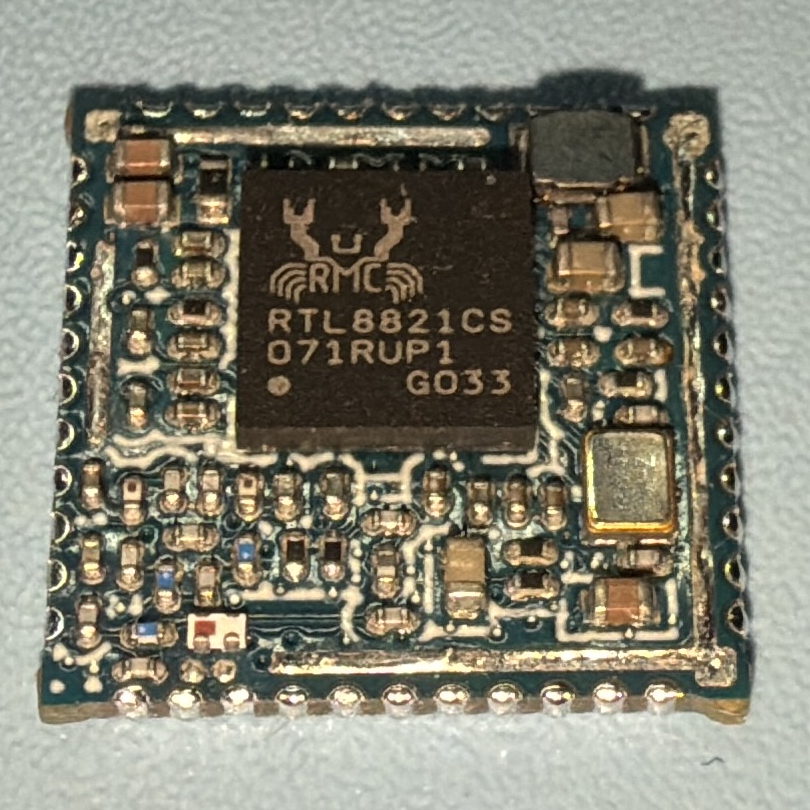

# RTL8821CS SDIO PCBA Testing

### Test SDIO Gear

|Test Board|SDIO Dongle HW|
|-|-|
|||

```
6.1.111-rt42

DISTRIB_ID=Ubuntu
DISTRIB_RELEASE=20.04
DISTRIB_CODENAME=focal
DISTRIB_DESCRIPTION="Ubuntu 20.04.2 LTS"

Architecture:                         aarch64
CPU op-mode(s):                       32-bit, 64-bit
Byte Order:                           Little Endian
CPU(s):                               2
On-line CPU(s) list:                  0,1
Thread(s) per core:                   1
Core(s) per socket:                   2
Socket(s):                            1
Vendor ID:                            ARM
Model:                                0
Model name:                           Cortex-A35
Stepping:                             r1p0
BogoMIPS:                             66.66
Vulnerability Gather data sampling:   Not affected
Vulnerability Itlb multihit:          Not affected
Vulnerability L1tf:                   Not affected
Vulnerability Mds:                    Not affected
Vulnerability Meltdown:               Not affected
Vulnerability Mmio stale data:        Not affected
Vulnerability Reg file data sampling: Not affected
Vulnerability Retbleed:               Not affected
Vulnerability Spec rstack overflow:   Not affected
Vulnerability Spec store bypass:      Not affected
Vulnerability Spectre v1:             Mitigation; __user pointer sanitization
Vulnerability Spectre v2:             Not affected
Vulnerability Srbds:                  Not affected
Vulnerability Tsx async abort:        Not affected
Flags:                                fp asimd evtstrm aes pmull sha1 sha2 crc32 cpuid
```

### SDIO Tree

```
MMC_TYPE=SDIO
SDIO_ID=024C:C821
SDIO_REVISION=0.0
clock:		50000000 Hz
actual clock:	50000000 Hz
vdd:		21 (3.3 ~ 3.4 V)
bus mode:	2 (push-pull)
chip select:	0 (don't care)
power mode:	2 (on)
bus width:	2 (4 bits)
timing spec:	2 (sd high-speed)
signal voltage:	0 (3.30 V)
driver type:	0 (driver type B)
```

### Driver Load

The driver is loaded via "insmod"

```
Module                  Size  Used by
rtw_8821cs             16384  0
rtw_8821c              94208  1 rtw_8821cs
rtw_sdio               20480  1 rtw_8821cs
rtw_core              217088  2 rtw_sdio,rtw_8821c
```

### iw list

<details>

<summary>iw list</summary>

```
Wiphy phy1
	max # scan SSIDs: 4
	max scan IEs length: 2243 bytes
	max # sched scan SSIDs: 0
	max # match sets: 0
	Retry short limit: 7
	Retry long limit: 4
	Coverage class: 0 (up to 0m)
	Device supports T-DLS.
	Supported Ciphers:
		* WEP40 (00-0f-ac:1)
		* WEP104 (00-0f-ac:5)
		* TKIP (00-0f-ac:2)
		* CCMP-128 (00-0f-ac:4)
		* CCMP-256 (00-0f-ac:10)
		* GCMP-128 (00-0f-ac:8)
		* GCMP-256 (00-0f-ac:9)
		* CMAC (00-0f-ac:6)
		* CMAC-256 (00-0f-ac:13)
		* GMAC-128 (00-0f-ac:11)
		* GMAC-256 (00-0f-ac:12)
	Available Antennas: TX 0x1 RX 0x1
	Configured Antennas: TX 0x1 RX 0x1
	Supported interface modes:
		 * IBSS
		 * managed
		 * AP
		 * AP/VLAN
		 * monitor
		 * P2P-client
		 * P2P-GO
	Band 1:
		Capabilities: 0x196e
			HT20/HT40
			SM Power Save disabled
			RX HT20 SGI
			RX HT40 SGI
			RX STBC 1-stream
			Max AMSDU length: 7935 bytes
			DSSS/CCK HT40
		Maximum RX AMPDU length 65535 bytes (exponent: 0x003)
		Minimum RX AMPDU time spacing: 2 usec (0x04)
		HT Max RX data rate: 150 Mbps
		HT TX/RX MCS rate indexes supported: 0-7, 32
		Bitrates (non-HT):
			* 1.0 Mbps
			* 2.0 Mbps
			* 5.5 Mbps
			* 11.0 Mbps
			* 6.0 Mbps
			* 9.0 Mbps
			* 12.0 Mbps
			* 18.0 Mbps
			* 24.0 Mbps
			* 36.0 Mbps
			* 48.0 Mbps
			* 54.0 Mbps
		Frequencies:
			* 2412 MHz [1] (20.0 dBm)
			* 2417 MHz [2] (20.0 dBm)
			* 2422 MHz [3] (20.0 dBm)
			* 2427 MHz [4] (20.0 dBm)
			* 2432 MHz [5] (20.0 dBm)
			* 2437 MHz [6] (20.0 dBm)
			* 2442 MHz [7] (20.0 dBm)
			* 2447 MHz [8] (20.0 dBm)
			* 2452 MHz [9] (20.0 dBm)
			* 2457 MHz [10] (20.0 dBm)
			* 2462 MHz [11] (20.0 dBm)
			* 2467 MHz [12] (20.0 dBm)
			* 2472 MHz [13] (20.0 dBm)
			* 2484 MHz [14] (disabled)
	Band 2:
		Capabilities: 0x196e
			HT20/HT40
			SM Power Save disabled
			RX HT20 SGI
			RX HT40 SGI
			RX STBC 1-stream
			Max AMSDU length: 7935 bytes
			DSSS/CCK HT40
		Maximum RX AMPDU length 65535 bytes (exponent: 0x003)
		Minimum RX AMPDU time spacing: 2 usec (0x04)
		HT Max RX data rate: 150 Mbps
		HT TX/RX MCS rate indexes supported: 0-7, 32
		VHT Capabilities (0x03d07122):
			Max MPDU length: 11454
			Supported Channel Width: neither 160 nor 80+80
			short GI (80 MHz)
			SU Beamformee
			MU Beamformee
			+HTC-VHT
		VHT RX MCS set:
			1 streams: MCS 0-9
			2 streams: not supported
			3 streams: not supported
			4 streams: not supported
			5 streams: not supported
			6 streams: not supported
			7 streams: not supported
			8 streams: not supported
		VHT RX highest supported: 390 Mbps
		VHT TX MCS set:
			1 streams: MCS 0-9
			2 streams: not supported
			3 streams: not supported
			4 streams: not supported
			5 streams: not supported
			6 streams: not supported
			7 streams: not supported
			8 streams: not supported
		VHT TX highest supported: 390 Mbps
		Bitrates (non-HT):
			* 6.0 Mbps
			* 9.0 Mbps
			* 12.0 Mbps
			* 18.0 Mbps
			* 24.0 Mbps
			* 36.0 Mbps
			* 48.0 Mbps
			* 54.0 Mbps
		Frequencies:
			* 5180 MHz [36] (23.0 dBm)
			* 5200 MHz [40] (23.0 dBm)
			* 5220 MHz [44] (23.0 dBm)
			* 5240 MHz [48] (23.0 dBm)
			* 5260 MHz [52] (20.0 dBm) (radar detection)
			* 5280 MHz [56] (20.0 dBm) (radar detection)
			* 5300 MHz [60] (20.0 dBm) (radar detection)
			* 5320 MHz [64] (20.0 dBm) (radar detection)
			* 5500 MHz [100] (26.0 dBm) (radar detection)
			* 5520 MHz [104] (26.0 dBm) (radar detection)
			* 5540 MHz [108] (26.0 dBm) (radar detection)
			* 5560 MHz [112] (26.0 dBm) (radar detection)
			* 5580 MHz [116] (26.0 dBm) (radar detection)
			* 5600 MHz [120] (26.0 dBm) (radar detection)
			* 5620 MHz [124] (26.0 dBm) (radar detection)
			* 5640 MHz [128] (26.0 dBm) (radar detection)
			* 5660 MHz [132] (26.0 dBm) (radar detection)
			* 5680 MHz [136] (26.0 dBm) (radar detection)
			* 5700 MHz [140] (26.0 dBm) (radar detection)
			* 5720 MHz [144] (13.0 dBm) (radar detection)
			* 5745 MHz [149] (13.0 dBm)
			* 5765 MHz [153] (13.0 dBm)
			* 5785 MHz [157] (13.0 dBm)
			* 5805 MHz [161] (13.0 dBm)
			* 5825 MHz [165] (13.0 dBm)
	Supported commands:
		 * new_interface
		 * set_interface
		 * new_key
		 * start_ap
		 * new_station
		 * set_bss
		 * authenticate
		 * associate
		 * deauthenticate
		 * disassociate
		 * join_ibss
		 * remain_on_channel
		 * set_tx_bitrate_mask
		 * frame
		 * frame_wait_cancel
		 * set_wiphy_netns
		 * set_channel
		 * tdls_mgmt
		 * tdls_oper
		 * probe_client
		 * set_noack_map
		 * register_beacons
		 * start_p2p_device
		 * set_mcast_rate
		 * connect
		 * disconnect
		 * set_qos_map
		 * set_multicast_to_unicast
		 * Unknown command (140)
	software interface modes (can always be added):
		 * AP/VLAN
		 * monitor
	valid interface combinations:
		 * #{ managed } <= 1, #{ AP, P2P-client, P2P-GO } <= 1,
		   total <= 2, #channels <= 1
	HT Capability overrides:
		 * MCS: ff ff ff ff ff ff ff ff ff ff
		 * maximum A-MSDU length
		 * supported channel width
		 * short GI for 40 MHz
		 * max A-MPDU length exponent
		 * min MPDU start spacing
	Device supports TX status socket option.
	Device supports HT-IBSS.
	Device supports SAE with AUTHENTICATE command
	Device supports scan flush.
	Device supports per-vif TX power setting
	Driver supports full state transitions for AP/GO clients
	Driver supports a userspace MPM
	Device supports configuring vdev MAC-addr on create.
	Device supports randomizing MAC-addr in scans.
	max # scan plans: 1
	max scan plan interval: -1
	max scan plan iterations: 0
	Supported TX frame types:
		 * IBSS: 0x00 0x10 0x20 0x30 0x40 0x50 0x60 0x70 0x80 0x90 0xa0 0xb0 0xc0 0xd0 0xe0 0xf0
		 * managed: 0x00 0x10 0x20 0x30 0x40 0x50 0x60 0x70 0x80 0x90 0xa0 0xb0 0xc0 0xd0 0xe0 0xf0
		 * AP: 0x00 0x10 0x20 0x30 0x40 0x50 0x60 0x70 0x80 0x90 0xa0 0xb0 0xc0 0xd0 0xe0 0xf0
		 * AP/VLAN: 0x00 0x10 0x20 0x30 0x40 0x50 0x60 0x70 0x80 0x90 0xa0 0xb0 0xc0 0xd0 0xe0 0xf0
		 * mesh point: 0x00 0x10 0x20 0x30 0x40 0x50 0x60 0x70 0x80 0x90 0xa0 0xb0 0xc0 0xd0 0xe0 0xf0
		 * P2P-client: 0x00 0x10 0x20 0x30 0x40 0x50 0x60 0x70 0x80 0x90 0xa0 0xb0 0xc0 0xd0 0xe0 0xf0
		 * P2P-GO: 0x00 0x10 0x20 0x30 0x40 0x50 0x60 0x70 0x80 0x90 0xa0 0xb0 0xc0 0xd0 0xe0 0xf0
		 * P2P-device: 0x00 0x10 0x20 0x30 0x40 0x50 0x60 0x70 0x80 0x90 0xa0 0xb0 0xc0 0xd0 0xe0 0xf0
	Supported RX frame types:
		 * IBSS: 0x40 0xb0 0xc0 0xd0
		 * managed: 0x40 0xb0 0xd0
		 * AP: 0x00 0x20 0x40 0xa0 0xb0 0xc0 0xd0
		 * AP/VLAN: 0x00 0x20 0x40 0xa0 0xb0 0xc0 0xd0
		 * mesh point: 0xb0 0xc0 0xd0
		 * P2P-client: 0x40 0xd0
		 * P2P-GO: 0x00 0x20 0x40 0xa0 0xb0 0xc0 0xd0
		 * P2P-device: 0x40 0xd0
	Supported extended features:
		* [ RRM ]: RRM
		* [ SET_SCAN_DWELL ]: scan dwell setting
		* [ FILS_STA ]: STA FILS (Fast Initial Link Setup)
		* [ CONTROL_PORT_OVER_NL80211 ]: control port over nl80211
		* [ TXQS ]: FQ-CoDel-enabled intermediate TXQs
```

</details>

### Network Manager - Band 2.4

```
wlan0: flags=4163<UP,BROADCAST,RUNNING,MULTICAST>  mtu 1500
        inet 192.168.1.19  netmask 255.255.252.0  broadcast 192.168.3.255
        RX packets 16  bytes 2610 (2.6 KB)
        RX errors 0  dropped 0  overruns 0  frame 0
        TX packets 30  bytes 5193 (5.1 KB)
        TX errors 0  dropped 0 overruns 0  carrier 0  collisions 0
```

### iwconfig 2.4

```
wlan0     IEEE 802.11  ESSID:""  
          Mode:Managed  Frequency:2.412 GHz  Access Point: 
          Bit Rate=81 Mb/s   Tx-Power=20 dBm   
          Retry short limit:7   RTS thr:off   Fragment thr:off
          Encryption key:off
          Power Management:on
          Link Quality=32/70  Signal level=-78 dBm  
          Rx invalid nwid:0  Rx invalid crypt:0  Rx invalid frag:0
          Tx excessive retries:0  Invalid misc:0   Missed beacon:0

```

### Network Speed Test via Ookla - Band 2.4

```
Retrieving speedtest.net configuration...
Retrieving speedtest.net server list...
Selecting best server based on ping...
Testing download speed................................................................................
Download: 9.54 Mbit/s
Testing upload speed......................................................................................................
Upload: 10.33 Mbit/s
```

### Network Ping Tests - Band 2.4

#### DNS-Ping

```
PING 8.8.8.8 (8.8.8.8) 56(84) bytes of data.
64 bytes from 8.8.8.8: icmp_seq=1 ttl=118 time=55.1 ms
64 bytes from 8.8.8.8: icmp_seq=2 ttl=118 time=10.4 ms
64 bytes from 8.8.8.8: icmp_seq=3 ttl=118 time=5.36 ms
64 bytes from 8.8.8.8: icmp_seq=4 ttl=118 time=4.65 ms
64 bytes from 8.8.8.8: icmp_seq=5 ttl=118 time=13.2 ms
64 bytes from 8.8.8.8: icmp_seq=6 ttl=118 time=3.92 ms
64 bytes from 8.8.8.8: icmp_seq=7 ttl=118 time=8.92 ms
64 bytes from 8.8.8.8: icmp_seq=8 ttl=118 time=4.62 ms
64 bytes from 8.8.8.8: icmp_seq=9 ttl=118 time=4.85 ms
64 bytes from 8.8.8.8: icmp_seq=10 ttl=118 time=4.90 ms
64 bytes from 8.8.8.8: icmp_seq=11 ttl=118 time=51.2 ms
64 bytes from 8.8.8.8: icmp_seq=12 ttl=118 time=65.2 ms
64 bytes from 8.8.8.8: icmp_seq=13 ttl=118 time=65.1 ms
64 bytes from 8.8.8.8: icmp_seq=14 ttl=118 time=5.46 ms
64 bytes from 8.8.8.8: icmp_seq=15 ttl=118 time=4.42 ms
64 bytes from 8.8.8.8: icmp_seq=16 ttl=118 time=3.92 ms
64 bytes from 8.8.8.8: icmp_seq=17 ttl=118 time=5.20 ms
64 bytes from 8.8.8.8: icmp_seq=18 ttl=118 time=4.28 ms
64 bytes from 8.8.8.8: icmp_seq=19 ttl=118 time=4.06 ms
64 bytes from 8.8.8.8: icmp_seq=20 ttl=118 time=15.3 ms

--- 8.8.8.8 ping statistics ---
20 packets transmitted, 20 received, 0% packet loss, time 19036ms
rtt min/avg/max/mdev = 3.922/16.999/65.207/21.463 ms
```

#### Self-Ping 

```
PING 192.168.1.19 (192.168.1.19) 10000(10028) bytes of data.
10008 bytes from 192.168.1.19: icmp_seq=1 ttl=64 time=0.178 ms
10008 bytes from 192.168.1.19: icmp_seq=2 ttl=64 time=0.115 ms
10008 bytes from 192.168.1.19: icmp_seq=3 ttl=64 time=0.151 ms
10008 bytes from 192.168.1.19: icmp_seq=4 ttl=64 time=0.145 ms
10008 bytes from 192.168.1.19: icmp_seq=5 ttl=64 time=0.121 ms
10008 bytes from 192.168.1.19: icmp_seq=6 ttl=64 time=0.147 ms
10008 bytes from 192.168.1.19: icmp_seq=7 ttl=64 time=0.141 ms
10008 bytes from 192.168.1.19: icmp_seq=8 ttl=64 time=0.122 ms
10008 bytes from 192.168.1.19: icmp_seq=9 ttl=64 time=0.113 ms
10008 bytes from 192.168.1.19: icmp_seq=10 ttl=64 time=0.116 ms
10008 bytes from 192.168.1.19: icmp_seq=11 ttl=64 time=0.151 ms
10008 bytes from 192.168.1.19: icmp_seq=12 ttl=64 time=0.151 ms
10008 bytes from 192.168.1.19: icmp_seq=13 ttl=64 time=0.146 ms
10008 bytes from 192.168.1.19: icmp_seq=14 ttl=64 time=0.135 ms
10008 bytes from 192.168.1.19: icmp_seq=15 ttl=64 time=0.125 ms
10008 bytes from 192.168.1.19: icmp_seq=16 ttl=64 time=0.132 ms
10008 bytes from 192.168.1.19: icmp_seq=17 ttl=64 time=0.118 ms
10008 bytes from 192.168.1.19: icmp_seq=18 ttl=64 time=0.118 ms
10008 bytes from 192.168.1.19: icmp_seq=19 ttl=64 time=0.144 ms
10008 bytes from 192.168.1.19: icmp_seq=20 ttl=64 time=0.127 ms

--- 192.168.1.19 ping statistics ---
20 packets transmitted, 20 received, 0% packet loss, time 19452ms
rtt min/avg/max/mdev = 0.113/0.134/0.178/0.016 ms
```

### Server & Client Test via iperf3 (PC-Router-DUT)

<details>

<summary>iperf3</summary>

```
-----------------------------------------------------------
Server listening on 5201
-----------------------------------------------------------
Accepted connection from 192.168.1.3, port 51531
[  5] local 192.168.1.19 port 5201 connected to 192.168.1.3 port 51532
[ ID] Interval           Transfer     Bitrate         Retr  Cwnd
[  5]   0.00-1.00   sec  2.95 MBytes  24.8 Mbits/sec    0    204 KBytes       
[  5]   1.00-2.00   sec  2.14 MBytes  18.0 Mbits/sec    0    257 KBytes       
[  5]   2.00-3.00   sec  1.29 MBytes  10.8 Mbits/sec    0    258 KBytes       
[  5]   3.00-4.00   sec  1.65 MBytes  13.9 Mbits/sec    0    258 KBytes       
[  5]   4.00-5.00   sec  1.78 MBytes  14.9 Mbits/sec    1    195 KBytes       
[  5]   5.00-6.00   sec  1.10 MBytes  9.25 Mbits/sec    0    222 KBytes       
[  5]   6.00-7.00   sec  1.65 MBytes  13.9 Mbits/sec    0    245 KBytes       
[  5]   7.00-8.00   sec  1.16 MBytes  9.77 Mbits/sec    1    261 KBytes       
[  5]   8.00-9.00   sec  1.72 MBytes  14.4 Mbits/sec    0    261 KBytes       
[  5]   9.00-10.00  sec   565 KBytes  4.62 Mbits/sec    1   57.0 KBytes       
[  5]  10.00-11.00  sec  0.00 Bytes  0.00 bits/sec    0   81.3 KBytes       
[  5]  11.00-12.00  sec  0.00 Bytes  0.00 bits/sec    0    124 KBytes       
[  5]  12.00-13.00  sec  1.10 MBytes  9.26 Mbits/sec    0    164 KBytes       
[  5]  13.00-14.00  sec  0.00 Bytes  0.00 bits/sec    0    164 KBytes       
[  5]  14.00-15.00  sec  0.00 Bytes  0.00 bits/sec    1    164 KBytes       
[  5]  15.00-16.00  sec  0.00 Bytes  0.00 bits/sec    0    164 KBytes       
[  5]  16.00-17.00  sec  0.00 Bytes  0.00 bits/sec    0    164 KBytes       
[  5]  17.00-18.00  sec  0.00 Bytes  0.00 bits/sec    0    164 KBytes       
[  5]  18.00-19.00  sec  0.00 Bytes  0.00 bits/sec    0    164 KBytes       
[  5]  19.00-20.00  sec  2.21 MBytes  18.5 Mbits/sec    1    254 KBytes       
[  5]  20.00-21.00  sec  3.43 MBytes  28.8 Mbits/sec    0    268 KBytes       
[  5]  21.00-22.00  sec  2.88 MBytes  24.2 Mbits/sec    0    268 KBytes       
[  5]  22.00-23.00  sec  2.94 MBytes  24.7 Mbits/sec    0    268 KBytes       
[  5]  23.00-24.00  sec  3.37 MBytes  28.3 Mbits/sec    0    268 KBytes       
[  5]  24.00-25.00  sec  3.92 MBytes  32.9 Mbits/sec    0    268 KBytes       
[  5]  25.00-26.00  sec  3.92 MBytes  32.9 Mbits/sec    0    268 KBytes       
[  5]  26.00-27.00  sec  3.98 MBytes  33.4 Mbits/sec    0    268 KBytes       
[  5]  27.00-28.00  sec  3.37 MBytes  28.3 Mbits/sec    0    268 KBytes       
[  5]  28.00-29.00  sec  3.92 MBytes  32.9 Mbits/sec    0    268 KBytes       
[  5]  29.00-30.00  sec  4.41 MBytes  37.0 Mbits/sec    0    268 KBytes       
- - - - - - - - - - - - - - - - - - - - - - - - -
[ ID] Interval           Transfer     Bitrate         Retr
[  5]   0.00-30.06  sec  55.5 MBytes  15.5 Mbits/sec    5             sender
-----------------------------------------------------------
Server listening on 5201
-----------------------------------------------------------
[   53.344088] rtw_core: loading out-of-tree module taints kernel.
[   54.135420] rtw_8821cs mmc1:0001:1: Firmware version 24.11.0, H2C version 12
[   95.341259] rtw_8821cs mmc1:0001:1: Firmware version 24.11.0, H2C version 12
```

### Network Manager - Band 5G

```
wlan0: flags=4163<UP,BROADCAST,RUNNING,MULTICAST>  mtu 1500
        inet 192.168.1.19  netmask 255.255.252.0  broadcast 192.168.3.255
        RX packets 28509  bytes 14783481 (14.7 MB)
        RX errors 0  dropped 11  overruns 0  frame 0
        TX packets 56192  bytes 75281459 (75.2 MB)
        TX errors 0  dropped 0 overruns 0  carrier 0  collisions 0
```

### iwconfig 5G

```
wlan0     IEEE 802.11  ESSID:""  
          Mode:Managed  Frequency:5.805 GHz  Access Point: 
          Bit Rate=260 Mb/s   Tx-Power=13 dBm   
          Retry short limit:7   RTS thr:off   Fragment thr:off
          Encryption key:off
          Power Management:on
          Link Quality=53/70  Signal level=-57 dBm  
          Rx invalid nwid:0  Rx invalid crypt:0  Rx invalid frag:0
          Tx excessive retries:0  Invalid misc:0   Missed beacon:0

```

### Network Speed Test via Ookla - Band 5G

```
Retrieving speedtest.net configuration...
Retrieving speedtest.net server list...
Selecting best server based on ping...
Testing download speed................................................................................
Download: 45.39 Mbit/s
Testing upload speed......................................................................................................
Upload: 14.73 Mbit/s
```

### Network Ping Tests - Band 5G

#### DNS-Ping

```
PING 8.8.8.8 (8.8.8.8) 56(84) bytes of data.
64 bytes from 8.8.8.8: icmp_seq=1 ttl=118 time=6.46 ms
64 bytes from 8.8.8.8: icmp_seq=2 ttl=118 time=5.41 ms
64 bytes from 8.8.8.8: icmp_seq=3 ttl=118 time=4.17 ms
64 bytes from 8.8.8.8: icmp_seq=4 ttl=118 time=4.01 ms
64 bytes from 8.8.8.8: icmp_seq=5 ttl=118 time=6.11 ms
64 bytes from 8.8.8.8: icmp_seq=6 ttl=118 time=4.14 ms
64 bytes from 8.8.8.8: icmp_seq=7 ttl=118 time=6.61 ms
64 bytes from 8.8.8.8: icmp_seq=8 ttl=118 time=5.99 ms
64 bytes from 8.8.8.8: icmp_seq=9 ttl=118 time=5.18 ms
64 bytes from 8.8.8.8: icmp_seq=10 ttl=118 time=4.58 ms
64 bytes from 8.8.8.8: icmp_seq=11 ttl=118 time=4.90 ms
64 bytes from 8.8.8.8: icmp_seq=12 ttl=118 time=4.34 ms
64 bytes from 8.8.8.8: icmp_seq=13 ttl=118 time=5.21 ms
64 bytes from 8.8.8.8: icmp_seq=14 ttl=118 time=4.31 ms
64 bytes from 8.8.8.8: icmp_seq=15 ttl=118 time=4.97 ms
64 bytes from 8.8.8.8: icmp_seq=16 ttl=118 time=4.08 ms
64 bytes from 8.8.8.8: icmp_seq=17 ttl=118 time=4.77 ms
64 bytes from 8.8.8.8: icmp_seq=18 ttl=118 time=3.87 ms
64 bytes from 8.8.8.8: icmp_seq=19 ttl=118 time=4.79 ms
64 bytes from 8.8.8.8: icmp_seq=20 ttl=118 time=4.35 ms

--- 8.8.8.8 ping statistics ---
20 packets transmitted, 20 received, 0% packet loss, time 19028ms
rtt min/avg/max/mdev = 3.868/4.911/6.609/0.811 ms
```

#### Self-Ping 

```
PING 192.168.1.19 (192.168.1.19) 10000(10028) bytes of data.
10008 bytes from 192.168.1.19: icmp_seq=1 ttl=64 time=0.124 ms
10008 bytes from 192.168.1.19: icmp_seq=2 ttl=64 time=0.127 ms
10008 bytes from 192.168.1.19: icmp_seq=3 ttl=64 time=0.104 ms
10008 bytes from 192.168.1.19: icmp_seq=4 ttl=64 time=0.142 ms
10008 bytes from 192.168.1.19: icmp_seq=5 ttl=64 time=0.142 ms
10008 bytes from 192.168.1.19: icmp_seq=6 ttl=64 time=0.100 ms
10008 bytes from 192.168.1.19: icmp_seq=7 ttl=64 time=0.087 ms
10008 bytes from 192.168.1.19: icmp_seq=8 ttl=64 time=0.143 ms
10008 bytes from 192.168.1.19: icmp_seq=9 ttl=64 time=0.107 ms
10008 bytes from 192.168.1.19: icmp_seq=10 ttl=64 time=0.145 ms
10008 bytes from 192.168.1.19: icmp_seq=11 ttl=64 time=0.141 ms
10008 bytes from 192.168.1.19: icmp_seq=12 ttl=64 time=0.108 ms
10008 bytes from 192.168.1.19: icmp_seq=13 ttl=64 time=0.102 ms
10008 bytes from 192.168.1.19: icmp_seq=14 ttl=64 time=0.150 ms
10008 bytes from 192.168.1.19: icmp_seq=15 ttl=64 time=0.136 ms
10008 bytes from 192.168.1.19: icmp_seq=16 ttl=64 time=0.112 ms
10008 bytes from 192.168.1.19: icmp_seq=17 ttl=64 time=0.142 ms
10008 bytes from 192.168.1.19: icmp_seq=18 ttl=64 time=0.142 ms
10008 bytes from 192.168.1.19: icmp_seq=19 ttl=64 time=0.098 ms
10008 bytes from 192.168.1.19: icmp_seq=20 ttl=64 time=0.142 ms

--- 192.168.1.19 ping statistics ---
20 packets transmitted, 20 received, 0% packet loss, time 19463ms
rtt min/avg/max/mdev = 0.087/0.124/0.150/0.019 ms
```

### Server & Client Test via iperf3 (PC-Router-DUT)

<details>

<summary>iperf3</summary>

```
-----------------------------------------------------------
Server listening on 5201
-----------------------------------------------------------
Accepted connection from 192.168.1.3, port 59868
[  5] local 192.168.1.19 port 5201 connected to 192.168.1.3 port 59869
[ ID] Interval           Transfer     Bitrate         Retr  Cwnd
[  5]   0.00-1.00   sec  1.45 MBytes  12.2 Mbits/sec   25   68.4 KBytes       
[  5]   1.00-2.00   sec  4.50 MBytes  37.8 Mbits/sec    0    133 KBytes       
[  5]   2.00-3.00   sec  4.29 MBytes  36.0 Mbits/sec    0    133 KBytes       
[  5]   3.00-4.00   sec  4.29 MBytes  36.0 Mbits/sec    0    133 KBytes       
[  5]   4.00-5.00   sec  4.29 MBytes  36.0 Mbits/sec    0    133 KBytes       
[  5]   5.00-6.00   sec  4.41 MBytes  37.0 Mbits/sec    0    133 KBytes       
[  5]   6.00-7.00   sec  4.35 MBytes  36.5 Mbits/sec    0    133 KBytes       
[  5]   7.00-8.00   sec  4.66 MBytes  39.1 Mbits/sec    0    133 KBytes       
[  5]   8.00-9.00   sec  4.04 MBytes  33.9 Mbits/sec    0    133 KBytes       
[  5]   9.00-10.00  sec  4.66 MBytes  39.1 Mbits/sec    0    133 KBytes       
[  5]  10.00-11.00  sec  4.29 MBytes  36.0 Mbits/sec    0    133 KBytes       
[  5]  11.00-12.00  sec  3.98 MBytes  33.4 Mbits/sec    1    133 KBytes       
[  5]  12.00-13.00  sec  3.98 MBytes  33.4 Mbits/sec    4    115 KBytes       
[  5]  13.00-14.00  sec  4.59 MBytes  38.5 Mbits/sec    0    130 KBytes       
[  5]  14.00-15.00  sec  4.66 MBytes  39.1 Mbits/sec    0    130 KBytes       
[  5]  15.00-16.00  sec  4.04 MBytes  33.9 Mbits/sec    0    137 KBytes       
[  5]  16.00-17.00  sec  5.21 MBytes  43.7 Mbits/sec    0    157 KBytes       
[  5]  17.00-18.00  sec  3.74 MBytes  31.3 Mbits/sec    5    115 KBytes       
[  5]  18.00-19.00  sec  4.10 MBytes  34.4 Mbits/sec    0    144 KBytes       
[  5]  19.00-20.00  sec  4.78 MBytes  40.1 Mbits/sec    0    160 KBytes       
[  5]  20.00-21.00  sec  4.29 MBytes  36.0 Mbits/sec    0    175 KBytes       
[  5]  21.00-22.00  sec  4.72 MBytes  39.6 Mbits/sec    0    194 KBytes       
[  5]  22.00-23.00  sec  4.78 MBytes  40.1 Mbits/sec    0    208 KBytes       
[  5]  23.00-24.00  sec  4.78 MBytes  40.1 Mbits/sec    0    214 KBytes       
[  5]  24.00-25.00  sec  4.10 MBytes  34.4 Mbits/sec    0    220 KBytes       
[  5]  25.00-26.00  sec  4.47 MBytes  37.5 Mbits/sec    0    231 KBytes       
[  5]  26.00-27.00  sec  4.04 MBytes  33.9 Mbits/sec    0    235 KBytes       
[  5]  27.00-28.00  sec  4.10 MBytes  34.4 Mbits/sec  103   61.3 KBytes       
[  5]  28.00-29.00  sec  2.63 MBytes  22.1 Mbits/sec   86   39.9 KBytes       
[  5]  29.00-30.00  sec  3.06 MBytes  25.7 Mbits/sec   29   67.0 KBytes       
- - - - - - - - - - - - - - - - - - - - - - - - -
[ ID] Interval           Transfer     Bitrate         Retr
[  5]   0.00-30.05  sec   125 MBytes  35.0 Mbits/sec  253             sender
-----------------------------------------------------------
Server listening on 5201
-----------------------------------------------------------
[   53.344088] rtw_core: loading out-of-tree module taints kernel.
[   54.135420] rtw_8821cs mmc1:0001:1: Firmware version 24.11.0, H2C version 12
[   95.341259] rtw_8821cs mmc1:0001:1: Firmware version 24.11.0, H2C version 12
```

</details>

### AP Test

#### hostapd.conf

Setup the configuration at /etc/hostapd/hostapd.conf

```
interface=wlan0
driver=nl80211
ieee80211n=1
hw_mode=g
channel=6
ssid=AP-TEST
wpa=2
wpa_passphrase=12345678
wpa_key_mgmt=WPA-PSK
rsn_pairwise=CCMP TKIP
wpa_pairwise=TKIP CCMP
```

#### udhcpd.conf

```
start 192.168.175.2
end 192.168.175.254
interface wlan0
max_leases 234
opt router 192.168.175.1
```

#### Start AP Test

```
sudo hostapd /etc/hostapd/hostapd.conf -B
Using interface wlan0 with hwaddr and ssid "AP-NAME"
wlan0: interface state UNINITIALIZED->ENABLED
wlan0: AP-ENABLED
```

#### Server & Client Test via iperf3 (PC-DUT)

Host unable to connect to AP!

<details>

<summary>iperf3</summary>

```
Wlan0 Not Ready.
Start AP @ WLAN0
Configuration file: /etc/hostapd/hostapd.conf
Using interface wlan0 with hwaddr 14:5d:34:cc:eb:7f and ssid "AP-TEST"
wlan0: interface state UNINITIALIZED->ENABLED
wlan0: AP-ENABLED 
-----------------------------------------------------------
Server listening on 5201
-----------------------------------------------------------
[   53.344088] rtw_core: loading out-of-tree module taints kernel.
[   54.135420] rtw_8821cs mmc1:0001:1: Firmware version 24.11.0, H2C version 12
[   95.341259] rtw_8821cs mmc1:0001:1: Firmware version 24.11.0, H2C version 12
```

</details>

### End of Report
