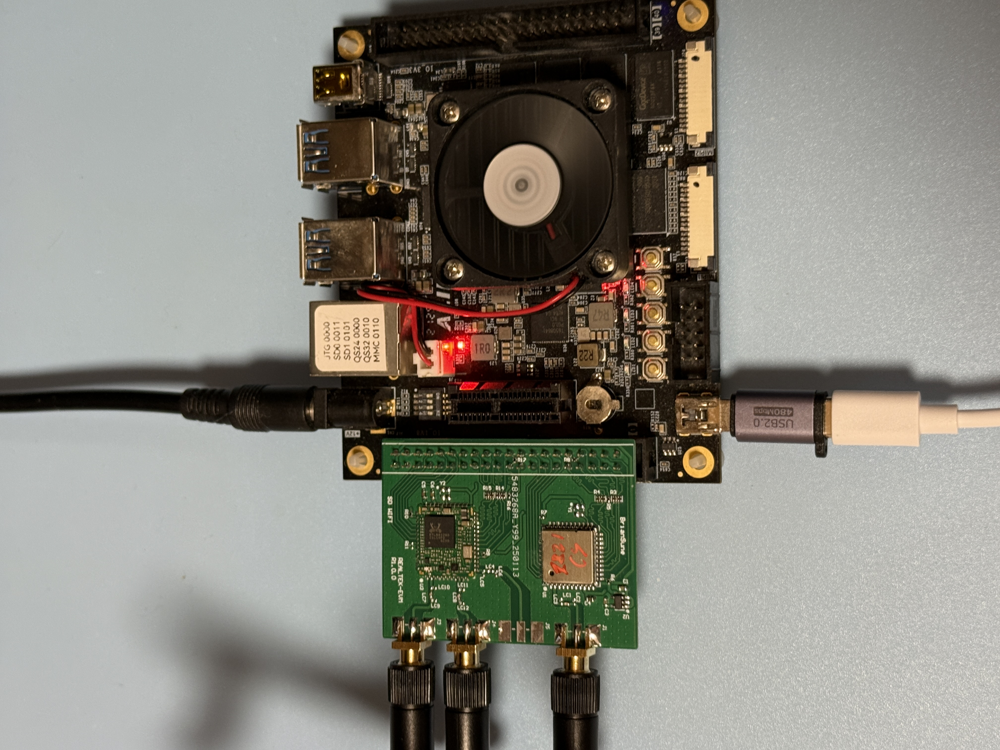

# RTL8821CS SDIO PCBA Testing

### Test SDIO Gear

|Test Board|SDIO Dongle HW|
|-|-|
|||

```
5.4.0

DISTRIB_ID=Ubuntu
DISTRIB_RELEASE=18.04
DISTRIB_CODENAME=bionic
DISTRIB_DESCRIPTION="Ubuntu 18.04.6 LTS"

Architecture:        aarch64
Byte Order:          Little Endian
CPU(s):              2
On-line CPU(s) list: 0,1
Thread(s) per core:  1
Core(s) per socket:  2
Socket(s):           1
Vendor ID:           ARM
Model:               4
Model name:          Cortex-A53
Stepping:            r0p4
CPU max MHz:         1199.9990
CPU min MHz:         299.9990
BogoMIPS:            66.66
Flags:               fp asimd aes pmull sha1 sha2 crc32 cpuid
```

### SDIO Tree

```
SDIO_CLASS=07
SDIO_ID=024C:C821
MODALIAS=sdio:c07v024CdC821
clock:		50000000 Hz
actual clock:	50000000 Hz
vdd:		21 (3.3 ~ 3.4 V)
bus mode:	2 (push-pull)
chip select:	0 (don't care)
power mode:	2 (on)
bus width:	2 (4 bits)
timing spec:	7 (sd uhs DDR50)
signal voltage:	1 (1.80 V)
driver type:	0 (driver type B)
```

### Driver Load

The driver is loaded via "insmod"

```
Module                  Size  Used by
rtw_8821cs             16384  0
rtw_8821c              90112  1 rtw_8821cs
rtw_sdio               20480  1 rtw_8821cs
rtw_core              208896  2 rtw_sdio,rtw_8821c
```

### iw list

<details>

<summary>iw list</summary>

```
Wiphy phy0
	max # scan SSIDs: 4
	max scan IEs length: 2243 bytes
	max # sched scan SSIDs: 0
	max # match sets: 0
	max # scan plans: 1
	max scan plan interval: -1
	max scan plan iterations: 0
	Retry short limit: 7
	Retry long limit: 4
	Coverage class: 0 (up to 0m)
	Device supports T-DLS.
	Supported Ciphers:
		* WEP40 (00-0f-ac:1)
		* WEP104 (00-0f-ac:5)
		* TKIP (00-0f-ac:2)
		* CCMP-128 (00-0f-ac:4)
		* CCMP-256 (00-0f-ac:10)
		* GCMP-128 (00-0f-ac:8)
		* GCMP-256 (00-0f-ac:9)
		* CMAC (00-0f-ac:6)
		* CMAC-256 (00-0f-ac:13)
		* GMAC-128 (00-0f-ac:11)
		* GMAC-256 (00-0f-ac:12)
	Available Antennas: TX 0x1 RX 0x1
	Configured Antennas: TX 0x1 RX 0x1
	Supported interface modes:
		 * IBSS
		 * managed
		 * AP
		 * AP/VLAN
		 * monitor
		 * P2P-client
		 * P2P-GO
	Band 1:
		Capabilities: 0x196e
			HT20/HT40
			SM Power Save disabled
			RX HT20 SGI
			RX HT40 SGI
			RX STBC 1-stream
			Max AMSDU length: 7935 bytes
			DSSS/CCK HT40
		Maximum RX AMPDU length 65535 bytes (exponent: 0x003)
		Minimum RX AMPDU time spacing: 2 usec (0x04)
		HT Max RX data rate: 150 Mbps
		HT TX/RX MCS rate indexes supported: 0-7, 32
		Bitrates (non-HT):
			* 1.0 Mbps
			* 2.0 Mbps
			* 5.5 Mbps
			* 11.0 Mbps
			* 6.0 Mbps
			* 9.0 Mbps
			* 12.0 Mbps
			* 18.0 Mbps
			* 24.0 Mbps
			* 36.0 Mbps
			* 48.0 Mbps
			* 54.0 Mbps
		Frequencies:
			* 2412 MHz [1] (20.0 dBm)
			* 2417 MHz [2] (20.0 dBm)
			* 2422 MHz [3] (20.0 dBm)
			* 2427 MHz [4] (20.0 dBm)
			* 2432 MHz [5] (20.0 dBm)
			* 2437 MHz [6] (20.0 dBm)
			* 2442 MHz [7] (20.0 dBm)
			* 2447 MHz [8] (20.0 dBm)
			* 2452 MHz [9] (20.0 dBm)
			* 2457 MHz [10] (20.0 dBm)
			* 2462 MHz [11] (20.0 dBm)
			* 2467 MHz [12] (20.0 dBm) (no IR)
			* 2472 MHz [13] (20.0 dBm) (no IR)
			* 2484 MHz [14] (20.0 dBm) (no IR)
	Band 2:
		Capabilities: 0x196e
			HT20/HT40
			SM Power Save disabled
			RX HT20 SGI
			RX HT40 SGI
			RX STBC 1-stream
			Max AMSDU length: 7935 bytes
			DSSS/CCK HT40
		Maximum RX AMPDU length 65535 bytes (exponent: 0x003)
		Minimum RX AMPDU time spacing: 2 usec (0x04)
		HT Max RX data rate: 150 Mbps
		HT TX/RX MCS rate indexes supported: 0-7, 32
		VHT Capabilities (0x03d07122):
			Max MPDU length: 11454
			Supported Channel Width: neither 160 nor 80+80
			short GI (80 MHz)
			SU Beamformee
			MU Beamformee
			+HTC-VHT
		VHT RX MCS set:
			1 streams: MCS 0-9
			2 streams: not supported
			3 streams: not supported
			4 streams: not supported
			5 streams: not supported
			6 streams: not supported
			7 streams: not supported
			8 streams: not supported
		VHT RX highest supported: 390 Mbps
		VHT TX MCS set:
			1 streams: MCS 0-9
			2 streams: not supported
			3 streams: not supported
			4 streams: not supported
			5 streams: not supported
			6 streams: not supported
			7 streams: not supported
			8 streams: not supported
		VHT TX highest supported: 390 Mbps
		Bitrates (non-HT):
			* 6.0 Mbps
			* 9.0 Mbps
			* 12.0 Mbps
			* 18.0 Mbps
			* 24.0 Mbps
			* 36.0 Mbps
			* 48.0 Mbps
			* 54.0 Mbps
		Frequencies:
			* 5180 MHz [36] (20.0 dBm) (no IR)
			* 5200 MHz [40] (20.0 dBm) (no IR)
			* 5220 MHz [44] (20.0 dBm) (no IR)
			* 5240 MHz [48] (20.0 dBm) (no IR)
			* 5260 MHz [52] (20.0 dBm) (no IR, radar detection)
			* 5280 MHz [56] (20.0 dBm) (no IR, radar detection)
			* 5300 MHz [60] (20.0 dBm) (no IR, radar detection)
			* 5320 MHz [64] (20.0 dBm) (no IR, radar detection)
			* 5500 MHz [100] (20.0 dBm) (no IR, radar detection)
			* 5520 MHz [104] (20.0 dBm) (no IR, radar detection)
			* 5540 MHz [108] (20.0 dBm) (no IR, radar detection)
			* 5560 MHz [112] (20.0 dBm) (no IR, radar detection)
			* 5580 MHz [116] (20.0 dBm) (no IR, radar detection)
			* 5600 MHz [120] (20.0 dBm) (no IR, radar detection)
			* 5620 MHz [124] (20.0 dBm) (no IR, radar detection)
			* 5640 MHz [128] (20.0 dBm) (no IR, radar detection)
			* 5660 MHz [132] (20.0 dBm) (no IR, radar detection)
			* 5680 MHz [136] (20.0 dBm) (no IR, radar detection)
			* 5700 MHz [140] (20.0 dBm) (no IR, radar detection)
			* 5720 MHz [144] (20.0 dBm) (no IR, radar detection)
			* 5745 MHz [149] (20.0 dBm) (no IR)
			* 5765 MHz [153] (20.0 dBm) (no IR)
			* 5785 MHz [157] (20.0 dBm) (no IR)
			* 5805 MHz [161] (20.0 dBm) (no IR)
			* 5825 MHz [165] (20.0 dBm) (no IR)
	Supported commands:
		 * new_interface
		 * set_interface
		 * new_key
		 * start_ap
		 * new_station
		 * set_bss
		 * authenticate
		 * associate
		 * deauthenticate
		 * disassociate
		 * join_ibss
		 * set_tx_bitrate_mask
		 * frame
		 * frame_wait_cancel
		 * set_wiphy_netns
		 * set_channel
		 * set_wds_peer
		 * tdls_mgmt
		 * tdls_oper
		 * probe_client
		 * set_noack_map
		 * register_beacons
		 * start_p2p_device
		 * set_mcast_rate
		 * testmode
		 * connect
		 * disconnect
		 * set_qos_map
		 * set_multicast_to_unicast
	Supported TX frame types:
		 * IBSS: 0x00 0x10 0x20 0x30 0x40 0x50 0x60 0x70 0x80 0x90 0xa0 0xb0 0xc0 0xd0 0xe0 0xf0
		 * managed: 0x00 0x10 0x20 0x30 0x40 0x50 0x60 0x70 0x80 0x90 0xa0 0xb0 0xc0 0xd0 0xe0 0xf0
		 * AP: 0x00 0x10 0x20 0x30 0x40 0x50 0x60 0x70 0x80 0x90 0xa0 0xb0 0xc0 0xd0 0xe0 0xf0
		 * AP/VLAN: 0x00 0x10 0x20 0x30 0x40 0x50 0x60 0x70 0x80 0x90 0xa0 0xb0 0xc0 0xd0 0xe0 0xf0
		 * mesh point: 0x00 0x10 0x20 0x30 0x40 0x50 0x60 0x70 0x80 0x90 0xa0 0xb0 0xc0 0xd0 0xe0 0xf0
		 * P2P-client: 0x00 0x10 0x20 0x30 0x40 0x50 0x60 0x70 0x80 0x90 0xa0 0xb0 0xc0 0xd0 0xe0 0xf0
		 * P2P-GO: 0x00 0x10 0x20 0x30 0x40 0x50 0x60 0x70 0x80 0x90 0xa0 0xb0 0xc0 0xd0 0xe0 0xf0
		 * P2P-device: 0x00 0x10 0x20 0x30 0x40 0x50 0x60 0x70 0x80 0x90 0xa0 0xb0 0xc0 0xd0 0xe0 0xf0
	Supported RX frame types:
		 * IBSS: 0x40 0xb0 0xc0 0xd0
		 * managed: 0x40 0xd0
		 * AP: 0x00 0x20 0x40 0xa0 0xb0 0xc0 0xd0
		 * AP/VLAN: 0x00 0x20 0x40 0xa0 0xb0 0xc0 0xd0
		 * mesh point: 0xb0 0xc0 0xd0
		 * P2P-client: 0x40 0xd0
		 * P2P-GO: 0x00 0x20 0x40 0xa0 0xb0 0xc0 0xd0
		 * P2P-device: 0x40 0xd0
	software interface modes (can always be added):
		 * AP/VLAN
		 * monitor
	valid interface combinations:
		 * #{ managed } <= 1, #{ AP, P2P-client, P2P-GO } <= 1,
		   total <= 2, #channels <= 1
	HT Capability overrides:
		 * MCS: ff ff ff ff ff ff ff ff ff ff
		 * maximum A-MSDU length
		 * supported channel width
		 * short GI for 40 MHz
		 * max A-MPDU length exponent
		 * min MPDU start spacing
	Device supports TX status socket option.
	Device supports HT-IBSS.
	Device supports SAE with AUTHENTICATE command
	Device supports scan flush.
	Device supports per-vif TX power setting
	Driver supports full state transitions for AP/GO clients
	Driver supports a userspace MPM
	Device supports configuring vdev MAC-addr on create.
```

</details>

### Network Manager - Band 2.4

```
wlan0: flags=4163<UP,BROADCAST,RUNNING,MULTICAST>  mtu 1500
        inet 192.168.1.30  netmask 255.255.252.0  broadcast 192.168.3.255
        RX packets 15  bytes 1994 (1.9 KB)
        RX errors 0  dropped 0  overruns 0  frame 0
        TX packets 17  bytes 2330 (2.3 KB)
        TX errors 0  dropped 0 overruns 0  carrier 0  collisions 0
```

### iwconfig 2.4

```
wlan0     IEEE 802.11  ESSID:""  
          Mode:Managed  Frequency:2.412 GHz  Access Point: 
          Bit Rate=135 Mb/s   Tx-Power=20 dBm   
          Retry short limit:7   RTS thr:off   Fragment thr:off
          Encryption key:off
          Power Management:on
          Link Quality=64/70  Signal level=-46 dBm  
          Rx invalid nwid:0  Rx invalid crypt:0  Rx invalid frag:0
          Tx excessive retries:0  Invalid misc:1   Missed beacon:0

```

### Network Speed Test via Ookla - Band 2.4

```
Retrieving speedtest.net configuration...
Retrieving speedtest.net server list...
Selecting best server based on ping...
Testing download speed................................................................................
Download: 28.52 Mbit/s
Testing upload speed......................................................................................................
Upload: 3.84 Mbit/s
```

### Network Ping Tests - Band 2.4

#### DNS-Ping

```
PING 8.8.8.8 (8.8.8.8) 56(84) bytes of data.
64 bytes from 8.8.8.8: icmp_seq=1 ttl=118 time=4.10 ms
64 bytes from 8.8.8.8: icmp_seq=2 ttl=118 time=10.4 ms
64 bytes from 8.8.8.8: icmp_seq=3 ttl=118 time=6.98 ms
64 bytes from 8.8.8.8: icmp_seq=4 ttl=118 time=4.27 ms
64 bytes from 8.8.8.8: icmp_seq=5 ttl=118 time=4.20 ms
64 bytes from 8.8.8.8: icmp_seq=6 ttl=118 time=5.42 ms
64 bytes from 8.8.8.8: icmp_seq=7 ttl=118 time=6.72 ms
64 bytes from 8.8.8.8: icmp_seq=8 ttl=118 time=5.00 ms
64 bytes from 8.8.8.8: icmp_seq=9 ttl=118 time=4.04 ms
64 bytes from 8.8.8.8: icmp_seq=10 ttl=118 time=4.80 ms
64 bytes from 8.8.8.8: icmp_seq=11 ttl=118 time=4.86 ms
64 bytes from 8.8.8.8: icmp_seq=12 ttl=118 time=5.96 ms
64 bytes from 8.8.8.8: icmp_seq=13 ttl=118 time=4.25 ms
64 bytes from 8.8.8.8: icmp_seq=14 ttl=118 time=5.78 ms
64 bytes from 8.8.8.8: icmp_seq=15 ttl=118 time=4.64 ms
64 bytes from 8.8.8.8: icmp_seq=16 ttl=118 time=7.41 ms
64 bytes from 8.8.8.8: icmp_seq=17 ttl=118 time=6.70 ms
64 bytes from 8.8.8.8: icmp_seq=18 ttl=118 time=3.89 ms
64 bytes from 8.8.8.8: icmp_seq=19 ttl=118 time=4.48 ms
64 bytes from 8.8.8.8: icmp_seq=20 ttl=118 time=3.92 ms

--- 8.8.8.8 ping statistics ---
20 packets transmitted, 20 received, 0% packet loss, time 19020ms
rtt min/avg/max/mdev = 3.895/5.399/10.479/1.589 ms
```

#### Self-Ping 

```
PING 192.168.1.30 (192.168.1.30) 10000(10028) bytes of data.
10008 bytes from 192.168.1.30: icmp_seq=1 ttl=64 time=0.129 ms
10008 bytes from 192.168.1.30: icmp_seq=2 ttl=64 time=0.066 ms
10008 bytes from 192.168.1.30: icmp_seq=3 ttl=64 time=0.089 ms
10008 bytes from 192.168.1.30: icmp_seq=4 ttl=64 time=0.066 ms
10008 bytes from 192.168.1.30: icmp_seq=5 ttl=64 time=0.061 ms
10008 bytes from 192.168.1.30: icmp_seq=6 ttl=64 time=0.061 ms
10008 bytes from 192.168.1.30: icmp_seq=7 ttl=64 time=0.060 ms
10008 bytes from 192.168.1.30: icmp_seq=8 ttl=64 time=0.082 ms
10008 bytes from 192.168.1.30: icmp_seq=9 ttl=64 time=0.068 ms
10008 bytes from 192.168.1.30: icmp_seq=10 ttl=64 time=0.069 ms
10008 bytes from 192.168.1.30: icmp_seq=11 ttl=64 time=0.061 ms
10008 bytes from 192.168.1.30: icmp_seq=12 ttl=64 time=0.060 ms
10008 bytes from 192.168.1.30: icmp_seq=13 ttl=64 time=0.061 ms
10008 bytes from 192.168.1.30: icmp_seq=14 ttl=64 time=0.079 ms
10008 bytes from 192.168.1.30: icmp_seq=15 ttl=64 time=0.076 ms
10008 bytes from 192.168.1.30: icmp_seq=16 ttl=64 time=0.060 ms
10008 bytes from 192.168.1.30: icmp_seq=17 ttl=64 time=0.061 ms
10008 bytes from 192.168.1.30: icmp_seq=18 ttl=64 time=0.061 ms
10008 bytes from 192.168.1.30: icmp_seq=19 ttl=64 time=0.062 ms
10008 bytes from 192.168.1.30: icmp_seq=20 ttl=64 time=0.077 ms

--- 192.168.1.30 ping statistics ---
20 packets transmitted, 20 received, 0% packet loss, time 19444ms
rtt min/avg/max/mdev = 0.060/0.070/0.129/0.017 ms
```

### Server & Client Test via iperf3 (PC-Router-DUT)

<details>

<summary>iperf3</summary>

```
-----------------------------------------------------------
Server listening on 5201
-----------------------------------------------------------
Accepted connection from 192.168.1.3, port 51488
[  5] local 192.168.1.30 port 5201 connected to 192.168.1.3 port 51489
[ ID] Interval           Transfer     Bandwidth       Retr  Cwnd
[  5]   0.00-1.00   sec  5.25 MBytes  44.1 Mbits/sec    0    202 KBytes       
[  5]   1.00-2.00   sec  5.21 MBytes  43.7 Mbits/sec    0    267 KBytes       
[  5]   2.00-3.00   sec  4.59 MBytes  38.5 Mbits/sec    0    267 KBytes       
[  5]   3.00-4.00   sec  6.37 MBytes  53.4 Mbits/sec    0    267 KBytes       
[  5]   4.00-5.00   sec  5.15 MBytes  43.2 Mbits/sec    0    267 KBytes       
[  5]   5.00-6.00   sec  5.27 MBytes  44.2 Mbits/sec    0    267 KBytes       
[  5]   6.00-7.00   sec  5.82 MBytes  48.8 Mbits/sec    0    267 KBytes       
[  5]   7.00-8.00   sec  6.37 MBytes  53.4 Mbits/sec    0    267 KBytes       
[  5]   8.00-9.00   sec  6.62 MBytes  55.5 Mbits/sec    0    267 KBytes       
[  5]   9.00-10.00  sec  7.05 MBytes  59.1 Mbits/sec    0    267 KBytes       
[  5]  10.00-11.00  sec  6.86 MBytes  57.6 Mbits/sec    0    267 KBytes       
[  5]  11.00-12.00  sec  6.19 MBytes  51.9 Mbits/sec    0    267 KBytes       
[  5]  12.00-13.00  sec  6.49 MBytes  54.5 Mbits/sec    0    267 KBytes       
[  5]  13.00-14.00  sec  4.72 MBytes  39.6 Mbits/sec    1   1.43 KBytes       
[  5]  14.00-15.00  sec  0.00 Bytes  0.00 bits/sec    0    267 KBytes       
[  5]  15.00-16.00  sec  1.10 MBytes  9.26 Mbits/sec    1    267 KBytes       
[  5]  16.00-17.00  sec  0.00 Bytes  0.00 bits/sec    1    267 KBytes       
[  5]  17.00-18.00  sec  0.00 Bytes  0.00 bits/sec    1   31.4 KBytes       
[  5]  18.00-19.00  sec  0.00 Bytes  0.00 bits/sec    0   12.8 KBytes       
[  5]  19.00-20.00  sec   565 KBytes  4.63 Mbits/sec    2   61.3 KBytes       
[  5]  20.00-21.00  sec  0.00 Bytes  0.00 bits/sec    1   61.3 KBytes       
[  5]  21.00-22.00  sec  0.00 Bytes  0.00 bits/sec    0   61.3 KBytes       
[  5]  22.00-23.00  sec   565 KBytes  4.63 Mbits/sec    1   21.4 KBytes       
[  5]  23.00-24.00  sec  1.10 MBytes  9.26 Mbits/sec    2   98.4 KBytes       
[  5]  24.00-25.00  sec  4.59 MBytes  38.5 Mbits/sec    0    259 KBytes       
[  5]  25.00-26.00  sec  5.33 MBytes  44.7 Mbits/sec    0    259 KBytes       
[  5]  26.00-27.00  sec  5.21 MBytes  43.7 Mbits/sec    0    259 KBytes       
[  5]  27.00-28.00  sec  5.27 MBytes  44.2 Mbits/sec    0    259 KBytes       
[  5]  28.00-29.00  sec  5.39 MBytes  45.2 Mbits/sec    0    259 KBytes       
[  5]  29.00-30.00  sec  5.15 MBytes  43.2 Mbits/sec    0    259 KBytes       
[  5]  30.00-30.03  sec   565 KBytes   162 Mbits/sec    0    259 KBytes       
- - - - - - - - - - - - - - - - - - - - - - - - -
[ ID] Interval           Transfer     Bandwidth       Retr
[  5]   0.00-30.03  sec   117 MBytes  32.6 Mbits/sec   10             sender
[  5]   0.00-30.03  sec  0.00 Bytes  0.00 bits/sec                  receiver
-----------------------------------------------------------
Server listening on 5201
-----------------------------------------------------------
iperf3: interrupt - the server has terminated
[  171.270812] rtw_core: loading out-of-tree module taints kernel.
[  172.002347] rtw_8821cs mmc0:0001:1: Firmware version 24.11.0, H2C version 12
```

</details>

### Network Manager - Band 5G

```
wlan0: flags=4163<UP,BROADCAST,RUNNING,MULTICAST>  mtu 1500
        inet 192.168.1.30  netmask 255.255.252.0  broadcast 192.168.3.255
        RX packets 58079  bytes 40133119 (40.1 MB)
        RX errors 0  dropped 0  overruns 0  frame 0
        TX packets 100657  bytes 135089279 (135.0 MB)
        TX errors 0  dropped 0 overruns 0  carrier 0  collisions 0
```

### iwconfig 5G

```
wlan0     IEEE 802.11  ESSID:""  
          Mode:Managed  Frequency:5.805 GHz  Access Point: 
          Bit Rate=117 Mb/s   Tx-Power=20 dBm   
          Retry short limit:7   RTS thr:off   Fragment thr:off
          Encryption key:off
          Power Management:on
          Link Quality=55/70  Signal level=-55 dBm  
          Rx invalid nwid:0  Rx invalid crypt:0  Rx invalid frag:0
          Tx excessive retries:0  Invalid misc:1   Missed beacon:0

```

### Network Speed Test via Ookla - Band 5G

```
Retrieving speedtest.net configuration...
Retrieving speedtest.net server list...
Selecting best server based on ping...
Testing download speed................................................................................
Download: 77.15 Mbit/s
Testing upload speed......................................................................................................
Upload: 3.94 Mbit/s
```

### Network Ping Tests - Band 5G

#### DNS-Ping

```
PING 8.8.8.8 (8.8.8.8) 56(84) bytes of data.
64 bytes from 8.8.8.8: icmp_seq=1 ttl=118 time=4.16 ms
64 bytes from 8.8.8.8: icmp_seq=2 ttl=118 time=3.63 ms
64 bytes from 8.8.8.8: icmp_seq=3 ttl=118 time=4.07 ms
64 bytes from 8.8.8.8: icmp_seq=4 ttl=118 time=3.58 ms
64 bytes from 8.8.8.8: icmp_seq=5 ttl=118 time=4.07 ms
64 bytes from 8.8.8.8: icmp_seq=6 ttl=118 time=3.71 ms
64 bytes from 8.8.8.8: icmp_seq=7 ttl=118 time=4.20 ms
64 bytes from 8.8.8.8: icmp_seq=8 ttl=118 time=4.01 ms
64 bytes from 8.8.8.8: icmp_seq=9 ttl=118 time=4.26 ms
64 bytes from 8.8.8.8: icmp_seq=10 ttl=118 time=9.57 ms
64 bytes from 8.8.8.8: icmp_seq=11 ttl=118 time=8.50 ms
64 bytes from 8.8.8.8: icmp_seq=12 ttl=118 time=9.77 ms
64 bytes from 8.8.8.8: icmp_seq=13 ttl=118 time=6.65 ms
64 bytes from 8.8.8.8: icmp_seq=14 ttl=118 time=3.98 ms
64 bytes from 8.8.8.8: icmp_seq=15 ttl=118 time=4.45 ms
64 bytes from 8.8.8.8: icmp_seq=16 ttl=118 time=4.26 ms
64 bytes from 8.8.8.8: icmp_seq=17 ttl=118 time=4.38 ms
64 bytes from 8.8.8.8: icmp_seq=18 ttl=118 time=7.51 ms
64 bytes from 8.8.8.8: icmp_seq=19 ttl=118 time=6.77 ms
64 bytes from 8.8.8.8: icmp_seq=20 ttl=118 time=5.71 ms

--- 8.8.8.8 ping statistics ---
20 packets transmitted, 20 received, 0% packet loss, time 19028ms
rtt min/avg/max/mdev = 3.589/5.366/9.777/1.979 ms
```

#### Self-Ping 

```
PING 192.168.1.30 (192.168.1.30) 10000(10028) bytes of data.
10008 bytes from 192.168.1.30: icmp_seq=1 ttl=64 time=0.103 ms
10008 bytes from 192.168.1.30: icmp_seq=2 ttl=64 time=0.088 ms
10008 bytes from 192.168.1.30: icmp_seq=3 ttl=64 time=0.062 ms
10008 bytes from 192.168.1.30: icmp_seq=4 ttl=64 time=0.060 ms
10008 bytes from 192.168.1.30: icmp_seq=5 ttl=64 time=0.062 ms
10008 bytes from 192.168.1.30: icmp_seq=6 ttl=64 time=0.061 ms
10008 bytes from 192.168.1.30: icmp_seq=7 ttl=64 time=0.075 ms
10008 bytes from 192.168.1.30: icmp_seq=8 ttl=64 time=0.063 ms
10008 bytes from 192.168.1.30: icmp_seq=9 ttl=64 time=0.061 ms
10008 bytes from 192.168.1.30: icmp_seq=10 ttl=64 time=0.061 ms
10008 bytes from 192.168.1.30: icmp_seq=11 ttl=64 time=0.061 ms
10008 bytes from 192.168.1.30: icmp_seq=12 ttl=64 time=0.060 ms
10008 bytes from 192.168.1.30: icmp_seq=13 ttl=64 time=0.080 ms
10008 bytes from 192.168.1.30: icmp_seq=14 ttl=64 time=0.062 ms
10008 bytes from 192.168.1.30: icmp_seq=15 ttl=64 time=0.061 ms
10008 bytes from 192.168.1.30: icmp_seq=16 ttl=64 time=0.061 ms
10008 bytes from 192.168.1.30: icmp_seq=17 ttl=64 time=0.062 ms
10008 bytes from 192.168.1.30: icmp_seq=18 ttl=64 time=0.060 ms
10008 bytes from 192.168.1.30: icmp_seq=19 ttl=64 time=0.075 ms
10008 bytes from 192.168.1.30: icmp_seq=20 ttl=64 time=0.061 ms

--- 192.168.1.30 ping statistics ---
20 packets transmitted, 20 received, 0% packet loss, time 19457ms
rtt min/avg/max/mdev = 0.060/0.066/0.103/0.015 ms
```

### Server & Client Test via iperf3 (PC-Router-DUT)

<details>

<summary>iperf3</summary>

```
-----------------------------------------------------------
Server listening on 5201
-----------------------------------------------------------
Accepted connection from 192.168.1.3, port 53681
[  5] local 192.168.1.30 port 5201 connected to 192.168.1.3 port 53682
[ ID] Interval           Transfer     Bandwidth       Retr  Cwnd
[  5]   0.00-1.00   sec  5.10 MBytes  42.8 Mbits/sec   23   98.4 KBytes       
[  5]   1.00-2.00   sec  7.78 MBytes  65.3 Mbits/sec    8    124 KBytes       
[  5]   2.00-3.00   sec  7.90 MBytes  66.3 Mbits/sec    0    130 KBytes       
[  5]   3.00-4.00   sec  8.27 MBytes  69.4 Mbits/sec    0    164 KBytes       
[  5]   4.00-5.00   sec  8.82 MBytes  74.0 Mbits/sec    0    200 KBytes       
[  5]   5.00-6.00   sec  8.39 MBytes  70.4 Mbits/sec    0    231 KBytes       
[  5]   6.00-7.00   sec  8.82 MBytes  74.0 Mbits/sec    0    254 KBytes       
[  5]   7.00-8.00   sec  8.39 MBytes  70.4 Mbits/sec    0    258 KBytes       
[  5]   8.00-9.00   sec  8.15 MBytes  68.4 Mbits/sec    0    258 KBytes       
[  5]   9.00-10.00  sec  8.15 MBytes  68.4 Mbits/sec    0    258 KBytes       
[  5]  10.00-11.00  sec  8.39 MBytes  70.4 Mbits/sec    0    258 KBytes       
[  5]  11.00-12.00  sec  8.64 MBytes  72.5 Mbits/sec    0    258 KBytes       
[  5]  12.00-13.00  sec  8.52 MBytes  71.4 Mbits/sec    0    258 KBytes       
[  5]  13.00-14.00  sec  7.47 MBytes  62.7 Mbits/sec   11    212 KBytes       
[  5]  14.00-15.00  sec  7.72 MBytes  64.8 Mbits/sec    7    177 KBytes       
[  5]  15.00-16.00  sec  8.39 MBytes  70.4 Mbits/sec    0    211 KBytes       
[  5]  16.00-17.00  sec  8.58 MBytes  71.9 Mbits/sec    0    238 KBytes       
[  5]  17.00-18.00  sec  9.07 MBytes  76.1 Mbits/sec    0    258 KBytes       
[  5]  18.00-19.00  sec  8.58 MBytes  71.9 Mbits/sec    0    258 KBytes       
[  5]  19.00-20.00  sec  8.09 MBytes  67.8 Mbits/sec    0    258 KBytes       
[  5]  20.00-21.00  sec  8.76 MBytes  73.5 Mbits/sec    0    278 KBytes       
[  5]  21.00-22.00  sec  8.70 MBytes  73.0 Mbits/sec    0    294 KBytes       
[  5]  22.00-23.00  sec  8.09 MBytes  67.8 Mbits/sec    0    309 KBytes       
[  5]  23.00-24.00  sec  8.33 MBytes  69.9 Mbits/sec    0    324 KBytes       
[  5]  24.00-25.00  sec  8.52 MBytes  71.4 Mbits/sec    0    356 KBytes       
[  5]  25.00-26.00  sec  9.07 MBytes  76.1 Mbits/sec    0    442 KBytes       
[  5]  26.00-27.00  sec  8.58 MBytes  71.9 Mbits/sec    0    528 KBytes       
[  5]  27.00-28.00  sec  8.64 MBytes  72.5 Mbits/sec    0    528 KBytes       
[  5]  28.00-29.00  sec  8.64 MBytes  72.5 Mbits/sec    0    528 KBytes       
[  5]  29.00-30.00  sec  6.56 MBytes  55.0 Mbits/sec    0    528 KBytes       
[  5]  30.00-30.06  sec  1.23 MBytes   175 Mbits/sec    0    528 KBytes       
- - - - - - - - - - - - - - - - - - - - - - - - -
[ ID] Interval           Transfer     Bandwidth       Retr
[  5]   0.00-30.06  sec   248 MBytes  69.3 Mbits/sec   49             sender
[  5]   0.00-30.06  sec  0.00 Bytes  0.00 bits/sec                  receiver
-----------------------------------------------------------
Server listening on 5201
-----------------------------------------------------------
iperf3: interrupt - the server has terminated
[  171.270812] rtw_core: loading out-of-tree module taints kernel.
[  172.002347] rtw_8821cs mmc0:0001:1: Firmware version 24.11.0, H2C version 12
```

</details>

### AP Test

#### hostapd.conf

Setup the configuration at /etc/hostapd/hostapd.conf

```
interface=wlan0
driver=nl80211
ieee80211n=1
hw_mode=g
channel=6
ssid=AP-TEST
wpa=2
wpa_passphrase=12345678
wpa_key_mgmt=WPA-PSK
rsn_pairwise=CCMP TKIP
wpa_pairwise=TKIP CCMP
```

#### udhcpd.conf

```
start 192.168.175.2
end 192.168.175.254
interface wlan0
max_leases 234
opt router 192.168.175.1
```

#### Start AP Test

```
sudo hostapd /etc/hostapd/hostapd.conf -B
Using interface wlan0 with hwaddr and ssid "AP-NAME"
wlan0: interface state UNINITIALIZED->ENABLED
wlan0: AP-ENABLED
```

#### Server & Client Test via iperf3 (PC-DUT)

<details>

<summary>iperf3</summary>

```
-----------------------------------------------------------
Server listening on 5201
-----------------------------------------------------------
iperf3: interrupt - the server has terminated
[  171.270812] rtw_core: loading out-of-tree module taints kernel.
[  172.002347] rtw_8821cs mmc0:0001:1: Firmware version 24.11.0, H2C version 12
```

</details>

### End of Report
