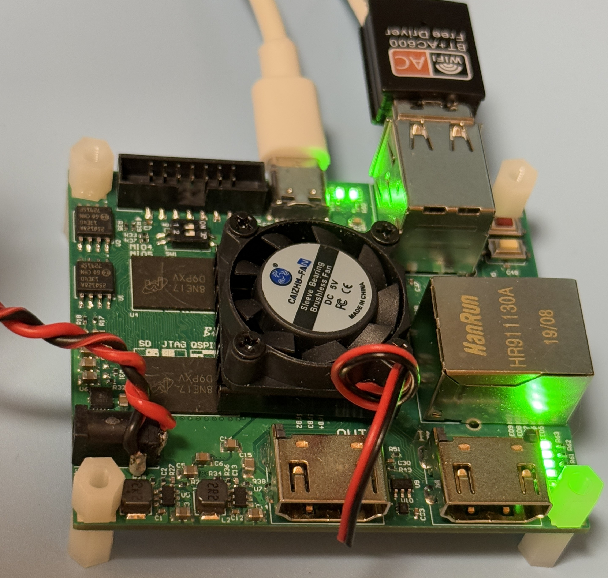
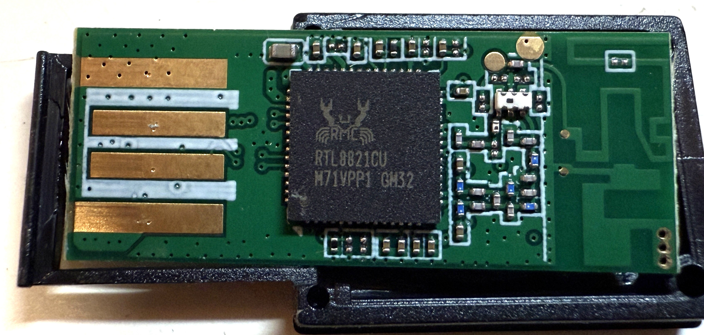

# RTL8821CU USB Dongle Testing

### Test Gear

|Test Board|USB Dongle HW|
|-|-|
|||

```
uname -r
5.4.0

lsb_release -a
No LSB modules are available.
Distributor ID: Ubuntu
Description:    Ubuntu 18.04.5 LTS
Release:        18.04
Codename:       bionic

lscpu
Architecture:        armv7l
Byte Order:          Little Endian
CPU(s):              2
On-line CPU(s) list: 0,1
Thread(s) per core:  1
Core(s) per socket:  2
Socket(s):           1
Vendor ID:           ARM
Model:               0
Model name:          Cortex-A9
Stepping:            r3p0
BogoMIPS:            666.66
Flags:               half thumb fastmult vfp edsp neon vfpv3 tls vfpd32
```

### USB Tree

```
/:  Bus 01.Port 1: Dev 1, Class=root_hub, Driver=ci_hdrc/1p, 480M
    |__ Port 1: Dev 2, If 0, Class=Hub, Driver=hub/2p, 480M
        |__ Port 1: Dev 4, If 0, Class=Wireless, Driver=btusb, 480M
        |__ Port 1: Dev 4, If 1, Class=Wireless, Driver=btusb, 480M
        |__ Port 1: Dev 4, If 2, Class=Vendor Specific Class, Driver=rtw_8821cu, 480M
```

<details>

<summary>USB Details</summary>

```
Bus 001 Device 004: ID 0bda:c820 Realtek Semiconductor Corp.
Couldn't open device, some information will be missing
Device Descriptor:
  bLength                18
  bDescriptorType         1
  bcdUSB               2.00
  bDeviceClass          239 Miscellaneous Device
  bDeviceSubClass         2 ?
  bDeviceProtocol         1 Interface Association
  bMaxPacketSize0        64
  idVendor           0x0bda Realtek Semiconductor Corp.
  idProduct          0xc820
  bcdDevice            2.00
  iManufacturer           1
  iProduct                2
  iSerial                 3
  bNumConfigurations      1
  Configuration Descriptor:
    bLength                 9
    bDescriptorType         2
    wTotalLength          229
    bNumInterfaces          3
    bConfigurationValue     1
    iConfiguration          0
    bmAttributes         0xa0
      (Bus Powered)
      Remote Wakeup
    MaxPower              500mA
    Interface Association:
      bLength                 8
      bDescriptorType        11
      bFirstInterface         0
      bInterfaceCount         2
      bFunctionClass        224 Wireless
      bFunctionSubClass       1 Radio Frequency
      bFunctionProtocol       1 Bluetooth
      iFunction               4
    Interface Descriptor:
      bLength                 9
      bDescriptorType         4
      bInterfaceNumber        0
      bAlternateSetting       0
      bNumEndpoints           3
      bInterfaceClass       224 Wireless
      bInterfaceSubClass      1 Radio Frequency
      bInterfaceProtocol      1 Bluetooth
      iInterface              4
      Endpoint Descriptor:
        bLength                 7
        bDescriptorType         5
        bEndpointAddress     0x81  EP 1 IN
        bmAttributes            3
          Transfer Type            Interrupt
          Synch Type               None
          Usage Type               Data
        wMaxPacketSize     0x0010  1x 16 bytes
        bInterval               4
      Endpoint Descriptor:
        bLength                 7
        bDescriptorType         5
        bEndpointAddress     0x02  EP 2 OUT
        bmAttributes            2
          Transfer Type            Bulk
          Synch Type               None
          Usage Type               Data
        wMaxPacketSize     0x0200  1x 512 bytes
        bInterval               0
      Endpoint Descriptor:
        bLength                 7
        bDescriptorType         5
        bEndpointAddress     0x82  EP 2 IN
        bmAttributes            2
          Transfer Type            Bulk
          Synch Type               None
          Usage Type               Data
        wMaxPacketSize     0x0200  1x 512 bytes
        bInterval               0
    Interface Descriptor:
      bLength                 9
      bDescriptorType         4
      bInterfaceNumber        1
      bAlternateSetting       0
      bNumEndpoints           2
      bInterfaceClass       224 Wireless
      bInterfaceSubClass      1 Radio Frequency
      bInterfaceProtocol      1 Bluetooth
      iInterface              4
      Endpoint Descriptor:
        bLength                 7
        bDescriptorType         5
        bEndpointAddress     0x03  EP 3 OUT
        bmAttributes            1
          Transfer Type            Isochronous
          Synch Type               None
          Usage Type               Data
        wMaxPacketSize     0x0000  1x 0 bytes
        bInterval               4
      Endpoint Descriptor:
        bLength                 7
        bDescriptorType         5
        bEndpointAddress     0x83  EP 3 IN
        bmAttributes            1
          Transfer Type            Isochronous
          Synch Type               None
          Usage Type               Data
        wMaxPacketSize     0x0000  1x 0 bytes
        bInterval               4
    Interface Descriptor:
      bLength                 9
      bDescriptorType         4
      bInterfaceNumber        1
      bAlternateSetting       1
      bNumEndpoints           2
      bInterfaceClass       224 Wireless
      bInterfaceSubClass      1 Radio Frequency
      bInterfaceProtocol      1 Bluetooth
      iInterface              4
      Endpoint Descriptor:
        bLength                 7
        bDescriptorType         5
        bEndpointAddress     0x03  EP 3 OUT
        bmAttributes            1
          Transfer Type            Isochronous
          Synch Type               None
          Usage Type               Data
        wMaxPacketSize     0x0009  1x 9 bytes
        bInterval               4
      Endpoint Descriptor:
        bLength                 7
        bDescriptorType         5
        bEndpointAddress     0x83  EP 3 IN
        bmAttributes            1
          Transfer Type            Isochronous
          Synch Type               None
          Usage Type               Data
        wMaxPacketSize     0x0009  1x 9 bytes
        bInterval               4
    Interface Descriptor:
      bLength                 9
      bDescriptorType         4
      bInterfaceNumber        1
      bAlternateSetting       2
      bNumEndpoints           2
      bInterfaceClass       224 Wireless
      bInterfaceSubClass      1 Radio Frequency
      bInterfaceProtocol      1 Bluetooth
      iInterface              4
      Endpoint Descriptor:
        bLength                 7
        bDescriptorType         5
        bEndpointAddress     0x03  EP 3 OUT
        bmAttributes            1
          Transfer Type            Isochronous
          Synch Type               None
          Usage Type               Data
        wMaxPacketSize     0x0011  1x 17 bytes
        bInterval               4
      Endpoint Descriptor:
        bLength                 7
        bDescriptorType         5
        bEndpointAddress     0x83  EP 3 IN
        bmAttributes            1
          Transfer Type            Isochronous
          Synch Type               None
          Usage Type               Data
        wMaxPacketSize     0x0011  1x 17 bytes
        bInterval               4
    Interface Descriptor:
      bLength                 9
      bDescriptorType         4
      bInterfaceNumber        1
      bAlternateSetting       3
      bNumEndpoints           2
      bInterfaceClass       224 Wireless
      bInterfaceSubClass      1 Radio Frequency
      bInterfaceProtocol      1 Bluetooth
      iInterface              4
      Endpoint Descriptor:
        bLength                 7
        bDescriptorType         5
        bEndpointAddress     0x03  EP 3 OUT
        bmAttributes            1
          Transfer Type            Isochronous
          Synch Type               None
          Usage Type               Data
        wMaxPacketSize     0x0019  1x 25 bytes
        bInterval               4
      Endpoint Descriptor:
        bLength                 7
        bDescriptorType         5
        bEndpointAddress     0x83  EP 3 IN
        bmAttributes            1
          Transfer Type            Isochronous
          Synch Type               None
          Usage Type               Data
        wMaxPacketSize     0x0019  1x 25 bytes
        bInterval               4
    Interface Descriptor:
      bLength                 9
      bDescriptorType         4
      bInterfaceNumber        1
      bAlternateSetting       4
      bNumEndpoints           2
      bInterfaceClass       224 Wireless
      bInterfaceSubClass      1 Radio Frequency
      bInterfaceProtocol      1 Bluetooth
      iInterface              4
      Endpoint Descriptor:
        bLength                 7
        bDescriptorType         5
        bEndpointAddress     0x03  EP 3 OUT
        bmAttributes            1
          Transfer Type            Isochronous
          Synch Type               None
          Usage Type               Data
        wMaxPacketSize     0x0021  1x 33 bytes
        bInterval               4
      Endpoint Descriptor:
        bLength                 7
        bDescriptorType         5
        bEndpointAddress     0x83  EP 3 IN
        bmAttributes            1
          Transfer Type            Isochronous
          Synch Type               None
          Usage Type               Data
        wMaxPacketSize     0x0021  1x 33 bytes
        bInterval               4
    Interface Descriptor:
      bLength                 9
      bDescriptorType         4
      bInterfaceNumber        1
      bAlternateSetting       5
      bNumEndpoints           2
      bInterfaceClass       224 Wireless
      bInterfaceSubClass      1 Radio Frequency
      bInterfaceProtocol      1 Bluetooth
      iInterface              4
      Endpoint Descriptor:
        bLength                 7
        bDescriptorType         5
        bEndpointAddress     0x03  EP 3 OUT
        bmAttributes            1
          Transfer Type            Isochronous
          Synch Type               None
          Usage Type               Data
        wMaxPacketSize     0x0031  1x 49 bytes
        bInterval               4
      Endpoint Descriptor:
        bLength                 7
        bDescriptorType         5
        bEndpointAddress     0x83  EP 3 IN
        bmAttributes            1
          Transfer Type            Isochronous
          Synch Type               None
          Usage Type               Data
        wMaxPacketSize     0x0031  1x 49 bytes
        bInterval               4
    Interface Descriptor:
      bLength                 9
      bDescriptorType         4
      bInterfaceNumber        2
      bAlternateSetting       0
      bNumEndpoints           5
      bInterfaceClass       255 Vendor Specific Class
      bInterfaceSubClass    255 Vendor Specific Subclass
      bInterfaceProtocol    255 Vendor Specific Protocol
      iInterface              2
      Endpoint Descriptor:
        bLength                 7
        bDescriptorType         5
        bEndpointAddress     0x84  EP 4 IN
        bmAttributes            2
          Transfer Type            Bulk
          Synch Type               None
          Usage Type               Data
        wMaxPacketSize     0x0200  1x 512 bytes
        bInterval               0
      Endpoint Descriptor:
        bLength                 7
        bDescriptorType         5
        bEndpointAddress     0x05  EP 5 OUT
        bmAttributes            2
          Transfer Type            Bulk
          Synch Type               None
          Usage Type               Data
        wMaxPacketSize     0x0200  1x 512 bytes
        bInterval               0
      Endpoint Descriptor:
        bLength                 7
        bDescriptorType         5
        bEndpointAddress     0x06  EP 6 OUT
        bmAttributes            2
          Transfer Type            Bulk
          Synch Type               None
          Usage Type               Data
        wMaxPacketSize     0x0200  1x 512 bytes
        bInterval               0
      Endpoint Descriptor:
        bLength                 7
        bDescriptorType         5
        bEndpointAddress     0x87  EP 7 IN
        bmAttributes            3
          Transfer Type            Interrupt
          Synch Type               None
          Usage Type               Data
        wMaxPacketSize     0x0040  1x 64 bytes
        bInterval               3
      Endpoint Descriptor:
        bLength                 7
        bDescriptorType         5
        bEndpointAddress     0x08  EP 8 OUT
        bmAttributes            2
          Transfer Type            Bulk
          Synch Type               None
          Usage Type               Data
        wMaxPacketSize     0x0200  1x 512 bytes
        bInterval               0
```

</details>

### Driver Load

The driver is loaded via "insmod"

```
[    7.824265] usb 1-1.1: new high-speed USB device number 4 using ci_hdrc
[    7.975110] usb 1-1.1: config 1 interface 1 altsetting 0 endpoint 0x3 has wMaxPacketSize 0, skipping
[    7.975128] usb 1-1.1: config 1 interface 1 altsetting 0 endpoint 0x83 has wMaxPacketSize 0, skipping
[    8.042703] Bluetooth: hci0: RTL: examining hci_ver=08 hci_rev=000c lmp_ver=08 lmp_subver=8821
[    8.043657] Bluetooth: hci0: RTL: rom_version status=0 version=1
[    8.043669] Bluetooth: hci0: RTL: loading rtl_bt/rtl8821c_fw.bin
[    8.050267] Bluetooth: hci0: RTL: loading rtl_bt/rtl8821c_config.bin
[    8.051370] Bluetooth: hci0: RTL: cfg_sz 10, total sz 21678
[    8.462567] Bluetooth: hci0: RTL: fw version 0x826ca99e
[  158.374162] rtw_core: loading out-of-tree module taints kernel.
[  214.487282] rtw_8821cu 1-1.1:1.2: Firmware version 24.11.0, H2C version 12
[  214.887370] usbcore: registered new interface driver rtw_8821cu

lsmod
Module                  Size  Used by
rtw_8821cu             16384  0
rtw_8821c              90112  1 rtw_8821cu
rtw_usb                24576  1 rtw_8821cu
rtw_core              172032  2 rtw_usb,rtw_8821c
```

There is a possible issue could happen on ARM and other platform.

If the USB is loaded as a disk. 

Modify the rules, and the ID might be different (please replace with necessary)

>vi /lib/udev/rules.d/40-usb_modeswitch.rules

```
# Realtek 8211CU Wifi AC USB
ATTR{idVendor}=="0bda", ATTR{idProduct}=="1a2b", RUN+="/usr/sbin/usb_modeswitch -K -v 0bda -p 1a2b"
```

### Network Manager

```
wlan0: flags=4163<UP,BROADCAST,RUNNING,MULTICAST>  mtu 1500
        inet 192.168.1.26  netmask 255.255.252.0  broadcast 192.168.3.255
        RX packets 10  bytes 1602 (1.6 KB)
        RX errors 0  dropped 0  overruns 0  frame 0
        TX packets 28  bytes 4890 (4.8 KB)
        TX errors 0  dropped 0 overruns 0  carrier 0  collisions 0
```

### Network Speed Test via Ookla

```
   Speedtest by Ookla

Idle Latency:     5.17 ms   (jitter: 2.94ms, low: 3.91ms, high: 7.89ms)
    Download:    16.65 Mbps (data used: 29.1 MB)
                 82.21 ms   (jitter: 37.39ms, low: 5.79ms, high: 557.92ms)
      Upload:     6.57 Mbps (data used: 11.0 MB)
                285.11 ms   (jitter: 72.98ms, low: 36.23ms, high: 645.93ms)
```
### Network Ping Tests

#### DNS-Ping

```
PING 8.8.8.8 (8.8.8.8) 56(84) bytes of data.
64 bytes from 8.8.8.8: icmp_seq=1 ttl=118 time=7.82 ms
64 bytes from 8.8.8.8: icmp_seq=2 ttl=118 time=10.5 ms
64 bytes from 8.8.8.8: icmp_seq=3 ttl=118 time=6.89 ms
64 bytes from 8.8.8.8: icmp_seq=4 ttl=118 time=5.66 ms
64 bytes from 8.8.8.8: icmp_seq=5 ttl=118 time=3.89 ms
64 bytes from 8.8.8.8: icmp_seq=6 ttl=118 time=9.39 ms
64 bytes from 8.8.8.8: icmp_seq=7 ttl=118 time=5.14 ms
64 bytes from 8.8.8.8: icmp_seq=8 ttl=118 time=6.27 ms
64 bytes from 8.8.8.8: icmp_seq=9 ttl=118 time=3.90 ms
64 bytes from 8.8.8.8: icmp_seq=10 ttl=118 time=11.7 ms
64 bytes from 8.8.8.8: icmp_seq=11 ttl=118 time=5.90 ms
64 bytes from 8.8.8.8: icmp_seq=12 ttl=118 time=7.40 ms
64 bytes from 8.8.8.8: icmp_seq=13 ttl=118 time=7.65 ms
64 bytes from 8.8.8.8: icmp_seq=14 ttl=118 time=7.75 ms
64 bytes from 8.8.8.8: icmp_seq=15 ttl=118 time=17.7 ms
64 bytes from 8.8.8.8: icmp_seq=16 ttl=118 time=3.79 ms
64 bytes from 8.8.8.8: icmp_seq=17 ttl=118 time=5.01 ms
64 bytes from 8.8.8.8: icmp_seq=18 ttl=118 time=9.89 ms
64 bytes from 8.8.8.8: icmp_seq=19 ttl=118 time=5.64 ms
64 bytes from 8.8.8.8: icmp_seq=20 ttl=118 time=4.15 ms

--- 8.8.8.8 ping statistics ---
20 packets transmitted, 20 received, 0% packet loss, time 19028ms
rtt min/avg/max/mdev = 3.795/7.317/17.778/3.286 ms
```

#### Self-Ping 

```
PING 192.168.1.26 (192.168.1.26) 10000(10028) bytes of data.
10008 bytes from 192.168.1.26: icmp_seq=1 ttl=64 time=0.150 ms
10008 bytes from 192.168.1.26: icmp_seq=2 ttl=64 time=0.124 ms
10008 bytes from 192.168.1.26: icmp_seq=3 ttl=64 time=0.188 ms
10008 bytes from 192.168.1.26: icmp_seq=4 ttl=64 time=0.117 ms
10008 bytes from 192.168.1.26: icmp_seq=5 ttl=64 time=0.111 ms
10008 bytes from 192.168.1.26: icmp_seq=6 ttl=64 time=0.112 ms
10008 bytes from 192.168.1.26: icmp_seq=7 ttl=64 time=0.166 ms
10008 bytes from 192.168.1.26: icmp_seq=8 ttl=64 time=0.117 ms
10008 bytes from 192.168.1.26: icmp_seq=9 ttl=64 time=0.114 ms
10008 bytes from 192.168.1.26: icmp_seq=10 ttl=64 time=0.116 ms
10008 bytes from 192.168.1.26: icmp_seq=11 ttl=64 time=0.121 ms
10008 bytes from 192.168.1.26: icmp_seq=12 ttl=64 time=0.125 ms
10008 bytes from 192.168.1.26: icmp_seq=13 ttl=64 time=0.124 ms
10008 bytes from 192.168.1.26: icmp_seq=14 ttl=64 time=0.117 ms
10008 bytes from 192.168.1.26: icmp_seq=15 ttl=64 time=0.115 ms
10008 bytes from 192.168.1.26: icmp_seq=16 ttl=64 time=0.125 ms
10008 bytes from 192.168.1.26: icmp_seq=17 ttl=64 time=0.118 ms
10008 bytes from 192.168.1.26: icmp_seq=18 ttl=64 time=0.136 ms
10008 bytes from 192.168.1.26: icmp_seq=19 ttl=64 time=0.117 ms
10008 bytes from 192.168.1.26: icmp_seq=20 ttl=64 time=0.114 ms

--- 192.168.1.26 ping statistics ---
20 packets transmitted, 20 received, 0% packet loss, time 19762ms
rtt min/avg/max/mdev = 0.111/0.126/0.188/0.021 ms
```
### iw list

<details>

<summary>iw list</summary>

```
Wiphy phy0
        max # scan SSIDs: 4
        max scan IEs length: 2243 bytes
        max # sched scan SSIDs: 0
        max # match sets: 0
        max # scan plans: 1
        max scan plan interval: -1
        max scan plan iterations: 0
        Retry short limit: 7
        Retry long limit: 4
        Coverage class: 0 (up to 0m)
        Device supports T-DLS.
        Supported Ciphers:
                * WEP40 (00-0f-ac:1)
                * WEP104 (00-0f-ac:5)
                * TKIP (00-0f-ac:2)
                * CCMP-128 (00-0f-ac:4)
                * CCMP-256 (00-0f-ac:10)
                * GCMP-128 (00-0f-ac:8)
                * GCMP-256 (00-0f-ac:9)
                * CMAC (00-0f-ac:6)
                * CMAC-256 (00-0f-ac:13)
                * GMAC-128 (00-0f-ac:11)
                * GMAC-256 (00-0f-ac:12)
        Available Antennas: TX 0x1 RX 0x1
        Configured Antennas: TX 0x1 RX 0x1
        Supported interface modes:
                 * IBSS
                 * managed
                 * AP
                 * AP/VLAN
                 * monitor
                 * P2P-client
                 * P2P-GO
        Band 1:
                Capabilities: 0x196e
                        HT20/HT40
                        SM Power Save disabled
                        RX HT20 SGI
                        RX HT40 SGI
                        RX STBC 1-stream
                        Max AMSDU length: 7935 bytes
                        DSSS/CCK HT40
                Maximum RX AMPDU length 65535 bytes (exponent: 0x003)
                Minimum RX AMPDU time spacing: 2 usec (0x04)
                HT Max RX data rate: 150 Mbps
                HT TX/RX MCS rate indexes supported: 0-7, 32
                Bitrates (non-HT):
                        * 1.0 Mbps
                        * 2.0 Mbps
                        * 5.5 Mbps
                        * 11.0 Mbps
                        * 6.0 Mbps
                        * 9.0 Mbps
                        * 12.0 Mbps
                        * 18.0 Mbps
                        * 24.0 Mbps
                        * 36.0 Mbps
                        * 48.0 Mbps
                        * 54.0 Mbps
                Frequencies:
                        * 2412 MHz [1] (20.0 dBm)
                        * 2417 MHz [2] (20.0 dBm)
                        * 2422 MHz [3] (20.0 dBm)
                        * 2427 MHz [4] (20.0 dBm)
                        * 2432 MHz [5] (20.0 dBm)
                        * 2437 MHz [6] (20.0 dBm)
                        * 2442 MHz [7] (20.0 dBm)
                        * 2447 MHz [8] (20.0 dBm)
                        * 2452 MHz [9] (20.0 dBm)
                        * 2457 MHz [10] (20.0 dBm)
                        * 2462 MHz [11] (20.0 dBm)
                        * 2467 MHz [12] (20.0 dBm)
                        * 2472 MHz [13] (20.0 dBm)
                        * 2484 MHz [14] (disabled)
        Band 2:
                Capabilities: 0x196e
                        HT20/HT40
                        SM Power Save disabled
                        RX HT20 SGI
                        RX HT40 SGI
                        RX STBC 1-stream
                        Max AMSDU length: 7935 bytes
                        DSSS/CCK HT40
                Maximum RX AMPDU length 65535 bytes (exponent: 0x003)
                Minimum RX AMPDU time spacing: 2 usec (0x04)
                HT Max RX data rate: 150 Mbps
                HT TX/RX MCS rate indexes supported: 0-7, 32
                VHT Capabilities (0x03d07122):
                        Max MPDU length: 11454
                        Supported Channel Width: neither 160 nor 80+80
                        short GI (80 MHz)
                        SU Beamformee
                        MU Beamformee
                        +HTC-VHT
                VHT RX MCS set:
                        1 streams: MCS 0-9
                        2 streams: not supported
                        3 streams: not supported
                        4 streams: not supported
                        5 streams: not supported
                        6 streams: not supported
                        7 streams: not supported
                        8 streams: not supported
                VHT RX highest supported: 390 Mbps
                VHT TX MCS set:
                        1 streams: MCS 0-9
                        2 streams: not supported
                        3 streams: not supported
                        4 streams: not supported
                        5 streams: not supported
                        6 streams: not supported
                        7 streams: not supported
                        8 streams: not supported
                VHT TX highest supported: 390 Mbps
                Bitrates (non-HT):
                        * 6.0 Mbps
                        * 9.0 Mbps
                        * 12.0 Mbps
                        * 18.0 Mbps
                        * 24.0 Mbps
                        * 36.0 Mbps
                        * 48.0 Mbps
                        * 54.0 Mbps
                Frequencies:
                        * 5180 MHz [36] (23.0 dBm)
                        * 5200 MHz [40] (23.0 dBm)
                        * 5220 MHz [44] (23.0 dBm)
                        * 5240 MHz [48] (23.0 dBm)
                        * 5260 MHz [52] (23.0 dBm) (radar detection)
                        * 5280 MHz [56] (23.0 dBm) (radar detection)
                        * 5300 MHz [60] (23.0 dBm) (radar detection)
                        * 5320 MHz [64] (23.0 dBm) (radar detection)
                        * 5500 MHz [100] (disabled)
                        * 5520 MHz [104] (disabled)
                        * 5540 MHz [108] (disabled)
                        * 5560 MHz [112] (disabled)
                        * 5580 MHz [116] (disabled)
                        * 5600 MHz [120] (disabled)
                        * 5620 MHz [124] (disabled)
                        * 5640 MHz [128] (disabled)
                        * 5660 MHz [132] (disabled)
                        * 5680 MHz [136] (disabled)
                        * 5700 MHz [140] (disabled)
                        * 5720 MHz [144] (disabled)
                        * 5745 MHz [149] (30.0 dBm)
                        * 5765 MHz [153] (30.0 dBm)
                        * 5785 MHz [157] (30.0 dBm)
                        * 5805 MHz [161] (30.0 dBm)
                        * 5825 MHz [165] (30.0 dBm)
        Supported commands:
                 * new_interface
                 * set_interface
                 * new_key
                 * start_ap
                 * new_station
                 * set_bss
                 * authenticate
                 * associate
                 * deauthenticate
                 * disassociate
                 * join_ibss
                 * set_tx_bitrate_mask
                 * frame
                 * frame_wait_cancel
                 * set_wiphy_netns
                 * set_channel
                 * set_wds_peer
                 * tdls_mgmt
                 * tdls_oper
                 * probe_client
                 * set_noack_map
                 * register_beacons
                 * start_p2p_device
                 * set_mcast_rate
                 * connect
                 * disconnect
                 * set_qos_map
                 * set_multicast_to_unicast
        Supported TX frame types:
                 * IBSS: 0x00 0x10 0x20 0x30 0x40 0x50 0x60 0x70 0x80 0x90 0xa0 0xb0 0xc0 0xd0 0xe0 0xf0
                 * managed: 0x00 0x10 0x20 0x30 0x40 0x50 0x60 0x70 0x80 0x90 0xa0 0xb0 0xc0 0xd0 0xe0 0xf0
                 * AP: 0x00 0x10 0x20 0x30 0x40 0x50 0x60 0x70 0x80 0x90 0xa0 0xb0 0xc0 0xd0 0xe0 0xf0
                 * AP/VLAN: 0x00 0x10 0x20 0x30 0x40 0x50 0x60 0x70 0x80 0x90 0xa0 0xb0 0xc0 0xd0 0xe0 0xf0
                 * mesh point: 0x00 0x10 0x20 0x30 0x40 0x50 0x60 0x70 0x80 0x90 0xa0 0xb0 0xc0 0xd0 0xe0 0xf0
                 * P2P-client: 0x00 0x10 0x20 0x30 0x40 0x50 0x60 0x70 0x80 0x90 0xa0 0xb0 0xc0 0xd0 0xe0 0xf0
                 * P2P-GO: 0x00 0x10 0x20 0x30 0x40 0x50 0x60 0x70 0x80 0x90 0xa0 0xb0 0xc0 0xd0 0xe0 0xf0
                 * P2P-device: 0x00 0x10 0x20 0x30 0x40 0x50 0x60 0x70 0x80 0x90 0xa0 0xb0 0xc0 0xd0 0xe0 0xf0
        Supported RX frame types:
                 * IBSS: 0x40 0xb0 0xc0 0xd0
                 * managed: 0x40 0xd0
                 * AP: 0x00 0x20 0x40 0xa0 0xb0 0xc0 0xd0
                 * AP/VLAN: 0x00 0x20 0x40 0xa0 0xb0 0xc0 0xd0
                 * mesh point: 0xb0 0xc0 0xd0
                 * P2P-client: 0x40 0xd0
                 * P2P-GO: 0x00 0x20 0x40 0xa0 0xb0 0xc0 0xd0
                 * P2P-device: 0x40 0xd0
        software interface modes (can always be added):
                 * AP/VLAN
                 * monitor
        valid interface combinations:
                 * #{ managed } <= 1, #{ AP, P2P-client, P2P-GO } <= 1,
                   total <= 2, #channels <= 1
        HT Capability overrides:
                 * MCS: ff ff ff ff ff ff ff ff ff ff
                 * maximum A-MSDU length
                 * supported channel width
                 * short GI for 40 MHz
                 * max A-MPDU length exponent
                 * min MPDU start spacing
        Device supports TX status socket option.
        Device supports HT-IBSS.
        Device supports SAE with AUTHENTICATE command
        Device supports scan flush.
        Device supports per-vif TX power setting
        Driver supports full state transitions for AP/GO clients
        Driver supports a userspace MPM
        Device supports configuring vdev MAC-addr on create.
```

</details>

### iwconfig

```
wlan0     IEEE 802.11  ESSID:""
          Mode:Managed  Frequency:2.412 GHz  Access Point: F8:6F:B0:0E:AE:E5
          Bit Rate=40.5 Mb/s   Tx-Power=20 dBm
          Retry short limit:7   RTS thr:off   Fragment thr:off
          Power Management:off
          Link Quality=50/70  Signal level=-60 dBm
          Rx invalid nwid:0  Rx invalid crypt:0  Rx invalid frag:0
          Tx excessive retries:0  Invalid misc:39   Missed beacon:0
```
### Server & Client Test via iperf3 (PC-Router-DUT)

<details>

<summary>iperf3</summary>

```
-----------------------------------------------------------
Server listening on 5201
-----------------------------------------------------------
Accepted connection from 192.168.1.3, port 56659
[  5] local 192.168.1.26 port 5201 connected to 192.168.1.3 port 56660
[ ID] Interval           Transfer     Bandwidth       Retr  Cwnd
[  5]   0.00-1.00   sec   624 KBytes  5.11 Mbits/sec    1   44.2 KBytes
[  5]   1.00-2.00   sec   753 KBytes  6.17 Mbits/sec    0   84.1 KBytes
[  5]   2.00-3.00   sec   627 KBytes  5.14 Mbits/sec    0   94.1 KBytes
[  5]   3.00-4.00   sec   627 KBytes  5.14 Mbits/sec    0   98.4 KBytes
[  5]   4.00-5.00   sec   690 KBytes  5.65 Mbits/sec    0   98.4 KBytes
[  5]   5.00-6.00   sec   753 KBytes  6.17 Mbits/sec    0   98.4 KBytes
[  5]   6.00-7.00   sec   753 KBytes  6.17 Mbits/sec    0    103 KBytes
[  5]   7.00-8.00   sec   816 KBytes  6.68 Mbits/sec    0    115 KBytes
[  5]   8.00-9.00   sec  1.04 MBytes  8.74 Mbits/sec    0    130 KBytes
[  5]   9.00-10.00  sec   753 KBytes  6.17 Mbits/sec    0    130 KBytes
[  5]  10.00-11.00  sec   941 KBytes  7.71 Mbits/sec    0    130 KBytes
[  5]  11.00-12.00  sec  1.29 MBytes  10.8 Mbits/sec    0    130 KBytes
[  5]  12.00-13.00  sec   941 KBytes  7.71 Mbits/sec    0    130 KBytes
[  5]  13.00-14.00  sec   941 KBytes  7.71 Mbits/sec    0    130 KBytes
[  5]  14.00-15.00  sec   941 KBytes  7.71 Mbits/sec    0    130 KBytes
[  5]  15.00-16.00  sec  1.10 MBytes  9.25 Mbits/sec    0    130 KBytes
[  5]  16.00-17.00  sec   753 KBytes  6.17 Mbits/sec    0    130 KBytes
[  5]  17.00-18.00  sec   941 KBytes  7.71 Mbits/sec    0    130 KBytes
[  5]  18.00-19.00  sec  1.10 MBytes  9.25 Mbits/sec    0    198 KBytes
[  5]  19.00-20.00  sec  1.23 MBytes  10.3 Mbits/sec    0    198 KBytes
[  5]  20.00-21.00  sec   502 KBytes  4.11 Mbits/sec    0    198 KBytes
[  5]  21.00-22.00  sec   565 KBytes  4.63 Mbits/sec    0    198 KBytes
[  5]  22.00-23.00  sec   502 KBytes  4.11 Mbits/sec    0    198 KBytes
[  5]  23.00-24.00  sec   753 KBytes  6.17 Mbits/sec    0    198 KBytes
[  5]  24.00-25.00  sec   502 KBytes  4.11 Mbits/sec    0    198 KBytes
[  5]  25.00-26.00  sec   753 KBytes  6.17 Mbits/sec    0    198 KBytes
[  5]  26.00-27.00  sec   251 KBytes  2.05 Mbits/sec    0    198 KBytes
[  5]  27.00-28.00  sec   502 KBytes  4.11 Mbits/sec    0    198 KBytes
[  5]  28.00-29.00  sec   753 KBytes  6.17 Mbits/sec    0    198 KBytes
[  5]  29.00-30.00  sec   502 KBytes  4.11 Mbits/sec    0    198 KBytes
[  5]  30.00-31.00  sec   502 KBytes  4.11 Mbits/sec    0    198 KBytes
[  5]  31.00-32.00  sec   753 KBytes  6.17 Mbits/sec    0    198 KBytes
[  5]  32.00-33.00  sec   376 KBytes  3.08 Mbits/sec    0    198 KBytes
[  5]  33.00-34.00  sec   502 KBytes  4.11 Mbits/sec    0    198 KBytes
[  5]  34.00-35.00  sec  1004 KBytes  8.22 Mbits/sec    0    198 KBytes
[  5]  35.00-36.00  sec   753 KBytes  6.17 Mbits/sec    0    198 KBytes
[  5]  36.00-37.00  sec   251 KBytes  2.06 Mbits/sec    0    198 KBytes
[  5]  37.00-38.00  sec   753 KBytes  6.17 Mbits/sec    0    198 KBytes
[  5]  38.00-39.00  sec   753 KBytes  6.17 Mbits/sec    0    198 KBytes
[  5]  39.00-40.00  sec   565 KBytes  4.62 Mbits/sec    0    198 KBytes
[  5]  40.00-41.00  sec  1004 KBytes  8.23 Mbits/sec    0    198 KBytes
[  5]  41.00-42.00  sec   753 KBytes  6.17 Mbits/sec    0    198 KBytes
[  5]  42.00-43.00  sec   753 KBytes  6.17 Mbits/sec    0    198 KBytes
[  5]  43.00-44.00  sec   753 KBytes  6.17 Mbits/sec    0    198 KBytes
[  5]  44.00-45.00  sec   753 KBytes  6.17 Mbits/sec    0    198 KBytes
[  5]  45.00-46.00  sec   502 KBytes  4.11 Mbits/sec    0    198 KBytes
[  5]  46.00-47.00  sec   753 KBytes  6.17 Mbits/sec    0    198 KBytes
[  5]  47.00-48.00  sec   816 KBytes  6.68 Mbits/sec    0    198 KBytes
[  5]  48.00-49.00  sec   753 KBytes  6.17 Mbits/sec    0    198 KBytes
[  5]  49.00-50.00  sec   753 KBytes  6.17 Mbits/sec    0    198 KBytes
[  5]  50.00-51.00  sec  1004 KBytes  8.23 Mbits/sec    0    198 KBytes
[  5]  51.00-52.00  sec   502 KBytes  4.11 Mbits/sec    0    198 KBytes
[  5]  52.00-53.00  sec   753 KBytes  6.17 Mbits/sec    0    198 KBytes
[  5]  53.00-54.00  sec   753 KBytes  6.17 Mbits/sec    0    198 KBytes
[  5]  54.00-55.00  sec   753 KBytes  6.17 Mbits/sec    0    198 KBytes
[  5]  55.00-56.00  sec   753 KBytes  6.17 Mbits/sec    0    198 KBytes
[  5]  56.00-57.00  sec   753 KBytes  6.17 Mbits/sec    0    198 KBytes
[  5]  57.00-58.00  sec   627 KBytes  5.14 Mbits/sec    0    198 KBytes
[  5]  58.00-59.00  sec  1004 KBytes  8.23 Mbits/sec    0    198 KBytes
[  5]  59.00-60.00  sec   502 KBytes  4.11 Mbits/sec    0    198 KBytes
[  5]  60.00-61.00  sec   753 KBytes  6.17 Mbits/sec    0    198 KBytes
[  5]  61.00-62.00  sec  1004 KBytes  8.22 Mbits/sec    0    198 KBytes
[  5]  62.00-63.00  sec  1004 KBytes  8.22 Mbits/sec    0    198 KBytes
[  5]  63.00-64.00  sec  1004 KBytes  8.23 Mbits/sec    0    198 KBytes
[  5]  64.00-65.00  sec   502 KBytes  4.11 Mbits/sec    0    198 KBytes
[  5]  65.00-66.00  sec   753 KBytes  6.17 Mbits/sec    0    198 KBytes
[  5]  66.00-67.00  sec   753 KBytes  6.17 Mbits/sec    0    198 KBytes
[  5]  67.00-68.00  sec   816 KBytes  6.68 Mbits/sec    0    198 KBytes
[  5]  68.00-69.00  sec   753 KBytes  6.17 Mbits/sec    0    198 KBytes
[  5]  69.00-70.00  sec  1004 KBytes  8.22 Mbits/sec    0    198 KBytes
[  5]  70.00-71.00  sec   753 KBytes  6.17 Mbits/sec    0    198 KBytes
[  5]  71.00-72.00  sec   753 KBytes  6.17 Mbits/sec    0    198 KBytes
[  5]  72.00-73.00  sec  1004 KBytes  8.22 Mbits/sec    0    198 KBytes
[  5]  73.00-74.00  sec   753 KBytes  6.17 Mbits/sec    0    198 KBytes
[  5]  74.00-75.00  sec  1004 KBytes  8.22 Mbits/sec    0    198 KBytes
[  5]  75.00-76.00  sec  1.23 MBytes  10.3 Mbits/sec    0    198 KBytes
[  5]  76.00-77.00  sec  1004 KBytes  8.22 Mbits/sec    0    198 KBytes
[  5]  77.00-78.00  sec  1004 KBytes  8.22 Mbits/sec    0    198 KBytes
[  5]  78.00-79.00  sec  1004 KBytes  8.22 Mbits/sec    0    198 KBytes
[  5]  79.00-80.00  sec   753 KBytes  6.17 Mbits/sec    0    198 KBytes
[  5]  80.00-81.00  sec  1.04 MBytes  8.74 Mbits/sec    0    198 KBytes
[  5]  81.00-82.00  sec   816 KBytes  6.68 Mbits/sec    0    198 KBytes
[  5]  82.00-83.00  sec  1.04 MBytes  8.74 Mbits/sec    0    198 KBytes
[  5]  83.00-84.00  sec   502 KBytes  4.11 Mbits/sec    0    198 KBytes
[  5]  84.00-85.00  sec   753 KBytes  6.17 Mbits/sec    0    198 KBytes
[  5]  85.00-86.00  sec   816 KBytes  6.68 Mbits/sec    0    198 KBytes
[  5]  86.00-87.00  sec  1.04 MBytes  8.74 Mbits/sec    0    198 KBytes
[  5]  87.00-88.00  sec  1004 KBytes  8.22 Mbits/sec    0    198 KBytes
[  5]  88.00-89.00  sec   753 KBytes  6.17 Mbits/sec    0    198 KBytes
[  5]  89.00-90.00  sec  1.10 MBytes  9.25 Mbits/sec    0    198 KBytes
[  5]  90.00-91.00  sec  1004 KBytes  8.22 Mbits/sec    0    198 KBytes
[  5]  91.00-92.00  sec  1004 KBytes  8.22 Mbits/sec    0    198 KBytes
[  5]  92.00-93.00  sec  1004 KBytes  8.22 Mbits/sec    0    198 KBytes
[  5]  93.00-94.00  sec  1004 KBytes  8.22 Mbits/sec    0    198 KBytes
[  5]  94.00-95.00  sec   816 KBytes  6.68 Mbits/sec    0    198 KBytes
[  5]  95.00-96.00  sec  1004 KBytes  8.22 Mbits/sec    0    198 KBytes
[  5]  96.00-97.00  sec   502 KBytes  4.11 Mbits/sec    0    198 KBytes
[  5]  97.00-98.00  sec   753 KBytes  6.17 Mbits/sec    0    198 KBytes
[  5]  98.00-99.00  sec  1004 KBytes  8.22 Mbits/sec    0    198 KBytes
[  5]  99.00-100.00 sec  1004 KBytes  8.22 Mbits/sec    0    198 KBytes
[  5] 100.00-101.00 sec   502 KBytes  4.11 Mbits/sec    0    198 KBytes
[  5] 101.00-102.00 sec   251 KBytes  2.06 Mbits/sec    0    198 KBytes
[  5] 102.00-103.00 sec  0.00 Bytes  0.00 bits/sec    1    138 KBytes
[  5] 103.00-104.00 sec  1.10 MBytes  9.26 Mbits/sec    1    104 KBytes
[  5] 104.00-105.00 sec   753 KBytes  6.17 Mbits/sec    0    114 KBytes
[  5] 105.00-106.00 sec  1004 KBytes  8.22 Mbits/sec    0    117 KBytes
[  5] 106.00-107.00 sec   251 KBytes  2.06 Mbits/sec    0    117 KBytes
[  5] 107.00-108.00 sec   753 KBytes  6.17 Mbits/sec    0    118 KBytes
[  5] 108.00-109.00 sec   502 KBytes  4.11 Mbits/sec    1   91.2 KBytes
[  5] 109.00-110.00 sec  1004 KBytes  8.22 Mbits/sec    0    107 KBytes
[  5] 110.00-111.00 sec   753 KBytes  6.17 Mbits/sec    0    115 KBytes
[  5] 111.00-112.00 sec   251 KBytes  2.06 Mbits/sec    0    115 KBytes
[  5] 112.00-113.00 sec   502 KBytes  4.11 Mbits/sec   15   91.2 KBytes
[  5] 113.00-114.00 sec   502 KBytes  4.11 Mbits/sec    2   78.4 KBytes
[  5] 114.00-115.00 sec   251 KBytes  2.05 Mbits/sec    0   82.7 KBytes
[  5] 115.00-116.00 sec   753 KBytes  6.17 Mbits/sec    0   84.1 KBytes
[  5] 116.00-117.00 sec   502 KBytes  4.11 Mbits/sec    0   84.1 KBytes
[  5] 117.00-118.00 sec   502 KBytes  4.11 Mbits/sec    0   87.0 KBytes
[  5] 118.00-119.00 sec   753 KBytes  6.17 Mbits/sec    0   94.1 KBytes
[  5] 119.00-120.00 sec   753 KBytes  6.17 Mbits/sec    0    106 KBytes
[  5] 120.00-121.00 sec  1004 KBytes  8.22 Mbits/sec    0    130 KBytes
[  5] 121.00-122.00 sec   502 KBytes  4.11 Mbits/sec    0    141 KBytes
[  5] 122.00-123.00 sec  1004 KBytes  8.22 Mbits/sec    0    141 KBytes
[  5] 123.00-124.00 sec  1004 KBytes  8.22 Mbits/sec    0    141 KBytes
[  5] 124.00-125.00 sec   816 KBytes  6.68 Mbits/sec    0    141 KBytes
[  5] 125.00-126.00 sec   753 KBytes  6.17 Mbits/sec    0    141 KBytes
[  5] 126.00-127.00 sec  1004 KBytes  8.22 Mbits/sec    0    141 KBytes
[  5] 126.00-127.00 sec  1004 KBytes  8.22 Mbits/sec    0    141 KBytes
- - - - - - - - - - - - - - - - - - - - - - - - -
[ ID] Interval           Transfer     Bandwidth       Retr
[  5]   0.00-127.00 sec  96.2 MBytes  6.36 Mbits/sec   21             sender
[  5]   0.00-127.00 sec  0.00 Bytes  0.00 bits/sec                  receiver
```

</details>

### AP Test

#### hostapd.conf

Setup the configuration at /etc/hostapd/hostapd.conf

```
interface=wlan0
driver=nl80211
ieee80211n=1
hw_mode=g
channel=6
ssid=AP-TEST
wpa=2
wpa_passphrase=12345678
wpa_key_mgmt=WPA-PSK
rsn_pairwise=CCMP TKIP
wpa_pairwise=TKIP CCMP
```

#### udhcpd.conf

```
start 192.168.175.2
end 192.168.175.254
interface wlan0
max_leases 234
opt router 192.168.175.1
```

#### Start AP Test
```
sudo hostapd -dd -e /dev/urandom /etc/hostapd/hostapd.conf -B
Configuration file: /etc/hostapd/hostapd.conf
Using interface wlan0 with hwaddr  and ssid "AP-TEST"
wlan0: interface state UNINITIALIZED->ENABLED
wlan0: AP-ENABLED
```

#### Server & Client Test via iperf3 (PC-DUT)

There are unconditional message like "error beacon valid"

<details>

<summary>iperf3</summary>

```
-----------------------------------------------------------
Server listening on 5201
-----------------------------------------------------------
Accepted connection from 192.168.175.86, port 50058
[  5] local 192.168.175.1 port 5201 connected to 192.168.175.86 port 50059
[ ID] Interval           Transfer     Bandwidth       Retr  Cwnd
[  5]   0.00-1.00   sec  1.85 MBytes  15.5 Mbits/sec    3    103 KBytes
[  5]   1.00-2.00   sec  1.72 MBytes  14.4 Mbits/sec    0    103 KBytes
[  5]   2.00-3.00   sec  1.44 MBytes  12.1 Mbits/sec    4   61.3 KBytes
[  5]   3.00-4.00   sec  1.59 MBytes  13.4 Mbits/sec    0   65.6 KBytes
[  5]   4.00-5.00   sec  1.44 MBytes  12.1 Mbits/sec    4   65.6 KBytes
[  5]   5.00-6.00   sec  1.44 MBytes  12.1 Mbits/sec    0   65.6 KBytes
[  5]   6.00-7.00   sec  1.41 MBytes  11.8 Mbits/sec    1   65.6 KBytes
[  5]   7.00-8.00   sec  1.29 MBytes  10.8 Mbits/sec    5   49.9 KBytes
[  5]   8.00-9.00   sec  1.62 MBytes  13.6 Mbits/sec    6   58.5 KBytes
[  5]   9.00-10.00  sec  1.59 MBytes  13.4 Mbits/sec    0   65.6 KBytes
[  5]  10.00-11.00  sec  1.38 MBytes  11.6 Mbits/sec    0   65.6 KBytes
rtw_8821cu 1-1.1:1.2: error beacon valid
rtw_8821cu 1-1.1:1.2: failed to download drv rsvd page
[  5]  11.00-12.00  sec  1.41 MBytes  11.8 Mbits/sec    3   61.3 KBytes
[  5]  12.00-13.00  sec  1.47 MBytes  12.3 Mbits/sec    3   48.5 KBytes
[  5]  13.00-14.00  sec  1.47 MBytes  12.3 Mbits/sec    0   65.6 KBytes
[  5]  14.00-15.00  sec  1.35 MBytes  11.3 Mbits/sec    1   58.5 KBytes
[  5]  15.00-16.00  sec  1.90 MBytes  15.9 Mbits/sec    1   57.0 KBytes
[  5]  16.00-17.00  sec  1.29 MBytes  10.8 Mbits/sec    0   67.0 KBytes
[  5]  17.00-18.00  sec  1.50 MBytes  12.6 Mbits/sec    1   67.0 KBytes
[  5]  18.00-19.00  sec  1.62 MBytes  13.6 Mbits/sec    0   67.0 KBytes
[  5]  19.00-20.00  sec  1.53 MBytes  12.8 Mbits/sec    0   67.0 KBytes
[  5]  20.00-21.00  sec  1.59 MBytes  13.4 Mbits/sec   18   67.0 KBytes
[  5]  21.00-22.00  sec  1.44 MBytes  12.1 Mbits/sec    0   67.0 KBytes
[  5]  22.00-23.00  sec  1.19 MBytes  10.0 Mbits/sec    0   67.0 KBytes
[  5]  23.00-24.00  sec  1.68 MBytes  14.1 Mbits/sec    1   65.6 KBytes
[  5]  24.00-25.00  sec  1.56 MBytes  13.1 Mbits/sec    0   65.6 KBytes
[  5]  25.00-26.00  sec  1.44 MBytes  12.1 Mbits/sec    0   65.6 KBytes
[  5]  26.00-27.00  sec  1.47 MBytes  12.3 Mbits/sec    0   65.6 KBytes
[  5]  27.00-28.00  sec  1.50 MBytes  12.6 Mbits/sec    8   65.6 KBytes
[  5]  28.00-29.00  sec  2.11 MBytes  17.7 Mbits/sec    0   65.6 KBytes
[  5]  29.00-30.00  sec  1.84 MBytes  15.4 Mbits/sec    2   62.7 KBytes
[  5]  30.00-31.00  sec  2.27 MBytes  19.0 Mbits/sec    0   67.0 KBytes
[  5]  31.00-32.00  sec  1.56 MBytes  13.1 Mbits/sec    3   59.9 KBytes
[  5]  32.00-33.00  sec  1.78 MBytes  14.9 Mbits/sec    0   67.0 KBytes
[  5]  33.00-34.00  sec  1.44 MBytes  12.1 Mbits/sec    0   67.0 KBytes
[  5]  34.00-35.00  sec  1.56 MBytes  13.1 Mbits/sec    0   67.0 KBytes
[  5]  35.00-36.00  sec  1.72 MBytes  14.4 Mbits/sec    0   67.0 KBytes
[  5]  36.00-37.00  sec  1.75 MBytes  14.6 Mbits/sec    0   74.1 KBytes
[  5]  37.00-38.00  sec  1.35 MBytes  11.3 Mbits/sec   27   61.3 KBytes
[  5]  38.00-39.00  sec  1.35 MBytes  11.3 Mbits/sec    0   74.1 KBytes
[  5]  39.00-40.00  sec  1.47 MBytes  12.3 Mbits/sec    0   88.4 KBytes
[  5]  40.00-41.00  sec  1.23 MBytes  10.3 Mbits/sec    0   97.0 KBytes
[  5]  41.00-42.00  sec  1.47 MBytes  12.3 Mbits/sec   18   98.4 KBytes
[  5]  42.00-43.00  sec  1.04 MBytes  8.74 Mbits/sec    0   98.4 KBytes
[  5]  43.00-44.00  sec  1.16 MBytes  9.76 Mbits/sec    0   98.4 KBytes
rtw_8821cu 1-1.1:1.2: error beacon valid
rtw_8821cu 1-1.1:1.2: failed to download drv rsvd page
rtw_8821cu 1-1.1:1.2: failed to download beacon
[  5]  44.00-45.00  sec  1.35 MBytes  11.3 Mbits/sec    0   98.4 KBytes
rtw_8821cu 1-1.1:1.2: error beacon valid
rtw_8821cu 1-1.1:1.2: failed to download drv rsvd page
[  5]  45.00-46.00  sec   753 KBytes  6.17 Mbits/sec    0    104 KBytes
[  5]  46.00-47.00  sec   690 KBytes  5.65 Mbits/sec    0    108 KBytes
rtw_8821cu 1-1.1:1.2: error beacon valid
rtw_8821cu 1-1.1:1.2: failed to download drv rsvd page
rtw_8821cu 1-1.1:1.2: failed to download beacon
rtw_8821cu 1-1.1:1.2: error beacon valid
rtw_8821cu 1-1.1:1.2: failed to download drv rsvd page
[  5]  47.00-48.00  sec  1.04 MBytes  8.74 Mbits/sec    3   79.8 KBytes
[  5]  48.00-49.00  sec   941 KBytes  7.71 Mbits/sec    0   99.8 KBytes
[  5]  49.00-50.00  sec  1.16 MBytes  9.76 Mbits/sec    2   55.6 KBytes
[  5]  50.00-51.00  sec  1.41 MBytes  11.8 Mbits/sec    0   71.3 KBytes
[  5]  51.00-52.00  sec  1.47 MBytes  12.3 Mbits/sec    0   85.5 KBytes
[  5]  52.00-53.00  sec  1.04 MBytes  8.73 Mbits/sec    0   94.1 KBytes
[  5]  53.00-54.00  sec  1.35 MBytes  11.3 Mbits/sec    8   59.9 KBytes
[  5]  54.00-55.00  sec  1.72 MBytes  14.4 Mbits/sec    0   77.0 KBytes
[  5]  55.00-56.00  sec  1.10 MBytes  9.25 Mbits/sec    0   88.4 KBytes
rtw_8821cu 1-1.1:1.2: error beacon valid
rtw_8821cu 1-1.1:1.2: failed to download drv rsvd page
rtw_8821cu 1-1.1:1.2: failed to download beacon
[  5]  56.00-57.00  sec  1.16 MBytes  9.76 Mbits/sec   38   69.9 KBytes
[  5]  57.00-58.00  sec  1.16 MBytes  9.77 Mbits/sec    0   79.8 KBytes
[  5]  57.00-58.00  sec  1.16 MBytes  9.77 Mbits/sec    0   79.8 KBytes
- - - - - - - - - - - - - - - - - - - - - - - - -
[ ID] Interval           Transfer     Bandwidth       Retr
[  5]   0.00-58.00  sec  83.6 MBytes  12.1 Mbits/sec  160             sender
[  5]   0.00-58.00  sec  0.00 Bytes  0.00 bits/sec                  receiver
```

</details>
