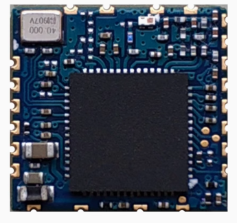

# RTL8821CU USB Dongle Testing

### Test USB Gear

|Test Board|USB Dongle HW|
|-|-|
|||

```
6.6.0-xilinx-gd8528968a1b3-dirty

DISTRIB_ID=Ubuntu
DISTRIB_RELEASE=22.04
DISTRIB_CODENAME=jammy
DISTRIB_DESCRIPTION="Ubuntu 22.04 LTS"

Architecture:                       armv7l
Byte Order:                         Little Endian
CPU(s):                             2
On-line CPU(s) list:                0,1
Vendor ID:                          ARM
Model name:                         Cortex-A9
Model:                              0
Thread(s) per core:                 1
Core(s) per socket:                 2
Socket(s):                          1
Stepping:                           r3p0
BogoMIPS:                           399.99
Flags:                              half thumb fastmult vfp edsp neon vfpv3 tls vfpd32
Vulnerability Gather data sampling: Not affected
Vulnerability Itlb multihit:        Not affected
Vulnerability L1tf:                 Not affected
Vulnerability Mds:                  Not affected
Vulnerability Meltdown:             Not affected
Vulnerability Mmio stale data:      Not affected
Vulnerability Retbleed:             Not affected
Vulnerability Spec rstack overflow: Not affected
Vulnerability Spec store bypass:    Not affected
Vulnerability Spectre v1:           Mitigation; __user pointer sanitization
Vulnerability Spectre v2:           Mitigation; Branch predictor hardening
Vulnerability Srbds:                Not affected
Vulnerability Tsx async abort:      Not affected
```

### USB Tree

```
Before driver is inserted.
/:  Bus 01.Port 1: Dev 1, Class=root_hub, Driver=ci_hdrc/1p, 480M
    |__ Port 1: Dev 2, If 0, Class=Hub, Driver=hub/4p, 480M
        |__ Port 1: Dev 3, If 0, Class=Wireless, Driver=btusb, 480M
        |__ Port 1: Dev 3, If 1, Class=Wireless, Driver=btusb, 480M
        |__ Port 1: Dev 3, If 2, Class=Vendor Specific Class, Driver=, 480M

After driver is inserted.
/:  Bus 01.Port 1: Dev 1, Class=root_hub, Driver=ci_hdrc/1p, 480M
    |__ Port 1: Dev 2, If 0, Class=Hub, Driver=hub/4p, 480M
        |__ Port 1: Dev 3, If 0, Class=Wireless, Driver=btusb, 480M
        |__ Port 1: Dev 3, If 1, Class=Wireless, Driver=btusb, 480M
        |__ Port 1: Dev 3, If 2, Class=Vendor Specific Class, Driver=rtw_8821cu, 480M
```

<details>

<summary>USB Details</summary>

```
Bus 001 Device 003: ID 0bda:c820 Realtek Semiconductor Corp. 802.11ac NIC
Bus 001 Device 002: ID 1a40:0101 Terminus Technology Inc. Hub
Bus 001 Device 001: ID 1d6b:0002 Linux Foundation 2.0 root hub
```

</details>

### Driver Load

The driver is loaded via "insmod"

```
Module                  Size  Used by
rtw_8821cu             12288  0
rtw_8821c              86016  1 rtw_8821cu
rtw_usb                16384  1 rtw_8821cu
rtw_core              176128  2 rtw_usb,rtw_8821c
```

### iw list

<details>

<summary>iw list</summary>

```
Wiphy phy0
	wiphy index: 0
	max # scan SSIDs: 4
	max scan IEs length: 2243 bytes
	max # sched scan SSIDs: 0
	max # match sets: 0
	Retry short limit: 7
	Retry long limit: 4
	Coverage class: 0 (up to 0m)
	Device supports T-DLS.
	Supported Ciphers:
		* WEP40 (00-0f-ac:1)
		* WEP104 (00-0f-ac:5)
		* TKIP (00-0f-ac:2)
		* CCMP-128 (00-0f-ac:4)
		* CCMP-256 (00-0f-ac:10)
		* GCMP-128 (00-0f-ac:8)
		* GCMP-256 (00-0f-ac:9)
		* CMAC (00-0f-ac:6)
		* CMAC-256 (00-0f-ac:13)
		* GMAC-128 (00-0f-ac:11)
		* GMAC-256 (00-0f-ac:12)
	Available Antennas: TX 0x1 RX 0x1
	Configured Antennas: TX 0x1 RX 0x1
	Supported interface modes:
		 * IBSS
		 * managed
		 * AP
		 * AP/VLAN
		 * monitor
		 * P2P-client
		 * P2P-GO
	Band 1:
		Capabilities: 0x196e
			HT20/HT40
			SM Power Save disabled
			RX HT20 SGI
			RX HT40 SGI
			RX STBC 1-stream
			Max AMSDU length: 7935 bytes
			DSSS/CCK HT40
		Maximum RX AMPDU length 65535 bytes (exponent: 0x003)
		Minimum RX AMPDU time spacing: 2 usec (0x04)
		HT Max RX data rate: 150 Mbps
		HT TX/RX MCS rate indexes supported: 0-7, 32
		Bitrates (non-HT):
			* 1.0 Mbps
			* 2.0 Mbps
			* 5.5 Mbps
			* 11.0 Mbps
			* 6.0 Mbps
			* 9.0 Mbps
			* 12.0 Mbps
			* 18.0 Mbps
			* 24.0 Mbps
			* 36.0 Mbps
			* 48.0 Mbps
			* 54.0 Mbps
		Frequencies:
			* 2412 MHz [1] (20.0 dBm)
			* 2417 MHz [2] (20.0 dBm)
			* 2422 MHz [3] (20.0 dBm)
			* 2427 MHz [4] (20.0 dBm)
			* 2432 MHz [5] (20.0 dBm)
			* 2437 MHz [6] (20.0 dBm)
			* 2442 MHz [7] (20.0 dBm)
			* 2447 MHz [8] (20.0 dBm)
			* 2452 MHz [9] (20.0 dBm)
			* 2457 MHz [10] (20.0 dBm)
			* 2462 MHz [11] (20.0 dBm)
			* 2467 MHz [12] (20.0 dBm) (no IR)
			* 2472 MHz [13] (20.0 dBm) (no IR)
			* 2484 MHz [14] (20.0 dBm) (no IR)
	Band 2:
		Capabilities: 0x196e
			HT20/HT40
			SM Power Save disabled
			RX HT20 SGI
			RX HT40 SGI
			RX STBC 1-stream
			Max AMSDU length: 7935 bytes
			DSSS/CCK HT40
		Maximum RX AMPDU length 65535 bytes (exponent: 0x003)
		Minimum RX AMPDU time spacing: 2 usec (0x04)
		HT Max RX data rate: 150 Mbps
		HT TX/RX MCS rate indexes supported: 0-7, 32
		VHT Capabilities (0x03d07122):
			Max MPDU length: 11454
			Supported Channel Width: neither 160 nor 80+80
			short GI (80 MHz)
			SU Beamformee
			MU Beamformee
			+HTC-VHT
		VHT RX MCS set:
			1 streams: MCS 0-9
			2 streams: not supported
			3 streams: not supported
			4 streams: not supported
			5 streams: not supported
			6 streams: not supported
			7 streams: not supported
			8 streams: not supported
		VHT RX highest supported: 390 Mbps
		VHT TX MCS set:
			1 streams: MCS 0-9
			2 streams: not supported
			3 streams: not supported
			4 streams: not supported
			5 streams: not supported
			6 streams: not supported
			7 streams: not supported
			8 streams: not supported
		VHT TX highest supported: 390 Mbps
		Bitrates (non-HT):
			* 6.0 Mbps
			* 9.0 Mbps
			* 12.0 Mbps
			* 18.0 Mbps
			* 24.0 Mbps
			* 36.0 Mbps
			* 48.0 Mbps
			* 54.0 Mbps
		Frequencies:
			* 5180 MHz [36] (20.0 dBm) (no IR)
			* 5200 MHz [40] (20.0 dBm) (no IR)
			* 5220 MHz [44] (20.0 dBm) (no IR)
			* 5240 MHz [48] (20.0 dBm) (no IR)
			* 5260 MHz [52] (20.0 dBm) (no IR, radar detection)
			* 5280 MHz [56] (20.0 dBm) (no IR, radar detection)
			* 5300 MHz [60] (20.0 dBm) (no IR, radar detection)
			* 5320 MHz [64] (20.0 dBm) (no IR, radar detection)
			* 5500 MHz [100] (20.0 dBm) (no IR, radar detection)
			* 5520 MHz [104] (20.0 dBm) (no IR, radar detection)
			* 5540 MHz [108] (20.0 dBm) (no IR, radar detection)
			* 5560 MHz [112] (20.0 dBm) (no IR, radar detection)
			* 5580 MHz [116] (20.0 dBm) (no IR, radar detection)
			* 5600 MHz [120] (20.0 dBm) (no IR, radar detection)
			* 5620 MHz [124] (20.0 dBm) (no IR, radar detection)
			* 5640 MHz [128] (20.0 dBm) (no IR, radar detection)
			* 5660 MHz [132] (20.0 dBm) (no IR, radar detection)
			* 5680 MHz [136] (20.0 dBm) (no IR, radar detection)
			* 5700 MHz [140] (20.0 dBm) (no IR, radar detection)
			* 5720 MHz [144] (20.0 dBm) (no IR, radar detection)
			* 5745 MHz [149] (20.0 dBm) (no IR)
			* 5765 MHz [153] (20.0 dBm) (no IR)
			* 5785 MHz [157] (20.0 dBm) (no IR)
			* 5805 MHz [161] (20.0 dBm) (no IR)
			* 5825 MHz [165] (20.0 dBm) (no IR)
	Supported commands:
		 * new_interface
		 * set_interface
		 * new_key
		 * start_ap
		 * new_station
		 * set_bss
		 * authenticate
		 * associate
		 * deauthenticate
		 * disassociate
		 * join_ibss
		 * remain_on_channel
		 * set_tx_bitrate_mask
		 * frame
		 * frame_wait_cancel
		 * set_wiphy_netns
		 * set_channel
		 * tdls_mgmt
		 * tdls_oper
		 * probe_client
		 * set_noack_map
		 * register_beacons
		 * start_p2p_device
		 * set_mcast_rate
		 * connect
		 * disconnect
		 * set_qos_map
		 * set_multicast_to_unicast
		 * set_sar_specs
	software interface modes (can always be added):
		 * AP/VLAN
		 * monitor
	valid interface combinations:
		 * #{ managed } <= 1, #{ AP, P2P-client, P2P-GO } <= 1,
		   total <= 2, #channels <= 1
	HT Capability overrides:
		 * MCS: ff ff ff ff ff ff ff ff ff ff
		 * maximum A-MSDU length
		 * supported channel width
		 * short GI for 40 MHz
		 * max A-MPDU length exponent
		 * min MPDU start spacing
	Device supports TX status socket option.
	Device supports HT-IBSS.
	Device supports SAE with AUTHENTICATE command
	Device supports scan flush.
	Device supports per-vif TX power setting
	Driver supports full state transitions for AP/GO clients
	Driver supports a userspace MPM
	Device supports configuring vdev MAC-addr on create.
	Device supports randomizing MAC-addr in scans.
	max # scan plans: 1
	max scan plan interval: -1
	max scan plan iterations: 0
	Supported TX frame types:
		 * IBSS: 0x00 0x10 0x20 0x30 0x40 0x50 0x60 0x70 0x80 0x90 0xa0 0xb0 0xc0 0xd0 0xe0 0xf0
		 * managed: 0x00 0x10 0x20 0x30 0x40 0x50 0x60 0x70 0x80 0x90 0xa0 0xb0 0xc0 0xd0 0xe0 0xf0
		 * AP: 0x00 0x10 0x20 0x30 0x40 0x50 0x60 0x70 0x80 0x90 0xa0 0xb0 0xc0 0xd0 0xe0 0xf0
		 * AP/VLAN: 0x00 0x10 0x20 0x30 0x40 0x50 0x60 0x70 0x80 0x90 0xa0 0xb0 0xc0 0xd0 0xe0 0xf0
		 * mesh point: 0x00 0x10 0x20 0x30 0x40 0x50 0x60 0x70 0x80 0x90 0xa0 0xb0 0xc0 0xd0 0xe0 0xf0
		 * P2P-client: 0x00 0x10 0x20 0x30 0x40 0x50 0x60 0x70 0x80 0x90 0xa0 0xb0 0xc0 0xd0 0xe0 0xf0
		 * P2P-GO: 0x00 0x10 0x20 0x30 0x40 0x50 0x60 0x70 0x80 0x90 0xa0 0xb0 0xc0 0xd0 0xe0 0xf0
		 * P2P-device: 0x00 0x10 0x20 0x30 0x40 0x50 0x60 0x70 0x80 0x90 0xa0 0xb0 0xc0 0xd0 0xe0 0xf0
	Supported RX frame types:
		 * IBSS: 0x40 0xb0 0xc0 0xd0
		 * managed: 0x40 0xb0 0xd0
		 * AP: 0x00 0x20 0x40 0xa0 0xb0 0xc0 0xd0
		 * AP/VLAN: 0x00 0x20 0x40 0xa0 0xb0 0xc0 0xd0
		 * mesh point: 0xb0 0xc0 0xd0
		 * P2P-client: 0x40 0xd0
		 * P2P-GO: 0x00 0x20 0x40 0xa0 0xb0 0xc0 0xd0
		 * P2P-device: 0x40 0xd0
	Supported extended features:
		* [ RRM ]: RRM
		* [ SET_SCAN_DWELL ]: scan dwell setting
		* [ FILS_STA ]: STA FILS (Fast Initial Link Setup)
		* [ CONTROL_PORT_OVER_NL80211 ]: control port over nl80211
		* [ TXQS ]: FQ-CoDel-enabled intermediate TXQs
		* [ SCAN_RANDOM_SN ]: use random sequence numbers in scans
		* [ CAN_REPLACE_PTK0 ]: can safely replace PTK 0 when rekeying
		* [ CONTROL_PORT_NO_PREAUTH ]: disable pre-auth over nl80211 control port support
		* [ DEL_IBSS_STA ]: deletion of IBSS station support
		* [ SCAN_FREQ_KHZ ]: scan on kHz frequency support
		* [ CONTROL_PORT_OVER_NL80211_TX_STATUS ]: tx status for nl80211 control port support
```

</details>

### Network Manager - Band 2.4

```
wlan0: flags=4163<UP,BROADCAST,RUNNING,MULTICAST>  mtu 1500
        inet 192.168.1.25  netmask 255.255.252.0  broadcast 192.168.3.255
        RX packets 31  bytes 3078 (3.0 KB)
        RX errors 0  dropped 1  overruns 0  frame 0
        TX packets 29  bytes 4637 (4.6 KB)
        TX errors 0  dropped 0 overruns 0  carrier 0  collisions 0
```

### iwconfig & iw dev info 2.4

```
wlan0     IEEE 802.11  ESSID:""  
          Mode:Managed  Frequency:2.412 GHz  Access Point:    
          Bit Rate=108 Mb/s   Tx-Power=20 dBm   
          Retry short limit:7   RTS thr:off   Fragment thr:off
          Encryption key:off
          Power Management:on
          Link Quality=60/70  Signal level=-50 dBm  
          Rx invalid nwid:0  Rx invalid crypt:0  Rx invalid frag:0
          Tx excessive retries:0  Invalid misc:1   Missed beacon:0


Interface wlan0
	ifindex 3
	wdev 0x1
	addr 
	ssid 
	type managed
	wiphy 0
	channel 1 (2412 MHz), width: 40 MHz, center1: 2422 MHz
	txpower 20.00 dBm
	multicast TXQ:
		qsz-byt	qsz-pkt	flows	drops	marks	overlmt	hashcol	tx-bytes	tx-packets
		0	0	0	0	0	0	0	0		0
```

### Network Speed Test via Ookla - Band 2.4

```
Retrieving speedtest.net configuration...
Retrieving speedtest.net server list...
Selecting best server based on ping...
Testing download speed................................................................................
Download: 22.56 Mbit/s
Testing upload speed......................................................................................................
Upload: 18.80 Mbit/s
```

### Network Ping Tests - Band 2.4

#### DNS-Ping

```
PING 8.8.8.8 (8.8.8.8) 56(84) bytes of data.
64 bytes from 8.8.8.8: icmp_seq=1 ttl=118 time=26.4 ms
64 bytes from 8.8.8.8: icmp_seq=2 ttl=118 time=5.06 ms
64 bytes from 8.8.8.8: icmp_seq=3 ttl=118 time=28.7 ms
64 bytes from 8.8.8.8: icmp_seq=4 ttl=118 time=5.06 ms
64 bytes from 8.8.8.8: icmp_seq=5 ttl=118 time=50.9 ms
64 bytes from 8.8.8.8: icmp_seq=6 ttl=118 time=97.0 ms
64 bytes from 8.8.8.8: icmp_seq=7 ttl=118 time=148 ms
64 bytes from 8.8.8.8: icmp_seq=8 ttl=118 time=12.1 ms
64 bytes from 8.8.8.8: icmp_seq=9 ttl=118 time=4.83 ms
64 bytes from 8.8.8.8: icmp_seq=10 ttl=118 time=61.7 ms
64 bytes from 8.8.8.8: icmp_seq=11 ttl=118 time=31.4 ms
64 bytes from 8.8.8.8: icmp_seq=12 ttl=118 time=4.85 ms
64 bytes from 8.8.8.8: icmp_seq=13 ttl=118 time=5.34 ms
64 bytes from 8.8.8.8: icmp_seq=14 ttl=118 time=6.35 ms
64 bytes from 8.8.8.8: icmp_seq=15 ttl=118 time=4.22 ms
64 bytes from 8.8.8.8: icmp_seq=16 ttl=118 time=5.20 ms
64 bytes from 8.8.8.8: icmp_seq=17 ttl=118 time=6.61 ms
64 bytes from 8.8.8.8: icmp_seq=18 ttl=118 time=4.22 ms
64 bytes from 8.8.8.8: icmp_seq=19 ttl=118 time=5.43 ms
64 bytes from 8.8.8.8: icmp_seq=20 ttl=118 time=7.90 ms

--- 8.8.8.8 ping statistics ---
20 packets transmitted, 20 received, 0% packet loss, time 19028ms
rtt min/avg/max/mdev = 4.217/26.067/148.042/36.846 ms
```

#### Self-Ping 

```
PING 192.168.1.25 (192.168.1.25) 10000(10028) bytes of data.
10008 bytes from 192.168.1.25: icmp_seq=1 ttl=64 time=0.137 ms
10008 bytes from 192.168.1.25: icmp_seq=2 ttl=64 time=0.132 ms
10008 bytes from 192.168.1.25: icmp_seq=3 ttl=64 time=0.150 ms
10008 bytes from 192.168.1.25: icmp_seq=4 ttl=64 time=0.118 ms
10008 bytes from 192.168.1.25: icmp_seq=5 ttl=64 time=0.121 ms
10008 bytes from 192.168.1.25: icmp_seq=6 ttl=64 time=0.113 ms
10008 bytes from 192.168.1.25: icmp_seq=7 ttl=64 time=0.115 ms
10008 bytes from 192.168.1.25: icmp_seq=8 ttl=64 time=0.129 ms
10008 bytes from 192.168.1.25: icmp_seq=9 ttl=64 time=0.114 ms
10008 bytes from 192.168.1.25: icmp_seq=10 ttl=64 time=0.129 ms
10008 bytes from 192.168.1.25: icmp_seq=11 ttl=64 time=0.124 ms
10008 bytes from 192.168.1.25: icmp_seq=12 ttl=64 time=0.119 ms
10008 bytes from 192.168.1.25: icmp_seq=13 ttl=64 time=0.128 ms
10008 bytes from 192.168.1.25: icmp_seq=14 ttl=64 time=0.121 ms
10008 bytes from 192.168.1.25: icmp_seq=15 ttl=64 time=0.135 ms
10008 bytes from 192.168.1.25: icmp_seq=16 ttl=64 time=0.120 ms
10008 bytes from 192.168.1.25: icmp_seq=17 ttl=64 time=0.125 ms
10008 bytes from 192.168.1.25: icmp_seq=18 ttl=64 time=0.142 ms
10008 bytes from 192.168.1.25: icmp_seq=19 ttl=64 time=0.138 ms
10008 bytes from 192.168.1.25: icmp_seq=20 ttl=64 time=0.125 ms

--- 192.168.1.25 ping statistics ---
20 packets transmitted, 20 received, 0% packet loss, time 19732ms
rtt min/avg/max/mdev = 0.113/0.126/0.150/0.009 ms
```

### Server & Client Test via iperf3 (PC-Router-DUT)

<details>

<summary>iperf3</summary>

```
-----------------------------------------------------------
Server listening on 5201
-----------------------------------------------------------
Accepted connection from 192.168.1.3, port 58250
[  5] local 192.168.1.25 port 5201 connected to 192.168.1.3 port 58251
[ ID] Interval           Transfer     Bitrate         Retr  Cwnd
[  5]   0.00-1.00   sec  1.72 MBytes  14.4 Mbits/sec    0    147 KBytes       
[  5]   1.00-2.00   sec  1.19 MBytes  10.0 Mbits/sec    1    147 KBytes       
[  5]   2.00-3.00   sec  1.53 MBytes  12.8 Mbits/sec    1    147 KBytes       
[  5]   3.00-4.00   sec  2.21 MBytes  18.5 Mbits/sec    0    147 KBytes       
[  5]   4.00-5.00   sec  2.45 MBytes  20.6 Mbits/sec    0    147 KBytes       
[  5]   5.00-6.00   sec  3.09 MBytes  26.0 Mbits/sec    0    147 KBytes       
[  5]   6.00-7.00   sec  3.00 MBytes  25.2 Mbits/sec    0    147 KBytes       
[  5]   7.00-8.00   sec  3.22 MBytes  27.0 Mbits/sec    0    147 KBytes       
[  5]   8.00-9.00   sec  2.91 MBytes  24.4 Mbits/sec    0    147 KBytes       
[  5]   9.00-10.00  sec  3.22 MBytes  27.0 Mbits/sec    0    147 KBytes       
[  5]  10.00-11.00  sec  1.19 MBytes  10.0 Mbits/sec    1    147 KBytes       
[  5]  11.00-12.00  sec  1.35 MBytes  11.3 Mbits/sec    0    147 KBytes       
[  5]  12.00-13.00  sec  1.44 MBytes  12.1 Mbits/sec    0    147 KBytes       
[  5]  13.00-14.00  sec  1.78 MBytes  14.9 Mbits/sec    0    147 KBytes       
[  5]  14.00-15.00  sec  1.65 MBytes  13.9 Mbits/sec    0    147 KBytes       
[  5]  15.00-16.00  sec  2.17 MBytes  18.2 Mbits/sec    0    147 KBytes       
[  5]  16.00-17.00  sec  2.82 MBytes  23.6 Mbits/sec    0    147 KBytes       
[  5]  17.00-18.00  sec  2.76 MBytes  23.1 Mbits/sec    0    147 KBytes       
[  5]  18.00-19.00  sec  2.42 MBytes  20.3 Mbits/sec    0    147 KBytes       
[  5]  19.00-20.00  sec  2.91 MBytes  24.4 Mbits/sec    0    147 KBytes       
[  5]  20.00-21.00  sec  2.66 MBytes  22.4 Mbits/sec    0    147 KBytes       
[  5]  21.00-22.00  sec  3.25 MBytes  27.2 Mbits/sec    0    232 KBytes       
[  5]  22.00-23.00  sec  2.63 MBytes  22.1 Mbits/sec    0    262 KBytes       
[  5]  23.00-24.00  sec  2.63 MBytes  22.1 Mbits/sec    0    262 KBytes       
[  5]  24.00-25.00  sec  2.39 MBytes  20.0 Mbits/sec    0    262 KBytes       
[  5]  25.00-26.00  sec  2.33 MBytes  19.5 Mbits/sec    0    262 KBytes       
[  5]  26.00-27.00  sec  2.76 MBytes  23.1 Mbits/sec    0    262 KBytes       
[  5]  27.00-28.00  sec  3.19 MBytes  26.7 Mbits/sec    0    262 KBytes       
[  5]  28.00-29.00  sec  2.45 MBytes  20.6 Mbits/sec    0    262 KBytes       
[  5]  29.00-30.00  sec  2.88 MBytes  24.2 Mbits/sec    0    262 KBytes       
[  5]  30.00-30.08  sec   376 KBytes  39.9 Mbits/sec    0    262 KBytes       
- - - - - - - - - - - - - - - - - - - - - - - - -
[ ID] Interval           Transfer     Bitrate         Retr
[  5]   0.00-30.08  sec  72.6 MBytes  20.2 Mbits/sec    3             sender
-----------------------------------------------------------
Server listening on 5201
-----------------------------------------------------------
[   52.155545] rtw_core: loading out-of-tree module taints kernel.
[   52.610504] rtw_8821cu 1-1.1:1.2: Firmware version 24.11.0, H2C version 12
[   52.996743] usbcore: registered new interface driver rtw_8821cu
```

</details>

### Network Manager - Band 5G

```
wlan0: flags=4163<UP,BROADCAST,RUNNING,MULTICAST>  mtu 1500
        inet 192.168.1.25  netmask 255.255.252.0  broadcast 192.168.3.255
        RX packets 51601  bytes 33072026 (33.0 MB)
        RX errors 0  dropped 11  overruns 0  frame 0
        TX packets 81998  bytes 106240659 (106.2 MB)
        TX errors 0  dropped 0 overruns 0  carrier 0  collisions 0
```

### iwconfig & iw dev info 5G

```
wlan0     IEEE 802.11  ESSID:""  
          Mode:Managed  Frequency:5.745 GHz  Access Point: 
          Bit Rate=117 Mb/s   Tx-Power=20 dBm   
          Retry short limit:7   RTS thr:off   Fragment thr:off
          Encryption key:off
          Power Management:on
          Link Quality=43/70  Signal level=-67 dBm  
          Rx invalid nwid:0  Rx invalid crypt:0  Rx invalid frag:0
          Tx excessive retries:0  Invalid misc:2   Missed beacon:0


Interface wlan0
	ifindex 3
	wdev 0x1
	addr 
	ssid 
	type managed
	wiphy 0
	channel 149 (5745 MHz), width: 80 MHz, center1: 5775 MHz
	txpower 20.00 dBm
	multicast TXQ:
		qsz-byt	qsz-pkt	flows	drops	marks	overlmt	hashcol	tx-bytes	tx-packets
		0	0	0	0	0	0	0	0		0
```

### Network Speed Test via Ookla - Band 5G

```
Retrieving speedtest.net configuration...
Retrieving speedtest.net server list...
Selecting best server based on ping...
Testing download speed................................................................................
Download: 98.41 Mbit/s
Testing upload speed......................................................................................................
Upload: 66.21 Mbit/s
```

### Network Ping Tests - Band 5G

#### DNS-Ping

```
PING 8.8.8.8 (8.8.8.8) 56(84) bytes of data.
64 bytes from 8.8.8.8: icmp_seq=1 ttl=118 time=5.34 ms
64 bytes from 8.8.8.8: icmp_seq=2 ttl=118 time=4.96 ms
64 bytes from 8.8.8.8: icmp_seq=3 ttl=118 time=4.87 ms
64 bytes from 8.8.8.8: icmp_seq=4 ttl=118 time=4.88 ms
64 bytes from 8.8.8.8: icmp_seq=5 ttl=118 time=4.22 ms
64 bytes from 8.8.8.8: icmp_seq=6 ttl=118 time=3.94 ms
64 bytes from 8.8.8.8: icmp_seq=7 ttl=118 time=3.86 ms
64 bytes from 8.8.8.8: icmp_seq=8 ttl=118 time=3.87 ms
64 bytes from 8.8.8.8: icmp_seq=9 ttl=118 time=5.25 ms
64 bytes from 8.8.8.8: icmp_seq=10 ttl=118 time=4.85 ms
64 bytes from 8.8.8.8: icmp_seq=11 ttl=118 time=7.24 ms
64 bytes from 8.8.8.8: icmp_seq=12 ttl=118 time=3.96 ms
64 bytes from 8.8.8.8: icmp_seq=13 ttl=118 time=3.87 ms
64 bytes from 8.8.8.8: icmp_seq=14 ttl=118 time=3.86 ms
64 bytes from 8.8.8.8: icmp_seq=15 ttl=118 time=4.60 ms
64 bytes from 8.8.8.8: icmp_seq=16 ttl=118 time=4.97 ms
64 bytes from 8.8.8.8: icmp_seq=17 ttl=118 time=6.21 ms
64 bytes from 8.8.8.8: icmp_seq=18 ttl=118 time=4.09 ms
64 bytes from 8.8.8.8: icmp_seq=19 ttl=118 time=4.33 ms
64 bytes from 8.8.8.8: icmp_seq=20 ttl=118 time=3.96 ms

--- 8.8.8.8 ping statistics ---
20 packets transmitted, 20 received, 0% packet loss, time 19023ms
rtt min/avg/max/mdev = 3.862/4.657/7.240/0.862 ms
```

#### Self-Ping 

```
PING 192.168.1.25 (192.168.1.25) 10000(10028) bytes of data.
10008 bytes from 192.168.1.25: icmp_seq=1 ttl=64 time=0.136 ms
10008 bytes from 192.168.1.25: icmp_seq=2 ttl=64 time=0.132 ms
10008 bytes from 192.168.1.25: icmp_seq=3 ttl=64 time=0.135 ms
10008 bytes from 192.168.1.25: icmp_seq=4 ttl=64 time=0.126 ms
10008 bytes from 192.168.1.25: icmp_seq=5 ttl=64 time=0.117 ms
10008 bytes from 192.168.1.25: icmp_seq=6 ttl=64 time=0.129 ms
10008 bytes from 192.168.1.25: icmp_seq=7 ttl=64 time=0.123 ms
10008 bytes from 192.168.1.25: icmp_seq=8 ttl=64 time=0.122 ms
10008 bytes from 192.168.1.25: icmp_seq=9 ttl=64 time=0.152 ms
10008 bytes from 192.168.1.25: icmp_seq=10 ttl=64 time=0.125 ms
10008 bytes from 192.168.1.25: icmp_seq=11 ttl=64 time=0.149 ms
10008 bytes from 192.168.1.25: icmp_seq=12 ttl=64 time=0.122 ms
10008 bytes from 192.168.1.25: icmp_seq=13 ttl=64 time=0.128 ms
10008 bytes from 192.168.1.25: icmp_seq=14 ttl=64 time=0.121 ms
10008 bytes from 192.168.1.25: icmp_seq=15 ttl=64 time=0.124 ms
10008 bytes from 192.168.1.25: icmp_seq=16 ttl=64 time=0.119 ms
10008 bytes from 192.168.1.25: icmp_seq=17 ttl=64 time=0.115 ms
10008 bytes from 192.168.1.25: icmp_seq=18 ttl=64 time=0.117 ms
10008 bytes from 192.168.1.25: icmp_seq=19 ttl=64 time=0.120 ms
10008 bytes from 192.168.1.25: icmp_seq=20 ttl=64 time=0.128 ms

--- 192.168.1.25 ping statistics ---
20 packets transmitted, 20 received, 0% packet loss, time 19787ms
rtt min/avg/max/mdev = 0.115/0.127/0.152/0.009 ms
```

### Server & Client Test via iperf3 (PC-Router-DUT)

<details>

<summary>iperf3</summary>

```
-----------------------------------------------------------
Server listening on 5201
-----------------------------------------------------------
Accepted connection from 192.168.1.3, port 58297
[  5] local 192.168.1.25 port 5201 connected to 192.168.1.3 port 58298
[ ID] Interval           Transfer     Bitrate         Retr  Cwnd
[  5]   0.00-1.00   sec  3.57 MBytes  30.0 Mbits/sec    5   67.0 KBytes       
[  5]   1.00-2.00   sec  3.68 MBytes  30.9 Mbits/sec    0   67.0 KBytes       
[  5]   2.00-3.00   sec  4.15 MBytes  34.8 Mbits/sec    0   67.0 KBytes       
[  5]   3.00-4.00   sec  4.25 MBytes  35.7 Mbits/sec    0   78.4 KBytes       
[  5]   4.00-5.00   sec  4.64 MBytes  38.9 Mbits/sec    0    114 KBytes       
[  5]   5.00-6.00   sec  5.08 MBytes  42.7 Mbits/sec    0    144 KBytes       
[  5]   6.00-7.00   sec  4.72 MBytes  39.6 Mbits/sec    0    167 KBytes       
[  5]   7.00-8.00   sec  4.84 MBytes  40.6 Mbits/sec    0    188 KBytes       
[  5]   8.00-9.00   sec  5.27 MBytes  44.2 Mbits/sec    0    208 KBytes       
[  5]   9.00-10.00  sec  2.63 MBytes  22.1 Mbits/sec   14    248 KBytes       
[  5]  10.00-11.00  sec  5.64 MBytes  47.3 Mbits/sec    0    468 KBytes       
[  5]  11.00-12.00  sec  3.98 MBytes  33.4 Mbits/sec    8    250 KBytes       
[  5]  12.00-13.00  sec  4.84 MBytes  40.6 Mbits/sec    0    344 KBytes       
[  5]  13.00-14.00  sec  4.96 MBytes  41.6 Mbits/sec    6    281 KBytes       
[  5]  14.00-15.00  sec  4.10 MBytes  34.4 Mbits/sec    0    308 KBytes       
[  5]  15.00-16.00  sec  4.53 MBytes  38.0 Mbits/sec    0    321 KBytes       
[  5]  16.00-17.00  sec  3.25 MBytes  27.2 Mbits/sec   64    228 KBytes       
[  5]  17.00-18.00  sec  4.72 MBytes  39.6 Mbits/sec    0    254 KBytes       
[  5]  18.00-19.00  sec  4.29 MBytes  36.0 Mbits/sec    0    269 KBytes       
[  5]  19.00-20.00  sec  4.66 MBytes  39.1 Mbits/sec   22    202 KBytes       
[  5]  20.00-21.00  sec  4.17 MBytes  34.9 Mbits/sec    0    221 KBytes       
[  5]  21.00-22.00  sec  4.29 MBytes  36.0 Mbits/sec    0    231 KBytes       
[  5]  22.00-23.00  sec  5.58 MBytes  46.8 Mbits/sec    0    244 KBytes       
[  5]  23.00-24.00  sec  4.72 MBytes  39.5 Mbits/sec   11    204 KBytes       
[  5]  24.00-25.00  sec  4.23 MBytes  35.5 Mbits/sec    1    161 KBytes       
[  5]  25.00-26.00  sec  3.68 MBytes  30.8 Mbits/sec   24    131 KBytes       
[  5]  26.00-27.00  sec  4.23 MBytes  35.5 Mbits/sec    0    154 KBytes       
[  5]  27.00-28.00  sec  4.10 MBytes  34.4 Mbits/sec   17    101 KBytes       
[  5]  28.00-29.00  sec  4.84 MBytes  40.6 Mbits/sec    0    131 KBytes       
[  5]  29.00-30.00  sec  2.94 MBytes  24.7 Mbits/sec   72   78.4 KBytes       
[  5]  30.00-30.07  sec   565 KBytes  64.3 Mbits/sec    0   79.8 KBytes       
- - - - - - - - - - - - - - - - - - - - - - - - -
[ ID] Interval           Transfer     Bitrate         Retr
[  5]   0.00-30.07  sec   131 MBytes  36.6 Mbits/sec  244             sender
-----------------------------------------------------------
Server listening on 5201
-----------------------------------------------------------
[   52.155545] rtw_core: loading out-of-tree module taints kernel.
[   52.610504] rtw_8821cu 1-1.1:1.2: Firmware version 24.11.0, H2C version 12
[   52.996743] usbcore: registered new interface driver rtw_8821cu
```

</details>

### AP Test

#### hostapd.conf

Setup the configuration at /etc/hostapd/hostapd.conf

```
interface=wlan0
driver=nl80211
ieee80211n=1
hw_mode=g
channel=6
ssid=AP-TEST
wpa=2
wpa_passphrase=12345678
wpa_key_mgmt=WPA-PSK
rsn_pairwise=CCMP TKIP
wpa_pairwise=TKIP CCMP
```

#### udhcpd.conf

```
start 192.168.175.2
end 192.168.175.254
interface wlan0
max_leases 234
opt router 192.168.175.1
```

#### Start AP Test

```
sudo hostapd /etc/hostapd/hostapd.conf -B
Using interface wlan0 with hwaddr and ssid "AP-NAME"
wlan0: interface state UNINITIALIZED->ENABLED
wlan0: AP-ENABLED
```

#### Server & Client Test via iperf3 (PC-DUT)

AP drop connection after few TRX.

<details>

<summary>iperf3</summary>

```
-----------------------------------------------------------
Server listening on 5201
-----------------------------------------------------------
Accepted connection from 192.168.175.86, port 58331
[  5] local 192.168.175.1 port 5201 connected to 192.168.175.86 port 58332
[ ID] Interval           Transfer     Bitrate         Retr  Cwnd
[  5]   0.00-1.00   sec  1.84 MBytes  15.4 Mbits/sec    0    131 KBytes       
[  5]   1.00-2.00   sec  1.32 MBytes  11.0 Mbits/sec    1    131 KBytes       
[  5]   2.00-3.00   sec  1.99 MBytes  16.7 Mbits/sec    0    131 KBytes       
[  5]   3.00-4.00   sec  1.04 MBytes  8.74 Mbits/sec    0    131 KBytes       
[  5]   4.00-5.00   sec  1.29 MBytes  10.8 Mbits/sec    0    131 KBytes       
[  5]   5.00-6.00   sec  0.00 Bytes  0.00 bits/sec    2   1.43 KBytes       
[  5]   6.00-7.00   sec  0.00 Bytes  0.00 bits/sec    1   1.43 KBytes       
[  5]   7.00-8.00   sec  0.00 Bytes  0.00 bits/sec    0   1.43 KBytes       
[  5]   8.00-9.00   sec  0.00 Bytes  0.00 bits/sec    1   1.43 KBytes       
[  5]   9.00-10.00  sec  0.00 Bytes  0.00 bits/sec    0   1.43 KBytes       
[  5]  10.00-11.00  sec  0.00 Bytes  0.00 bits/sec    0   1.43 KBytes       
[  5]  11.00-12.00  sec  0.00 Bytes  0.00 bits/sec    0   1.43 KBytes       
[  5]  12.00-13.00  sec  0.00 Bytes  0.00 bits/sec    1   1.43 KBytes       
[  5]  13.00-14.00  sec  0.00 Bytes  0.00 bits/sec    0   1.43 KBytes       
[  5]  14.00-15.00  sec  0.00 Bytes  0.00 bits/sec    0   1.43 KBytes       
[  5]  15.00-16.00  sec  0.00 Bytes  0.00 bits/sec    0   1.43 KBytes       
[  5]  16.00-17.00  sec  0.00 Bytes  0.00 bits/sec    0   1.43 KBytes       
[  5]  17.00-18.00  sec  0.00 Bytes  0.00 bits/sec    0   1.43 KBytes       
[  5]  18.00-19.00  sec  0.00 Bytes  0.00 bits/sec    0   1.43 KBytes       
[  5]  19.00-20.00  sec  0.00 Bytes  0.00 bits/sec    0   1.43 KBytes       
[  5]  20.00-21.00  sec  0.00 Bytes  0.00 bits/sec    1   1.43 KBytes       
[  5]  21.00-22.00  sec  0.00 Bytes  0.00 bits/sec    0   1.43 KBytes       
[  5]  22.00-23.00  sec  0.00 Bytes  0.00 bits/sec    0   1.43 KBytes       
[  5]  23.00-24.00  sec  0.00 Bytes  0.00 bits/sec    0   1.43 KBytes       
[  5]  24.00-25.00  sec  0.00 Bytes  0.00 bits/sec    0   1.43 KBytes       
[  5]  25.00-26.00  sec  0.00 Bytes  0.00 bits/sec    0   1.43 KBytes       
[  5]  26.00-27.00  sec  0.00 Bytes  0.00 bits/sec    0   1.43 KBytes       
[  5]  27.00-28.00  sec  0.00 Bytes  0.00 bits/sec    0   1.43 KBytes       
[  5]  28.00-29.00  sec  0.00 Bytes  0.00 bits/sec    0   1.43 KBytes       
[  5]  29.00-30.00  sec  0.00 Bytes  0.00 bits/sec    0   1.43 KBytes       
[  5]  30.00-31.00  sec  0.00 Bytes  0.00 bits/sec    0   1.43 KBytes       
[  5]  31.00-32.00  sec  0.00 Bytes  0.00 bits/sec    0   1.43 KBytes       
[  5]  32.00-33.00  sec  0.00 Bytes  0.00 bits/sec    0   1.43 KBytes       
[  5]  33.00-34.00  sec  0.00 Bytes  0.00 bits/sec    0   1.43 KBytes       
[  5]  34.00-35.00  sec  0.00 Bytes  0.00 bits/sec    0   1.43 KBytes       
[  5]  35.00-36.00  sec  0.00 Bytes  0.00 bits/sec    0   1.43 KBytes       
[  5]  36.00-37.00  sec  0.00 Bytes  0.00 bits/sec    1   1.43 KBytes       
[  5]  37.00-38.00  sec  0.00 Bytes  0.00 bits/sec    0   1.43 KBytes       
[  5]  38.00-39.00  sec  0.00 Bytes  0.00 bits/sec    0   1.43 KBytes       
[  5]  39.00-40.00  sec  0.00 Bytes  0.00 bits/sec    0   1.43 KBytes       
[  5]  40.00-41.00  sec  0.00 Bytes  0.00 bits/sec    0   1.43 KBytes       
[  5]  41.00-42.00  sec  0.00 Bytes  0.00 bits/sec    0   1.43 KBytes       
[  5]  42.00-43.00  sec  0.00 Bytes  0.00 bits/sec    0   1.43 KBytes       
[  5]  43.00-44.00  sec  0.00 Bytes  0.00 bits/sec    0   1.43 KBytes       
[  5]  44.00-45.00  sec  0.00 Bytes  0.00 bits/sec    0   1.43 KBytes       
[  5]  45.00-46.00  sec  0.00 Bytes  0.00 bits/sec    0   1.43 KBytes       
[  5]  46.00-47.00  sec  0.00 Bytes  0.00 bits/sec    0   1.43 KBytes       
[  5]  47.00-48.00  sec  0.00 Bytes  0.00 bits/sec    0   1.43 KBytes       
[  5]  48.00-49.00  sec  0.00 Bytes  0.00 bits/sec    0   1.43 KBytes       
[  5]  49.00-50.00  sec  0.00 Bytes  0.00 bits/sec    0   1.43 KBytes       
[  5]  50.00-51.00  sec  0.00 Bytes  0.00 bits/sec    0   1.43 KBytes       
[  5]  51.00-52.00  sec  0.00 Bytes  0.00 bits/sec    0   1.43 KBytes       
[  5]  52.00-53.00  sec  0.00 Bytes  0.00 bits/sec    0   1.43 KBytes       
[  5]  53.00-54.00  sec  0.00 Bytes  0.00 bits/sec    0   1.43 KBytes       
[  5]  54.00-55.00  sec  0.00 Bytes  0.00 bits/sec    0   1.43 KBytes       
[  5]  55.00-56.00  sec  0.00 Bytes  0.00 bits/sec    0   1.43 KBytes       
[  5]  56.00-57.00  sec  0.00 Bytes  0.00 bits/sec    0   1.43 KBytes       
[  5]  57.00-58.00  sec  0.00 Bytes  0.00 bits/sec    0   1.43 KBytes       
[  5]  58.00-59.00  sec  0.00 Bytes  0.00 bits/sec    0   1.43 KBytes       
[  5]  59.00-60.00  sec  0.00 Bytes  0.00 bits/sec    0   1.43 KBytes       
[  5]  60.00-61.00  sec  0.00 Bytes  0.00 bits/sec    0   1.43 KBytes       
- - - - - - - - - - - - - - - - - - - - - - - - -
[ ID] Interval           Transfer     Bitrate         Retr
[  5]   0.00-61.02  sec  7.47 MBytes  1.03 Mbits/sec    8             sender
[   52.155545] rtw_core: loading out-of-tree module taints kernel.
[   52.610504] rtw_8821cu 1-1.1:1.2: Firmware version 24.11.0, H2C version 12
[   52.996743] usbcore: registered new interface driver rtw_8821cu
```

</details>

### End of Report
