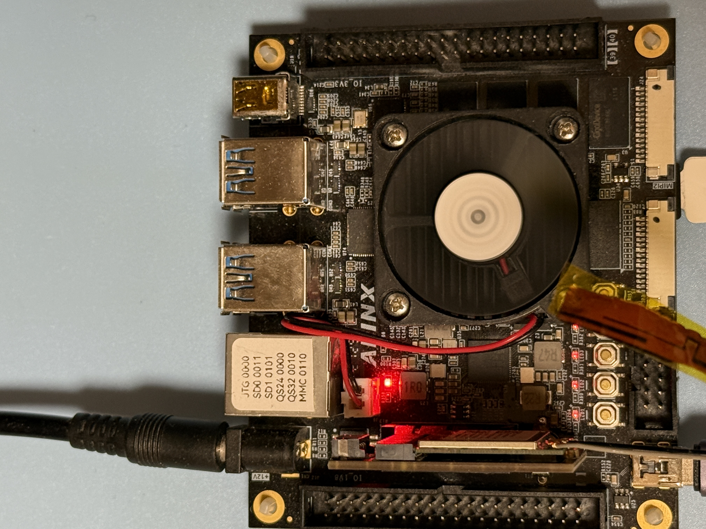

# RTL8822BE PCIe Card Testing

### Test PCIe Gear

|Test Board|PCIe Card HW|
|-|-|
|||

```
5.4.0

DISTRIB_ID=Ubuntu
DISTRIB_RELEASE=18.04
DISTRIB_CODENAME=bionic
DISTRIB_DESCRIPTION="Ubuntu 18.04.6 LTS"

Architecture:        aarch64
Byte Order:          Little Endian
CPU(s):              2
On-line CPU(s) list: 0,1
Thread(s) per core:  1
Core(s) per socket:  2
Socket(s):           1
Vendor ID:           ARM
Model:               4
Model name:          Cortex-A53
Stepping:            r0p4
CPU max MHz:         1199.9990
CPU min MHz:         299.9990
BogoMIPS:            66.66
Flags:               fp asimd aes pmull sha1 sha2 crc32 cpuid
```

### PCIe Tree

```
00:00.0 PCI bridge: Xilinx Corporation Device d011 (prog-if 00 [Normal decode])
	Control: I/O- Mem+ BusMaster+ SpecCycle- MemWINV- VGASnoop- ParErr- Stepping- SERR- FastB2B- DisINTx-
	Status: Cap+ 66MHz- UDF- FastB2B- ParErr- DEVSEL=fast >TAbort- <TAbort- <MAbort- >SERR- <PERR- INTx-
	Latency: 0
	Interrupt: pin A routed to IRQ 46
	Bus: primary=00, secondary=01, subordinate=0c, sec-latency=0
	I/O behind bridge: 00000000-00000fff
	Memory behind bridge: e0000000-e00fffff
	Secondary status: 66MHz- FastB2B- ParErr- DEVSEL=fast >TAbort- <TAbort- <MAbort- <SERR- <PERR-
	BridgeCtl: Parity- SERR+ NoISA- VGA- MAbort- >Reset- FastB2B-
		PriDiscTmr- SecDiscTmr- DiscTmrStat- DiscTmrSERREn-
	Capabilities: [40] Power Management version 3
		Flags: PMEClk- DSI- D1- D2- AuxCurrent=0mA PME(D0+,D1+,D2+,D3hot+,D3cold-)
		Status: D0 NoSoftRst+ PME-Enable- DSel=0 DScale=0 PME-
	Capabilities: [60] Express (v2) Root Port (Slot-), MSI 00
		DevCap:	MaxPayload 256 bytes, PhantFunc 0
			ExtTag- RBE+
		DevCtl:	Report errors: Correctable- Non-Fatal- Fatal- Unsupported-
			RlxdOrd+ ExtTag- PhantFunc- AuxPwr- NoSnoop+
			MaxPayload 128 bytes, MaxReadReq 512 bytes
		DevSta:	CorrErr- UncorrErr- FatalErr- UnsuppReq- AuxPwr- TransPend+
		LnkCap:	Port #0, Speed 5GT/s, Width x1, ASPM not supported, Exit Latency L0s unlimited, L1 unlimited
			ClockPM- Surprise- LLActRep+ BwNot+ ASPMOptComp+
		LnkCtl:	ASPM Disabled; RCB 64 bytes Disabled- CommClk-
			ExtSynch- ClockPM- AutWidDis- BWInt- AutBWInt-
		LnkSta:	Speed 2.5GT/s, Width x1, TrErr- Train- SlotClk+ DLActive+ BWMgmt- ABWMgmt-
		RootCtl: ErrCorrectable- ErrNon-Fatal- ErrFatal- PMEIntEna+ CRSVisible+
		RootCap: CRSVisible+
		RootSta: PME ReqID 0000, PMEStatus- PMEPending-
		DevCap2: Completion Timeout: Range B, TimeoutDis+, LTR-, OBFF Not Supported ARIFwd-
		DevCtl2: Completion Timeout: 50us to 50ms, TimeoutDis-, LTR-, OBFF Disabled ARIFwd-
		LnkCtl2: Target Link Speed: 5GT/s, EnterCompliance- SpeedDis-
			 Transmit Margin: Normal Operating Range, EnterModifiedCompliance- ComplianceSOS-
			 Compliance De-emphasis: -6dB
		LnkSta2: Current De-emphasis Level: -3.5dB, EqualizationComplete-, EqualizationPhase1-
			 EqualizationPhase2-, EqualizationPhase3-, LinkEqualizationRequest-
	Capabilities: [100 v1] Device Serial Number 00-00-00-00-00-00-00-00
	Capabilities: [10c v1] Virtual Channel
		Caps:	LPEVC=0 RefClk=100ns PATEntryBits=1
		Arb:	Fixed- WRR32- WRR64- WRR128-
		Ctrl:	ArbSelect=Fixed
		Status:	InProgress-
		VC0:	Caps:	PATOffset=00 MaxTimeSlots=1 RejSnoopTrans-
			Arb:	Fixed- WRR32- WRR64- WRR128- TWRR128- WRR256-
			Ctrl:	Enable+ ID=0 ArbSelect=Fixed TC/VC=ff
			Status:	NegoPending- InProgress-
	Capabilities: [128 v1] Vendor Specific Information: ID=1234 Rev=1 Len=018 <?>
	Kernel driver in use: pcieport

01:00.0 Network controller: Realtek Semiconductor Co., Ltd. RTL8822BE 802.11a/b/g/n/ac WiFi adapter
	Subsystem: Hewlett-Packard Company Device 831b
	Control: I/O- Mem- BusMaster- SpecCycle- MemWINV- VGASnoop- ParErr- Stepping- SERR- FastB2B- DisINTx-
	Status: Cap+ 66MHz- UDF- FastB2B- ParErr- DEVSEL=fast >TAbort- <TAbort- <MAbort- >SERR- <PERR- INTx-
	Interrupt: pin A routed to IRQ 255
	Region 0: I/O ports at <unassigned> [disabled]
	Region 2: Memory at e0000000 (64-bit, non-prefetchable) [disabled] [size=64K]
	Capabilities: [40] Power Management version 3
		Flags: PMEClk- DSI- D1+ D2+ AuxCurrent=375mA PME(D0+,D1+,D2+,D3hot+,D3cold+)
		Status: D0 NoSoftRst+ PME-Enable- DSel=0 DScale=0 PME-
	Capabilities: [50] MSI: Enable- Count=1/1 Maskable- 64bit+
		Address: 0000000000000000  Data: 0000
	Capabilities: [70] Express (v2) Endpoint, MSI 00
		DevCap:	MaxPayload 128 bytes, PhantFunc 0, Latency L0s <4us, L1 <64us
			ExtTag- AttnBtn- AttnInd- PwrInd- RBE+ FLReset- SlotPowerLimit 0.000W
		DevCtl:	Report errors: Correctable- Non-Fatal- Fatal- Unsupported-
			RlxdOrd+ ExtTag- PhantFunc- AuxPwr- NoSnoop-
			MaxPayload 128 bytes, MaxReadReq 512 bytes
		DevSta:	CorrErr- UncorrErr- FatalErr- UnsuppReq- AuxPwr+ TransPend-
		LnkCap:	Port #0, Speed 2.5GT/s, Width x1, ASPM L0s L1, Exit Latency L0s <512ns, L1 <64us
			ClockPM+ Surprise- LLActRep- BwNot- ASPMOptComp-
		LnkCtl:	ASPM Disabled; RCB 64 bytes Disabled- CommClk-
			ExtSynch- ClockPM- AutWidDis- BWInt- AutBWInt-
		LnkSta:	Speed 2.5GT/s, Width x1, TrErr- Train- SlotClk+ DLActive- BWMgmt- ABWMgmt-
		DevCap2: Completion Timeout: Not Supported, TimeoutDis+, LTR+, OBFF Via message/WAKE#
		DevCtl2: Completion Timeout: 50us to 50ms, TimeoutDis-, LTR+, OBFF Disabled
		LnkCtl2: Target Link Speed: 5GT/s, EnterCompliance- SpeedDis-
			 Transmit Margin: Normal Operating Range, EnterModifiedCompliance- ComplianceSOS-
			 Compliance De-emphasis: -6dB
		LnkSta2: Current De-emphasis Level: -3.5dB, EqualizationComplete-, EqualizationPhase1-
			 EqualizationPhase2-, EqualizationPhase3-, LinkEqualizationRequest-
	Capabilities: [100 v2] Advanced Error Reporting
		UESta:	DLP- SDES- TLP- FCP- CmpltTO- CmpltAbrt- UnxCmplt- RxOF- MalfTLP- ECRC- UnsupReq- ACSViol-
		UEMsk:	DLP- SDES- TLP- FCP- CmpltTO- CmpltAbrt- UnxCmplt- RxOF- MalfTLP- ECRC- UnsupReq- ACSViol-
		UESvrt:	DLP+ SDES+ TLP- FCP+ CmpltTO- CmpltAbrt- UnxCmplt- RxOF+ MalfTLP+ ECRC- UnsupReq- ACSViol-
		CESta:	RxErr- BadTLP- BadDLLP- Rollover- Timeout- NonFatalErr-
		CEMsk:	RxErr- BadTLP- BadDLLP- Rollover- Timeout- NonFatalErr+
		AERCap:	First Error Pointer: 00, GenCap+ CGenEn- ChkCap+ ChkEn-
	Capabilities: [148 v1] Device Serial Number 00-e0-4c-ff-fe-b8-22-01
	Capabilities: [158 v1] Latency Tolerance Reporting
		Max snoop latency: 0ns
		Max no snoop latency: 0ns
	Capabilities: [160 v1] L1 PM Substates
		L1SubCap: PCI-PM_L1.2- PCI-PM_L1.1- ASPM_L1.2- ASPM_L1.1- L1_PM_Substates-
		L1SubCtl1: PCI-PM_L1.2- PCI-PM_L1.1- ASPM_L1.2- ASPM_L1.1-

		L1SubCtl2:
	Kernel modules: rtw_8822be

```

### Driver Load

The driver is loaded via "modprobe"

```
Module                  Size  Used by
rtw_8822be             16384  0
rtw_8822b             221184  1 rtw_8822be
rtw_pci                32768  1 rtw_8822be
rtw_core              208896  2 rtw_8822b,rtw_pci

00:00.0 PCI bridge: Xilinx Corporation Device d011 (prog-if 00 [Normal decode])
	Control: I/O- Mem+ BusMaster+ SpecCycle- MemWINV- VGASnoop- ParErr- Stepping- SERR- FastB2B- DisINTx-
	Status: Cap+ 66MHz- UDF- FastB2B- ParErr- DEVSEL=fast >TAbort- <TAbort- <MAbort- >SERR- <PERR- INTx-
	Latency: 0
	Interrupt: pin A routed to IRQ 46
	Bus: primary=00, secondary=01, subordinate=0c, sec-latency=0
	I/O behind bridge: 00000000-00000fff
	Memory behind bridge: e0000000-e00fffff
	Secondary status: 66MHz- FastB2B- ParErr- DEVSEL=fast >TAbort- <TAbort- <MAbort- <SERR- <PERR-
	BridgeCtl: Parity- SERR+ NoISA- VGA- MAbort- >Reset- FastB2B-
		PriDiscTmr- SecDiscTmr- DiscTmrStat- DiscTmrSERREn-
	Capabilities: [40] Power Management version 3
		Flags: PMEClk- DSI- D1- D2- AuxCurrent=0mA PME(D0+,D1+,D2+,D3hot+,D3cold-)
		Status: D0 NoSoftRst+ PME-Enable- DSel=0 DScale=0 PME-
	Capabilities: [60] Express (v2) Root Port (Slot-), MSI 00
		DevCap:	MaxPayload 256 bytes, PhantFunc 0
			ExtTag- RBE+
		DevCtl:	Report errors: Correctable- Non-Fatal- Fatal- Unsupported-
			RlxdOrd+ ExtTag- PhantFunc- AuxPwr- NoSnoop+
			MaxPayload 128 bytes, MaxReadReq 512 bytes
		DevSta:	CorrErr- UncorrErr- FatalErr- UnsuppReq- AuxPwr- TransPend+
		LnkCap:	Port #0, Speed 5GT/s, Width x1, ASPM not supported, Exit Latency L0s unlimited, L1 unlimited
			ClockPM- Surprise- LLActRep+ BwNot+ ASPMOptComp+
		LnkCtl:	ASPM Disabled; RCB 64 bytes Disabled- CommClk-
			ExtSynch- ClockPM- AutWidDis- BWInt- AutBWInt-
		LnkSta:	Speed 2.5GT/s, Width x1, TrErr- Train- SlotClk+ DLActive+ BWMgmt- ABWMgmt-
		RootCtl: ErrCorrectable- ErrNon-Fatal- ErrFatal- PMEIntEna+ CRSVisible+
		RootCap: CRSVisible+
		RootSta: PME ReqID 0000, PMEStatus- PMEPending-
		DevCap2: Completion Timeout: Range B, TimeoutDis+, LTR-, OBFF Not Supported ARIFwd-
		DevCtl2: Completion Timeout: 50us to 50ms, TimeoutDis-, LTR-, OBFF Disabled ARIFwd-
		LnkCtl2: Target Link Speed: 5GT/s, EnterCompliance- SpeedDis-
			 Transmit Margin: Normal Operating Range, EnterModifiedCompliance- ComplianceSOS-
			 Compliance De-emphasis: -6dB
		LnkSta2: Current De-emphasis Level: -3.5dB, EqualizationComplete-, EqualizationPhase1-
			 EqualizationPhase2-, EqualizationPhase3-, LinkEqualizationRequest-
	Capabilities: [100 v1] Device Serial Number 00-00-00-00-00-00-00-00
	Capabilities: [10c v1] Virtual Channel
		Caps:	LPEVC=0 RefClk=100ns PATEntryBits=1
		Arb:	Fixed- WRR32- WRR64- WRR128-
		Ctrl:	ArbSelect=Fixed
		Status:	InProgress-
		VC0:	Caps:	PATOffset=00 MaxTimeSlots=1 RejSnoopTrans-
			Arb:	Fixed- WRR32- WRR64- WRR128- TWRR128- WRR256-
			Ctrl:	Enable+ ID=0 ArbSelect=Fixed TC/VC=ff
			Status:	NegoPending- InProgress-
	Capabilities: [128 v1] Vendor Specific Information: ID=1234 Rev=1 Len=018 <?>
	Kernel driver in use: pcieport

01:00.0 Network controller: Realtek Semiconductor Co., Ltd. RTL8822BE 802.11a/b/g/n/ac WiFi adapter
	Subsystem: Hewlett-Packard Company Device 831b
	Control: I/O- Mem+ BusMaster+ SpecCycle- MemWINV- VGASnoop- ParErr- Stepping- SERR- FastB2B- DisINTx+
	Status: Cap+ 66MHz- UDF- FastB2B- ParErr- DEVSEL=fast >TAbort- <TAbort- <MAbort- >SERR- <PERR- INTx-
	Latency: 0
	Interrupt: pin A routed to IRQ 50
	Region 0: I/O ports at <unassigned> [disabled]
	Region 2: Memory at e0000000 (64-bit, non-prefetchable) [size=64K]
	Capabilities: [40] Power Management version 3
		Flags: PMEClk- DSI- D1+ D2+ AuxCurrent=375mA PME(D0+,D1+,D2+,D3hot+,D3cold+)
		Status: D0 NoSoftRst+ PME-Enable- DSel=0 DScale=0 PME-
	Capabilities: [50] MSI: Enable+ Count=1/1 Maskable- 64bit+
		Address: 00000000fd480000  Data: 0000
	Capabilities: [70] Express (v2) Endpoint, MSI 00
		DevCap:	MaxPayload 128 bytes, PhantFunc 0, Latency L0s <4us, L1 <64us
			ExtTag- AttnBtn- AttnInd- PwrInd- RBE+ FLReset- SlotPowerLimit 0.000W
		DevCtl:	Report errors: Correctable- Non-Fatal- Fatal- Unsupported-
			RlxdOrd+ ExtTag- PhantFunc- AuxPwr- NoSnoop-
			MaxPayload 128 bytes, MaxReadReq 512 bytes
		DevSta:	CorrErr- UncorrErr- FatalErr- UnsuppReq- AuxPwr+ TransPend-
		LnkCap:	Port #0, Speed 2.5GT/s, Width x1, ASPM L0s L1, Exit Latency L0s <512ns, L1 <64us
			ClockPM+ Surprise- LLActRep- BwNot- ASPMOptComp-
		LnkCtl:	ASPM Disabled; RCB 64 bytes Disabled- CommClk-
			ExtSynch- ClockPM- AutWidDis- BWInt- AutBWInt-
		LnkSta:	Speed 2.5GT/s, Width x1, TrErr- Train- SlotClk+ DLActive- BWMgmt- ABWMgmt-
		DevCap2: Completion Timeout: Not Supported, TimeoutDis+, LTR+, OBFF Via message/WAKE#
		DevCtl2: Completion Timeout: 50us to 50ms, TimeoutDis-, LTR+, OBFF Disabled
		LnkCtl2: Target Link Speed: 5GT/s, EnterCompliance- SpeedDis-
			 Transmit Margin: Normal Operating Range, EnterModifiedCompliance- ComplianceSOS-
			 Compliance De-emphasis: -6dB
		LnkSta2: Current De-emphasis Level: -3.5dB, EqualizationComplete-, EqualizationPhase1-
			 EqualizationPhase2-, EqualizationPhase3-, LinkEqualizationRequest-
	Capabilities: [100 v2] Advanced Error Reporting
		UESta:	DLP- SDES- TLP- FCP- CmpltTO- CmpltAbrt- UnxCmplt- RxOF- MalfTLP- ECRC- UnsupReq- ACSViol-
		UEMsk:	DLP- SDES- TLP- FCP- CmpltTO- CmpltAbrt- UnxCmplt- RxOF- MalfTLP- ECRC- UnsupReq- ACSViol-
		UESvrt:	DLP+ SDES+ TLP- FCP+ CmpltTO- CmpltAbrt- UnxCmplt- RxOF+ MalfTLP+ ECRC- UnsupReq- ACSViol-
		CESta:	RxErr- BadTLP- BadDLLP- Rollover- Timeout- NonFatalErr-
		CEMsk:	RxErr- BadTLP- BadDLLP- Rollover- Timeout- NonFatalErr+
		AERCap:	First Error Pointer: 00, GenCap+ CGenEn- ChkCap+ ChkEn-
	Capabilities: [148 v1] Device Serial Number 00-e0-4c-ff-fe-b8-22-01
	Capabilities: [158 v1] Latency Tolerance Reporting
		Max snoop latency: 0ns
		Max no snoop latency: 0ns
	Capabilities: [160 v1] L1 PM Substates
		L1SubCap: PCI-PM_L1.2- PCI-PM_L1.1- ASPM_L1.2- ASPM_L1.1- L1_PM_Substates-
		L1SubCtl1: PCI-PM_L1.2- PCI-PM_L1.1- ASPM_L1.2- ASPM_L1.1-

		L1SubCtl2:
	Kernel driver in use: rtw_8822be
	Kernel modules: rtw_8822be

[   59.198700] rtw_8822be 0000:01:00.0: enabling device (0000 -> 0002)
[   59.215625] rtw_8822be 0000:01:00.0: Firmware version 30.20.0, H2C version 14
```

### iw list

<details>

<summary>iw list</summary>

```
Wiphy phy0
	max # scan SSIDs: 4
	max scan IEs length: 2243 bytes
	max # sched scan SSIDs: 0
	max # match sets: 0
	max # scan plans: 1
	max scan plan interval: -1
	max scan plan iterations: 0
	Retry short limit: 7
	Retry long limit: 4
	Coverage class: 0 (up to 0m)
	Device supports T-DLS.
	Supported Ciphers:
		* WEP40 (00-0f-ac:1)
		* WEP104 (00-0f-ac:5)
		* TKIP (00-0f-ac:2)
		* CCMP-128 (00-0f-ac:4)
		* CCMP-256 (00-0f-ac:10)
		* GCMP-128 (00-0f-ac:8)
		* GCMP-256 (00-0f-ac:9)
		* CMAC (00-0f-ac:6)
		* CMAC-256 (00-0f-ac:13)
		* GMAC-128 (00-0f-ac:11)
		* GMAC-256 (00-0f-ac:12)
	Available Antennas: TX 0x3 RX 0x3
	Configured Antennas: TX 0x3 RX 0x3
	Supported interface modes:
		 * IBSS
		 * managed
		 * AP
		 * AP/VLAN
		 * monitor
		 * P2P-client
		 * P2P-GO
	Band 1:
		Capabilities: 0x196f
			RX LDPC
			HT20/HT40
			SM Power Save disabled
			RX HT20 SGI
			RX HT40 SGI
			RX STBC 1-stream
			Max AMSDU length: 7935 bytes
			DSSS/CCK HT40
		Maximum RX AMPDU length 65535 bytes (exponent: 0x003)
		Minimum RX AMPDU time spacing: 2 usec (0x04)
		HT Max RX data rate: 300 Mbps
		HT TX/RX MCS rate indexes supported: 0-15, 32
		Bitrates (non-HT):
			* 1.0 Mbps
			* 2.0 Mbps
			* 5.5 Mbps
			* 11.0 Mbps
			* 6.0 Mbps
			* 9.0 Mbps
			* 12.0 Mbps
			* 18.0 Mbps
			* 24.0 Mbps
			* 36.0 Mbps
			* 48.0 Mbps
			* 54.0 Mbps
		Frequencies:
			* 2412 MHz [1] (20.0 dBm)
			* 2417 MHz [2] (20.0 dBm)
			* 2422 MHz [3] (20.0 dBm)
			* 2427 MHz [4] (20.0 dBm)
			* 2432 MHz [5] (20.0 dBm)
			* 2437 MHz [6] (20.0 dBm)
			* 2442 MHz [7] (20.0 dBm)
			* 2447 MHz [8] (20.0 dBm)
			* 2452 MHz [9] (20.0 dBm)
			* 2457 MHz [10] (20.0 dBm)
			* 2462 MHz [11] (20.0 dBm)
			* 2467 MHz [12] (20.0 dBm) (no IR)
			* 2472 MHz [13] (20.0 dBm) (no IR)
			* 2484 MHz [14] (20.0 dBm) (no IR)
	Band 2:
		Capabilities: 0x196f
			RX LDPC
			HT20/HT40
			SM Power Save disabled
			RX HT20 SGI
			RX HT40 SGI
			RX STBC 1-stream
			Max AMSDU length: 7935 bytes
			DSSS/CCK HT40
		Maximum RX AMPDU length 65535 bytes (exponent: 0x003)
		Minimum RX AMPDU time spacing: 2 usec (0x04)
		HT Max RX data rate: 300 Mbps
		HT TX/RX MCS rate indexes supported: 0-15, 32
		VHT Capabilities (0x03d071b2):
			Max MPDU length: 11454
			Supported Channel Width: neither 160 nor 80+80
			RX LDPC
			short GI (80 MHz)
			TX STBC
			SU Beamformee
			MU Beamformee
			+HTC-VHT
		VHT RX MCS set:
			1 streams: MCS 0-9
			2 streams: MCS 0-9
			3 streams: not supported
			4 streams: not supported
			5 streams: not supported
			6 streams: not supported
			7 streams: not supported
			8 streams: not supported
		VHT RX highest supported: 780 Mbps
		VHT TX MCS set:
			1 streams: MCS 0-9
			2 streams: MCS 0-9
			3 streams: not supported
			4 streams: not supported
			5 streams: not supported
			6 streams: not supported
			7 streams: not supported
			8 streams: not supported
		VHT TX highest supported: 780 Mbps
		Bitrates (non-HT):
			* 6.0 Mbps
			* 9.0 Mbps
			* 12.0 Mbps
			* 18.0 Mbps
			* 24.0 Mbps
			* 36.0 Mbps
			* 48.0 Mbps
			* 54.0 Mbps
		Frequencies:
			* 5180 MHz [36] (20.0 dBm) (no IR)
			* 5200 MHz [40] (20.0 dBm) (no IR)
			* 5220 MHz [44] (20.0 dBm) (no IR)
			* 5240 MHz [48] (20.0 dBm) (no IR)
			* 5260 MHz [52] (20.0 dBm) (no IR, radar detection)
			* 5280 MHz [56] (20.0 dBm) (no IR, radar detection)
			* 5300 MHz [60] (20.0 dBm) (no IR, radar detection)
			* 5320 MHz [64] (20.0 dBm) (no IR, radar detection)
			* 5500 MHz [100] (20.0 dBm) (no IR, radar detection)
			* 5520 MHz [104] (20.0 dBm) (no IR, radar detection)
			* 5540 MHz [108] (20.0 dBm) (no IR, radar detection)
			* 5560 MHz [112] (20.0 dBm) (no IR, radar detection)
			* 5580 MHz [116] (20.0 dBm) (no IR, radar detection)
			* 5600 MHz [120] (20.0 dBm) (no IR, radar detection)
			* 5620 MHz [124] (20.0 dBm) (no IR, radar detection)
			* 5640 MHz [128] (20.0 dBm) (no IR, radar detection)
			* 5660 MHz [132] (20.0 dBm) (no IR, radar detection)
			* 5680 MHz [136] (20.0 dBm) (no IR, radar detection)
			* 5700 MHz [140] (20.0 dBm) (no IR, radar detection)
			* 5720 MHz [144] (20.0 dBm) (no IR, radar detection)
			* 5745 MHz [149] (20.0 dBm) (no IR)
			* 5765 MHz [153] (20.0 dBm) (no IR)
			* 5785 MHz [157] (20.0 dBm) (no IR)
			* 5805 MHz [161] (20.0 dBm) (no IR)
			* 5825 MHz [165] (20.0 dBm) (no IR)
	Supported commands:
		 * new_interface
		 * set_interface
		 * new_key
		 * start_ap
		 * new_station
		 * set_bss
		 * authenticate
		 * associate
		 * deauthenticate
		 * disassociate
		 * join_ibss
		 * set_tx_bitrate_mask
		 * frame
		 * frame_wait_cancel
		 * set_wiphy_netns
		 * set_channel
		 * set_wds_peer
		 * tdls_mgmt
		 * tdls_oper
		 * probe_client
		 * set_noack_map
		 * register_beacons
		 * start_p2p_device
		 * set_mcast_rate
		 * testmode
		 * connect
		 * disconnect
		 * set_qos_map
		 * set_multicast_to_unicast
	Supported TX frame types:
		 * IBSS: 0x00 0x10 0x20 0x30 0x40 0x50 0x60 0x70 0x80 0x90 0xa0 0xb0 0xc0 0xd0 0xe0 0xf0
		 * managed: 0x00 0x10 0x20 0x30 0x40 0x50 0x60 0x70 0x80 0x90 0xa0 0xb0 0xc0 0xd0 0xe0 0xf0
		 * AP: 0x00 0x10 0x20 0x30 0x40 0x50 0x60 0x70 0x80 0x90 0xa0 0xb0 0xc0 0xd0 0xe0 0xf0
		 * AP/VLAN: 0x00 0x10 0x20 0x30 0x40 0x50 0x60 0x70 0x80 0x90 0xa0 0xb0 0xc0 0xd0 0xe0 0xf0
		 * mesh point: 0x00 0x10 0x20 0x30 0x40 0x50 0x60 0x70 0x80 0x90 0xa0 0xb0 0xc0 0xd0 0xe0 0xf0
		 * P2P-client: 0x00 0x10 0x20 0x30 0x40 0x50 0x60 0x70 0x80 0x90 0xa0 0xb0 0xc0 0xd0 0xe0 0xf0
		 * P2P-GO: 0x00 0x10 0x20 0x30 0x40 0x50 0x60 0x70 0x80 0x90 0xa0 0xb0 0xc0 0xd0 0xe0 0xf0
		 * P2P-device: 0x00 0x10 0x20 0x30 0x40 0x50 0x60 0x70 0x80 0x90 0xa0 0xb0 0xc0 0xd0 0xe0 0xf0
	Supported RX frame types:
		 * IBSS: 0x40 0xb0 0xc0 0xd0
		 * managed: 0x40 0xd0
		 * AP: 0x00 0x20 0x40 0xa0 0xb0 0xc0 0xd0
		 * AP/VLAN: 0x00 0x20 0x40 0xa0 0xb0 0xc0 0xd0
		 * mesh point: 0xb0 0xc0 0xd0
		 * P2P-client: 0x40 0xd0
		 * P2P-GO: 0x00 0x20 0x40 0xa0 0xb0 0xc0 0xd0
		 * P2P-device: 0x40 0xd0
	software interface modes (can always be added):
		 * AP/VLAN
		 * monitor
	valid interface combinations:
		 * #{ managed } <= 1, #{ AP, P2P-client, P2P-GO } <= 1,
		   total <= 2, #channels <= 1
	HT Capability overrides:
		 * MCS: ff ff ff ff ff ff ff ff ff ff
		 * maximum A-MSDU length
		 * supported channel width
		 * short GI for 40 MHz
		 * max A-MPDU length exponent
		 * min MPDU start spacing
	Device supports TX status socket option.
	Device supports HT-IBSS.
	Device supports SAE with AUTHENTICATE command
	Device supports scan flush.
	Device supports per-vif TX power setting
	Driver supports full state transitions for AP/GO clients
	Driver supports a userspace MPM
	Device supports configuring vdev MAC-addr on create.
```

</details>

### Network Manager - Band 2.4

```
wlan0: flags=4163<UP,BROADCAST,RUNNING,MULTICAST>  mtu 1500
        inet 192.168.1.43  netmask 255.255.252.0  broadcast 192.168.3.255
        RX packets 14  bytes 2240 (2.2 KB)
        RX errors 0  dropped 0  overruns 0  frame 0
        TX packets 25  bytes 3708 (3.7 KB)
        TX errors 0  dropped 0 overruns 0  carrier 0  collisions 0
```

### iwconfig 2.4

```
wlan0     IEEE 802.11  ESSID:""  
          Mode:Managed  Frequency:2.412 GHz  Access Point: 
          Bit Rate=108 Mb/s   Tx-Power=20 dBm   
          Retry short limit:7   RTS thr:off   Fragment thr:off
          Encryption key:off
          Power Management:on
          Link Quality=57/70  Signal level=-53 dBm  
          Rx invalid nwid:0  Rx invalid crypt:0  Rx invalid frag:0
          Tx excessive retries:0  Invalid misc:1   Missed beacon:0

```

### Network Speed Test via Ookla - Band 2.4

```
Retrieving speedtest.net configuration...
Retrieving speedtest.net server list...
Selecting best server based on ping...
Testing download speed................................................................................
Download: 64.38 Mbit/s
Testing upload speed......................................................................................................
Upload: 3.88 Mbit/s
```

### Network Ping Tests - Band 2.4

#### DNS-Ping

```
PING 8.8.8.8 (8.8.8.8) 56(84) bytes of data.
64 bytes from 8.8.8.8: icmp_seq=1 ttl=59 time=7.39 ms
64 bytes from 8.8.8.8: icmp_seq=2 ttl=59 time=4.45 ms
64 bytes from 8.8.8.8: icmp_seq=3 ttl=59 time=4.97 ms
64 bytes from 8.8.8.8: icmp_seq=4 ttl=59 time=3.93 ms
64 bytes from 8.8.8.8: icmp_seq=5 ttl=59 time=3.69 ms
64 bytes from 8.8.8.8: icmp_seq=6 ttl=59 time=14.6 ms
64 bytes from 8.8.8.8: icmp_seq=7 ttl=59 time=5.07 ms
64 bytes from 8.8.8.8: icmp_seq=8 ttl=59 time=4.97 ms
64 bytes from 8.8.8.8: icmp_seq=9 ttl=59 time=6.97 ms
64 bytes from 8.8.8.8: icmp_seq=10 ttl=59 time=6.20 ms
64 bytes from 8.8.8.8: icmp_seq=11 ttl=59 time=4.37 ms
64 bytes from 8.8.8.8: icmp_seq=12 ttl=59 time=4.62 ms
64 bytes from 8.8.8.8: icmp_seq=13 ttl=59 time=4.11 ms
64 bytes from 8.8.8.8: icmp_seq=14 ttl=59 time=7.64 ms
64 bytes from 8.8.8.8: icmp_seq=15 ttl=59 time=7.58 ms
64 bytes from 8.8.8.8: icmp_seq=16 ttl=59 time=4.15 ms
64 bytes from 8.8.8.8: icmp_seq=17 ttl=59 time=3.83 ms
64 bytes from 8.8.8.8: icmp_seq=18 ttl=59 time=3.80 ms
64 bytes from 8.8.8.8: icmp_seq=19 ttl=59 time=4.28 ms
64 bytes from 8.8.8.8: icmp_seq=20 ttl=59 time=3.70 ms

--- 8.8.8.8 ping statistics ---
20 packets transmitted, 20 received, 0% packet loss, time 19027ms
rtt min/avg/max/mdev = 3.698/5.520/14.615/2.470 ms
```

#### Self-Ping 

```
PING 192.168.1.43 (192.168.1.43) 10000(10028) bytes of data.
10008 bytes from 192.168.1.43: icmp_seq=1 ttl=64 time=0.105 ms
10008 bytes from 192.168.1.43: icmp_seq=2 ttl=64 time=0.068 ms
10008 bytes from 192.168.1.43: icmp_seq=3 ttl=64 time=0.060 ms
10008 bytes from 192.168.1.43: icmp_seq=4 ttl=64 time=0.059 ms
10008 bytes from 192.168.1.43: icmp_seq=5 ttl=64 time=0.063 ms
10008 bytes from 192.168.1.43: icmp_seq=6 ttl=64 time=0.062 ms
10008 bytes from 192.168.1.43: icmp_seq=7 ttl=64 time=0.060 ms
10008 bytes from 192.168.1.43: icmp_seq=8 ttl=64 time=0.059 ms
10008 bytes from 192.168.1.43: icmp_seq=9 ttl=64 time=0.061 ms
10008 bytes from 192.168.1.43: icmp_seq=10 ttl=64 time=0.060 ms
10008 bytes from 192.168.1.43: icmp_seq=11 ttl=64 time=0.081 ms
10008 bytes from 192.168.1.43: icmp_seq=12 ttl=64 time=0.064 ms
10008 bytes from 192.168.1.43: icmp_seq=13 ttl=64 time=0.061 ms
10008 bytes from 192.168.1.43: icmp_seq=14 ttl=64 time=0.059 ms
10008 bytes from 192.168.1.43: icmp_seq=15 ttl=64 time=0.059 ms
10008 bytes from 192.168.1.43: icmp_seq=16 ttl=64 time=0.062 ms
10008 bytes from 192.168.1.43: icmp_seq=17 ttl=64 time=0.081 ms
10008 bytes from 192.168.1.43: icmp_seq=18 ttl=64 time=0.060 ms
10008 bytes from 192.168.1.43: icmp_seq=19 ttl=64 time=0.061 ms
10008 bytes from 192.168.1.43: icmp_seq=20 ttl=64 time=0.061 ms

--- 192.168.1.43 ping statistics ---
20 packets transmitted, 20 received, 0% packet loss, time 19458ms
rtt min/avg/max/mdev = 0.059/0.065/0.105/0.012 ms
```

### Server & Client Test via iperf3 (PC-Router-DUT)

<details>

<summary>iperf3</summary>

```
-----------------------------------------------------------
Server listening on 5201
-----------------------------------------------------------
Accepted connection from 192.168.1.3, port 63522
[  5] local 192.168.1.43 port 5201 connected to 192.168.1.3 port 63523
[ ID] Interval           Transfer     Bandwidth       Retr  Cwnd
[  5]   0.00-1.00   sec  4.15 MBytes  34.8 Mbits/sec    0    101 KBytes       
[  5]   1.00-2.00   sec  4.53 MBytes  38.0 Mbits/sec    0    108 KBytes       
[  5]   2.00-3.00   sec  4.04 MBytes  33.9 Mbits/sec    0    135 KBytes       
[  5]   3.00-4.00   sec  6.37 MBytes  53.4 Mbits/sec    0    135 KBytes       
[  5]   4.00-5.00   sec  5.51 MBytes  46.3 Mbits/sec    0    135 KBytes       
[  5]   5.00-6.00   sec  6.74 MBytes  56.5 Mbits/sec    0    135 KBytes       
[  5]   6.00-7.00   sec  6.98 MBytes  58.6 Mbits/sec    0    135 KBytes       
[  5]   7.00-8.00   sec  6.62 MBytes  55.5 Mbits/sec    0    135 KBytes       
[  5]   8.00-9.00   sec  1.90 MBytes  15.9 Mbits/sec    1    135 KBytes       
[  5]   9.00-10.00  sec  1.23 MBytes  10.3 Mbits/sec    0    135 KBytes       
[  5]  10.00-11.00  sec  1.53 MBytes  12.9 Mbits/sec    0    135 KBytes       
[  5]  11.00-12.00  sec  1.96 MBytes  16.4 Mbits/sec    0    135 KBytes       
[  5]  12.00-13.00  sec  2.88 MBytes  24.2 Mbits/sec    0    135 KBytes       
[  5]  13.00-14.00  sec  5.21 MBytes  43.7 Mbits/sec    0    135 KBytes       
[  5]  14.00-15.00  sec  5.94 MBytes  49.9 Mbits/sec    0    135 KBytes       
[  5]  15.00-16.00  sec  6.25 MBytes  52.4 Mbits/sec    0    135 KBytes       
[  5]  16.00-17.00  sec  5.27 MBytes  44.2 Mbits/sec    0    135 KBytes       
[  5]  17.00-18.00  sec  5.88 MBytes  49.3 Mbits/sec    0    135 KBytes       
[  5]  18.00-19.00  sec  5.15 MBytes  43.2 Mbits/sec    0    135 KBytes       
[  5]  19.00-20.00  sec  5.15 MBytes  43.2 Mbits/sec    0    135 KBytes       
[  5]  20.00-21.00  sec  5.02 MBytes  42.1 Mbits/sec    0    135 KBytes       
[  5]  21.00-22.00  sec  6.00 MBytes  50.4 Mbits/sec    0    135 KBytes       
[  5]  22.00-23.00  sec  4.84 MBytes  40.6 Mbits/sec    0    135 KBytes       
[  5]  23.00-24.00  sec  5.33 MBytes  44.7 Mbits/sec    0    135 KBytes       
[  5]  24.00-25.00  sec  5.21 MBytes  43.7 Mbits/sec    0    135 KBytes       
[  5]  25.00-26.00  sec  5.08 MBytes  42.7 Mbits/sec    0    135 KBytes       
[  5]  26.00-27.00  sec  5.39 MBytes  45.2 Mbits/sec    0    135 KBytes       
[  5]  27.00-28.00  sec  3.55 MBytes  29.8 Mbits/sec    0    135 KBytes       
[  5]  28.00-29.00  sec  2.82 MBytes  23.6 Mbits/sec    0    135 KBytes       
[  5]  29.00-30.00  sec  3.25 MBytes  27.2 Mbits/sec    0    135 KBytes       
[  5]  30.00-30.03  sec   376 KBytes  89.8 Mbits/sec    0    135 KBytes       
- - - - - - - - - - - - - - - - - - - - - - - - -
[ ID] Interval           Transfer     Bandwidth       Retr
[  5]   0.00-30.03  sec   140 MBytes  39.1 Mbits/sec    1             sender
[  5]   0.00-30.03  sec  0.00 Bytes  0.00 bits/sec                  receiver
-----------------------------------------------------------
Server listening on 5201
-----------------------------------------------------------
iperf3: interrupt - the server has terminated
[   59.198700] rtw_8822be 0000:01:00.0: enabling device (0000 -> 0002)
[   59.215625] rtw_8822be 0000:01:00.0: Firmware version 30.20.0, H2C version 14
```

</details>

### Network Manager - Band 5G

```
wlan0: flags=4163<UP,BROADCAST,RUNNING,MULTICAST>  mtu 1500
        inet 192.168.1.43  netmask 255.255.252.0  broadcast 192.168.3.255
        RX packets 93805  bytes 87374349 (87.3 MB)
        RX errors 0  dropped 0  overruns 0  frame 0
        TX packets 131213  bytes 162875174 (162.8 MB)
        TX errors 0  dropped 0 overruns 0  carrier 0  collisions 0
```

### iwconfig 5G

```
wlan0     IEEE 802.11  ESSID:""  
          Mode:Managed  Frequency:5.805 GHz  Access Point: 
          Bit Rate=780 Mb/s   Tx-Power=20 dBm   
          Retry short limit:7   RTS thr:off   Fragment thr:off
          Encryption key:off
          Power Management:on
          Link Quality=56/70  Signal level=-54 dBm  
          Rx invalid nwid:0  Rx invalid crypt:0  Rx invalid frag:0
          Tx excessive retries:0  Invalid misc:0   Missed beacon:0

```

### Network Speed Test via Ookla - Band 5G

```
Retrieving speedtest.net configuration...
Retrieving speedtest.net server list...
Selecting best server based on ping...
Testing download speed................................................................................
Download: 202.19 Mbit/s
Testing upload speed......................................................................................................
Upload: 4.12 Mbit/s
```

### Network Ping Tests - Band 5G

#### DNS-Ping

```
PING 8.8.8.8 (8.8.8.8) 56(84) bytes of data.
64 bytes from 8.8.8.8: icmp_seq=1 ttl=59 time=4.46 ms
64 bytes from 8.8.8.8: icmp_seq=2 ttl=59 time=4.57 ms
64 bytes from 8.8.8.8: icmp_seq=3 ttl=59 time=4.34 ms
64 bytes from 8.8.8.8: icmp_seq=4 ttl=59 time=3.79 ms
64 bytes from 8.8.8.8: icmp_seq=5 ttl=59 time=3.54 ms
64 bytes from 8.8.8.8: icmp_seq=6 ttl=59 time=3.63 ms
64 bytes from 8.8.8.8: icmp_seq=7 ttl=59 time=3.93 ms
64 bytes from 8.8.8.8: icmp_seq=8 ttl=59 time=3.06 ms
64 bytes from 8.8.8.8: icmp_seq=9 ttl=59 time=3.92 ms
64 bytes from 8.8.8.8: icmp_seq=10 ttl=59 time=3.96 ms
64 bytes from 8.8.8.8: icmp_seq=11 ttl=59 time=3.71 ms
64 bytes from 8.8.8.8: icmp_seq=12 ttl=59 time=3.70 ms
64 bytes from 8.8.8.8: icmp_seq=13 ttl=59 time=3.67 ms
64 bytes from 8.8.8.8: icmp_seq=14 ttl=59 time=5.38 ms
64 bytes from 8.8.8.8: icmp_seq=15 ttl=59 time=3.72 ms
64 bytes from 8.8.8.8: icmp_seq=16 ttl=59 time=9.22 ms
64 bytes from 8.8.8.8: icmp_seq=17 ttl=59 time=4.89 ms
64 bytes from 8.8.8.8: icmp_seq=18 ttl=59 time=3.80 ms
64 bytes from 8.8.8.8: icmp_seq=19 ttl=59 time=4.54 ms
64 bytes from 8.8.8.8: icmp_seq=20 ttl=59 time=4.11 ms

--- 8.8.8.8 ping statistics ---
20 packets transmitted, 20 received, 0% packet loss, time 19029ms
rtt min/avg/max/mdev = 3.065/4.301/9.226/1.242 ms
```

#### Self-Ping 

```
PING 192.168.1.43 (192.168.1.43) 10000(10028) bytes of data.
10008 bytes from 192.168.1.43: icmp_seq=1 ttl=64 time=0.104 ms
10008 bytes from 192.168.1.43: icmp_seq=2 ttl=64 time=0.066 ms
10008 bytes from 192.168.1.43: icmp_seq=3 ttl=64 time=0.062 ms
10008 bytes from 192.168.1.43: icmp_seq=4 ttl=64 time=0.072 ms
10008 bytes from 192.168.1.43: icmp_seq=5 ttl=64 time=0.065 ms
10008 bytes from 192.168.1.43: icmp_seq=6 ttl=64 time=0.060 ms
10008 bytes from 192.168.1.43: icmp_seq=7 ttl=64 time=0.060 ms
10008 bytes from 192.168.1.43: icmp_seq=8 ttl=64 time=0.062 ms
10008 bytes from 192.168.1.43: icmp_seq=9 ttl=64 time=0.079 ms
10008 bytes from 192.168.1.43: icmp_seq=10 ttl=64 time=0.065 ms
10008 bytes from 192.168.1.43: icmp_seq=11 ttl=64 time=0.061 ms
10008 bytes from 192.168.1.43: icmp_seq=12 ttl=64 time=0.062 ms
10008 bytes from 192.168.1.43: icmp_seq=13 ttl=64 time=0.061 ms
10008 bytes from 192.168.1.43: icmp_seq=14 ttl=64 time=0.061 ms
10008 bytes from 192.168.1.43: icmp_seq=15 ttl=64 time=0.069 ms
10008 bytes from 192.168.1.43: icmp_seq=16 ttl=64 time=0.064 ms
10008 bytes from 192.168.1.43: icmp_seq=17 ttl=64 time=0.061 ms
10008 bytes from 192.168.1.43: icmp_seq=18 ttl=64 time=0.062 ms
10008 bytes from 192.168.1.43: icmp_seq=19 ttl=64 time=0.060 ms
10008 bytes from 192.168.1.43: icmp_seq=20 ttl=64 time=0.062 ms

--- 192.168.1.43 ping statistics ---
20 packets transmitted, 20 received, 0% packet loss, time 19452ms
rtt min/avg/max/mdev = 0.060/0.065/0.104/0.014 ms
```

### Server & Client Test via iperf3 (PC-Router-DUT)

<details>

<summary>iperf3</summary>

```
-----------------------------------------------------------
Server listening on 5201
-----------------------------------------------------------
Accepted connection from 192.168.1.3, port 56712
[  5] local 192.168.1.43 port 5201 connected to 192.168.1.3 port 56713
[ ID] Interval           Transfer     Bandwidth       Retr  Cwnd
[  5]   0.00-1.00   sec  15.1 MBytes   127 Mbits/sec   77    362 KBytes       
[  5]   1.00-2.00   sec  15.3 MBytes   128 Mbits/sec    0    418 KBytes       
[  5]   2.00-3.00   sec  16.2 MBytes   136 Mbits/sec    0    463 KBytes       
[  5]   3.00-4.00   sec  14.4 MBytes   121 Mbits/sec    0    492 KBytes       
[  5]   4.00-5.00   sec  15.8 MBytes   133 Mbits/sec    0    509 KBytes       
[  5]   5.00-6.00   sec  14.5 MBytes   122 Mbits/sec    0    518 KBytes       
[  5]   6.00-7.00   sec  14.5 MBytes   121 Mbits/sec    0    519 KBytes       
[  5]   7.00-8.00   sec  19.2 MBytes   161 Mbits/sec    0    523 KBytes       
[  5]   8.00-9.00   sec  20.9 MBytes   175 Mbits/sec    0    553 KBytes       
[  5]   9.00-10.00  sec  21.9 MBytes   184 Mbits/sec    0    582 KBytes       
[  5]  10.00-11.00  sec  20.9 MBytes   175 Mbits/sec    0    609 KBytes       
[  5]  11.00-12.00  sec  21.2 MBytes   178 Mbits/sec    0    633 KBytes       
[  5]  12.00-13.00  sec  21.2 MBytes   178 Mbits/sec    0    659 KBytes       
[  5]  13.00-14.00  sec  21.2 MBytes   178 Mbits/sec    0    682 KBytes       
[  5]  14.00-15.00  sec  17.5 MBytes   147 Mbits/sec    0    744 KBytes       
[  5]  15.00-16.00  sec  18.8 MBytes   157 Mbits/sec    0    847 KBytes       
[  5]  16.00-17.00  sec  17.5 MBytes   147 Mbits/sec    0    981 KBytes       
[  5]  17.00-18.00  sec  20.0 MBytes   168 Mbits/sec    0   1.01 MBytes       
[  5]  18.00-19.00  sec  20.0 MBytes   168 Mbits/sec    0   1.01 MBytes       
[  5]  19.00-20.00  sec  18.8 MBytes   157 Mbits/sec    0   1.01 MBytes       
[  5]  20.00-21.00  sec  17.5 MBytes   147 Mbits/sec    0   1.01 MBytes       
[  5]  21.00-22.00  sec  20.0 MBytes   168 Mbits/sec    0   1.01 MBytes       
[  5]  22.00-23.00  sec  17.5 MBytes   147 Mbits/sec    0   1.01 MBytes       
[  5]  23.00-24.00  sec  18.8 MBytes   157 Mbits/sec    0   1.01 MBytes       
[  5]  24.00-25.00  sec  21.2 MBytes   178 Mbits/sec    0   1.01 MBytes       
[  5]  25.00-26.00  sec  20.0 MBytes   168 Mbits/sec    0   1.01 MBytes       
[  5]  26.00-27.00  sec  21.2 MBytes   178 Mbits/sec    0   1.01 MBytes       
[  5]  27.00-28.00  sec  20.0 MBytes   168 Mbits/sec    0   1.01 MBytes       
[  5]  28.00-29.00  sec  18.8 MBytes   157 Mbits/sec    0   1.01 MBytes       
[  5]  29.00-30.00  sec  16.2 MBytes   136 Mbits/sec    0   1.01 MBytes       
[  5]  30.00-30.03  sec  0.00 Bytes  0.00 bits/sec    0   1.01 MBytes       
- - - - - - - - - - - - - - - - - - - - - - - - -
[ ID] Interval           Transfer     Bandwidth       Retr
[  5]   0.00-30.03  sec   556 MBytes   155 Mbits/sec   77             sender
[  5]   0.00-30.03  sec  0.00 Bytes  0.00 bits/sec                  receiver
-----------------------------------------------------------
Server listening on 5201
-----------------------------------------------------------
iperf3: interrupt - the server has terminated
[   59.198700] rtw_8822be 0000:01:00.0: enabling device (0000 -> 0002)
[   59.215625] rtw_8822be 0000:01:00.0: Firmware version 30.20.0, H2C version 14
```

</details>

### AP Test

#### hostapd.conf

Setup the configuration at /etc/hostapd/hostapd.conf

```
interface=wlan0
driver=nl80211
ieee80211n=1
hw_mode=g
channel=6
ssid=AP-TEST
wpa=2
wpa_passphrase=12345678
wpa_key_mgmt=WPA-PSK
rsn_pairwise=CCMP TKIP
wpa_pairwise=TKIP CCMP
```

#### udhcpd.conf

```
start 192.168.175.2
end 192.168.175.254
interface wlan0
max_leases 234
opt router 192.168.175.1
```

#### Start AP Test

```
sudo hostapd /etc/hostapd/hostapd.conf -B
Using interface wlan0 with hwaddr and ssid "AP-NAME"
wlan0: interface state UNINITIALIZED->ENABLED
wlan0: AP-ENABLED
```

#### Server & Client Test via iperf3 (PC-DUT)

<details>

<summary>iperf3</summary>

```
-----------------------------------------------------------
Server listening on 5201
-----------------------------------------------------------
Accepted connection from 192.168.175.86, port 56787
[  5] local 192.168.175.1 port 5201 connected to 192.168.175.86 port 56788
[ ID] Interval           Transfer     Bandwidth       Retr  Cwnd
[  5]   0.00-1.00   sec  2.34 MBytes  19.6 Mbits/sec    0    128 KBytes       
[  5]   1.00-2.00   sec  2.27 MBytes  19.0 Mbits/sec    1    128 KBytes       
[  5]   2.00-3.00   sec  2.21 MBytes  18.5 Mbits/sec    0    128 KBytes       
[  5]   3.00-4.00   sec  2.42 MBytes  20.3 Mbits/sec    0    128 KBytes       
[  5]   4.00-5.00   sec  2.42 MBytes  20.3 Mbits/sec    0    128 KBytes       
[  5]   5.00-6.00   sec  2.76 MBytes  23.1 Mbits/sec    0    128 KBytes       
[  5]   6.00-7.00   sec  2.51 MBytes  21.1 Mbits/sec    0    128 KBytes       
[  5]   7.00-8.00   sec  2.51 MBytes  21.1 Mbits/sec    0    128 KBytes       
[  5]   8.00-9.00   sec  2.45 MBytes  20.6 Mbits/sec    0    128 KBytes       
[  5]   9.00-10.00  sec  2.76 MBytes  23.1 Mbits/sec    0    128 KBytes       
[  5]  10.00-11.00  sec  1.32 MBytes  11.0 Mbits/sec    1    128 KBytes       
[  5]  11.00-12.00  sec   533 KBytes  4.37 Mbits/sec    2    128 KBytes       
[  5]  12.00-13.00  sec  0.00 Bytes  0.00 bits/sec    1    128 KBytes       
[  5]  13.00-14.00  sec   314 KBytes  2.57 Mbits/sec    0    128 KBytes       
[  5]  14.00-15.00  sec  0.00 Bytes  0.00 bits/sec    1   1.43 KBytes       
[  5]  15.00-16.00  sec  0.00 Bytes  0.00 bits/sec    0   1.43 KBytes       
[  5]  16.00-17.00  sec  1.56 MBytes  13.1 Mbits/sec    2   89.8 KBytes       
[  5]  17.00-18.00  sec  1.93 MBytes  16.2 Mbits/sec    1   89.8 KBytes       
[  5]  18.00-19.00  sec  2.17 MBytes  18.2 Mbits/sec    0    113 KBytes       
[  5]  19.00-20.00  sec  2.27 MBytes  19.0 Mbits/sec    0    123 KBytes       
[  5]  20.00-21.00  sec  2.51 MBytes  21.1 Mbits/sec    0    130 KBytes       
[  5]  21.00-22.00  sec  2.21 MBytes  18.5 Mbits/sec    0    130 KBytes       
[  5]  22.00-23.00  sec  2.94 MBytes  24.7 Mbits/sec    0    130 KBytes       
[  5]  23.00-24.00  sec  2.14 MBytes  18.0 Mbits/sec    0    131 KBytes       
[  5]  24.00-25.00  sec  2.76 MBytes  23.1 Mbits/sec    0    131 KBytes       
[  5]  25.00-26.00  sec  2.76 MBytes  23.1 Mbits/sec    0    131 KBytes       
[  5]  26.00-27.00  sec  2.63 MBytes  22.1 Mbits/sec    0    131 KBytes       
[  5]  27.00-28.00  sec  3.06 MBytes  25.7 Mbits/sec    0    131 KBytes       
[  5]  28.00-29.00  sec  2.70 MBytes  22.6 Mbits/sec    1    131 KBytes       
[  5]  29.00-30.00  sec  2.57 MBytes  21.6 Mbits/sec    0    131 KBytes       
[  5]  30.00-30.06  sec   376 KBytes  51.4 Mbits/sec    0    131 KBytes       
- - - - - - - - - - - - - - - - - - - - - - - - -
[ ID] Interval           Transfer     Bandwidth       Retr
[  5]   0.00-30.06  sec  61.4 MBytes  17.1 Mbits/sec   10             sender
[  5]   0.00-30.06  sec  0.00 Bytes  0.00 bits/sec                  receiver
-----------------------------------------------------------
Server listening on 5201
-----------------------------------------------------------
iperf3: interrupt - the server has terminated
[   59.198700] rtw_8822be 0000:01:00.0: enabling device (0000 -> 0002)
[   59.215625] rtw_8822be 0000:01:00.0: Firmware version 30.20.0, H2C version 14
```

</details>

### End of Report
