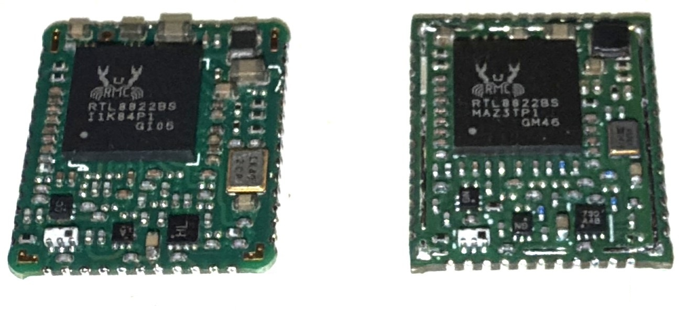

# RTL8822BS SDIO PCBA Testing

### Test SDIO Gear

|Test Board|SDIO Module HW|
|-|-|
|||

```
6.1.111-rt42

DISTRIB_ID=Ubuntu
DISTRIB_RELEASE=20.04
DISTRIB_CODENAME=focal
DISTRIB_DESCRIPTION="Ubuntu 20.04.2 LTS"

Architecture:                         aarch64
CPU op-mode(s):                       32-bit, 64-bit
Byte Order:                           Little Endian
CPU(s):                               2
On-line CPU(s) list:                  0,1
Thread(s) per core:                   1
Core(s) per socket:                   2
Socket(s):                            1
Vendor ID:                            ARM
Model:                                0
Model name:                           Cortex-A35
Stepping:                             r1p0
BogoMIPS:                             66.66
Vulnerability Gather data sampling:   Not affected
Vulnerability Itlb multihit:          Not affected
Vulnerability L1tf:                   Not affected
Vulnerability Mds:                    Not affected
Vulnerability Meltdown:               Not affected
Vulnerability Mmio stale data:        Not affected
Vulnerability Reg file data sampling: Not affected
Vulnerability Retbleed:               Not affected
Vulnerability Spec rstack overflow:   Not affected
Vulnerability Spec store bypass:      Not affected
Vulnerability Spectre v1:             Mitigation; __user pointer sanitization
Vulnerability Spectre v2:             Not affected
Vulnerability Srbds:                  Not affected
Vulnerability Tsx async abort:        Not affected
Flags:                                fp asimd evtstrm aes pmull sha1 sha2 crc32 cpuid
```

### SDIO Tree

```
MMC_TYPE=SDIO
SDIO_ID=024C:B822
SDIO_REVISION=0.0
clock:		50000000 Hz
actual clock:	50000000 Hz
vdd:		21 (3.3 ~ 3.4 V)
bus mode:	2 (push-pull)
chip select:	0 (don't care)
power mode:	2 (on)
bus width:	2 (4 bits)
timing spec:	2 (sd high-speed)
signal voltage:	0 (3.30 V)
driver type:	0 (driver type B)
```

### Driver Load

The driver is loaded via "insmod"

```
Module                  Size  Used by
rtw_8822bs             16384  0
rtw_8822b             225280  1 rtw_8822bs
rtw_sdio               20480  1 rtw_8822bs
rtw_core              217088  2 rtw_sdio,rtw_8822b
```

### iw list

<details>

<summary>iw list</summary>

```
Wiphy phy0
	max # scan SSIDs: 4
	max scan IEs length: 2243 bytes
	max # sched scan SSIDs: 0
	max # match sets: 0
	Retry short limit: 7
	Retry long limit: 4
	Coverage class: 0 (up to 0m)
	Device supports T-DLS.
	Supported Ciphers:
		* WEP40 (00-0f-ac:1)
		* WEP104 (00-0f-ac:5)
		* TKIP (00-0f-ac:2)
		* CCMP-128 (00-0f-ac:4)
		* CCMP-256 (00-0f-ac:10)
		* GCMP-128 (00-0f-ac:8)
		* GCMP-256 (00-0f-ac:9)
		* CMAC (00-0f-ac:6)
		* CMAC-256 (00-0f-ac:13)
		* GMAC-128 (00-0f-ac:11)
		* GMAC-256 (00-0f-ac:12)
	Available Antennas: TX 0x3 RX 0x3
	Configured Antennas: TX 0x3 RX 0x3
	Supported interface modes:
		 * IBSS
		 * managed
		 * AP
		 * AP/VLAN
		 * monitor
		 * P2P-client
		 * P2P-GO
	Band 1:
		Capabilities: 0x196f
			RX LDPC
			HT20/HT40
			SM Power Save disabled
			RX HT20 SGI
			RX HT40 SGI
			RX STBC 1-stream
			Max AMSDU length: 7935 bytes
			DSSS/CCK HT40
		Maximum RX AMPDU length 65535 bytes (exponent: 0x003)
		Minimum RX AMPDU time spacing: 2 usec (0x04)
		HT Max RX data rate: 300 Mbps
		HT TX/RX MCS rate indexes supported: 0-15, 32
		Bitrates (non-HT):
			* 1.0 Mbps
			* 2.0 Mbps
			* 5.5 Mbps
			* 11.0 Mbps
			* 6.0 Mbps
			* 9.0 Mbps
			* 12.0 Mbps
			* 18.0 Mbps
			* 24.0 Mbps
			* 36.0 Mbps
			* 48.0 Mbps
			* 54.0 Mbps
		Frequencies:
			* 2412 MHz [1] (20.0 dBm)
			* 2417 MHz [2] (20.0 dBm)
			* 2422 MHz [3] (20.0 dBm)
			* 2427 MHz [4] (20.0 dBm)
			* 2432 MHz [5] (20.0 dBm)
			* 2437 MHz [6] (20.0 dBm)
			* 2442 MHz [7] (20.0 dBm)
			* 2447 MHz [8] (20.0 dBm)
			* 2452 MHz [9] (20.0 dBm)
			* 2457 MHz [10] (20.0 dBm)
			* 2462 MHz [11] (20.0 dBm)
			* 2467 MHz [12] (20.0 dBm) (no IR)
			* 2472 MHz [13] (20.0 dBm) (no IR)
			* 2484 MHz [14] (20.0 dBm) (no IR)
	Band 2:
		Capabilities: 0x196f
			RX LDPC
			HT20/HT40
			SM Power Save disabled
			RX HT20 SGI
			RX HT40 SGI
			RX STBC 1-stream
			Max AMSDU length: 7935 bytes
			DSSS/CCK HT40
		Maximum RX AMPDU length 65535 bytes (exponent: 0x003)
		Minimum RX AMPDU time spacing: 2 usec (0x04)
		HT Max RX data rate: 300 Mbps
		HT TX/RX MCS rate indexes supported: 0-15, 32
		VHT Capabilities (0x03d071b2):
			Max MPDU length: 11454
			Supported Channel Width: neither 160 nor 80+80
			RX LDPC
			short GI (80 MHz)
			TX STBC
			SU Beamformee
			MU Beamformee
			+HTC-VHT
		VHT RX MCS set:
			1 streams: MCS 0-9
			2 streams: MCS 0-9
			3 streams: not supported
			4 streams: not supported
			5 streams: not supported
			6 streams: not supported
			7 streams: not supported
			8 streams: not supported
		VHT RX highest supported: 780 Mbps
		VHT TX MCS set:
			1 streams: MCS 0-9
			2 streams: MCS 0-9
			3 streams: not supported
			4 streams: not supported
			5 streams: not supported
			6 streams: not supported
			7 streams: not supported
			8 streams: not supported
		VHT TX highest supported: 780 Mbps
		Bitrates (non-HT):
			* 6.0 Mbps
			* 9.0 Mbps
			* 12.0 Mbps
			* 18.0 Mbps
			* 24.0 Mbps
			* 36.0 Mbps
			* 48.0 Mbps
			* 54.0 Mbps
		Frequencies:
			* 5180 MHz [36] (20.0 dBm) (no IR)
			* 5200 MHz [40] (20.0 dBm) (no IR)
			* 5220 MHz [44] (20.0 dBm) (no IR)
			* 5240 MHz [48] (20.0 dBm) (no IR)
			* 5260 MHz [52] (20.0 dBm) (no IR, radar detection)
			* 5280 MHz [56] (20.0 dBm) (no IR, radar detection)
			* 5300 MHz [60] (20.0 dBm) (no IR, radar detection)
			* 5320 MHz [64] (20.0 dBm) (no IR, radar detection)
			* 5500 MHz [100] (20.0 dBm) (no IR, radar detection)
			* 5520 MHz [104] (20.0 dBm) (no IR, radar detection)
			* 5540 MHz [108] (20.0 dBm) (no IR, radar detection)
			* 5560 MHz [112] (20.0 dBm) (no IR, radar detection)
			* 5580 MHz [116] (20.0 dBm) (no IR, radar detection)
			* 5600 MHz [120] (20.0 dBm) (no IR, radar detection)
			* 5620 MHz [124] (20.0 dBm) (no IR, radar detection)
			* 5640 MHz [128] (20.0 dBm) (no IR, radar detection)
			* 5660 MHz [132] (20.0 dBm) (no IR, radar detection)
			* 5680 MHz [136] (20.0 dBm) (no IR, radar detection)
			* 5700 MHz [140] (20.0 dBm) (no IR, radar detection)
			* 5720 MHz [144] (20.0 dBm) (no IR, radar detection)
			* 5745 MHz [149] (20.0 dBm) (no IR)
			* 5765 MHz [153] (20.0 dBm) (no IR)
			* 5785 MHz [157] (20.0 dBm) (no IR)
			* 5805 MHz [161] (20.0 dBm) (no IR)
			* 5825 MHz [165] (20.0 dBm) (no IR)
	Supported commands:
		 * new_interface
		 * set_interface
		 * new_key
		 * start_ap
		 * new_station
		 * set_bss
		 * authenticate
		 * associate
		 * deauthenticate
		 * disassociate
		 * join_ibss
		 * remain_on_channel
		 * set_tx_bitrate_mask
		 * frame
		 * frame_wait_cancel
		 * set_wiphy_netns
		 * set_channel
		 * tdls_mgmt
		 * tdls_oper
		 * probe_client
		 * set_noack_map
		 * register_beacons
		 * start_p2p_device
		 * set_mcast_rate
		 * connect
		 * disconnect
		 * set_qos_map
		 * set_multicast_to_unicast
		 * Unknown command (140)
	software interface modes (can always be added):
		 * AP/VLAN
		 * monitor
	valid interface combinations:
		 * #{ managed } <= 1, #{ AP, P2P-client, P2P-GO } <= 1,
		   total <= 2, #channels <= 1
	HT Capability overrides:
		 * MCS: ff ff ff ff ff ff ff ff ff ff
		 * maximum A-MSDU length
		 * supported channel width
		 * short GI for 40 MHz
		 * max A-MPDU length exponent
		 * min MPDU start spacing
	Device supports TX status socket option.
	Device supports HT-IBSS.
	Device supports SAE with AUTHENTICATE command
	Device supports scan flush.
	Device supports per-vif TX power setting
	Driver supports full state transitions for AP/GO clients
	Driver supports a userspace MPM
	Device supports configuring vdev MAC-addr on create.
	Device supports randomizing MAC-addr in scans.
	max # scan plans: 1
	max scan plan interval: -1
	max scan plan iterations: 0
	Supported TX frame types:
		 * IBSS: 0x00 0x10 0x20 0x30 0x40 0x50 0x60 0x70 0x80 0x90 0xa0 0xb0 0xc0 0xd0 0xe0 0xf0
		 * managed: 0x00 0x10 0x20 0x30 0x40 0x50 0x60 0x70 0x80 0x90 0xa0 0xb0 0xc0 0xd0 0xe0 0xf0
		 * AP: 0x00 0x10 0x20 0x30 0x40 0x50 0x60 0x70 0x80 0x90 0xa0 0xb0 0xc0 0xd0 0xe0 0xf0
		 * AP/VLAN: 0x00 0x10 0x20 0x30 0x40 0x50 0x60 0x70 0x80 0x90 0xa0 0xb0 0xc0 0xd0 0xe0 0xf0
		 * mesh point: 0x00 0x10 0x20 0x30 0x40 0x50 0x60 0x70 0x80 0x90 0xa0 0xb0 0xc0 0xd0 0xe0 0xf0
		 * P2P-client: 0x00 0x10 0x20 0x30 0x40 0x50 0x60 0x70 0x80 0x90 0xa0 0xb0 0xc0 0xd0 0xe0 0xf0
		 * P2P-GO: 0x00 0x10 0x20 0x30 0x40 0x50 0x60 0x70 0x80 0x90 0xa0 0xb0 0xc0 0xd0 0xe0 0xf0
		 * P2P-device: 0x00 0x10 0x20 0x30 0x40 0x50 0x60 0x70 0x80 0x90 0xa0 0xb0 0xc0 0xd0 0xe0 0xf0
	Supported RX frame types:
		 * IBSS: 0x40 0xb0 0xc0 0xd0
		 * managed: 0x40 0xb0 0xd0
		 * AP: 0x00 0x20 0x40 0xa0 0xb0 0xc0 0xd0
		 * AP/VLAN: 0x00 0x20 0x40 0xa0 0xb0 0xc0 0xd0
		 * mesh point: 0xb0 0xc0 0xd0
		 * P2P-client: 0x40 0xd0
		 * P2P-GO: 0x00 0x20 0x40 0xa0 0xb0 0xc0 0xd0
		 * P2P-device: 0x40 0xd0
	Supported extended features:
		* [ RRM ]: RRM
		* [ SET_SCAN_DWELL ]: scan dwell setting
		* [ FILS_STA ]: STA FILS (Fast Initial Link Setup)
		* [ CONTROL_PORT_OVER_NL80211 ]: control port over nl80211
		* [ TXQS ]: FQ-CoDel-enabled intermediate TXQs
```

</details>

### Network Manager - Band 2.4

```
wlan0: flags=4163<UP,BROADCAST,RUNNING,MULTICAST>  mtu 1500
        inet 192.168.1.15  netmask 255.255.252.0  broadcast 192.168.3.255
        RX packets 10  bytes 1606 (1.6 KB)
        RX errors 0  dropped 0  overruns 0  frame 0
        TX packets 23  bytes 4196 (4.1 KB)
        TX errors 0  dropped 0 overruns 0  carrier 0  collisions 0
```

### iwconfig 2.4

```
wlan0     IEEE 802.11  ESSID:""  
          Mode:Managed  Frequency:2.412 GHz  Access Point:    
          Bit Rate=270 Mb/s   Tx-Power=20 dBm   
          Retry short limit:7   RTS thr:off   Fragment thr:off
          Encryption key:off
          Power Management:on
          Link Quality=55/70  Signal level=-55 dBm  
          Rx invalid nwid:0  Rx invalid crypt:0  Rx invalid frag:0
          Tx excessive retries:0  Invalid misc:0   Missed beacon:0

```

### Network Speed Test via Ookla - Band 2.4

```
Retrieving speedtest.net configuration...
Retrieving speedtest.net server list...
Selecting best server based on ping...
Testing download speed................................................................................
Download: 36.86 Mbit/s
Testing upload speed......................................................................................................
Upload: 36.31 Mbit/s
```

### Network Ping Tests - Band 2.4

#### DNS-Ping

```
PING 8.8.8.8 (8.8.8.8) 56(84) bytes of data.
64 bytes from 8.8.8.8: icmp_seq=1 ttl=118 time=37.0 ms
64 bytes from 8.8.8.8: icmp_seq=2 ttl=118 time=5.99 ms
64 bytes from 8.8.8.8: icmp_seq=3 ttl=118 time=4.96 ms
64 bytes from 8.8.8.8: icmp_seq=4 ttl=118 time=18.2 ms
64 bytes from 8.8.8.8: icmp_seq=5 ttl=118 time=4.32 ms
64 bytes from 8.8.8.8: icmp_seq=6 ttl=118 time=4.72 ms
64 bytes from 8.8.8.8: icmp_seq=7 ttl=118 time=6.34 ms
64 bytes from 8.8.8.8: icmp_seq=8 ttl=118 time=3.96 ms
64 bytes from 8.8.8.8: icmp_seq=9 ttl=118 time=5.22 ms
64 bytes from 8.8.8.8: icmp_seq=10 ttl=118 time=3.88 ms
64 bytes from 8.8.8.8: icmp_seq=11 ttl=118 time=13.4 ms
64 bytes from 8.8.8.8: icmp_seq=12 ttl=118 time=5.08 ms
64 bytes from 8.8.8.8: icmp_seq=13 ttl=118 time=33.7 ms
64 bytes from 8.8.8.8: icmp_seq=14 ttl=118 time=5.66 ms
64 bytes from 8.8.8.8: icmp_seq=15 ttl=118 time=5.87 ms
64 bytes from 8.8.8.8: icmp_seq=16 ttl=118 time=6.06 ms
64 bytes from 8.8.8.8: icmp_seq=17 ttl=118 time=4.36 ms
64 bytes from 8.8.8.8: icmp_seq=18 ttl=118 time=4.96 ms
64 bytes from 8.8.8.8: icmp_seq=19 ttl=118 time=4.17 ms
64 bytes from 8.8.8.8: icmp_seq=20 ttl=118 time=15.3 ms

--- 8.8.8.8 ping statistics ---
20 packets transmitted, 20 received, 0% packet loss, time 19025ms
rtt min/avg/max/mdev = 3.884/9.660/37.009/9.425 ms
```

#### Self-Ping 

```
PING 192.168.1.15 (192.168.1.15) 10000(10028) bytes of data.
10008 bytes from 192.168.1.15: icmp_seq=1 ttl=64 time=0.128 ms
10008 bytes from 192.168.1.15: icmp_seq=2 ttl=64 time=0.134 ms
10008 bytes from 192.168.1.15: icmp_seq=3 ttl=64 time=0.138 ms
10008 bytes from 192.168.1.15: icmp_seq=4 ttl=64 time=0.095 ms
10008 bytes from 192.168.1.15: icmp_seq=5 ttl=64 time=0.146 ms
10008 bytes from 192.168.1.15: icmp_seq=6 ttl=64 time=0.142 ms
10008 bytes from 192.168.1.15: icmp_seq=7 ttl=64 time=0.138 ms
10008 bytes from 192.168.1.15: icmp_seq=8 ttl=64 time=0.106 ms
10008 bytes from 192.168.1.15: icmp_seq=9 ttl=64 time=0.111 ms
10008 bytes from 192.168.1.15: icmp_seq=10 ttl=64 time=0.100 ms
10008 bytes from 192.168.1.15: icmp_seq=11 ttl=64 time=0.150 ms
10008 bytes from 192.168.1.15: icmp_seq=12 ttl=64 time=0.144 ms
10008 bytes from 192.168.1.15: icmp_seq=13 ttl=64 time=0.138 ms
10008 bytes from 192.168.1.15: icmp_seq=14 ttl=64 time=0.128 ms
10008 bytes from 192.168.1.15: icmp_seq=15 ttl=64 time=0.100 ms
10008 bytes from 192.168.1.15: icmp_seq=16 ttl=64 time=0.112 ms
10008 bytes from 192.168.1.15: icmp_seq=17 ttl=64 time=0.143 ms
10008 bytes from 192.168.1.15: icmp_seq=18 ttl=64 time=0.147 ms
10008 bytes from 192.168.1.15: icmp_seq=19 ttl=64 time=0.128 ms
10008 bytes from 192.168.1.15: icmp_seq=20 ttl=64 time=0.104 ms

--- 192.168.1.15 ping statistics ---
20 packets transmitted, 20 received, 0% packet loss, time 19462ms
rtt min/avg/max/mdev = 0.095/0.126/0.150/0.017 ms
```

### Server & Client Test via iperf3 (PC-Router-DUT)

<details>

<summary>iperf3</summary>

```
-----------------------------------------------------------
Server listening on 5201
-----------------------------------------------------------
Accepted connection from 192.168.1.3, port 59724
[  5] local 192.168.1.15 port 5201 connected to 192.168.1.3 port 59726
[ ID] Interval           Transfer     Bitrate         Retr  Cwnd
[  5]   0.00-1.00   sec  4.27 MBytes  35.8 Mbits/sec    0    138 KBytes       
[  5]   1.00-2.00   sec  3.86 MBytes  32.4 Mbits/sec   24    120 KBytes       
[  5]   2.00-3.00   sec  4.66 MBytes  39.1 Mbits/sec    0    130 KBytes       
[  5]   3.00-4.00   sec  4.35 MBytes  36.5 Mbits/sec    0    130 KBytes       
[  5]   4.00-5.00   sec  4.41 MBytes  37.0 Mbits/sec    0    130 KBytes       
[  5]   5.00-6.00   sec  4.41 MBytes  37.0 Mbits/sec    0    130 KBytes       
[  5]   6.00-7.00   sec  2.57 MBytes  21.6 Mbits/sec    2   94.1 KBytes       
[  5]   7.00-8.00   sec   690 KBytes  5.65 Mbits/sec    0   75.6 KBytes       
[  5]   8.00-9.00   sec  2.27 MBytes  19.0 Mbits/sec    0   88.4 KBytes       
[  5]   9.00-10.00  sec  2.76 MBytes  23.1 Mbits/sec    0    113 KBytes       
[  5]  10.00-11.00  sec  3.31 MBytes  27.8 Mbits/sec    0    130 KBytes       
[  5]  11.00-12.00  sec  2.82 MBytes  23.6 Mbits/sec    0    130 KBytes       
[  5]  12.00-13.00  sec  4.59 MBytes  38.5 Mbits/sec    0    130 KBytes       
[  5]  13.00-14.00  sec  3.98 MBytes  33.4 Mbits/sec    0    130 KBytes       
[  5]  14.00-15.00  sec  4.35 MBytes  36.5 Mbits/sec    0    130 KBytes       
[  5]  15.00-16.00  sec  4.47 MBytes  37.5 Mbits/sec    0    198 KBytes       
[  5]  16.00-17.00  sec  4.90 MBytes  41.1 Mbits/sec    0    255 KBytes       
[  5]  17.00-18.00  sec  4.96 MBytes  41.6 Mbits/sec    0    269 KBytes       
[  5]  18.00-19.00  sec  5.02 MBytes  42.1 Mbits/sec    0    269 KBytes       
[  5]  19.00-20.00  sec  3.86 MBytes  32.2 Mbits/sec    0    269 KBytes       
[  5]  20.00-21.00  sec  4.47 MBytes  37.7 Mbits/sec    0    269 KBytes       
[  5]  21.00-22.00  sec  4.47 MBytes  37.5 Mbits/sec    0    269 KBytes       
[  5]  22.00-23.00  sec  4.47 MBytes  37.5 Mbits/sec    0    269 KBytes       
[  5]  23.00-24.00  sec  4.53 MBytes  38.0 Mbits/sec    0    269 KBytes       
[  5]  24.00-25.00  sec  4.47 MBytes  37.5 Mbits/sec    0    269 KBytes       
[  5]  25.00-26.00  sec  3.98 MBytes  33.4 Mbits/sec    0    269 KBytes       
[  5]  26.00-27.00  sec  4.41 MBytes  37.0 Mbits/sec    0    269 KBytes       
[  5]  27.00-28.00  sec  4.41 MBytes  37.0 Mbits/sec    0    269 KBytes       
[  5]  28.00-29.00  sec  4.41 MBytes  37.0 Mbits/sec    0    269 KBytes       
[  5]  29.00-30.00  sec  3.92 MBytes  32.9 Mbits/sec    0    269 KBytes       
[  5]  30.00-30.08  sec   565 KBytes  60.4 Mbits/sec    0    269 KBytes       
- - - - - - - - - - - - - - - - - - - - - - - - -
[ ID] Interval           Transfer     Bitrate         Retr
[  5]   0.00-30.08  sec   121 MBytes  33.6 Mbits/sec   26             sender
-----------------------------------------------------------
Server listening on 5201
-----------------------------------------------------------
[  247.006068] rtw_core: loading out-of-tree module taints kernel.
[  247.832497] rtw_8822bs mmc1:0001:1: Firmware version 30.20.0, H2C version 14
```

</details>

### AP Test

#### hostapd.conf

Setup the configuration at /etc/hostapd/hostapd.conf

```
interface=wlan0
driver=nl80211
ieee80211n=1
hw_mode=g
channel=6
ssid=AP-TEST
wpa=2
wpa_passphrase=12345678
wpa_key_mgmt=WPA-PSK
rsn_pairwise=CCMP TKIP
wpa_pairwise=TKIP CCMP
```

#### hostapd.conf

```
start 192.168.175.2
end 192.168.175.254
interface wlan0
max_leases 234
opt router 192.168.175.1
```

#### Start AP Test

```
sudo hostapd /etc/hostapd/hostapd.conf -B
Using interface wlan0 with hwaddr and ssid "AP-NAME"
wlan0: interface state UNINITIALIZED->ENABLED
wlan0: AP-ENABLED
```

#### Server & Client Test via iperf3 (PC-DUT)

Unable to use AP, cannot connect!

<details>

<summary>iperf3</summary>

```
Wlan0 Not Ready.
Start AP @ WLAN0
Configuration file: /etc/hostapd/hostapd.conf
Using interface wlan0 with hwaddr 2c:73:60:ee:d7:1b and ssid "AP-TEST"
wlan0: interface state UNINITIALIZED->ENABLED
wlan0: AP-ENABLED 
-----------------------------------------------------------
Server listening on 5201
-----------------------------------------------------------
[  247.006068] rtw_core: loading out-of-tree module taints kernel.
[  247.832497] rtw_8822bs mmc1:0001:1: Firmware version 30.20.0, H2C version 14
[ 1662.131006] ------------[ cut here ]------------
[ 1662.131023] Have pending ack frames!
[ 1662.131095] WARNING: CPU: 1 PID: 2326 at net/mac80211/main.c:1506 ieee80211_free_ack_frame+0x4c/0x70
[ 1662.131148] Modules linked in: rtw_8822bs(O-) rtw_8822b(O) rtw_sdio(O) rtw_core(O)
[ 1662.131189] CPU: 1 PID: 2326 Comm: rmmod Tainted: G           O       6.1.111-rt42 #21
[ 1662.131204] Hardware name: Anlogic, DR1M90 FPSoc (DT)
[ 1662.131213] pstate: 40000005 (nZcv daif -PAN -UAO -TCO -DIT -SSBS BTYPE=--)
[ 1662.131227] pc : ieee80211_free_ack_frame+0x4c/0x70
[ 1662.131243] lr : ieee80211_free_ack_frame+0x4c/0x70
[ 1662.131257] sp : ffffff80000b7bc0
[ 1662.131264] x29: ffffff80000b7bc0 x28: ffffff80057c6a00 x27: 0000000000000000
[ 1662.131289] x26: 0000000000000000 x25: 0000000000000000 x24: ffffff8008bf1de8
[ 1662.131313] x23: ffffffc008a31bd8 x22: 0000000000000000 x21: 000000007fffffff
[ 1662.131337] x20: 0000000000000000 x19: ffffff800c487b90 x18: ffffffc008fc7f08
[ 1662.131362] x17: 000000007f0c1106 x16: 00000000d198eb2e x15: fffffffffffc0000
[ 1662.131386] x14: ffffffc008fc7ed8 x13: 0a2173656d617266 x12: 206b636120676e69
[ 1662.131411] x11: 656820747563205b x10: 2d2d2d2d2d2d2d2d x9 : ffffff80000b7bc0
[ 1662.131435] x8 : ffffffc008fc7ed8 x7 : ffffff80000b79f0 x6 : ffffffc009077f30
[ 1662.131459] x5 : ffffff801feb5958 x4 : 0000000000000000 x3 : 0000000000000027
[ 1662.131483] x2 : 0000000000000023 x1 : ffffff80057c6a00 x0 : 0000000100000000
[ 1662.131508] Call trace:
[ 1662.131515]  ieee80211_free_ack_frame+0x4c/0x70
[ 1662.131532]  idr_for_each+0x5c/0xe0
[ 1662.131548]  ieee80211_free_hw+0x38/0xa0
[ 1662.131563]  rtw_sdio_remove+0x98/0xb0 [rtw_sdio]
[ 1662.131591]  sdio_bus_remove+0x3c/0x180
[ 1662.131607]  device_remove+0x4c/0x80
[ 1662.131625]  device_release_driver_internal+0xe0/0x188
[ 1662.131642]  driver_detach+0x50/0x98
[ 1662.131658]  bus_remove_driver+0x58/0xb8
[ 1662.131674]  driver_unregister+0x30/0x60
[ 1662.131691]  sdio_unregister_driver+0x24/0x30
[ 1662.131705]  rtw_8822bs_driver_exit+0x18/0x1000 [rtw_8822bs]
[ 1662.131727]  __arm64_sys_delete_module+0x170/0x270
[ 1662.131743]  invoke_syscall+0x44/0x108
[ 1662.131760]  el0_svc_common.constprop.3+0x6c/0xf0
[ 1662.131776]  do_el0_svc+0x2c/0xc8
[ 1662.131791]  el0_svc+0x20/0x60
[ 1662.131808]  el0t_64_sync_handler+0x98/0xc0
[ 1662.131824]  el0t_64_sync+0x170/0x174
[ 1662.131838] ---[ end trace 0000000000000000 ]---
```

</details>

### End of Report
