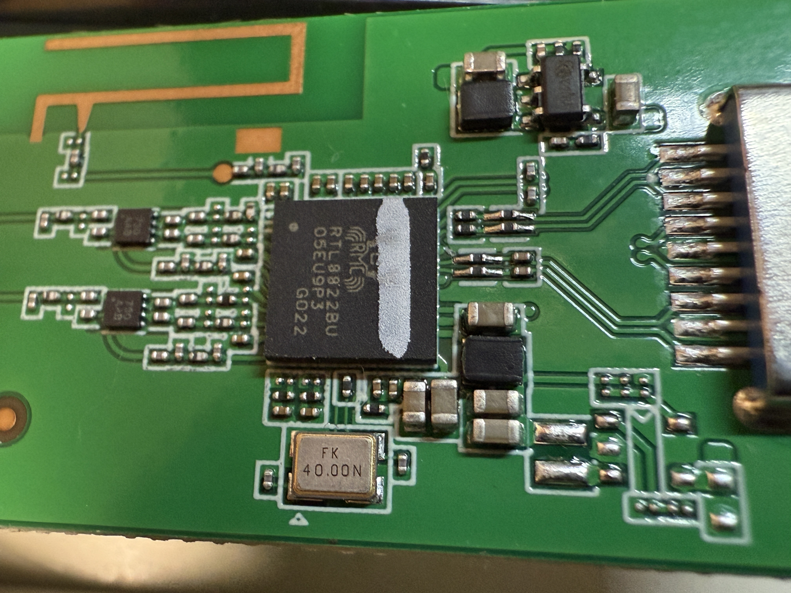

# RTL8822BU USB Dongle Testing

### Test USB Gear

|Test Board|USB Dongle HW|
|-|-|
|||

```
6.1.111-rt42

DISTRIB_ID=Ubuntu
DISTRIB_RELEASE=20.04
DISTRIB_CODENAME=focal
DISTRIB_DESCRIPTION="Ubuntu 20.04.2 LTS"

Architecture:                         aarch64
CPU op-mode(s):                       32-bit, 64-bit
Byte Order:                           Little Endian
CPU(s):                               2
On-line CPU(s) list:                  0,1
Thread(s) per core:                   1
Core(s) per socket:                   2
Socket(s):                            1
Vendor ID:                            ARM
Model:                                0
Model name:                           Cortex-A35
Stepping:                             r1p0
BogoMIPS:                             66.66
Vulnerability Gather data sampling:   Not affected
Vulnerability Itlb multihit:          Not affected
Vulnerability L1tf:                   Not affected
Vulnerability Mds:                    Not affected
Vulnerability Meltdown:               Not affected
Vulnerability Mmio stale data:        Not affected
Vulnerability Reg file data sampling: Not affected
Vulnerability Retbleed:               Not affected
Vulnerability Spec rstack overflow:   Not affected
Vulnerability Spec store bypass:      Not affected
Vulnerability Spectre v1:             Mitigation; __user pointer sanitization
Vulnerability Spectre v2:             Not affected
Vulnerability Srbds:                  Not affected
Vulnerability Tsx async abort:        Not affected
Flags:                                fp asimd evtstrm aes pmull sha1 sha2 crc32 cpuid
```

### USB Tree

```
Before driver is inserted.
/:  Bus 01.Port 1: Dev 1, Class=root_hub, Driver=dwc2/1p, 480M
    |__ Port 1: Dev 3, If 0, Class=Wireless, Driver=btusb, 480M
    |__ Port 1: Dev 3, If 1, Class=Wireless, Driver=btusb, 480M
    |__ Port 1: Dev 3, If 2, Class=Vendor Specific Class, Driver=, 480M

After driver is inserted.
/:  Bus 01.Port 1: Dev 1, Class=root_hub, Driver=dwc2/1p, 480M
    |__ Port 1: Dev 3, If 0, Class=Wireless, Driver=btusb, 480M
    |__ Port 1: Dev 3, If 1, Class=Wireless, Driver=btusb, 480M
    |__ Port 1: Dev 3, If 2, Class=Vendor Specific Class, Driver=rtw_8822bu, 480M
```

<details>

<summary>USB Details</summary>

```

Bus 001 Device 003: ID 0bda:b82c Realtek Semiconductor Corp. 802.11ac NIC
Device Descriptor:
  bLength                18
  bDescriptorType         1
  bcdUSB               2.10
  bDeviceClass          239 Miscellaneous Device
  bDeviceSubClass         2 
  bDeviceProtocol         1 Interface Association
  bMaxPacketSize0        64
  idVendor           0x0bda Realtek Semiconductor Corp.
  idProduct          0xb82c 
  bcdDevice            2.10
  iManufacturer           1 Realtek
  iProduct                2 802.11ac NIC
  iSerial                 3 123456
  bNumConfigurations      1
  Configuration Descriptor:
    bLength                 9
    bDescriptorType         2
    wTotalLength       0x00e5
    bNumInterfaces          3
    bConfigurationValue     1
    iConfiguration          0 
    bmAttributes         0x80
      (Bus Powered)
    MaxPower              500mA
    Interface Association:
      bLength                 8
      bDescriptorType        11
      bFirstInterface         0
      bInterfaceCount         2
      bFunctionClass        224 Wireless
      bFunctionSubClass       1 Radio Frequency
      bFunctionProtocol       1 Bluetooth
      iFunction               4 Bluetooth Radio
    Interface Descriptor:
      bLength                 9
      bDescriptorType         4
      bInterfaceNumber        0
      bAlternateSetting       0
      bNumEndpoints           3
      bInterfaceClass       224 Wireless
      bInterfaceSubClass      1 Radio Frequency
      bInterfaceProtocol      1 Bluetooth
      iInterface              4 Bluetooth Radio
      Endpoint Descriptor:
        bLength                 7
        bDescriptorType         5
        bEndpointAddress     0x81  EP 1 IN
        bmAttributes            3
          Transfer Type            Interrupt
          Synch Type               None
          Usage Type               Data
        wMaxPacketSize     0x0010  1x 16 bytes
        bInterval               4
      Endpoint Descriptor:
        bLength                 7
        bDescriptorType         5
        bEndpointAddress     0x02  EP 2 OUT
        bmAttributes            2
          Transfer Type            Bulk
          Synch Type               None
          Usage Type               Data
        wMaxPacketSize     0x0200  1x 512 bytes
        bInterval               0
      Endpoint Descriptor:
        bLength                 7
        bDescriptorType         5
        bEndpointAddress     0x82  EP 2 IN
        bmAttributes            2
          Transfer Type            Bulk
          Synch Type               None
          Usage Type               Data
        wMaxPacketSize     0x0200  1x 512 bytes
        bInterval               0
    Interface Descriptor:
      bLength                 9
      bDescriptorType         4
      bInterfaceNumber        1
      bAlternateSetting       0
      bNumEndpoints           2
      bInterfaceClass       224 Wireless
      bInterfaceSubClass      1 Radio Frequency
      bInterfaceProtocol      1 Bluetooth
      iInterface              4 Bluetooth Radio
      Endpoint Descriptor:
        bLength                 7
        bDescriptorType         5
        bEndpointAddress     0x03  EP 3 OUT
        bmAttributes            1
          Transfer Type            Isochronous
          Synch Type               None
          Usage Type               Data
        wMaxPacketSize     0x0000  1x 0 bytes
        bInterval               4
      Endpoint Descriptor:
        bLength                 7
        bDescriptorType         5
        bEndpointAddress     0x83  EP 3 IN
        bmAttributes            1
          Transfer Type            Isochronous
          Synch Type               None
          Usage Type               Data
        wMaxPacketSize     0x0000  1x 0 bytes
        bInterval               4
    Interface Descriptor:
      bLength                 9
      bDescriptorType         4
      bInterfaceNumber        1
      bAlternateSetting       1
      bNumEndpoints           2
      bInterfaceClass       224 Wireless
      bInterfaceSubClass      1 Radio Frequency
      bInterfaceProtocol      1 Bluetooth
      iInterface              4 Bluetooth Radio
      Endpoint Descriptor:
        bLength                 7
        bDescriptorType         5
        bEndpointAddress     0x03  EP 3 OUT
        bmAttributes            1
          Transfer Type            Isochronous
          Synch Type               None
          Usage Type               Data
        wMaxPacketSize     0x0009  1x 9 bytes
        bInterval               4
      Endpoint Descriptor:
        bLength                 7
        bDescriptorType         5
        bEndpointAddress     0x83  EP 3 IN
        bmAttributes            1
          Transfer Type            Isochronous
          Synch Type               None
          Usage Type               Data
        wMaxPacketSize     0x0009  1x 9 bytes
        bInterval               4
    Interface Descriptor:
      bLength                 9
      bDescriptorType         4
      bInterfaceNumber        1
      bAlternateSetting       2
      bNumEndpoints           2
      bInterfaceClass       224 Wireless
      bInterfaceSubClass      1 Radio Frequency
      bInterfaceProtocol      1 Bluetooth
      iInterface              4 Bluetooth Radio
      Endpoint Descriptor:
        bLength                 7
        bDescriptorType         5
        bEndpointAddress     0x03  EP 3 OUT
        bmAttributes            1
          Transfer Type            Isochronous
          Synch Type               None
          Usage Type               Data
        wMaxPacketSize     0x0011  1x 17 bytes
        bInterval               4
      Endpoint Descriptor:
        bLength                 7
        bDescriptorType         5
        bEndpointAddress     0x83  EP 3 IN
        bmAttributes            1
          Transfer Type            Isochronous
          Synch Type               None
          Usage Type               Data
        wMaxPacketSize     0x0011  1x 17 bytes
        bInterval               4
    Interface Descriptor:
      bLength                 9
      bDescriptorType         4
      bInterfaceNumber        1
      bAlternateSetting       3
      bNumEndpoints           2
      bInterfaceClass       224 Wireless
      bInterfaceSubClass      1 Radio Frequency
      bInterfaceProtocol      1 Bluetooth
      iInterface              4 Bluetooth Radio
      Endpoint Descriptor:
        bLength                 7
        bDescriptorType         5
        bEndpointAddress     0x03  EP 3 OUT
        bmAttributes            1
          Transfer Type            Isochronous
          Synch Type               None
          Usage Type               Data
        wMaxPacketSize     0x0019  1x 25 bytes
        bInterval               4
      Endpoint Descriptor:
        bLength                 7
        bDescriptorType         5
        bEndpointAddress     0x83  EP 3 IN
        bmAttributes            1
          Transfer Type            Isochronous
          Synch Type               None
          Usage Type               Data
        wMaxPacketSize     0x0019  1x 25 bytes
        bInterval               4
    Interface Descriptor:
      bLength                 9
      bDescriptorType         4
      bInterfaceNumber        1
      bAlternateSetting       4
      bNumEndpoints           2
      bInterfaceClass       224 Wireless
      bInterfaceSubClass      1 Radio Frequency
      bInterfaceProtocol      1 Bluetooth
      iInterface              4 Bluetooth Radio
      Endpoint Descriptor:
        bLength                 7
        bDescriptorType         5
        bEndpointAddress     0x03  EP 3 OUT
        bmAttributes            1
          Transfer Type            Isochronous
          Synch Type               None
          Usage Type               Data
        wMaxPacketSize     0x0021  1x 33 bytes
        bInterval               4
      Endpoint Descriptor:
        bLength                 7
        bDescriptorType         5
        bEndpointAddress     0x83  EP 3 IN
        bmAttributes            1
          Transfer Type            Isochronous
          Synch Type               None
          Usage Type               Data
        wMaxPacketSize     0x0021  1x 33 bytes
        bInterval               4
    Interface Descriptor:
      bLength                 9
      bDescriptorType         4
      bInterfaceNumber        1
      bAlternateSetting       5
      bNumEndpoints           2
      bInterfaceClass       224 Wireless
      bInterfaceSubClass      1 Radio Frequency
      bInterfaceProtocol      1 Bluetooth
      iInterface              4 Bluetooth Radio
      Endpoint Descriptor:
        bLength                 7
        bDescriptorType         5
        bEndpointAddress     0x03  EP 3 OUT
        bmAttributes            1
          Transfer Type            Isochronous
          Synch Type               None
          Usage Type               Data
        wMaxPacketSize     0x0031  1x 49 bytes
        bInterval               4
      Endpoint Descriptor:
        bLength                 7
        bDescriptorType         5
        bEndpointAddress     0x83  EP 3 IN
        bmAttributes            1
          Transfer Type            Isochronous
          Synch Type               None
          Usage Type               Data
        wMaxPacketSize     0x0031  1x 49 bytes
        bInterval               4
    Interface Descriptor:
      bLength                 9
      bDescriptorType         4
      bInterfaceNumber        2
      bAlternateSetting       0
      bNumEndpoints           5
      bInterfaceClass       255 Vendor Specific Class
      bInterfaceSubClass    255 Vendor Specific Subclass
      bInterfaceProtocol    255 Vendor Specific Protocol
      iInterface              2 802.11ac NIC
      Endpoint Descriptor:
        bLength                 7
        bDescriptorType         5
        bEndpointAddress     0x84  EP 4 IN
        bmAttributes            2
          Transfer Type            Bulk
          Synch Type               None
          Usage Type               Data
        wMaxPacketSize     0x0200  1x 512 bytes
        bInterval               0
      Endpoint Descriptor:
        bLength                 7
        bDescriptorType         5
        bEndpointAddress     0x05  EP 5 OUT
        bmAttributes            2
          Transfer Type            Bulk
          Synch Type               None
          Usage Type               Data
        wMaxPacketSize     0x0200  1x 512 bytes
        bInterval               0
      Endpoint Descriptor:
        bLength                 7
        bDescriptorType         5
        bEndpointAddress     0x06  EP 6 OUT
        bmAttributes            2
          Transfer Type            Bulk
          Synch Type               None
          Usage Type               Data
        wMaxPacketSize     0x0200  1x 512 bytes
        bInterval               0
      Endpoint Descriptor:
        bLength                 7
        bDescriptorType         5
        bEndpointAddress     0x87  EP 7 IN
        bmAttributes            3
          Transfer Type            Interrupt
          Synch Type               None
          Usage Type               Data
        wMaxPacketSize     0x0040  1x 64 bytes
        bInterval               3
      Endpoint Descriptor:
        bLength                 7
        bDescriptorType         5
        bEndpointAddress     0x08  EP 8 OUT
        bmAttributes            2
          Transfer Type            Bulk
          Synch Type               None
          Usage Type               Data
        wMaxPacketSize     0x0200  1x 512 bytes
        bInterval               0
Binary Object Store Descriptor:
  bLength                 5
  bDescriptorType        15
  wTotalLength       0x0016
  bNumDeviceCaps          2
  USB 2.0 Extension Device Capability:
    bLength                 7
    bDescriptorType        16
    bDevCapabilityType      2
    bmAttributes   0x00000002
      HIRD Link Power Management (LPM) Supported
  SuperSpeed USB Device Capability:
    bLength                10
    bDescriptorType        16
    bDevCapabilityType      3
    bmAttributes         0x00
    wSpeedsSupported   0x0006
      Device can operate at Full Speed (12Mbps)
      Device can operate at High Speed (480Mbps)
    bFunctionalitySupport   1
      Lowest fully-functional device speed is Full Speed (12Mbps)
    bU1DevExitLat          10 micro seconds
    bU2DevExitLat        1023 micro seconds
Device Status:     0x0000
  (Bus Powered)
```

</details>

### Driver Load

The driver is loaded via "insmod"

```
Module                  Size  Used by
rtw_8822bu             16384  0
rtw_8822b             225280  1 rtw_8822bu
rtw_usb                24576  1 rtw_8822bu
rtw_core              217088  2 rtw_usb,rtw_8822b
```

### iw list

<details>

<summary>iw list</summary>

```
Wiphy phy3
	max # scan SSIDs: 4
	max scan IEs length: 2243 bytes
	max # sched scan SSIDs: 0
	max # match sets: 0
	Retry short limit: 7
	Retry long limit: 4
	Coverage class: 0 (up to 0m)
	Device supports T-DLS.
	Supported Ciphers:
		* WEP40 (00-0f-ac:1)
		* WEP104 (00-0f-ac:5)
		* TKIP (00-0f-ac:2)
		* CCMP-128 (00-0f-ac:4)
		* CCMP-256 (00-0f-ac:10)
		* GCMP-128 (00-0f-ac:8)
		* GCMP-256 (00-0f-ac:9)
		* CMAC (00-0f-ac:6)
		* CMAC-256 (00-0f-ac:13)
		* GMAC-128 (00-0f-ac:11)
		* GMAC-256 (00-0f-ac:12)
	Available Antennas: TX 0x3 RX 0x3
	Configured Antennas: TX 0x3 RX 0x3
	Supported interface modes:
		 * IBSS
		 * managed
		 * AP
		 * AP/VLAN
		 * monitor
		 * P2P-client
		 * P2P-GO
	Band 1:
		Capabilities: 0x196f
			RX LDPC
			HT20/HT40
			SM Power Save disabled
			RX HT20 SGI
			RX HT40 SGI
			RX STBC 1-stream
			Max AMSDU length: 7935 bytes
			DSSS/CCK HT40
		Maximum RX AMPDU length 65535 bytes (exponent: 0x003)
		Minimum RX AMPDU time spacing: 2 usec (0x04)
		HT Max RX data rate: 300 Mbps
		HT TX/RX MCS rate indexes supported: 0-15, 32
		Bitrates (non-HT):
			* 1.0 Mbps
			* 2.0 Mbps
			* 5.5 Mbps
			* 11.0 Mbps
			* 6.0 Mbps
			* 9.0 Mbps
			* 12.0 Mbps
			* 18.0 Mbps
			* 24.0 Mbps
			* 36.0 Mbps
			* 48.0 Mbps
			* 54.0 Mbps
		Frequencies:
			* 2412 MHz [1] (20.0 dBm)
			* 2417 MHz [2] (20.0 dBm)
			* 2422 MHz [3] (20.0 dBm)
			* 2427 MHz [4] (20.0 dBm)
			* 2432 MHz [5] (20.0 dBm)
			* 2437 MHz [6] (20.0 dBm)
			* 2442 MHz [7] (20.0 dBm)
			* 2447 MHz [8] (20.0 dBm)
			* 2452 MHz [9] (20.0 dBm)
			* 2457 MHz [10] (20.0 dBm)
			* 2462 MHz [11] (20.0 dBm)
			* 2467 MHz [12] (20.0 dBm)
			* 2472 MHz [13] (20.0 dBm)
			* 2484 MHz [14] (disabled)
	Band 2:
		Capabilities: 0x196f
			RX LDPC
			HT20/HT40
			SM Power Save disabled
			RX HT20 SGI
			RX HT40 SGI
			RX STBC 1-stream
			Max AMSDU length: 7935 bytes
			DSSS/CCK HT40
		Maximum RX AMPDU length 65535 bytes (exponent: 0x003)
		Minimum RX AMPDU time spacing: 2 usec (0x04)
		HT Max RX data rate: 300 Mbps
		HT TX/RX MCS rate indexes supported: 0-15, 32
		VHT Capabilities (0x03d071b2):
			Max MPDU length: 11454
			Supported Channel Width: neither 160 nor 80+80
			RX LDPC
			short GI (80 MHz)
			TX STBC
			SU Beamformee
			MU Beamformee
			+HTC-VHT
		VHT RX MCS set:
			1 streams: MCS 0-9
			2 streams: MCS 0-9
			3 streams: not supported
			4 streams: not supported
			5 streams: not supported
			6 streams: not supported
			7 streams: not supported
			8 streams: not supported
		VHT RX highest supported: 780 Mbps
		VHT TX MCS set:
			1 streams: MCS 0-9
			2 streams: MCS 0-9
			3 streams: not supported
			4 streams: not supported
			5 streams: not supported
			6 streams: not supported
			7 streams: not supported
			8 streams: not supported
		VHT TX highest supported: 780 Mbps
		Bitrates (non-HT):
			* 6.0 Mbps
			* 9.0 Mbps
			* 12.0 Mbps
			* 18.0 Mbps
			* 24.0 Mbps
			* 36.0 Mbps
			* 48.0 Mbps
			* 54.0 Mbps
		Frequencies:
			* 5180 MHz [36] (23.0 dBm)
			* 5200 MHz [40] (23.0 dBm)
			* 5220 MHz [44] (23.0 dBm)
			* 5240 MHz [48] (23.0 dBm)
			* 5260 MHz [52] (20.0 dBm) (radar detection)
			* 5280 MHz [56] (20.0 dBm) (radar detection)
			* 5300 MHz [60] (20.0 dBm) (radar detection)
			* 5320 MHz [64] (20.0 dBm) (radar detection)
			* 5500 MHz [100] (26.0 dBm) (radar detection)
			* 5520 MHz [104] (26.0 dBm) (radar detection)
			* 5540 MHz [108] (26.0 dBm) (radar detection)
			* 5560 MHz [112] (26.0 dBm) (radar detection)
			* 5580 MHz [116] (26.0 dBm) (radar detection)
			* 5600 MHz [120] (26.0 dBm) (radar detection)
			* 5620 MHz [124] (26.0 dBm) (radar detection)
			* 5640 MHz [128] (26.0 dBm) (radar detection)
			* 5660 MHz [132] (26.0 dBm) (radar detection)
			* 5680 MHz [136] (26.0 dBm) (radar detection)
			* 5700 MHz [140] (26.0 dBm) (radar detection)
			* 5720 MHz [144] (13.0 dBm) (radar detection)
			* 5745 MHz [149] (13.0 dBm)
			* 5765 MHz [153] (13.0 dBm)
			* 5785 MHz [157] (13.0 dBm)
			* 5805 MHz [161] (13.0 dBm)
			* 5825 MHz [165] (13.0 dBm)
	Supported commands:
		 * new_interface
		 * set_interface
		 * new_key
		 * start_ap
		 * new_station
		 * set_bss
		 * authenticate
		 * associate
		 * deauthenticate
		 * disassociate
		 * join_ibss
		 * remain_on_channel
		 * set_tx_bitrate_mask
		 * frame
		 * frame_wait_cancel
		 * set_wiphy_netns
		 * set_channel
		 * tdls_mgmt
		 * tdls_oper
		 * probe_client
		 * set_noack_map
		 * register_beacons
		 * start_p2p_device
		 * set_mcast_rate
		 * connect
		 * disconnect
		 * set_qos_map
		 * set_multicast_to_unicast
		 * Unknown command (140)
	software interface modes (can always be added):
		 * AP/VLAN
		 * monitor
	valid interface combinations:
		 * #{ managed } <= 1, #{ AP, P2P-client, P2P-GO } <= 1,
		   total <= 2, #channels <= 1
	HT Capability overrides:
		 * MCS: ff ff ff ff ff ff ff ff ff ff
		 * maximum A-MSDU length
		 * supported channel width
		 * short GI for 40 MHz
		 * max A-MPDU length exponent
		 * min MPDU start spacing
	Device supports TX status socket option.
	Device supports HT-IBSS.
	Device supports SAE with AUTHENTICATE command
	Device supports scan flush.
	Device supports per-vif TX power setting
	Driver supports full state transitions for AP/GO clients
	Driver supports a userspace MPM
	Device supports configuring vdev MAC-addr on create.
	Device supports randomizing MAC-addr in scans.
	max # scan plans: 1
	max scan plan interval: -1
	max scan plan iterations: 0
	Supported TX frame types:
		 * IBSS: 0x00 0x10 0x20 0x30 0x40 0x50 0x60 0x70 0x80 0x90 0xa0 0xb0 0xc0 0xd0 0xe0 0xf0
		 * managed: 0x00 0x10 0x20 0x30 0x40 0x50 0x60 0x70 0x80 0x90 0xa0 0xb0 0xc0 0xd0 0xe0 0xf0
		 * AP: 0x00 0x10 0x20 0x30 0x40 0x50 0x60 0x70 0x80 0x90 0xa0 0xb0 0xc0 0xd0 0xe0 0xf0
		 * AP/VLAN: 0x00 0x10 0x20 0x30 0x40 0x50 0x60 0x70 0x80 0x90 0xa0 0xb0 0xc0 0xd0 0xe0 0xf0
		 * mesh point: 0x00 0x10 0x20 0x30 0x40 0x50 0x60 0x70 0x80 0x90 0xa0 0xb0 0xc0 0xd0 0xe0 0xf0
		 * P2P-client: 0x00 0x10 0x20 0x30 0x40 0x50 0x60 0x70 0x80 0x90 0xa0 0xb0 0xc0 0xd0 0xe0 0xf0
		 * P2P-GO: 0x00 0x10 0x20 0x30 0x40 0x50 0x60 0x70 0x80 0x90 0xa0 0xb0 0xc0 0xd0 0xe0 0xf0
		 * P2P-device: 0x00 0x10 0x20 0x30 0x40 0x50 0x60 0x70 0x80 0x90 0xa0 0xb0 0xc0 0xd0 0xe0 0xf0
	Supported RX frame types:
		 * IBSS: 0x40 0xb0 0xc0 0xd0
		 * managed: 0x40 0xb0 0xd0
		 * AP: 0x00 0x20 0x40 0xa0 0xb0 0xc0 0xd0
		 * AP/VLAN: 0x00 0x20 0x40 0xa0 0xb0 0xc0 0xd0
		 * mesh point: 0xb0 0xc0 0xd0
		 * P2P-client: 0x40 0xd0
		 * P2P-GO: 0x00 0x20 0x40 0xa0 0xb0 0xc0 0xd0
		 * P2P-device: 0x40 0xd0
	Supported extended features:
		* [ RRM ]: RRM
		* [ SET_SCAN_DWELL ]: scan dwell setting
		* [ FILS_STA ]: STA FILS (Fast Initial Link Setup)
		* [ CONTROL_PORT_OVER_NL80211 ]: control port over nl80211
		* [ TXQS ]: FQ-CoDel-enabled intermediate TXQs
```

</details>

### Network Manager - Band 2.4

```
wlan0: flags=4163<UP,BROADCAST,RUNNING,MULTICAST>  mtu 1500
        inet 192.168.1.7  netmask 255.255.252.0  broadcast 192.168.3.255
        RX packets 10  bytes 1463 (1.4 KB)
        RX errors 0  dropped 0  overruns 0  frame 0
        TX packets 23  bytes 4030 (4.0 KB)
        TX errors 0  dropped 0 overruns 0  carrier 0  collisions 0
```

### iwconfig 2.4

```
wlan0     IEEE 802.11  ESSID:""  
          Mode:Managed  Frequency:2.412 GHz  Access Point: 
          Bit Rate=216 Mb/s   Tx-Power=20 dBm   
          Retry short limit:7   RTS thr:off   Fragment thr:off
          Encryption key:off
          Power Management:on
          Link Quality=65/70  Signal level=-45 dBm  
          Rx invalid nwid:0  Rx invalid crypt:0  Rx invalid frag:0
          Tx excessive retries:0  Invalid misc:0   Missed beacon:0

```

### Network Speed Test via Ookla - Band 2.4

```
Retrieving speedtest.net configuration...
Retrieving speedtest.net server list...
Selecting best server based on ping...
Testing download speed................................................................................
Download: 57.24 Mbit/s
Testing upload speed......................................................................................................
Upload: 87.78 Mbit/s
```

### Network Ping Tests - Band 2.4

#### DNS-Ping

```
PING 8.8.8.8 (8.8.8.8) 56(84) bytes of data.
64 bytes from 8.8.8.8: icmp_seq=1 ttl=118 time=68.9 ms
64 bytes from 8.8.8.8: icmp_seq=2 ttl=118 time=5.02 ms
64 bytes from 8.8.8.8: icmp_seq=3 ttl=118 time=6.19 ms
64 bytes from 8.8.8.8: icmp_seq=4 ttl=118 time=6.14 ms
64 bytes from 8.8.8.8: icmp_seq=5 ttl=118 time=5.99 ms
64 bytes from 8.8.8.8: icmp_seq=6 ttl=118 time=6.37 ms
64 bytes from 8.8.8.8: icmp_seq=7 ttl=118 time=4.86 ms
64 bytes from 8.8.8.8: icmp_seq=8 ttl=118 time=5.41 ms
64 bytes from 8.8.8.8: icmp_seq=9 ttl=118 time=3.98 ms
64 bytes from 8.8.8.8: icmp_seq=10 ttl=118 time=4.67 ms
64 bytes from 8.8.8.8: icmp_seq=11 ttl=118 time=3.93 ms
64 bytes from 8.8.8.8: icmp_seq=12 ttl=118 time=5.55 ms
64 bytes from 8.8.8.8: icmp_seq=13 ttl=118 time=5.78 ms
64 bytes from 8.8.8.8: icmp_seq=14 ttl=118 time=4.20 ms
64 bytes from 8.8.8.8: icmp_seq=15 ttl=118 time=10.8 ms
64 bytes from 8.8.8.8: icmp_seq=16 ttl=118 time=4.32 ms
64 bytes from 8.8.8.8: icmp_seq=17 ttl=118 time=3.94 ms
64 bytes from 8.8.8.8: icmp_seq=18 ttl=118 time=5.60 ms
64 bytes from 8.8.8.8: icmp_seq=19 ttl=118 time=10.8 ms
64 bytes from 8.8.8.8: icmp_seq=20 ttl=118 time=4.09 ms

--- 8.8.8.8 ping statistics ---
20 packets transmitted, 20 received, 0% packet loss, time 19028ms
rtt min/avg/max/mdev = 3.925/8.823/68.860/13.901 ms
```

#### Self-Ping 

```
PING 192.168.1.7 (192.168.1.7) 10000(10028) bytes of data.
10008 bytes from 192.168.1.7: icmp_seq=1 ttl=64 time=0.128 ms
10008 bytes from 192.168.1.7: icmp_seq=2 ttl=64 time=0.107 ms
10008 bytes from 192.168.1.7: icmp_seq=3 ttl=64 time=0.138 ms
10008 bytes from 192.168.1.7: icmp_seq=4 ttl=64 time=0.098 ms
10008 bytes from 192.168.1.7: icmp_seq=5 ttl=64 time=0.140 ms
10008 bytes from 192.168.1.7: icmp_seq=6 ttl=64 time=0.140 ms
10008 bytes from 192.168.1.7: icmp_seq=7 ttl=64 time=0.105 ms
10008 bytes from 192.168.1.7: icmp_seq=8 ttl=64 time=0.115 ms
10008 bytes from 192.168.1.7: icmp_seq=9 ttl=64 time=0.139 ms
10008 bytes from 192.168.1.7: icmp_seq=10 ttl=64 time=0.104 ms
10008 bytes from 192.168.1.7: icmp_seq=11 ttl=64 time=0.143 ms
10008 bytes from 192.168.1.7: icmp_seq=12 ttl=64 time=0.144 ms
10008 bytes from 192.168.1.7: icmp_seq=13 ttl=64 time=0.135 ms
10008 bytes from 192.168.1.7: icmp_seq=14 ttl=64 time=0.096 ms
10008 bytes from 192.168.1.7: icmp_seq=15 ttl=64 time=0.119 ms
10008 bytes from 192.168.1.7: icmp_seq=16 ttl=64 time=0.109 ms
10008 bytes from 192.168.1.7: icmp_seq=17 ttl=64 time=0.143 ms
10008 bytes from 192.168.1.7: icmp_seq=18 ttl=64 time=0.139 ms
10008 bytes from 192.168.1.7: icmp_seq=19 ttl=64 time=0.104 ms
10008 bytes from 192.168.1.7: icmp_seq=20 ttl=64 time=0.099 ms

--- 192.168.1.7 ping statistics ---
20 packets transmitted, 20 received, 0% packet loss, time 19452ms
rtt min/avg/max/mdev = 0.096/0.122/0.144/0.017 ms
```

### Server & Client Test via iperf3 (PC-Router-DUT)

<details>

<summary>iperf3</summary>

```
-----------------------------------------------------------
Server listening on 5201
-----------------------------------------------------------
Accepted connection from 192.168.1.3, port 59875
[  5] local 192.168.1.7 port 5201 connected to 192.168.1.3 port 59876
[ ID] Interval           Transfer     Bitrate         Retr  Cwnd
[  5]   0.00-1.00   sec  5.37 MBytes  45.1 Mbits/sec   14    120 KBytes       
[  5]   1.00-2.00   sec  5.15 MBytes  43.2 Mbits/sec    0    131 KBytes       
[  5]   2.00-3.00   sec  5.88 MBytes  49.3 Mbits/sec    0    147 KBytes       
[  5]   3.00-4.00   sec  6.31 MBytes  52.9 Mbits/sec   22    127 KBytes       
[  5]   4.00-5.00   sec  6.80 MBytes  57.0 Mbits/sec    0    163 KBytes       
[  5]   5.00-6.00   sec  7.47 MBytes  62.7 Mbits/sec    0    195 KBytes       
[  5]   6.00-7.00   sec  7.54 MBytes  63.2 Mbits/sec    0    222 KBytes       
[  5]   7.00-8.00   sec  8.27 MBytes  69.4 Mbits/sec    0    250 KBytes       
[  5]   8.00-9.00   sec  5.76 MBytes  48.3 Mbits/sec    0    258 KBytes       
[  5]   9.00-10.00  sec  5.08 MBytes  42.7 Mbits/sec    0    258 KBytes       
[  5]  10.00-11.00  sec  4.04 MBytes  33.9 Mbits/sec    0    258 KBytes       
[  5]  11.00-12.00  sec  5.02 MBytes  42.1 Mbits/sec    0    258 KBytes       
[  5]  12.00-13.00  sec  5.15 MBytes  43.2 Mbits/sec    0    259 KBytes       
[  5]  13.00-14.00  sec  5.76 MBytes  48.3 Mbits/sec    0    285 KBytes       
[  5]  14.00-15.00  sec  5.94 MBytes  49.8 Mbits/sec    0    355 KBytes       
[  5]  15.00-16.00  sec  6.00 MBytes  50.4 Mbits/sec    0    451 KBytes       
[  5]  16.00-17.00  sec  6.00 MBytes  50.4 Mbits/sec    0    495 KBytes       
[  5]  17.00-18.00  sec  7.96 MBytes  66.7 Mbits/sec    0    575 KBytes       
[  5]  18.00-19.00  sec  5.88 MBytes  49.4 Mbits/sec    0    575 KBytes       
[  5]  19.00-20.00  sec  5.70 MBytes  47.8 Mbits/sec    0    575 KBytes       
[  5]  20.00-21.00  sec  8.33 MBytes  69.9 Mbits/sec    0    575 KBytes       
[  5]  21.00-22.00  sec  7.90 MBytes  66.3 Mbits/sec    0    575 KBytes       
[  5]  22.00-23.00  sec  8.15 MBytes  68.4 Mbits/sec    0    575 KBytes       
[  5]  23.00-24.00  sec  8.09 MBytes  67.8 Mbits/sec    0    575 KBytes       
[  5]  24.00-25.00  sec  8.15 MBytes  68.4 Mbits/sec    0    575 KBytes       
[  5]  25.00-26.00  sec  8.39 MBytes  70.4 Mbits/sec    0    575 KBytes       
[  5]  26.00-27.00  sec  7.11 MBytes  59.6 Mbits/sec    0    575 KBytes       
[  5]  27.00-28.00  sec  6.92 MBytes  58.1 Mbits/sec    0    575 KBytes       
[  5]  28.00-29.00  sec  7.11 MBytes  59.6 Mbits/sec    0    575 KBytes       
[  5]  29.00-30.00  sec  6.92 MBytes  58.1 Mbits/sec    0    575 KBytes       
- - - - - - - - - - - - - - - - - - - - - - - - -
[ ID] Interval           Transfer     Bitrate         Retr
[  5]   0.00-30.05  sec   198 MBytes  55.3 Mbits/sec   36             sender
-----------------------------------------------------------
Server listening on 5201
-----------------------------------------------------------
[   62.640281] rtw_core: loading out-of-tree module taints kernel.
[   62.938850] rtw_8822bu 1-1:1.2: Firmware version 30.20.0, H2C version 14
[   63.564853] rtw_8822bu 1-1:1.2: write register 0xc4 failed with -71
[   63.578290] usbcore: registered new interface driver rtw_8822bu
[   64.439968] rtw_8822bu 1-1:1.2: Firmware version 30.20.0, H2C version 14
[  191.974054] usbcore: deregistering interface driver rtw_8822bu
[  200.502720] rtw_8822bu 1-1:1.2: Firmware version 30.20.0, H2C version 14
[  201.150949] usbcore: registered new interface driver rtw_8822bu
[  318.582260] usbcore: deregistering interface driver rtw_8822bu
[  325.416008] rtw_8822bu 1-1:1.2: Firmware version 30.20.0, H2C version 14
[  326.057600] usbcore: registered new interface driver rtw_8822bu
```

</details>

### Network Manager - Band 5G

```
wlan0: flags=4163<UP,BROADCAST,RUNNING,MULTICAST>  mtu 1500
        inet 192.168.1.7  netmask 255.255.252.0  broadcast 192.168.3.255
        RX packets 131920  bytes 80481974 (80.4 MB)
        RX errors 0  dropped 137  overruns 0  frame 0
        TX packets 241532  bytes 337095285 (337.0 MB)
        TX errors 0  dropped 0 overruns 0  carrier 0  collisions 0
```

### iwconfig 5G

```
wlan0     IEEE 802.11  ESSID:""  
          Mode:Managed  Frequency:5.745 GHz  Access Point: 
          Bit Rate=292.5 Mb/s   Tx-Power=13 dBm   
          Retry short limit:7   RTS thr:off   Fragment thr:off
          Encryption key:off
          Power Management:on
          Link Quality=52/70  Signal level=-58 dBm  
          Rx invalid nwid:0  Rx invalid crypt:0  Rx invalid frag:0
          Tx excessive retries:0  Invalid misc:0   Missed beacon:0

```

### Network Speed Test via Ookla - Band 5G

```
Retrieving speedtest.net configuration...
Retrieving speedtest.net server list...
Selecting best server based on ping...
Testing download speed................................................................................
Download: 214.33 Mbit/s
Testing upload speed......................................................................................................
Upload: 142.27 Mbit/s
```

### Network Ping Tests - Band 5G

#### DNS-Ping

```
PING 8.8.8.8 (8.8.8.8) 56(84) bytes of data.
64 bytes from 8.8.8.8: icmp_seq=1 ttl=118 time=4.97 ms
64 bytes from 8.8.8.8: icmp_seq=2 ttl=118 time=5.46 ms
64 bytes from 8.8.8.8: icmp_seq=3 ttl=118 time=5.10 ms
64 bytes from 8.8.8.8: icmp_seq=4 ttl=118 time=4.96 ms
64 bytes from 8.8.8.8: icmp_seq=5 ttl=118 time=4.02 ms
64 bytes from 8.8.8.8: icmp_seq=6 ttl=118 time=4.31 ms
64 bytes from 8.8.8.8: icmp_seq=7 ttl=118 time=5.49 ms
64 bytes from 8.8.8.8: icmp_seq=8 ttl=118 time=5.92 ms
64 bytes from 8.8.8.8: icmp_seq=9 ttl=118 time=4.08 ms
64 bytes from 8.8.8.8: icmp_seq=10 ttl=118 time=4.78 ms
64 bytes from 8.8.8.8: icmp_seq=11 ttl=118 time=4.90 ms
64 bytes from 8.8.8.8: icmp_seq=12 ttl=118 time=8.56 ms
64 bytes from 8.8.8.8: icmp_seq=13 ttl=118 time=4.71 ms
64 bytes from 8.8.8.8: icmp_seq=14 ttl=118 time=5.27 ms
64 bytes from 8.8.8.8: icmp_seq=15 ttl=118 time=4.20 ms
64 bytes from 8.8.8.8: icmp_seq=16 ttl=118 time=4.49 ms
64 bytes from 8.8.8.8: icmp_seq=17 ttl=118 time=6.58 ms
64 bytes from 8.8.8.8: icmp_seq=18 ttl=118 time=14.2 ms
64 bytes from 8.8.8.8: icmp_seq=19 ttl=118 time=4.35 ms
64 bytes from 8.8.8.8: icmp_seq=20 ttl=118 time=4.29 ms

--- 8.8.8.8 ping statistics ---
20 packets transmitted, 20 received, 0% packet loss, time 19027ms
rtt min/avg/max/mdev = 4.022/5.532/14.212/2.235 ms
```

#### Self-Ping 

```
PING 192.168.1.7 (192.168.1.7) 10000(10028) bytes of data.
10008 bytes from 192.168.1.7: icmp_seq=1 ttl=64 time=0.124 ms
10008 bytes from 192.168.1.7: icmp_seq=2 ttl=64 time=0.125 ms
10008 bytes from 192.168.1.7: icmp_seq=3 ttl=64 time=0.103 ms
10008 bytes from 192.168.1.7: icmp_seq=4 ttl=64 time=0.128 ms
10008 bytes from 192.168.1.7: icmp_seq=5 ttl=64 time=0.126 ms
10008 bytes from 192.168.1.7: icmp_seq=6 ttl=64 time=0.140 ms
10008 bytes from 192.168.1.7: icmp_seq=7 ttl=64 time=0.194 ms
10008 bytes from 192.168.1.7: icmp_seq=8 ttl=64 time=0.149 ms
10008 bytes from 192.168.1.7: icmp_seq=9 ttl=64 time=0.184 ms
10008 bytes from 192.168.1.7: icmp_seq=10 ttl=64 time=0.125 ms
10008 bytes from 192.168.1.7: icmp_seq=11 ttl=64 time=0.113 ms
10008 bytes from 192.168.1.7: icmp_seq=12 ttl=64 time=0.147 ms
10008 bytes from 192.168.1.7: icmp_seq=13 ttl=64 time=0.146 ms
10008 bytes from 192.168.1.7: icmp_seq=14 ttl=64 time=0.147 ms
10008 bytes from 192.168.1.7: icmp_seq=15 ttl=64 time=0.118 ms
10008 bytes from 192.168.1.7: icmp_seq=16 ttl=64 time=0.096 ms
10008 bytes from 192.168.1.7: icmp_seq=17 ttl=64 time=0.148 ms
10008 bytes from 192.168.1.7: icmp_seq=18 ttl=64 time=0.123 ms
10008 bytes from 192.168.1.7: icmp_seq=19 ttl=64 time=0.153 ms
10008 bytes from 192.168.1.7: icmp_seq=20 ttl=64 time=0.148 ms

--- 192.168.1.7 ping statistics ---
20 packets transmitted, 20 received, 0% packet loss, time 19438ms
rtt min/avg/max/mdev = 0.096/0.136/0.194/0.023 ms
```

### Server & Client Test via iperf3 (PC-Router-DUT)

<details>

<summary>iperf3</summary>

```
-----------------------------------------------------------
Server listening on 5201
-----------------------------------------------------------
Accepted connection from 192.168.1.3, port 59957
[  5] local 192.168.1.7 port 5201 connected to 192.168.1.3 port 59958
[ ID] Interval           Transfer     Bitrate         Retr  Cwnd
[  5]   0.00-1.00   sec  11.7 MBytes  98.3 Mbits/sec    0    272 KBytes       
[  5]   1.00-2.00   sec  13.5 MBytes   114 Mbits/sec    0    449 KBytes       
[  5]   2.00-3.00   sec  14.5 MBytes   122 Mbits/sec    0    530 KBytes       
[  5]   3.00-4.00   sec  14.5 MBytes   121 Mbits/sec    0    530 KBytes       
[  5]   4.00-5.00   sec  13.8 MBytes   116 Mbits/sec    0    530 KBytes       
[  5]   5.00-6.00   sec  13.6 MBytes   114 Mbits/sec    0    530 KBytes       
[  5]   6.00-7.00   sec  13.7 MBytes   115 Mbits/sec    0    530 KBytes       
[  5]   7.00-8.00   sec  13.7 MBytes   115 Mbits/sec    0    530 KBytes       
[  5]   8.00-9.00   sec  14.6 MBytes   123 Mbits/sec    0    530 KBytes       
[  5]   9.00-10.00  sec  13.7 MBytes   115 Mbits/sec    0    530 KBytes       
[  5]  10.00-11.00  sec  14.0 MBytes   117 Mbits/sec    0    530 KBytes       
[  5]  11.00-12.00  sec  13.1 MBytes   110 Mbits/sec    0    530 KBytes       
[  5]  12.00-13.00  sec  14.6 MBytes   123 Mbits/sec    0    530 KBytes       
[  5]  13.00-14.00  sec  13.7 MBytes   115 Mbits/sec    0    530 KBytes       
[  5]  14.00-15.00  sec  14.4 MBytes   121 Mbits/sec    0    530 KBytes       
[  5]  15.00-16.00  sec  14.8 MBytes   124 Mbits/sec    0    530 KBytes       
[  5]  16.00-17.00  sec  14.5 MBytes   121 Mbits/sec    0    530 KBytes       
[  5]  17.00-18.00  sec  14.3 MBytes   120 Mbits/sec    0    530 KBytes       
[  5]  18.00-19.00  sec  13.1 MBytes   110 Mbits/sec    0    530 KBytes       
[  5]  19.00-20.00  sec  14.2 MBytes   119 Mbits/sec    0    530 KBytes       
[  5]  20.00-21.00  sec  13.2 MBytes   111 Mbits/sec    0    530 KBytes       
[  5]  21.00-22.00  sec  13.2 MBytes   111 Mbits/sec    0    530 KBytes       
[  5]  22.00-23.00  sec  13.6 MBytes   114 Mbits/sec    0    530 KBytes       
[  5]  23.00-24.00  sec  15.6 MBytes   131 Mbits/sec    0    530 KBytes       
[  5]  24.00-25.00  sec  15.6 MBytes   131 Mbits/sec    0    530 KBytes       
[  5]  25.00-26.00  sec  15.4 MBytes   130 Mbits/sec    0    530 KBytes       
[  5]  26.00-27.00  sec  15.3 MBytes   128 Mbits/sec    0    530 KBytes       
[  5]  27.00-28.00  sec  15.6 MBytes   131 Mbits/sec    0    530 KBytes       
[  5]  28.00-29.00  sec  15.4 MBytes   130 Mbits/sec    0    530 KBytes       
[  5]  29.00-30.00  sec  15.7 MBytes   132 Mbits/sec    0    530 KBytes       
[  5]  30.00-30.05  sec  1.25 MBytes   226 Mbits/sec    0    530 KBytes       
- - - - - - - - - - - - - - - - - - - - - - - - -
[ ID] Interval           Transfer     Bitrate         Retr
[  5]   0.00-30.05  sec   428 MBytes   120 Mbits/sec    0             sender
-----------------------------------------------------------
Server listening on 5201
-----------------------------------------------------------
[   62.640281] rtw_core: loading out-of-tree module taints kernel.
[   62.938850] rtw_8822bu 1-1:1.2: Firmware version 30.20.0, H2C version 14
[   63.564853] rtw_8822bu 1-1:1.2: write register 0xc4 failed with -71
[   63.578290] usbcore: registered new interface driver rtw_8822bu
[   64.439968] rtw_8822bu 1-1:1.2: Firmware version 30.20.0, H2C version 14
[  191.974054] usbcore: deregistering interface driver rtw_8822bu
[  200.502720] rtw_8822bu 1-1:1.2: Firmware version 30.20.0, H2C version 14
[  201.150949] usbcore: registered new interface driver rtw_8822bu
[  318.582260] usbcore: deregistering interface driver rtw_8822bu
[  325.416008] rtw_8822bu 1-1:1.2: Firmware version 30.20.0, H2C version 14
[  326.057600] usbcore: registered new interface driver rtw_8822bu
```

</details>

### AP Test

#### hostapd.conf

Setup the configuration at /etc/hostapd/hostapd.conf

```
interface=wlan0
driver=nl80211
ieee80211n=1
hw_mode=g
channel=6
ssid=AP-TEST
wpa=2
wpa_passphrase=12345678
wpa_key_mgmt=WPA-PSK
rsn_pairwise=CCMP TKIP
wpa_pairwise=TKIP CCMP
```

#### udhcpd.conf

```
start 192.168.175.2
end 192.168.175.254
interface wlan0
max_leases 234
opt router 192.168.175.1
```

#### Start AP Test

```
sudo hostapd /etc/hostapd/hostapd.conf -B
Using interface wlan0 with hwaddr and ssid "AP-NAME"
wlan0: interface state UNINITIALIZED->ENABLED
wlan0: AP-ENABLED
```

#### Server & Client Test via iperf3 (PC-DUT)

<details>

<summary>iperf3</summary>

```
Wlan0 Not Ready.
Start AP @ WLAN0
Configuration file: /etc/hostapd/hostapd.conf
Using interface wlan0 with hwaddr 90:de:80:96:06:e3 and ssid "AP-TEST"
wlan0: interface state UNINITIALIZED->ENABLED
wlan0: AP-ENABLED 
-----------------------------------------------------------
Server listening on 5201
-----------------------------------------------------------
Accepted connection from 192.168.175.86, port 59982
[  5] local 192.168.175.1 port 5201 connected to 192.168.175.86 port 59983
[ ID] Interval           Transfer     Bitrate         Retr  Cwnd
[  5]   0.00-1.00   sec  1.70 MBytes  14.2 Mbits/sec    0    130 KBytes       
[  5]   1.00-2.00   sec  1.68 MBytes  14.1 Mbits/sec    1    130 KBytes       
[  5]   2.00-3.00   sec  1.75 MBytes  14.6 Mbits/sec    1    130 KBytes       
[  5]   3.00-4.00   sec  1.68 MBytes  14.1 Mbits/sec    0    130 KBytes       
[  5]   4.00-5.00   sec  1.72 MBytes  14.4 Mbits/sec    0    130 KBytes       
[  5]   5.00-6.00   sec  1.99 MBytes  16.7 Mbits/sec   30   89.8 KBytes       
[  5]   6.00-7.00   sec  2.42 MBytes  20.3 Mbits/sec   27   89.8 KBytes       
[  5]   7.00-8.00   sec  4.90 MBytes  41.1 Mbits/sec    0    110 KBytes       
[  5]   8.00-9.00   sec  4.17 MBytes  34.9 Mbits/sec    0    131 KBytes       
[  5]   9.00-10.00  sec  5.21 MBytes  43.7 Mbits/sec    0    131 KBytes       
[  5]  10.00-11.00  sec  5.02 MBytes  42.1 Mbits/sec    0    131 KBytes       
[  5]  11.00-12.00  sec  5.15 MBytes  43.2 Mbits/sec    0    131 KBytes       
[  5]  12.00-13.00  sec  5.51 MBytes  46.3 Mbits/sec    1    131 KBytes       
[  5]  13.00-14.00  sec  5.21 MBytes  43.7 Mbits/sec    0    131 KBytes       
[  5]  14.00-15.00  sec  5.88 MBytes  49.3 Mbits/sec    0    131 KBytes       
[  5]  15.00-16.00  sec  5.08 MBytes  42.7 Mbits/sec    0    131 KBytes       
[  5]  16.00-17.00  sec  5.15 MBytes  43.2 Mbits/sec    0    131 KBytes       
[  5]  17.00-18.00  sec  5.51 MBytes  46.3 Mbits/sec    0    131 KBytes       
[  5]  18.00-19.00  sec  4.66 MBytes  39.1 Mbits/sec    0    131 KBytes       
[  5]  19.00-20.00  sec  1.96 MBytes  16.4 Mbits/sec    3    131 KBytes       
[  5]  20.00-21.00  sec  1.23 MBytes  10.3 Mbits/sec    1    131 KBytes       
[  5]  21.00-22.00  sec  1.84 MBytes  15.4 Mbits/sec    0    131 KBytes       
[  5]  22.00-23.00  sec  2.94 MBytes  24.7 Mbits/sec    0    131 KBytes       
[  5]  23.00-24.00  sec  2.27 MBytes  19.0 Mbits/sec    0    131 KBytes       
[  5]  24.00-25.00  sec  1.65 MBytes  13.9 Mbits/sec    0    131 KBytes       
[  5]  25.00-26.00  sec  1.84 MBytes  15.4 Mbits/sec    0    131 KBytes       
[  5]  26.00-27.00  sec  2.45 MBytes  20.6 Mbits/sec    0    131 KBytes       
[  5]  27.00-28.00  sec   941 KBytes  7.71 Mbits/sec    0    131 KBytes       
[  5]  28.00-29.00  sec  1.23 MBytes  10.3 Mbits/sec    0    131 KBytes       
[  5]  29.00-30.00  sec  1.59 MBytes  13.4 Mbits/sec    0    131 KBytes       
[  5]  30.00-31.00  sec  2.02 MBytes  17.0 Mbits/sec    0    131 KBytes       
[  5]  31.00-32.00  sec  2.14 MBytes  18.0 Mbits/sec   72    131 KBytes       
[  5]  32.00-33.00  sec  2.27 MBytes  19.0 Mbits/sec    0    131 KBytes       
[  5]  33.00-34.00  sec  2.21 MBytes  18.5 Mbits/sec    0    131 KBytes       
[  5]  34.00-35.00  sec  3.00 MBytes  25.2 Mbits/sec    0    131 KBytes       
[  5]  35.00-36.00  sec  3.06 MBytes  25.7 Mbits/sec    0    131 KBytes       
[  5]  36.00-37.00  sec  2.76 MBytes  23.1 Mbits/sec    0    131 KBytes       
[  5]  37.00-38.00  sec  3.25 MBytes  27.2 Mbits/sec    0    131 KBytes       
[  5]  38.00-39.00  sec  3.19 MBytes  26.7 Mbits/sec    0    131 KBytes       
[  5]  39.00-40.00  sec  3.68 MBytes  30.8 Mbits/sec    0    131 KBytes       
[  5]  40.00-41.00  sec  3.12 MBytes  26.2 Mbits/sec    1    131 KBytes       
[  5]  41.00-42.00  sec  3.37 MBytes  28.3 Mbits/sec    1    131 KBytes       
[  5]  42.00-43.00  sec  2.94 MBytes  24.7 Mbits/sec    0    131 KBytes       
[  5]  43.00-44.00  sec  3.92 MBytes  32.9 Mbits/sec    0    131 KBytes       
[  5]  44.00-45.00  sec  3.00 MBytes  25.2 Mbits/sec    1    131 KBytes       
[  5]  45.00-46.00  sec  2.63 MBytes  22.1 Mbits/sec    1    131 KBytes       
[  5]  46.00-47.00  sec  2.94 MBytes  24.7 Mbits/sec    0    131 KBytes       
[  5]  47.00-48.00  sec  3.49 MBytes  29.3 Mbits/sec    0    131 KBytes       
[  5]  48.00-49.00  sec  2.82 MBytes  23.6 Mbits/sec    0    131 KBytes       
[  5]  49.00-50.00  sec  3.43 MBytes  28.8 Mbits/sec    0    131 KBytes       
[  5]  50.00-51.00  sec  2.63 MBytes  22.1 Mbits/sec    0    131 KBytes       
[  5]  51.00-52.00  sec  2.76 MBytes  23.1 Mbits/sec    0    131 KBytes       
[  5]  52.00-53.00  sec  3.68 MBytes  30.8 Mbits/sec    0    131 KBytes       
[  5]  53.00-54.00  sec  3.37 MBytes  28.3 Mbits/sec    0    131 KBytes       
[  5]  54.00-55.00  sec  3.86 MBytes  32.4 Mbits/sec    0    131 KBytes       
[  5]  55.00-56.00  sec  3.80 MBytes  31.9 Mbits/sec    0    131 KBytes       
[  5]  56.00-57.00  sec  3.98 MBytes  33.4 Mbits/sec    0    131 KBytes       
[  5]  57.00-58.00  sec  4.29 MBytes  36.0 Mbits/sec    0    131 KBytes       
[  5]  58.00-59.00  sec  4.23 MBytes  35.5 Mbits/sec    0    131 KBytes       
[  5]  59.00-60.00  sec  4.23 MBytes  35.5 Mbits/sec    0    131 KBytes       
[  5]  60.00-61.00  sec  4.23 MBytes  35.5 Mbits/sec    0    131 KBytes       
[  5]  61.00-62.00  sec  4.17 MBytes  34.9 Mbits/sec   47   69.9 KBytes       
[  5]  62.00-63.00  sec  2.88 MBytes  24.2 Mbits/sec    0   89.8 KBytes       
[  5]  63.00-64.00  sec  2.51 MBytes  21.1 Mbits/sec    0    111 KBytes       
[  5]  64.00-65.00  sec  3.25 MBytes  27.2 Mbits/sec    0    130 KBytes       
[  5]  65.00-66.00  sec  3.86 MBytes  32.4 Mbits/sec    1    130 KBytes       
[  5]  66.00-67.00  sec  3.12 MBytes  26.2 Mbits/sec    0    130 KBytes       
[  5]  67.00-68.00  sec  3.98 MBytes  33.4 Mbits/sec    0    130 KBytes       
[  5]  68.00-69.00  sec  4.47 MBytes  37.5 Mbits/sec    0    130 KBytes       
[  5]  69.00-70.00  sec  3.80 MBytes  31.9 Mbits/sec    0    130 KBytes       
[  5]  70.00-71.00  sec  4.23 MBytes  35.5 Mbits/sec    0    130 KBytes       
[  5]  71.00-72.00  sec  4.41 MBytes  37.0 Mbits/sec    0    198 KBytes       
[  5]  72.00-73.00  sec  3.98 MBytes  33.4 Mbits/sec    0    198 KBytes       
[  5]  73.00-74.00  sec  3.98 MBytes  33.4 Mbits/sec    0    198 KBytes       
[  5]  74.00-75.00  sec  4.04 MBytes  33.9 Mbits/sec    0    198 KBytes       
[  5]  75.00-76.00  sec  3.55 MBytes  29.8 Mbits/sec    0    198 KBytes       
[  5]  76.00-77.00  sec  4.04 MBytes  33.9 Mbits/sec    0    123 KBytes       
[  5]  77.00-78.00  sec  4.04 MBytes  33.9 Mbits/sec    0    130 KBytes       
[  5]  78.00-79.00  sec  4.35 MBytes  36.5 Mbits/sec    0    130 KBytes       
[  5]  79.00-80.00  sec  4.29 MBytes  36.0 Mbits/sec    0    130 KBytes       
[  5]  80.00-81.00  sec  3.92 MBytes  32.9 Mbits/sec    0    130 KBytes       
[  5]  81.00-82.00  sec  2.21 MBytes  18.5 Mbits/sec    0    130 KBytes       
[  5]  82.00-83.00  sec  3.12 MBytes  26.2 Mbits/sec    0    130 KBytes       
[  5]  83.00-84.00  sec  2.21 MBytes  18.5 Mbits/sec    0    130 KBytes       
[  5]  84.00-85.00  sec  3.00 MBytes  25.2 Mbits/sec    0    130 KBytes       
[  5]  85.00-86.00  sec  1.78 MBytes  14.9 Mbits/sec    0    130 KBytes       
[  5]  86.00-87.00  sec  1.78 MBytes  14.9 Mbits/sec    0    130 KBytes       
[  5]  87.00-88.00  sec  3.55 MBytes  29.8 Mbits/sec    0    130 KBytes       
[  5]  88.00-89.00  sec  3.12 MBytes  26.2 Mbits/sec    0    130 KBytes       
[  5]  89.00-90.00  sec  1.72 MBytes  14.4 Mbits/sec    0    130 KBytes       
[  5]  90.00-91.00  sec  3.61 MBytes  30.3 Mbits/sec    0    130 KBytes       
[  5]  91.00-92.00  sec  2.70 MBytes  22.6 Mbits/sec    1    130 KBytes       
[  5]  92.00-93.00  sec  4.47 MBytes  37.5 Mbits/sec    0    130 KBytes       
[  5]  93.00-94.00  sec  4.53 MBytes  38.0 Mbits/sec    0    130 KBytes       
[  5]  94.00-95.00  sec  4.29 MBytes  36.0 Mbits/sec    1    130 KBytes       
[  5]  95.00-96.00  sec  1.72 MBytes  14.4 Mbits/sec    2    130 KBytes       
[  5]  96.00-97.00  sec   502 KBytes  4.11 Mbits/sec    0    130 KBytes       
[  5]  97.00-98.00  sec  2.63 MBytes  22.1 Mbits/sec    0    130 KBytes       
[  5]  98.00-99.00  sec  2.14 MBytes  18.0 Mbits/sec    1    135 KBytes       
[  5]  99.00-100.00 sec   502 KBytes  4.11 Mbits/sec    0    135 KBytes       
- - - - - - - - - - - - - - - - - - - - - - - - -
[ ID] Interval           Transfer     Bitrate         Retr
[  5]   0.00-100.09 sec   321 MBytes  26.9 Mbits/sec  193             sender
-----------------------------------------------------------
Server listening on 5201
-----------------------------------------------------------
[   62.640281] rtw_core: loading out-of-tree module taints kernel.
[   62.938850] rtw_8822bu 1-1:1.2: Firmware version 30.20.0, H2C version 14
[   63.564853] rtw_8822bu 1-1:1.2: write register 0xc4 failed with -71
[   63.578290] usbcore: registered new interface driver rtw_8822bu
[   64.439968] rtw_8822bu 1-1:1.2: Firmware version 30.20.0, H2C version 14
[  191.974054] usbcore: deregistering interface driver rtw_8822bu
[  200.502720] rtw_8822bu 1-1:1.2: Firmware version 30.20.0, H2C version 14
[  201.150949] usbcore: registered new interface driver rtw_8822bu
[  318.582260] usbcore: deregistering interface driver rtw_8822bu
[  325.416008] rtw_8822bu 1-1:1.2: Firmware version 30.20.0, H2C version 14
[  326.057600] usbcore: registered new interface driver rtw_8822bu
[ 2065.935753] rtw_8822bu 1-1:1.2: error beacon valid
[ 2065.936106] rtw_8822bu 1-1:1.2: failed to download drv rsvd page
[ 2065.936117] rtw_8822bu 1-1:1.2: failed to download beacon
[ 2079.665996] rtw_8822bu 1-1:1.2: error beacon valid
[ 2079.666342] rtw_8822bu 1-1:1.2: failed to download drv rsvd page
[ 2120.927819] rtw_8822bu 1-1:1.2: error beacon valid
[ 2120.928573] rtw_8822bu 1-1:1.2: failed to download drv rsvd page
[ 2120.928591] rtw_8822bu 1-1:1.2: failed to download beacon
```

</details>

### End of Report
